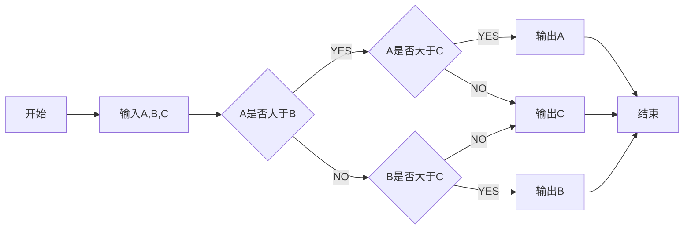

# BLE 相关资料

## 1. android APK

Name:

skill:



```flow
st=>start: Start|past:>http://www.google.com[blank]
e=>end: End:>http://www.google.com
op1=>operation: My Operation|past
op2=>operation: Stuff|current
sub1=>subroutine: My Subroutine|invalid
cond=>condition: Yes 
or No?|approved:>http://www.baidu.com
c2=>condition: Good idea|rejected
io=>inputoutput: catch something...|request

st->op1(right)->cond
cond(yes, right)->c2
cond(no)->sub1(left)->op1
c2(yes)->io->e
c2(no)->op2->e
```

```sequence
Title:连接建立的过程
客户主机->服务器主机: 连接请求（SYN=1,seq=client_isn） 
服务器主机->客户主机: 授予连接（SYN=1,seq=client_isn）\n ack=client_isn+1
客户主机->服务器主机: 确认（SYN=0,seq=client_isn+1）\nack=server_isn+1
```
