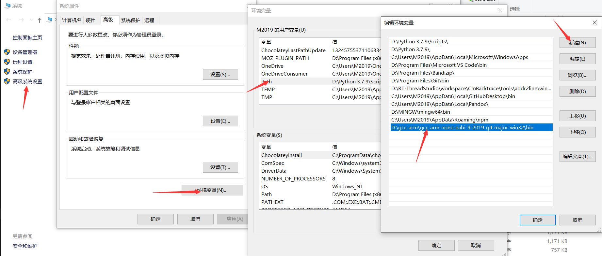
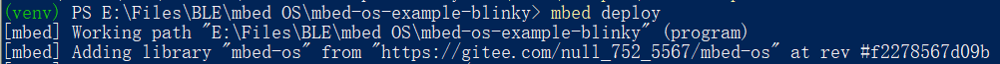
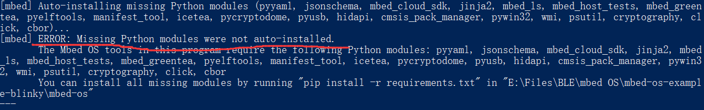
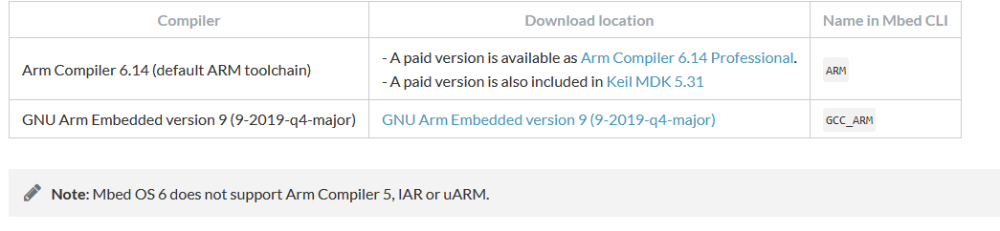

# mbed OS  quick start

## mbed OS依赖

首先先要搞清楚mbed OS有哪些依赖：

build依赖：

- python2或者3
- Mercurial 这个是依赖包，如果需要执行mbed deploy则需要这个软件来处理依赖
- pip3
- git
- pip中需要安装requirement.txt中所有包

mbed 生态提供了以下几种工具：

- [在线IDE](https://ide.mbed.com/compiler/)

- [mbed studio](https://os.mbed.com/studio/)
- [mbed cli](https://os.mbed.com/docs/mbed-os/v6.5/build-tools/install-and-set-up.html)

mbed cli 最新的windows版本是2018年的，估计停止更新了，所以我们不能选择[mbed cli for windows]([Releases · ARMmbed/mbed-cli-windows-installer (github.com)](https://github.com/ARMmbed/mbed-cli-windows-installer/releases))来安装了

mbed cli 分为[mbed cli1](https://os.mbed.com/docs/mbed-os/v6.5/build-tools/mbed-cli-1.html)和[mbed cli2](https://os.mbed.com/docs/mbed-os/v6.5/build-tools/mbed-cli-2.html)

## 开始安装

### 第一步

先安装git和python3

```
sudo apt install python3 python3-pip git mercurial
```

windows 环境下 mercurial 可以直接在 pyhon 里安装，输入：

```
python3 -m pip install mercurial
```

### 第二步修改pip国内源

改下pip3为国内源 ，因为后面pip会装很多东西。

新建文件~/.pip/pip.conf

输入

```
[global]
index-url = https://pypi.tuna.tsinghua.edu.cn/simple
[install]
trusted-host=mirrors.aliyun.com
```

windows 更换国内源如下：直接在 user 目录中创建一个 pip 目录，如：`C:\Users\xx\pip` ，新建文件 `pip.ini`，内容如下：

```
[global]
index-url = https://pypi.tuna.tsinghua.edu.cn/simple
```

### 第三步安装pip3中的mbed

通过pip3来安装mbed-cli

```
python3 -m pip install mbed-cli
```

安装完了之后确认下mbed的版本号（一定要确认版本是1.10以后的版本才好用）：

```
mbed-cli --version
1.10.5
mbed  --version
1.10.5
```

如果后续需要升级的话，执行命令：

```
python3 -m pip install -U mbed-cli
```

### 第四步下载GCC工具链

可以用命令来安装

```
sudo apt-get install gcc-arm-none-eabi
```

之后就可以直接编译了

也可以直接去官方下载对应的[gcc-arm-none-eabi-9-2019-q4-major-x86_64-linux.tar.bz2](https://developer.arm.com/-/media/Files/downloads/gnu-rm/9-2019q4/gcc-arm-none-eabi-9-2019-q4-major-x86_64-linux.tar.bz2?revision=108bd959-44bd-4619-9c19-26187abf5225&la=en&hash=E788CE92E5DFD64B2A8C246BBA91A249CB8E2D2D)包解压之后，添加对应的路径

mbed config -G GCC_ARM_PATH "/opt/gcc-arm-none-eabi-9-2019-q4-major/bin"

最后只要命令，可以显示即可：

```
arm-none-eabi-gcc -v
```

windwos 环境下需下载 [gcc-arm-none-eabi-9-2019-q4-major-win32.zip](https://developer.arm.com/-/media/Files/downloads/gnu-rm/9-2019q4/gcc-arm-none-eabi-9-2019-q4-major-win32.zip?revision=20c5df9c-9870-47e2-b994-2a652fb99075&la=en&hash=347C07EEEB848CC8944F943D8E1EAAB55A6CA0BC) ，由于下载速度很慢，我在企业微信的网盘里放了一份备份，在 "蓝牙相关资料 - IDE相关 - gcc-arm-non-eabi" 里。解压缩该文件，将其 bin 目录对应的路径添加到用户 PATH 环境变量里，



输入

```C
arm-none-eabi-gcc -v
```

验证是否安装环境成功。

### 第五步导入官方代码

官方在[github](https://github.com/ARMmbed)账号上提供了许多示例程序，比如

- 蓝牙相关的sample [mbed-os-example-ble](https://github.com/ARMmbed/mbed-os-example-ble)

- 经典的闪灯程序[mbed-os-example-blinky](https://github.com/ARMmbed/mbed-os-example-blinky)


我们以mbed-os-example-blinky 闪灯程序为例，正规流程是：

先git clone 代码

```
git clone https://github.com/ARMmbed/mbed-os-example-blinky.git
```

进入文件夹`cd mbed-os-example-blinky`

然后执行：

```
mbed deploy
```

这边我们会发现mbed deploy会非常慢；

这边我解释一下mbed deploy做了哪些事情

- 第一件事情是下载[mbed-os](https://github.com/ARMmbed/mbed-os)整个软件包到sample目录下

相当于执行了

```
git clone https://github.com/ARMmbed/mbed-os.git
```

这一步有以下优化方案：

1. 直接用将仓库挪到gitee中(这个可以自行百度)
2. 然后修改sample下面的`mbed-os.lib`  文件修改里面的路径

- 第二件事请，下下来mbed-os之后，会执行pip install -r requirement.txt

  requirement.txt中包含了很多pip的依赖包，这个我们已经改了国内源，就已经很快了。


修改过mbed-os.lib之后，再次执行`mbed deploy`

在 win10 powershell 里执行 `mbed deploy` 可能会在这里一直卡着不动：



这里后台在执行 git clone 的操作，我这里等了大概 20 分钟，一直在这不动，而且文件夹的大小一直为 1.03GB 不变，应该是哪里出现了 bug，此处多按几下回车，



然后发现报错，需要手动安装 python 环境，进入 `mbed-os` 目录使用 `pip install -r requirements.txt` 。

### 第六步开始编译代码

编译代码之前需要配置两个因素,这里配置过之后就不需要配置了：

1. 配置板子的配置，

   板子的选择有以下选择，可以找到支持的开发板NUCLEO_WB55RG：

   ```
   ADV_WISE_1510,          ADV_WISE_1570,          ARCH_MAX,
   ARCH_PRO,               ARDUINO_NANO33BLE,      ARM_CM3DS_MPS2,
   ARM_MPS2_M0,            ARM_MPS2_M0P,           ARM_MPS2_M3,
   ARM_MPS2_M4,            ARM_MPS2_M7,            ARM_MUSCA_B1,
   ARM_MUSCA_B1_NS,        ARM_MUSCA_S1,           ARM_MUSCA_S1_NS,
   B_L4S5I_IOT01A,         CY8CKIT064B0S2_4343W,   CY8CKIT_062S2_43012,
   CY8CKIT_062_BLE,        CY8CKIT_062_WIFI_BT,    CY8CPROTO_062S3_4343W,
   CY8CPROTO_062_4343W,    CYSBSYSKIT_01,          CYTFM_064B0S2_4343W,
   CYW9P62S1_43012EVB_01,  CYW9P62S1_43438EVB_01,  DISCO_F413ZH,
   DISCO_F429ZI,           DISCO_F469NI,           DISCO_F746NG,
   DISCO_F769NI,           DISCO_H747I,            DISCO_H747I_CM4,
   DISCO_H747I_CM7,        DISCO_L072CZ_LRWAN1,    DISCO_L475VG_IOT01A,
   DISCO_L476VG,           DISCO_L496AG,           DISCO_L4R9I,
   DISCO_L562QE,           EFM32GG11_STK3701,      EFM32GG_STK3700,
   EP_AGORA,               EP_ATLAS,               EV_COG_AD3029LZ,
   EV_COG_AD4050LZ,        FF1705_L151CC,          FF_LPC546XX,
   FVP_MPS2_M0,            FVP_MPS2_M0P,           FVP_MPS2_M3,
   FVP_MPS2_M4,            FVP_MPS2_M7,            GD32_F307VG,
   GD32_F450ZI,            GR_LYCHEE,              GR_MANGO,
   HEXIWEAR,               K22F,                   K64F,
   K66F,                   K82F,                   KL25Z,
   KL43Z,                  KL46Z,                  KW41Z,
   LPC1114,                LPC1768,                LPC54114,
   LPC546XX,               MAX32600MBED,           MAX32620FTHR,
   MAX32625MBED,           MAX32625PICO,           MAX32630FTHR,
   MIMXRT1050_EVK,         MOTE_L152RC,            MTS_DRAGONFLY_F411RE,
   MTS_DRAGONFLY_F413RH,   MTS_DRAGONFLY_L471QG,   MTS_MDOT_F411RE,
   NRF52840_DK,            NRF52_DK,               NUCLEO_F070RB,
   NUCLEO_F072RB,          NUCLEO_F091RC,          NUCLEO_F103RB,
   NUCLEO_F207ZG,          NUCLEO_F303K8,          NUCLEO_F303RE,
   NUCLEO_F303ZE,          NUCLEO_F401RE,          NUCLEO_F411RE,
   NUCLEO_F412ZG,          NUCLEO_F413ZH,          NUCLEO_F429ZI,
   NUCLEO_F439ZI,          NUCLEO_F446RE,          NUCLEO_F446ZE,
   NUCLEO_F746ZG,          NUCLEO_F756ZG,          NUCLEO_F767ZI,
   NUCLEO_G031K8,          NUCLEO_G071RB,          NUCLEO_G474RE,
   NUCLEO_H743ZI2,         NUCLEO_H7A3ZI_Q,        NUCLEO_L073RZ,
   NUCLEO_L152RE,          NUCLEO_L432KC,          NUCLEO_L433RC_P,
   NUCLEO_L452RE_P,        NUCLEO_L476RG,          NUCLEO_L486RG,
   NUCLEO_L496ZG,          NUCLEO_L496ZG_P,        NUCLEO_L4R5ZI,
   NUCLEO_L4R5ZI_P,        NUCLEO_L552ZE_Q,        NUCLEO_WB55RG,
   NUMAKER_IOT_M252,       NUMAKER_IOT_M263A,      NUMAKER_IOT_M487,
   NUMAKER_PFM_M453,       NUMAKER_PFM_M487,       NUMAKER_PFM_NANO130,
   NUMAKER_PFM_NUC472,     RHOMBIO_L476DMW1K,      RZ_A1H,
   S1SBP6A,                S5JS100,                SDP_K1,
   SDT32620B,              SDT32625B,              SDT52832B,
   SDT64B,                 SFE_ARTEMIS,            SFE_ARTEMIS_ATP,
   SFE_ARTEMIS_DK,         SFE_ARTEMIS_MODULE,     SFE_ARTEMIS_NANO,
   SFE_ARTEMIS_THING_PLUS, SFE_EDGE,               SFE_EDGE2,
   TB_SENSE_12,            TMPM46B,                TMPM4G9,
   UHURU_RAVEN,            WIO_3G,                 WIO_BG96,
   WIO_EMW3166,            XDOT_L151CC
   ```

2. 设置开发板 `mbed target NUCLEO_WB55RG

3. 设置toolchain输入命令 ` mbed toolchain GCC_ARM` 根据文档我们可以知道用GCC_ARM

toolchain 有两种一种是ARM 一种是GCC_ARM



最后编译代码

```
mbed compile
```


### 第七步下载代码

插上 WB55 ST-Link 的 USB 口，此时会弹出一个挂载的目录，将生成的 bin 文件复制到该目录即可。bin 文件在 `BUILD\NUCLEO_WB55RG\GCC_ARM\mbed-os-example-blinky.bin` 。

之后会发现 LED1 蓝灯以 500ms 闪烁。

