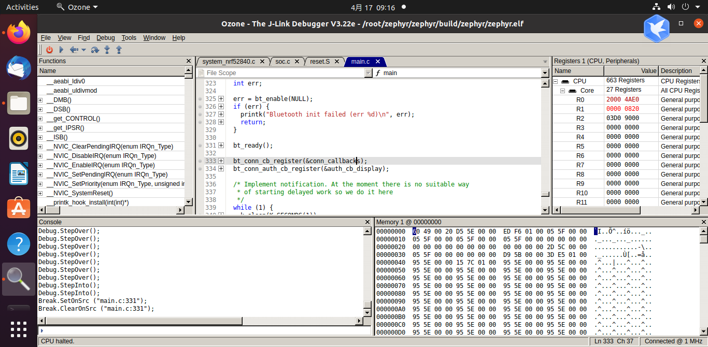
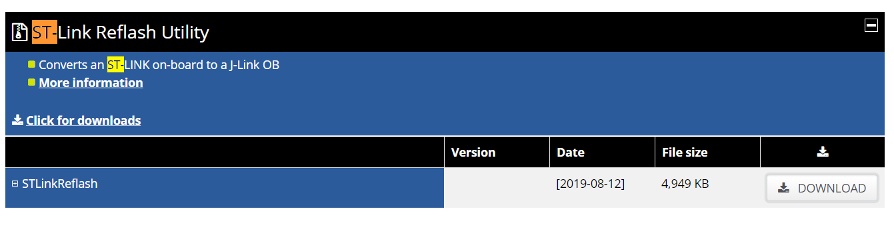

# 嵌入式调试

## Ozone

这个是jlink的调试工具，还是蛮厉害的，gui显示，debug信息

## STLINK 刷成J-LINK

[st-link reflash utility](https://www.segger.com/downloads/jlink/#STLink_Reflash)

STLINK刷成J-LINK之后，只能使用STM32的板子，不支持其他开发板

https://club.rt-thread.org/ask/article/2348.html

## JLINK如何烧入hex文件

