# 玩转doxygen 之RT-THREAD

## 文章目标

经常会看到小伙伴们遇到怎么写函数注释头疼，以及如何生成漂亮的代码注释文档头疼。据我了解，目前C语言中的代码注释规则有且只有一种比较常用，就是doxygen。所以掌握doxygen，对于我们写出漂亮的注释，至关重要。本文就教大家如何写doxygen，以及在RT-THREAD上如何整理出漂亮的API说明文档。

## 如何在RT-THREAD上生成doxygen

先教大家怎么操作，最近正好我整理了一下，发现RT-THREAD上面的doxygen

https://github.com/RT-Thread/rt-thread/tree/master/documentation/doxygen

生成不了文档，有些路径已经变掉了。所以帮大家修复了一下。

https://github.com/RT-Thread/rt-thread/pull/6217

现在大家只要下载最新的代码2022.8.4号之后的代码就可以了。

### 下载代码和软件

- 首先将rt-thread的源码https://github.com/RT-Thread/rt-thread/  下下来，可以用下面的命令

```
git clone git@git.zhlh6.cn:RT-Thread/rt-thread.git --depth=1
```

- 下载doxygen的软件（在doxygen文件夹中的readme.md）https://doxygen.nl/index.html

下载step安装包就行doxygen-1.9.4-setup.exe

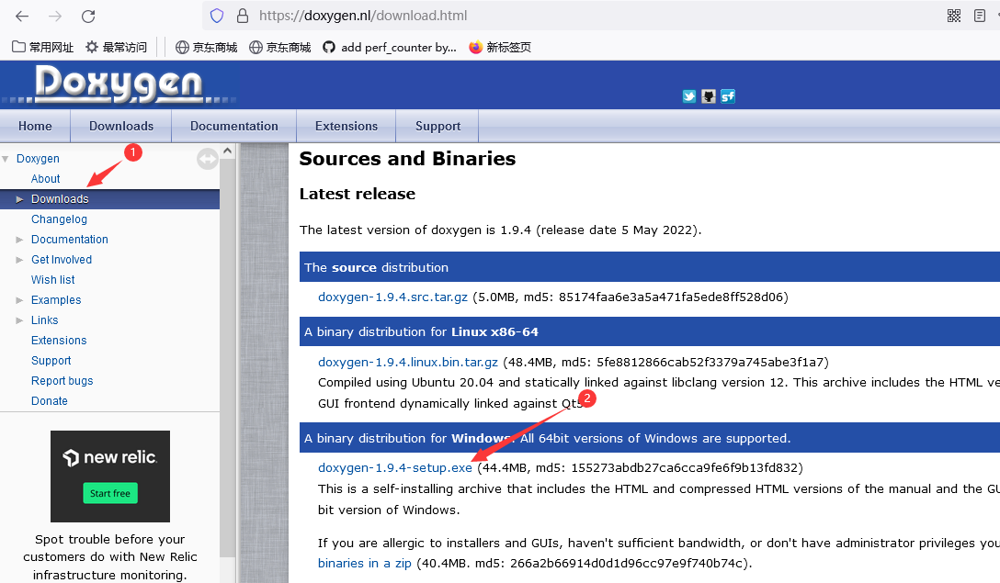

- 安装doxygen，安装的时候没有什么需要注意的，直接下一步下一步就可以了。

### 生成html文档

我们打开刚才安装的软件`Doxywizard`

在菜单`File`中`Open` 打开刚才下的RT-THREAD中的如下文件`rt-thread/documentation/doxygen/Doxyfile`

然后直接运行`run` 就可以了，所有操作完成。

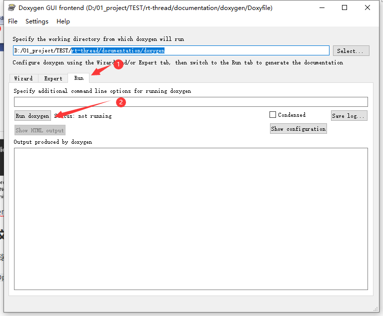

如果想看中文，也可以根据下面的设置来选择中文

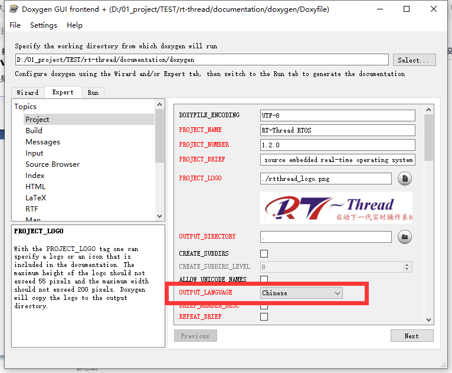

### 打开html文档

找到生成的`html`文件夹打开`index.html`文件就可以了

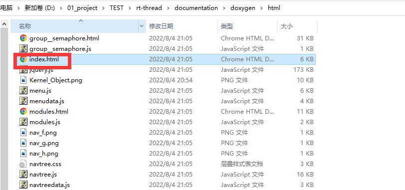

### 展现效果

接下来我们就可以看到效果图了，可以看到很多src目录下面大家写的一些注释

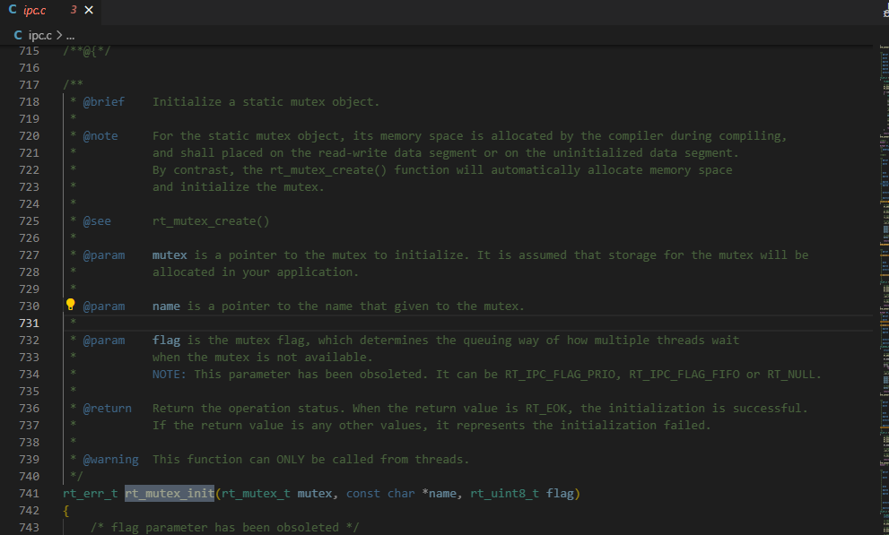

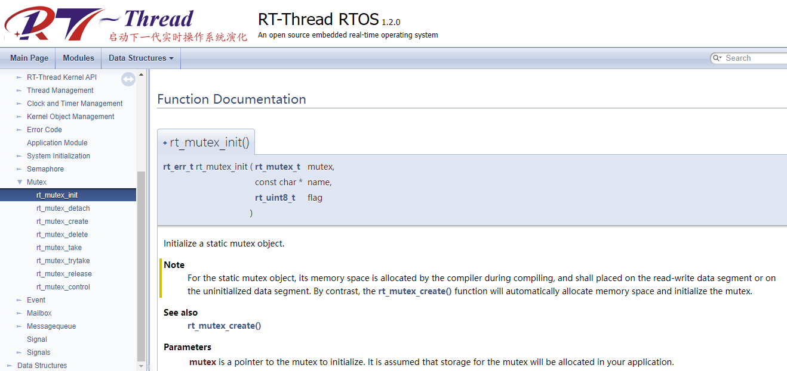

上面基本就是RT-THREAD的doxygen的使用方法了。是不是很简单，很方便？

下面简单介绍下如何自己写doxygen。

##  Doxygen 如何写

### vscode 插件安装

我们先讲讲doxygen怎么写。传统方法直接用文本编辑器来写，这个我这边就不多介绍了。这边我们用一个工具来帮助我们来写常用的doxygen。打开vscode， 安装插件doxygen

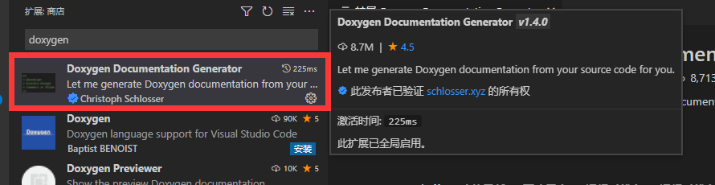

这个插件一共有两种操作

- 在源码文件中头部输入·`/**`  ，然后直接按回车键，你可以看到自动生成的注释了。

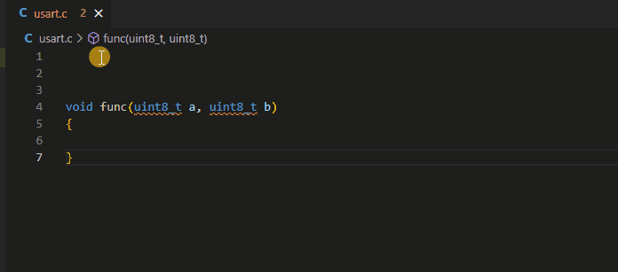

- 在写好的函数的上面输入`/**` , 然后也是按回车键，你就看也看到效果了。

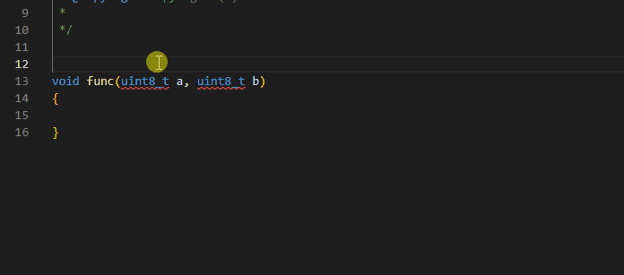

### doxygen文件生成

只要打开Doxygen工具，选择source 文件夹，之后点击`run` 就可以了

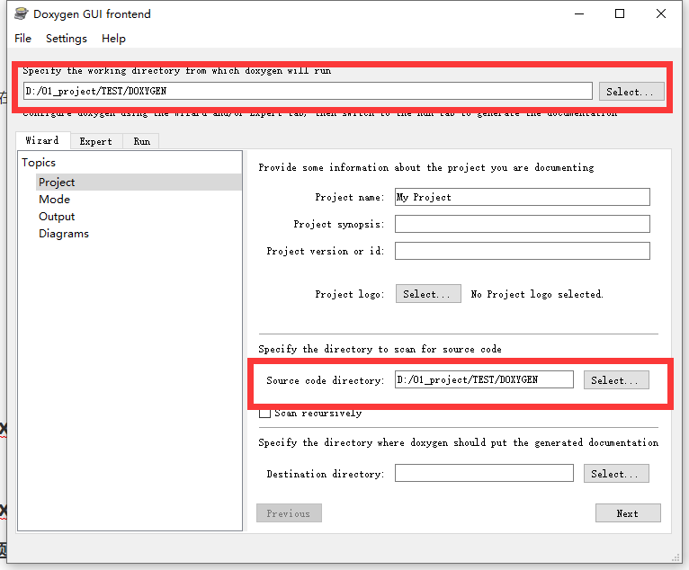

### doxygen配置

doxygen的配置其实有很多很多，这边我就举几个常用的配置。

下面的配置可以生成左侧的树状图，方便查看。其他的配置不一一介绍了。

想了解的可以参考链接

https://mp.weixin.qq.com/s/HA352TEBELNJ9pgCTMkWIg

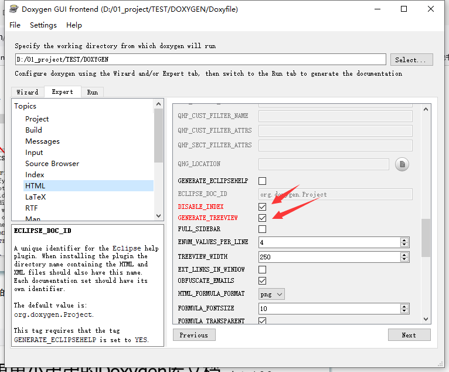

### doxygen写的时候一些建议

#### 问题一： doxygen的函数注释写在头文件中还是源文件中？

这个因不同公司角色而已。如果你的代码是作为lib的话。.c是不开放给客户的，这个时候，写在.h中比较好。

如果你是做开源的，源文件可以开放出来，这个时候，放在.c里面比较好。总之，只要放一个地方就行，其他地方不需要按照doxygen来写。

#### 问题二: 