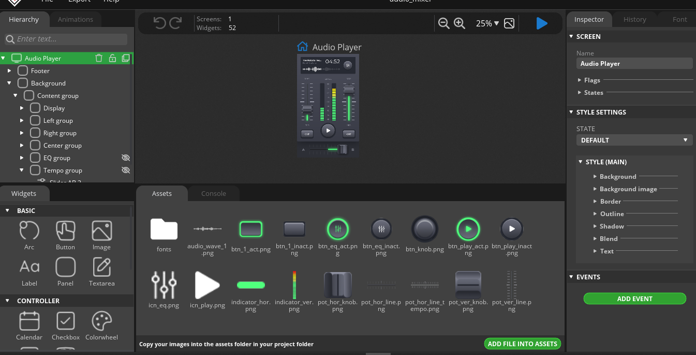
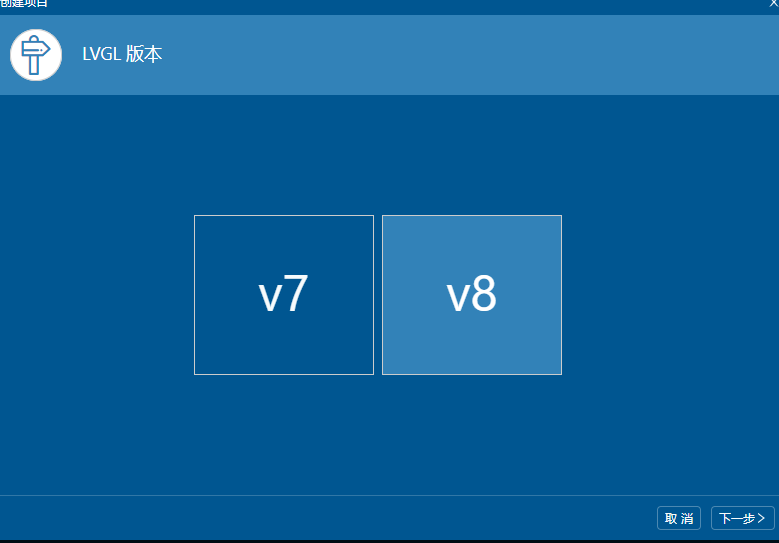
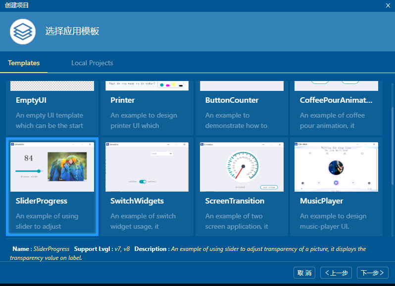
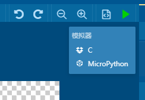
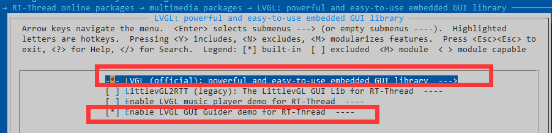
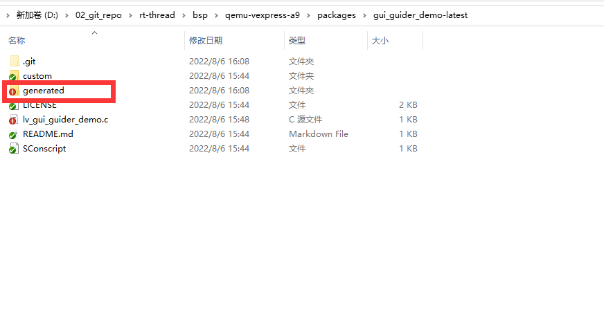
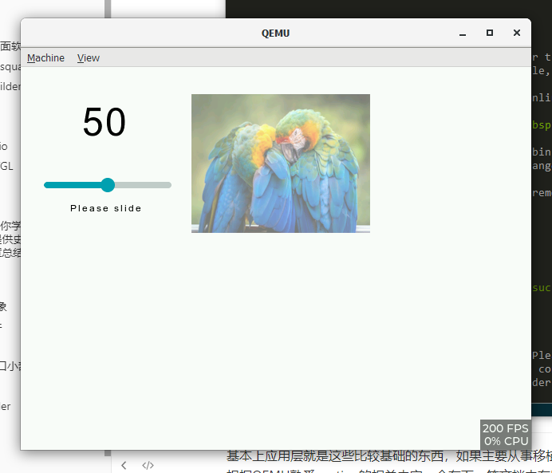

# LVGL 学习小计 --（一） 应用层

## 简介

GUI 是嵌入式里面常用的领域，有手表等应用来开发很多应用领域。LVGL是一款免费的GUI。实际上GUI很多都是收费的，像QT等都是收费的。而LVGL就是免费的它用的license是MIT license。可以免费商用。由于是商用免费的，所以如果您觉得好用，欢迎来一起维护，因为这个项目也是一些开源开发者在业余时间服务大家的，您也可以通过捐献来支持这些项目，或者帮忙推广，翻译文档等。

### 硬件要求

- FLASH >64KB （推荐180KB)

- RAM > 8KB (推荐24KB)

- C99语法

LVGL大体上有两个方向，

- 应用层设计界面

- 移植层主要涉及到如何快速将LVGL应用到其他的芯片开发板上

本文先讲一下应用层如何设计界面，先用起来。然后会根据实际操作如何让LVGL快速使能起来

### 应用层设计界面软件

一个方向是应用和设计GUI等漂亮的界面，这个方向其实更适合女生，通常是调用一些API等来实现漂亮的功能。由于LVGL的易拓展性，有很多种平台来设计界面软件：

#### 官方设计器squareline

https://squareline.io/

这个设计器的界面非常漂亮，个人免费使用，不能商用，商用要收费129美元一个月一个人，还是挺贵的。想要设计的好看一点，自己玩玩的，可以用这个来设计界面

下面这个页面是example。确实很漂亮。

https://squareline.io/demos



#### NXP gui builder

https://www.nxp.com/design/software/development-software/gui-guider:GUI-GUIDER

NXP官方提供了一款NXP的GUI BUILDER 工具，免费的。对NXP的平台支持的很好，目前支持到8.2.0 版本。最新的8.3.0版本不支持。其他平台也可以使用这个工具来学习LVGL。很方便

### LVGL模拟器

上面介绍的是设计软件，如何拖控件等，类似于C#，JAVA等visual studio等工具设计界面。下面介绍几款LVGL 模拟器。也就是说你有LVGL的code。想跑一下看下demo的效果如何。

模拟器也是学习GUI的一个很重要的工具，你可以不用开发板，直接先试着了解LVGL里面的基本的原理，可以不需要购买昂贵的硬件开发板。官方介绍有以下几种模拟器：

官方链接

https://docs.lvgl.io/master/get-started/platforms/pc-simulator.html

- [Eclipse with SDL driver](https://github.com/lvgl/lv_sim_eclipse_sdl): Linux 和 Mac

- [CodeBlocks](https://github.com/lvgl/lv_sim_codeblocks_win): Windows （简单方便推荐使用）

- [VisualStudio with SDL driver](https://github.com/lvgl/lv_sim_visual_studio_sdl): Windows

- [VSCode with SDL driver](https://github.com/lvgl/lv_sim_vscode_sdl): Linux 和 Mac

- [PlatformIO with SDL driver](https://github.com/lvgl/lv_platformio): Linux 和 Mac

以上几种模拟器都可以根据官方文档模拟成功，

我额外添加几款模拟器QEMU ， visual studio

#### QEMU

https://github.com/RT-Thread/rt-thread/tree/master/bsp/qemu-vexpress-a9

RT-THREAD 官方提供的QEMU 就可以跑lvgl

这个非常好用，也可以用RT-STUDIO 跑qemu等应用，直接看readme就可以了。

#### Visual Studio

https://github.com/RT-Thread/rt-thread/tree/master/bsp/simulator

这个也是RT-THREAD提供的BSP ，也是可以模拟的，如果你以前用visual studio用的比较多的话，可以看下这个bsp,也是可以跑LVGL的。具体的如何使用可以参考视频 

```
RT-Thread社区与LVGL社区梦幻联动：教你如何基于RT-Thread运行LVGL官方软件包  
https://www.bilibili.com/video/BV1YM4y1F7fX?from=search&seid=5764906851487910438&spm_id_from=333.337.0.0
```

## 如何学习设计LVGL

NXP的gui builder功能基本够用了，能够设计出很多漂亮的demo了。

先第一步熟悉熟悉官方的几个demo，脑子里大概有一些概念，下面我提供几个API教程。

如果想要更酷炫的界面，而且不考虑商用的话，可以学习squareline 设计器，确实很漂亮。

### 官方API文档

https://docs.lvgl.io/master/widgets/index.html

官方文档肯定是比较详细的，也比较正规的。所以一定要稍微知道网站在哪里。可以去查。

中文翻译

http://lvgl.100ask.net

韦东山提供了一版中文翻译版本，很方便英文看起来费劲的小伙伴。

### CSDN教程

### 一篇文章足够你学习嵌入式GUI LVGL技术，提供史上最全的LVGL技术文章总结，文档代码下载总结）

[一篇文章足够你学习嵌入式GUI LVGL技术，提供史上最全的LVGL技术文章总结，文档代码下载总结）_Wireless_Link的博客-CSDN博客_lvgl](https://blog.csdn.net/XiaoXiaoPengBo/article/details/114055618?ops_request_misc=%257B%2522request%255Fid%2522%253A%2522165868163516780357268870%2522%252C%2522scm%2522%253A%252220140713.130102334..%2522%257D&request_id=165868163516780357268870&biz_id=0&utm_medium=distribute.pc_search_result.none-task-blog-2~all~top_click~default-3-114055618-null-null.142^v33^new_blog_fixed_pos,185^v2^control&utm_term=lvgl%E6%95%99%E7%A8%8B&spm=1018.2226.3001.4187)

这篇CSDN讲的比较好，可以如果想设计好看的界面可以深入学习一下。

## LVGL 入门知识

#### Objects 对象

#### EVENT 事件

#### style风格

#### Widgets窗口小部件

按钮，滑块，标签，图标等图形化组件就叫做窗口小部件。在文档Widgets（小部件）中可以找到列表

## qemu实战

讲了这么多应用的东西，那究竟我们要怎么用呢？这边因为每个人的开发板都不一样，以qemu为例，上层设计以`NXP gui builder`为工具设计。

###  NXP gui builder

首先我们先用NXP 来简单设计一个demo

版本选择v8版本



随便找个 demo



然后直接生成工程




这个时候我就可以看到界面图片了。

找到工程下面的`generated`文件夹， 将这个文件夹全部复制到qemu的目录下面

### qemu 设置

qemu里面

选中软件包



之后找到对应的软件包中的`generated` 文件夹



将刚才`gui builder`  中的文件夹里面的东西全部替换过来。

这边弄好之后，直接实行`scons -j4` 进行编译

会发现有些编译错误找不到lvgl.h

主要将`lvgl/lvgl.h` 改成`lvgl.h`即可

编译之后生成之后执行`./qemu.bat`

就可以看到效果了



## 总结

基本上应用层就是这些比较基础的东西，如果主要从事移植层相关的东西，其实只需要熟悉QEMU如何使用即可，根据QEMU熟悉porting的相关内容，会在下一篇文档中有所介绍。当然如果想要设计出漂亮的界面的话，这篇文章里面的链接基本够用和够学了，主要建议用nxp builder来构建或者用官方的工具来学习构建（如果不商用的话）。

## 参考文档

开发板的入门教程：https://lvgl.io/developers

LVGL的教程和文档：https://docs.lvgl.io/。

韦东山老师提供了LVGL中文文档：http://lvgl.100ask.net

## PORTING 篇

https://github.com/supperthomas/LVGL_F407_PORING_GUID