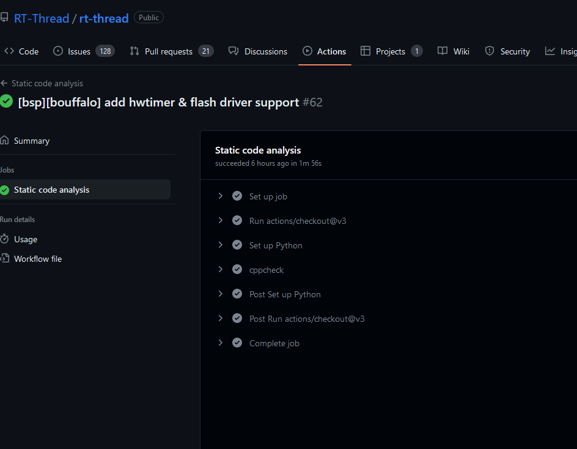
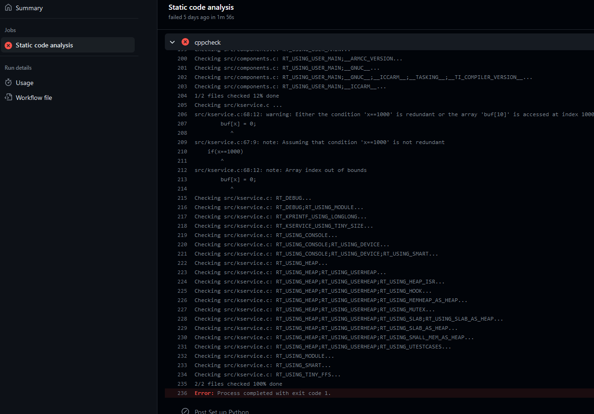

# RTTHREAD静态代码检测

## 简介

之前有接触过cppcheck等静态代码检查工具。

我们先看下cppcheck有哪些作用

Cppcheck是一个开源的静态代码分析工具，被广泛应用于C / C++工程环境中。它能够自动分析C / C++代码，并给出静态分析报告。Cppcheck能够捕捉到的错误包括内存管理错误、线程安全问题、不安全的类型转换、未初始化的变量、代码重复等。

作为一款静态代码分析工具，Cppcheck的作用不仅仅只是检测代码缺陷和错误，还能够对代码进行质量分析，评估代码的可读性和可维护性。

下面是Cppcheck的具体作用：

1. 帮助发现潜在问题

Cppcheck可以检测C/C++代码中存在的内存泄漏、缓冲区溢出等错误，发现潜在的问题后可以及时进行修复，提高代码质量。

2. 提高代码的可读性

当代码无法清晰地表达其实现时，它就很难让其他开发人员理解，这往往会导致项目的延误和维护成本的上升。Cppcheck可以检测代码中语法错误、拼写错误以及未使用的变量和函数等等，优化代码的可读性。

3. 降低测试成本

代码错误可能会影响整个应用程序的完整性和安全性。使用Cppcheck可以检测出潜在的问题，并在代码提交之前通知开发人员，降低测试成本，加速开发流程。

4. 保障代码安全

在代码开发过程中，必须确保代码不会被攻击者利用来攻击系统。使用Cppcheck可以帮助发现潜在问题，如未定义的行为、缓冲区溢出等，从而提高代码的安全性。

总之，Cppcheck不仅可以帮助您检测代码中存在的错误，还能够提高代码质量、降低测试成本、保障代码安全。它在各个行业中都有广泛应用，是开发过程中不可或缺的利器。

## 如何使用cppcheck

那cppcheck如此好用，我们如何在RTTHREAD中使用它呢？

之前我有讲过一篇文章，简单介绍下如何在git hook中集成cppcheck。

[ 看完这篇文章再也不用担心代码格式不对无法合并了 ](https://club.rt-thread.org/ask/article/ba9a96bb1e6da349.html)

大概知道cppcheck只需要一句话命令即可：

```
cppcheck --enable=warning,performance,portability --inline-suppr --error-exitcode=1 --force $changed_files
```

下面是具体的参数含义：

`--enable`：

该参数后跟一个逗号分隔的选项列表，用于启用Cppcheck的指定检查项。其中，`warning`、`performance`和`portability`分别表示启用警告、性能和可移植性检查。如上例所示，启用这些选项将有助于检测C/C++代码中存在的缺陷和不良编程实践。

`--inline-suppr`：

该参数用于启用行内禁止指令，即将用于禁止某些错误或者警告的注释作为代码的一部分。这样，Cppcheck会在分析源代码时跳过这些部分而不会对其进行警告或错误提示。

`--error-exitcode=`：

该参数后跟一个表示Cppcheck错误数量阈值的整数值。在Cppcheck检查出的错误数量超过此阈值时，Cppcheck将返回1，以表示检查失败。否则，返回0。

`--force`：

该参数用于强制Cppcheck分析所有源代码文件，即使它们已经被标记为通过行内禁止指令禁用。如果您使用了行内禁止指令，但仍希望Cppcheck分析被禁止的文件，可以使用此选项。

## 如何在RTTHREAD中集成cppcheck

我们都知道在github仓库中，有个github action，用来自动化集成处理一些PR的内容的。

我们可以在下面目录中新建一个`/.github/workflows/static_code_analysis.yml` 下面的yml里面是所有内容

```
name: Static code analysis

on: 
  pull_request:
    branches:
      - master

jobs:
  scancode_job:
    runs-on: ubuntu-latest
    name: Static code analysis
    steps:
      - uses: actions/checkout@v3
      - name: Set up Python
        uses: actions/setup-python@v3
        with:
          python-version: 3.8
      
      - name: cppcheck
        shell: bash
        run: |
          sudo apt-get update
          sudo apt-get -qq install cppcheck
          git remote -v
          git fetch origin
          cppcheck --version
          ls
          git branch -a
          changed_files=$(git diff --name-only HEAD origin/master | grep -E '\.(c|cpp|cc|cxx)$' || true)
          if [ -n "$changed_files" ];then
              cppcheck --enable=warning,performance,portability --inline-suppr --error-exitcode=1 --force $changed_files
              err=$?
              if [ $err -ne 0 ]; then
                  echo "CPPCHECK REPORT, PLEASE CHECK THE WARNING !!!!!!!!!"
              fi
          fi
```

这里我们设定只有在PR的时候回去检查，

检查的时候，采用ubuntu， 安装cppckeck使用命令`sudo apt-get -qq install cppcheck`

然后我们需要整理出需要检查的.c文件，

通过命令`git diff --name-only HEAD origin/master | grep -E '\.(c|cpp|cc|cxx)$'` 我们可以找到你当前branch和主分支上的差异文件，并且过滤出.c的源文件进行静态代码检测。

具体的检测成功的效果图：



检测失败的效果图：



## 最后总结

cppcheck只检查.c文件，所以它没有对.h文件综合检查，只是检查一些编译不会检查的漏洞，比如数组越界等。

所以只是给一些PR的小伙伴做参考，如果你觉得代码没有太大必要修改，可以不用管这个CI的检查结果。当然如果觉得有必要修复，可以尝试修复以下。

我们暂且试运行一段时间，如果你有更好的解决方案能够做一些静态代码检查，也欢迎PR一起来维护，

