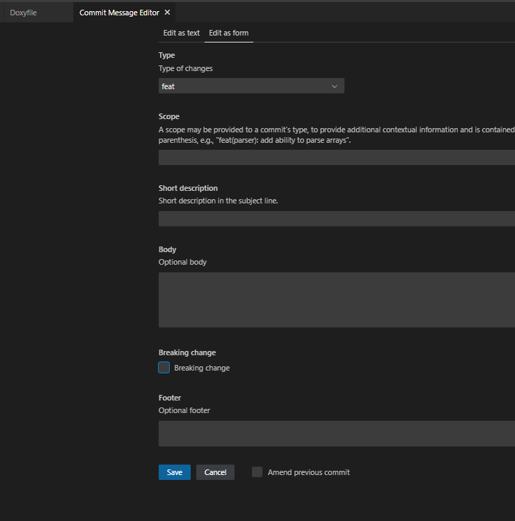

# git commit

## 简介

本文将讲述git commit如何比较规范的写作，通常git commit 每家做法不一样，

## 为什么要规范git commit

为什么要git commit要规范呢？

#### 1. **提高可读性和透明度**

  - **清晰的历史记录**：每个提交信息都清晰地说明了其目的，比如是修复了一个 bug、增加了一个功能，还是对代码进行了重构。这使得其他开发者可以快速理解每次提交的背景。
  - **易于跟踪**：特定格式的提交信息更容易被浏览和搜索，特别是在解决错误或回顾项目历史时。

#### 2. **自动化支持**

  - **生成变更日志**：如果提交信息遵循一定的格式，可以自动化地生成变更日志。这对于维护项目版本历史、生成版本发布说明等非常有用。
  - **自动版本控制**：工具如 Semantic Release 可以根据提交信息自动决定版本号的变更（主要版本、次要版本或补丁）。例如，`feat:` 可能触发次要版本更新，而 `fix:` 则可能只触发补丁版本更新。

#### 3. **改善团队协作**

  - **统一的提交标准**：当所有团队成员都采用相同的提交信息格式时，协作变得更为顺畅。新成员也可以更快地了解项目和其历史。
  - **减少混乱**：在团队中，清晰且预测性强的提交信息可以减少误解和错误，尤其是在快速迭代的开发环境中。

#### 4. **促进代码审查**

  - **高效的审查过程**：规范的提交信息让审查者一目了然地知道每个提交的目的，从而更快地进行代码审查。
  - **侧重点明确**：审查者可以根据提交类型（如功能添加、错误修复或重构）调整他们的关注点。

#### 5. **增强项目的可维护性**

  - **易于管理**：长期项目中，规范化的提交信息使得未来的维护者可以更容易地理解代码历史，识别引入问题的提交，以及恢复或更新功能。

#### 6. **便于回退和错误修复**

  - **精确定位问题**：如果每个提交都精确描述其更改的范围和目的，当出现问题需要回退时，定位和修复错误将更为简单和直接。

## 如何来写commit

整体框架

```
<type>[optional scope]: <description>

[optional body]

[optional footer(s)]
```


```
<类型>[可选 范围]: <描述>

[可选 正文]

[可选 脚注]
```


类型有以下几个类型

```
feat：表示在代码中添加了一个新的功能
fix：表示在代码库中修复了一个 bug
docs：用于修改文档，例如修改 README 文件、API 文档等；
style： 用于修改代码的样式，例如调整缩进、空格、空行等；
refactor：用于重构代码，例如修改代码结构、变量名、函数名等但不修改功能逻辑；
test：用于修改测试用例，例如添加、删除、修改代码的测试用例等。
perf: 用于优化性能，例如提升代码的性能、减少内存占用等；
chore：用于对非业务性代码进行修改，例如修改构建流程或者工具配置等；
ci: 用于修改持续集成流程，例如修改 Travis、Jenkins 等工作流配置；
```

另外有个特殊的类型，即对API有破坏性的变更

1. **BREAKING CHANGE:** 在脚注中包含 `BREAKING CHANGE:` 或 <类型>(范围) 后面有一个 `!` 的提交，表示引入了破坏性 API 变更（这和语义化版本中的 [`MAJOR`](https://semver.org/lang/zh-CN/#摘要) 相对应）。 破坏性变更可以是任意 *类型* 提交的一部分。

### 举例说明

这是一个新功能，带有破坏性的提交

```
feat: allow provided config object to extend other configs

BREAKING CHANGE: `extends` key in config file is now used for extending other config files
```


包含了！的破坏性提交说明：

```
feat!: send an email to the customer when a product is shipped
```


总结一下就是：`!` 代表对API有破坏性提交的

如果需要说明，下面添加`BREAKING CHANGE`  来说明具体破坏性提交在哪

### 约定

1. 每个提交都**必须**使用类型字段前缀，它由一个名词构成，诸如 `feat` 或 `fix` ， 其后接**可选的**范围字段，**可选的** `!`，以及**必要的**冒号（英文半角）和空格。
2. 当一个提交为应用或类库实现了新功能时，**必须**使用 `feat` 类型。
3. 当一个提交为应用修复了 bug 时，**必须**使用 `fix` 类型。
4. 范围字段**可以**跟随在类型字段后面。范围**必须**是一个描述某部分代码的名词，并用圆括号包围，例如： `fix(parser):`
5. 描述字段**必须**直接跟在 <类型>(范围) 前缀的冒号和空格之后。 描述指的是对代码变更的简短总结，例如： *fix: array parsing issue when multiple spaces were contained in string* 。
6. 在简短描述之后，**可以**编写较长的提交正文，为代码变更提供额外的上下文信息。正文**必须**起始于描述字段结束的一个空行后。
7. 提交的正文内容自由编写，并**可以**使用空行分隔不同段落。
8. 在正文结束的一个空行之后，**可以**编写一行或多行脚注。每行脚注都**必须**包含 一个令牌（token），后面紧跟 `:<space>` 或 `<space>#` 作为分隔符，后面再紧跟令牌的值。
9. 脚注的令牌**必须**使用 `-` 作为连字符，比如 `Acked-by` (这样有助于 区分脚注和多行正文)。有一种例外情况就是 `BREAKING CHANGE`，它**可以**被认为是一个令牌。
10. 脚注的值**可以**包含空格和换行，值的解析过程**必须**直到下一个脚注的令牌/分隔符出现为止。
11. 破坏性变更**必须**在提交信息中标记出来，要么在 <类型>(范围) 前缀中标记，要么作为脚注的一项。
12. 包含在脚注中时，破坏性变更**必须**包含大写的文本 `BREAKING CHANGE`，后面紧跟着冒号、空格，然后是描述，例如： *BREAKING CHANGE: environment variables now take precedence over config files* 。
13. 包含在 <类型>(范围) 前缀时，破坏性变更**必须**通过把 `!` 直接放在 `:` 前面标记出来。 如果使用了 `!`，那么脚注中**可以**不写 `BREAKING CHANGE:`， 同时提交信息的描述中**应该**用来描述破坏性变更。
14. 在提交说明中，**可以**使用 `feat` 和 `fix` 之外的类型，比如：*docs: updated ref docs.* 。
15. 工具的实现必须**不区分**大小写地解析构成约定式提交的信息单元，只有 `BREAKING CHANGE` **必须**是大写的。
16. BREAKING-CHANGE 作为脚注的令牌时**必须**是 BREAKING CHANGE 的同义词。

## 为什么使用约定式提交

- 自动化生成 CHANGELOG。
- 基于提交的类型，自动决定语义化的版本变更。
- 向同事、公众与其他利益关系者传达变化的性质。
- 触发构建和部署流程。
- 让人们探索一个更加结构化的提交历史，以便降低对你的项目做出贡献的难度。

### emoji

以下关键字还有一个emoji的图标用来比较方便的显示：


feat：表示在代码中添加了一个新的功能
fix：表示在代码库中修复了一个 bug
docs：用于修改文档，例如修改 README 文件、API 文档等；
style： 用于修改代码的样式，例如调整缩进、空格、空行等；
refactor：用于重构代码，例如修改代码结构、变量名、函数名等但不修改功能逻辑；
test：用于修改测试用例，例如添加、删除、修改代码的测试用例等。
perf: 用于优化性能，例如提升代码的性能、减少内存占用等；
chore：用于对非业务性代码进行修改，例如修改构建流程或者工具配置等；
ci: 用于修改持续集成流程，例如修改 Travis、Jenkins 等工作流配置；

下面有对应的匹配信息

| emoji             | emoji 代码                    | commit 说明           | 对应commit |
| ----------------- | ----------------------------- | --------------------- | ---------- |
| 🆕 (全新)          | `:new:`                       | 引入新功能            | feat       |
| 🔖 (书签)          | `:bookmark:`                  | 发行/版本标签         |            |
| 🐛 (bug)           | `:bug:`                       | 修复 bug              | fix        |
| 🚑 (急救车)        | `:ambulance:`                 | 重要补丁              |            |
| 🌐 (地球)          | `:globe_with_meridians:`      | 国际化与本地化        |            |
| 💄 (口红)          | `:lipstick:`                  | 更新 UI 和样式文件    |            |
| 🎬 (场记板)        | `:clapper:`                   | 更新演示/示例         |            |
| 🚨 (警车灯)        | `:rotating_light:`            | 移除 linter 警告      |            |
| 🔧 (扳手)          | `:wrench:`                    | 修改配置文件          |            |
| ➕ (加号)          | `:heavy_plus_sign:`           | 增加一个依赖          |            |
| ➖ (减号)          | `:heavy_minus_sign:`          | 减少一个依赖          |            |
| ⬆️ (上升箭头)      | `:arrow_up:`                  | 升级依赖              |            |
| ⬇️ (下降箭头)      | `:arrow_down:`                | 降级依赖              |            |
| ⚡ (闪电) 🐎 (赛马) | `:zap:` `:racehorse:`         | 提升性能              | perf:      |
| 📈 (上升趋势图)    | `:chart_with_upwards_trend:`  | 添加分析或跟踪代码    |            |
| 🚀 (火箭)          | `:rocket:`                    | 部署功能              |            |
| ✅ (白色复选框)    | `:white_check_mark:`          | 增加测试              | test       |
| 📝 (备忘录) 📖 (书) | `:memo:` `:book:`             | 撰写文档              | docs       |
| 🔨 (锤子)          | `:hammer:`                    | 重大重构              | refactor   |
| 🎨 (调色板)        | `:art:`                       | 改进代码结构/代码格式 | style      |
| 🔥 (火焰)          | `:fire:`                      | 移除代码或文件        |            |
| ✏️ (铅笔)          | `:pencil2:`                   | 修复 typo             |            |
| 🚧 (施工)          | `:construction:`              | 工作进行中            |            |
| 🗑️ (垃圾桶)        | `:wastebasket:`               | 废弃或删除            |            |
| ♿ (轮椅)          | `:wheelchair:`                | 可访问性              |            |
| 👷 (工人)          | `:construction_worker:`       | 添加 CI 构建系统      | ci         |
| 💚 (绿心)          | `:green_heart:`               | 修复 CI 构建问题      | ci         |
| 🔒 (锁)            | `:lock:`                      | 修复安全问题          |            |
| 🐳 (鲸鱼)          | `:whale:`                     | Docker 相关工作       |            |
| 🍎 (苹果)          | `:apple:`                     | 修复 macOS 下的问题   |            |
| 🐧 (企鹅)          | `:penguin:`                   | 修复 Linux 下的问题   |            |
| 🏁 (旗帜)          | `:checkered_flag:`            | 修复 Windows 下的问题 |            |
| 🔀 (交叉箭头)      | `:twisted_rightwards_arrows:` | 分支合并              |            |





## 参考链接

https://cbea.ms/git-commit/

https://www.conventionalcommits.org/


版本MINOR https://semver.org/lang/zh-CN/#%E6%91%98%E8%A6%81

https://www.conventionalcommits.org/zh-hans/v1.0.0/


