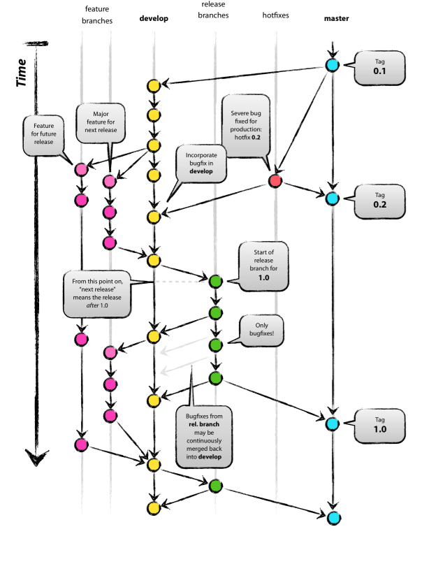
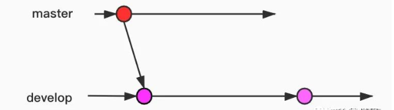
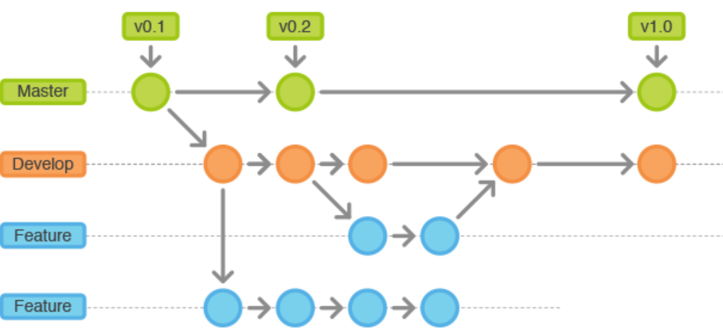
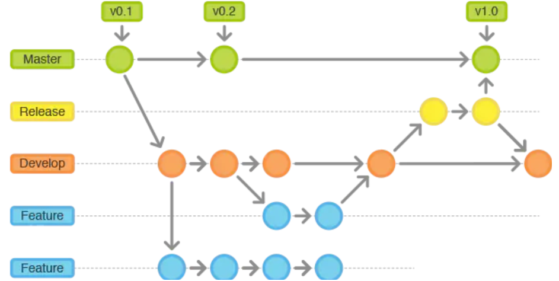
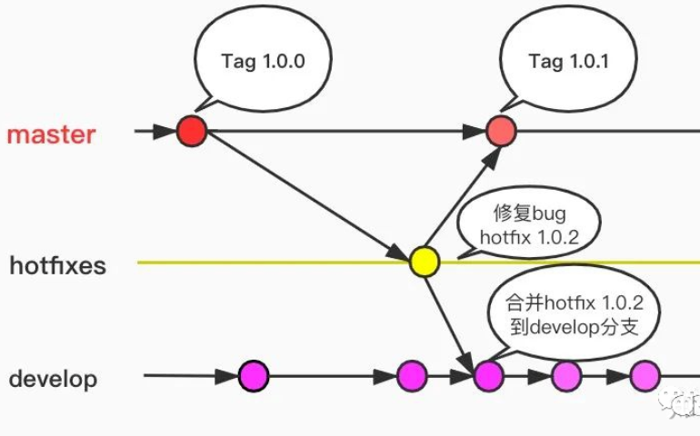

# gitflow

##  简介

什么是gitflow？

我们大家都很会用git，但是我们很少去关心我们要怎么用branch和版本控制。

只知道master是第一个主分支，其他分支都是次要分支， 那你知道如下的问题如何回答吗？

- 如何保证主分支的稳定性？
- 如何开发新的feature？
- 如何创建分支名称？分支多了如何管理？如何知道每个分支干嘛的呢？
- 哪些分支合并了？
- 哪些分支是release的分支？可以稳定使用的？
- 如果稳定分支代码出现没有测出来的bug，如何创建分支快速修复？

这个就像写代码，要有个规范一样， 当然我们可以不按照规范来做，git同样能处理。但是定义一个科学的操作规范，往往能让效率事半功倍。

创始人的分享链接：

https://nvie.com/posts/a-successful-git-branching-model/

gitflow 是一种git分支模型，是由创始人Vincent Driessen  2010年创建的。这只是一种建议，在团队合作中，具体项目中要灵活应用，不用可守成规，觉得不合理的地方可以自行修正。

## gitflow 流程图

我们来看下创始人最初的流程图：

我们来换个角度来理解

gitflow的核心要素是branch，通过branch来实现工作流。

主要分为两大类：

- 主分支(Main Branches)
- 辅助分支（supporting branches)

拓展开来：

主分支： Master   Develop

辅助分支：Feature、Release、Hotfix

## gitflow工作流如何使用

刚开始的时候，我们有个master分支，我们要基于master来创建develop

###  master

**master分支上存放的是最稳定的版本**，并且该分支的代码是随时可以让用户使用的代码，就是非常非常稳定的代码。当一个版本开发完成之后，交付给客户的时候，master上面的额代码也要被更新。同时，每次更新都要打上相应的tag。

**任何人不允许在master上进行代码的直接push提交，只接受其他分支合入**。原则上master分支必须是release的分支合过来的代码。

**来源只能是：hotfix和release分支。不能是其他分支。**  

master一定是经过多轮测试，但是不能保证完全没有bug，所以引入hotfix分支，来修复未知bug

### develop

develop是主开发分支，这个分支上被合并的代码始终是下一个版本需要加入的feature。这个分支可以合并一些feature。当要release的时候，就从这个分支上进行创建release分支。

**合并到develop分支上的必须保证功能完整，不影响develop分支的正常运行。**

### feature

feature 分支又叫功能分支，一般命名方法feature/xxx，用来开发版本或者未来要发布新的功能或者探索新功能。（feature 分支功能要保证里面的commit 的粒度要非常细，避免和主分支脱节严重，应该大功能切成一个一个小功能来merge，而不是一次merge一个大的）

### Release

这个分支又叫预发布分支，一般命名为 release/1.1.x  这个分支转为发布做准备。允许小量级的bug修复。

release分支只能从develop分支拉过来，用来修复一些bug。（不做feature相关的开发）

### hotfix

hotfix 叫热修复分支，一般命名为hotfix/4.1.3  为固定某个版本进行修复，当master上遇到严重问题需要修复的时候，就要从master上指定tag拉取。这样做就是为了隔离feature开发和bug修复。

hotfix只能从master上拉去，测试通过之后合并会master和develop

# 总结

有些人觉得gitflow好用，有些人觉得gitflow太死板，太复杂，团队里面每个人都要遵守这套规则，会很麻烦。毕竟规则越复杂，用起来越难。所以创始人也建议团队根据实际情况调整策略。我觉得有以下几点值得注意：

- 团队主要成员如果成员固定，并且训练有素，可以考虑用一下。团队人员如果太多，太杂，不建议。如果主要团队人员就1-2个人，也不建议。
- 从时间点上来说，要将团队统一战线，比如master要开始release了，整个团队需要切到release分支去修复bug，并且坚决不允许有feature合入。大feature可以下一个版本进行合并。
- release要全部测试人员测试完成，没有bug了，再合到master上。
- 一定要保证master上面的有个稳定的代码源（这个是最重要的一点，如果达不到，产品化效果会很差）
- 不同的团队保持并行开发，相互之间干扰要降到最低。

