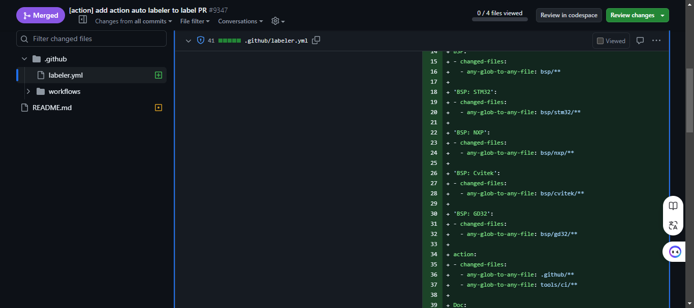

# RT-Thread PR：开启自动化标签新时代

## 引言

在现代软件开发中，效率与自动化是两大关键要素。尤其是在多人协作的开源项目中，保持一致的代码审查流程和项目管理对于项目的顺利进行至关重要。而GitHub Actions作为GitHub提供的一项持续集成与持续交付（CI/CD）服务，已经成为项目自动化不可或缺的工具之一。

在我的工作过程中，我意识到标签（labels）在项目管理中的重要性，尤其是在PR（Pull Request）和Issue的处理上。通过标签，项目维护者能够更快地识别问题的类型，合理分配优先级，从而提高项目的整体效率。然而，手动添加标签对于大型项目来说可能是个繁琐且容易出错的过程。这正是GitHub Actions中labeler自动标签功能大放异彩的地方。

在这篇文档中，我将详细介绍如何利用GitHub Actions的labeler自动标签功能，通过配置简单的规则，让GitHub自动为你的PR打上合适的标签。我还会结合我在RT-Thread项目中的实际应用，展示这一功能如何帮助提升项目管理效率。

## 问题描述

在没有自动标签功能之前，PR和Issue的管理通常是手动完成的。随着项目规模的扩大，手动管理标签会变得越来越繁琐且容易出错。手动标签管理存在以下几个不便之处：

**1. 时间消耗巨大**

**2. 标签一致性难以保持**

**3. 难以及时响应**

**4. 增加项目维护者的负担**

**5. 难以筛选和优先处理**

**6. 协作难度加大**

可以看出，手动标签管理存在诸多不便，影响了项目的效率和协作。尤其是在团队规模较大、PR和Issue数量较多的项目中，手动标签不仅增加了工作量，还容易导致标签不一致、处理延迟等问题。

## 功能概述

**什么是labeler自动标签功能？**

Labeler是GitHub Actions中的一个功能，旨在根据文件路径、文件名模式、甚至代码内容等规则，自动为PR和Issue添加标签。自动标签功能不仅可以帮助开发者快速识别PR的性质，还能为项目维护者节省时间，提升工作效率。

参考仓库链接 https://github.com/actions/labeler

**如何通过GitHub Actions实现自动标签？**

### 第一步 添加工作流 

在`.github/workflows/auto_labeler.yml`目录下面的workflow下面添加触发的action，内容如下：

```yml
name: "Pull Request Labeler"
on:
- pull_request_target

jobs:
  labeler:
    permissions:
      contents: read
      pull-requests: write
    runs-on: ubuntu-latest
    steps:
    - uses: actions/labeler@v5
      with:
        configuration-path: '.github/labeler.yml'
```

这里的`pull_request_target`和`pull_request` 的区别是`pull_request_target` 更安全，`pull_request`需要TOKEN来授权。

labeler有以下参数可以设置。可以参考上面`labeler`中的`with`来设置, 常用的就是labeler.yml中的规则文件，放在`.github`  默认是放在这里的。

| 姓名                 | 描述                                                         | 默认                  |
| -------------------- | ------------------------------------------------------------ | --------------------- |
| `repo-token`         | 用于授权标签更改的令牌。通常是 GITHUB_TOKEN 密钥             | `github.token`        |
| `configuration-path` | 标签配置文件的路径。如果该文件在运行器上指定的路径下不存在，则操作将通过 Github API 从源存储库读取。 | `.github/labeler.yml` |
| `sync-labels`        | 当匹配的文件被撤销或不再被 PR 更改时是否删除标签             | `false`               |
| `dot`                | 是否自动包含以点开头的路径（例如`.github`）                  | `true`                |
| `pr-number`          | 要更新的拉取请求的数量，而不是从工作流上下文中检测           | 不适用                |

### 第二步 设置规则

GitHub Actions通过YAML文件进行配置，labeler功能的实现也依赖于此。你可以在项目的`.github`文件夹下创建一个`labeler.yml`文件，在其中定义不同的标签规则。当有人提交PR时，GitHub Actions会自动运行这些规则，并根据匹配结果为其打上相应的标签。

内容参考如下，这里就根据PR的不同文件进行设置`label`

```yml
BSP:
- changed-files:
  - any-glob-to-any-file: bsp/**

'BSP: STM32':
- changed-files:
  - any-glob-to-any-file: bsp/stm32/**
  
testcase:
- changed-files:
  - any-glob-to-any-file: examples/**

tools:
- changed-files:
  - any-glob-to-any-file: tools/**

Kernel:
- changed-files:
  - any-glob-to-any-file: src/**

action:
- changed-files:
  - any-glob-to-any-file: .github/**
  - any-glob-to-any-file: tools/ci/**

Doc:
- changed-files:
  - any-glob-to-any-file: documentation/**
```

这些label可以是新建的也可以是原有的

之前原有的见链接： https://github.com/RT-Thread/rt-thread/issues/labels

这里简单介绍以下参数含义：

```yml
# any-glob-to-any-file 任何glob
root:
- changed-files:
  - any-glob-to-any-file: '*'

# 一个*代表根目录下的文件不包含文件夹中的内容， **代表要包含下面的子文件夹以及根文件夹的内容
AnyChange:
- changed-files:
  - any-glob-to-any-file: '**'

#添加Documentation 到所有的docs/下面的所有文件夹及文件
Documentation:
- changed-files:
  - any-glob-to-any-file: docs/**

# 添加Documentation 到所有的docs/下面的文件， 不包含文件夹
Documentation:
- changed-files:
  - any-glob-to-any-file: docs/*

# 包含docs/*或者guides/文件夹下面的文件
Documentation:
- changed-files:
  - any-glob-to-any-file:
    - docs/*
    - guides/*

## 另一种方式等同上面
Documentation:
- changed-files:
  - any-glob-to-any-file: ['docs/*', 'guides/*']

# 仓库中的所有以md结尾的文件 
Documentation:
- changed-files:
  - any-glob-to-any-file: '**/*.md'


# src下面的所有文件夹内的文件， 除了docs下面的目录下的内容
source:
- all:
  - changed-files:
    - any-glob-to-any-file: 'src/**/*'
    - all-globs-to-all-files: '!src/docs/*'

# 任何PR到feature分支上的PR
feature:
 - head-branch: ['^feature', 'feature']

# main分支上release的PR
release:
 - base-branch: 'main'
```

## 实际应用与优势

**提高代码审查效率**

自动标签功能可以帮助项目维护者在大量PR中快速找到他们关心的内容。通过自动为PR打上标签，团队成员可以更轻松地分配任务、安排优先级。这特别适用于大型项目，避免了手动标记的繁琐。

**使项目管理更为自动化**

通过GitHub Actions自动标签功能，项目管理可以更加自动化和一致。无论是处理PR还是代码审查流程，自动标签功能都能确保每个步骤都按照预期执行，减少人为错误。

**适用的典型项目场景分析**

在一些开源项目中，参与者众多且背景各异。自动标签功能可以帮助项目维护者快速识别不同领域的贡献。例如，文档修改、功能新增、Bug修复等都可以通过标签区分开来，方便不同领域的维护者参与审查。

## 在RT-Thread项目中的应用

祥见PR

https://github.com/RT-Thread/rt-thread/pull/9347



如果你PR的时候发现有下面的github-actions，代表功能生效了。


---

希望这部分内容能帮助你更好地了解GitHub Actions labeler的功能。如果你有其他想补充的内容或者需要更多细节，随时告诉我！