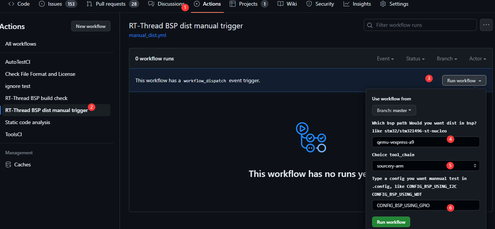
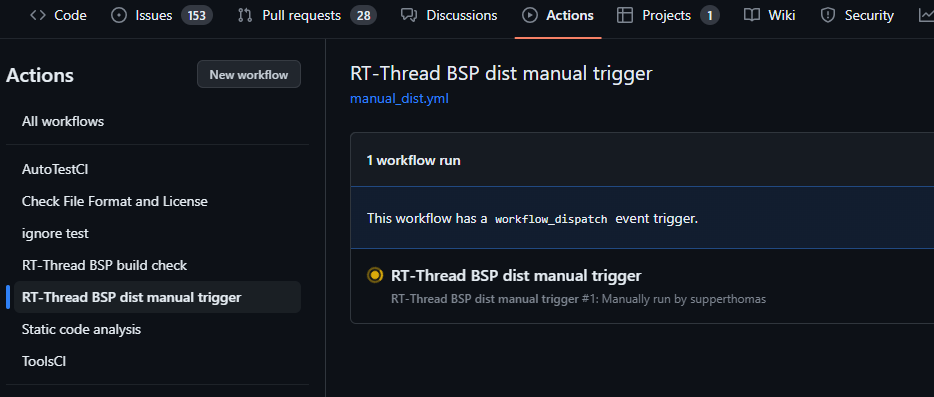
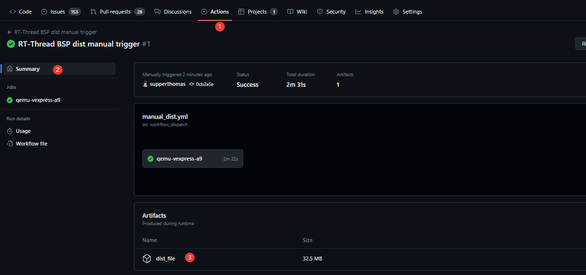

# 如何手动打包RTT 上的bsp

## 简介

有很多小伙伴喜欢用`sons --dist` 功能下载包，但是又有时候不想下载RT-THREAD的所有的包，这个时候，可以考虑看下这篇文章，说不定对你有帮助。

这边我提供了一种手动来trigger 生成特定bsp的project文件。

## 如何使用

打开仓库：https://github.com/RT-Thread/rt-thread

比如想生成qemu-vexpress-a9的单独的project，可以参考下面图的操作：



这个时候，你可以选择自己熟悉的bsp，只需要告诉action你需要编译的bsp路径就可以了，然后选择一下tool_chain, 自己应该知道平时用的是哪个toolchain。

- 注意事项：你需要有这个仓库的权限才行，所以如果小伙伴发现没有这个按钮，你可以把仓库fork下来，在自己fork之后的仓库来操作

最后如果需要，可以选择一个配置进行选择配置，比如`CONFIG_BSP_USING_I2C` ，最后执行`Run worflow` 绿色的小按钮。之后就可以让action帮你生成了。

## 生成之后的文件在哪里

点完之后，会稍微需要等一会，因为action在跑运行。



稍微等个5分钟以内吧。然后就可以获得工程文件，参考下图：



这个时候，你就可以把这个下载下来。当然这个action也会帮你检查bsp的scons编译情况（可以加特定config 配置情况），你不需要每次都把最新的代码下载下来。

## 最后文件

最后zip包里面有两个文件，`project.zip` 和`qemu-vexpress-a9` 这两个文件，`project.zip` 就是我们平时用的`scons --dist` 生成出来的。另外一个文件就是原来master分支上bsp经过scons编译之后，里面包含可执行文件，如果qemu-vexpress-a9，你可以在scons直接执行，里面已经有`rtthread.elf` 文件。


## 原理讲解

如何实现上述功能呢？

这里很多是关于github action的内容，方便后续维护。

这个功能添加的PR 链接：https://github.com/RT-Thread/rt-thread/pull/7648

### 输入功能

github action 有一个input输入功能，可以用来手动trigger

```
# Controls when the action will run. Triggers 'scons --dist' to build the dist
on:
  workflow_dispatch:
    # https://docs.github.com/en/actions/using-workflows/workflow-syntax-for-github-actions#onworkflow_dispatchinputs
    inputs:
      bsp_options:
        description: 'Which bsp path Would you want dist in bsp?like stm32/stm32l496-st-nucleo '
        required: false
        type: string
        default: 'qemu-vexpress-a9'
      bsp_tool_chain:
        description: 'Choice tool_chain'
        required: false
        default: 'sourcery-arm'
        type: choice
        options:
          - "sourcery-arm"
          - "llvm-arm"
          - "sourcery-aarch64"
          - "sourcery-mips"
          - "sourcery-riscv-none-embed"
          - "sourcery-riscv64-unknown-elf"
      bsp_config:
        description: 'Type a config you want mannual test in .config, like CONFIG_BSP_USING_I2C CONFIG_BSP_USING_WDT '
        required: false
        type: string
        default: 'CONFIG_BSP_USING_GPIO'
```

这里可以具体内容参考github中的文档：

https://docs.github.com/en/actions/using-workflows/workflow-syntax-for-github-actions#onworkflow_dispatchinputs

大概看yaml也能大概看懂，就是输入的一些参数改成变量`bsp_options`, `bsp_tool_chain`,`bsp_config`

有了这3个变量，我们就可以编译特定的bsp了。

### 如何编译执行

如何编译执行，这里参考了一下action.yml中的操作，将.config按照要求修改，然后执行`pkgs --update` 更新下软件包，然后执行下`scons`,  把scons之后的bsp先拷贝出来，之后再执行`scons --dist` 最后将project.zip也拷贝出来，方便后面上传。

```
      - name: Bsp Scons Compile
        if: ${{ success() }}
        shell: bash
        env:
          RTT_BSP: ${{ github.event.inputs.bsp_options }}
          RTT_TOOL_CHAIN: ${{ github.event.inputs.bsp_tool_chain}}
        run: |
          source ~/.env/env.sh
          echo $RTT_BSP
          ls bsp/$RTT_BSP/Kconfig && scons -C bsp/$RTT_BSP --pyconfig-silent
          sed -i "s/# ${{ github.event.inputs.bsp_config }} is not set/${{ github.event.inputs.bsp_config }}=y/g" bsp/$RTT_BSP/.config
          pushd bsp/$RTT_BSP && pkgs --update && popd
          scons -C bsp/$RTT_BSP -j$(nproc) 
          mkdir -p ${{ github.workspace }}/$RTT_BSP 
          cp -r bsp/$RTT_BSP ${{ github.workspace }}/$RTT_BSP/
          scons --dist -C bsp/$RTT_BSP
          cp bsp/$RTT_BSP/dist/project.zip ${{ github.workspace }}/$RTT_BSP/
          ls bsp/$RTT_BSP/dist
          pwd
```


### 如何上传中间文件

那如何上传中间文件的呢？

这里就要用到github中的一个小功能了。

只需要在action中添加下面的代码。

- name 是你要显示的名字
- path 是你要上传的文件路径

```
      - uses: actions/upload-artifact@v3
        with:
          name: dist_file
          path: ${{ github.workspace }}/${{ github.event.inputs.bsp_options }}/*
```

## 总结

这个方便生成dist之后的文件。大家如果觉得好用，可以在评论区留言。如果觉得有哪里还有可以改进的地方，也可也在评论区里面建议或者提PR，都可以~非常欢迎。

这个功能刚开始做，所以肯定有很多地方可以完善的地方。后续我会继续考虑完善它。大家可以试试帮我试试自己常用的bsp，看下是否ok。如果有问题欢迎反馈~。