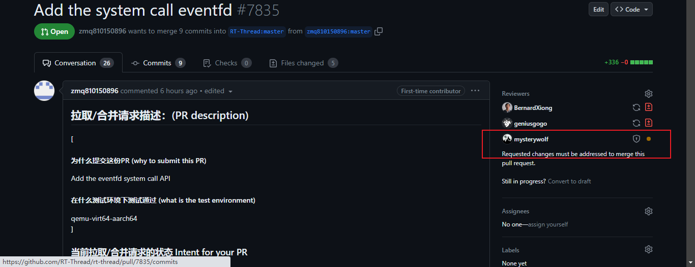
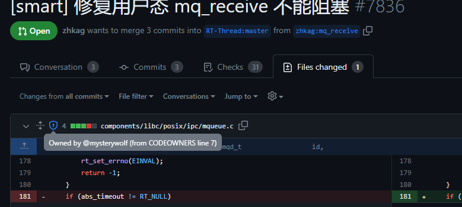
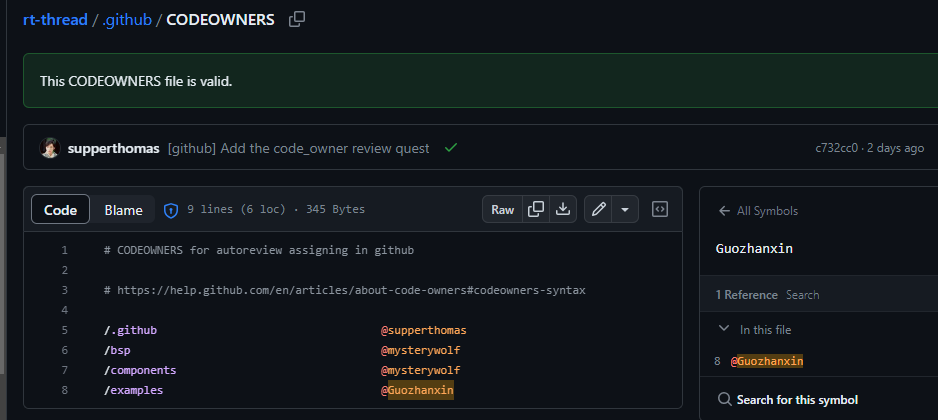

# [GITHUB]  PR代码reviewer分发机制

## 文章简介

本文介绍了github的PR的分发reviewer机制，可以实现自动的将对应代码分配给reviewer人。就是如果有人提交PR修改到某个文件夹里面的内容的话，github可以自动将这个PR转给对应的负责人进行reviewer。负责人也会收到邮件等通知。

技术来源链接：

https://help.github.com/en/articles/about-code-owners#codeowners-syntax

谁会用到这个功能呢？

对仓库具有写权限的可以对这个reviewer机制进行生效。通常用于团队协作中。

通常有用户提交`pull request` 之后github会自动根据代码修改的文件夹来自动匹配reviewer

如下图：



## 怎么做

其实很简单只要仓库中放置`CODEOWNERS`文件即可。参考如下：

https://github.com/RT-Thread/rt-thread/blob/master/.github/CODEOWNERS

`CODEOWNNERS`文件存放路径有以下几个地方，只要一个地方有就行了：

- 根目录`/`
- doc目录`docs/`
- .github目录`.github/`

## CODEOWNER 内容

内容其实很简单，下面给个最简单的例子

```
# CODEOWNERS for autoreview assigning in github

# https://help.github.com/en/articles/about-code-owners#codeowners-syntax

/.github                                  @supperthomas
/bsp                                      @mysterywolf
/components                               @mysterywolf
/examples                                 @Guozhanxin
```

接下来我们打开`PULL REQUEST`的时候，我们仔细看下下面的图片，然后可以看到这里讲了`componets`下面的代码需要`mysterywolf`来reviewer。



## CODEOWNER 大小

大小必须3M 以下。如果写的太大，你可以考虑使用通配符来缩小大小。

## CODEOWNER 语法

如果想要匹配多个代码reviewer，所有代码reviewer必须在同一行。

例如

```
/.github                                  @supperthomas @mysterywolf
```

CODEOWNERS 路径区分大小写

如果 CODEOWNERS 文件中的任何行包含无效语法，将跳过该行。

当你打开CODEOWNER的文件的时候会自动识别该CODEOWNER是否有效，如下图：



##  举例


```
# * 代表所有文件，所以所有文件都会通知到 @global-owner1 and @global-owner2
*       @global-owner1 @global-owner2

# 顺序很重要，最后匹配的优先级最高，所以*.js会通知 @js-owner
*.js    @js-owner #This is an inline comment.

# 你也可以用电子邮箱，如下所示
*.go docs@example.com

# 可以使用有写权限的组织里面的团队或者个人
*.txt @octo-org/octocats

# 所有/build/logs/下面的文件修改，包括子文件夹，会通知到@doctocat
/build/logs/ @doctocat

# 这个会匹配docs下面的所有文件，但不包含嵌套的文件，比如docs/getting-started.md 这个修改就会通知到
# docs/build-app/troubleshooting.md 这个文件修改就不会通知到
docs/*  docs@example.com

# 下面这个例子任何文件在apps文件夹下面的都会通知到，不管这个apps在你仓库的哪个位置,注意这里没有/
apps/ @octocat

# 下面这个会包含根目录下面的docs下面的所有文件，包括子目录
/docs/ @doctocat

# 这个会通知到2个人
/scripts/ @doctocat @octocat

# 任何文件在/logs目录下面的比如/build/logs , /scripts/logs ...等等都会通知 
**/logs @octocat

#任何/apps下面的文件都会通知，注意这里是根目录，除了/apps/github这个目录，因为这个目录在最后没有人匹配，匹配为空
/apps/ @octocat
/apps/github
```

## 总结

这个主要对github文档的一个翻译和总结以及实践学习。主要告诉大家如何使用和如何写`CODEOWNER`文件来方便团队来分配PR。