# zephyr 的构建系统

## 简介


整个zephyr  的构建和配置系统知识点分为以下方面

- 构建系统（build 之前和之后整个流程）
- CMAKE 系统 package
- 配置Kconfig解析（讲解Kconfig如何运作的）
- devicetree解析（讲解devicetree如何运作的和如何使用）
- sysbuild(系统构建)
- 应用版本管理
- snippets 这个有点像module 

本章主要讲构建系统

参考链接

https://docs.zephyrproject.org/latest/build/cmake/index.html#

https://developer.nordicsemi.com/nRF_Connect_SDK/doc/latest/zephyr/build/cmake/index.html

构建系统分为以下两部分

- 编译配置部分
- 脚本和工具

zephyr主要用Cmake来构建，

## NCS 构建

我们先来新建一个`hello_world` 工程，配置什么的，都用默认的即可，我们先编译一下，看下效果，我们可以看到terminal那边可以编译通过

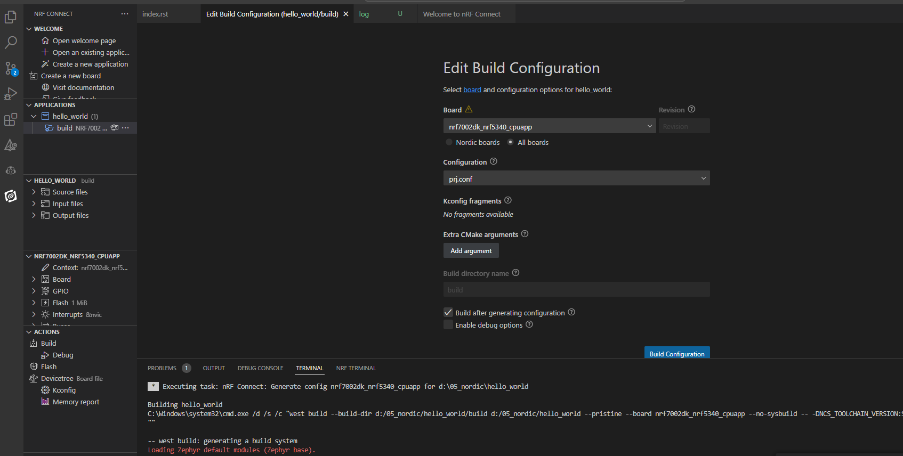

我们可以看到编译的时候执行下面的命令

```
west build --build-dir d:/05_nordic/hello_world/build d:/05_nordic/hello_world --pristine --board nrf7002dk_nrf5340_cpuapp --no-sysbuild -- -DNCS_TOOLCHAIN_VERSION:STRING="NONE" -DCONF_FILE:STRING="d:/05_nordic/hello_world/prj.conf
```

我们把下面的命令拷贝出来`west build --build-dir d:/05_nordic/hello_world/build d:/05_nordic/hello_world --pristine --board nrf7002dk_nrf5340_cpuapp --no-sysbuild`

后面的可以省略，因为都是默认路径。

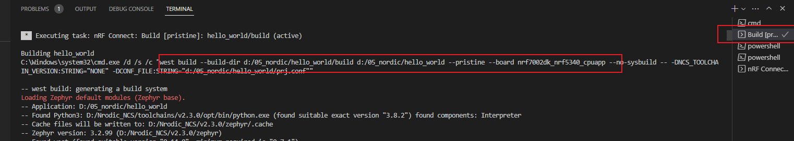

```

```

怎么执行呢？看下面的截图，打开`nrf connect` terminal来执行， 可以加`> log` 来查看所有log，也可以加`-v`  来显示所有log。

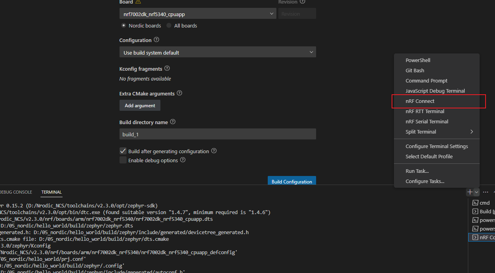

即可

### 命令解析

我们看下这个命令，我们看到命令到CMAKE的第8步和第9步基本上都是开始编译.c文件了。这个第8步之后我们暂时不看。我们看之前的。

```
-- west build: generating a build system
Loading Zephyr default modules (Zephyr base).
-- Application: D:/05_nordic/hello_world
-- Found Python3: D:/Nrodic_NCS/toolchains/v2.3.0/opt/bin/python.exe (found suitable exact version "3.8.2") found components: Interpreter 
-- Cache files will be written to: D:/Nrodic_NCS/v2.3.0/zephyr/.cache
-- Zephyr version: 3.2.99 (D:/Nrodic_NCS/v2.3.0/zephyr)
-- Found west (found suitable version "0.14.0", minimum required is "0.7.1")
-- Board: nrf7002dk_nrf5340_cpuapp
-- Found host-tools: zephyr 0.15.2 (D:/Nrodic_NCS/toolchains/v2.3.0/opt/zephyr-sdk)
-- Found toolchain: zephyr 0.15.2 (D:/Nrodic_NCS/toolchains/v2.3.0/opt/zephyr-sdk)
-- Found Dtc: D:/Nrodic_NCS/toolchains/v2.3.0/opt/bin/dtc.exe (found suitable version "1.4.7", minimum required is "1.4.6") 
-- Found BOARD.dts: D:/Nrodic_NCS/v2.3.0/nrf/boards/arm/nrf7002dk_nrf5340/nrf7002dk_nrf5340_cpuapp.dts
-- Generated zephyr.dts: D:/05_nordic/hello_world/build/zephyr/zephyr.dts
-- Generated devicetree_generated.h: D:/05_nordic/hello_world/build/zephyr/include/generated/devicetree_generated.h
-- Including generated dts.cmake file: D:/05_nordic/hello_world/build/zephyr/dts.cmake
Parsing D:/Nrodic_NCS/v2.3.0/zephyr/Kconfig
Loaded configuration 'D:/Nrodic_NCS/v2.3.0/nrf/boards/arm/nrf7002dk_nrf5340/nrf7002dk_nrf5340_cpuapp_defconfig'
Merged configuration 'd:/05_nordic/hello_world/prj.conf'
Configuration saved to 'D:/05_nordic/hello_world/build/zephyr/.config'
Kconfig header saved to 'D:/05_nordic/hello_world/build/zephyr/include/generated/autoconf.h'
-- The C compiler identification is GNU 12.1.0
-- The CXX compiler identification is GNU 12.1.0
-- The ASM compiler identification is GNU
-- Found assembler: D:/Nrodic_NCS/toolchains/v2.3.0/opt/zephyr-sdk/arm-zephyr-eabi/bin/arm-zephyr-eabi-gcc.exe
-- Configuring done
-- Generating done
-- Build files have been written to: D:/05_nordic/hello_world/build
-- west build: building application
[1/166] Generating include/generated/version.h
-- Zephyr version: 3.2.99 (D:/Nrodic_NCS/v2.3.0/zephyr), build: v3.2.99-ncs2
[2/166] Generating misc/generated/syscalls.json, misc/generated/struct_tags.json
[3/166] Generating include/generated/kobj-types-enum.h, include/generated/otype-to-str.h, include/generated/otype-to-size.h
[4/166] Generating include/generated/driver-validation.h
[5/166] Generating include/generated/syscall_dispatch.c, include/generated/syscall_list.h
[6/166] Building C object zephyr/CMakeFiles/offsets.dir/arch/arm/core/offsets/offsets.c.obj
[7/166] Generating include/generated/offsets.h
[8/166] Building ASM object zephyr/arch/arch/arm/core/aarch32/CMakeFiles/arch__arm__core__aarch32.dir/isr_wrapper.S.obj
[9/166] Building ASM object zephyr/arch/arch/arm/core/aarch32/cortex_m/CMakeFiles/arch__arm__core__aarch32__cortex_m.dir/exc_exit.S.obj
[10/166] Building C object zephyr/arch/common/CMakeFiles/arch__common.dir/sw_isr_common.c.obj
```

这里包含了很多东西。我们一点一点来拆解，如何拆解呢？我们找到对应的文件基本上可以确定执行的是`cmake/modules/` 里面的所有文件，可以看下面的log，

下面的log我已经加了注释了，注释内容是每个log执行的cmake文件。

```
-- west build: generating a build system
Loading Zephyr default modules (Zephyr base).
-- Application: D:/05_nordic/hello_world
[v2.3.0/zephyr/cmake/modules/zephyr_default.cmake]
-- Found Python3: D:/Nrodic_NCS/toolchains/v2.3.0/opt/bin/python.exe (found suitable exact version "3.8.2") found components: Interpreter 
-- Cache files will be written to: D:/Nrodic_NCS/v2.3.0/zephyr/.cache
[v2.3.0/zephyr/cmake/modules/user_cache.cmake]
-- Zephyr version: 3.2.99 (D:/Nrodic_NCS/v2.3.0/zephyr)
[v2.3.0/zephyr/cmake/modules/version.cmake]
-- Found west (found suitable version "0.14.0", minimum required is "0.7.1")
[v2.3.0/zephyr/cmake/modules/west.cmake]
-- Board: nrf7002dk_nrf5340_cpuapp
[v2.3.0/zephyr/cmake/modules/boards.cmake]
-- Found host-tools: zephyr 0.15.2 (D:/Nrodic_NCS/toolchains/v2.3.0/opt/zephyr-sdk)
[v2.3.0/zephyr/cmake/modules/FindZephyr-sdk.cmake]
-- Found toolchain: zephyr 0.15.2 (D:/Nrodic_NCS/toolchains/v2.3.0/opt/zephyr-sdk)
[v2.3.0/zephyr/cmake/toolchain/zephyr/generic.cmake]
-- Found Dtc: D:/Nrodic_NCS/toolchains/v2.3.0/opt/bin/dtc.exe (found suitable version "1.4.7", minimum required is "1.4.6") 
[v2.3.0/zephyr/cmake/toolchain/zephyr/FindDtc.cmake]
-- Found BOARD.dts: D:/Nrodic_NCS/v2.3.0/nrf/boards/arm/nrf7002dk_nrf5340/nrf7002dk_nrf5340_cpuapp.dts
-- Generated zephyr.dts: D:/05_nordic/hello_world/build/zephyr/zephyr.dts
-- Generated devicetree_generated.h: 
D:/05_nordic/hello_world/build/zephyr/include/generated/devicetree_generated.h
[v2.3.0/zephyr/cmake/modules/dts.cmake]
-- Including generated dts.cmake file: D:/05_nordic/hello_world/build/zephyr/dts.cmake
Parsing D:/Nrodic_NCS/v2.3.0/zephyr/Kconfig
Loaded configuration 'D:/Nrodic_NCS/v2.3.0/nrf/boards/arm/nrf7002dk_nrf5340/nrf7002dk_nrf5340_cpuapp_defconfig'
[zephyr/cmake/modules/dts.cmake]
Merged configuration 'd:/05_nordic/hello_world/prj.conf'
Configuration saved to 'D:/05_nordic/hello_world/build/zephyr/.config'
Kconfig header saved to 'D:/05_nordic/hello_world/build/zephyr/include/generated/autoconf.h'
[v2.3.0/zephyr/cmake/modules/kconfig.cmake]
-- The C compiler identification is GNU 12.1.0
-- The CXX compiler identification is GNU 12.1.0
-- The ASM compiler identification is GNU
-- Found assembler: D:/Nrodic_NCS/toolchains/v2.3.0/opt/zephyr-sdk/arm-zephyr-eabi/bin/arm-zephyr-eabi-gcc.exe
-- Configuring done
-- Generating done
-- Build files have been written to: D:/05_nordic/hello_world/build
-- west build: building application
[1/166] Generating include/generated/version.h
-- Zephyr version: 3.2.99 (D:/Nrodic_NCS/v2.3.0/zephyr), build: v3.2.99-ncs2
[2/166] Generating misc/generated/syscalls.json, misc/generated/struct_tags.json
[3/166] Generating include/generated/kobj-types-enum.h, include/generated/otype-to-str.h, include/generated/otype-to-size.h
[4/166] Generating include/generated/driver-validation.h
[5/166] Generating include/generated/syscall_dispatch.c, include/generated/syscall_list.h
[6/166] Building C object zephyr/CMakeFiles/offsets.dir/arch/arm/core/offsets/offsets.c.obj
[7/166] Generating include/generated/offsets.h
[8/166] Building ASM object zephyr/arch/arch/arm/core/aarch32/CMakeFiles/arch__arm__core__aarch32.dir/isr_wrapper.S.obj
[9/166] Building ASM object zephyr/arch/arch/arm/core/aarch32/cortex_m/CMakeFiles/arch__arm__core__aarch32__cortex_m.dir/exc_exit.S.obj
[10/166] Building C object zephyr/arch/common/CMakeFiles/arch__common.dir/sw_isr_common.c.obj
```

一直到下面的`[1/166]` 大部分都在执行cmake，下图看上去是一个devicetree和Kconfig联动的流程图。

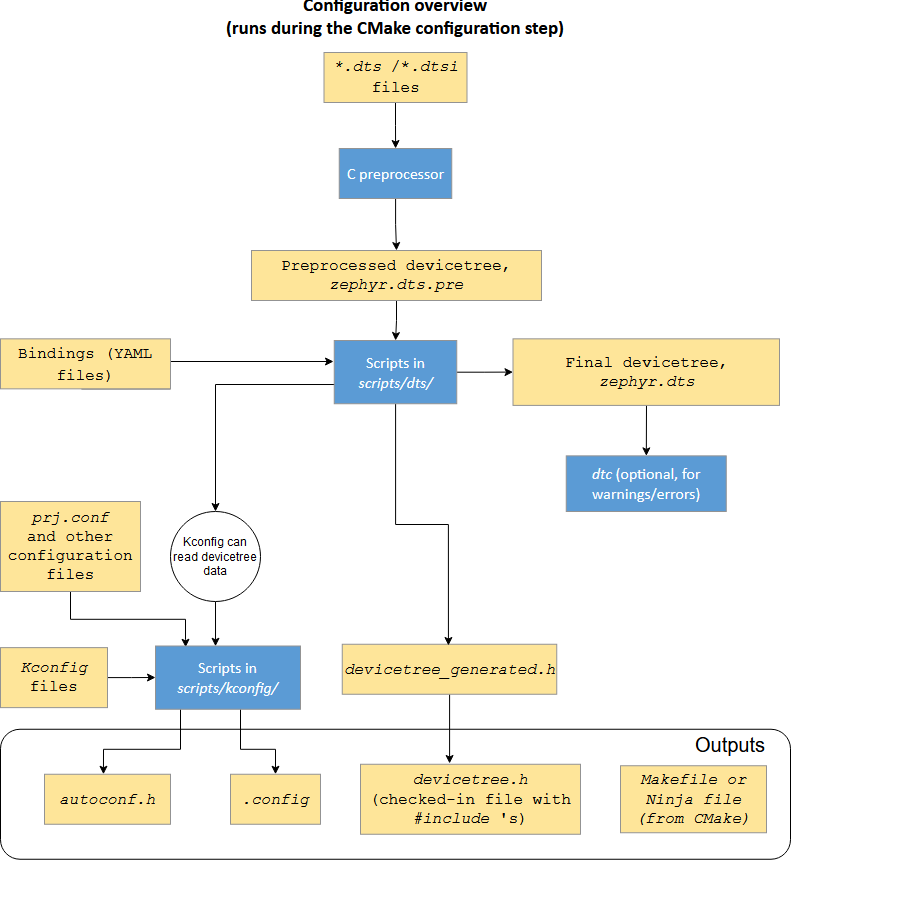

这里我们可以看到几个大块：

- devicetree 解析 调用的dts.cmake

- Kconfig解析 kconfig.cmake
- cmake一些脚本解析都在目录`v2.3.0\zephyr\cmake\modules` 下面

由于Kconfig和devicetree是两块比较大的知识点，我们下次再看。

### PRE-BUILD

接下来我们重点来看下`PRE-BUILD`阶段，这个就是在编译.c之前的阶段

https://docs.zephyrproject.org/latest/build/cmake/index.html#pre-build

pre-build一共有两个阶段

- offset 产生
- syscall 标号产生

整个PRE-BUILD就是如下所示的流程图

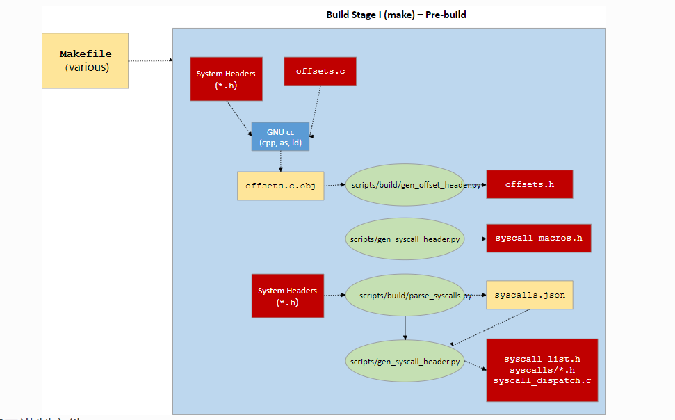

#### syscall 处理

syscall 这里其实和linux很像很像，基本上一样的功能。系统调用

##### 第一步gen_version_h.cmake 生成version 

第一步是版本号生成，和编译关系不大

```
[1/166] cmd.exe /C "cd /D D:\05_nordic\hello_world\build\zephyr && D:\Nrodic_NCS\toolchains\v2.3.0\opt\bin\cmake.exe -DZEPHYR_BASE=D:/Nrodic_NCS/v2.3.0/zephyr -DOUT_FILE=D:/05_nordic/hello_world/build/zephyr/include/generated/version.h -P D:/Nrodic_NCS/v2.3.0/zephyr/cmake/gen_version_h.cmake"
-- Zephyr version: 3.2.99 (D:/Nrodic_NCS/v2.3.0/zephyr), build: v3.2.99-ncs2
```

主要调`gen_version_h.cmake`  这个cmake 来生成版本号。

syscall在后面的步骤中是2-5步

```
[1/166] Generating include/generated/version.h
-- Zephyr version: 3.2.99 (D:/Nrodic_NCS/v2.3.0/zephyr), build: v3.2.99-ncs2
[2/166] Generating misc/generated/syscalls.json, misc/generated/struct_tags.json
[3/166] Generating include/generated/driver-validation.h
[4/166] Generating include/generated/kobj-types-enum.h, include/generated/otype-to-str.h, include/generated/otype-to-size.h
[5/166] Generating include/generated/syscall_dispatch.c, include/generated/syscall_list.h
[6/166] Building C object zephyr/CMakeFiles/offsets.dir/arch/arm/core/offsets/offsets.c.obj
```

##### 第二步 parse_syscalls.py产生syscalls.json 和struct_tags.json

如何产生的呢？我们来展开看看

```
[2/166] cmd.exe /C "cd /D D:\05_nordic\hello_world\build\zephyr && D:\Nrodic_NCS\toolchains\v2.3.0\opt\bin\python.exe D:/Nrodic_NCS/v2.3.0/zephyr/scripts/build/parse_syscalls.py --include D:/Nrodic_NCS/v2.3.0/zephyr/include --include D:/Nrodic_NCS/v2.3.0/zephyr/drivers --include D:/Nrodic_NCS/v2.3.0/zephyr/subsys/net --json-file D:/05_nordic/hello_world/build/zephyr/misc/generated/syscalls.json --tag-struct-file D:/05_nordic/hello_world/build/zephyr/misc/generated/struct_tags.json"
```

我们看到这里用了`parse_syscalls.py`  脚本来解析一些头文件，最后生成`syscalls.json` 和`struct_tags.json`

##### 第三步 gen_kobject_list.py产生一些driver头文件

这部产生一些driver相关的syscall的一些结构体，看上去也是服务于`syscall`的 ,  这里调了脚本`gen_kobject_list.py` ，用于产生`driver-validation.h`

```
[3/166] cmd.exe /C "cd /D D:\05_nordic\hello_world\build\zephyr && D:\Nrodic_NCS\toolchains\v2.3.0\opt\bin\python.exe D:/Nrodic_NCS/v2.3.0/zephyr/scripts/build/gen_kobject_list.py --validation-output D:/05_nordic/hello_world/build/zephyr/include/generated/driver-validation.h --include D:/05_nordic/hello_world/build/zephyr/misc/generated/struct_tags.json "
```
##### 第四步 gen_syscalls.py产生OBJ的一些头文件

看着像一些OBJECT 的对象的枚举类型, 这个也是通过`gen_kobject_list.py` 脚本产生

用于产生`kobj-types-enum.h`  `otype-to-str.h ` `otype-to-size.h`

```
[4/166] cmd.exe /C "cd /D D:\05_nordic\hello_world\build\zephyr && D:\Nrodic_NCS\toolchains\v2.3.0\opt\bin\python.exe D:/Nrodic_NCS/v2.3.0/zephyr/scripts/build/gen_kobject_list.py --kobj-types-output D:/05_nordic/hello_world/build/zephyr/include/generated/kobj-types-enum.h --kobj-otype-output D:/05_nordic/hello_world/build/zephyr/include/generated/otype-to-str.h --kobj-size-output D:/05_nordic/hello_world/build/zephyr/include/generated/otype-to-size.h --include D:/05_nordic/hello_world/build/zephyr/misc/generated/struct_tags.json "
```
##### 第五步 产生syscall_list.h

```
[5/166] cmd.exe /C "cd /D D:\05_nordic\hello_world\build\zephyr && D:\Nrodic_NCS\toolchains\v2.3.0\opt\bin\python.exe D:/Nrodic_NCS/v2.3.0/zephyr/scripts/build/gen_syscalls.py --json-file D:/05_nordic/hello_world/build/zephyr/misc/generated/syscalls.json --base-output include/generated/syscalls --syscall-dispatch include/generated/syscall_dispatch.c --syscall-list D:/05_nordic/hello_world/build/zephyr/include/generated/syscall_list.h --split-type k_timeout_t --split-type k_ticks_t"
```

通过脚本`gen_syscalls.py` 来产生`syscall_list.h`

#### 那syscall在做什么呢？

这个syscall有点像linux的味道了，而且非常像，系统调用。

所有.h里面用`__syscall` 声明的函数， 例如`zephyr/include/zephyr/drivers/uart.h` 中有个`uart_irq_tx_disable` 前面用`__syscall` 来修饰

真正的函数实现是`z_impl_uart_irq_tx_disable` 

```
/**
 * @brief Disable TX interrupt in IER.
 *
 * @param dev UART device instance.
 */
__syscall void uart_irq_tx_disable(const struct device *dev);
static inline void z_impl_uart_irq_tx_disable(const struct device *dev)
{
#ifdef CONFIG_UART_INTERRUPT_DRIVEN
        const struct uart_driver_api *api =
                (const struct uart_driver_api *)dev->api;
        if (api->irq_tx_disable != NULL) {
                api->irq_tx_disable(dev);
        }
#else
        ARG_UNUSED(dev);
#endif
}
```

中途通过`parse_syscalls.py`生成在`syscalls.json`中变成下面的结构

```
    [
        [
            "void uart_irq_tx_disable",
            "const struct device *dev"
        ],
        "uart.h",
        true
    ],
```

接下来就是比较重要的一步了，我们先看第五步，这个和上面的api相关

生成`syscall_list.h`

这个是把一些api改成

```
#define K_SYSCALL_UART_IRQ_TX_DISABLE 334
```

然后我们把syscall_dispatch.c打开

```
	[K_SYSCALL_UART_IRQ_TX_DISABLE] = z_mrsh_uart_irq_tx_disable,
__weak ALIAS_OF(handler_no_syscall)
uintptr_t z_mrsh_uart_irq_tx_disable(uintptr_t arg1, uintptr_t arg2, uintptr_t arg3,
         uintptr_t arg4, uintptr_t arg5, uintptr_t arg6, void *ssf);
```

在这里两个函数关联起来了。


而`struct_tags.json` 则是由`uart.h`中的下面的代码定义

```
__subsystem struct uart_driver_api {...}
```

通过脚本生成，在`struct_tags.json`  显示是这样的

```
    "__subsystem": [
        "uart_driver_api",
    ]
```

然后第三步来生成`driver-validation.h` 中可以看到下面的代码

```
#define Z_SYSCALL_DRIVER_UART(ptr, op) Z_SYSCALL_DRIVER_GEN(ptr, op, uart, UART)
```

然后第四步生成`kobj-types-enum.h` 

```
K_OBJ_DRIVER_UART,
```

otype-to-str.h

```
case K_OBJ_DRIVER_UART: ret = "uart driver"; break;
```

otype-to-size.h

```
/* Non device/stack objects */
case K_OBJ_MEM_SLAB: ret = sizeof(struct k_mem_slab); break;
case K_OBJ_MSGQ: ret = sizeof(struct k_msgq); break;
case K_OBJ_MUTEX: ret = sizeof(struct k_mutex); break;
case K_OBJ_PIPE: ret = sizeof(struct k_pipe); break;
case K_OBJ_QUEUE: ret = sizeof(struct k_queue); break;
case K_OBJ_POLL_SIGNAL: ret = sizeof(struct k_poll_signal); break;
case K_OBJ_SEM: ret = sizeof(struct k_sem); break;
case K_OBJ_STACK: ret = sizeof(struct k_stack); break;
case K_OBJ_THREAD: ret = sizeof(struct k_thread); break;
case K_OBJ_TIMER: ret = sizeof(struct k_timer); break;
case K_OBJ_CONDVAR: ret = sizeof(struct k_condvar); break;
#ifdef CONFIG_EVENTS
case K_OBJ_EVENT: ret = sizeof(struct k_event); break;
#endif
```

接着在下面的`gen_syscalls.py` 步骤中，转换成`syscall_list.h`中的下面的代码

```
#define K_SYSCALL_UART_IRQ_RX_DISABLE 122
```

同时在syscall_dispatch.c中生成如下代码

```
__weak ALIAS_OF(handler_no_syscall)
uintptr_t z_mrsh_uart_irq_tx_disable(uintptr_t arg1, uintptr_t arg2, uintptr_t arg3,
         uintptr_t arg4, uintptr_t arg5, uintptr_t arg6, void *ssf);
```

`gen_syscalls.py` 同时生成在`build/zephyr/include/generated/syscalls`里面生成了uart.h ，类似于将uart.h转换了一下。

```
extern void z_impl_uart_irq_tx_disable(const struct device * dev);
__pinned_func
static inline void uart_irq_tx_disable(const struct device * dev)
{
#ifdef CONFIG_USERSPACE
        if (z_syscall_trap()) {
                union { uintptr_t x; const struct device * val; } parm0 = { .val = dev };
                (void) arch_syscall_invoke1(parm0.x, K_SYSCALL_UART_IRQ_TX_DISABLE);
                return;
        }
#endif
        compiler_barrier();
        z_impl_uart_irq_tx_disable(dev);
}
#if defined(CONFIG_TRACING_SYSCALL)
#ifndef DISABLE_SYSCALL_TRACING
#define uart_irq_tx_disable(dev) do {   sys_port_trace_syscall_enter(K_SYSCALL_UART_IRQ_TX_DISABLE, uart_irq_tx_disable, dev);  uart_irq_tx_disable(dev);       sys_port_trace_syscall_exit(K_SYSCALL_UART_IRQ_TX_DISABLE, uart_irq_tx_disable, dev); } while(false)
#endif
#endif

```

这里可以看到在代码中如果调函数`uart_irq_tx_disable` 就会用编译器通过`build/zephyr/include/generated/syscalls/uart.h` 中的`inline`函数来转化成调`z_impl_uart_irq_tx_disable` 函数，这个函数真正实现是在`zephyr/include/zephyr/drivers/uart.h`

这里的syscall非常像linux的那套机制。而前面调`uart_irq_tx_disable ` 就是采用syscall机制。

#####  总结

syscall主要生成两个中间文件`syscalls.jason` 和`struct_tags.json`

`syscalls.jason` 主要负责生成系统调用的API。例如`__syscall void uart_irq_tx_disable(const struct device *dev);`

`struct_tags.jason`  主要负责生成系统调用的一些结构体的API `__subsystem struct uart_driver_api {...}`


#### Offset 产生

这个在第6步和第7步

我们看看第6步, 处理offset.c

```
[1/166] Generating include/generated/version.h
-- Zephyr version: 3.2.99 (D:/Nrodic_NCS/v2.3.0/zephyr), build: v3.2.99-ncs2
[2/166] Generating misc/generated/syscalls.json, misc/generated/struct_tags.json
[3/166] Generating include/generated/kobj-types-enum.h, include/generated/otype-to-str.h, include/generated/otype-to-size.h
[4/166] Generating include/generated/driver-validation.h
[5/166] Generating include/generated/syscall_dispatch.c, include/generated/syscall_list.h
[6/166] Building C object zephyr/CMakeFiles/offsets.dir/arch/arm/core/offsets/offsets.c.obj
[7/166] Generating include/generated/offsets.h
```

gcc编译offset.c 

```
[6/166] D:\Nrodic_NCS\toolchains\v2.3.0\opt\zephyr-sdk\arm-zephyr-eabi\bin\arm-zephyr-eabi-gcc.exe -DKERNEL -DNRF5340_XXAA_APPLICATION -DNRF_SKIP_FICR_NS_COPY_TO_RAM -DUSE_PARTITION_MANAGER=0 -D__PROGRAM_START -D__ZEPHYR__=1 -ID:/Nrodic_NCS/v2.3.0/zephyr/kernel/include -ID:/Nrodic_NCS/v2.3.0/zephyr/arch/arm/include -ID:/Nrodic_NCS/v2.3.0/zephyr/include -Izephyr/include/generated -ID:/Nrodic_NCS/v2.3.0/zephyr/soc/arm/nordic_nrf/nrf53 -ID:/Nrodic_NCS/v2.3.0/zephyr/soc/arm/nordic_nrf/common/. -ID:/Nrodic_NCS/v2.3.0/nrf/include -ID:/Nrodic_NCS/v2.3.0/nrf/tests/include -ID:/Nrodic_NCS/v2.3.0/modules/hal/cmsis/CMSIS/Core/Include -ID:/Nrodic_NCS/v2.3.0/modules/hal/nordic/nrfx -ID:/Nrodic_NCS/v2.3.0/modules/hal/nordic/nrfx/drivers/include -ID:/Nrodic_NCS/v2.3.0/modules/hal/nordic/nrfx/mdk -ID:/Nrodic_NCS/v2.3.0/zephyr/modules/hal_nordic/nrfx/. -isystem D:/Nrodic_NCS/v2.3.0/zephyr/lib/libc/minimal/include -isystem d:/nrodic_ncs/toolchains/v2.3.0/opt/zephyr-sdk/arm-zephyr-eabi/bin/../lib/gcc/arm-zephyr-eabi/12.1.0/include -isystem d:/nrodic_ncs/toolchains/v2.3.0/opt/zephyr-sdk/arm-zephyr-eabi/bin/../lib/gcc/arm-zephyr-eabi/12.1.0/include-fixed -isystem D:/Nrodic_NCS/v2.3.0/nrfxlib/crypto/nrf_cc312_platform/include -fno-strict-aliasing -Os -imacros D:/05_nordic/hello_world/build/zephyr/include/generated/autoconf.h -ffreestanding -fno-common -g -gdwarf-4 -fdiagnostics-color=always -mcpu=cortex-m33 -mthumb -mabi=aapcs -mfp16-format=ieee --sysroot=D:/Nrodic_NCS/toolchains/v2.3.0/opt/zephyr-sdk/arm-zephyr-eabi/arm-zephyr-eabi -imacros D:/Nrodic_NCS/v2.3.0/zephyr/include/zephyr/toolchain/zephyr_stdint.h -Wall -Wformat -Wformat-security -Wno-format-zero-length -Wno-main -Wno-pointer-sign -Wpointer-arith -Wexpansion-to-defined -Wno-unused-but-set-variable -Werror=implicit-int -fno-pic -fno-pie -fno-asynchronous-unwind-tables -fno-reorder-functions --param=min-pagesize=0 -fno-defer-pop -fmacro-prefix-map=D:/05_nordic/hello_world=CMAKE_SOURCE_DIR -fmacro-prefix-map=D:/Nrodic_NCS/v2.3.0/zephyr=ZEPHYR_BASE -fmacro-prefix-map=D:/Nrodic_NCS/v2.3.0=WEST_TOPDIR -ffunction-sections -fdata-sections -std=c99 -nostdinc -MD -MT zephyr/CMakeFiles/offsets.dir/arch/arm/core/offsets/offsets.c.obj -MF zephyr\CMakeFiles\offsets.dir\arch\arm\core\offsets\offsets.c.obj.d -o zephyr/CMakeFiles/offsets.dir/arch/arm/core/offsets/offsets.c.obj -c D:/Nrodic_NCS/v2.3.0/zephyr/arch/arm/core/offsets/offsets.c
```

第7步 用gen_offset_header.p产生`offsets.h` 文件

```
[7/166] cmd.exe /C "cd /D D:\05_nordic\hello_world\build\zephyr && D:\Nrodic_NCS\toolchains\v2.3.0\opt\bin\python.exe D:/Nrodic_NCS/v2.3.0/zephyr/scripts/build/gen_offset_header.py -i D:/05_nordic/hello_world/build/zephyr/CMakeFiles/offsets.dir/./arch/arm/core/offsets/offsets.c.obj -o D:/05_nordic/hello_world/build/zephyr/include/generated/offsets.h"
```


#### 那offsets.h在干嘛呢？

```
scripts/build/gen_offset_header.py
This script scans a specified object file and generates a header file that defined macros for the offsets of various found structure members (particularly symbols ending with _OFFSET or _SIZEOF), primarily intended for use in assembly code.
```

主要处理以`_OFFSET`或者`_SIZEOF` 结尾的一些标号, 主要用在汇编里面。

我们先看下`arch/arm/core/offsets/offsets_aarch32.c` 中的下面的变量

```
GEN_OFFSET_SYM(_basic_sf_t, pc);
GEN_OFFSET_SYM(_basic_sf_t, xpsr);
```

这个会转换成`offset.c.obj` 里面的标号`___basic_sf_t_pc_OFFSET`

我们看下`___basic_sf_t_pc_OFFSET` 这些变量

以及offsets.h中的注释，可以知道，这些偏移量都服务于一些汇编文件，具体可以打开`./arch/arm/core/aarch32/swap_helper.S` 文件查看下

```
    /* grab address of LR from stack frame */
    ldr r8, [ip, #(FPU_SF_SIZE + ___basic_sf_t_pc_OFFSET)]
    /* Make the exception return to system state */
    ldr r1, [ip, #(FPU_SF_SIZE + ___basic_sf_t_xpsr_OFFSET)]
```

有点类似于，一些架构pc偏移等CPU相关的offset是不一样的，所以这里存放的是这些offset。

总结一下就是：一些_OFFSET 会转换成symbol 变成offsets.h头文件里面的值，为什么这么做呢？感觉是为了服务汇编代码的。

offset.c

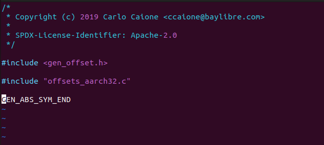

这个看起来很少哦，实际上所有秘密都藏在`arch/arm/core/offsets/offsets_aarch32.c`里面，所以最后生成的东西在`offsets.c.obj`这个文件里面，这个文件会作为`gen_offset_header.py ` 下面一步的输入。

```
[6/166] Building C object zephyr/CMakeFiles/offsets.dir/arch/arm/core/offsets/offsets.c.obj
==========arm-zephyr-eabi-gcc =====offsets.c===========
```

我们用命令展开看看

```
west -v -v -v build --build-dir d:/05_nordic/hello_world/build d:/05_nordic/hello_world --pristine --board nrf7002dk_nrf5340_cpuapp --no-sysbuild > log
```

最后

```
[6/166] D:\Nrodic_NCS\toolchains\v2.3.0\opt\zephyr-sdk\arm-zephyr-eabi\bin\arm-zephyr-eabi-gcc.exe -DKERNEL -DNRF5340_XXAA_APPLICATION -DNRF_SKIP_FICR_NS_COPY_TO_RAM -DUSE_PARTITION_MANAGER=0 -D__PROGRAM_START -D__ZEPHYR__=1 -ID:/Nrodic_NCS/v2.3.0/zephyr/kernel/include -ID:/Nrodic_NCS/v2.3.0/zephyr/arch/arm/include -ID:/Nrodic_NCS/v2.3.0/zephyr/include -Izephyr/include/generated -ID:/Nrodic_NCS/v2.3.0/zephyr/soc/arm/nordic_nrf/nrf53 -ID:/Nrodic_NCS/v2.3.0/zephyr/soc/arm/nordic_nrf/common/. -ID:/Nrodic_NCS/v2.3.0/nrf/include -ID:/Nrodic_NCS/v2.3.0/nrf/tests/include -ID:/Nrodic_NCS/v2.3.0/modules/hal/cmsis/CMSIS/Core/Include -ID:/Nrodic_NCS/v2.3.0/modules/hal/nordic/nrfx -ID:/Nrodic_NCS/v2.3.0/modules/hal/nordic/nrfx/drivers/include -ID:/Nrodic_NCS/v2.3.0/modules/hal/nordic/nrfx/mdk -ID:/Nrodic_NCS/v2.3.0/zephyr/modules/hal_nordic/nrfx/. -isystem D:/Nrodic_NCS/v2.3.0/zephyr/lib/libc/minimal/include -isystem d:/nrodic_ncs/toolchains/v2.3.0/opt/zephyr-sdk/arm-zephyr-eabi/bin/../lib/gcc/arm-zephyr-eabi/12.1.0/include -isystem d:/nrodic_ncs/toolchains/v2.3.0/opt/zephyr-sdk/arm-zephyr-eabi/bin/../lib/gcc/arm-zephyr-eabi/12.1.0/include-fixed -isystem D:/Nrodic_NCS/v2.3.0/nrfxlib/crypto/nrf_cc312_platform/include -fno-strict-aliasing -Os -imacros D:/05_nordic/hello_world/build/zephyr/include/generated/autoconf.h -ffreestanding -fno-common -g -gdwarf-4 -fdiagnostics-color=always -mcpu=cortex-m33 -mthumb -mabi=aapcs -mfp16-format=ieee --sysroot=D:/Nrodic_NCS/toolchains/v2.3.0/opt/zephyr-sdk/arm-zephyr-eabi/arm-zephyr-eabi -imacros D:/Nrodic_NCS/v2.3.0/zephyr/include/zephyr/toolchain/zephyr_stdint.h -Wall -Wformat -Wformat-security -Wno-format-zero-length -Wno-main -Wno-pointer-sign -Wpointer-arith -Wexpansion-to-defined -Wno-unused-but-set-variable -Werror=implicit-int -fno-pic -fno-pie -fno-asynchronous-unwind-tables -fno-reorder-functions --param=min-pagesize=0 -fno-defer-pop -fmacro-prefix-map=D:/05_nordic/hello_world=CMAKE_SOURCE_DIR -fmacro-prefix-map=D:/Nrodic_NCS/v2.3.0/zephyr=ZEPHYR_BASE -fmacro-prefix-map=D:/Nrodic_NCS/v2.3.0=WEST_TOPDIR -ffunction-sections -fdata-sections -std=c99 -nostdinc -MD -MT zephyr/CMakeFiles/offsets.dir/arch/arm/core/offsets/offsets.c.obj -MF zephyr\CMakeFiles\offsets.dir\arch\arm\core\offsets\offsets.c.obj.d -o zephyr/CMakeFiles/offsets.dir/arch/arm/core/offsets/offsets.c.obj -c D:/Nrodic_NCS/v2.3.0/zephyr/arch/arm/core/offsets/offsets.c


[7/166] cmd.exe /C "cd /D D:\05_nordic\hello_world\build\zephyr && D:\Nrodic_NCS\toolchains\v2.3.0\opt\bin\python.exe D:/Nrodic_NCS/v2.3.0/zephyr/scripts/build/gen_offset_header.py -i D:/05_nordic/hello_world/build/zephyr/CMakeFiles/offsets.dir/./arch/arm/core/offsets/offsets.c.obj -o D:/05_nordic/hello_world/build/zephyr/include/generated/offsets.h"

```

offset.h里面的东西：

~/zephyrproject/zephyr/build/zephyr/include/generated/offsets.h

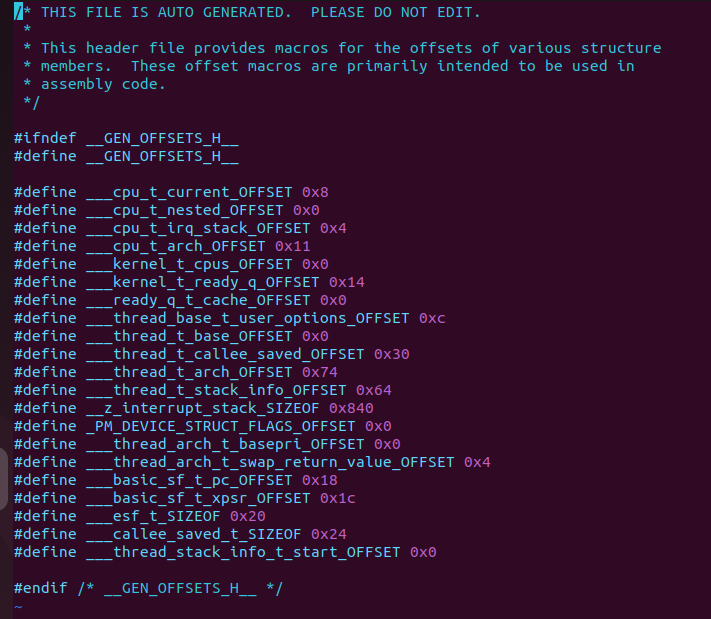

##### 总结

offset主要用于生成一些汇编要用的一些宏，在汇编中会用到，方便抽象CPU的一些操作。共用一些代码。


## 中间二进制

什么是中间二进制呢？

我理解是：中间编译.c过程中，需要通过python脚本对一些.c进行处理的，而且这些.c大部分是中间生成的，要通过脚本生成并且处理。

以及一些生成.a的过程。

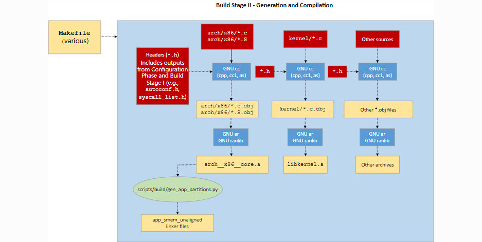

```
-Wl,--whole-archive
app/libapp.a  
zephyr/libzephyr.a  
zephyr/arch/common/libarch__common.a  
zephyr/arch/arch/arm/core/aarch32/libarch__arm__core__aarch32.a  zephyr/arch/arch/arm/core/aarch32/cortex_m/libarch__arm__core__aarch32__cortex_m.a  zephyr/arch/arch/arm/core/aarch32/cortex_m/cmse/libarch__arm__core__aarch32__cortex_m__cmse.a  zephyr/arch/arch/arm/core/aarch32/mpu/libarch__arm__core__aarch32__mpu.a  
zephyr/lib/libc/minimal/liblib__libc__minimal.a  
zephyr/soc/arm/common/cortex_m/libsoc__arm__common__cortex_m.a  
zephyr/drivers/clock_control/libdrivers__clock_control.a  
zephyr/drivers/console/libdrivers__console.a  
zephyr/drivers/gpio/libdrivers__gpio.a  
zephyr/drivers/serial/libdrivers__serial.a  
zephyr/drivers/timer/libdrivers__timer.a  
zephyr/drivers/pinctrl/libdrivers__pinctrl.a  
modules/nrf/lib/fatal_error/lib..__nrf__lib__fatal_error.a  
modules/nrf/drivers/hw_cc310/lib..__nrf__drivers__hw_cc310.a  
modules/hal_nordic/nrfx/libmodules__hal_nordic__nrfx.a  
-Wl,--no-whole-archive  
zephyr/kernel/libkernel.a  
zephyr/CMakeFiles/offsets.dir/./arch/arm/core/offsets/offsets.c.obj  
-L"d:/nrodic_ncs/toolchains/v2.3.0/opt/zephyr-sdk/arm-zephyr-eabi/bin/../lib/gcc/arm-zephyr-eabi/12.1.0/thumb/v8-m.main/nofp" 
-LD:/05_nordic/hello_world/build/zephyr  
-lgcc  -Wl,--print-memory-usage  
zephyr/arch/common/libisr_tables.a
```

这边它讲了不固定大小和固定大小

并且举了个例子，

我们先看下面的例子`dev_handlers.c`是固定大小，是devicetree使用的，`isr_tables.c`是固定大小。

从下面的代码中我们也可以看出来，下面的图有些感觉反过来了。

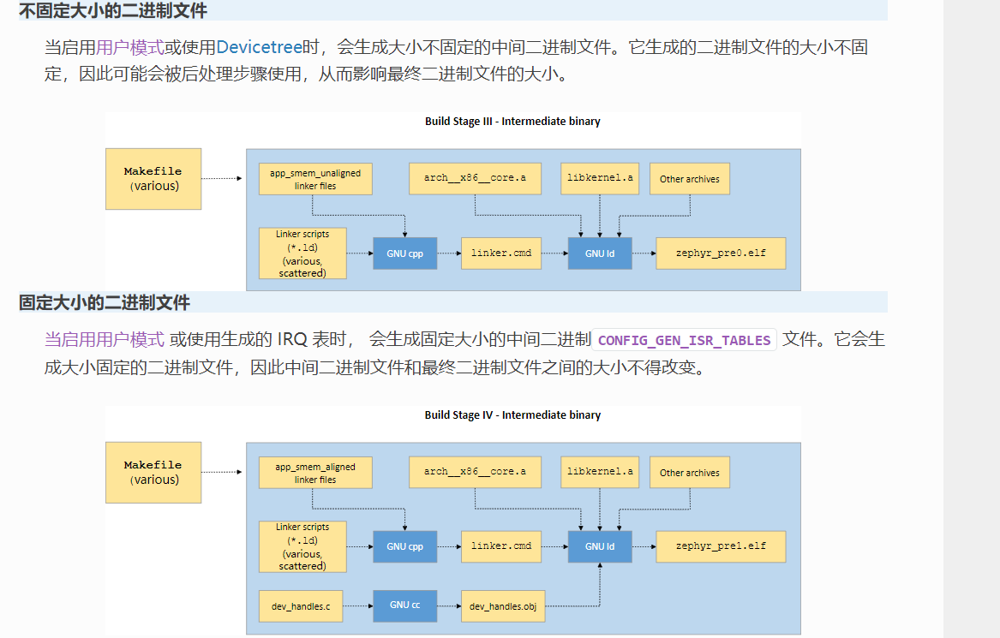

### dev_handlers.c

这个文件是因为要使用`devicetree`

这个文件是由`gen_handlers.py` 这个文件生成的。

```
[157/166] cmd.exe /C "cd /D D:\05_nordic\hello_world\build\zephyr && D:\Nrodic_NCS\toolchains\v2.3.0\opt\bin\python.exe D:/Nrodic_NCS/v2.3.0/zephyr/scripts/build/gen_handles.py --output-source dev_handles.c --output-graphviz dev_graph.dot --num-dynamic-devices 0 --kernel D:/05_nordic/hello_world/build/zephyr/zephyr_pre0.elf --zephyr-base D:/Nrodic_NCS/v2.3.0/zephyr --start-symbol __device_start"
```

生成之后的文件`build\zephyr\dev_handers.c`

```
#include <zephyr/device.h>
#include <zephyr/toolchain.h>

/* 1 : /soc/peripheral@50000000/clock@5000:
 */
const Z_DECL_ALIGN(device_handle_t) __attribute__((__section__(".__device_handles_pass2")))
__devicehdl_dts_ord_80[] = { DEVICE_HANDLE_SEP, DEVICE_HANDLE_SEP, DEVICE_HANDLE_ENDS };

/* 2 : /soc/peripheral@50000000/gpio@842800:
 */
const Z_DECL_ALIGN(device_handle_t) __attribute__((__section__(".__device_handles_pass2")))
__devicehdl_dts_ord_9[] = { DEVICE_HANDLE_SEP, DEVICE_HANDLE_SEP, DEVICE_HANDLE_ENDS };

/* 3 : /soc/peripheral@50000000/gpio@842500:
 */
const Z_DECL_ALIGN(device_handle_t) __attribute__((__section__(".__device_handles_pass2")))
__devicehdl_dts_ord_8[] = { DEVICE_HANDLE_SEP, DEVICE_HANDLE_SEP, DEVICE_HANDLE_ENDS };

/* 4 : /soc/peripheral@50000000/uart@8000:
 */
const Z_DECL_ALIGN(device_handle_t) __attribute__((__section__(".__device_handles_pass2")))
__devicehdl_dts_ord_120[] = { DEVICE_HANDLE_SEP, DEVICE_HANDLE_SEP, DEVICE_HANDLE_ENDS };

```

这个有点像devicetree那边需要用到的handle的地址。

### isr_tables.c

中断生成命令

```
[162/166] cmd.exe /C "cd /D D:\05_nordic\hello_world\build\zephyr 

&& D:\Nrodic_NCS\toolchains\v2.3.0\opt\zephyr-sdk\arm-zephyr-eabi\bin\arm-zephyr-eabi-objcopy.exe --input-target=elf32-littlearm --output-target=binary --only-section=.intList D:/05_nordic/hello_world/build/zephyr/zephyr_pre1.elf isrList.bin 

&& D:\Nrodic_NCS\toolchains\v2.3.0\opt\bin\python.exe D:/Nrodic_NCS/v2.3.0/zephyr/scripts/build/gen_isr_tables.py --output-source isr_tables.c --kernel D:/05_nordic/hello_world/build/zephyr/zephyr_pre1.elf --intlist isrList.bin --sw-isr-table --vector-table"
```


`gen_isr_tables.py` 脚本生成`build\zephyr\isr_tables.c`

我们看看`isr_tables.c`里面由啥, 下面的代码省略掉一些，主要是中断向量表

```
/* AUTO-GENERATED by gen_isr_tables.py, do not edit! */

#include <zephyr/toolchain.h>
#include <zephyr/linker/sections.h>
#include <zephyr/sw_isr_table.h>
#include <zephyr/arch/cpu.h>

typedef void (* ISR)(const void *);
uintptr_t __irq_vector_table _irq_vector_table[69] = {
	((uintptr_t)&_isr_wrapper),
};
struct _isr_table_entry __sw_isr_table _sw_isr_table[69] = {
	{(const void *)0x0, (ISR)((uintptr_t)&z_irq_spurious)},
	{(const void *)0x0, (ISR)((uintptr_t)&z_irq_spurious)},
	{(const void *)0x0, (ISR)((uintptr_t)&z_irq_spurious)},
	{(const void *)0x0, (ISR)((uintptr_t)&z_irq_spurious)},
	{(const void *)0x0, (ISR)((uintptr_t)&z_irq_spurious)},
	{(const void *)0x2d21, (ISR)0x4d53},
	{(const void *)0x0, (ISR)((uintptr_t)&z_irq_spurious)},
	{(const void *)0x0, (ISR)((uintptr_t)&z_irq_spurious)},
	{(const void *)0x5410, (ISR)0x4c7b},
	{(const void *)0x0, (ISR)((uintptr_t)&z_irq_spurious)},
	{(const void *)0x0, (ISR)((uintptr_t)&z_irq_spurious)},
	{(const void *)0x0, (ISR)((uintptr_t)&z_irq_spurious)},
	{(const void *)0x0, (ISR)((uintptr_t)&z_irq_spurious)},
	{(const void *)0x3301, (ISR)0x4d53},
};

```

这两个.c都是一个数组，一个数组大小不固定，一个数组大小固定。

还有个分区对其`gen_app_partitions.py` 这个这次编译没有遇到，我们暂时不深入介绍。

## 中间二进制后期处理

`gen_handles.py `  通过zephyr_pre0.elf 生成dev_handles.c， dev_handles.c生成dev_handles.c.obj

```
[159/166] D:\Nrodic_NCS\toolchains\v2.3.0\opt\zephyr-sdk\arm-zephyr-eabi\bin\arm-zephyr-eabi-gcc.exe -DKERNEL -DNRF5340_XXAA_APPLICATION -DNRF_SKIP_FICR_NS_COPY_TO_RAM -DUSE_PARTITION_MANAGER=0 -D__PROGRAM_START -D__ZEPHYR__=1 -ID:/Nrodic_NCS/v2.3.0/zephyr/include -Izephyr/include/generated -ID:/Nrodic_NCS/v2.3.0/zephyr/soc/arm/nordic_nrf/nrf53 -ID:/Nrodic_NCS/v2.3.0/zephyr/soc/arm/nordic_nrf/common/. -ID:/Nrodic_NCS/v2.3.0/nrf/include -ID:/Nrodic_NCS/v2.3.0/nrf/tests/include -ID:/Nrodic_NCS/v2.3.0/modules/hal/cmsis/CMSIS/Core/Include -ID:/Nrodic_NCS/v2.3.0/modules/hal/nordic/nrfx -ID:/Nrodic_NCS/v2.3.0/modules/hal/nordic/nrfx/drivers/include -ID:/Nrodic_NCS/v2.3.0/modules/hal/nordic/nrfx/mdk -ID:/Nrodic_NCS/v2.3.0/zephyr/modules/hal_nordic/nrfx/. -isystem D:/Nrodic_NCS/v2.3.0/zephyr/lib/libc/minimal/include -isystem d:/nrodic_ncs/toolchains/v2.3.0/opt/zephyr-sdk/arm-zephyr-eabi/bin/../lib/gcc/arm-zephyr-eabi/12.1.0/include -isystem d:/nrodic_ncs/toolchains/v2.3.0/opt/zephyr-sdk/arm-zephyr-eabi/bin/../lib/gcc/arm-zephyr-eabi/12.1.0/include-fixed -isystem D:/Nrodic_NCS/v2.3.0/nrfxlib/crypto/nrf_cc312_platform/include -fno-strict-aliasing -Os -imacros D:/05_nordic/hello_world/build/zephyr/include/generated/autoconf.h -ffreestanding -fno-common -g -gdwarf-4 -fdiagnostics-color=always -mcpu=cortex-m33 -mthumb -mabi=aapcs -mfp16-format=ieee --sysroot=D:/Nrodic_NCS/toolchains/v2.3.0/opt/zephyr-sdk/arm-zephyr-eabi/arm-zephyr-eabi -imacros D:/Nrodic_NCS/v2.3.0/zephyr/include/zephyr/toolchain/zephyr_stdint.h -Wall -Wformat -Wformat-security -Wno-format-zero-length -Wno-main -Wno-pointer-sign -Wpointer-arith -Wexpansion-to-defined -Wno-unused-but-set-variable -Werror=implicit-int -fno-pic -fno-pie -fno-asynchronous-unwind-tables -fno-reorder-functions --param=min-pagesize=0 -fno-defer-pop -fmacro-prefix-map=D:/05_nordic/hello_world=CMAKE_SOURCE_DIR -fmacro-prefix-map=D:/Nrodic_NCS/v2.3.0/zephyr=ZEPHYR_BASE -fmacro-prefix-map=D:/Nrodic_NCS/v2.3.0=WEST_TOPDIR -ffunction-sections -fdata-sections -std=c99 -nostdinc -MD -MT zephyr/CMakeFiles/zephyr_pre1.dir/dev_handles.c.obj -MF zephyr\CMakeFiles\zephyr_pre1.dir\dev_handles.c.obj.d -o zephyr/CMakeFiles/zephyr_pre1.dir/dev_handles.c.obj -c zephyr/dev_handles.c
```


`gen_isr_tables.py`  生成isr_tables.c 然后用gcc生成isr_tables.c.obj

```
[165/166] D:\Nrodic_NCS\toolchains\v2.3.0\opt\zephyr-sdk\arm-zephyr-eabi\bin\arm-zephyr-eabi-gcc.exe -DKERNEL -DNRF5340_XXAA_APPLICATION -DNRF_SKIP_FICR_NS_COPY_TO_RAM -DUSE_PARTITION_MANAGER=0 -D__PROGRAM_START -D__ZEPHYR__=1 -ID:/Nrodic_NCS/v2.3.0/zephyr/include -Izephyr/include/generated -ID:/Nrodic_NCS/v2.3.0/zephyr/soc/arm/nordic_nrf/nrf53 -ID:/Nrodic_NCS/v2.3.0/zephyr/soc/arm/nordic_nrf/common/. -ID:/Nrodic_NCS/v2.3.0/nrf/include -ID:/Nrodic_NCS/v2.3.0/nrf/tests/include -ID:/Nrodic_NCS/v2.3.0/modules/hal/cmsis/CMSIS/Core/Include -ID:/Nrodic_NCS/v2.3.0/modules/hal/nordic/nrfx -ID:/Nrodic_NCS/v2.3.0/modules/hal/nordic/nrfx/drivers/include -ID:/Nrodic_NCS/v2.3.0/modules/hal/nordic/nrfx/mdk -ID:/Nrodic_NCS/v2.3.0/zephyr/modules/hal_nordic/nrfx/. -isystem D:/Nrodic_NCS/v2.3.0/zephyr/lib/libc/minimal/include -isystem d:/nrodic_ncs/toolchains/v2.3.0/opt/zephyr-sdk/arm-zephyr-eabi/bin/../lib/gcc/arm-zephyr-eabi/12.1.0/include -isystem d:/nrodic_ncs/toolchains/v2.3.0/opt/zephyr-sdk/arm-zephyr-eabi/bin/../lib/gcc/arm-zephyr-eabi/12.1.0/include-fixed -isystem D:/Nrodic_NCS/v2.3.0/nrfxlib/crypto/nrf_cc312_platform/include -fno-strict-aliasing -Os -imacros D:/05_nordic/hello_world/build/zephyr/include/generated/autoconf.h -ffreestanding -fno-common -g -gdwarf-4 -fdiagnostics-color=always -mcpu=cortex-m33 -mthumb -mabi=aapcs -mfp16-format=ieee --sysroot=D:/Nrodic_NCS/toolchains/v2.3.0/opt/zephyr-sdk/arm-zephyr-eabi/arm-zephyr-eabi -imacros D:/Nrodic_NCS/v2.3.0/zephyr/include/zephyr/toolchain/zephyr_stdint.h -Wall -Wformat -Wformat-security -Wno-format-zero-length -Wno-main -Wno-pointer-sign -Wpointer-arith -Wexpansion-to-defined -Wno-unused-but-set-variable -Werror=implicit-int -fno-pic -fno-pie -fno-asynchronous-unwind-tables -fno-reorder-functions --param=min-pagesize=0 -fno-defer-pop -fmacro-prefix-map=D:/05_nordic/hello_world=CMAKE_SOURCE_DIR -fmacro-prefix-map=D:/Nrodic_NCS/v2.3.0/zephyr=ZEPHYR_BASE -fmacro-prefix-map=D:/Nrodic_NCS/v2.3.0=WEST_TOPDIR -ffunction-sections -fdata-sections -std=c99 -nostdinc -MD -MT zephyr/CMakeFiles/zephyr_final.dir/isr_tables.c.obj -MF zephyr\CMakeFiles\zephyr_final.dir\isr_tables.c.obj.d -o zephyr/CMakeFiles/zephyr_final.dir/isr_tables.c.obj -c zephyr/isr_tables.c

```

下面讲了个hash相关的，感觉和gperf有关系，这个以后有机会介绍。但是这个相关的没有看到

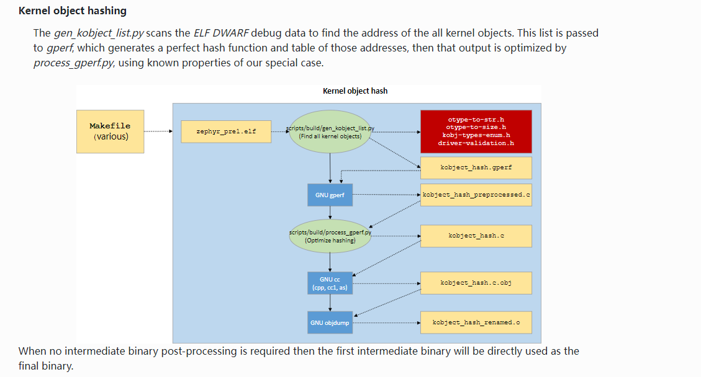

## 最终二进制文件

```
[157/166] Generating dev_handles.c
[158/166] Building C object zephyr/CMakeFiles/zephyr_pre1.dir/misc/empty_file.c.obj
[159/166] Building C object zephyr/CMakeFiles/zephyr_pre1.dir/dev_handles.c.obj
[160/166] Linking C executable zephyr\zephyr_pre1.elf

[161/166] Generating linker.cmd
[162/166] Generating isr_tables.c, isrList.bin
[163/166] Building C object zephyr/CMakeFiles/zephyr_final.dir/misc/empty_file.c.obj
[164/166] Building C object zephyr/CMakeFiles/zephyr_final.dir/dev_handles.c.obj
[165/166] Building C object zephyr/CMakeFiles/zephyr_final.dir/isr_tables.c.obj
[166/166] Linking C executable zephyr\zephyr.elf
```

这部分就是最后一部分二进制文件，这里讲的就是最后一条命令。

```
[166/166] Linking C executable zephyr\zephyr.elf
```

最后一条命令用`gcc` 生成`zephyr\zephyr.elf`  link文件是`zephyr/linker.cmd`  外加一些.a 等模块， 我们展开看看

```
[166/166] cmd.exe /C "cd . && D:\Nrodic_NCS\toolchains\v2.3.0\opt\zephyr-sdk\arm-zephyr-eabi\bin\arm-zephyr-eabi-gcc.exe  -gdwarf-4 zephyr/CMakeFiles/zephyr_final.dir/misc/empty_file.c.obj zephyr/CMakeFiles/zephyr_final.dir/dev_handles.c.obj zephyr/CMakeFiles/zephyr_final.dir/isr_tables.c.obj -o zephyr\zephyr.elf  -Wl,-T  zephyr/linker.cmd  -Wl,-Map=D:/05_nordic/hello_world/build/zephyr/zephyr_final.map  -Wl,--whole-archive  app/libapp.a  zephyr/libzephyr.a  zephyr/arch/common/libarch__common.a  zephyr/arch/arch/arm/core/aarch32/libarch__arm__core__aarch32.a  zephyr/arch/arch/arm/core/aarch32/cortex_m/libarch__arm__core__aarch32__cortex_m.a  zephyr/arch/arch/arm/core/aarch32/cortex_m/cmse/libarch__arm__core__aarch32__cortex_m__cmse.a  zephyr/arch/arch/arm/core/aarch32/mpu/libarch__arm__core__aarch32__mpu.a  zephyr/lib/libc/minimal/liblib__libc__minimal.a  zephyr/soc/arm/common/cortex_m/libsoc__arm__common__cortex_m.a  zephyr/drivers/clock_control/libdrivers__clock_control.a  zephyr/drivers/console/libdrivers__console.a  zephyr/drivers/gpio/libdrivers__gpio.a  zephyr/drivers/serial/libdrivers__serial.a  zephyr/drivers/timer/libdrivers__timer.a  zephyr/drivers/pinctrl/libdrivers__pinctrl.a  modules/nrf/lib/fatal_error/lib..__nrf__lib__fatal_error.a  modules/nrf/drivers/hw_cc310/lib..__nrf__drivers__hw_cc310.a  modules/hal_nordic/nrfx/libmodules__hal_nordic__nrfx.a  -Wl,--no-whole-archive  zephyr/kernel/libkernel.a  zephyr/CMakeFiles/offsets.dir/./arch/arm/core/offsets/offsets.c.obj  -L"d:/nrodic_ncs/toolchains/v2.3.0/opt/zephyr-sdk/arm-zephyr-eabi/bin/../lib/gcc/arm-zephyr-eabi/12.1.0/thumb/v8-m.main/nofp"  -LD:/05_nordic/hello_world/build/zephyr  -lgcc  -Wl,--print-memory-usage  zephyr/arch/common/libisr_tables.a  -no-pie  -mcpu=cortex-m33  -mthumb  -mabi=aapcs  -mfp16-format=ieee  -Wl,--gc-sections  -Wl,--build-id=none  -Wl,--sort-common=descending  -Wl,--sort-section=alignment  -Wl,-u,_OffsetAbsSyms  -Wl,-u,_ConfigAbsSyms  -nostdlib  -static  -Wl,-X  -Wl,-N  -Wl,--orphan-handling=warn  D:/Nrodic_NCS/v2.3.0/nrfxlib/crypto/nrf_cc312_platform/lib/cortex-m33/soft-float/no-interrupts/libnrf_cc312_platform_0.9.16.a 

&& cmd.exe /C "cd /D D:\05_nordic\hello_world\build\zephyr 

&& D:\Nrodic_NCS\toolchains\v2.3.0\opt\bin\cmake.exe -E copy zephyr_final.map zephyr.map 

&& D:\Nrodic_NCS\toolchains\v2.3.0\opt\zephyr-sdk\arm-zephyr-eabi\bin\arm-zephyr-eabi-objcopy.exe --gap-fill 0xff --output-target=ihex --remove-section=.comment --remove-section=COMMON --remove-section=.eh_frame zephyr.elf zephyr.hex 

&& D:\Nrodic_NCS\toolchains\v2.3.0\opt\zephyr-sdk\arm-zephyr-eabi\bin\arm-zephyr-eabi-objcopy.exe --gap-fill 0xff --output-target=binary --remove-section=.comment --remove-section=COMMON --remove-section=.eh_frame zephyr.elf zephyr.bin 

&& D:\Nrodic_NCS\toolchains\v2.3.0\opt\zephyr-sdk\arm-zephyr-eabi\bin\arm-zephyr-eabi-objdump.exe -d -S zephyr.elf > zephyr.lst 

&& D:\Nrodic_NCS\toolchains\v2.3.0\opt\zephyr-sdk\arm-zephyr-eabi\bin\arm-zephyr-eabi-readelf.exe -e zephyr.elf > zephyr.stat""

```

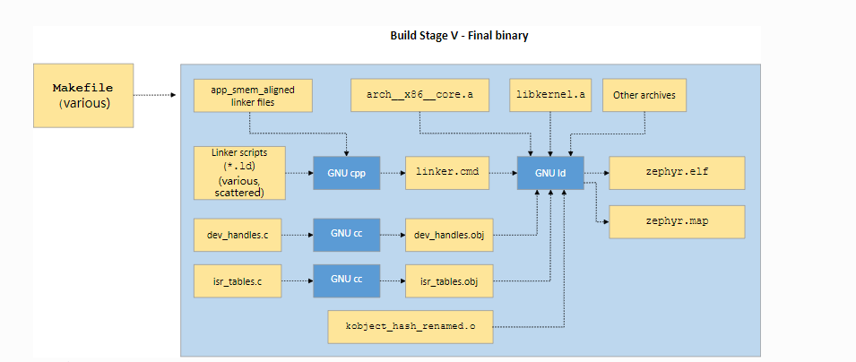

这里生成`dev_handles.obj` 和`isr_tables.obj` 以及`linker.cmd`

`linker.cmd` 是我们常用的ld文件。

原始使用的ld文件是`include\zephyr\arch\arm\aarch32\cortex_m\scripts\linker.ld`

```
[161/166] cmd.exe /C "cd /D D:\05_nordic\hello_world\build\zephyr && D:\Nrodic_NCS\toolchains\v2.3.0\opt\zephyr-sdk\arm-zephyr-eabi\bin\arm-zephyr-eabi-gcc.exe -x assembler-with-cpp -undef -MD -MF linker.cmd.dep -MT linker.cmd -D_LINKER -D_ASMLANGUAGE -imacros D:/05_nordic/hello_world/build/zephyr/include/generated/autoconf.h -ID:/Nrodic_NCS/v2.3.0/zephyr/include -ID:/05_nordic/hello_world/build/zephyr/include/generated -ID:/Nrodic_NCS/v2.3.0/zephyr/soc/arm/nordic_nrf/nrf53 -ID:/Nrodic_NCS/v2.3.0/zephyr/lib/libc/minimal/include -ID:/Nrodic_NCS/v2.3.0/zephyr/soc/arm/nordic_nrf/common/. -ID:/Nrodic_NCS/v2.3.0/nrf/include -ID:/Nrodic_NCS/v2.3.0/nrf/tests/include -ID:/Nrodic_NCS/v2.3.0/modules/hal/cmsis/CMSIS/Core/Include -ID:/Nrodic_NCS/v2.3.0/modules/hal/nordic/nrfx -ID:/Nrodic_NCS/v2.3.0/modules/hal/nordic/nrfx/drivers/include -ID:/Nrodic_NCS/v2.3.0/modules/hal/nordic/nrfx/mdk -ID:/Nrodic_NCS/v2.3.0/zephyr/modules/hal_nordic/nrfx/. -D__GCC_LINKER_CMD__ -DUSE_PARTITION_MANAGER=0 -DLINKER_ZEPHYR_FINAL -E D:/Nrodic_NCS/v2.3.0/zephyr/soc/arm/nordic_nrf/nrf53/linker.ld -P -o linker.cmd && D:\Nrodic_NCS\toolchains\v2.3.0\opt\bin\cmake.exe -E cmake_transform_depfile Ninja gccdepfile D:/05_nordic/hello_world D:/Nrodic_NCS/v2.3.0/zephyr D:/05_nordic/hello_world/build D:/05_nordic/hello_world/build/zephyr D:/05_nordic/hello_world/build/zephyr/linker.cmd.dep D:/05_nordic/hello_world/build/CMakeFiles/d/d3db1b87c3855342efba494985bdcbc904fb7b63ecde7a32b125a5d1f7c33820.d"
```


```
The binary from the previous stage is incomplete, with empty and/or placeholder sections that must be filled in by, essentially, reflection.
前面阶段生成的二进制并不完整，有空的或者展位的段需要填充或者反射

The link from the previous stage is repeated, this time with the missing pieces populated.
前面生成的link文件再次生成，这次填充缺失的部分。
```


##  最终二进制后期处理

后期处理主要生成一些烧入需要的文件比如hex 和bin文件，

```
Finally, if necessary, the completed kernel is converted from ELF to the format expected by the loader and/or flash tool required by the target. This is accomplished in a straightforward manner with objdump.
```

最后，如果需要的话，整个内核通过elf的格式转换成hex或者bin的格式供 flash tool使用。这个阶段是通过objdump完成的，实际上是`objcopy`

我们看最后一条命令后面有几步操作

```
&& D:\Nrodic_NCS\toolchains\v2.3.0\opt\zephyr-sdk\arm-zephyr-eabi\bin\arm-zephyr-eabi-objcopy.exe --gap-fill 0xff --output-target=ihex --remove-section=.comment --remove-section=COMMON --remove-section=.eh_frame zephyr.elf zephyr.hex 

&& D:\Nrodic_NCS\toolchains\v2.3.0\opt\zephyr-sdk\arm-zephyr-eabi\bin\arm-zephyr-eabi-objcopy.exe --gap-fill 0xff --output-target=binary --remove-section=.comment --remove-section=COMMON --remove-section=.eh_frame zephyr.elf zephyr.bin 
```


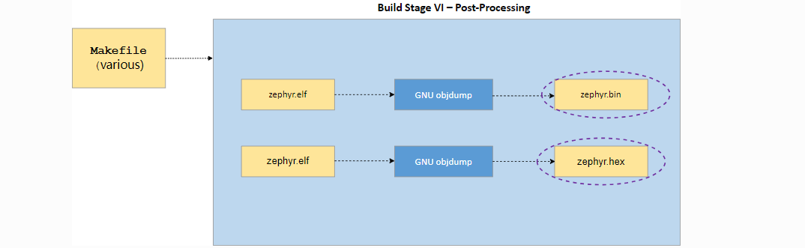

## 脚本介绍

这里介绍一些常用脚本的主要内容简介

也是翻译过来的，具体脚本可以直接读源文件。

### scripts/build/gen_syscalls.py

用于生成系统调用调用宏的脚本

此脚本解析由 parse_syscalls.py 发出的系统调用元数据 JSON 文件以创建多个文件：

- 包含任何可能未实现的系统调用的弱别名的文件，以及系统调用调度表，该表将系统调用类型 ID 映射到其处理程序函数。
- 定义系统调用类型 ID 以及所有系统调用处理函数的函数原型的头文件。
- 包含头文件的目录。每个标头对应于被标识为包含系统调用声明的标头。这些生成的标头包含该标头中每个系统调用的内联调用函数。

### scripts/build/parse_syscalls.py

用于扫描 Zephyr 包含目录并发出系统调用和子系统元数据的脚本

系统调用需要大量样板代码才能完整实现。该脚本是构建系统通过对包含 C 或头文件的目录进行文本扫描来自动生成此代码的过程的第一步，并构建系统调用及其函数调用原型的数据库。此信息将发送到生成的 JSON 文件以供进一步处理。

该脚本还扫描 __subsystem 和 __net_socket 等结构体定义，发出一个 JSON 字典，将标签映射到找到的所有用它们标记的结构体声明。

如果输出 JSON 文件已存在，则会根据该脚本将输出的信息检查其内容；如果结果是文件未更改，则不会对其进行修改，以防止不必要的增量构建。


### scripts/build/gen_kobject_list.py

用于生成内核对象元数据的 **gperf** 表的脚本

进行系统调用的用户模式线程通过内存地址引用内核对象，因为 Zephyr 中的内核/驱动程序 API 对于用户和主管上下文都是相同的。内核必须能够验证对内核对象的访问才能做出以下断言：

> - 内存地址指向内核对象
> - 内核对象是所调用的 API 的预期类型
> - 内核对象处于预期的初始化状态
> - 调用线程对该对象有足够的权限

有关更多详细信息，请参阅文档中的[内核对象部分。](https://docs.zephyrproject.org/latest/kernel/usermode/kernelobjects.html#kernelobjects)

zephyr 构建生成一个中间 ELF 二进制文件 zephyr_prebuilt.elf，该脚本通过检查 DWARF 调试信息来扫描该二进制文件以查找内核对象，以查找被视为内核对象的数据结构实例。对于设备驱动程序，还会检查在构建时填充的 API 结构指针，以消除各种设备驱动程序实例之间的歧义，因为它们都是“结构设备”。

该脚本可以生成五个不同的输出文件：

> - gperf 脚本，用于生成将内核对象内存地址映射到内核对象元数据的哈希表，用于跟踪权限、对象类型、初始化状态和任何特定于对象的数据。
> - 包含生成的宏的头文件，用于验证驱动程序子系统 API 的系统调用处理程序内的驱动程序实例。
> - kernel.h 包含的代码片段，其中每个内核对象类型和每个驱动程序实例都有一个枚举常量。
> - switch/case C 语句的内部情况，包含在 kernel/userspace.c 中，将内核对象类型和驱动程序实例映射到 otype_to_str() 函数中的人类可读表示。
> - switch/case C 语句的内部情况，包含在 kernel/userspace.c 中，将内核对象类型映射到它们的大小。这用于在运行时（CONFIG_DYNAMIC_OBJECTS）在 obj_size_get() 函数中分配它们的实例。

====这里涉及到gperf ====== 这个知识点可能是linux里面的

### scripts/build/gen_offset_header.py

`_OFFSET`该脚本扫描指定的目标文件并生成一个头文件，该头文件定义了各种找到的结构成员（特别是以或结尾的符号）的偏移量的宏，`_SIZEOF`主要用于汇编代码。

//==============上面几个脚本呢，是这次会用到的，下面的脚本这次没有用到，内容也不是很确定，我也觉得不是特别通用=========

### scripts/build/gen_handles.py

这个最新的zephyr代码中已经改名为`gen_device_deps.py`

将通用句柄转换为针对应用程序优化的句柄。

不可变设备数据包括有关依赖性的信息，例如，特定传感器通过特定 I2C 总线控制，并且它在特定 GPIO 控制器上的引脚上发出事件信号。该信息使用从设备树派生的标识符编码在第一遍二进制文件中。该脚本提取这些标识符并将其替换为针对实际存在的设备而优化的标识符。

例如，传感器可能有一个由其设备树序号 52 定义的首轮句柄，I2C 驱动程序的序号为 24，GPIO 控制器序号为 14。运行时序号是静态设备树数组中相应设备的索引，这可能是分别为 6、5 和 3。

输出是一个 C 源文件，它为从不可变设备对象引用的数组内容提供替代定义。在最后一个链接中，这些定义将取代特定于驱动程序的目标文件中的定义。

剩下的，我感觉和MCU关系不大，放在下面，大家需要可以自行查阅

https://developer.nordicsemi.com/nRF_Connect_SDK/doc/latest/zephyr/build/cmake/index.html#supporting-scripts-and-tools

arch/x86/gen_idt.py
arch/x86/gen_gdt.py
scripts/build/gen_relocate_app.py
scripts/build/process_gperf.py
scripts/build/gen_app_partitions.py
scripts/build/check init_priorities.py