# 快速开始

本文参考https://supperthomas-wiki.readthedocs.io/en/latest/16_ColeStudy/

这里的NCS(Nordic connect sdk)开发 代表的是

## 简介

本文主要让大家快速构建ncs的编译环境搭建zephyr，当然这个zephyr是基于nordic的代码base，不过zephyr和nordic的基本上原理是差不多的。

所以掌握这个编译环境，可以快速搭建编译环境，不需要搭建zephyr复杂的配置。

## 难点

搭建环境有个难点就是需要科学上网，如果你能科学上网的话，可以直接看安装步骤

## 安装步骤

### 安装nrf sdk tool

参考链接：

https://developer.nordicsemi.com/nRF_Connect_SDK/doc/latest/nrf/installation/assistant.html#auto-installation

先看下当前的支持的平台：

支持window和linux和mac，大部分小伙伴应该是x64， 应该都支持，其他平台可能会不一定支持。

参考：

https://developer.nordicsemi.com/nRF_Connect_SDK/doc/latest/nrf/installation/recommended_versions.html#requirements

安装路径：

https://www.nordicsemi.com/Products/Development-tools/nRF-Connect-for-Desktop/Download#infotabs

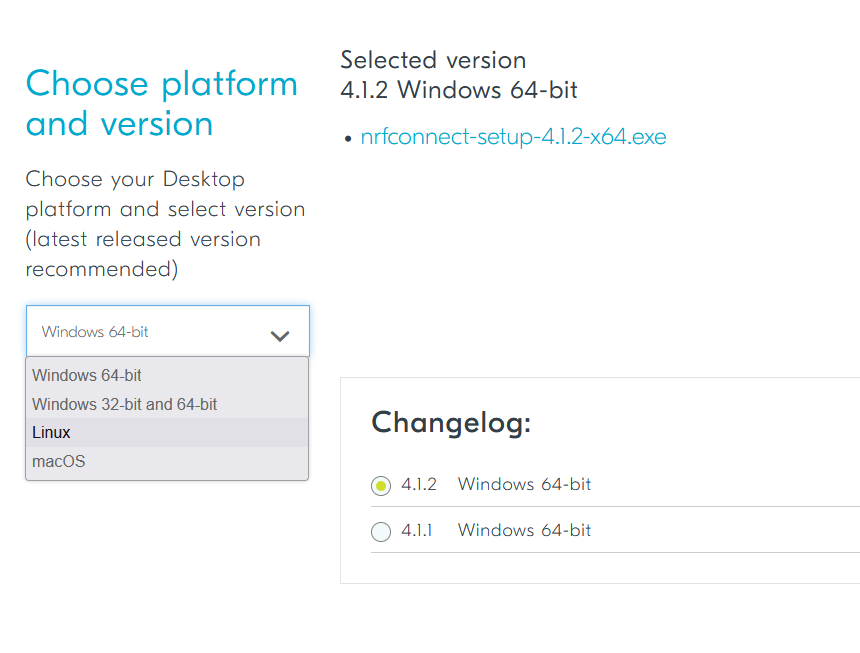

### 安装sdk

nrf connect sdk有很多功能，其中有一个就是用来安装SDK的，点击`install` 然后会出现`open`按钮。如下图：

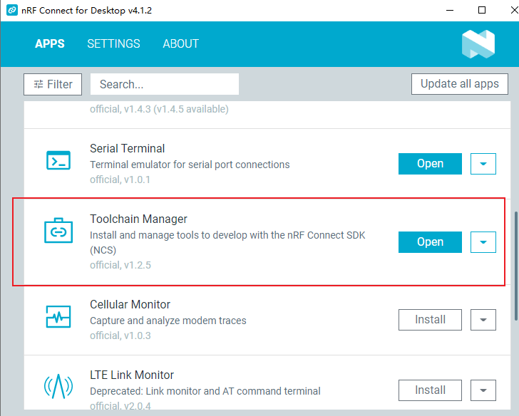

然后打开的界面中选择最新的版本，目前是`2.4.0` 版本，点击`install`  ，（这一步需要科学上网，可能需要很长的时间，和你的网络速度有关系）然后点击`open vs code`

点击`First steps` 可以打开相应的文档网页。

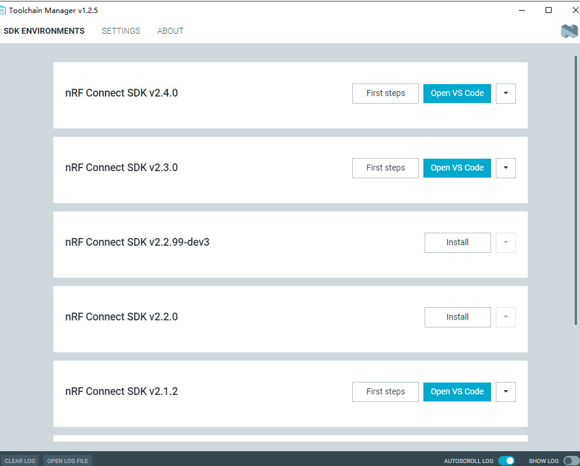

## 编译第一个hello world

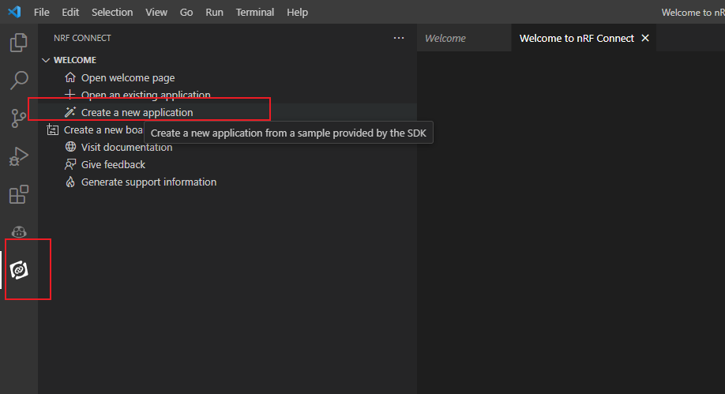

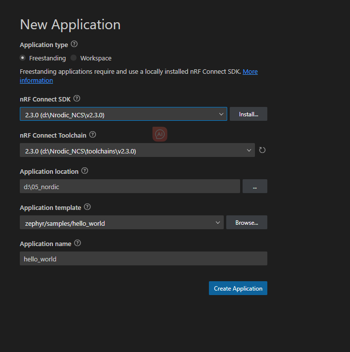

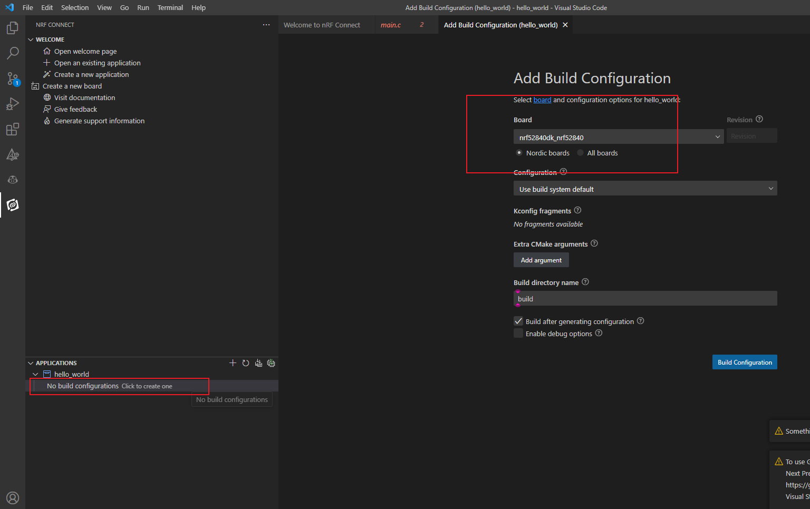

### 编译

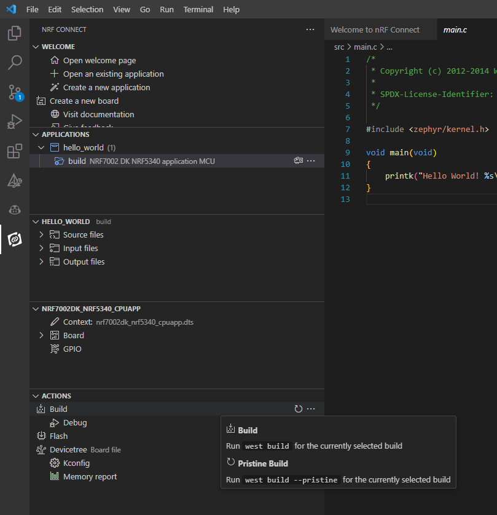

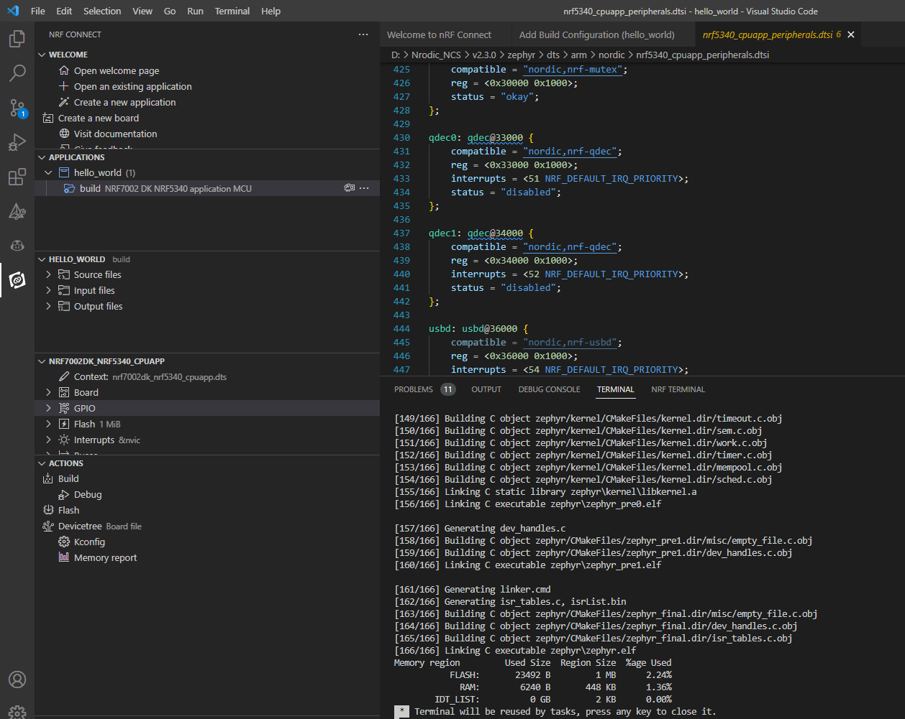

### 烧入

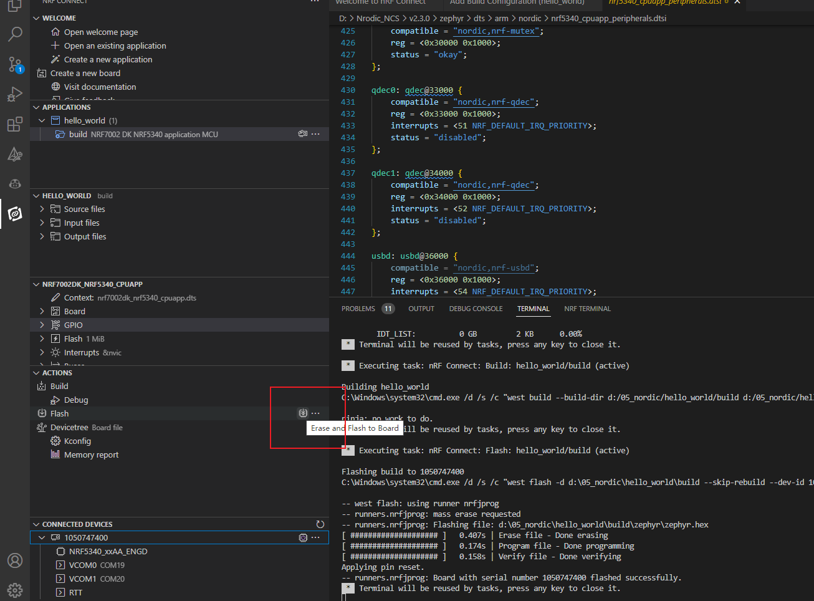

### 串口检查

打开串口之后，按下复位键。

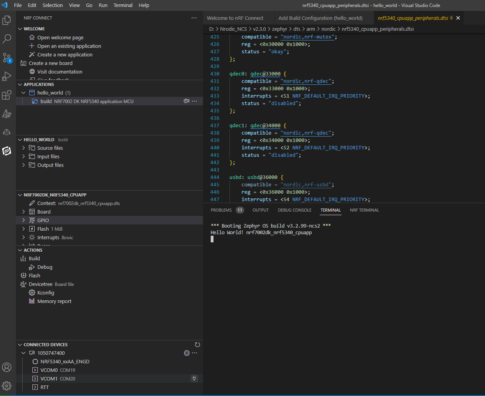

### 配置

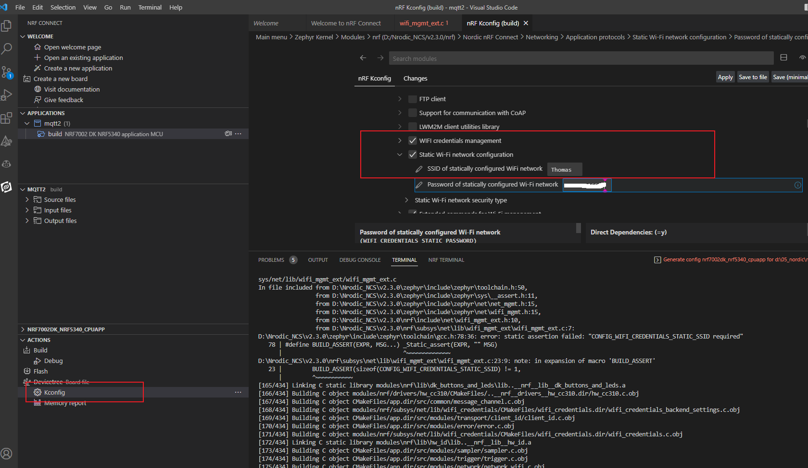