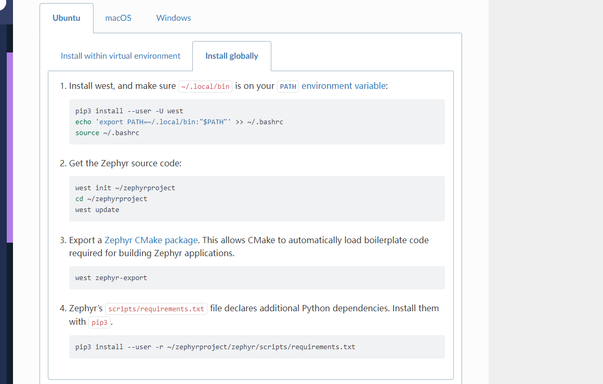

# ZEPHYR 快速开发指南

## 简介

国内小伙伴在学习zephyr的时候，有以下几个痛点：

- 学习门槛过高
- github访问不畅，下载起来比较费劲。

这篇文章将我自己踩的坑介绍一下，顺便给大家优化一些地方，避免掉所有的坑。

首先用`virtualbox` 来安装一个ubuntu22.04

本文适应的是ubuntu的操作系统

## github访问不畅的问题

`github.com ` 有时候无法访问，这边有个非常好用的办法，执行下面两个命令：

```
git config --global url."git@git.zhlh6.cn:".insteadOf https://github.com/
```

这个命令把`github.com` 转换成镜像国内地址，

执行完之后，可以通过查看`~/.gitconfig` 文件来检查替换是否正确。

## 开始搭建zephyr环境

https://docs.zephyrproject.org/latest/develop/getting_started/index.html#get-zephyr-and-install-python-dependencies

按照zephyr中的install

网页中第一步是安装Kitware， 这个只要你的ubuntu是22.04 及以上的就可以跳过这一步

### 第一步安装软件

当然记得切换一下软件源为国内cn99 ，这样下载软件会比较快

用下面的命令

```
sudo apt install --no-install-recommends git cmake ninja-build gperf \
  ccache dfu-util device-tree-compiler wget \
  python3-dev python3-pip python3-setuptools python3-tk python3-wheel xz-utils file \
  make gcc gcc-multilib g++-multilib libsdl2-dev libmagic1
```

检查软件是否安装正常：

```
cmake --version
python3 --version
dtc --version
```

## 获取 Zephyr 并安装 Python 依赖项

### 安装python venv包

输入下面的命令

```
sudo apt install python3-venv
```

### 创建新的虚拟环境：

```
python3 -m venv ~/zephyrproject/.venv
```

### 激活虚拟环境：

```
source ~/zephyrproject/.venv/bin/activate
```

如果不希望创建虚拟环境，直接改现有环境可以进入下面的tab页进行安装




### 安装west

```
pip install west
```

### 获取源码

```
west init ~/zephyrproject
cd ~/zephyrproject
```

这里需要注意west update这里会把所有包都下载下来，实际上有些hello world没必要下载所有的，

下面以STM32-L496ZG举例，

打开`west.yml`

只需要保留`cmsis`和`hal_stm32`即可，如下所示，可以参考当时的west.yml来修改：

```
manifest:
  defaults:
    remote: upstream

  remotes:
    - name: upstream
      url-base: https://github.com/zephyrproject-rtos
    - name: babblesim
      url-base: https://github.com/BabbleSim

  group-filter: [-babblesim]

  #
  # Please add items below based on alphabetical order
  projects:
    - name: cmsis
      revision: 74981bf893e8b10931464b9945e2143d99a3f0a3
      path: modules/hal/cmsis
      groups:
        - hal
    - name: hal_stm32
      revision: 1bc72c299d0365c0ee2575a97918b22df0899e10
      path: modules/hal/stm32
      groups:
        - hal

  self:
    path: zephyr
    west-commands: scripts/west-commands.yml
    import: submanifests
```

### 执行 west update

这个时候执行一下`west update`

当然你也可以全部下载，其实没必要，可以先跑起来，后面仓库慢慢添加 ，我是觉得下载需要很长的时间。

### 到处模板

执行下面的命令到处cmake模板

```
west zephyr-export
```

### pip安装依赖

Zephyr 的`scripts/requirements.txt`文件声明了额外的 Python 依赖项。安装它们`pip`。

```
pip install -r ~/zephyrproject/zephyr/scripts/requirements.txt
```

## 安装SDK

SDK 相当于toolchain

下载命令

```
cd ~
wget https://github.com/zephyrproject-rtos/sdk-ng/releases/download/v0.16.1/zephyr-sdk-0.16.1_linux-x86_64.tar.xz
wget -O - https://github.com/zephyrproject-rtos/sdk-ng/releases/download/v0.16.1/sha256.sum | shasum --check --ignore-missing
```

这个命令也要`github.com` ， 这个可以自己在网页上下载。这个用`https://ghproxy.com/` 这个网站上下载，非常快。

### 解压

```
tar xvf zephyr-sdk-0.16.1_linux-x86_64.tar.xz
```

### 设置环境变量

```
cd zephyr-sdk-0.16.1
./setup.sh
```

## 编译

拿stm32-l496zg开发板举例：

参考链接：

https://docs.zephyrproject.org/latest/boards/arm/nucleo_l496zg/doc/index.html

编译一个hello_world程序

```
cd ~/zephyrproject/zephyr
west build -p always -b nucleo_l496zg samples/hello_world
```

这里的`-p always`  ，在你想要切换另外的exapmle的时候，如果不加这个，编译不了，必须删除`build`目录才行。如果加了这个直接强制重新生成example。

这里的`-b` 后面跟的参数是文件夹的名字 参考：https://github.com/zephyrproject-rtos/zephyr/tree/main/boards/arm

### 烧入

```
west flash
```

烧入之后的调试，可以尝试用`ozone` 来学习，非常方便。

##  第二次进入build 

如果重启之后，想要再进入之前相同环境，只要执行下面命令即可

```
source ~/zephyrproject/.venv/bin/activate
```


## 如果没有开发板

如果你手上没有开发板，可以试下用qemu来跑：

https://docs.zephyrproject.org/latest/boards/arm/qemu_cortex_m3/doc/index.html

```
west build -b qemu_cortex_m3 samples/synchronization
west build -t run
```