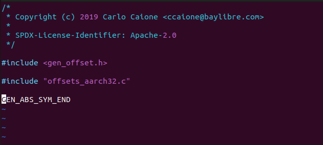

# Zephyr 构建流程

## 简介

刚开始，一定有小伙伴疑惑`west build` 之后到底做了哪些事情呢？

当然如果你只关心如何写应用层，可以不用关心编译构建相关的东西，

这篇文章介绍了zephyr如何从`west build`之后具体做了哪些东西。

### west build

首先是west 执行build之后，其实执行的是scripts/west_commands/build.py

这里面运行的是`do_run`

这里如果想打印所有log的话，只要加上这样一句话：

```
        log.VERBOSE = 4;
```

即可：

接下来我们看看完整的log， 执行命令`west -v -v -v build -p always -b nucleo_l496zg samples/hello_world`

```
thomas@thomas-VirtualBox:~/zephyrproject/zephyr$ west -v -v -v build -p always -b nucleo_l496zg samples/hello_world
west.manifest: DEBUG: loading /home/thomas/zephyrproject/zephyr/west.yml
west.manifest: DEBUG: resolving self import submanifests
west.manifest: DEBUG: found submanifest directory: submanifests
west.manifest: DEBUG: resolved self import
west.manifest: DEBUG: group-filter: ['-babblesim']
west.manifest: DEBUG: added project cmsis path modules/hal/cmsis revision 74981bf893e8b10931464b9945e2143d99a3f0a3 from /home/thomas/zephyrproject/zephyr/west.yml groups ['hal']
west.manifest: DEBUG: added project hal_stm32 path modules/hal/stm32 revision 1bc72c299d0365c0ee2575a97918b22df0899e10 from /home/thomas/zephyrproject/zephyr/west.yml groups ['hal']
west.manifest: DEBUG: group filters in precedence order (later is higher): deque([['-babblesim']])
west.manifest: DEBUG: final top level group-filter: ['-babblesim']
west.manifest: DEBUG: loaded /home/thomas/zephyrproject/zephyr/west.yml
args namespace: Namespace(help=None, zephyr_base=None, verbose=3, command='build', board='nucleo_l496zg', source_dir=None, build_dir=None, force=False, cmake=False, cmake_only=False, domain=None, target=None, test_item=None, build_opt=[], dry_run=False, snippets=[], sysbuild=False, no_sysbuild=False, pristine='always')
===========log_verbose==
args: Namespace(help=None, zephyr_base=None, verbose=3, command='build', board='nucleo_l496zg', source_dir=None, build_dir=None, force=False, cmake=False, cmake_only=False, domain=None, target=None, test_item=None, build_opt=[], dry_run=False, snippets=[], sysbuild=False, no_sysbuild=False, pristine='always') remainder: ['samples/hello_world']
source_dir: samples/hello_world cmake_opts: None
setting up build directory
setting up source directory
config dir-fmt: build
build is a zephyr build directory
build dir: build
pristine: always auto_pristine: False
/home/thomas/zephyrproject/zephyr/build is a zephyr build directory
-- west build: making build dir /home/thomas/zephyrproject/zephyr/build pristine
/home/thomas/zephyrproject/zephyr/build is a zephyr build directory
cmake version 3.22.1 is OK; minimum version is 3.13.1
Running CMake: /usr/bin/cmake -DBINARY_DIR=/home/thomas/zephyrproject/zephyr/build -DSOURCE_DIR=/home/thomas/zephyrproject/zephyr/samples/hello_world -P /home/thomas/zephyrproject/zephyr/cmake/pristine.cmake
setting up source directory
sanity checking the build
/home/thomas/zephyrproject/zephyr/samples/hello_world is NOT a valid zephyr build directory
===========run cmake==
-- west build: generating a build system
cmake version 3.22.1 is OK; minimum version is 3.13.1
Running CMake: /usr/bin/cmake -DWEST_PYTHON=/usr/bin/python3 -B/home/thomas/zephyrproject/zephyr/build -GNinja -DBOARD=nucleo_l496zg -S/home/thomas/zephyrproject/zephyr/samples/hello_world
Loading Zephyr default modules (Zephyr base).
-- Application: /home/thomas/zephyrproject/zephyr/samples/hello_world
-- CMake version: 3.22.1
-- Found Python3: /usr/bin/python3.10 (found suitable exact version "3.10.6") found components: Interpreter 
-- Cache files will be written to: /home/thomas/.cache/zephyr
-- Zephyr version: 3.4.99 (/home/thomas/zephyrproject/zephyr)
-- Found west (found suitable version "1.1.0", minimum required is "0.14.0")
-- Board: nucleo_l496zg
-- ZEPHYR_TOOLCHAIN_VARIANT not set, trying to locate Zephyr SDK
-- Found host-tools: zephyr 0.16.1 (/home/thomas/zephyr-sdk-0.16.1)
-- Found toolchain: zephyr 0.16.1 (/home/thomas/zephyr-sdk-0.16.1)
-- Found Dtc: /home/thomas/zephyr-sdk-0.16.1/sysroots/x86_64-pokysdk-linux/usr/bin/dtc (found suitable version "1.6.0", minimum required is "1.4.6") 
-- Found BOARD.dts: /home/thomas/zephyrproject/zephyr/boards/arm/nucleo_l496zg/nucleo_l496zg.dts
-- Generated zephyr.dts: /home/thomas/zephyrproject/zephyr/build/zephyr/zephyr.dts
-- Generated devicetree_generated.h: /home/thomas/zephyrproject/zephyr/build/zephyr/include/generated/devicetree_generated.h
-- Including generated dts.cmake file: /home/thomas/zephyrproject/zephyr/build/zephyr/dts.cmake
/home/thomas/zephyrproject/zephyr/build/zephyr/zephyr.dts:704.10-711.5: Warning (simple_bus_reg): /soc/clocks: missing or empty reg/ranges property
Parsing /home/thomas/zephyrproject/zephyr/Kconfig
Loaded configuration '/home/thomas/zephyrproject/zephyr/boards/arm/nucleo_l496zg/nucleo_l496zg_defconfig'
Merged configuration '/home/thomas/zephyrproject/zephyr/samples/hello_world/prj.conf'
Configuration saved to '/home/thomas/zephyrproject/zephyr/build/zephyr/.config'
Kconfig header saved to '/home/thomas/zephyrproject/zephyr/build/zephyr/include/generated/autoconf.h'
-- Found GnuLd: /home/thomas/zephyr-sdk-0.16.1/arm-zephyr-eabi/bin/../lib/gcc/arm-zephyr-eabi/12.2.0/../../../../arm-zephyr-eabi/bin/ld.bfd (found version "2.38") 
-- The C compiler identification is GNU 12.2.0
-- The CXX compiler identification is GNU 12.2.0
-- The ASM compiler identification is GNU
-- Found assembler: /home/thomas/zephyr-sdk-0.16.1/arm-zephyr-eabi/bin/arm-zephyr-eabi-gcc
-- Configuring done
-- Generating done
-- Build files have been written to: /home/thomas/zephyrproject/zephyr/build
===========end cmake==
sanity checking the build
/home/thomas/zephyrproject/zephyr/samples/hello_world is NOT a valid zephyr build directory
===========run build==
-- west build: building application
cmake version 3.22.1 is OK; minimum version is 3.13.1
Running CMake: /usr/bin/cmake --build /home/thomas/zephyrproject/zephyr/build -- -v
[1/154] cd /home/thomas/zephyrproject/zephyr/build/zephyr && /usr/bin/cmake -E echo
[2/154] cd /home/thomas/zephyrproject/zephyr/build/zephyr && /usr/bin/cmake -DZEPHYR_BASE=/home/thomas/zephyrproject/zephyr -DOUT_FILE=/home/thomas/zephyrproject/zephyr/build/zephyr/include/generated/version.h -DVERSION_TYPE=KERNEL -DVERSION_FILE=/home/thomas/zephyrproject/zephyr/VERSION -P /home/thomas/zephyrproject/zephyr/cmake/gen_version_h.cmake
-- Zephyr version: 3.4.99 (/home/thomas/zephyrproject/zephyr), build: zephyr-v3.4.0-1764-ga3bd0f9d9caa
[3/154] cd /home/thomas/zephyrproject/zephyr/build/zephyr && /usr/bin/python3.10 /home/thomas/zephyrproject/zephyr/scripts/build/subfolder_list.py --directory /home/thomas/zephyrproject/zephyr/include --out-file /home/thomas/zephyrproject/zephyr/build/zephyr/misc/generated/syscalls_subdirs.txt --trigger-file /home/thomas/zephyrproject/zephyr/build/zephyr/misc/generated/syscalls_subdirs.trigger --create-links /home/thomas/zephyrproject/zephyr/build/zephyr/misc/generated/syscalls_links
[4/154] cd /home/thomas/zephyrproject/zephyr/build/zephyr && /usr/bin/python3.10 /home/thomas/zephyrproject/zephyr/scripts/build/parse_syscalls.py --scan /home/thomas/zephyrproject/zephyr/include --scan /home/thomas/zephyrproject/zephyr/drivers --scan /home/thomas/zephyrproject/zephyr/subsys/net --json-file /home/thomas/zephyrproject/zephyr/build/zephyr/misc/generated/syscalls.json --tag-struct-file /home/thomas/zephyrproject/zephyr/build/zephyr/misc/generated/struct_tags.json --file-list /home/thomas/zephyrproject/zephyr/build/zephyr/misc/generated/syscalls_file_list.txt
[5/154] cd /home/thomas/zephyrproject/zephyr/build/zephyr && /usr/bin/python3.10 /home/thomas/zephyrproject/zephyr/scripts/build/gen_syscalls.py --json-file /home/thomas/zephyrproject/zephyr/build/zephyr/misc/generated/syscalls.json --base-output include/generated/syscalls --syscall-dispatch include/generated/syscall_dispatch.c --syscall-list /home/thomas/zephyrproject/zephyr/build/zephyr/include/generated/syscall_list.h  --split-type k_timeout_t --split-type k_ticks_t
```

输入命令`export VERBOSE=1` 这个可以让cmake的命令全部打出来。

这边发下一个bug， verbose如果build里面是-v的话是1， 但是不管verbose是1还是0，build log都打不开。

这里不是bug，实际上是`west -v -v -v build -p always -b nucleo_l496zg samples/hello_world` 需要这样玩。

具体可以参考

https://github.com/zephyrproject-rtos/west/blob/main/src/west/app/main.py

## 接下来就是执行cmake


## 然后执行build.py

build.py 然后执行里面的函数`do_run`

这个函数里面最重要的两个函数`self._run_cmake `和`self._run_build`

`self._run_cmake` 负责生成cmake文件，

`self._run_build `负责进行编译

### build

我们先来看build，build直接是执行命令

`Running CMake: /usr/bin/cmake --build /home/thomas/zephyrproject/zephyr/build -- -v`

```
[1/154] cd /home/thomas/zephyrproject/zephyr/build/zephyr && /usr/bin/cmake -E echo
[2/154] cd /home/thomas/zephyrproject/zephyr/build/zephyr && /usr/bin/cmake -DZEPHYR_BASE=/home/thomas/zephyrproject/zephyr -DOUT_FILE=/home/thomas/zephyrproject/zephyr/build/zephyr/include/generated/version.h -DVERSION_TYPE=KERNEL -DVERSION_FILE=/home/thomas/zephyrproject/zephyr/VERSION -P /home/thomas/zephyrproject/zephyr/cmake/gen_version_h.cmake
-- Zephyr version: 3.4.99 (/home/thomas/zephyrproject/zephyr), build: zephyr-v3.4.0-1764-ga3bd0f9d9caa
[3/154] cd /home/thomas/zephyrproject/zephyr/build/zephyr && /usr/bin/python3.10 /home/thomas/zephyrproject/zephyr/scripts/build/subfolder_list.py --directory /home/thomas/zephyrproject/zephyr/include --out-file /home/thomas/zephyrproject/zephyr/build/zephyr/misc/generated/syscalls_subdirs.txt --trigger-file /home/thomas/zephyrproject/zephyr/build/zephyr/misc/generated/syscalls_subdirs.trigger --create-links /home/thomas/zephyrproject/zephyr/build/zephyr/misc/generated/syscalls_links
[4/154] cd /home/thomas/zephyrproject/zephyr/build/zephyr && /usr/bin/python3.10 /home/thomas/zephyrproject/zephyr/scripts/build/parse_syscalls.py --scan /home/thomas/zephyrproject/zephyr/include --scan /home/thomas/zephyrproject/zephyr/drivers --scan /home/thomas/zephyrproject/zephyr/subsys/net --json-file /home/thomas/zephyrproject/zephyr/build/zephyr/misc/generated/syscalls.json --tag-struct-file /home/thomas/zephyrproject/zephyr/build/zephyr/misc/generated/struct_tags.json --file-list /home/thomas/zephyrproject/zephyr/build/zephyr/misc/generated/syscalls_file_list.txt
[5/154] cd /home/thomas/zephyrproject/zephyr/build/zephyr && /usr/bin/python3.10 /home/thomas/zephyrproject/zephyr/scripts/build/gen_kobject_list.py --validation-output /home/thomas/zephyrproject/zephyr/build/zephyr/include/generated/driver-validation.h --include-subsystem-list /home/thomas/zephyrproject/zephyr/build/zephyr/misc/generated/struct_tags.json
[6/154] cd /home/thomas/zephyrproject/zephyr/build/zephyr && /usr/bin/python3.10 /home/thomas/zephyrproject/zephyr/scripts/build/gen_syscalls.py --json-file /home/thomas/zephyrproject/zephyr/build/zephyr/misc/generated/syscalls.json --base-output include/generated/syscalls --syscall-dispatch include/generated/syscall_dispatch.c --syscall-list /home/thomas/zephyrproject/zephyr/build/zephyr/include/generated/syscall_list.h  --split-type k_timeout_t --split-type k_ticks_t


```

这里的每一个步骤代表命令执行，

比如第一个命令`cd /home/thomas/zephyrproject/zephyr/build/zephyr && /usr/bin/cmake -E echo`  这个是进入到`build/zephyr` 目录

第二个命令`cd /home/thomas/zephyrproject/zephyr/build/zephyr && /usr/bin/cmake -DZEPHYR_BASE=/home/thomas/zephyrproject/zephyr -DOUT_FILE=/home/thomas/zephyrproject/zephyr/build/zephyr/include/generated/version.h -DVERSION_TYPE=KERNEL -DVERSION_FILE=/home/thomas/zephyrproject/zephyr/VERSION -P /home/thomas/zephyrproject/zephyr/cmake/gen_version_h.cmake`

这个是产生版本号

第三个命令`cd /home/thomas/zephyrproject/zephyr/build/zephyr && /usr/bin/python3.10 /home/thomas/zephyrproject/zephyr/scripts/build/subfolder_list.py --directory /home/thomas/zephyrproject/zephyr/include --out-file /home/thomas/zephyrproject/zephyr/build/zephyr/misc/generated/syscalls_subdirs.txt --trigger-file /home/thomas/zephyrproject/zephyr/build/zephyr/misc/generated/syscalls_subdirs.trigger --create-links /home/thomas/zephyrproject/zephyr/build/zephyr/misc/generated/syscalls_links`

这些命令在`build/build.ninja`里面有记录。ninja 还不是太懂，


总之这些命令会一条一条执行

那build.ninja这里面的命令是由什么加进去的呢？搜了一下，发现在根目录下有个CMakeList.txt 这里面会调`add_custom_command` 这个命令把一条条的命令加进去。

### Cmake

接下来我们回头来看看`self._run_cmake` 做了那些事情

除去cmake版本检测，第一条命令是

```
/usr/bin/cmake -DWEST_PYTHON=/usr/bin/python3 -B/home/thomas/zephyrproject/zephyr/build -GNinja -DBOARD=nucleo_l496zg -S/home/thomas/zephyrproject/zephyr/samples/hello_world
```

这里面我们看到是产生了ninja文件。

我们本地执行这个命令看看

```
thomas@thomas-VirtualBox:~/zephyrproject/zephyr$ /usr/bin/cmake -DWEST_PYTHON=/usr/bin/python3 -B/home/thomas/zephyrproject/zephyr/build -GNinja -DBOARD=nucleo_l496zg -S/home/thomas/zephyrproject/zephyr/samples/hello_world
Loading Zephyr default modules (Zephyr repository).
-- Application: /home/thomas/zephyrproject/zephyr/samples/hello_world
-- CMake version: 3.22.1
-- Found Python3: /usr/bin/python3.10 (found suitable exact version "3.10.6") found components: Interpreter 
-- Cache files will be written to: /home/thomas/.cache/zephyr
-- Zephyr version: 3.4.99 (/home/thomas/zephyrproject/zephyr)
-- Found west (found suitable version "1.1.0", minimum required is "0.14.0")
-- Board: nucleo_l496zg
-- ZEPHYR_TOOLCHAIN_VARIANT not set, trying to locate Zephyr SDK
-- Found host-tools: zephyr 0.16.1 (/home/thomas/zephyr-sdk-0.16.1)
-- Found toolchain: zephyr 0.16.1 (/home/thomas/zephyr-sdk-0.16.1)
-- Found Dtc: /home/thomas/zephyr-sdk-0.16.1/sysroots/x86_64-pokysdk-linux/usr/bin/dtc (found suitable version "1.6.0", minimum required is "1.4.6") 
-- Found BOARD.dts: /home/thomas/zephyrproject/zephyr/boards/arm/nucleo_l496zg/nucleo_l496zg.dts
-- Generated zephyr.dts: /home/thomas/zephyrproject/zephyr/build/zephyr/zephyr.dts
-- Generated devicetree_generated.h: /home/thomas/zephyrproject/zephyr/build/zephyr/include/generated/devicetree_generated.h
-- Including generated dts.cmake file: /home/thomas/zephyrproject/zephyr/build/zephyr/dts.cmake
/home/thomas/zephyrproject/zephyr/build/zephyr/zephyr.dts:704.10-711.5: Warning (simple_bus_reg): /soc/clocks: missing or empty reg/ranges property
Parsing /home/thomas/zephyrproject/zephyr/Kconfig
Loaded configuration '/home/thomas/zephyrproject/zephyr/boards/arm/nucleo_l496zg/nucleo_l496zg_defconfig'
Merged configuration '/home/thomas/zephyrproject/zephyr/samples/hello_world/prj.conf'
Configuration saved to '/home/thomas/zephyrproject/zephyr/build/zephyr/.config'
Kconfig header saved to '/home/thomas/zephyrproject/zephyr/build/zephyr/include/generated/autoconf.h'
-- Found GnuLd: /home/thomas/zephyr-sdk-0.16.1/arm-zephyr-eabi/bin/../lib/gcc/arm-zephyr-eabi/12.2.0/../../../../arm-zephyr-eabi/bin/ld.bfd (found version "2.38") 
-- The C compiler identification is GNU 12.2.0
-- The CXX compiler identification is GNU 12.2.0
-- The ASM compiler identification is GNU
-- Found assembler: /home/thomas/zephyr-sdk-0.16.1/arm-zephyr-eabi/bin/arm-zephyr-eabi-gcc
-- Configuring done
-- Generating done
-- Build files have been written to: /home/thomas/zephyrproject/zephyr/build
```

我们来看看这些都是哪些地方打出来的：

```
-- Application: /home/thomas/zephyrproject/zephyr/samples/hello_world 
[cmake/modules/zephyr_default.cmake]
-- CMake version: 3.22.1
[cmake/modules/zephyr_default.cmake]
-- Found Python3: /usr/bin/python3.10 (found suitable exact version "3.10.6") found components: Interpreter 
-- Cache files will be written to: /home/thomas/.cache/zephyr
[user_cache.cmake]
-- Zephyr version: 3.4.99 (/home/thomas/zephyrproject/zephyr)
[version.cmake]
-- Found west (found suitable version "1.1.0", minimum required is "0.14.0")
[west.cmake]
-- Board: nucleo_l496zg
[boards.cmake]
-- ZEPHYR_TOOLCHAIN_VARIANT not set, trying to locate Zephyr SDK
[FindZephyr-sdk.cmake]
-- Found host-tools: zephyr 0.16.1 (/home/thomas/zephyr-sdk-0.16.1)
[FindZephyr-sdk.cmake]
-- Found toolchain: zephyr 0.16.1 (/home/thomas/zephyr-sdk-0.16.1)
[zephyrproject/zephyr/cmake/toolchain/zephyr/generic.cmake]
-- Found Dtc: /home/thomas/zephyr-sdk-0.16.1/sysroots/x86_64-pokysdk-linux/usr/bin/dtc (found suitable version "1.6.0", minimum required is "1.4.6") 
[FindDtc.cmake]
-- Found BOARD.dts: /home/thomas/zephyrproject/zephyr/boards/arm/nucleo_l496zg/nucleo_l496zg.dts
[zephyr/cmake/modules/dts.cmake]
-- Generated zephyr.dts: /home/thomas/zephyrproject/zephyr/build/zephyr/zephyr.dts
[zephyr/cmake/modules/dts.cmake]
-- Generated devicetree_generated.h: /home/thomas/zephyrproject/zephyr/build/zephyr/include/generated/devicetree_generated.h
[zephyr/cmake/modules/dts.cmake]
-- Including generated dts.cmake file: /home/thomas/zephyrproject/zephyr/build/zephyr/dts.cmake
/home/thomas/zephyrproject/zephyr/build/zephyr/zephyr.dts:704.10-711.5: Warning (simple_bus_reg): /soc/clocks: missing or empty reg/ranges property
[zephyr/cmake/modules/dts.cmake]
Parsing /home/thomas/zephyrproject/zephyr/Kconfig
[kconfig.cmake]
Loaded configuration '/home/thomas/zephyrproject/zephyr/boards/arm/nucleo_l496zg/nucleo_l496zg_defconfig'
Merged configuration '/home/thomas/zephyrproject/zephyr/samples/hello_world/prj.conf'
Configuration saved to '/home/thomas/zephyrproject/zephyr/build/zephyr/.config'
Kconfig header saved to '/home/thomas/zephyrproject/zephyr/build/zephyr/include/generated/autoconf.h'
[kconfig.cmake]
-- Found GnuLd: /home/thomas/zephyr-sdk-0.16.1/arm-zephyr-eabi/bin/../lib/gcc/arm-zephyr-eabi/12.2.0/../../../../arm-zephyr-eabi/bin/ld.bfd (found version "2.38") 
[FindDtc.cmake]
-- The C compiler identification is GNU 12.2.0
-- The CXX compiler identification is GNU 12.2.0
-- The ASM compiler identification is GNU
-- Found assembler: /home/thomas/zephyr-sdk-0.16.1/arm-zephyr-eabi/bin/arm-zephyr-eabi-gcc
-- Configuring done
-- Generating done
-- Build files have been written to: /home/thomas/zephyrproject/zephyr/build

```

这里面其实做了很多事情，比如设备树是在这里生成的，Kconfig是在这里生成的，还有toolchain等其他都是在这里生成的，所以这里其实命令比较多。重要信息也很多。

到这里可以看到基本cmake的事情基本都做完了，这里需要分析的东西也很多。


### PRE-BUILD

https://docs.zephyrproject.org/latest/build/cmake/index.html#pre-build

接下来我们来看看预编译阶段： 预编译是指在编译.c之前的所有阶段，主要有offset处理和syscall处理。

pre-build就是产生.h头文件的一些操作

```
Running CMake: /usr/bin/cmake --build /home/thomas/zephyrproject/zephyr/build -- -v
[1/154] cd /home/thomas/zephyrproject/zephyr/build/zephyr && /usr/bin/cmake -E echo
[2/154] cd /home/thomas/zephyrproject/zephyr/build/zephyr && /usr/bin/python3.10 /home/thomas/zephyrproject/zephyr/scripts/build/subfolder_list.py --directory /home/thomas/zephyrproject/zephyr/include --out-file /home/thomas/zephyrproject/zephyr/build/zephyr/misc/generated/syscalls_subdirs.txt --trigger-file /home/thomas/zephyrproject/zephyr/build/zephyr/misc/generated/syscalls_subdirs.trigger --create-links /home/thomas/zephyrproject/zephyr/build/zephyr/misc/generated/syscalls_links
[3/154] cd /home/thomas/zephyrproject/zephyr/build/zephyr && /usr/bin/cmake -DZEPHYR_BASE=/home/thomas/zephyrproject/zephyr -DOUT_FILE=/home/thomas/zephyrproject/zephyr/build/zephyr/include/generated/version.h -DVERSION_TYPE=KERNEL -DVERSION_FILE=/home/thomas/zephyrproject/zephyr/VERSION -P /home/thomas/zephyrproject/zephyr/cmake/gen_version_h.cmake
-- Zephyr version: 3.4.99 (/home/thomas/zephyrproject/zephyr), build: zephyr-v3.4.0-1764-ga3bd0f9d9caa
[4/154] cd /home/thomas/zephyrproject/zephyr/build/zephyr && /usr/bin/python3.10 /home/thomas/zephyrproject/zephyr/scripts/build/parse_syscalls.py --scan /home/thomas/zephyrproject/zephyr/include --scan /home/thomas/zephyrproject/zephyr/drivers --scan /home/thomas/zephyrproject/zephyr/subsys/net --json-file /home/thomas/zephyrproject/zephyr/build/zephyr/misc/generated/syscalls.json --tag-struct-file /home/thomas/zephyrproject/zephyr/build/zephyr/misc/generated/struct_tags.json --file-list /home/thomas/zephyrproject/zephyr/build/zephyr/misc/generated/syscalls_file_list.txt
==========zephyr/scripts/build/parse_syscalls.py================
[5/154] cd /home/thomas/zephyrproject/zephyr/build/zephyr && /usr/bin/python3.10 /home/thomas/zephyrproject/zephyr/scripts/build/gen_syscalls.py --json-file /home/thomas/zephyrproject/zephyr/build/zephyr/misc/generated/syscalls.json --base-output include/generated/syscalls --syscall-dispatch include/generated/syscall_dispatch.c --syscall-list /home/thomas/zephyrproject/zephyr/build/zephyr/include/generated/syscall_list.h  --split-type k_timeout_t --split-type k_ticks_t
==========zephyr/scripts/build/gen_syscalls.py ======syscall_dispatch.c==syscalls.json========
[6/154] cd /home/thomas/zephyrproject/zephyr/build/zephyr && /usr/bin/python3.10 /home/thomas/zephyrproject/zephyr/scripts/build/gen_kobject_list.py --kobj-types-output /home/thomas/zephyrproject/zephyr/build/zephyr/include/generated/kobj-types-enum.h --kobj-otype-output /home/thomas/zephyrproject/zephyr/build/zephyr/include/generated/otype-to-str.h --kobj-size-output /home/thomas/zephyrproject/zephyr/build/zephyr/include/generated/otype-to-size.h --include-subsystem-list /home/thomas/zephyrproject/zephyr/build/zephyr/misc/generated/struct_tags.json
==========zephyr/scripts/build/gen_kobject_list.py =====kobj-types-enum.h===========
[7/154] cd /home/thomas/zephyrproject/zephyr/build/zephyr && /usr/bin/python3.10 /home/thomas/zephyrproject/zephyr/scripts/build/gen_kobject_list.py --validation-output /home/thomas/zephyrproject/zephyr/build/zephyr/include/generated/driver-validation.h --include-subsystem-list /home/thomas/zephyrproject/zephyr/build/zephyr/misc/generated/struct_tags.json
==========zephyr/scripts/build/gen_kobject_list.py ================
[8/154] ccache /home/thomas/zephyr-sdk-0.16.1/arm-zephyr-eabi/bin/arm-zephyr-eabi-gcc -DCORE_CM4 -DHSE_VALUE=8000000 -DKERNEL -DSTM32L496xx -DUSE_FULL_LL_DRIVER -DUSE_HAL_DRIVER -D__PROGRAM_START -D__ZEPHYR__=1 -I/home/thomas/zephyrproject/zephyr/kernel/include -I/home/thomas/zephyrproject/zephyr/arch/arm/include -I/home/thomas/zephyrproject/zephyr/include -I/home/thomas/zephyrproject/zephyr/build/zephyr/include/generated -I/home/thomas/zephyrproject/zephyr/soc/arm/st_stm32/stm32l4 -I/home/thomas/zephyrproject/zephyr/drivers -I/home/thomas/zephyrproject/zephyr/soc/arm/st_stm32/common -I/home/thomas/zephyrproject/modules/hal/cmsis/CMSIS/Core/Include -I/home/thomas/zephyrproject/modules/hal/stm32/stm32cube/stm32l4xx/soc -I/home/thomas/zephyrproject/modules/hal/stm32/stm32cube/stm32l4xx/drivers/include -I/home/thomas/zephyrproject/modules/hal/stm32/stm32cube/stm32l4xx/drivers/include/Legacy -I/home/thomas/zephyrproject/modules/hal/stm32/stm32cube/common_ll/include -isystem /home/thomas/zephyrproject/zephyr/lib/libc/minimal/include -isystem /home/thomas/zephyr-sdk-0.16.1/arm-zephyr-eabi/bin/../lib/gcc/arm-zephyr-eabi/12.2.0/include -isystem /home/thomas/zephyr-sdk-0.16.1/arm-zephyr-eabi/bin/../lib/gcc/arm-zephyr-eabi/12.2.0/include-fixed -fno-strict-aliasing -Os -imacros /home/thomas/zephyrproject/zephyr/build/zephyr/include/generated/autoconf.h -ffreestanding -fno-common -g -gdwarf-4 -fdiagnostics-color=always -mcpu=cortex-m4 -mthumb -mabi=aapcs -mfp16-format=ieee --sysroot=/home/thomas/zephyr-sdk-0.16.1/arm-zephyr-eabi/arm-zephyr-eabi -imacros /home/thomas/zephyrproject/zephyr/include/zephyr/toolchain/zephyr_stdint.h -Wall -Wformat -Wformat-security -Wno-format-zero-length -Wno-pointer-sign -Wpointer-arith -Wexpansion-to-defined -Wno-unused-but-set-variable -Werror=implicit-int -fno-pic -fno-pie -fno-asynchronous-unwind-tables -fno-reorder-functions --param=min-pagesize=0 -fno-defer-pop -fmacro-prefix-map=/home/thomas/zephyrproject/zephyr/samples/hello_world=CMAKE_SOURCE_DIR -fmacro-prefix-map=/home/thomas/zephyrproject/zephyr=ZEPHYR_BASE -fmacro-prefix-map=/home/thomas/zephyrproject=WEST_TOPDIR -ffunction-sections -fdata-sections -std=c99 -nostdinc -MD -MT zephyr/CMakeFiles/offsets.dir/arch/arm/core/offsets/offsets.c.obj -MF zephyr/CMakeFiles/offsets.dir/arch/arm/core/offsets/offsets.c.obj.d -o zephyr/CMakeFiles/offsets.dir/arch/arm/core/offsets/offsets.c.obj -c /home/thomas/zephyrproject/zephyr/arch/arm/core/offsets/offsets.c
==========arm-zephyr-eabi-gcc =====offsets.c===========
[9/154] cd /home/thomas/zephyrproject/zephyr/build/zephyr && /usr/bin/python3.10 /home/thomas/zephyrproject/zephyr/scripts/build/gen_offset_header.py -i /home/thomas/zephyrproject/zephyr/build/zephyr/CMakeFiles/offsets.dir/./arch/arm/core/offsets/offsets.c.obj -o /home/thomas/zephyrproject/zephyr/build/zephyr/include/generated/offsets.h


```


#### Offset 产生

这个在第8步和第9步

我们看看第8步, 处理offset.c

offset.c



这个看起来很少哦，实际上所有秘密都藏在`arch/arm/core/offsets/offsets_aarch32.c`里面，所以最后生成的东西在`offsets.c.obj`这个文件里面，这个文件会作为`gen_offset_header.py ` 下面一步的输入。

```
[8/154] ccache /home/thomas/zephyr-sdk-0.16.1/arm-zephyr-eabi/bin/arm-zephyr-eabi-gcc -DCORE_CM4 -DHSE_VALUE=8000000 -DKERNEL -DSTM32L496xx -DUSE_FULL_LL_DRIVER -DUSE_HAL_DRIVER -D__PROGRAM_START -D__ZEPHYR__=1 -I/home/thomas/zephyrproject/zephyr/kernel/include -I/home/thomas/zephyrproject/zephyr/arch/arm/include -I/home/thomas/zephyrproject/zephyr/include -I/home/thomas/zephyrproject/zephyr/build/zephyr/include/generated -I/home/thomas/zephyrproject/zephyr/soc/arm/st_stm32/stm32l4 -I/home/thomas/zephyrproject/zephyr/drivers -I/home/thomas/zephyrproject/zephyr/soc/arm/st_stm32/common -I/home/thomas/zephyrproject/modules/hal/cmsis/CMSIS/Core/Include -I/home/thomas/zephyrproject/modules/hal/stm32/stm32cube/stm32l4xx/soc -I/home/thomas/zephyrproject/modules/hal/stm32/stm32cube/stm32l4xx/drivers/include -I/home/thomas/zephyrproject/modules/hal/stm32/stm32cube/stm32l4xx/drivers/include/Legacy -I/home/thomas/zephyrproject/modules/hal/stm32/stm32cube/common_ll/include -isystem /home/thomas/zephyrproject/zephyr/lib/libc/minimal/include -isystem /home/thomas/zephyr-sdk-0.16.1/arm-zephyr-eabi/bin/../lib/gcc/arm-zephyr-eabi/12.2.0/include -isystem /home/thomas/zephyr-sdk-0.16.1/arm-zephyr-eabi/bin/../lib/gcc/arm-zephyr-eabi/12.2.0/include-fixed -fno-strict-aliasing -Os -imacros /home/thomas/zephyrproject/zephyr/build/zephyr/include/generated/autoconf.h -ffreestanding -fno-common -g -gdwarf-4 -fdiagnostics-color=always -mcpu=cortex-m4 -mthumb -mabi=aapcs -mfp16-format=ieee --sysroot=/home/thomas/zephyr-sdk-0.16.1/arm-zephyr-eabi/arm-zephyr-eabi -imacros /home/thomas/zephyrproject/zephyr/include/zephyr/toolchain/zephyr_stdint.h -Wall -Wformat -Wformat-security -Wno-format-zero-length -Wno-pointer-sign -Wpointer-arith -Wexpansion-to-defined -Wno-unused-but-set-variable -Werror=implicit-int -fno-pic -fno-pie -fno-asynchronous-unwind-tables -fno-reorder-functions --param=min-pagesize=0 -fno-defer-pop -fmacro-prefix-map=/home/thomas/zephyrproject/zephyr/samples/hello_world=CMAKE_SOURCE_DIR -fmacro-prefix-map=/home/thomas/zephyrproject/zephyr=ZEPHYR_BASE -fmacro-prefix-map=/home/thomas/zephyrproject=WEST_TOPDIR -ffunction-sections -fdata-sections -std=c99 -nostdinc -MD -MT zephyr/CMakeFiles/offsets.dir/arch/arm/core/offsets/offsets.c.obj -MF zephyr/CMakeFiles/offsets.dir/arch/arm/core/offsets/offsets.c.obj.d -o zephyr/CMakeFiles/offsets.dir/arch/arm/core/offsets/offsets.c.obj -c /home/thomas/zephyrproject/zephyr/arch/arm/core/offsets/offsets.c
==========arm-zephyr-eabi-gcc =====offsets.c===========
```

第9 步

```
[9/154] cd /home/thomas/zephyrproject/zephyr/build/zephyr && /usr/bin/python3.10 /home/thomas/zephyrproject/zephyr/scripts/build/gen_offset_header.py -i /home/thomas/zephyrproject/zephyr/build/zephyr/CMakeFiles/offsets.dir/./arch/arm/core/offsets/offsets.c.obj -o /home/thomas/zephyrproject/zephyr/build/zephyr/include/generated/offsets.h
```

offset.h里面的东西：

~/zephyrproject/zephyr/build/zephyr/include/generated/offsets.h


#### 那offsets.h在干嘛呢？

主要调这个脚本`gen_offset_header.py`

```
scripts/build/gen_offset_header.py
This script scans a specified object file and generates a header file that defined macros for the offsets of various found structure members (particularly symbols ending with _OFFSET or _SIZEOF), primarily intended for use in assembly code.
```

主要处理以`_OFFSET`或者`_SIZEOF` 结尾的一些标号, 主要用在汇编里面要使用。

我们先看下`arch/arm/core/offsets/offsets_aarch32.c` 中的下面的变量

```
GEN_OFFSET_SYM(_basic_sf_t, pc);
GEN_OFFSET_SYM(_basic_sf_t, xpsr);
```

这个会转换成`offset.c.obj` 里面的标号`___basic_sf_t_pc_OFFSET`

我们看下`___basic_sf_t_pc_OFFSET` 这些变量

以及offsets.h中的注释，可以知道，这些偏移量都服务于一些汇编文件，具体可以打开`./arch/arm/core/aarch32/swap_helper.S` 文件查看下

```
    /* grab address of LR from stack frame */
    ldr r8, [ip, #(FPU_SF_SIZE + ___basic_sf_t_pc_OFFSET)]
    /* Make the exception return to system state */
    ldr r1, [ip, #(FPU_SF_SIZE + ___basic_sf_t_xpsr_OFFSET)]
```

有点类似于，一些架构pc偏移等CPU相关的offset是不一样的，所以这里存放的是这些offset。

总结一下就是：一些_OFFSET 会转换成symbol 变成offsets.h头文件里面的值，为什么这么做呢？感觉是为了服务汇编代码的。

#### syscall 产生

图中的`parse_syscall.py` 在第4步，

```
[4/154] cd /home/thomas/zephyrproject/zephyr/build/zephyr && /usr/bin/python3.10 /home/thomas/zephyrproject/zephyr/scripts/build/parse_syscalls.py --scan /home/thomas/zephyrproject/zephyr/include --scan /home/thomas/zephyrproject/zephyr/drivers --scan /home/thomas/zephyrproject/zephyr/subsys/net --json-file /home/thomas/zephyrproject/zephyr/build/zephyr/misc/generated/syscalls.json --tag-struct-file /home/thomas/zephyrproject/zephyr/build/zephyr/misc/generated/struct_tags.json --file-list /home/thomas/zephyrproject/zephyr/build/zephyr/misc/generated/syscalls_file_list.txt
==========zephyr/scripts/build/parse_syscalls.py================
```

这里的输入是各种路径下的.h 文件， `/home/thomas/zephyrproject/zephyr/include`  `/home/thomas/zephyrproject/zephyr/drivers`

然后生成jason文件`/home/thomas/zephyrproject/zephyr/build/zephyr/misc/generated/syscalls.json ` , tag 文件`/home/thomas/zephyrproject/zephyr/build/zephyr/misc/generated/struct_tags.json`  文件列表`/home/thomas/zephyrproject/zephyr/build/zephyr/misc/generated/syscalls_file_list.txt`

图中`gen_syscall_header.py` 是在第5步 ，这里的`scripts`目录下面已经没有`gen_syscall_header.py`了，已经移动到`build/gen_syscalls.py`

```
[5/154] cd /home/thomas/zephyrproject/zephyr/build/zephyr && /usr/bin/python3.10 /home/thomas/zephyrproject/zephyr/scripts/build/gen_syscalls.py --json-file /home/thomas/zephyrproject/zephyr/build/zephyr/misc/generated/syscalls.json --base-output include/generated/syscalls --syscall-dispatch include/generated/syscall_dispatch.c --syscall-list /home/thomas/zephyrproject/zephyr/build/zephyr/include/generated/syscall_list.h  --split-type k_timeout_t --split-type k_ticks_t
==========zephyr/scripts/build/gen_syscalls.py ================
```

途中的`syscall_macros.h`也已经变成了`syscall_list.h` 以及

最后生成的类似下面的东西：


#### 那syscall在做什么呢？

这个syscall有点像linux的味道了，而且非常像，系统调用。

所有.h里面用`__syscall` 声明的函数， 例如`zephyr/include/zephyr/drivers/uart.h` 中有个`uart_irq_tx_disable` 前面用`__syscall` 来修饰

真正的函数实现是`z_impl_uart_irq_tx_disable` 

```
/**
 * @brief Disable TX interrupt in IER.
 *
 * @param dev UART device instance.
 */
__syscall void uart_irq_tx_disable(const struct device *dev);
static inline void z_impl_uart_irq_tx_disable(const struct device *dev)
{
#ifdef CONFIG_UART_INTERRUPT_DRIVEN
        const struct uart_driver_api *api =
                (const struct uart_driver_api *)dev->api;
        if (api->irq_tx_disable != NULL) {
                api->irq_tx_disable(dev);
        }
#else
        ARG_UNUSED(dev);
#endif
}
```

中途通过`parse_syscalls.py`生成在`syscalls.json`中变成下面的结构

```
    [
        [
            "void uart_irq_tx_disable",
            "const struct device *dev"
        ],
        "uart.h",
        true
    ],
```

接着在下面的`gen_syscalls.py` 步骤中，转换成`syscall_list.h`中的下面的代码

```
#define K_SYSCALL_UART_IRQ_RX_DISABLE 122
```

同时在syscall_dispatch.c中生成如下代码

```
__weak ALIAS_OF(handler_no_syscall)
uintptr_t z_mrsh_uart_irq_tx_disable(uintptr_t arg1, uintptr_t arg2, uintptr_t arg3,
         uintptr_t arg4, uintptr_t arg5, uintptr_t arg6, void *ssf);
```

在`build/zephyr/include/generated/syscalls`里面生成了uart.h ，看上去是加了个trace等功能。

```

extern void z_impl_uart_irq_tx_disable(const struct device * dev);
__pinned_func
static inline void uart_irq_tx_disable(const struct device * dev)
{
#ifdef CONFIG_USERSPACE
        if (z_syscall_trap()) {
                union { uintptr_t x; const struct device * val; } parm0 = { .val = dev };
                (void) arch_syscall_invoke1(parm0.x, K_SYSCALL_UART_IRQ_TX_DISABLE);
                return;
        }
#endif
        compiler_barrier();
        z_impl_uart_irq_tx_disable(dev);
}
#if defined(CONFIG_TRACING_SYSCALL)
#ifndef DISABLE_SYSCALL_TRACING
#define uart_irq_tx_disable(dev) do {   sys_port_trace_syscall_enter(K_SYSCALL_UART_IRQ_TX_DISABLE, uart_irq_tx_disable, dev);  uart_irq_tx_disable(dev);       sys_port_trace_syscall_exit(K_SYSCALL_UART_IRQ_TX_DISABLE, uart_irq_tx_disable, dev); } while(false)
#endif
#endif

```

这里可以看到在代码中如果调函数`uart_irq_tx_disable` 就会用编译器通过`build/zephyr/include/generated/syscalls/uart.h` 中的`inline`函数来转化成调`z_impl_uart_irq_tx_disable` 函数，这个函数真正实现是在`zephyr/include/zephyr/drivers/uart.h`

这里的syscall非常像linux的那套机制。


