# PERIPHERAL_HIDS_MOUSE

## 简介

本文主要介绍zephyr hids mouse 的example解析


## 代码讲解

###  report map解析

```
	static const uint8_t report_map[] = {
		0x05, 0x01,     /* Usage Page (Generic Desktop) */
		0x09, 0x02,     /* Usage (Mouse) */

		0xA1, 0x01,     /* Collection (Application) */

		/* Report ID 1: Mouse buttons + scroll/pan */
		0x85, 0x01,       /* Report Id 1 */
		0x09, 0x01,       /* Usage (Pointer) */
		0xA1, 0x00,       /* Collection (Physical) */
		0x95, 0x05,       /* Report Count (3) */
		0x75, 0x01,       /* Report Size (1) */
		0x05, 0x09,       /* Usage Page (Buttons) */
		0x19, 0x01,       /* Usage Minimum (01) */
		0x29, 0x05,       /* Usage Maximum (05) */
		0x15, 0x00,       /* Logical Minimum (0) */
		0x25, 0x01,       /* Logical Maximum (1) */
		0x81, 0x02,       /* Input (Data, Variable, Absolute) */
		0x95, 0x01,       /* Report Count (1) */
		0x75, 0x03,       /* Report Size (3) */
		0x81, 0x01,       /* Input (Constant) for padding */
		0x75, 0x08,       /* Report Size (8) */
		0x95, 0x01,       /* Report Count (1) */
		0x05, 0x01,       /* Usage Page (Generic Desktop) */
		0x09, 0x38,       /* Usage (Wheel) */
		0x15, 0x81,       /* Logical Minimum (-127) */
		0x25, 0x7F,       /* Logical Maximum (127) */
		0x81, 0x06,       /* Input (Data, Variable, Relative) */
		0x05, 0x0C,       /* Usage Page (Consumer) */
		0x0A, 0x38, 0x02, /* Usage (AC Pan) */
		0x95, 0x01,       /* Report Count (1) */
		0x81, 0x06,       /* Input (Data,Value,Relative,Bit Field) */
		0xC0,             /* End Collection (Physical) */

		/* Report ID 2: Mouse motion */
		0x85, 0x02,       /* Report Id 2 */
		0x09, 0x01,       /* Usage (Pointer) */
		0xA1, 0x00,       /* Collection (Physical) */
		0x75, 0x0C,       /* Report Size (12) */
		0x95, 0x02,       /* Report Count (2) */
		0x05, 0x01,       /* Usage Page (Generic Desktop) */
		0x09, 0x30,       /* Usage (X) */
		0x09, 0x31,       /* Usage (Y) */
		0x16, 0x01, 0xF8, /* Logical maximum (2047) */
		0x26, 0xFF, 0x07, /* Logical minimum (-2047) */
		0x81, 0x06,       /* Input (Data, Variable, Relative) */
		0xC0,             /* End Collection (Physical) */
		0xC0,             /* End Collection (Application) */

		/* Report ID 3: Advanced buttons */
		0x05, 0x0C,       /* Usage Page (Consumer) */
		0x09, 0x01,       /* Usage (Consumer Control) */
		0xA1, 0x01,       /* Collection (Application) */
		0x85, 0x03,       /* Report Id (3) */
		0x15, 0x00,       /* Logical minimum (0) */
		0x25, 0x01,       /* Logical maximum (1) */
		0x75, 0x01,       /* Report Size (1) */
		0x95, 0x01,       /* Report Count (1) */

		0x09, 0xCD,       /* Usage (Play/Pause) */
		0x81, 0x06,       /* Input (Data,Value,Relative,Bit Field) */
		0x0A, 0x83, 0x01, /* Usage (Consumer Control Configuration) */
		0x81, 0x06,       /* Input (Data,Value,Relative,Bit Field) */
		0x09, 0xB5,       /* Usage (Scan Next Track) */
		0x81, 0x06,       /* Input (Data,Value,Relative,Bit Field) */
		0x09, 0xB6,       /* Usage (Scan Previous Track) */
		0x81, 0x06,       /* Input (Data,Value,Relative,Bit Field) */

		0x09, 0xEA,       /* Usage (Volume Down) */
		0x81, 0x06,       /* Input (Data,Value,Relative,Bit Field) */
		0x09, 0xE9,       /* Usage (Volume Up) */
		0x81, 0x06,       /* Input (Data,Value,Relative,Bit Field) */
		0x0A, 0x25, 0x02, /* Usage (AC Forward) */
		0x81, 0x06,       /* Input (Data,Value,Relative,Bit Field) */
		0x0A, 0x24, 0x02, /* Usage (AC Back) */
		0x81, 0x06,       /* Input (Data,Value,Relative,Bit Field) */
		0xC0              /* End Collection */
	};
```


	static const uint8_t report_map[] = {
		0x05, 0x01,     /* Usage Page (Generic Desktop) */
		0x09, 0x02,     /* Usage (Mouse) */
	
		0xA1, 0x01,     /* Collection (Application) */
	
		/* Report ID 1: Mouse buttons + scroll/pan */
		0x85, 0x01,       /* Report Id 1 */
		0x09, 0x01,       /* Usage (Pointer) */
		0xA1, 0x00,       /* Collection (Physical) */
		0x95, 0x05,       /* Report Count (3) */
		0x75, 0x01,       /* Report Size (1) */
		0x05, 0x09,       /* Usage Page (Buttons) */
		0x19, 0x01,       /* Usage Minimum (01) */
		0x29, 0x05,       /* Usage Maximum (05) */
		0x15, 0x00,       /* Logical Minimum (0) */
		0x25, 0x01,       /* Logical Maximum (1) */
		0x81, 0x02,       /* Input (Data, Variable, Absolute) */
		0x95, 0x01,       /* Report Count (1) */
		0x75, 0x03,       /* Report Size (3) */
		0x81, 0x01,       /* Input (Constant) for padding */
		0x75, 0x08,       /* Report Size (8) */
		0x95, 0x01,       /* Report Count (1) */
		0x05, 0x01,       /* Usage Page (Generic Desktop) */
		0x09, 0x38,       /* Usage (Wheel) */
		0x15, 0x81,       /* Logical Minimum (-127) */
		0x25, 0x7F,       /* Logical Maximum (127) */
		0x81, 0x06,       /* Input (Data, Variable, Relative) */
		0x05, 0x0C,       /* Usage Page (Consumer) */
		0x0A, 0x38, 0x02, /* Usage (AC Pan) */
		0x95, 0x01,       /* Report Count (1) */
		0x81, 0x06,       /* Input (Data,Value,Relative,Bit Field) */
		0xC0,             /* End Collection (Physical) */
	
		/* Report ID 2: Mouse motion */
		0x85, 0x02,       /* Report Id 2 */
		0x09, 0x01,       /* Usage (Pointer) */
		0xA1, 0x00,       /* Collection (Physical) */
		0x75, 0x0C,       /* Report Size (12) */
		0x95, 0x02,       /* Report Count (2) */
		0x05, 0x01,       /* Usage Page (Generic Desktop) */
		0x09, 0x30,       /* Usage (X) */
		0x09, 0x31,       /* Usage (Y) */
		0x16, 0x01, 0xF8, /* Logical maximum (2047) */
		0x26, 0xFF, 0x07, /* Logical minimum (-2047) */
		0x81, 0x06,       /* Input (Data, Variable, Relative) */
		0xC0,             /* End Collection (Physical) */
		0xC0,             /* End Collection (Application) */
	
		/* Report ID 3: Advanced buttons */
		0x05, 0x0C,       /* Usage Page (Consumer) */
		0x09, 0x01,       /* Usage (Consumer Control) */
		0xA1, 0x01,       /* Collection (Application) */
		0x85, 0x03,       /* Report Id (3) */
		0x15, 0x00,       /* Logical minimum (0) */
		0x25, 0x01,       /* Logical maximum (1) */
		0x75, 0x01,       /* Report Size (1) */
		0x95, 0x01,       /* Report Count (1) */
	
		0x09, 0xCD,       /* Usage (Play/Pause) */
		0x81, 0x06,       /* Input (Data,Value,Relative,Bit Field) */
		0x0A, 0x83, 0x01, /* Usage (Consumer Control Configuration) */
		0x81, 0x06,       /* Input (Data,Value,Relative,Bit Field) */
		0x09, 0xB5,       /* Usage (Scan Next Track) */
		0x81, 0x06,       /* Input (Data,Value,Relative,Bit Field) */
		0x09, 0xB6,       /* Usage (Scan Previous Track) */
		0x81, 0x06,       /* Input (Data,Value,Relative,Bit Field) */
	
		0x09, 0xEA,       /* Usage (Volume Down) */
		0x81, 0x06,       /* Input (Data,Value,Relative,Bit Field) */
		0x09, 0xE9,       /* Usage (Volume Up) */
		0x81, 0x06,       /* Input (Data,Value,Relative,Bit Field) */
		0x0A, 0x25, 0x02, /* Usage (AC Forward) */
		0x81, 0x06,       /* Input (Data,Value,Relative,Bit Field) */
		0x0A, 0x24, 0x02, /* Usage (AC Back) */
		0x81, 0x06,       /* Input (Data,Value,Relative,Bit Field) */
		0xC0              /* End Collection */
	};


这里一共有3个report ID

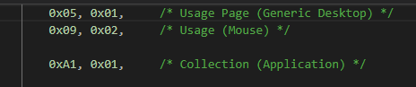

第一个report ID 1

键盘鼠标

report_size代表多少bit 

report_count 代表多少个数据

第一个5*1bit

logical_min max 就是每个单位最小值和最大值

usage_min max 就是index 从1-5

后面跟了个3bit*1的占位符，

后面跟了一个8bit*1的wheel滚轮

最小值-127

最大值127


下面哪个AC PAN  

report count是1  这个根据USAGE_PAGE(consumer)，根据usage page

需要看usage page的说明就看

-1- USB HID Usage Tables V1.12 里面有详细的，

但是consumer更像一个客制化的集合

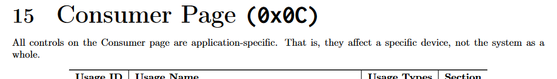


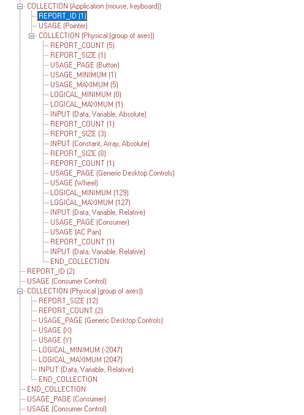

report ID 2:

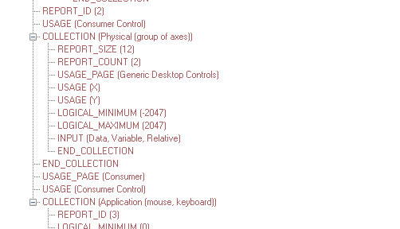

report ID 2比较好理解：

report_size ：12bit

report_count： 2个数据

一个是X轴，一个是Y轴

逻辑数据：-2047-2047

输入

返回上来的数据也是

12*2 = 24 需要3个字节


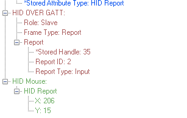

report map最大是5个

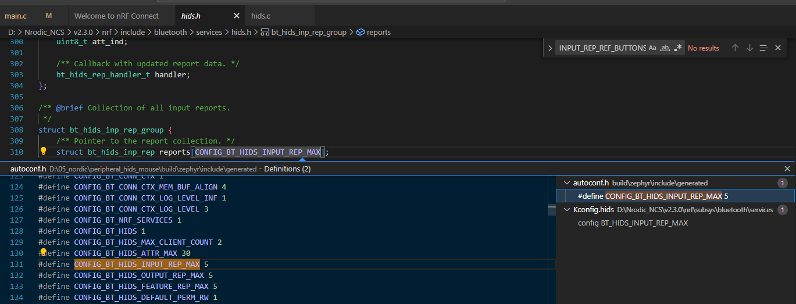

0x0101  HID version


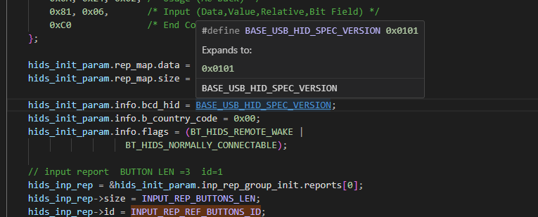


这里的1.01 版本好像没有找到，官方默认目前版本是1.0  =》 这个实际上是代表USB的hid是1.01，不是蓝牙的HOGP


report ID 3：

1bit*1 

scan下一首，scan上一首， 音量＋，音量➖，AC前，AC后

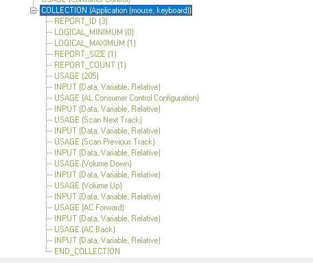

好，基本上，所有button都是处理的是report 2的数据

最终反应到x, y的数据

```

	if (buttons & KEY_LEFT_MASK) {
		pos.x_val -= MOVEMENT_SPEED;
		printk("%s(): left\n", __func__);
		data_to_send = true;
	}
	if (buttons & KEY_UP_MASK) {
		pos.y_val -= MOVEMENT_SPEED;
		printk("%s(): up\n", __func__);
		data_to_send = true;
	}
	if (buttons & KEY_RIGHT_MASK) {
		pos.x_val += MOVEMENT_SPEED;
		printk("%s(): right\n", __func__);
		data_to_send = true;
	}
	if (buttons & KEY_DOWN_MASK) {
		pos.y_val += MOVEMENT_SPEED;
		printk("%s(): down\n", __func__);
		data_to_send = true;
	}
```


复合设备：

```
	0x05, 0x01,                    // USAGE_PAGE (Generic Desktop)
    0x09, 0x06,                    // USAGE (Keyboard)
    0xa1, 0x01,                    // COLLECTION (Application)
    0x85, 0x01,                    //   REPORT_ID (1)
    0x75, 0x01,                    //   REPORT_SIZE (1)
    0x95, 0x01,                    //   REPORT_COUNT (1)
    0x15, 0x00,                    //   LOGICAL_MINIMUM (0)
    0x25, 0x01,                    //   LOGICAL_MAXIMUM (1)
    0x05, 0x07,                    //   USAGE_PAGE (Keyboard)
    0x09, 0xe0,                    //   USAGE (Keyboard LeftControl)
    0x81, 0x06,                    //   INPUT (Data,Var,Rel)
    0x09, 0x06,                    //   USAGE (Keyboard c and C)
    0x81, 0x06,                    //   INPUT (Data,Var,Rel)
    0x09, 0x19,                    //   USAGE (Keyboard v and V)
    0x81, 0x06,                    //   INPUT (Data,Var,Rel)
    0x95, 0x01,                    //   REPORT_COUNT (1)
    0x75, 0x05,                    //   REPORT_SIZE (5)
    0x81, 0x07,                    //   INPUT (Cnst,Var,Rel)                    
    0xc0,                          // END_COLLECTION
    
    0x05, 0x01,   // USAGE_PAGE (Generic Desktop)
    0x09, 0x02,   // USAGE (Mouse)
    0xa1, 0x01,   // COLLECTION (Application)
    0x85, 0x02,   //   REPORT_ID (2)
    0x09, 0x01,   //   USAGE (Pointer)
    0xa1, 0x00,   //   COLLECTION (Physical)
    0x75, 0x0C,       /* Report Size (12) */
    0x95, 0x02,       /* Report Count (2) */
    0x05, 0x01,       /* Usage Page (Generic Desktop) */
    0x09, 0x30,       /* Usage (X) */
    0x09, 0x31,       /* Usage (Y) */
    0x16, 0x01, 0xF8, /* Logical maximum (2047) */
    0x26, 0xFF, 0x07, /* Logical minimum (-2047) */
    0x81, 0x06,       /* Input (Data, Variable, Relative) */
    0xc0,         //   END_COLLECTION
    0xc0          // END_COLLECTION
```

	0x65,	/* Key e */
	0x65,	/* Key e */
	0x74,	/* Key t */
	0x72,	/* Key r */
	0x65,	/* Key e */
	//0x65,	/* Key e */


## 键盘

```
static const uint8_t report_map[] = {
		0x05, 0x01,       /* Usage Page (Generic Desktop) */
		0x09, 0x06,       /* Usage (Keyboard) */
		0xA1, 0x01,       /* Collection (Application) */

		/* Keys */
#if INPUT_REP_KEYS_REF_ID
		0x85, INPUT_REP_KEYS_REF_ID,
#endif
		0x05, 0x07,       /* Usage Page (Key Codes) */
		0x19, 0xe0,       /* Usage Minimum (224) */
		0x29, 0xe7,       /* Usage Maximum (231) */
		0x15, 0x00,       /* Logical Minimum (0) */
		0x25, 0x01,       /* Logical Maximum (1) */
		/* 1bit *8    */
		0x75, 0x01,       /* Report Size (1) */
		0x95, 0x08,       /* Report Count (8) */
		0x81, 0x02,       /* Input (Data, Variable, Absolute) */
       /* 8bit *1 */
		0x95, 0x01,       /* Report Count (1) */
		0x75, 0x08,       /* Report Size (8) */
		0x81, 0x01,       /* Input (Constant) reserved byte(1) */

      /* 8bit * 6  */
		0x95, 0x06,       /* Report Count (6) */
		0x75, 0x08,       /* Report Size (8) */
		0x15, 0x00,       /* Logical Minimum (0) */
		0x25, 0x65,       /* Logical Maximum (101) */
		0x05, 0x07,       /* Usage Page (Key codes) */
		0x19, 0x00,       /* Usage Minimum (0) */
		0x29, 0x65,       /* Usage Maximum (101) */
		0x81, 0x00,       /* Input (Data, Array) Key array(6 bytes) */

		/* LED */
#if OUTPUT_REP_KEYS_REF_ID
		0x85, 1,
#endif
/* 1bit *5 */
		0x95, 0x05,       /* Report Count (5) */
		0x75, 0x01,       /* Report Size (1) */
		0x05, 0x08,       /* Usage Page (Page# for LEDs) */
		0x19, 0x01,       /* Usage Minimum (1) */
		0x29, 0x05,       /* Usage Maximum (5) */
		0x91, 0x02,       /* Output (Data, Variable, Absolute), */
				  /* Led report */
		0x95, 0x01,       /* Report Count (1) */
		0x75, 0x03,       /* Report Size (3) */
		0x91, 0x01,       /* Output (Data, Variable, Absolute), */
				  /* Led report padding */

		0xC0              /* End Collection (Application) */
	};
```

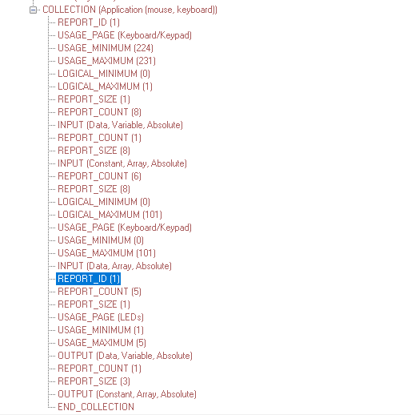

REPORT ID 1 input

`1bit*8 +8bit*1(保留)+ 8bit*6`

前8个bit分别代表

keyboard里面的224-231 的键值

也就是E0-E7

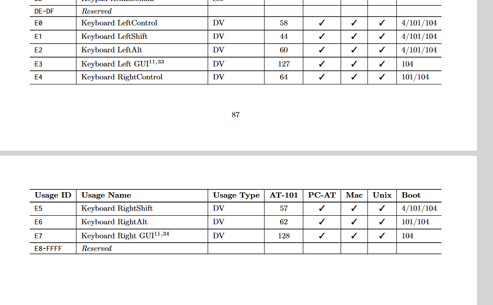


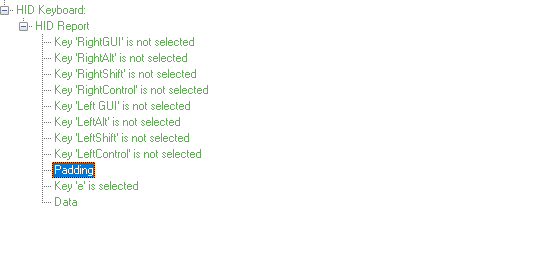

正好可以对上，第二个自己是保留的自己reserved，下面的6个byte就是数据了，每个代表键值，值是0-101

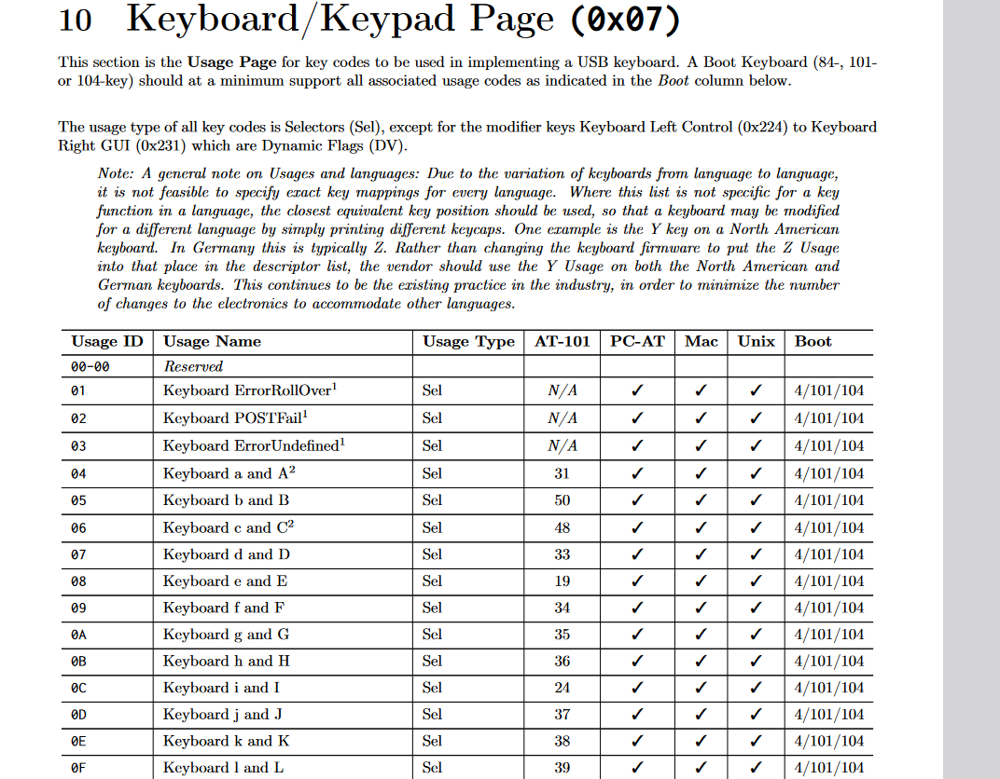

由这些键值搞定。

report ID 1 ouput

`1bit*5 + 3bit*1`


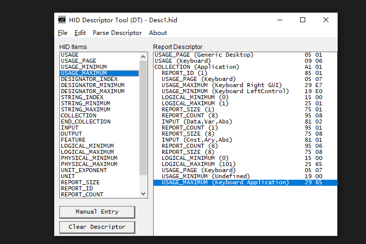


```
	0x05, 0x01,       /* Usage Page (Generic Desktop) */
		0x09, 0x06,       /* Usage (Keyboard) */
		0xA1, 0x01,       /* Collection (Application) */

		/* Keys */
		0x85, 0x01,
		0x05, 0x07,       /* Usage Page (Key Codes) */
		0x19, 0xe0,       /* Usage Minimum (224) */
		0x29, 0xe7,       /* Usage Maximum (231) */
		0x15, 0x00,       /* Logical Minimum (0) */
		0x25, 0x01,       /* Logical Maximum (1) */
		0x75, 0x01,       /* Report Size (1) */
		0x95, 0x08,       /* Report Count (8) */
		0x81, 0x02,       /* Input (Data, Variable, Absolute) */

		0x95, 0x01,       /* Report Count (1) */
		0x75, 0x08,       /* Report Size (8) */
		0x81, 0x01,       /* Input (Constant) reserved byte(1) */

		0x95, 0x06,       /* Report Count (6) */
		0x75, 0x08,       /* Report Size (8) */
		0x15, 0x00,       /* Logical Minimum (0) */
		0x25, 0x65,       /* Logical Maximum (101) */
		0x05, 0x07,       /* Usage Page (Key codes) */
		0x19, 0x00,       /* Usage Minimum (0) */
		0x29, 0x65,       /* Usage Maximum (101) */
		0x81, 0x00,       /* Input (Data, Array) Key array(6 bytes) */

		/* LED */

		0x85, 0x01,
		
		0x95, 0x05,       /* Report Count (5) */
		0x75, 0x01,       /* Report Size (1) */
		0x05, 0x08,       /* Usage Page (Page# for LEDs) */
		0x19, 0x01,       /* Usage Minimum (1) */
		0x29, 0x05,       /* Usage Maximum (5) */
		0x91, 0x02,       /* Output (Data, Variable, Absolute), */
				  /* Led report */
		0x95, 0x01,       /* Report Count (1) */
		0x75, 0x03,       /* Report Size (3) */
		0x91, 0x01,       /* Output (Data, Variable, Absolute), */
				  /* Led report padding */

		0xC0,              /* End Collection (Application) */
	#endif
    0x05, 0x01,   // USAGE_PAGE (Generic Desktop)

    0x09, 0x02,   // USAGE (Mouse)

    0xa1, 0x01,   // COLLECTION (Application)

    0x85, 0x02,   //   REPORT_ID (2)

    0x09, 0x01,   //   USAGE (Pointer)

    0xa1, 0x00,   //   COLLECTION (Physical)

    0x05, 0x09,   //         Usage Page (Buttons)

    0x19, 0x01,   //         Usage Minimum (1)

    0x29, 0x03,   //         Usage Maximum (3)

    0x15, 0x00,   //         Logical Minimum (0)

    0x25, 0x01,   //         Logical Maximum (1)

    0x95, 0x03,   //         Report Count (3)

    0x75, 0x01,   //         Report Size (1)

    0x81, 0x02,   //         Input(Data, Variable, Absolute); 3 button bits

    0x95, 0x01,   //         Report Count(1)

    0x75, 0x05,   //         Report Size(5)

    0x81, 0x03,   //         Input(Constant);                 5 bit padding

    0x05, 0x01,   //         Usage Page (Generic Desktop)

    0x09, 0x30,   //         Usage (X)

    0x09, 0x31,   //         Usage (Y)

    0x09, 0x38,   //         Usage (Wheel)

    0x15, 0x81,   //         Logical Minimum (-127)

    0x25, 0x7F,   //         Logical Maximum (127)

    0x75, 0x08,   //         Report Size (8)

    0x95, 0x03,   //         Report Count (3)

    0x81, 0x06,   //         Input(Data, Variable, Relative); 3 position bytes (X,Y,Wheel)

    0xc0,         //   END_COLLECTION
    0xc0          // END_COLLECTION
```

**任务一：**

• 使用板卡的蓝牙连接，设计一个蓝牙鼠标+键盘复合设备，按键1作为鼠标点击，按键2作为键盘输入按下时输入“eetree”字符，电脑开启大写锁定时，板卡的LED亮起


点击鼠标左键如何点击？