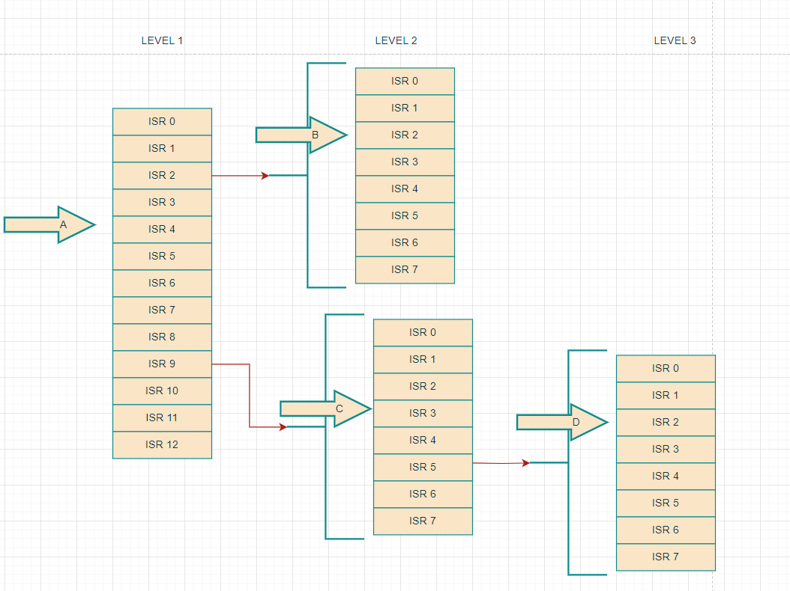
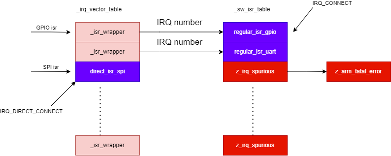
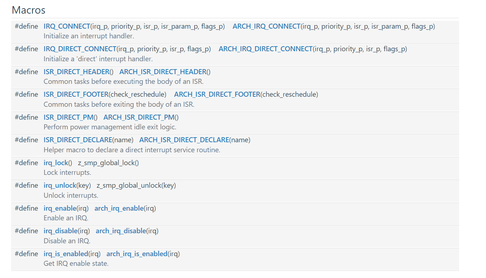
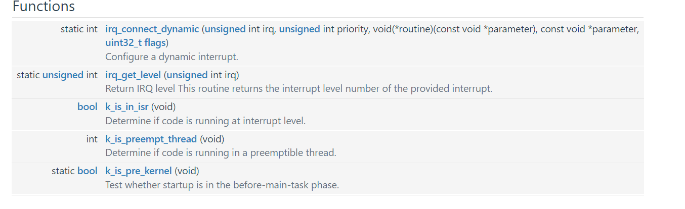

# 中断系统

## 概述

中断服务例程（ISR) 是zephyr的系统中的一个重要组成部分。

zephyr 通过各种手段，将不同平台的中断特性整合到一起，尽量让上层可以使用统一的API进行中断管理。抽象和管理不同架构芯片的中断。

zephyr引入了以下概念

- 多级中断
- 防止中断被打断，也叫中断锁
- 零延迟中断
- 中断转移offload


如何实现

- 定义常规的中断
- 定义直接中断
- 中断向量表和软件中断


我们先了解一下如何使用zehpyr的中断系统。基于的MCU主要是`cortex-M`

### 注册IRQ 

#### 注册普通中断

IRQ_CONNECT

> 这个必须放在函数里面执行，不能放在函数外面。

这个是一个宏定义，这个并不是一个函数，所以这个在编译的时候会处理这个宏，里面内置了一些section的语法，将中断服务历程和flag放置到`intList`段中。

这个默认中断都是注册到软件中断向量表中的。

```
#define ARCH_IRQ_CONNECT(irq_p, priority_p, isr_p, isr_param_p, flags_p) \
{ \
	BUILD_ASSERT(IS_ENABLED(CONFIG_ZERO_LATENCY_IRQS) || !(flags_p & IRQ_ZERO_LATENCY), \
			"ZLI interrupt registered but feature is disabled"); \
	_CHECK_PRIO(priority_p, flags_p) \
	Z_ISR_DECLARE(irq_p, 0, isr_p, isr_param_p); \
	z_arm_irq_priority_set(irq_p, priority_p, flags_p); \
}

```

这个宏主要调用了Z_ISR_DECLARE 这个函数

```
#define Z_ISR_DECLARE(irq, flags, func, param) \
	static Z_DECL_ALIGN(struct _isr_list) Z_GENERIC_SECTION(.intList) \
		__used _MK_ISR_NAME(func, __COUNTER__) = \
			{irq, flags, (void *)&func, (const void *)param}
```

#### 注册直接中断

IRQ_DIRECT_CONNECT

这个也是一个宏定义，原理和上面的IRQ_CONNECT一样，不同之处在于，这个是直接注册到中断向量表中的，也就是ROM区域的，这个中断服务例程是无法更改的。而且需要注意的是直接中断，是没有参数的，这样做的目的是为了更快的响应，一般用在低功耗唤醒等场景中。

而代码中不同之处就在于`ISR_FLAG_DIRECT`   flag 是不一样的

```
#define ARCH_IRQ_DIRECT_CONNECT(irq_p, priority_p, isr_p, flags_p) \
{ \
	BUILD_ASSERT(IS_ENABLED(CONFIG_ZERO_LATENCY_IRQS) || !(flags_p & IRQ_ZERO_LATENCY), \
			"ZLI interrupt registered but feature is disabled"); \
	_CHECK_PRIO(priority_p, flags_p) \
	Z_ISR_DECLARE(irq_p, ISR_FLAG_DIRECT, isr_p, NULL); \
	z_arm_irq_priority_set(irq_p, priority_p, flags_p); \
}
```


这两个宏`IRQ_CONNECT` 和`IRQ_DIRECT_CONNECT` 实际上调用的主要是宏`Z_ISR_DECLARE`

这个实现如下

```
#define Z_ISR_DECLARE(irq, flags, func, param) \
	static Z_DECL_ALIGN(struct _isr_list) Z_GENERIC_SECTION(.intList) \
		__used _MK_ISR_NAME(func, __COUNTER__) = \
			{irq, flags, (void *)&func, (const void *)param}
```

这个如何实现，我们在下面中断向量表章节会介绍如何具体来实现。

### 动态注册IRQ

zephyr支持动态注册中断，如何实现的呢？这就引入了软件中断向量表的概念。

动态加载主要API 是arch_irq_connect_dynamic， 它是由宏`CONFIG_DYNAMIC_INTERRUPTS` 来控制是否需要实现，

最终会注册到软件中断向量表`_sw_isr_table` 中。由于`_sw_isr_table`是存放在ram中的，可以直接对其进行修改

```
int arch_irq_connect_dynamic(unsigned int irq, unsigned int priority,
			     void (*routine)(const void *parameter),
			     const void *parameter, uint32_t flags)
```

动态注册如何实现，我们下面介绍中断向量表的时候，会介绍。

### 中断锁定lock

zephyr中定义了一个概念`防止中断被打断`, 为了实现这一目标，zephyr定义了irq_lock() 函数用来防止其他中断来打断这个中断，这个lock的用法见下面的例子，很类似于，操作系统中调度锁的概念，即当前中断不允许被其他中断打断（除了内核中断）

```c
void arch_irq_enable(unsigned int irq)
{
	unsigned int key;
	uint32_t irq_mask;

	key = irq_lock();

	.....

	irq_unlock(key);
}
```

这个函数实际实现就是使用了`BASEPRI`, 不同平台寄存器不一样，这里主要ARM-cortex-M中，其他平台如果有也可以实现。

include\zephyr\arch\arm\aarch32\asm_inline_gcc.h

```
static ALWAYS_INLINE unsigned int arch_irq_lock(void)
{
	unsigned int key;
	unsigned int tmp;
	__asm__ volatile(
		"mov %1, %2;"
		"mrs %0, BASEPRI;"
		"msr BASEPRI_MAX, %1;"
		"isb;"
		: "=r"(key), "=r"(tmp)
		: "i"(_EXC_IRQ_DEFAULT_PRIO)
		: "memory");
	return key;
}
```


#### 中断零延迟

零延迟中断是zephyr中用来处理，这个零延迟可以算中断锁定概念中的特例，就是相当于零延迟中断无法被`irq_lock` 锁住，

它是通过设置更高的中断优先级来实现的，我们先看看如何使用，在通过IRQ_CONNECT注册中断的时候，最后的flag添加`IRQ_ZERO_LATENCY`


```
IRQ_DIRECT_CONNECT(DT_IRQN(RTC(idx)),			       \
				    DT_IRQ(RTC(idx), priority),		       \
				    counter_rtc##idx##_isr_wrapper,	       \
				    IRQ_ZERO_LATENCY))
```

那它是如何实现的呢？

操作系统很巧妙，它用一个特定的最高优先级来定义零延迟中断，

这里还有个变量`ZERO_LATENCY_LEVELS` 由 `CONFIG_ZERO_LATENCY_LEVELS` Kconfig来控制，

arch\arm\core\aarch32\irq_manage.c

```
	if (IS_ENABLED(CONFIG_ZERO_LATENCY_IRQS) && (flags & IRQ_ZERO_LATENCY)) {
		if (ZERO_LATENCY_LEVELS == 1) {
			prio = _EXC_ZERO_LATENCY_IRQS_PRIO;
		} else {
			/* Use caller supplied prio level as-is */
		}
	} else {
		prio += _IRQ_PRIO_OFFSET;
	}
```

通常CONFIG_ZERO_LATENCY_LEVELS=1 那零延时中断就是采用最高优先级`_EXC_ZERO_LATENCY_IRQS_PRIO` 这个通常值是`0` ,

如果定义了CONFIG_ZERO_LATENCY_LEVELS大于1，则优先级使用原始的优先级。而普通如果不用零延时中断的话，则采用`_IRQ_PRIO_OFFSET` 作为优先级偏移

这些宏的定义在文件`include\zephyr\arch\arm\aarch32\exc.h` 中


### 多级中断

当某个外设中断是由父级中断触发而来的，比如一些GPIO中断和`iomux`中断具有层级嵌套关系，

多级中断，指定一些父级中断的列表，这些父级节点列表每个中断都可以触发一组中断，假设这组中断数量是7，那通过32bit的数据，第一个byte代表父级中断，第二个byte代表第二级的父级中断，第三个byte代表第三级的中断，

最高位byte的数据代表这个中断向量号的index值，紧接着代表第二级的中断的入口中断，第1个byte代表父级中断

下面我们看下官方的例子：


分为1，2，3 级

```
A -> 0x00000004
B -> 0x00000302
C -> 0x00000409
D -> 0x00030609
```

如果二级中断，第二个byte是有数据的

如果是三级中断，第三个byte是有数据的。

找到最高一位的是第几个byte就是几级中断

```
          9             2   0
    _ _ _ _ _ _ _ _ _ _ _ _ _         (LEVEL 1)
  5       |         A   |
_ _ _ _ _ _ _         _ _ _ _ _ _ _   (LEVEL 2)
  |   C                       B
_ _ _ _ _ _ _                         (LEVEL 3)
        D
```

这张图看起来很复杂，我们转换成可以方便阅读的形式




- '-' 表示中断线，从 0（最右边）开始编号。
- LEVEL 1 有 12 条中断线，其中两条线（2 和 9）连接到嵌套控制器，并且线 4 上有一个设备“A”。
- 其中一个 LEVEL 2 控制器具有连接到 LEVEL 3 嵌套控制器的中断线路 5，以及线路 3 上的一个设备“C”。
- 另一个 LEVEL 2 控制器没有嵌套控制器，但在第 2 行有一个设备“B”。
- LEVEL 3 控制器在第 2 行有一个设备“D”。
- 这里的每一级中断的，除了父级中断，是7


```
static inline unsigned int irq_get_level(unsigned int irq)
{
#if defined(CONFIG_3RD_LEVEL_INTERRUPTS)
	return ((irq >> 16) & 0xFF) != 0 ? 3 :
		(((irq >> 8) & 0xFF) == 0 ? 1 : 2);
#elif defined(CONFIG_2ND_LEVEL_INTERRUPTS)
	return ((irq >> 8) & 0xFF) == 0 ? 1 : 2;
#else
	ARG_UNUSED(irq);

	return 1;
#endif
}
```


```
 *(SORT_BY_ALIGNMENT(.intList*))

 .intList       0x00000000fffff808       0x80 zephyr/drivers/interrupt_controller/libdrivers__interrupt_controller.a(intc_rv32m1_intmux.c.obj)

 .intList       0x00000000fffff888       0x50 zephyr/drivers/gpio/libdrivers__gpio.a(gpio_rv32m1.c.obj)

 .intList       0x00000000fffff8d8       0x10 zephyr/drivers/serial/libdrivers__serial.a(uart_rv32m1_lpuart.c.obj)

 .intList       0x00000000fffff8e8       0x10 zephyr/drivers/timer/libdrivers__timer.a(rv32m1_lptmr_timer.c.obj)

                                                                        \
        static int gpio_rv32m1_##n##_init(const struct device *dev)     \
        {                                                               \
                IRQ_CONNECT(DT_INST_IRQN(n),                            \
                            0,                                          \
                            gpio_rv32m1_port_isr,                       \
                            DEVICE_DT_INST_GET(n), 0);                  \
                irq_enable(DT_INST_IRQN(0));                            \
                return 0;                                               
        }


```


```
#define CONFIG_MAX_IRQ_PER_AGGREGATOR 32
#define CONFIG_2ND_LEVEL_INTERRUPTS 1
#define CONFIG_2ND_LVL_ISR_TBL_OFFSET 32
#define CONFIG_NUM_2ND_LEVEL_AGGREGATORS 8
#define CONFIG_2ND_LVL_INTR_00_OFFSET 24
#define CONFIG_2ND_LVL_INTR_01_OFFSET 25
#define CONFIG_2ND_LVL_INTR_02_OFFSET 26
#define CONFIG_2ND_LVL_INTR_03_OFFSET 27
#define CONFIG_2ND_LVL_INTR_04_OFFSET 28
#define CONFIG_2ND_LVL_INTR_05_OFFSET 29
#define CONFIG_2ND_LVL_INTR_06_OFFSET 30
#define CONFIG_2ND_LVL_INTR_07_OFFSET 31
#define CONFIG_MULTI_LEVEL_INTERRUPTS 1

gen_isr_tables.py: 2nd level offsets: [24, 25, 26, 27, 28, 29, 30, 31]
gen_isr_tables.py: Configured interrupt routing
gen_isr_tables.py: handler    irq flags param
gen_isr_tables.py: --------------------------
gen_isr_tables.py: 0x17b8     31  0     0x7
gen_isr_tables.py: 0x17b8     30  0     0x6
gen_isr_tables.py: 0x17b8     29  0     0x5
gen_isr_tables.py: 0x17b8     28  0     0x4
gen_isr_tables.py: 0x17b8     27  0     0x3
gen_isr_tables.py: 0x17b8     26  0     0x2
gen_isr_tables.py: 0x17b8     25  0     0x1
gen_isr_tables.py: 0x17b8     24  0     0x0

//gpio
gen_isr_tables.py: 0x1ad4     0x1c19 0     0x357c
gen_isr_tables.py: 0x1ad4     0x1219 0     0x3590
gen_isr_tables.py: 0x1ad4     0x1119 0     0x35a4
gen_isr_tables.py: 0x1ad4     0x1019 0     0x35b8


gen_isr_tables.py: 0x1ad4     18  0     0x35cc
gen_isr_tables.py: 0x1c26     17  0     0x35e0
gen_isr_tables.py: 0x1fd4     2072 0     0x0

gen_isr_tables.py: IRQ = 7193
gen_isr_tables.py: IRQ = 0x1c19
gen_isr_tables.py: IRQ_level = 2
gen_isr_tables.py: IRQ_Indx = 28
gen_isr_tables.py: IRQ_Indx = 0x1c
gen_isr_tables.py: IRQ_Pos  = 91
gen_isr_tables.py: IRQ_Pos  = 0x5b
gen_isr_tables.py: IRQ = 4633
gen_isr_tables.py: IRQ = 0x1219
gen_isr_tables.py: IRQ_level = 2
gen_isr_tables.py: IRQ_Indx = 18
gen_isr_tables.py: IRQ_Indx = 0x12
gen_isr_tables.py: IRQ_Pos  = 81
gen_isr_tables.py: IRQ_Pos  = 0x51

```

0x1c19

先找到父亲中断0x19 （25）那这个中断在2级中断list2nd[24, 25, 26, 27, 28, 29, 30, 31]里面的偏移是1

32是偏移+32*1+

```
gen_isr_tables.py: IRQ = 7193
gen_isr_tables.py: IRQ = 0x1c19
gen_isr_tables.py: IRQ_level = 2
gen_isr_tables.py: irq2_baseoffset = 32
gen_isr_tables.py: max_irq_per = 32
gen_isr_tables.py: list_index = 1
gen_isr_tables.py: irq2 = 28
gen_isr_tables.py: IRQ_Indx = 28
gen_isr_tables.py: IRQ_Indx = 0x1c
gen_isr_tables.py: IRQ_Pos  = 91
gen_isr_tables.py: IRQ_Pos  = 0x5b

en_isr_tables.py: IRQ = 4633
gen_isr_tables.py: IRQ = 0x1219
gen_isr_tables.py: IRQ_level = 2
gen_isr_tables.py: irq2_baseoffset = 32
gen_isr_tables.py: max_irq_per = 32
gen_isr_tables.py: list_index = 1
gen_isr_tables.py: irq2 = 18
gen_isr_tables.py: IRQ_Indx = 18
gen_isr_tables.py: IRQ_Indx = 0x12
gen_isr_tables.py: IRQ_Pos  = 81
gen_isr_tables.py: IRQ_Pos  = 0x51

#ifdef CONFIG_RV32M1_INTMUX_CHANNEL_0
        IRQ_CONNECT(INTMUX_CH0_IRQ, 0, rv32m1_intmux_isr,
                    UINT_TO_POINTER(0), 0);
        irq_enable(INTMUX_CH0_IRQ);
#endif

#ifdef CONFIG_RV32M1_INTMUX_CHANNEL_1
        IRQ_CONNECT(INTMUX_CH1_IRQ, 0, rv32m1_intmux_isr,
                    UINT_TO_POINTER(1), 0);
        irq_enable(INTMUX_CH1_IRQ);
#endif

#ifdef CONFIG_RV32M1_INTMUX_CHANNEL_2
        IRQ_CONNECT(INTMUX_CH2_IRQ, 0, rv32m1_intmux_isr,
                    UINT_TO_POINTER(2), 0);
        irq_enable(INTMUX_CH2_IRQ);
#endif

#ifdef CONFIG_RV32M1_INTMUX_CHANNEL_3
        IRQ_CONNECT(INTMUX_CH3_IRQ, 0, rv32m1_intmux_isr,
                    UINT_TO_POINTER(3), 0);
        irq_enable(INTMUX_CH3_IRQ);
#endif

#ifdef CONFIG_RV32M1_INTMUX_CHANNEL_4
        IRQ_CONNECT(INTMUX_CH4_IRQ, 0, rv32m1_intmux_isr,
                    UINT_TO_POINTER(4), 0);
        irq_enable(INTMUX_CH4_IRQ);
#endif

#ifdef CONFIG_RV32M1_INTMUX_CHANNEL_5
        IRQ_CONNECT(INTMUX_CH5_IRQ, 0, rv32m1_intmux_isr,
                    UINT_TO_POINTER(5), 0);
        irq_enable(INTMUX_CH5_IRQ);
#endif

```

32+32*1+28-1 = 91


```

                 irq_parent = irq1
                    list_index = getindex(irq_parent, list_2nd_lvl_offsets)
                    irq2_pos = irq2_baseoffset + max_irq_per*list_index + irq2 - 1
                    debug('IRQ_level = 2')
                    debug('irq2_baseoffset = ' + str(irq2_baseoffset))
                    debug('max_irq_per = ' + str(max_irq_per))
                    debug('list_index = ' + str(list_index))
                    debug('irq2 = ' + str(irq2))
                    debug('IRQ_Indx = ' + str(irq2))
                    debug('IRQ_Indx = ' + hex(irq2))
                    debug('IRQ_Pos  = ' + str(irq2_pos))
                    debug('IRQ_Pos  = ' + hex(irq2_pos))
                    table_index = irq2_pos - offset
```


### 中断工作转移offload

中断转移是一种zephyr定义的一个非常重要的概念，并没有过多的实现来对接的API，主要意思就是，如果中断中需要处理的事务过多，那么就将该任务的内容卸载到task里面来执行，以快速响应中断和防止阻碍其他中断。通常我们写SDK写多了之后，会发现，中断中要处理的事情过多，或者中断中嵌套函数过多，会导致cache等不能命中，zephyr更多的是建议大家把中断信号发出来，然后通过其他信号量通知到线程来处理，或者`work`来处理。

内核可以支持多种方式来处理中断offload

- 可以用信号量向线程发送信号
- 可以使用工作队列`work`来执行工作

### 中断使能enable

上面都是讲中断如何注册和加载，也就是把中断服务例程放到中断向量表中，防置好了之后，还需要打开中断，也就是要调用`irq_enable`来使能中断，这个是不同架构实现是不一样的，CORTEX-M是通过NVIC开关来控制中断的使能。

下面是个例子，就是调用IRQ_CONNECT之后要使用irq_enable来使能。

```
	IRQ_CONNECT(SGI_FPU_IPI, IRQ_DEFAULT_PRIORITY, flush_fpu_ipi_handler, NULL, 0);
	irq_enable(SGI_FPU_IPI);
```

详见arch\arm\core\aarch32\irq_manage.c

```
void arch_irq_enable(unsigned int irq)
{
	NVIC_EnableIRQ((IRQn_Type)irq);
}

void arch_irq_disable(unsigned int irq)
{
	NVIC_DisableIRQ((IRQn_Type)irq);
}
int arch_irq_is_enabled(unsigned int irq)
{
	return NVIC->ISER[REG_FROM_IRQ(irq)] & BIT(BIT_FROM_IRQ(irq));
}

```

## 如何实现及为何如此实现

### 注册IRQ

上面提到Z_ISR_DECLARE 这个宏是主要来注册IRQ函数的，

include\zephyr\sw_isr_table.h

```
#define Z_ISR_DECLARE(irq, flags, func, param) \
	static Z_DECL_ALIGN(struct _isr_list) Z_GENERIC_SECTION(.intList) \
		__used _MK_ISR_NAME(func, __COUNTER__) = \
			{irq, flags, (void *)&func, (const void *)param}
```

这里定义了结构体

这个是个static的变量  是这样的一个结构体，4byte*4 = 16个字节，即每个中断都会生成一个变量_MK_ISR_NAME

```
struct _isr_list {
	/** IRQ line number */
	int32_t irq;
	/** Flags for this IRQ, see ISR_FLAG_* definitions */
	int32_t flags;
	/** ISR to call */
	void *func;
	/** Parameter for non-direct IRQs */
	const void *param;
};
```

这里的_MK_ISR_NAME 是个语法糖，名字是以函数`func`和 `__LINE__` 来命名的。

```
#define _MK_ISR_NAME(x, y) __MK_ISR_NAME(x, y)
#define __MK_ISR_NAME(x, y) __isr_ ## x ## _irq_ ## y
#define __COUNTER__ __LINE__
```

编译之后，这个结构体存放在段`.intList` 中

而`.intList` 中的数据如何存放呢？

看下zephyr\include\zephyr\linker\intlist.ld

中的

```
#ifndef LINKER_ZEPHYR_FINAL
SECTION_PROLOGUE(.intList,,)
{
	KEEP(*(.irq_info*))
	KEEP(*(.intList*))
} GROUP_ROM_LINK_IN(IDT_LIST, IDT_LIST)
#else
/DISCARD/ :
{
	KEEP(*(.irq_info*))
	KEEP(*(.intList*))
}
#endif

```

这里存放了所有`.intList`段，前面还加了个头

这个头在zephyr\arch\common\isr_tables.c

```
Z_GENERIC_SECTION(.irq_info) struct int_list_header _iheader = {
	.table_size = IRQ_TABLE_SIZE,
	.offset = CONFIG_GEN_IRQ_START_VECTOR,
};
```

这里的配置CONFIG_GEN_IRQ_START_VECTOR通常是0

这里的配置IRQ_TABLE_SIZE 通常是CONFIG_NUM_IRQS(48) - CONFIG_GEN_IRQ_START_VECTOR(0)

这个头主要给`gen_isr_tables.py ` 使用的，用于自动生成硬件中断向量表和软件中断向量表。

最后生成的中断向量表，有两个一个是硬件中断向量表和软件中断向量表。

build\zephyr\isr_tables.c

```
typedef void (* ISR)(const void *);
uintptr_t __irq_vector_table _irq_vector_table[48] = {
	((uintptr_t)&_isr_wrapper),
	((uintptr_t)&_isr_wrapper),
	((uintptr_t)&_isr_wrapper),
	((uintptr_t)&_isr_wrapper),
	((uintptr_t)&_isr_wrapper),
	((uintptr_t)&_isr_wrapper),
	((uintptr_t)&_isr_wrapper),
	((uintptr_t)&_isr_wrapper),
	((uintptr_t)&_isr_wrapper),
	((uintptr_t)&_isr_wrapper),
	((uintptr_t)&_isr_wrapper),
	((uintptr_t)&_isr_wrapper),
	((uintptr_t)&_isr_wrapper),
	((uintptr_t)&_isr_wrapper),
	((uintptr_t)&_isr_wrapper),
	((uintptr_t)&_isr_wrapper),
	((uintptr_t)&_isr_wrapper),
	((uintptr_t)&_isr_wrapper),
	((uintptr_t)&_isr_wrapper),
	((uintptr_t)&_isr_wrapper),
	((uintptr_t)&_isr_wrapper),
	((uintptr_t)&_isr_wrapper),
	((uintptr_t)&_isr_wrapper),
	((uintptr_t)&_isr_wrapper),
	((uintptr_t)&_isr_wrapper),
	((uintptr_t)&_isr_wrapper),
	((uintptr_t)&_isr_wrapper),
	((uintptr_t)&_isr_wrapper),
	((uintptr_t)&_isr_wrapper),
	((uintptr_t)&_isr_wrapper),
	((uintptr_t)&_isr_wrapper),
	((uintptr_t)&_isr_wrapper),
	((uintptr_t)&_isr_wrapper),
	((uintptr_t)&_isr_wrapper),
	((uintptr_t)&_isr_wrapper),
	((uintptr_t)&_isr_wrapper),
	((uintptr_t)&_isr_wrapper),
	((uintptr_t)&_isr_wrapper),
	((uintptr_t)&_isr_wrapper),
	((uintptr_t)&_isr_wrapper),
	((uintptr_t)&_isr_wrapper),
	((uintptr_t)&_isr_wrapper),
	((uintptr_t)&_isr_wrapper),
	((uintptr_t)&_isr_wrapper),
	((uintptr_t)&_isr_wrapper),
	((uintptr_t)&_isr_wrapper),
	((uintptr_t)&_isr_wrapper),
	((uintptr_t)&_isr_wrapper),
};
struct _isr_table_entry __sw_isr_table _sw_isr_table[48] = {
	{(const void *)0x45c1, (ISR)0x874f},
	{(const void *)0x0, (ISR)((uintptr_t)&z_irq_spurious)},
	{(const void *)0x8ad0, (ISR)0x84fd},
	{(const void *)0x0, (ISR)((uintptr_t)&z_irq_spurious)},
	{(const void *)0x0, (ISR)((uintptr_t)&z_irq_spurious)},
	{(const void *)0x0, (ISR)((uintptr_t)&z_irq_spurious)},
	{(const void *)0x4c49, (ISR)0x874f},
	{(const void *)0x0, (ISR)((uintptr_t)&z_irq_spurious)},
	{(const void *)0x0, (ISR)((uintptr_t)&z_irq_spurious)},
	{(const void *)0x0, (ISR)((uintptr_t)&z_irq_spurious)},
	{(const void *)0x0, (ISR)((uintptr_t)&z_irq_spurious)},
	{(const void *)0x0, (ISR)((uintptr_t)&z_irq_spurious)},
	{(const void *)0x0, (ISR)((uintptr_t)&z_irq_spurious)},
	{(const void *)0x0, (ISR)((uintptr_t)&z_irq_spurious)},
	{(const void *)0x0, (ISR)((uintptr_t)&z_irq_spurious)},
	{(const void *)0x0, (ISR)((uintptr_t)&z_irq_spurious)},
	{(const void *)0x0, (ISR)((uintptr_t)&z_irq_spurious)},
	{(const void *)0x0, (ISR)0x3d65},
	{(const void *)0x0, (ISR)((uintptr_t)&z_irq_spurious)},
	{(const void *)0x0, (ISR)((uintptr_t)&z_irq_spurious)},
	{(const void *)0x0, (ISR)((uintptr_t)&z_irq_spurious)},
	{(const void *)0x0, (ISR)((uintptr_t)&z_irq_spurious)},
	{(const void *)0x0, (ISR)((uintptr_t)&z_irq_spurious)},
	{(const void *)0x0, (ISR)((uintptr_t)&z_irq_spurious)},
	{(const void *)0x0, (ISR)((uintptr_t)&z_irq_spurious)},
	{(const void *)0x0, (ISR)((uintptr_t)&z_irq_spurious)},
	{(const void *)0x0, (ISR)((uintptr_t)&z_irq_spurious)},
	{(const void *)0x0, (ISR)((uintptr_t)&z_irq_spurious)},
	{(const void *)0x0, (ISR)((uintptr_t)&z_irq_spurious)},
	{(const void *)0x0, (ISR)((uintptr_t)&z_irq_spurious)},
	{(const void *)0x0, (ISR)((uintptr_t)&z_irq_spurious)},
	{(const void *)0x0, (ISR)((uintptr_t)&z_irq_spurious)},
	{(const void *)0x0, (ISR)((uintptr_t)&z_irq_spurious)},
	{(const void *)0x0, (ISR)((uintptr_t)&z_irq_spurious)},
	{(const void *)0x0, (ISR)((uintptr_t)&z_irq_spurious)},
	{(const void *)0x0, (ISR)((uintptr_t)&z_irq_spurious)},
	{(const void *)0x0, (ISR)((uintptr_t)&z_irq_spurious)},
	{(const void *)0x0, (ISR)((uintptr_t)&z_irq_spurious)},
	{(const void *)0x0, (ISR)((uintptr_t)&z_irq_spurious)},
	{(const void *)0x0, (ISR)((uintptr_t)&z_irq_spurious)},
	{(const void *)0x8ab8, (ISR)0x84fd},
	{(const void *)0x0, (ISR)((uintptr_t)&z_irq_spurious)},
	{(const void *)0x0, (ISR)((uintptr_t)&z_irq_spurious)},
	{(const void *)0x0, (ISR)((uintptr_t)&z_irq_spurious)},
	{(const void *)0x0, (ISR)((uintptr_t)&z_irq_spurious)},
	{(const void *)0x0, (ISR)((uintptr_t)&z_irq_spurious)},
	{(const void *)0x0, (ISR)((uintptr_t)&z_irq_spurious)},
	{(const void *)0x0, (ISR)((uintptr_t)&z_irq_spurious)},
};

```

这里我们可以看到两个数组，一个直接中断数组只有一个元素中断服务例程，

而软件中断则存放了两个元素,一个是参数，一个是中断服务历程，这个参数地址是固定的，直接放进去的。当然也可以中途修改。

```
struct _isr_table_entry {
    void *arg;
    void (*isr)(void *);
};
```


### 软件中断向量表

上面有讲到动态注册IRQ是报存在软件中断向量表中的，就是上面的`_sw_isr_table` 这个数组，那zephyr是如何实现的呢？




实际上秘诀就在_isr_wrapper 这个函数中

这个函数的实现是在zephyr里面

arch\arm\core\aarch32\isr_wrapper.S

当然每个架构实现方式不一样，这里用到汇编，也是希望能快速响应普通中断。这里根据中断向量号来进行数组偏移执行

### 多级中断

多级终端的代码实现只有在RISC-V中，我理解就是一个中断源触发了一个中断，同时这个中断会连锁触发另外一组中断中的中断，需要一个特别的中断level来判断是哪一个中断产生的，多个中断嵌套控制器，是用来应对中断向量号比较多的情况，目前默认的中断号不超过255个。

当中断向量号超过255个的时候，就要考虑设置多级中断来。

```
CONFIG_MULTI_LEVEL_INTERRUPTS
CONFIG_2ND_LEVEL_INTERRUPTS
CONFIG_3RD_LEVEL_INTERRUPTS
```

这个其实用的不多，只有在riscv 中会有


如果IRQ_CONNECT 定义多次会怎样，如果定义多次，会有多个_isr_list， 但是最后会整合到中断向量表里面只有一个。但是需要注意的是，最后注册到中断向量表中的，会以第一次为准，并不是最后一次，也就是下面的代码，最后isr2会被注册到中断向量表里面。

```
	IRQ_DIRECT_CONNECT(IRQ_LINE(ISR1_OFFSET), 0, isr2, 0);
	IRQ_DIRECT_CONNECT(IRQ_LINE(ISR1_OFFSET), 0, isr3, 0);
	IRQ_DIRECT_CONNECT(IRQ_LINE(ISR1_OFFSET), 0, isr1, 0);
	
gen_isr_tables.py: 0x489      47  1     0x0
gen_isr_tables.py: 0x3d5      47  1     0x0
gen_isr_tables.py: 0x4f9      47  1     0x0
```


内核中断是直接写进去的

zephyr\arch\arm\core\aarch32\cortex_m\vector_table.h

```
GTEXT(__start)
GDATA(_vector_table)

GTEXT(z_arm_reset)
GTEXT(z_arm_nmi)
GTEXT(z_arm_hard_fault)
#if defined(CONFIG_ARMV6_M_ARMV8_M_BASELINE)
GTEXT(z_arm_svc)
#elif defined(CONFIG_ARMV7_M_ARMV8_M_MAINLINE)
GTEXT(z_arm_mpu_fault)
GTEXT(z_arm_bus_fault)
GTEXT(z_arm_usage_fault)
#if defined(CONFIG_ARM_SECURE_FIRMWARE)
GTEXT(z_arm_secure_fault)
#endif /* CONFIG_ARM_SECURE_FIRMWARE */
GTEXT(z_arm_svc)
GTEXT(z_arm_debug_monitor)
#else
#error Unknown ARM architecture
#endif /* CONFIG_ARMV6_M_ARMV8_M_BASELINE */
GTEXT(z_arm_pendsv)
GTEXT(z_arm_exc_spurious)

GTEXT(z_arm_prep_c)
#if defined(CONFIG_GEN_ISR_TABLES)
GTEXT(_isr_wrapper)
#endif /* CONFIG_GEN_ISR_TABLES */
```

## 头文件定义

zephyr\include\zephyr\irq.h

所有API 函数列表：

https://docs.zephyrproject.org/latest/doxygen/html/group__isr__apis.html

这里面有以下函数：

```
irq_lock()
irq_unlock()
```

宏定义





preemptible ： 抢占式

## 相关代码

zephyr\arch\common\sw_isr_common.c

这个是一个common的文件，看上去似乎是没有arch实现的话，会走这里。

实际上

zephyr\arch\arm\core\aarch32\irq_manage.c

其他架构也是一样的文件

driver中涉及中断

zephyr/drivers/interrupt_controller/intc_exti_stm32.c


有三个test的isr样例：

- zephyr\tests\arch\arm\arm_sw_vector_relay
- zephyr\tests\arch\arm\arm_irq_advanced_features
- zephyr\tests\arch\arm\arm_interrupt
- zephyr\tests\arch\arm\arm_irq_vector_table
- zephyr\tests\arch\arm\arm_irq_zero_latency_levels
- zephyr\tests\kernel\interrupt\src
- zephyr\tests\kernel\gen_isr_table\src


### arm_sw_vector_relay


验证软件中断向量中转表

除了第一个MSP和resethandler，其他都指向__vector_relay_handler

如果有VTOR


```
ZTEST(arm_sw_vector_relay, test_arm_sw_vector_relay)
{
	uint32_t vector_relay_table_addr = (uint32_t)&__vector_relay_table;
	uint32_t vector_relay_handler_func = (uint32_t)&__vector_relay_handler;

	/* Verify that the vector relay table entries (except first two
	 * entries for MSP and ResetHandler) point to the relay handling
	 * function.
	 */
	const uint32_t *vector_relay_table_addr_val =
		(uint32_t *)(vector_relay_table_addr);

	for (int i = 2; i < 16 + CONFIG_NUM_IRQS; i++) {
		zassert_true(vector_relay_table_addr_val[i] ==
			vector_relay_handler_func,
			"vector relay table not pointing to the relay handler: 0x%x, 0x%x\n",
			vector_relay_table_addr_val[i],
			vector_relay_handler_func);
	}

#if defined(CONFIG_CPU_CORTEX_M_HAS_VTOR)

	uint32_t vector_table_addr = (uint32_t)&_vector_table;

	/* Verify that the forwarding vector table and the real
	 * interrupt vector table respect the VTOR.TBLOFF alignment
	 * requirements.
	 */
	uint32_t mask = MAX(128, Z_POW2_CEIL(4 * (16 + CONFIG_NUM_IRQS))) - 1;

	zassert_true(((vector_table_addr) & mask) == 0,
		"vector table not properly aligned: 0x%x\n",
		vector_table_addr);
	zassert_true(((vector_relay_table_addr) & mask) == 0,
		"vector relay table not properly aligned: 0x%x\n",
		vector_relay_table_addr);

	/* Verify that the VTOR points to the real vector table,
	 * NOT the table that contains the forwarding function.
	 */
	zassert_true(SCB->VTOR == (uint32_t)_vector_start,
		"VTOR not pointing to the real vector table\n");
#else
	/* If VTOR is not present then we already need to forward interrupts
	 * before loading any child chain-loadable image.
	 */
	zassert_true(_vector_table_pointer == (uint32_t)_vector_start,
		"vector table pointer not pointing to vector start, 0x%x, 0x%x\n",
		_vector_table_pointer, _vector_start);
#endif
}
```


```
SECTION_FUNC(vector_relay_table, __vector_relay_table)
	.word z_main_stack + CONFIG_MAIN_STACK_SIZE

	.word z_arm_reset

	.word __vector_relay_handler	/* nmi */
	.word __vector_relay_handler	/* hard fault */
	.word __vector_relay_handler
	.word __vector_relay_handler
	.word __vector_relay_handler
	.word __vector_relay_handler
	.word __vector_relay_handler
	.word __vector_relay_handler
	.word __vector_relay_handler
	.word __vector_relay_handler	/* svc */
	.word __vector_relay_handler
	.word __vector_relay_handler
	.word __vector_relay_handler	/* pendsv */
	.word __vector_relay_handler
	/* End of system exception */

	.rept CONFIG_NUM_IRQS
	.word __vector_relay_handler
	.endr

GDATA(__vector_relay_table)
```


```
Running TESTSUITE arm_sw_vector_relay

===================================================================

START - test_arm_sw_vector_relay

 PASS - test_arm_sw_vector_relay in 0.001 seconds

===================================================================

TESTSUITE arm_sw_vector_relay succeeded


------ TESTSUITE SUMMARY START ------


SUITE PASS - 100.00% [arm_sw_vector_relay]: pass = 1, fail = 0, skip = 0, total = 1 duration = 0.001 seconds

 - PASS - [arm_sw_vector_relay.test_arm_sw_vector_relay] duration = 0.001 seconds


------ TESTSUITE SUMMARY END ------


===================================================================

PROJECT EXECUTION SUCCESSFUL


```

### arm_interrupt

test_arm_esf_collection

这个是用来测试esf收集的数据是否和预期匹配的。

esf异常内容，出异常当时的上下文。

创建一个线程set_regs_with_known_pattern, 最后一个指令`udf #90` 来触发中断USAGE中断

arch\arm\core\aarch32\cortex_m\fault.c

后面数据z_arm_fatal_error 打印出来的


k_sys_fatal_error_handler 这个是用户的weak函数

```
/**
 *
 * @brief Dump UsageFault information
 *
 * See z_arm_fault_dump() for example.
 *
 * @return error code to identify the fatal error reason
 */
static uint32_t usage_fault(const z_arch_esf_t *esf)
{
	uint32_t reason = K_ERR_CPU_EXCEPTION;

	PR_FAULT_INFO("***** USAGE FAULT *****");
```


```
void set_regs_with_known_pattern(void)
{
	__asm__ volatile(
		"mov r1, #1\n"
		"mov r2, #2\n"
		"mov r3, #3\n"
		"mov r4, #4\n"
		"mov r5, #5\n"
		"mov r6, #6\n"
		"mov r7, #7\n"
		"mov r0, #8\n"
		"mov r8, r0\n"
		"add r0, r0, #1\n"
		"mov r9, r0\n"
		"add r0, r0, #1\n"
		"mov r10, r0\n"
		"add r0, r0, #1\n"
		"mov r11, r0\n"
		"add r0, r0, #1\n"
		"mov r12, r0\n"
		"add r0, r0, #3\n"
		"mov lr, r0\n"
		"mov r0, #0\n"
		"udf #90\n"
	);
}
```

test_arm_interrupt

测试IRQ 

第一步，先不设置IRQ handler，测试是否进入到falt handler函数处理

第二步， 触发3次中断，查看是否进入中断。

```
ZTEST(arm_interrupt, test_arm_interrupt)
{
	/* Determine an NVIC IRQ line that is not currently in use. */
	int i;
	int init_flag, post_flag, reason;

	init_flag = test_flag;

	zassert_false(init_flag, "Test flag not initialized to zero\n");

	for (i = CONFIG_NUM_IRQS - 1; i >= 0; i--) {
		if (NVIC_GetEnableIRQ(i) == 0) {
			/*
			 * Interrupts configured statically with IRQ_CONNECT(.)
			 * are automatically enabled. NVIC_GetEnableIRQ()
			 * returning false, here, implies that the IRQ line is
			 * either not implemented or it is not enabled, thus,
			 * currently not in use by Zephyr.
			 */

			/* Set the NVIC line to pending. */
			NVIC_SetPendingIRQ(i);

			if (NVIC_GetPendingIRQ(i)) {
				/* If the NVIC line is pending, it is
				 * guaranteed that it is implemented; clear the
				 * line.
				 */
				NVIC_ClearPendingIRQ(i);

				if (!NVIC_GetPendingIRQ(i)) {
					/*
					 * If the NVIC line can be successfully
					 * un-pended, it is guaranteed that it
					 * can be used for software interrupt
					 * triggering.
					 */
					break;
				}
			}
		}
	}

	zassert_true(i >= 0,
		"No available IRQ line to use in the test\n");

	TC_PRINT("Available IRQ line: %u\n", i);

	/* Verify that triggering an interrupt in an IRQ line,
	 * on which an ISR has not yet been installed, leads
	 * to a fault of type K_ERR_SPURIOUS_IRQ.
	 */
	expected_reason = K_ERR_SPURIOUS_IRQ;
	NVIC_ClearPendingIRQ(i);
	NVIC_EnableIRQ(i);
	NVIC_SetPendingIRQ(i);
	__DSB();
	__ISB();

	/* Verify that the spurious ISR has led to the fault and the
	 * expected reason variable is reset.
	 */
	reason = expected_reason;
	zassert_equal(reason, -1,
		"expected_reason has not been reset (%d)\n", reason);
	NVIC_DisableIRQ(i);

	arch_irq_connect_dynamic(i, 0 /* highest priority */,
		arm_isr_handler,
		NULL,
		0);

	NVIC_ClearPendingIRQ(i);
	NVIC_EnableIRQ(i);

	for (int j = 1; j <= 3; j++) {

		/* Set the dynamic IRQ to pending state. */
		NVIC_SetPendingIRQ(i);

		/*
		 * Instruction barriers to make sure the NVIC IRQ is
		 * set to pending state before 'test_flag' is checked.
		 */
		__DSB();
		__ISB();

		/* Returning here implies the thread was not aborted. */

		/* Confirm test flag is set by the ISR handler. */
		post_flag = test_flag;
		zassert_true(post_flag == j, "Test flag not set by ISR\n");
	}

#if defined(CONFIG_HW_STACK_PROTECTION)
	/*
	 * Simulate a stacking error that is caused explicitly by the
	 * exception entry context stacking, to verify that the CPU can
	 * correctly report stacking errors that are not also Data
	 * access violation errors.
	 */
	expected_reason = K_ERR_STACK_CHK_FAIL;

	__disable_irq();

	/* Trigger an interrupt to cause the stacking error */
	NVIC_ClearPendingIRQ(i);
	NVIC_EnableIRQ(i);
	NVIC_SetPendingIRQ(i);

	/* Manually set PSP almost at the bottom of the stack. An exception
	 * entry will make PSP descend below the limit and into the MPU guard
	 * section (or beyond the address pointed by PSPLIM in ARMv8-M MCUs).
	 */
#if defined(CONFIG_FPU) && defined(CONFIG_FPU_SHARING) && \
	defined(CONFIG_MPU_STACK_GUARD)
#define FPU_STACK_EXTRA_SIZE 0x48
	/* If an FP context is present, we should not set the PSP
	 * too close to the end of the stack, because stacking of
	 * the ESF might corrupt kernel memory, making it not
	 * possible to continue the test execution.
	 */
	uint32_t fp_extra_size =
		(__get_CONTROL() & CONTROL_FPCA_Msk) ?
			FPU_STACK_EXTRA_SIZE : 0;
	__set_PSP(_current->stack_info.start + 0x10 + fp_extra_size);
#else
	__set_PSP(_current->stack_info.start + 0x10);
#endif

	__enable_irq();
	__DSB();
	__ISB();

	/* No stack variable access below this point.
	 * The IRQ will handle the verification.
	 */
#endif /* CONFIG_HW_STACK_PROTECTION */
}

```


test_arm_null_pointer_exception

测试空指针异常


test_arm_user_interrupt

测试用户模式

irq_lock  如果lock两次，lock应该返回非0值。

测试线程在用户模式下执行

```
ZTEST_USER(arm_interrupt, test_arm_user_interrupt)
{
	/* Test thread executing in user mode */
	zassert_true(arch_is_user_context(),
		"Test thread not running in user mode\n");

	/* Attempt to lock IRQs in user mode */
	irq_lock();
	/* Attempt to lock again should return non-zero value of previous
	 * locking attempt, if that were to be successful.
	 */
	int lock = irq_lock();

	zassert_false(lock, "IRQs shown locked in user mode\n");

	/* Generate a system call to manage the IRQ locking */
	test_arm_user_interrupt_syscall();

	/* Attempt to unlock IRQs in user mode */
	irq_unlock(0);

#if defined(CONFIG_ARMV7_M_ARMV8_M_MAINLINE)
	/* The first system call has left the IRQs locked.
	 * Generate a second system call to inspect the IRQ locking.
	 *
	 * In Cortex-M Baseline system calls cannot be invoked
	 * with interrupts locked, so we skip this part of the
	 * test.
	 */
	test_arm_user_interrupt_syscall();

	/* Verify that thread is not able to infer that IRQs are locked. */
	zassert_false(irq_lock(), "IRQs are shown to be locked\n");
#endif
}
```


```
*** Booting Zephyr OS build zephyr-v3.4.0-1764-ga3bd0f9d9caa ***

Running TESTSUITE arm_interrupt

===================================================================
START - test_arm_esf_collection
Testing ESF Reporting
E: ***** USAGE FAULT *****
E:   Attempt to execute undefined instruction
E: r0/a1:  0x00000000  r1/a2:  0x00000001  r2/a3:  0x00000002
E: r3/a4:  0x00000003 r12/ip:  0x0000000c r14/lr:  0x0000000f
E:  xpsr:  0x01000000
E: Faulting instruction address (r15/pc): 0x0800a4b2
E: >>> ZEPHYR FATAL ERROR 0: CPU exception on CPU 0
E: Current thread: 0x20000020 (unknown)
Caught system error -- reason 0
 PASS - test_arm_esf_collection in 0.038 seconds
===================================================================
START - test_arm_interrupt
Available IRQ line: 90
E: >>> ZEPHYR FATAL ERROR 1: Unhandled interrupt on CPU 0
E: Current thread: 0x200000d8 (test_arm_interrupt)
Caught system error -- reason 1
E: r0/a1:  0x00000003  r1/a2:  0x20003824  r2/a3:  0x00000003
E: r3/a4:  0x200034c0 r12/ip:  0x00000000 r14/lr:  0x08001c5b
E:  xpsr:  0x6100006a
E: Faulting instruction address (r15/pc): 0x0800064a
E: >>> ZEPHYR FATAL ERROR 3: Kernel oops on CPU 0
E: Fault during interrupt handling
E: Current thread: 0x200000d8 (test_arm_interrupt)
Caught system error -- reason 3
E: r0/a1:  0x00000004  r1/a2:  0x20003824  r2/a3:  0x00000004
E: r3/a4:  0x200034c0 r12/ip:  0x00000000 r14/lr:  0x08001c5b
E:  xpsr:  0x6100006a
E: Faulting instruction address (r15/pc): 0x08000668
E: >>> ZEPHYR FATAL ERROR 4: Kernel panic on CPU 0
E: Fault during interrupt handling
E: Current thread: 0x200000d8 (test_arm_interrupt)
Caught system error -- reason 4
ASSERTION FAIL [0] @ WEST_TOPDIR/zephyr/tests/arch/arm/arm_interrupt/src/arm_interrupt.c:225
        Intentional assert
E: r0/a1:  0x00000004  r1/a2:  0x000000e1  r2/a3:  0x40008000
E: r3/a4:  0x0000006a r12/ip:  0x00000000 r14/lr:  0x08001c5b
E:  xpsr:  0x4100006a
E: Faulting instruction address (r15/pc): 0x0800aa0a
E: >>> ZEPHYR FATAL ERROR 4: Kernel panic on CPU 0
E: Fault during interrupt handling
E: Current thread: 0x200000d8 (test_arm_interrupt)
Caught system error -- reason 4
E: ***** MPU FAULT *****
E:   Stacking error (context area might be not valid)
E: r0/a1:  0x63656863  r1/a2:  0x6f70006b  r2/a3:  0x695f6c6c
E: r3/a4:  0x6f70006e r12/ip:  0x6f5f6c6c r14/lr:  0x63007475
E:  xpsr:  0x01000000
E: Faulting instruction address (r15/pc): 0x08000920
E: >>> ZEPHYR FATAL ERROR 2: Stack overflow on CPU 0
E: Current thread: 0x200000d8 (test_arm_interrupt)
Caught system error -- reason 2
 PASS - test_arm_interrupt in 0.160 seconds
===================================================================
START - test_arm_null_pointer_exception
Skipped
 PASS - test_arm_null_pointer_exception in 0.001 seconds
===================================================================
START - test_arm_user_interrupt
 PASS - test_arm_user_interrupt in 0.001 seconds
===================================================================
TESTSUITE arm_interrupt succeeded
------ TESTSUITE SUMMARY START ------
SUITE PASS - 100.00% [arm_interrupt]: pass = 4, fail = 0, skip = 0, total = 4 duration = 0.200 seconds
 - PASS - [arm_interrupt.test_arm_esf_collection] duration = 0.038 seconds
 - PASS - [arm_interrupt.test_arm_interrupt] duration = 0.160 seconds
 - PASS - [arm_interrupt.test_arm_null_pointer_exception] duration = 0.001 seconds
 - PASS - [arm_interrupt.test_arm_user_interrupt] duration = 0.001 seconds
------ TESTSUITE SUMMARY END ------
===================================================================
PROJECT EXECUTION SUCCESSFUL


```


### arm_irq_vector_table

这个测试直接注册_irq_vector_table 中断向量表

然后再中断里面等待信号量，一共3个中断，

分别触发中断，然后用信号量等待中断全部完成。

但是这里有些设备的systick中断是在定时器里面的，这个时候，中断向量表中要保留ostick的中断处理函数

```
ZTEST(vector_table, test_arm_irq_vector_table)
{
	printk("Test Cortex-M IRQs installed directly in the vector table\n");

	for (int ii = 0; ii < 3; ii++) {
		irq_enable(_ISR_OFFSET + ii);
		z_arm_irq_priority_set(_ISR_OFFSET + ii, 0, 0);
		k_sem_init(&sem[ii], 0, K_SEM_MAX_LIMIT);
	}

	zassert_true((k_sem_take(&sem[0], K_NO_WAIT) ||
		      k_sem_take(&sem[1], K_NO_WAIT) ||
		      k_sem_take(&sem[2], K_NO_WAIT)), NULL);

	for (int ii = 0; ii < 3; ii++) {
#if defined(CONFIG_ARMV6_M_ARMV8_M_BASELINE) || \
	defined(CONFIG_SOC_TI_LM3S6965_QEMU)
		/* the QEMU does not simulate the
		 * STIR register: this is a workaround
		 */
		NVIC_SetPendingIRQ(_ISR_OFFSET + ii);
#else
		NVIC->STIR = _ISR_OFFSET + ii;
#endif
	}

	zassert_false((k_sem_take(&sem[0], K_NO_WAIT) ||
		       k_sem_take(&sem[1], K_NO_WAIT) ||
		       k_sem_take(&sem[2], K_NO_WAIT)), NULL);

}
```


```
===================================================================
START - test_arm_irq_vector_table
Test Cortex-M IRQs installed directly in the vector table
isr0 ran!
isr1 ran!
isr2 ran!
 PASS - test_arm_irq_vector_table in 0.009 seconds
===================================================================
TESTSUITE vector_table succeeded
------ TESTSUITE SUMMARY START ------
SUITE PASS - 100.00% [vector_table]: pass = 1, fail = 0, skip = 0, total = 1 duration = 0.009 seconds
 - PASS - [vector_table.test_arm_irq_vector_table] duration = 0.009 seconds
------ TESTSUITE SUMMARY END ------
===================================================================
PROJECT EXECUTION SUCCESSFUL

```


### arm_irq_zero_latency_levels


Zero Latency Interrupts¶
Preventing interruptions by applying an IRQ lock may increase the observed interrupt latency. A high interrupt latency, however, may not be acceptable for certain low-latency use-cases.

The kernel addresses such use-cases by allowing interrupts with critical latency constraints to execute at a priority level that cannot be blocked by interrupt locking. These interrupts are defined as zero-latency interrupts. The support for zero-latency interrupts requires CONFIG_ZERO_LATENCY_IRQS to be enabled. In addition to that, the flag IRQ_ZERO_LATENCY must be passed to IRQ_CONNECT or IRQ_DIRECT_CONNECT macros to configure the particular interrupt with zero latency.

Zero-latency interrupts are expected to be used to manage hardware events directly, and not to interoperate with the kernel code at all. They should treat all kernel APIs as undefined behavior (i.e. an application that uses the APIs inside a zero-latency interrupt context is responsible for directly verifying correct behavior). Zero-latency interrupts may not modify any data inspected by kernel APIs invoked from normal Zephyr contexts and shall not generate exceptions that need to be handled synchronously (e.g. kernel panic).

Important

Zero-latency interrupts are supported on an architecture-specific basis. The feature is currently implemented in the ARM Cortex-M architecture variant.


zero-latency

主要测试  `arch_irq_connect_dynamic(irq_a, IRQ_A_PRIO, isr_a_handler, NULL, IRQ_ZERO_LATENCY);` 里面的 IRQ_ZERO_LATENCY
设置了两个中断irq_a 和irq_b 都是0延迟中断，A优先级是1 B优先级是0

在中断A中，中途出发了B中断，那这个中断的时候就先执行	B中断，结束再回到A中断


**这个测项确保低优先级的中断会被高优先级的中断打断**。在zero-latency的时候,

只有在ZERO_LATENCY_LEVELS CONFIG_ZERO_LATENCY_LEVELS

CONFIG_ZERO_LATENCY_LEVELS 如果大于1 则由参数指定优先级

如果CONFIG_ZERO_LATENCY_LEVELS 等于1 则零中断服务历程有专门的最高优先级。


```

void isr_a_handler(const void *args)
{
	ARG_UNUSED(args);
	execution_trace_add(STEP_ISR_A_BEGIN);

	/* Set higher prior irq b pending */
	NVIC_SetPendingIRQ(irq_b);
	__DSB();
	__ISB();

	execution_trace_add(STEP_ISR_A_END);
}


void isr_b_handler(const void *args)
{
	ARG_UNUSED(args);
	execution_trace_add(STEP_ISR_B_BEGIN);
	execution_trace_add(STEP_ISR_B_END);
}

ZTEST(arm_irq_zero_latency_levels, test_arm_zero_latency_levels)
{
	/*
	 * Confirm that a zero-latency interrupt with lower priority will be
	 * interrupted by a zero-latency interrupt with higher priority.
	 */

	if (!IS_ENABLED(CONFIG_ZERO_LATENCY_IRQS)) {
		TC_PRINT("Skipped (Cortex-M Mainline only)\n");
		return;
	}

	/* Determine two NVIC IRQ lines that are not currently in use. */
	irq_a = find_unused_irq(CONFIG_NUM_IRQS);
	irq_b = find_unused_irq(irq_a);

	/* Configure IRQ A as zero-latency interrupt with prio 1 */
	arch_irq_connect_dynamic(irq_a, IRQ_A_PRIO, isr_a_handler,
				 NULL, IRQ_ZERO_LATENCY);
	NVIC_ClearPendingIRQ(irq_a);
	NVIC_EnableIRQ(irq_a);

	/* Configure irq_b as zero-latency interrupt with prio 0 */
	arch_irq_connect_dynamic(irq_b, IRQ_B_PRIO, isr_b_handler,
				 NULL, IRQ_ZERO_LATENCY);
	NVIC_ClearPendingIRQ(irq_b);
	NVIC_EnableIRQ(irq_b);

	/* Lock interrupts */
	unsigned int key = irq_lock();

	execution_trace_add(STEP_MAIN_BEGIN);

	/* Trigger irq_a */
	NVIC_SetPendingIRQ(irq_a);
	__DSB();
	__ISB();

	execution_trace_add(STEP_MAIN_END);

	/* Confirm that irq_a interrupted main and irq_b interrupted irq_a */
	CHECK_STEP(0, STEP_MAIN_BEGIN);
	CHECK_STEP(1, STEP_ISR_A_BEGIN);
	CHECK_STEP(2, STEP_ISR_B_BEGIN);
	CHECK_STEP(3, STEP_ISR_B_END);
	CHECK_STEP(4, STEP_ISR_A_END);
	CHECK_STEP(5, STEP_MAIN_END);

	/* Unlock interrupts */
	irq_unlock(key);
}
```


```
Running TESTSUITE arm_irq_zero_latency_levels
===================================================================
START - test_arm_zero_latency_levels
Available IRQ line: 90
Available IRQ line: 89
 PASS - test_arm_zero_latency_levels in 0.005 seconds
===================================================================
TESTSUITE arm_irq_zero_latency_levels succeeded
------ TESTSUITE SUMMARY START ------
SUITE PASS - 100.00% [arm_irq_zero_latency_levels]: pass = 1, fail = 0, skip = 0, total = 1 duration = 0.005 seconds
 - PASS - [arm_irq_zero_latency_levels.test_arm_zero_latency_levels] duration = 0.005 seconds
------ TESTSUITE SUMMARY END ------
==================================================================
PROJECT EXECUTION SUCCESSFUL

```


### arm_irq_advanced_features

arm_irq_advanced_features

test_arm_dynamic_direct_interrupts

这个用irq_connect_dynamic来测试动态修改直接中断，可以改变中断向量表中的函数。

```
ZTEST(arm_irq_advanced_features, test_arm_dynamic_direct_interrupts)
{
	int post_flag = 0;

	/* Place the dynamic interrupt dispatcher (with no rescheduling)
	 * in the ROM ISR table.
	 */
	ARM_IRQ_DIRECT_DYNAMIC_CONNECT(DIRECT_ISR_OFFSET, 0, 0, no_reschedule);

	/* Ensure the IRQ is disabled before enabling it at run time */
	irq_disable(DIRECT_ISR_OFFSET);

	/* Attach the ISR handler at run time. */
	irq_connect_dynamic(DIRECT_ISR_OFFSET, 0 /* highest priority */,
		arm_direct_isr_handler_0,
		NULL,
		0);

	/* Enable and pend the interrupt */
	irq_enable(DIRECT_ISR_OFFSET);
	NVIC_SetPendingIRQ(DIRECT_ISR_OFFSET);

	/*
	 * Instruction barriers to make sure the NVIC IRQ is
	 * set to pending state before 'test_flag' is checked.
	 */
	__DSB();
	__ISB();

	/* Confirm test flag is set by the dynamic direct ISR handler. */
	post_flag = test_flag;
	zassert_true(post_flag == 1, "Test flag not set by ISR0\n");

	post_flag = 0;
	irq_disable(DIRECT_ISR_OFFSET);

	/* Attach an alternative ISR handler at run-time. */
	irq_connect_dynamic(DIRECT_ISR_OFFSET, 0 /* highest priority */,
		arm_direct_isr_handler_1,
		NULL,
		0);

	/* Enable and pend the interrupt */
	irq_enable(DIRECT_ISR_OFFSET);
	NVIC_SetPendingIRQ(DIRECT_ISR_OFFSET);

	/*
	 * Instruction barriers to make sure the NVIC IRQ is
	 * set to pending state before 'test_flag' is checked.
	 */
	__DSB();
	__ISB();

	/* Confirm test flag is set by the dynamic direct ISR handler. */
	post_flag = test_flag;
	zassert_true(post_flag == 2, "Test flag not set by ISR1\n");
}
```


test_arm_irq_target_state

通过函数irq_target_state_set来改变irq的目标状态

这个只有在trustzone里面会用到，在L496ZG中跳过了：

Skipped (TrustZone-M-enabled Cortex-M Mainline only)

```
ZTEST(arm_irq_advanced_features, test_arm_irq_target_state)
{
	/* Determine an NVIC IRQ line that is implemented
	 * but not currently in use.
	 */
	int i;
	for (i = CONFIG_NUM_IRQS - 1; i >= 0; i--) {
		if (NVIC_GetEnableIRQ(i) == 0) {
			/*
			 * In-use interrupts are automatically enabled by
			 * virtue of IRQ_CONNECT(.). NVIC_GetEnableIRQ()
			 * returning false, here, implies that the IRQ line is
			 * either not implemented or it is not enabled, thus,
			 * currently not in use by Zephyr.
			 */
			/* Set the NVIC line to pending. */
			NVIC_SetPendingIRQ(i);

			if (NVIC_GetPendingIRQ(i)) {
				/* If the NVIC line is pending, it is
				 * guaranteed that it is implemented.
				 */
				NVIC_ClearPendingIRQ(i);

				if (!NVIC_GetPendingIRQ(i)) {
					/*
					 * If the NVIC line can be successfully
					 * un-pended, it is guaranteed that it
					 * can be used for software interrupt
					 * triggering.
					 */
					break;
				}
			}
		}
	}

	zassert_true(i >= 0,
		"No available IRQ line to configure as zero-latency\n");

	TC_PRINT("Available IRQ line: %u\n", i);

	/* Set the available IRQ line to Secure and check the result. */
	irq_target_state_t result_state =
		irq_target_state_set(i, IRQ_TARGET_STATE_SECURE);

	zassert_equal(result_state, IRQ_TARGET_STATE_SECURE,
		"Target state not set to Secure\n");

	zassert_equal(irq_target_state_is_secure(i), 1,
		"Target state not set to Secure\n");

	/* Set the available IRQ line to Secure and check the result. */
	result_state =
		irq_target_state_set(i, IRQ_TARGET_STATE_NON_SECURE);

	zassert_equal(result_state, IRQ_TARGET_STATE_NON_SECURE,
		"Target state not set to Secure\n");
	zassert_equal(irq_target_state_is_secure(i), 0,
		"Target state not set to Non-Secure\n");

	result_state =
		irq_target_state_set(i, IRQ_TARGET_STATE_SECURE);

	zassert_equal(result_state, IRQ_TARGET_STATE_SECURE,
		"Target state not set to Secure\n");

	zassert_equal(irq_target_state_is_secure(i), 1,
		"Target state not set to Secure\n");

}
```


```
===================================================================
PROJECT EXECUTION SUCCESSFUL
*** Booting Zephyr OS build zephyr-v3.4.0-1764-ga3bd0f9d9caa ***
Running TESTSUITE arm_irq_advanced_features
===================================================================
START - test_arm_dynamic_direct_interrupts
 PASS - test_arm_dynamic_direct_interrupts in 0.001 seconds
===================================================================
START - test_arm_irq_target_state
Skipped (TrustZone-M-enabled Cortex-M Mainline only)
 PASS - test_arm_irq_target_state in 0.005 seconds
===================================================================
START - test_arm_zero_latency_irqs
Available IRQ line: 89
 PASS - test_arm_zero_latency_irqs in 0.003 seconds
===================================================================
TESTSUITE arm_irq_advanced_features succeeded
------ TESTSUITE SUMMARY START ------
SUITE PASS - 100.00% [arm_irq_advanced_features]: pass = 3, fail = 0, skip = 0, total = 3 duration = 0.009 seconds
 - PASS - [arm_irq_advanced_features.test_arm_dynamic_direct_interrupts] duration = 0.001 seconds
 - PASS - [arm_irq_advanced_features.test_arm_irq_target_state] duration = 0.005 seconds
 - PASS - [arm_irq_advanced_features.test_arm_zero_latency_irqs] duration = 0.003 seconds
------ TESTSUITE SUMMARY END ------


```


### GET_ISR_TABLE

这个主要测试的是个软件中断

主要测试IRQ_DIRECT_CONNECT 函数

```
ZTEST(gen_isr_table, test_build_time_direct_interrupt)
{
#ifndef HAS_DIRECT_IRQS
	ztest_test_skip();
#else

#ifdef ISR1_OFFISR1_OFFSETSET
	IRQ_DIRECT_CONNECT(IRQ_LINE(ISR1_OFFSET), 0, isr1, 0);  //直接注册中断
	irq_enable(IRQ_LINE(ISR1_OFFSET));  //使能中断
	TC_PRINT("isr1 isr=%p irq=%d\n", isr1, IRQ_LINE(ISR1_OFFSET));
	zassert_ok(check_vector(isr1, ISR1_OFFSET),
			"check direct interrpt isr1 failed");
#endif

#ifdef ISR2_OFFSET
	IRQ_DIRECT_CONNECT(IRQ_LINE(ISR2_OFFSET), 0, isr2, 0);
	irq_enable(IRQ_LINE(ISR2_OFFSET));
	TC_PRINT("isr2 isr=%p irq=%d\n", isr2, IRQ_LINE(ISR2_OFFSET));


	zassert_ok(check_vector(isr2, ISR2_OFFSET),
			"check direct interrpt isr2 failed");
#endif
#endif
}


```

主要测试IRQ_CONNECT函数

```
ZTEST(gen_isr_table, test_build_time_interrupt)
{
#ifndef CONFIG_GEN_SW_ISR_TABLE
	ztest_test_skip();
#else
	TC_PRINT("_sw_isr_table at location %p\n", _sw_isr_table);

#ifdef ISR3_OFFSET
	IRQ_CONNECT(IRQ_LINE(ISR3_OFFSET), 1, isr3, ISR3_ARG, 0);
	irq_enable(IRQ_LINE(ISR3_OFFSET));
	TC_PRINT("isr3 isr=%p irq=%d param=%p\n", isr3, IRQ_LINE(ISR3_OFFSET),
		 (void *)ISR3_ARG);

	zassert_ok(check_sw_isr(isr3, ISR3_ARG, ISR3_OFFSET),
			"check interrupt isr3 failed");
#endif

#ifdef ISR4_OFFSET
	IRQ_CONNECT(IRQ_LINE(ISR4_OFFSET), 1, isr4, ISR4_ARG, 0);
	irq_enable(IRQ_LINE(ISR4_OFFSET));
	TC_PRINT("isr4 isr=%p irq=%d param=%p\n", isr4, IRQ_LINE(ISR4_OFFSET),
		 (void *)ISR4_ARG);

	zassert_ok(check_sw_isr(isr4, ISR4_ARG, ISR4_OFFSET),
			"check interrupt isr4 failed");
#endif
#endif
}
```

主要测试动态加载中断irq_connect_dynamic

```
ZTEST(gen_isr_table, test_run_time_interrupt)
{

#ifndef CONFIG_GEN_SW_ISR_TABLE
	ztest_test_skip();
#else

#ifdef ISR5_OFFSET
	irq_connect_dynamic(IRQ_LINE(ISR5_OFFSET), 1, isr5,
			    (const void *)ISR5_ARG, 0);
	irq_enable(IRQ_LINE(ISR5_OFFSET));
	TC_PRINT("isr5 isr=%p irq=%d param=%p\n", isr5, IRQ_LINE(ISR5_OFFSET),
		 (void *)ISR5_ARG);
	zassert_ok(check_sw_isr(isr5, ISR5_ARG, ISR5_OFFSET),
			"test dynamic interrupt isr5 failed");
#endif

#ifdef ISR6_OFFSET
	irq_connect_dynamic(IRQ_LINE(ISR6_OFFSET), 1, isr6,
			    (const void *)ISR6_ARG, 0);
	irq_enable(IRQ_LINE(ISR6_OFFSET));
	TC_PRINT("isr6 isr=%p irq=%d param=%p\n", isr6, IRQ_LINE(ISR6_OFFSET),
		 (void *)ISR6_ARG);

	zassert_ok(check_sw_isr(isr6, ISR6_ARG, ISR6_OFFSET),
			"check dynamic interrupt isr6 failed");
#endif
#endif
}
```


```
PROJECT EXECUTION SUCCESSFUL

*** Booting Zephyr OS build zephyr-v3.4.0-1764-ga3bd0f9d9caa ***

Running TESTSUITE gen_isr_table

===================================================================

IRQ configuration (total lines 91):

START - test_build_time_direct_interrupt
isr1 isr=0x8000525 irq=90
Checking _irq_vector_table entry 90 for irq 90
triggering irq 90
Triggering irq : 90
isr1 ran
isr2 isr=0x8000595 irq=89
Checking _irq_vector_table entry 89 for irq 89
triggering irq 89
Triggering irq : 89
isr2 ran
 PASS - test_build_time_direct_interrupt in 0.022 seconds

===================================================================

START - test_build_time_interrupt
_sw_isr_table at location 0x20000074
isr3 isr=0x8000481 irq=88 param=0xb01dface
Checking _sw_isr_table entry 88 for irq 88
triggering irq 88
Triggering irq : 88
isr3 ran with parameter 0xb01dface
isr4 isr=0x80004a5 irq=87 param=0xca55e77e
Checking _sw_isr_table entry 87 for irq 87
triggering irq 87
Triggering irq : 87
isr4 ran with parameter 0xca55e77e
 PASS - test_build_time_interrupt in 0.032 seconds
===================================================================

START - test_run_time_interrupt

isr5 isr=0x80004c9 irq=86 param=0xf0ccac1a

Checking _sw_isr_table entry 86 for irq 86

triggering irq 86

Triggering irq : 86

isr5 ran with parameter 0xf0ccac1a

isr6 isr=0x80004ed irq=85 param=0xba5eba11

Checking _sw_isr_table entry 85 for irq 85

triggering irq 85

Triggering irq : 85

isr6 ran with parameter 0xba5eba11

 PASS - test_run_time_interrupt in 0.029 seconds

===================================================================

TESTSUITE gen_isr_table succeeded


------ TESTSUITE SUMMARY START ------


SUITE PASS - 100.00% [gen_isr_table]: pass = 3, fail = 0, skip = 0, total = 3 duration = 0.083 seconds

 - PASS - [gen_isr_table.test_build_time_direct_interrupt] duration = 0.022 seconds

 - PASS - [gen_isr_table.test_build_time_interrupt] duration = 0.032 seconds

 - PASS - [gen_isr_table.test_run_time_interrupt] duration = 0.029 seconds


------ TESTSUITE SUMMARY END ------


===================================================================

PROJECT EXECUTION SUCCESSFUL


```


### kernel_interrupt

这个主要测试arch_irq_connect_dynamic， 只检测这个函数是否成功

```
ZTEST(interrupt_feature, test_isr_dynamic)
{
	int i;
	const void *argval;
//找到一个空闲的中断
	for (i = 0; i < (CONFIG_NUM_IRQS - CONFIG_GEN_IRQ_START_VECTOR); i++) {
		if (_sw_isr_table[i].isr == z_irq_spurious) {
			break;
		}
	}

	zassert_true(_sw_isr_table[i].isr == z_irq_spurious,
		     "could not find slot for dynamic isr");

	printk("installing dynamic ISR for IRQ %d\n",
	       CONFIG_GEN_IRQ_START_VECTOR + i);
//注册一个中断
	argval = (const void *)&i;
	arch_irq_connect_dynamic(i + CONFIG_GEN_IRQ_START_VECTOR, 0, dyn_isr,
				 argval, 0);

	zassert_true(_sw_isr_table[i].isr == dyn_isr &&
		     _sw_isr_table[i].arg == argval,
		     "dynamic isr did not install successfully");
}
```

这个测试irq_offload

test_isr_offload_job 这个测试中断offload

offload可以将中断中需要处理时间比较多的，放到线程中去处理。


触发中断4次，

这里要将

#define TEST_IRQ_DYN_LINE 0 改成5


```
	run_test_offload(TEST_OFFLOAD_MULTI_JOBS, true);
	run_test_offload(TEST_OFFLOAD_IDENTICAL_JOBS, true);
```

这里的true代表使用真正的中断来触发，通过动态注册中断的方式进行注册。

触发中断，然后在线程中等待，4次，multi_jobs代表多次task触发。


```
	run_test_offload(TEST_OFFLOAD_MULTI_JOBS, false);
	run_test_offload(TEST_OFFLOAD_IDENTICAL_JOBS, false);
	
	如果是false会使用irq_offload 这个函数来直接通过svc调用中断来执行中断服务历程，
```


/include/zephyr/irq_offload.h  

zephyr\arch\arm\core\aarch32\irq_offload.c


irq_offload  感觉这个函数是个软件中断，只负责触发软件中断服务历程，通过svc call来触发。

所以这个测试用例在线程中，先触发中断，然后等待信号量，然后work在wq_queue里面执行，执行完成之后，发送信号量给线程，然后线程会检测是否执行成功，

至于真中断，还是假中断，

entry_offload_job 这个是执行work的和函数


```
/**
 * @brief Test interrupt offload work by dynamic interrupt
 *
 * @ingroup kernel_interrupt_tests
 *
 * @details Validate isr can offload workload to work queue, and the
 * offload jobs could execute immediately base on it's priority.
 * We test this by dynamic interrupt.
 */
ZTEST(interrupt_feature, test_isr_offload_job)
{
	if (!IS_ENABLED(CONFIG_DYNAMIC_INTERRUPTS)) {
		ztest_test_skip();
	}

	offload_job_prio_higher = true;
	run_test_offload(TEST_OFFLOAD_MULTI_JOBS, true);
	run_test_offload(TEST_OFFLOAD_IDENTICAL_JOBS, true);
}

static void trigger_offload_interrupt(const bool real_irq, void *work)
{
	irq_param.work = work;

	if (real_irq) {
		trigger_irq(vector_num);
	} else {
		irq_offload((irq_offload_routine_t)&isr_handler, &irq_param);
	}
}

static void run_test_offload(int case_type, int real_irq)
{
	int thread_prio = K_PRIO_PREEMPT(0);

	/* initialize the global variables */
	init_env(real_irq);

	/* set priority of offload job higher than thread */
	if (offload_job_prio_higher) {
		thread_prio = K_PRIO_PREEMPT(2);
	}

	k_tid_t tid = k_thread_create(&tdata, tstack, STACK_SIZE,
			(k_thread_entry_t)t_running,
			NULL, NULL, NULL, thread_prio,
			K_INHERIT_PERMS, K_NO_WAIT);

	/* wait for thread start */
	k_sem_take(&sync_sem, K_FOREVER);

	for (int i = 0; i < NUM_WORK; i++) {

		switch (case_type) {
		case TEST_OFFLOAD_MULTI_JOBS:
			trigger_offload_interrupt(real_irq,
					(void *)&offload_work[i]);
		break;
		case TEST_OFFLOAD_IDENTICAL_JOBS:
			trigger_offload_interrupt(real_irq,
					(void *)&offload_work[0]);
		break;
		default:
			ztest_test_fail();
		}
	}
	/* wait for all offload job complete */
	for (int i = 0; i < atomic_get(&submit_success); i++) {
		k_sem_take(&end_sem, K_FOREVER);
	}

	zassert_equal(submit_success, offload_job_cnt,
			"submitted job unmatch offload");

	/* notify the running thread to end */
	wait_for_end = true;

	k_thread_join(tid, K_FOREVER);
}

```


test_isr_offload_job_multiple

test_isr_offload_job_identi

```
PROJECT EXECUTION SUCCESSFUL
*** Booting Zephyr OS build zephyr-v3.4.0-1764-ga3bd0f9d9caa ***
Running TESTSUITE interrupt_feature
===================================================================
START - test_isr_dynamic
installing dynamic ISR for IRQ 0
 PASS - test_isr_dynamic in 0.003 seconds
===================================================================
START - test_isr_offload_job
 SKIP - test_isr_offload_job in 0.001 seconds
===================================================================
START - test_isr_offload_job_identi
 PASS - test_isr_offload_job_identi in 0.001 seconds
===================================================================
START - test_isr_offload_job_multiple
 PASS - test_isr_offload_job_multiple in 0.001 seconds
===================================================================
START - test_nested_isr
Triggering irq : 90
isr0: Enter
Triggering irq : 89
isr1: Enter
isr1: Leave
isr0: Leave
 PASS - test_nested_isr in 0.019 seconds
===================================================================
START - test_prevent_interruption
locking interrupts
unlocking interrupts
timer fired
 PASS - test_prevent_interruption in 0.031 seconds
===================================================================
TESTSUITE interrupt_feature succeeded
------ TESTSUITE SUMMARY START ------

SUITE PASS - 100.00% [interrupt_feature]: pass = 5, fail = 0, skip = 1, total = 6 duration = 0.056 seconds

 - PASS - [interrupt_feature.test_isr_dynamic] duration = 0.003 seconds

 - SKIP - [interrupt_feature.test_isr_offload_job] duration = 0.001 seconds

 - PASS - [interrupt_feature.test_isr_offload_job_identi] duration = 0.001 seconds

 - PASS - [interrupt_feature.test_isr_offload_job_multiple] duration = 0.001 seconds

 - PASS - [interrupt_feature.test_nested_isr] duration = 0.019 seconds

 - PASS - [interrupt_feature.test_prevent_interruption] duration = 0.031 seconds

------ TESTSUITE SUMMARY END ------
===================================================================

PROJECT EXECUTION SUCCESSFUL


```

=======
```


## 参考：

1. [**清风徐来——Zephyr实战篇(6)之中断**](https://www.nxpic.org.cn/module/forum/thread-627933-1-1.html)
2. [Zephyr中断系统-概述](https://mp.weixin.qq.com/s/QQlyDVbf5HgsmuWmwBAiBQ)
3. [Zephyr中断系统-使用](https://mp.weixin.qq.com/s/MqremjpTOF7iuTb4QRweDA)
4. [Zephyr中断系统-实现](https://mp.weixin.qq.com/s/Ekhmx0SY3roGchkVCEtgWw)
5. [zephyr Interrupt](https://docs.zephyrproject.org/latest/kernel/services/interrupts.html)
