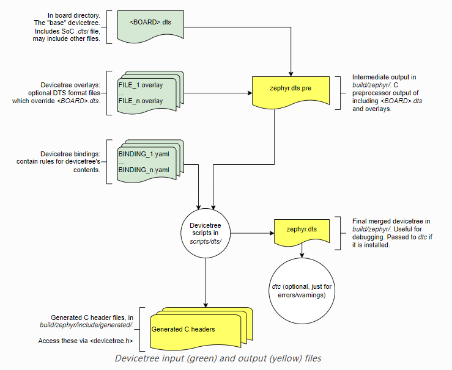
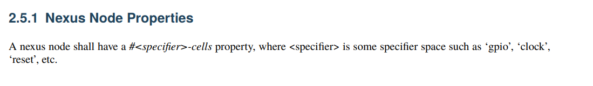

# Devicetree

刚开始接触设备树肯定会有一些人比较反感，比较反对。这里我来讲一个本质的东西，在zephyr里面，设备树你可以就理解为宏定义，像我们写bsp驱动或者代码的时候，经常要把波特率，引脚配置啥的搞成宏定义方便大家来看，而不是光秃秃的数字。设备树本质上也就是产生这些宏定义。刚开始可以这样来理解，不过后面理解深刻了之后，会有更多的解读。

所有产生的宏都在文件build\zephyr\include\generated\devicetree_generated.h 里面

这是这里设备树像C语言一样，有个自己独特的语法。当然这个语法肯定比C语言要简单的太多太多。只要简简单单的学习一小会就能学会。

设备树本质上就是将这些宏定义抽象的更方便理解，更方便编辑。

既然它有语法，那它肯定有标准的spec。

它的标准的spec在下面的链接里，非常重要，而且linux和zephyr都是公用这一套标准。大家可以自行查阅

https://github.com/devicetree-org/devicetree-specification/releases/download/v0.4/devicetree-specification-v0.4.pdf

https://github.com/devicetree-org/devicetree-specification

## 简介

devicetree是比较重要的部分。还有个Kconfig部分，

两者差别可以记住下面的一句话：

- devicetree是处理硬件差异的部分
- Kconfig是用来处理软件配置部分

只要加入Kconfig，代表你的固件需要变大，要加入某个代码，比如UART。加载一些.c文件，

但是，对于资源有限设备，这套机制可能过于庞大。因此，Zephyr采用了一种builtin的方式来使用设备树文件，其过程如下：

首先我们看到，有两种格式的文件作为输入，其中一种叫做Devicetree源文件，这些文件可以理解为设备树文件本身；第二种是Devicetree binding文件，这些文件负责描述设备树文件中的内容，包括数据类型等。

随后，构建系统会将他们解析处理为C头文件，这里还有一个比较重要的文件，叫做devicetree.h，里面定义了一些工具宏，辅助我们获取设备树节点信息，这样一来，所有包含了devicetree.h的源文件，都可以借助这些宏来访问设备树信息，后面会举例说明。


zephyr只支持最基础、最标准的硬件驱动，不支持各个厂商的硬件特性。


Kconfig和dts看起来是相辅相成的。

对于driver 需要Kconfig来加入编译，同时，Kconfig也有对dts的依赖关系，需要先写好devicetree才能使能driver。

```
config NRFX_SPI
	bool

config NRFX_SPI0
	bool "SPI0 driver instance"
	depends on $(dt_nodelabel_has_compat,spi0,$(DT_COMPAT_NORDIC_NRF_SPI))
	select NRFX_SPI
```

例如，考虑一个包含带有 2 个 UART 或串行端口的 SoC 的板， 实例。

- 主板具有此 UART**硬件**这一事实是通过两个 UART 来描述的 设备树中的节点。它们提供 UART 类型（通过 `compatible` 属性）和某些设置，例如硬件的地址范围 内存中的外设寄存器（通过 `reg` 属性）。
- 此外，UART **启动时配置**还描述为 设备树。这可能包括 RX IRQ 线等配置 优先级和UART波特率。这些可以在运行时修改，但是 它们的启动时配置在 devicetree 中进行了描述。
- 是否在构建中包含**对 UART 的软件支持** 通过 Kconfig 控制。不需要使用 UART 的应用程序可以 使用 Kconfig 从构建中删除驱动程序源代码，即使 板的设备树仍然包含 UART 节点。


参考API: https://docs.zephyrproject.org/latest/build/dts/index.html#devicetree-reference


## 语法

我们类比于C语言， 设备树有下面的语法

- dts后缀的类似于C语言的.c类型的文件，是实现主体，dtsi的文件类似于C语言的头文件，定义一些通用的，可以共用的设备树。
- 每个节点都要有父亲节点，除了根节点，
- /* */ 注释是可以的，**但是# 不是注释，切记**。
- 基本单元是node， 每个节点后面都有`;` 和C语言很像。

设备树的标准通配码:   节点格式定义：

```
[label:] node-name[@unit-address] {
    [properties definitions]
    [child nodes]
};
```

我们来举个简单的例子

```
led0: led_0 {
    gpios = <&gpio0 13 GPIO_ACTIVE_LOW>;
    label = "Green LED 0";
};
```

- label: led0, 这个是一个标号， 代码中可以通过这个标号可以索引到这个节点`#define LED0_NODE DT_ALIAS(led0)`, 这个label可以被后面的节点用`&` 来索引到，别名，label后面肯定跟着一个冒号`:`  标号是唯一的，不能重名
- node-name: led_0   节点正式名称，根节点名称必须是`/`   节点名称可以重名。
- @unit-address: @842800 这个一般是寄存器地址
- 下面都是一些键值对，是属性
- 接着是子节点。

```
gpio1: gpio@842800 {
	compatible = "nordic,nrf-gpio";
	gpio-controller;
	reg = <0x842800 0x300>;
	#gpio-cells = <2>;
	ngpios = <16>;
	status = "disabled";
	port = <1>;
};

uart0: uart@8000 {
	compatible = "nordic,nrf-uarte";
	reg = <0x8000 0x1000>;
	interrupts = <8 NRF_DEFAULT_IRQ_PRIORITY>;
	status = "disabled";
};

uart1: uart@9000 {
	compatible = "nordic,nrf-uarte";
	reg = <0x9000 0x1000>;
	interrupts = <9 NRF_DEFAULT_IRQ_PRIORITY>;
	status = "disabled";
};
```

## overlay

一般情况下写app的，不会改动到devicetree，只需要知道如何使用即可。
特殊情况下，如果要临时添加或者修改的话，可以用overlay的方式来进行修改，可以修改很多值，这个也是和宏不同的地方。



所有和devicetree相关的:

- sources (`.dts`)
- includes (`.dtsi`)
- overlays (`.overlay`)
- bindings (`.yaml`)

相关文件

```
boards/<ARCH>/<BOARD>/<BOARD>.dts
dts/common/skeleton.dtsi
dts/<ARCH>/.../<SOC>.dtsi
dts/bindings/.../binding.yaml
```

## 节点名字node-name

1-31 个字符，以小写字母或者大写字母开始，


下面是个例子

root根节点没有名字和地址，就是叫/，其他节点名字都不能叫这个。


这里节点名字可以重名，但是可以看到和后面的地址连在一起，整个字段就不会重复，也就是其实两个加起来是独一无二的。

### 节点名字推荐

节点名字尽量不要乱起，能体现功能的，可以在下面的列表中寻找，基本能匹配的就直接使用。如果能在下面的列表找到匹配的，尽量用匹配的 。


• adc
• accelerometer
• air-pollution-sensor
• atm
• audio-codec
• audio-controller
• backlight
• bluetooth
• bus
• cache-controller
• camera
• can
• charger
• clock
• clock-controller
• co2-sensor
• compact-flash
• cpu
• cpus
• crypto
• disk
• display
• dma-controller
• dsi
• dsp
• eeprom
• efuse
• endpoint
• ethernet
• ethernet-phy
• fdc
• flash
• gnss
• gpio
• gpu
• gyrometer
• hdmi
• hwlock
• i2c
• i2c-mux
• ide
• interrupt-controller

• iommu
• isa
• keyboard
• key
• keys
• lcd-controller
• led
• leds
• led-controller
• light-sensor
• lora
• magnetometer
• mailbox
• mdio
• memory
• memory-controller
• mmc
• mmc-slot
• mouse
• nand-controller
• nvram
• oscillator
• parallel
• pc-card
• pci
• pcie
• phy
• pinctrl
• pmic
• pmu
• port
• ports
• power-monitor
• pwm
• regulator
• reset-controller
• rng
• rtc
• sata
• scsi
• serial
• sound
• spi
• spmi
• sram-controller
• ssi-controller
• syscon
• temperature-sensor
• timer
• touchscreen
• tpm
• usb
• usb-hub
• usb-phy
• vibrator
• video-codec
• vme
• watchdog
• wifi

### path name

节点path有点类似于路径，这个可以索引到具体某一个节点，比如上面那个节点

/cpus/cpu@1  这个就是索引到对应的节点。这个路径要是唯一的。


## 节点Node

节点分为aliase 别名节点，memory内存节点，chosen节点，cpus节点

### 根节点

一个/cpus 节点

至少一个/meomory节点


/root 节点属性


#address-cells

代表子节点中reg的地址属性占几个uint32大小

用一个uint_t 32的数字代表 根节点中子节点的reg属性的地址

#size-cells

用一个uint_t32 的数字代表根节点中子节点的reg属性的大小

model: 唯一的板子标识，通常是"制造商, model"

compatible： 兼容模型

其他是可选的，zephyr中未用到。


### aliases节点

这个是给节点取一些别名的


### memory节点


### chosen 节点

描述参数要用到的值


#### zephyr  chosen 节点

下表记录了一些常用的特定于 Zephyr 的选定节点。

有时，所选节点的标签属性将用于设置 Kconfig 选项的默认值，该选项又配置特定于硬件的设备。这通常是为了向后兼容，以防 Kconfig 选项早于 Zephyr 中的 devicetree 支持。其他情况下，没有Kconfig选项，源码中直接使用devicetree节点来选择设备。


| Property                  | Purpose                                                      |
| ------------------------- | ------------------------------------------------------------ |
| zephyr,bt-c2h-uart        | Selects the UART used for host communication in the [Bluetooth: HCI UART](https://docs.zephyrproject.org/latest/samples/bluetooth/hci_uart/README.html#bluetooth-hci-uart-sample) |
| zephyr,bt-mon-uart        | Sets UART device used for the Bluetooth monitor logging      |
| zephyr,bt-uart            | Sets UART device used by Bluetooth                           |
| zephyr,canbus             | Sets the default CAN controller                              |
| zephyr,ccm                | Core-Coupled Memory node on some STM32 SoCs                  |
| zephyr,code-partition     | Flash partition that the Zephyr image’s text section should be linked into |
| zephyr,console            | Sets UART device used by console driver                      |
| zephyr,display            | Sets the default display controller                          |
| zephyr,keyboard-scan      | Sets the default keyboard scan controller                    |
| zephyr,dtcm               | Data Tightly Coupled Memory node on some Arm SoCs            |
| zephyr,entropy            | A device which can be used as a system-wide entropy source   |
| zephyr,flash              | A node whose `reg` is sometimes used to set the defaults for [`CONFIG_FLASH_BASE_ADDRESS`](https://docs.zephyrproject.org/latest/kconfig.html#CONFIG_FLASH_BASE_ADDRESS) and [`CONFIG_FLASH_SIZE`](https://docs.zephyrproject.org/latest/kconfig.html#CONFIG_FLASH_SIZE) |
| zephyr,flash-controller   | The node corresponding to the flash controller device for the `zephyr,flash` node |
| zephyr,gdbstub-uart       | Sets UART device used by the [GDB stub](https://docs.zephyrproject.org/latest/services/debugging/gdbstub.html#gdbstub) subsystem |
| zephyr,ieee802154         | Used by the networking subsystem to set the IEEE 802.15.4 device |
| zephyr,ipc                | Used by the OpenAMP subsystem to specify the inter-process communication (IPC) device |
| zephyr,ipc_shm            | A node whose `reg` is used by the OpenAMP subsystem to determine the base address and size of the shared memory (SHM) usable for interprocess-communication (IPC) |
| zephyr,itcm               | Instruction Tightly Coupled Memory node on some Arm SoCs     |
| zephyr,ocm                | On-chip memory node on Xilinx Zynq-7000 and ZynqMP SoCs      |
| zephyr,osdp-uart          | Sets UART device used by OSDP subsystem                      |
| zephyr,ot-uart            | Used by the OpenThread to specify UART device for Spinel protocol |
| zephyr,pcie-controller    | The node corresponding to the PCIe Controller                |
| zephyr,ppp-uart           | Sets UART device used by PPP                                 |
| zephyr,settings-partition | Fixed partition node. If defined this selects the partition used by the NVS and FCB settings backends. |
| zephyr,shell-uart         | Sets UART device used by serial shell backend                |
| zephyr,sram               | A node whose `reg` sets the base address and size of SRAM memory available to the Zephyr image, used during linking |
| zephyr,tracing-uart       | Sets UART device used by tracing subsystem                   |
| zephyr,uart-mcumgr        | UART used for [Device Management](https://docs.zephyrproject.org/latest/services/device_mgmt/index.html#device-mgmt) |
| zephyr,uart-pipe          | Sets UART device used by serial pipe driver                  |
| zephyr,usb-device         | USB device node. If defined and has a `vbus-gpios` property, these will be used by the USB subsystem to enable/disable VBUS |

### CPUS 节点

所有的设备树都需要一个CPU节点，


## 属性property

属性名字也是1-31个字节，


非标的属性尽量用独一无二的字符串。像下面这样。

fsl,channel-fifo-len
ibm,ppc-interrupt-server#s
linux,network-index

### 属性值


这里 

- 32bit数据， 0x11223344

- 64bit数据， <0x11223344 0x55667788>

- string, "hello"

- phandle,  这个比较重要， 这里可以引用其他的节点， &node

- <prop-encoded-array> 这个就是特殊的属性值，由其他地方属性定义

- stringlist, 多组字符串 ，   例如  “hello", "world"

  属性值有以下类型

  | Property type | How to write                                                 | Example                                                      |
  | ------------- | ------------------------------------------------------------ | ------------------------------------------------------------ |
  | string        | Double quoted                                                | `a-string = "hello, world!";`                                |
  | int           | between angle brackets (`<` and `>`)                         | `an-int = <1>;`                                              |
  | boolean       | for `true`, with no value (for `false`, use `/delete-property/`) | `my-true-boolean;`                                           |
  | array         | between angle brackets (`<` and `>`), separated by spaces    | `foo = <0xdeadbeef 1234 0>;`                                 |
  | uint8-array   | in hexadecimal *without* leading `0x`, between square brackets (`[` and `]`). | `a-byte-array = [00 01 ab];`                                 |
  | string-array  | separated by commas                                          | `a-string-array = "string one", "string two", "string three";` |
  | phandle       | between angle brackets (`<` and `>`)                         | `a-phandle = <&mynode>;`                                     |
  | phandles      | between angle brackets (`<` and `>`), separated by spaces    | `some-phandles = <&mynode0 &mynode1 &mynode2>;`              |
  | phandle-array | between angle brackets (`<` and `>`), separated by spaces    | `a-phandle-array = <&mynode0 1 2>, <&mynode1 3 4>;`          |


### 标准属性值

## 标准属性

### compatible

这个属性是用来匹配设备和驱动的唯一标识，这个是string list

用来匹配对应的driver驱动，优先级从左到右，

推荐的格式是 `manufacturer,model` , 前面是制造商的名字，后面是model名字，不要用下划线

例子：

compatible = "fsl,mpc8641", "ns16550";

先匹配前面的`mpc8641` 如果找不到再匹配`ns16550`

### model

模型

这个模型特指厂商某一个模型，推荐格式 `manufacturer,model` , 

例子：

model = "fsl,MPC8349EMITX";

**这个和campatible有什么差别呢？**

**model有点像告诉别人这个模型叫什么名字，**

**compatible 类似于告诉别人这个模型和哪些是兼容的，是多选的。**


### phandle

定义一个唯一的标识符为节点，其他节点可以用这个phandle的值连接到这个属性

phandle 可以指定一个独一无二的数值来供其他的来引用。

```
pic@10000000 {
    phandle = <1>;
    interrupt-controller;
    reg = <0x10000000 0x100>;
}
```

其他地方可以通过这样的方式来引用：

```
another-device-node {
    interrupt-parent = <1>;
};
```

相当于一次地址引用。这个慎用

### status

这个比较关键。不过也比较简单，就代表这个模块是否使能，常见值"okey"

- "disable" 代表关闭这个模型
- “okey"  代表这个device可以操作

其他值暂且不需要知道。

具体的可以参考下面的内容。


### #address-cells 和#size-cells

`#address-cells` 和`#size-cells` 定义了该节点子节点的reg属性的大小，


比如这个节点，表示的就是子节点serial里面的reg节点，第一个字节代表地址，第二个字节代表大小或者长度

后面的address 的1代表0x4600 占一个单元， size-cells 的1代表0x100占一个单元， （因为有时候64bit的可能会比较大会占两个单元）

通常一个单元最大是32bit，

64bit可以参考下面的图示


### reg

reg，根据上面的`address-cells` 和`size-cells`来读取，通常是一个地址位和一个大小位


### ranges

ranges相当于子节点有个偏移量，

通常是3个元素，

- 子bus的地址偏移
- 父bus的地址
- 长度

(child-bus-address, parent-busaddress, length)


这个代表serial这个子节点在父节点中实际上需要做一个偏移，

real adrress = serialaddress+ 子节点偏移(ranges 的0) + 父节点soc的偏移0xe0000000

就是(0x4600+0)+0xe0000000,   最后一个代表的是地址取址范围即长度。

### 特殊属性



例如

#gpio-cells

#clock-cells

#reset-cells

这些都是特殊节点，也是代表子节点中相关的占位符

####  `<specifier>-map-mask`

`<specifier>-map-pass-thru`


mask 和pass-thru都是互补的

## 节点标识符[¶](https://docs.zephyrproject.org/latest/build/dts/api-usage.html#node-identifiers)

要获取有关特定设备树节点的信息，您需要它的*节点标识符。*这只是一个引用节点的 C 宏。

以下是获取节点标识符的主要方法：

- 按路径

  与设备树中节点的完整路径一起使用[`DT_PATH()`](https://docs.zephyrproject.org/latest/build/dts/api/api.html#c.DT_PATH)，从根节点开始。如果您碰巧知道您正在寻找的确切节点，这非常有用。

- 按节点标签

  用于从[节点标签](https://docs.zephyrproject.org/latest/build/dts/intro-syntax-structure.html#dt-node-labels)[`DT_NODELABEL()`](https://docs.zephyrproject.org/latest/build/dts/api/api.html#c.DT_NODELABEL)获取节点标识符。节点标签通常由 SoC 文件提供，以给出与 SoC 数据表匹配的节点名称，例如、 等。`.dtsi``i2c1``spi2`

- 按别名

  用于[`DT_ALIAS()`](https://docs.zephyrproject.org/latest/build/dts/api/api.html#c.DT_ALIAS)获取特殊节点属性的节点标识符`/aliases`。[有时](https://docs.zephyrproject.org/latest/samples/basic/blinky/README.html#blinky-sample)，这是由 `led0`需要引用特定类型的*某些*设备（“主板的用户 LED”）但不关心使用哪一个的应用程序（例如使用别名的眨眼）来完成的。

- 按实例编号

  这主要由设备驱动程序完成，因为实例号是一种基于匹配兼容来引用各个节点的方法。使用 获取这些 [`DT_INST()`](https://docs.zephyrproject.org/latest/build/dts/api/api.html#c.DT_INST)，但要小心这样做。见下文。

- 按所选节点

  用于[`DT_CHOSEN()`](https://docs.zephyrproject.org/latest/build/dts/api/api.html#c.DT_CHOSEN)获取节点属性的节点标识符`/chosen`。

- 由家长/孩子

  使用[`DT_PARENT()`](https://docs.zephyrproject.org/latest/build/dts/api/api.html#c.DT_PARENT)和[`DT_CHILD()`](https://docs.zephyrproject.org/latest/build/dts/api/api.html#c.DT_CHILD)获取父节点或子节点的节点标识符，从已有的节点标识符开始。


```
/dts-v1/;

/ {

	aliases {
		sensor-controller = &i2c1;
	};

	soc {
		i2c1: i2c@40002000 {
			compatible = "vnd,soc-i2c";
			label = "I2C_1";
			reg = <0x40002000 0x1000>;
			status = "okay";
			clock-frequency = < 100000 >;
		};
	};
};
```

以下是获取节点的节点标识符的几种方法`i2c@40002000`：

- `DT_PATH(soc, i2c_40002000)`
- `DT_NODELABEL(i2c1)`
- `DT_ALIAS(sensor_controller)`
- `DT_INST(x, vnd_soc_i2c)`对于一些未知的号码`x`。[`DT_INST()`](https://docs.zephyrproject.org/latest/build/dts/api/api.html#c.DT_INST)有关详细信息，请参阅 文档。


每一个驱动driver里面都在头部需要注意这个宏

```
#define DT_DRV_COMPAT openisa_rv32m1_gpio
```

这个宏定义了compatible 相关的devicetree

所以下面它可以直接用DT_DRV_INST(inst) 来直接索引到对应的devicetree

\#define DT_DRV_INST(inst) DT_INST(inst, DT_DRV_COMPAT)

## 常用API

https://docs.zephyrproject.org/latest/build/dts/api-usage.html

代码中常见API都放在`devicetree.h` 文件中，DT_开头的宏都是devictree相关的

## 其他API

以下是一些其他可用 API 的指针。

- [`DT_CHOSEN()`](https://docs.zephyrproject.org/latest/build/dts/api/api.html#c.DT_CHOSEN), : 特殊节点[`DT_HAS_CHOSEN()`](https://docs.zephyrproject.org/latest/build/dts/api/api.html#c.DT_HAS_CHOSEN)的属性`/chosen`
- [`DT_HAS_COMPAT_STATUS_OKAY()`](https://docs.zephyrproject.org/latest/build/dts/api/api.html#c.DT_HAS_COMPAT_STATUS_OKAY), ：与属性[`DT_NODE_HAS_COMPAT()`](https://docs.zephyrproject.org/latest/build/dts/api/api.html#c.DT_NODE_HAS_COMPAT)相关的全局和节点特定测试`compatible`
- [`DT_BUS()`](https://docs.zephyrproject.org/latest/build/dts/api/api.html#c.DT_BUS)：获取节点的总线控制器（如果有）
- [`DT_ENUM_IDX()`](https://docs.zephyrproject.org/latest/build/dts/api/api.html#c.DT_ENUM_IDX)：对于其值位于固定选项列表中的属性
- [固定闪存分区](https://docs.zephyrproject.org/latest/build/dts/api/api.html#devicetree-flash-api)：用于管理固定闪存分区的 API。另请参阅[Flash 地图](https://docs.zephyrproject.org/latest/services/storage/flash_map/flash_map.html#flash-map-api)，它将其包装在更加用户友好的 API 中。

## driver如何使用

驱动中注意下面这个宏，很重要，用来指定当前driver是用的那个devicetree，和compatible息息相关

```
#define DT_DRV_COMPAT nordic_nrf_gpio
```


```
#include <zephyr/devicetree.h>

#define DT_DRV_COMPAT my_driver_compat

/* This is same thing as DT_INST(0, my_driver_compat): */
DT_DRV_INST(0)

/*
 * This is the same thing as
 * DT_PROP(DT_INST(0, my_driver_compat), clock_frequency)
 */
DT_INST_PROP(0, clock_frequency)
```


```
serial@40001000 {
        compatible = "vnd,serial";
        status = "okay";
        current-speed = <115200>;
};
```


```
#define DT_DRV_COMPAT vnd_serial
DT_DRV_INST(0)                  // node identifier for serial@40001000
DT_INST_PROP(0, current_speed)  // 115200
```


```
&i2c0 {
    sensor0: sensor@0 {
        compatible = "vnd,some-sensor";
        status = "okay";
        reg = <0>;
        foo = <1>;
        bar = <2>;
    };

    sensor1: sensor@1 {
        compatible = "vnd,some-sensor";
        status = "okay";
        reg = <1>;
        foo = <2>;
    };

    sensor2: sensor@2 {
        compatible = "vnd,some-sensor";
        status = "disabled";
        reg = <2>;
        baz = <1>;
    };
};
```


```
#define DT_DRV_COMPAT vnd_some_sensor

DT_ANY_INST_HAS_PROP_STATUS_OKAY(foo) // 1
DT_ANY_INST_HAS_PROP_STATUS_OKAY(bar) // 1
DT_ANY_INST_HAS_PROP_STATUS_OKAY(baz) // 0
```


## Binding

https://docs.zephyrproject.org/latest/build/dts/bindings.html#dt-bindings

binding代表一些节点的写法规则

这个所有的代码都放在`dts\bindings`

而且这里的代码代表属性中的一些含义：

比如


这里的含义就是reg必须要有，clocks也必须要有，

#gpio-cells 是2 代表使用这个节点，必须带两个参数：

两个参数含义分别是`pin` `flags`


所以这里用到gpio的地方，都需要两个参数


绑定索引

https://docs.zephyrproject.org/latest/build/dts/api/bindings.html#devicetree-binding-index

```
/dts-v1/;

/ {
        a-node {
                subnode_nodelabel: a-sub-node {
                        foo = <3>;
                };
        };
};
```

###  zephyr

- Zephyr 的 devicetree 源解析器[dtlib.py](https://docs.zephyrproject.org/latest/build/dts/intro-input-output.html#dt-scripts)[与dtc](https://git.kernel.org/pub/scm/utils/dtc/dtc.git/about/)等其他工具在两个方向上都源兼容： `dtlib.py`可以解析`dtc`输出，并且`dtc`可以解析 `dtlib.py`输出。
- Zephyr 的“扩展 dtlib”库`edtlib.py`不应包含 Zephyr 特定的功能。其目的是为中断和总线等常见元素提供设备树的更高级别视图。

### 剩余工作示例

- Zephyr 有自定义的[Devicetree 绑定](https://docs.zephyrproject.org/latest/build/dts/bindings.html#dt-bindings)语言*语法*。虽然 Linux 的 dtschema 尚未满足 Zephyr 的需求，但我们应该尝试遵循它能够在 Zephyr 自己的绑定中表示的内容。
- 由于绑定语言不灵活，Zephyr 无法支持 Linux 支持的全套绑定。
- Zephyr 和 Linux 之间的 Devicetree 源代码共享尚未完成。

### 给 Linux 开发者的注意事项

熟悉 devicetree 的 Linux 开发人员应该注意，这里描述的 API 与 Linux 上使用 devicetree 的方式有很大不同。

Linux 内核不会生成包含所有 devicetree 数据的 C 标头，然后在宏 API 后面进行抽象，而是以二进制形式读取 devicetree 数据结构。二进制表示在运行时解析，例如加载和初始化设备驱动程序。

Zephyr 不会以这种方式工作，因为 devicetree 二进制文件和相关处理代码的大小太大，无法轻松适应 Zephyr 支持的相对受限的设备。

## 中断和中断MAP

https://www.cnblogs.com/xiaojiang1025/p/6131381.html

- “Interrupt Generating Devices”，中断发生设备，这种设备可以发生中断。
- “Interrupt Controllers”，中断控制器，处理中断。
- “Interrupt Nexus”，中断联结，路由中断给中断控制器。


### interrupts


### interrupts-paranet

要说**interrupt-parent**，就得首先讲讲Linux设备管理中对中断的设计思路演变。随着linux kernel的发展，在内核中将interrupt controller抽象成**irqchip**这个概念越来越流行，甚至GPIO controller也可以被看出一个interrupt controller chip，这样，系统中至少有两个中断控制器了，另外，在硬件上，随着系统复杂度加大，外设中断数据增加，实际上系统可以需要多个中断控制器进行级联，形成事实上的硬件中断处理结构：


在这种趋势下，内核中原本的中断源直接到中断号的方式已经很难继续发展了，为了解决这些问题，linux kernel的大牛们就创造了**irq domain**(中断域)这个概念。domain在内核中有很多，除了irqdomain，还有power domain，clock domain等等，所谓domain，就是领域，范围的意思，也就是说，任何的定义出了这个范围就没有意义了。如上所述，系统中所有的interrupt controller会形成树状结构，对于每个interrupt controller都可以连接若干个外设的中断请求（interrupt source，中断源），interrupt controller会对连接其上的interrupt source（根据其在Interrupt controller中物理特性）进行编号（也就是HW interrupt ID了）。有了**irq domain**这个概念之后，这个编号仅仅限制在本interrupt controller范围内，有了这样的设计，CPU(Linux 内核)就可以根据级联的规则一级一级的找到想要访问的中断。当然，通常我们关心的只是内核中的中断号，具体这个中断号是怎么找到相应的中断源的，我们作为程序员往往不需要关心，除了在写设备树的时候，设备树就是要描述嵌入式软件开发中涉及的所有硬件信息，所以，设备树就需要准确的描述硬件上处理中断的这种树状结构，如此，就有了我们的**interrupt-parant**这样的概念：用来连接这样的树状结构的上下级，用于表示这个中断归属于哪个interrupt controller，比如，一个接在GPIO上的按键，它的组织形式就是：

### interrupts-extended


### `interrupts-cells`

#interrupts-cells 值如果是2 ，代表这个节点的子节点的interrups里面的数值是两个元素


同时在`dts/bindings/interrupt-controller` 里面会代表这个interrupts是哪些元素，通常为`irq` 和`priority`

也有的只有`irq`


## 参考

https://www.devicetree.org/specifications/

spec

https://github.com/devicetree-org/devicetree-specification/releases/download/v0.4/devicetree-specification-v0.4.pdf

https://github.com/devicetree-org/devicetree-specification

博客参考：

https://blog.csdn.net/pwl999/article/details/79631434

https://www.nxpic.org.cn/module/forum/thread-623028-1-1.html

## 参考：

http://www.wowotech.net/linux_kenrel/dt_basic_concept.html

