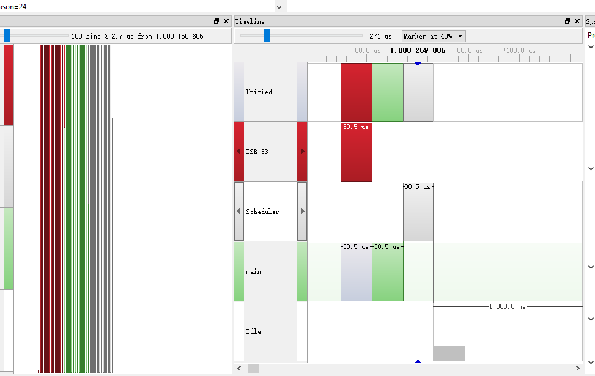
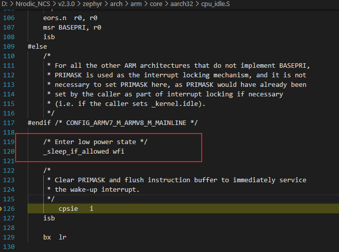
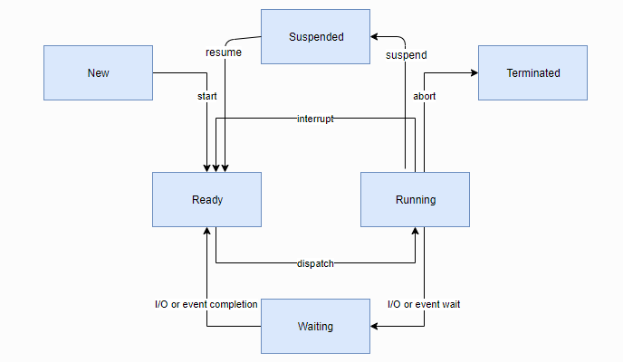
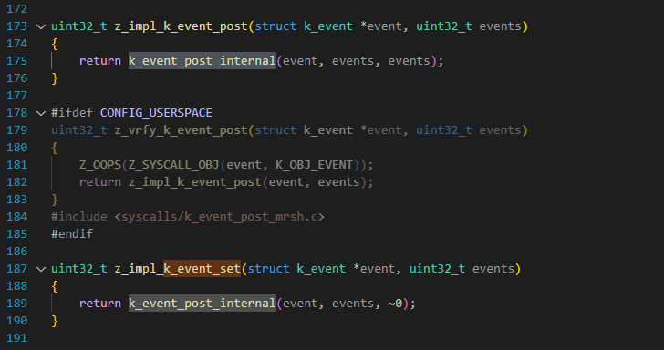

#


KERNEL sleep 在nordic平台上用的是RTC定时器。






发现的前提规则

- 内核的API都是以k_打头的。
- 以z_打头的大部分是给内核里面使用的内部的。


这里有很多API，有很多API在其他的RTOS上都有，都有的部分我会一笔带过，如果有不一样的特性我会简单举个例子帮助大家理解，如果大家有疑问，或者哪个API不熟悉可以随时打断提问。或者对某个API用法不清楚的话。


sample 的目的是为了方便演示和理解一些API的用法

test 的目的是twister系统跑的测试用例，用于测试特性的。


# Thread线程

系统线程有两个，main主线程和idle线程。

线程创建，调度，删除，线程指令执行

## 线程




```
 west build -b qemu_cortex_a53 samples/synchronization
 west build -t run
```

samples/synchronization  中的main.c换成如下

```
#include <zephyr/kernel.h>
#include <zephyr/sys/printk.h>
void threadA(void *dummy1, void *dummy2, void *dummy3)
{
        while(1)
        {
                printk("hello world\r\n");
                k_busy_wait(1000000);
                k_msleep(5000);
        }
}
#define STACKSIZE 1024
K_THREAD_STACK_DEFINE(threadA_stack_area, STACKSIZE);
int main(void)
{
#define PRIORITY 7
        static struct k_thread threadA_data;
        k_thread_create(&threadA_data, threadA_stack_area,
                        K_THREAD_STACK_SIZEOF(threadA_stack_area),
                        threadA, NULL, NULL, NULL,
                        PRIORITY, 0, K_FOREVER);
        k_thread_name_set(&threadA_data, "thread_a");
        k_thread_start(&threadA_data);
        return 0;
}
//K_KERNEL_THREAD_DEFINE(thread_a, 1024, threadA, NULL, NULL, NULL, 7, 0 , 5000);
```

tips：


线程创建，stack创建有些特别，

还有参数有些特别，线程会有3个参数，还有个最后一个参数K_FOREVER，代表这个线程多长时间会创建。

K_FOREVER代表永远不会启动线程，后面需要调k_thread_start 来启动线程。

K_NO_WAIT表示不等，直接运行线程

创建线程还有个方法，这个代码比较精简，参数也是类似的。

```
K_KERNEL_THREAD_DEFINE(thread_a, 1024, threadA, NULL, NULL, NULL, 7, 0 , 5000);
```

这里有个option参数

https://docs.zephyrproject.org/latest/kernel/services/threads/index.html#thread-options

这些参数不常用

```

Parameters:
        new_thread – Pointer to uninitialized struct k_thread
        stack – Pointer to the stack space.
        stack_size – Stack size in bytes.
        entry – Thread entry function.
        p1 – 1st entry point parameter.
        p2 – 2nd entry point parameter.
        p3 – 3rd entry point parameter.
        prio – Thread priority.
        options – Thread options.
        delay – Scheduling delay, or K_NO_WAIT (for no delay).
Returns:
    ID of new thread.
```

K_KERNEL_THREAD_DEFINE 这里的参数基本和k_thread_create相同，特别注意的是，最后一个参数，是以ms为单位的，k_thread_create是以tick为单位的，不太一样，而第一个参数就是名字，像栈会根据大小自动帮你初始化。


k_busy_wait(uint32_t usec_to_wait)


```
#define MY_STACK_SIZE 500
#define MY_PRIORITY 5

extern void my_entry_point(void *, void *, void *);

K_THREAD_STACK_DEFINE(my_stack_area, MY_STACK_SIZE);
struct k_thread my_thread_data;

k_tid_t my_tid = k_thread_create(&my_thread_data, my_stack_area,
                                 K_THREAD_STACK_SIZEOF(my_stack_area),
                                 my_entry_point,
                                 NULL, NULL, NULL,
                                 MY_PRIORITY, 0, K_NO_WAIT);
```

或者

```
#define MY_STACK_SIZE 500
#define MY_PRIORITY 5

extern void my_entry_point(void *, void *, void *);

K_THREAD_DEFINE(my_tid, MY_STACK_SIZE,
                my_entry_point, NULL, NULL, NULL,
                MY_PRIORITY, 0, 0);
```


int k_thread_join(struct k_thread *thread, k_timeout_t timeout)

sleep当前线程，等待参数中线程结束，timeout是当前线程睡眠时间。


### 抢占优先级

### 优先级

int k_thread_priority_get(k_tid_t thread)

void k_thread_priority_set(k_tid_t thread, int prio)


### 线程创建
```
k_tid_t k_thread_create(struct k_thread *new_thread,
				  k_thread_stack_t *stack,
				  size_t stack_size,
				  k_thread_entry_t entry,
				  void *p1, void *p2, void *p3,
				  int prio, uint32_t options, k_timeout_t delay);				  
```

这里的栈 ，我有试过，可以采用数组的形式，就是没法判断栈溢出等问题。就是这个stack并没有在内存管理单元里面。

```
 * - K_THREAD_STACK_DEFINE() - For stacks that may support either user or
 *   supervisor threads.
 * - K_KERNEL_STACK_DEFINE() - For stacks that may support supervisor
 *   threads only. These stacks use less memory if CONFIG_USERSPACE is
 *   enabled.
```


### 线程挂起和恢复

void k_thread_suspend(k_tid_t thread)

void k_thread_resume(k_tid_t thread)

停止执行

void k_thread_abort(k_tid_t thread)

该线程唤醒多久了, 从创建开始算起，累计的ticket

k_ticks_t k_thread_timeout_expires_ticks(const struct k_thread *t)

还有多久唤醒

k_ticks_t k_thread_timeout_remaining_ticks(const struct k_thread *t)

获取当前线程

k_tid_t z_current_get(void);

k_tid_t k_current_get(void);

是否可以挂起

bool k_can_yield(void);

当前线程挂起

void k_yield(void)

唤醒线程

 void k_wakeup(k_tid_t thread)

睡眠

int32_t k_sleep(k_timeout_t timeout);

int32_t k_msleep(int32_t ms);

int32_t k_usleep(int32_t us);

等待us，注意这里相当于一个while循环，让程序一直执行，并不会触发调度。

void k_busy_wait(uint32_t usec_to_wait);

设置最后时间

void k_thread_deadline_set(k_tid_t thread, int deadline)

### 调度

开启时间片，prio是最高线程优先级，比这个优先级更高的，不适用时间片。

 void k_sched_time_slice_set(int32_t slice, int prio)

Parameters:

        slice – Maximum time slice length (in milliseconds).
    
        prio – Highest thread priority level eligible for time slicing.
  k_sched_time_slice_set(0, K_PRIO_PREEMPT(0)); 关闭


 void k_thread_time_slice_set(struct k_thread *th, int32_t slice_ticks, k_thread_timeslice_fn_t expired, void *data)

针对线程使用时间片

### 中断

bool k_is_in_isr(void);  //是否在中断中

int k_is_preempt_thread(void); //当前线程是否是可以抢占的

 k_is_pre_kernel(void)  //当前是否在调度之前。

### 锁

void k_sched_lock(void);

void k_sched_unlock(void);

### 名字

int k_thread_name_set(k_tid_t thread, const char *str);

char *k_thread_name_get(k_tid_t thread);

int k_thread_name_copy(k_tid_t thread, char *buf,size_t size);

CONFIG_THREAD_MAX_NAME_LEN

名字一般由宏CONFIG_THREAD_NAME 来控制的 ， 可以用来节省开支。

```
CONFIG_THREAD_NAME=y
CONFIG_THREAD_MAX_NAME_LEN=32
```

### 状态

const char *k_thread_state_str(k_tid_t thread_id, char *buf, size_t buf_size);

获取当前线程状态的string

”dummy", 

"pending", 

"prestart",

 "dead", 

"suspended", 

"aborting",

  "queued"

### 用户数据

It can be used as a framework  upon which to build thread-local storage.

void k_thread_custom_data_set(void *value);

void *k_thread_custom_data_get(void);

这个举个例子

```
static void customdata_entry(void *p1, void *p2, void *p3)
{
	long data = 1U;

	zassert_is_null(k_thread_custom_data_get(), NULL);
	while (1) {
		k_thread_custom_data_set((void *)data);
		/* relinquish cpu for a while */
		k_msleep(50);
		/** TESTPOINT: custom data comparison */
		zassert_equal(data, (long)k_thread_custom_data_get());
		data++;
	}
}
```

这个就是在线程TCB里面存放了一个void *  

```
	void *custom_data;
```


## workqueue

````
#define MY_STACK_SIZE 512
#define MY_PRIORITY 5

K_THREAD_STACK_DEFINE(my_stack_area, MY_STACK_SIZE);

struct k_work_q my_work_q;

k_work_queue_init(&my_work_q);

k_work_queue_start(&my_work_q, my_stack_area,
                   K_THREAD_STACK_SIZEOF(my_stack_area), MY_PRIORITY,
                   NULL);
````

执行

```
void critical_rtn(struct k_work *unused)
{
}
        struct k_work work_item;
		k_work_init(&work_item, critical_rtn);
		k_work_submit_to_queue(&offload_work_q, &work_item);
```

## SMP 需要的API

指定线程在某个CPU上运行

int k_thread_cpu_pin(k_tid_t thread, int cpu);

int k_thread_cpu_mask_clear(k_tid_t thread);

int k_thread_cpu_mask_enable_all(k_tid_t thread);

int k_thread_cpu_mask_disable(k_tid_t thread, int cpu);


# 线程间同步

## semaphore 信号量

tests\kernel\semaphore

定义信号量

```
struct k_sem my_sem;
k_sem_init(&my_sem, 0, 1);
```

或者

```
K_SEM_DEFINE(my_sem, 0, 1);
```

这里0是初始化值，1是最大值。这里可以模拟成二进制信号量。1可以设置的最大值为K_SEM_MAX_LIMIT。

给出信号量，通常由中断服务例程来给出信号量

```
void input_data_interrupt_handler(void *arg)
{
    /* notify thread that data is available */
    k_sem_give(&my_sem);

    ...
}
```

等待信号量

```
void consumer_thread(void)
{
    ...

    if (k_sem_take(&my_sem, K_MSEC(50)) != 0) {
        printk("Input data not available!");
    } else {
        /* fetch available data */
        ...
    }
    ...
}
```

这里等待50ms， 如果一直等待采用，

- K_NO_WAIT： 表示不等待
- K_FOREVER： 一直等待
- K_MSEC(50)： 50ms

k_sem_reset： 把count设置成0

k_sem_count_get: 获取count值。

### user mode对应的API

用户模式的API功能一样，命名不一样， 不过多介绍

SYS_SEM_DEFINE

sys_sem_init

sys_sem_give

sys_sem_take

sys_sem_count_get

### 建议用途

使用信号量来控制多个线程对一组资源的访问。

使用信号量来同步生产和消费线程或 ISR 之间的处理。

## mutex 互斥信号量

### 定义

```
struct k_mutex my_mutex;

k_mutex_init(&my_mutex);
```

或者

```
K_MUTEX_DEFINE(my_mutex);
```

锁互斥量

```
if (k_mutex_lock(&my_mutex, K_MSEC(100)) == 0) {
    /* mutex successfully locked */
} else {
    printf("Cannot lock XYZ display\n");
}
```

解锁互斥量

```
k_mutex_unlock(&my_mutex);
```

### 建议用途

使用互斥体提供对资源（例如物理设备）的独占访问。

## event事件

### 定义

```
struct k_event my_event;
k_event_init(&my_event);
```

或者

```
K_EVENT_DEFINE(my_event);
```


设置事件：

```
void input_available_interrupt_handler(void *arg)
{
    /* notify threads that data is available */

    k_event_set(&my_event, 0x001);

    ...
}
```

发布事件

```
void input_available_interrupt_handler(void *arg)
{
    ...

    /* notify threads that more data is available */

    k_event_post(&my_event, 0x120);

    ...
}
```




k_event_post: 相当于这次就这么多事件

k_event_set: 相当于这次触发这么多事件，但是这个事件可以叠加之前的事件。

等待事件，可以加mask

```
void consumer_thread(void)
{
    uint32_t  events;

    events = k_event_wait(&my_event, 0xFFF, false, K_MSEC(50));
    if (events == 0) {
        printk("No input devices are available!");
    } else {
        /* Access the desired input device(s) */
        ...
    }
    ...
}
```

第三个bool参数，代表是否清除之前的event。

等待所有event

```
void consumer_thread(void)
{
    uint32_t  events;

    events = k_event_wait_all(&my_event, 0x121, false, K_MSEC(50));
    if (events == 0) {
        printk("At least one input device is not available!");
    } else {
        /* Access the desired input devices */
        ...
    }
    ...
}
```

### 建议用途

使用事件来指示一组条件已经发生。

使用事件将少量数据一次传递到多个线程。

## condition variables条件变量

tests\kernel\condvar\condvar_api

可以定义任意数量的条件变量（仅受可用 RAM 的限制）。每个条件变量都由其内存地址引用。

要等待条件变为真，线程可以使用条件变量。

条件变量基本上是一个线程队列，当某些执行状态（即某些条件）不符合预期（通过等待条件）时，线程可以将自己放入该队列中。该函数 [`k_condvar_wait()`](https://docs.zephyrproject.org/latest/kernel/services/synchronization/condvar.html#c.k_condvar_wait)自动执行以下步骤；

1. 释放最后获取的互斥体。
2. 将当前线程放入条件变量队列中。

定义

```
 struct k_condvar my_condvar;
 k_condvar_init(&my_condvar);
```

或者

```
K_CONDVAR_DEFINE(my_condvar);
```

等待条件变量

```
K_MUTEX_DEFINE(mutex);
K_CONDVAR_DEFINE(condvar)

int main(void)
{
    k_mutex_lock(&mutex, K_FOREVER);

    /* block this thread until another thread signals cond. While
     * blocked, the mutex is released, then re-acquired before this
     * thread is woken up and the call returns.
     */
    k_condvar_wait(&condvar, &mutex, K_FOREVER);
    ...
    k_mutex_unlock(&mutex);
}
```

通知条件变量

```
void worker_thread(void)
{
    k_mutex_lock(&mutex, K_FOREVER);

    /*
     * Do some work and fulfill the condition
     */
    ...
    ...
    k_condvar_signal(&condvar);
    k_mutex_unlock(&mutex);
}
```

[`k_condvar_broadcast()`](https://docs.zephyrproject.org/latest/kernel/services/synchronization/condvar.html#c.k_condvar_broadcast)

这个有点像

### 建议用途

使用带有互斥体的条件变量来表示从一个线程到另一线程的状态（条件）变化。条件变量不是条件本身，也不是事件。该条件包含在周围的编程逻辑中。

互斥体本身并不是设计用作通知/同步机制的。它们旨在仅提供对共享资源的互斥访问。

这个和互斥量很接近。

他可以用来等一个条件，并且互斥的访问资源。

并且可以对多个线程进行通知和唤醒。

初看条件变量总有一点信号量的影子，Zephyr中二者主要有如下区别:

1. 信号量无法进行广播。
2. 多值信号量可以积压，没有消费者发送的信号依然被保存，而条件变量发送后没有消费者接受条件就过期了。
3. 条件变量必须搭配互斥锁使用。
4. Zephyr中信号量可以用于Poll，条件变量则不行。

## polling API轮询

轮询有点类似于posix里面的poll机制

### 定义

```
struct k_poll_event events[2] = {
    K_POLL_EVENT_STATIC_INITIALIZER(K_POLL_TYPE_SEM_AVAILABLE,
                                    K_POLL_MODE_NOTIFY_ONLY,
                                    &my_sem, 0),
    K_POLL_EVENT_STATIC_INITIALIZER(K_POLL_TYPE_FIFO_DATA_AVAILABLE,
                                    K_POLL_MODE_NOTIFY_ONLY,
                                    &my_fifo, 0),
};
```

或者

```
struct k_poll_event events[2];
void some_init(void)
{
    k_poll_event_init(&events[0],
                      K_POLL_TYPE_SEM_AVAILABLE,
                      K_POLL_MODE_NOTIFY_ONLY,
                      &my_sem);

    k_poll_event_init(&events[1],
                      K_POLL_TYPE_FIFO_DATA_AVAILABLE,
                      K_POLL_MODE_NOTIFY_ONLY,
                      &my_fifo);

    // tags are left uninitialized if unused
}
```

- K_POLL_TYPE_SIGNAL：poll event 信号
- K_POLL_TYPE_SEM_AVAILABLE: 信号量
- K_POLL_TYPE_FIFO_DATA_AVAILABLE：FIFO，实际上FIFO使用queue实现的，真正的等待条件是queue


# 数据传递

## 数据传递本质queue

kernel/queue.c

tests\kernel\queue\src\

```
struct k_queue {
	sys_sflist_t data_q;
	struct k_spinlock lock;
	_wait_q_t wait_q;

	_POLL_EVENT;

	SYS_PORT_TRACING_TRACKING_FIELD(k_queue)
};
```


创建线程thread1和thread2， thread2定时往thread1发送数据，thread1接收到数据直接打印出来。

K_QUEUE_DEFINE(name)

void k_queue_init(struct k_queue *queue)

void k_queue_cancel_wait(struct k_queue *queue)

void k_queue_append(struct k_queue *queue, void *data)

int32_t k_queue_alloc_append(struct k_queue *queue, void *data)

void k_queue_prepend(struct k_queue *queue, void *data)

int32_t k_queue_alloc_prepend(struct k_queue *queue, void *data)

void k_queue_insert(struct k_queue *queue, void *prev, void *data)

int k_queue_append_list(struct k_queue *queue, void *head, void *tail)

int k_queue_merge_slist(struct k_queue *queue, sys_slist_t *list)

void *k_queue_get(struct k_queue *queue, k_timeout_t timeout)

bool k_queue_remove(struct k_queue *queue, void *data)

bool k_queue_unique_append(struct k_queue *queue, void *data)


void k_queue_init(struct k_queue *queue)

void *k_queue_get(struct k_queue *queue, k_timeout_t timeout)

void k_queue_append(struct k_queue *queue, void *data)


queue 的本质是链表list，只需要定义头节点，后续的数据结构应该是一个全局的数据。


## 数据传递邮箱

kernel/mailbox.c

邮箱存放的是指针，所以只能是静态的或者全局的

## 数据传递FIFO/LIFO

这个FIFO 和LIFO 和queue的行为是一样的，只是链表的插入方式的不同，

```
#define k_fifo_init(fifo) \
	({ \
	SYS_PORT_TRACING_OBJ_FUNC_ENTER(k_fifo, init, fifo); \
	k_queue_init(&(fifo)->_queue); \
	SYS_PORT_TRACING_OBJ_FUNC_EXIT(k_fifo, init, fifo); \
	})
```


```
#define k_lifo_init(lifo) \
	({ \
	SYS_PORT_TRACING_OBJ_FUNC_ENTER(k_lifo, init, lifo); \
	k_queue_init(&(lifo)->_queue); \
	SYS_PORT_TRACING_OBJ_FUNC_EXIT(k_lifo, init, lifo); \
	})
```


## 数据传递 Stack

栈的数据结构是LIFO的典型应用。

void k_stack_init(struct k_stack *stack, stack_data_t *buffer, uint32_t num_entries)

int32_t k_stack_alloc_init(struct k_stack *stack, uint32_t num_entries)

int k_stack_cleanup(struct k_stack *stack)

int k_stack_push(struct k_stack *stack, stack_data_t data)

int k_stack_pop(struct k_stack *stack, stack_data_t *data, k_timeout_t timeout)

stack LIFO一样。不过它会进行拷贝数据，像线程栈一样。


## 数据传递 Message Queue

void k_msgq_init(struct k_msgq *msgq, char *buffer, size_t msg_size,

​     uint32_t max_msgs);

kernel/msg_q.c

这个是会进行数据拷贝的

## 数据传递 管道

管道有些像ringbuffer，最底层就是采用ringbuffer的逻辑，上层就是可以像管道一样，往通道里面塞数据，数据可以是个流一样的形式，比如1024个字节，然后取的时候，也可以任意取，比如取512字节。

数据需要一次拷贝


## 数据传递总结

| Object        | Bidirectional? | Data structure  | Data item size | Data Alignment | ISRs can receive? | ISRs can send? | Overrun handling             |
| ------------- | -------------- | --------------- | -------------- | -------------- | ----------------- | -------------- | ---------------------------- |
| FIFO          | No             | Queue           | Arbitrary [1]  | 4 B [2]        | Yes [3]           | Yes            | N/A                          |
| LIFO          | No             | Queue           | Arbitrary [1]  | 4 B [2]        | Yes [3]           | Yes            | N/A                          |
| Stack         | No             | Array           | Word           | Word           | Yes [3]           | Yes            | Undefined behavior           |
| Message queue | No             | Ring buffer     | Arbitrary [6]  | Power of two   | Yes [3]           | Yes            | Pend thread or return -errno |
| Mailbox       | Yes            | Queue           | Arbitrary [1]  | Arbitrary      | No                | No             | N/A                          |
| Pipe          | No             | Ring buffer [4] | Arbitrary      | Arbitrary      | Yes [5]           | Yes [5]        | Pend thread or return -      |

[1] Callers allocate space for queue overhead in the data elements themselves.

[2] Objects added with k_fifo_alloc_put() and k_lifo_alloc_put() do not have alignment constraints, but use temporary memory from the calling thread’s resource pool.

[3] ISRs can receive only when passing K_NO_WAIT as the timeout argument.

[4] Optional.

[5] ISRS can send and/or receive only when passing K_NO_WAIT as the timeout argument.

[6] Data item size must be a multiple of the data alignment.


## 链表

include\zephyr\sys\dlist.h

include\zephyr\wait_q.h

很多结构体里面经常会看到wait_q这样的结构体，

实际上这个就是链表dlist组成的。


# 内存管理

## heap

\lib\os\heap.c

以k_heap开头

void k_heap_init(struct k_heap *h, void *mem, size_t bytes)

void *k_heap_alloc(struct k_heap *h, size_t bytes, k_timeout_t timeout)

void k_heap_free(struct k_heap *h, void *mem)

void *k_heap_aligned_alloc(struct k_heap *h, size_t align, size_t bytes,

​      k_timeout_t timeout);

void *k_aligned_alloc(size_t align, size_t size)

void *k_malloc(size_t size)

void k_free(void *ptr)

nmemb:有多少个单元

size:每个单元大小。

void *k_calloc(size_t nmemb, size_t size)


```
#define K_HEAP_DEFINE(name, bytes)				\
	Z_HEAP_DEFINE_IN_SECT(name, bytes,			\
			      __noinit_named(kheap_buf_##name))
```


```
#define K_HEAP_DEFINE_NOCACHE(name, bytes)			\
	Z_HEAP_DEFINE_IN_SECT(name, bytes, __nocache)
```


用法

```
K_HEAP_DEFINE(k_heap_test, HEAP_SIZE);

static void tIsr_kheap_alloc_nowait(void *data)
{
	ARG_UNUSED(data);

	char *p = (char *)k_heap_alloc(&k_heap_test, ALLOC_SIZE_1, K_NO_WAIT);

	zassert_not_null(p, "k_heap_alloc operation failed");
	k_heap_free(&k_heap_test, p);
}
```


k_heap_init  可以指定heap在哪个buf上，这个buf可以是malloc或者全局变量

K_HEAP_DEFINE 则直接将heap定义在段section里面。


TODO: 段名是？


```
char *mem_ptr;

mem_ptr = k_malloc(200);
if (mem_ptr != NULL)) {
    memset(mem_ptr, 0, 200);
    ...
} else {
    printf("Memory not allocated");
}

char *mem_ptr;

mem_ptr = k_malloc(75);
... /* use memory block */
k_free(mem_ptr);
```


### HEAP 还可以注册回调函数来实现实时监控

```
void on_heap_alloc(uintptr_t heap_id, void *mem, size_t bytes)
{
  LOG_INF("Memory allocated at %p, size %ld", mem, bytes);
}

HEAP_LISTENER_ALLOC_DEFINE(my_listener, HEAP_ID_LIBC, on_heap_alloc);
```


## slab

# 时间管理

时间分为两种， 一种是计时时钟，一种是timer定时器

系统tick都是由

```
CONFIG_SYS_CLOCK_TICKS_PER_SEC=100
```

zephyr里面都会用一些宏尝试将一些timeout的时间转换成tick

```
#define K_NSEC(t)
#define K_USEC(t)
#define K_MSEC(ms)
#define K_SECONDS(s)
#define K_MINUTES(m)
```

所以变量k_timeout_t 为参数的地方，尽量通过上述宏来填

## Timer 定时器

创建一个example来触发定时器

int64_t k_uptime_ticks(void);


## kernel timing 内核时间

获取系统启动了多少tick

int64_t k_uptime_ticks(void);

获取系统从启动开始多少ms

static inline int64_t k_uptime_get(void)

获取系统从启动开始多少ms的低32bit

static inline uint32_t k_uptime_get_32(void)


参考资料：

 2021公众号目录

https://mp.weixin.qq.com/s/OtL0sCA9sWzZ4Eo3Jaz-QA