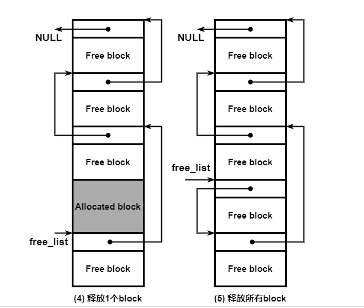

发现的前提规则

- 内核的API都是以k_打头的。
- 以z_打头的大部分是给内核里面使用的内部的。


这里有很多API，有很多API在其他的RTOS上都有，都有的部分我会一笔带过，如果有不一样的特性我会简单举个例子帮助大家理解，如果大家有疑问，或者哪个API不熟悉可以随时打断提问。或者对某个API用法不清楚的话。


sample 的目的是为了方便演示和理解一些API的用法

test 的目的是twister系统跑的测试用例，用于测试特性的。


# Thread线程

系统线程有两个，main主线程和idle线程。

线程创建，调度，删除，线程指令执行

## 线程


```
 west build -b qemu_cortex_a53 samples/synchronization
 west build -t run
```

samples/synchronization  中的main.c换成如下

```
#include <zephyr/kernel.h>
#include <zephyr/sys/printk.h>
void threadA(void *dummy1, void *dummy2, void *dummy3)
{
        while(1)
        {
                printk("hello world\r\n");
                k_busy_wait(1000000);
                k_msleep(5000);
        }
}
#define STACKSIZE 1024
K_THREAD_STACK_DEFINE(threadA_stack_area, STACKSIZE);
int main(void)
{
#define PRIORITY 7
        static struct k_thread threadA_data;
        k_thread_create(&threadA_data, threadA_stack_area,
                        K_THREAD_STACK_SIZEOF(threadA_stack_area),
                        threadA, NULL, NULL, NULL,
                        PRIORITY, 0, K_FOREVER);
        k_thread_name_set(&threadA_data, "thread_a");
        k_thread_start(&threadA_data);
        return 0;
}
//K_KERNEL_THREAD_DEFINE(thread_a, 1024, threadA, NULL, NULL, NULL, 7, 0 , 5000);
```

tips：


线程创建，stack创建有些特别，

还有参数有些特别，线程会有3个参数，还有个最后一个参数K_FOREVER，代表这个线程多长时间会创建。

K_FOREVER代表永远不会启动线程，后面需要调k_thread_start 来启动线程。

K_NO_WAIT表示不等，直接运行线程

创建线程还有个方法，这个代码比较精简，参数也是类似的。

```
K_KERNEL_THREAD_DEFINE(thread_a, 1024, threadA, NULL, NULL, NULL, 7, 0 , 5000);
```

这里有个option参数

https://docs.zephyrproject.org/latest/kernel/services/threads/index.html#thread-options

这些参数不常用

```

Parameters:
        new_thread – Pointer to uninitialized struct k_thread
        stack – Pointer to the stack space.
        stack_size – Stack size in bytes.
        entry – Thread entry function.
        p1 – 1st entry point parameter.
        p2 – 2nd entry point parameter.
        p3 – 3rd entry point parameter.
        prio – Thread priority.
        options – Thread options.
        delay – Scheduling delay, or K_NO_WAIT (for no delay).
Returns:
    ID of new thread.
```

K_KERNEL_THREAD_DEFINE 这里的参数基本和k_thread_create相同，特别注意的是，最后一个参数，是以ms为单位的，k_thread_create是以tick为单位的，不太一样，而第一个参数就是名字，像栈会根据大小自动帮你初始化。


k_busy_wait(uint32_t usec_to_wait)


```
#define MY_STACK_SIZE 500
#define MY_PRIORITY 5

extern void my_entry_point(void *, void *, void *);

K_THREAD_STACK_DEFINE(my_stack_area, MY_STACK_SIZE);
struct k_thread my_thread_data;

k_tid_t my_tid = k_thread_create(&my_thread_data, my_stack_area,
                                 K_THREAD_STACK_SIZEOF(my_stack_area),
                                 my_entry_point,
                                 NULL, NULL, NULL,
                                 MY_PRIORITY, 0, K_NO_WAIT);
```

或者

```
#define MY_STACK_SIZE 500
#define MY_PRIORITY 5

extern void my_entry_point(void *, void *, void *);

K_THREAD_DEFINE(my_tid, MY_STACK_SIZE,
                my_entry_point, NULL, NULL, NULL,
                MY_PRIORITY, 0, 0);
```


int k_thread_join(struct k_thread *thread, k_timeout_t timeout)

sleep当前线程，等待参数中线程结束，timeout是当前线程睡眠时间。


### 抢占优先级

### 优先级

int k_thread_priority_get(k_tid_t thread)

void k_thread_priority_set(k_tid_t thread, int prio)


### 线程创建
```
k_tid_t k_thread_create(struct k_thread *new_thread,
				  k_thread_stack_t *stack,
				  size_t stack_size,
				  k_thread_entry_t entry,
				  void *p1, void *p2, void *p3,
				  int prio, uint32_t options, k_timeout_t delay);				  
```

这里的栈 ，我有试过，可以采用数组的形式，就是没法判断栈溢出等问题。就是这个stack并没有在内存管理单元里面。

```
 * - K_THREAD_STACK_DEFINE() - For stacks that may support either user or
 *   supervisor threads.
 * - K_KERNEL_STACK_DEFINE() - For stacks that may support supervisor
 *   threads only. These stacks use less memory if CONFIG_USERSPACE is
 *   enabled.
```


### 线程挂起和恢复

void k_thread_suspend(k_tid_t thread)

void k_thread_resume(k_tid_t thread)

停止执行

void k_thread_abort(k_tid_t thread)

该线程唤醒多久了, 从创建开始算起，累计的ticket

k_ticks_t k_thread_timeout_expires_ticks(const struct k_thread *t)

还有多久唤醒

k_ticks_t k_thread_timeout_remaining_ticks(const struct k_thread *t)

获取当前线程

k_tid_t z_current_get(void);

k_tid_t k_current_get(void);

是否可以挂起

bool k_can_yield(void);

当前线程挂起

void k_yield(void)

唤醒线程

 void k_wakeup(k_tid_t thread)

睡眠

int32_t k_sleep(k_timeout_t timeout);

int32_t k_msleep(int32_t ms);

int32_t k_usleep(int32_t us);

等待us，注意这里相当于一个while循环，让程序一直执行，并不会触发调度。

void k_busy_wait(uint32_t usec_to_wait);

设置最后时间

void k_thread_deadline_set(k_tid_t thread, int deadline)

### 调度

开启时间片，prio是最高线程优先级，比这个优先级更高的，不适用时间片。

 void k_sched_time_slice_set(int32_t slice, int prio)

Parameters:

        slice – Maximum time slice length (in milliseconds).
    
        prio – Highest thread priority level eligible for time slicing.
  k_sched_time_slice_set(0, K_PRIO_PREEMPT(0)); 关闭


 void k_thread_time_slice_set(struct k_thread *th, int32_t slice_ticks, k_thread_timeslice_fn_t expired, void *data)

针对线程使用时间片

### 中断

bool k_is_in_isr(void);  //是否在中断中

int k_is_preempt_thread(void); //当前线程是否是可以抢占的

 k_is_pre_kernel(void)  //当前是否在调度之前。

### 锁

void k_sched_lock(void);

void k_sched_unlock(void);

### 名字

int k_thread_name_set(k_tid_t thread, const char *str);

char *k_thread_name_get(k_tid_t thread);

int k_thread_name_copy(k_tid_t thread, char *buf,size_t size);

CONFIG_THREAD_MAX_NAME_LEN

名字一般由宏CONFIG_THREAD_NAME 来控制的 ， 可以用来节省开支。

```
CONFIG_THREAD_NAME=y
CONFIG_THREAD_MAX_NAME_LEN=32
```

### 状态

const char *k_thread_state_str(k_tid_t thread_id, char *buf, size_t buf_size);

获取当前线程状态的string

”dummy", 

"pending", 

"prestart",

 "dead", 

"suspended", 

"aborting",

  "queued"

### 用户数据

It can be used as a framework  upon which to build thread-local storage.

void k_thread_custom_data_set(void *value);

void *k_thread_custom_data_get(void);

这个举个例子

```
static void customdata_entry(void *p1, void *p2, void *p3)
{
	long data = 1U;

	zassert_is_null(k_thread_custom_data_get(), NULL);
	while (1) {
		k_thread_custom_data_set((void *)data);
		/* relinquish cpu for a while */
		k_msleep(50);
		/** TESTPOINT: custom data comparison */
		zassert_equal(data, (long)k_thread_custom_data_get());
		data++;
	}
}
```

这个就是在线程TCB里面存放了一个void *  

```
	void *custom_data;
```


## workqueue

````
#define MY_STACK_SIZE 512
#define MY_PRIORITY 5

K_THREAD_STACK_DEFINE(my_stack_area, MY_STACK_SIZE);

struct k_work_q my_work_q;

k_work_queue_init(&my_work_q);

k_work_queue_start(&my_work_q, my_stack_area,
                   K_THREAD_STACK_SIZEOF(my_stack_area), MY_PRIORITY,
                   NULL);
````

执行

```
void critical_rtn(struct k_work *unused)
{
}
        struct k_work work_item;
		k_work_init(&work_item, critical_rtn);
		k_work_submit_to_queue(&offload_work_q, &work_item);
```

```
static void entry_offload_job(struct k_work *work)
{
        printk("Execute offload job\r\n");
}
void isr_handler(const void *param)
{
        struct k_work work_item;
        k_work_init(&work_item, entry_offload_job);
        k_work_submit(&work_item);
}
void threadA(void *dummy1, void *dummy2, void *dummy3)
{       
        while(1)
        {
                printk("hello world\r\n");
                isr_handler(NULL);
                k_msleep(5000);
        }
}
K_THREAD_DEFINE(thread_a, 1024, threadA, NULL, NULL, NULL, 7, 0 , 5000);
```


## SMP 需要的API

指定线程在某个CPU上运行

int k_thread_cpu_pin(k_tid_t thread, int cpu);

int k_thread_cpu_mask_clear(k_tid_t thread);

int k_thread_cpu_mask_enable_all(k_tid_t thread);

int k_thread_cpu_mask_disable(k_tid_t thread, int cpu);


# 线程间同步

## semaphore 信号量

tests\kernel\semaphore

定义信号量

```
struct k_sem my_sem;
k_sem_init(&my_sem, 0, 1);
```

或者

```
K_SEM_DEFINE(my_sem, 0, 1);
```

这里0是初始化值，1是最大值。这里可以模拟成二进制信号量。1可以设置的最大值为K_SEM_MAX_LIMIT。

给出信号量，通常由中断服务例程来给出信号量

```
void input_data_interrupt_handler(void *arg)
{
    /* notify thread that data is available */
    k_sem_give(&my_sem);

    ...
}
```

等待信号量

```
void consumer_thread(void)
{
    ...

    if (k_sem_take(&my_sem, K_MSEC(50)) != 0) {
        printk("Input data not available!");
    } else {
        /* fetch available data */
        ...
    }
    ...
}
```

这里等待50ms， 如果一直等待采用，

- K_NO_WAIT： 表示不等待
- K_FOREVER： 一直等待
- K_MSEC(50)： 50ms

k_sem_reset： 把count设置成0

k_sem_count_get: 获取count值。

### user mode对应的API

用户模式的API功能一样，命名不一样， 不过多介绍

SYS_SEM_DEFINE

sys_sem_init

sys_sem_give

sys_sem_take

sys_sem_count_get

### 建议用途

使用信号量来控制多个线程对一组资源的访问。

使用信号量来同步生产和消费线程或 ISR 之间的处理。

```
K_SEM_DEFINE(sem_A, 1, 1);
K_SEM_DEFINE(sem_B, 0, 1);
void threadA(void *dummy1, void *dummy2, void *dummy3)
{
        while(1)
        {
                k_sem_take(&sem_A, K_FOREVER);
                printk("threadA:get sem_A\r\n");
                k_msleep(1000);
                k_sem_give(&sem_B);
        }
}
void threadB(void *dummy1, void *dummy2, void *dummy3)
{
        while(1)
        {
                k_sem_take(&sem_B, K_FOREVER);
                printk("threadB:get sem_B\r\n");
                k_msleep(1000);
                k_sem_give(&sem_A);
        }
}
int main(void)
{
        printk("main\r\n");
        return 0;
}
K_KERNEL_THREAD_DEFINE(thread_a, 1024, threadA, NULL, NULL, NULL, 7, 0 , 1000);
K_KERNEL_THREAD_DEFINE(thread_b, 1024, threadB, NULL, NULL, NULL, 8, 0 , 3000);
```


## mutex 互斥信号量

### 定义

```
struct k_mutex my_mutex;

k_mutex_init(&my_mutex);
```

或者

```
K_MUTEX_DEFINE(my_mutex);
```

锁互斥量

```
if (k_mutex_lock(&my_mutex, K_MSEC(100)) == 0) {
    /* mutex successfully locked */
} else {
    printf("Cannot lock XYZ display\n");
}
```

解锁互斥量

```
k_mutex_unlock(&my_mutex);
```

### 建议用途

使用互斥体提供对资源（例如物理设备）的独占访问。

```
uint32_t number_x = 0;
uint32_t number_y = 0;
K_MUTEX_DEFINE(my_mutex);
void threadA(void *dummy1, void *dummy2, void *dummy3)
{
        while(1)
        {
                k_mutex_lock(&my_mutex, K_FOREVER);
                number_x++;
                k_msleep(1000);
                number_y++;
                printf("this is thread A: number_x:%d, number_y:%d\r\n",number_x,number_y);
                k_mutex_unlock(&my_mutex);
        }
}
void threadB(void *dummy1, void *dummy2, void *dummy3)
{
        while(1)
        {
                k_mutex_lock(&my_mutex, K_FOREVER);
                number_x++;
                number_y++;
                printf("this is thread B: number_x:%d, number_y:%d\r\n",number_x,number_y);
                k_mutex_unlock(&my_mutex);
        }
}
K_KERNEL_THREAD_DEFINE(thread_a, 1024, threadA, NULL, NULL, NULL, 7, 0 , 1000);
K_KERNEL_THREAD_DEFINE(thread_b, 1024, threadB, NULL, NULL, NULL, 8, 0 , 1000);
int main(void)
{
        printk("main\r\n");
        return 0;
}
```


## event事件

### 定义

```
struct k_event my_event;
k_event_init(&my_event);
```

或者

```
K_EVENT_DEFINE(my_event);
```


设置事件：

```
void input_available_interrupt_handler(void *arg)
{
    /* notify threads that data is available */

    k_event_set(&my_event, 0x001);

    ...
}
```

发布事件

```
void input_available_interrupt_handler(void *arg)
{
    ...

    /* notify threads that more data is available */

    k_event_post(&my_event, 0x120);

    ...
}
```


k_event_post: 相当于这次就这么多事件

k_event_set: 相当于这次触发这么多事件，但是这个事件可以叠加之前的事件。

等待事件，可以加mask

```
void consumer_thread(void)
{
    uint32_t  events;

    events = k_event_wait(&my_event, 0xFFF, false, K_MSEC(50));
    if (events == 0) {
        printk("No input devices are available!");
    } else {
        /* Access the desired input device(s) */
        ...
    }
    ...
}
```

第三个bool参数，代表是否清除之前的event。

等待所有event

```
void consumer_thread(void)
{
    uint32_t  events;

    events = k_event_wait_all(&my_event, 0x121, false, K_MSEC(50));
    if (events == 0) {
        printk("At least one input device is not available!");
    } else {
        /* Access the desired input devices */
        ...
    }
    ...
}
```

### 建议用途

使用事件来指示一组条件已经发生。

使用事件将少量数据一次传递到多个线程。

```
K_EVENT_DEFINE(my_event);
void threadA(void *dummy1, void *dummy2, void *dummy3)
{
	uint32_t  events;
	while(1)
	{
		events = k_event_wait_all(&my_event, BIT(2)|BIT(0), true, K_FOREVER);
		if (events == 0) {
			printk("No input devices are available!\r\n");
		} else {
			printk("threadA:events value:%d\r\n",events);
		}
	}
}
void threadB(void *dummy1, void *dummy2, void *dummy3)
{
	uint32_t  events;
	while(1)
	{
		events = k_event_wait(&my_event, BIT(1), true, K_FOREVER);
		if (events == 0) {
			printk("No input devices are available!\r\n");
		} else {
			printk("threadB:events value:%d\r\n",events);
		}
	}
}
K_KERNEL_THREAD_DEFINE(thread_a, 1024, threadA, NULL, NULL, NULL, 7, 0 , 1000);
K_KERNEL_THREAD_DEFINE(thread_b, 1024, threadB, NULL, NULL, NULL, 8, 0 , 1000);
int main(void)
{
    printk("main\r\n");
	k_msleep(2000);
	while(1)
	{
		printk("main:set 1\r\n");
		k_event_set(&my_event, BIT(0));
		k_msleep(1000);
		printk("main:set 2\r\n");
		k_event_set(&my_event, BIT(1));
		k_msleep(1000);
		printk("main:set 3\r\n");
		k_event_set(&my_event, BIT(0)|BIT(1));
		k_msleep(1000);
		printk("main:post 5\r\n");
		k_event_post(&my_event, BIT(0));
		k_event_post(&my_event, BIT(2));
		k_msleep(1000);
		printk("main:post 7\r\n");
		k_event_set(&my_event, BIT(0)|BIT(1)|BIT(2));
		k_msleep(1000);
	}
	return 0;
}
```


## condition variables条件变量

tests\kernel\condvar\condvar_api

可以定义任意数量的条件变量（仅受可用 RAM 的限制）。每个条件变量都由其内存地址引用。

要等待条件变为真，线程可以使用条件变量。

条件变量基本上是一个线程队列，当某些执行状态（即某些条件）不符合预期（通过等待条件）时，线程可以将自己放入该队列中。该函数 [`k_condvar_wait()`](https://docs.zephyrproject.org/latest/kernel/services/synchronization/condvar.html#c.k_condvar_wait)自动执行以下步骤；

1. 释放最后获取的互斥体。
2. 将当前线程放入条件变量队列中。

定义

```
 struct k_condvar my_condvar;
 k_condvar_init(&my_condvar);
```

或者

```
K_CONDVAR_DEFINE(my_condvar);
```

等待条件变量

```
K_MUTEX_DEFINE(mutex);
K_CONDVAR_DEFINE(condvar)

int main(void)
{
    k_mutex_lock(&mutex, K_FOREVER);

    /* block this thread until another thread signals cond. While
     * blocked, the mutex is released, then re-acquired before this
     * thread is woken up and the call returns.
     */
    k_condvar_wait(&condvar, &mutex, K_FOREVER);
    ...
    k_mutex_unlock(&mutex);
}
```

通知条件变量

```
void worker_thread(void)
{
    k_mutex_lock(&mutex, K_FOREVER);

    /*
     * Do some work and fulfill the condition
     */
    ...
    ...
    k_condvar_signal(&condvar);
    k_mutex_unlock(&mutex);
}
```

[`k_condvar_broadcast()`](https://docs.zephyrproject.org/latest/kernel/services/synchronization/condvar.html#c.k_condvar_broadcast)

这个有点像为了解决生产者消费者而设置的一种模式。

https://blog.csdn.net/qq_23274715/article/details/110679298?spm=1001.2014.3001.5502


### 建议用途

使用带有互斥体的条件变量来表示从一个线程到另一线程的状态（条件）变化。条件变量不是条件本身，也不是事件。该条件包含在周围的编程逻辑中。

互斥体本身并不是设计用作通知/同步机制的。它们旨在仅提供对共享资源的互斥访问。

这个和互斥量很接近。

他可以用来等一个条件，并且互斥的访问资源。

并且可以对多个线程进行通知和唤醒。

初看条件变量总有一点信号量的影子，Zephyr中二者主要有如下区别:

1. 信号量无法进行广播。
2. 多值信号量可以积压，没有消费者发送的信号依然被保存，而条件变量发送后没有消费者接受条件就过期了。
3. 条件变量必须搭配互斥锁使用。
4. Zephyr中信号量可以用于Poll，条件变量则不行。

### 示例代码

```
K_MUTEX_DEFINE(my_mutex);
K_CONDVAR_DEFINE(my_condvar);
#define BUFF_MAX 512
static int share_num = 0;
static int share_buff[BUFF_MAX] = {0};
void produce_thread(void *dummy1, void *dummy2, void *dummy3)
{
        uint32_t  events;
        int count = 0;
        while(1)
        {
                k_mutex_lock(&my_mutex, K_FOREVER);
                if(share_num < BUFF_MAX)
                {
                        share_buff[share_num] = count++;
                        share_num ++;
                }
                printk("Producter: create a produce, share_num:%d\r\n",share_num);
                k_mutex_unlock(&my_mutex);
                k_condvar_signal(&my_condvar);
                k_msleep(1000);
        }
}
void customer_thread(void *dummy1, void *dummy2, void *dummy3)
{
        uint32_t  events;
        while(1)
        {
                k_mutex_lock(&my_mutex, K_FOREVER);
                while(share_num <=0)
                {
                        k_condvar_wait(&my_condvar, &my_mutex, K_FOREVER);
                }
                share_num --;
                k_mutex_unlock(&my_mutex);
                printk("Customer: get a produce, share_num:%d\r\n",share_num);
        }
}
K_KERNEL_THREAD_DEFINE(producer, 1024, produce_thread, NULL, NULL, NULL, 8, 0 , 2000);
K_KERNEL_THREAD_DEFINE(customer, 1024, customer_thread, NULL, NULL, NULL, 8, 0 , 1000);
```

## polling API轮询

轮询有点类似于posix里面的poll机制


### 定义

```
struct k_poll_event events[2] = {
    K_POLL_EVENT_STATIC_INITIALIZER(K_POLL_TYPE_SEM_AVAILABLE,
                                    K_POLL_MODE_NOTIFY_ONLY,
                                    &my_sem, 0),
    K_POLL_EVENT_STATIC_INITIALIZER(K_POLL_TYPE_FIFO_DATA_AVAILABLE,
                                    K_POLL_MODE_NOTIFY_ONLY,
                                    &my_fifo, 0),
};
```

或者

```
struct k_poll_event events[2];
void some_init(void)
{
    k_poll_event_init(&events[0],
                      K_POLL_TYPE_SEM_AVAILABLE,
                      K_POLL_MODE_NOTIFY_ONLY,
                      &my_sem);

    k_poll_event_init(&events[1],
                      K_POLL_TYPE_FIFO_DATA_AVAILABLE,
                      K_POLL_MODE_NOTIFY_ONLY,
                      &my_fifo);

    // tags are left uninitialized if unused
}
```

- K_POLL_TYPE_SIGNAL：poll event 信号
- K_POLL_TYPE_SEM_AVAILABLE: 信号量
- K_POLL_TYPE_FIFO_DATA_AVAILABLE：FIFO，实际上FIFO使用queue实现的，真正的等待条件是queue

**void k_poll_event_init(struct k_poll_event \*event, u32_t type, int mode, void\* obj)**
作用：初始化一个k_poll_event实例，这个实例将被k_poll轮询
event:要初始化的event
type：event轮询条件的类型，目前支援三种类型，当使用K_POLL_TYPE_IGNORE 表示该event将被禁用

- K_POLL_TYPE_SIGNAL：poll event 信号
- K_POLL_TYPE_SEM_AVAILABLE: 信号量
- K_POLL_TYPE_FIFO_DATA_AVAILABLE：FIFO，实际上FIFO使用queue实现的，真正的等待条件是queue

mode：触发模式，目前只支持K_POLL_MODE_NOTIFY_ONLY
obj：轮询的条件，和type要对应，可以是内核对象或者event signal


**int k_poll(struct k_poll_event \*events, int num_events, s32_t timeout)**
作用：等待一个或者多个event条件有效。
events: 等待事件的数组
num_events: 等待事件的数量，也就是events的个数
timeout: 等待超时，单位ms。K_NO_WAIT不等待, K_FOREVER一直等
返回值：当返回0时表示一个或者多个条件有效
注意事项：

- k_poll收到条件有效时，仅仅是通知到线程该内核对象有效，还需要线程使用代码主动获取内核对象。
- k_poll返回0时，有可能是多个条件有效，需要循环使用k_poll, 每次循环后检查那个event有效，需要将其状态设置为K_POLL_STATE_NOT_READY。

**void k_poll_signal_init(struct k_poll_signal \*signal)**
作用：初始化一个poll signal, 该信号可以作为poll event的条件
signal：要初始化的poll signal

**int k_poll_signal_raise(struct k_poll_signal \*signal, int result)**
作用：发送poll signal
signal: 要发送的signal
result: 信号的一个标记值，poll收到信号后可以获得这个值

**void k_poll_signal_reset(struct k_poll_signal \*signal)**
作用：reset signal，如果一个signal被发送，但未被poll前，可以使用该API reset掉
signal: 要reset的signal

**void k_poll_signal_check(struct k_poll_signal \*signal, unsigned int\* signaled, int \*result)**
作用：获取被轮询信号的状态和值
signal: 要获取的signal
signaled: 是否已发送signal
result: 如果已发送，这里是发送的值

## 使用说明

poll由于可以等待多个条件，因此可以将每个条件一个线程等的形式转化为一个线程等多个条件，减少线程节约线程堆栈。
由于poll被通知并未获取到内核对象，因此实际使用中应尽量避免有将有竞争的内核对象做为poll条件

 signal, sem, queue(fifo/lifo是由queue实现)


```
#include <zephyr/kernel.h>
#include <zephyr/sys/printk.h>
struct fifo_msg {
	void *private;
	uint32_t msg;
};
static K_SEM_DEFINE(wait_sem, 0, 1);
static K_FIFO_DEFINE(wait_fifo);
static struct k_poll_signal wait_signal =
	K_POLL_SIGNAL_INITIALIZER(wait_signal);
static struct k_msgq wait_msgq;
static struct k_msgq *wait_msgq_ptr;
#define TAG_0 10
#define TAG_1 11
#define TAG_2 12
#define TAG_3 13

#define SIGNAL_RESULT 0x1ee7d00d
#define FIFO_MSG_VALUE 0xdeadbeef
#define MSGQ_MSG_SIZE 4
#define MSGQ_MAX_MSGS 16
#define MSGQ_MSG_VALUE {'a', 'b', 'c', 'd'}
struct fifo_msg wait_msg = { NULL, FIFO_MSG_VALUE };
void poll_thread(void *dummy1, void *dummy2, void *dummy3)
{
	struct k_poll_event wait_events[] = {
	K_POLL_EVENT_STATIC_INITIALIZER(K_POLL_TYPE_SEM_AVAILABLE,
					K_POLL_MODE_NOTIFY_ONLY,
					&wait_sem, TAG_0),
	K_POLL_EVENT_STATIC_INITIALIZER(K_POLL_TYPE_FIFO_DATA_AVAILABLE,
					K_POLL_MODE_NOTIFY_ONLY,
					&wait_fifo, TAG_1),
	K_POLL_EVENT_STATIC_INITIALIZER(K_POLL_TYPE_SIGNAL,
					K_POLL_MODE_NOTIFY_ONLY,
					&wait_signal, TAG_2),
	};
	int rc;
	k_poll_signal_init(&wait_signal);
	wait_msgq_ptr = &wait_msgq;
	k_msgq_alloc_init(wait_msgq_ptr, MSGQ_MSG_SIZE, MSGQ_MAX_MSGS);
	printk("!producer:\r\n");
	while(1)
	{
		rc = k_poll(wait_events, ARRAY_SIZE(wait_events), K_FOREVER);//K_NO_WAIT);
		if(wait_events[0].state == K_POLL_TYPE_SEM_AVAILABLE)
		{
			printk("==Poller==: poll semphore\r\n");
			k_sem_take(&wait_sem, K_NO_WAIT);
			wait_events[0].state = K_POLL_STATE_NOT_READY;
		}
		if(wait_events[1].state == K_POLL_TYPE_FIFO_DATA_AVAILABLE)
		{
			printk("==Poller: poll fifo\r\n");
			wait_events[1].state = K_POLL_STATE_NOT_READY;
		}
		if(wait_events[2].state == K_POLL_STATE_SIGNALED)
		{
			printk("==Poller: poll signal singed:%x, signal tag:%x\r\n",wait_events[2].signal->signaled,wait_events[2].signal->result);
			wait_events[2].state = K_POLL_STATE_NOT_READY;
			wait_signal.signaled = 0U;
			k_poll_signal_reset(&wait_signal);//same as wait_signal.signaled = 0U;
			printk("==Poller: poll signal singed:%x, signal tag:%x\r\n",wait_signal.signaled,wait_signal.result);
		}
		k_msleep(1000);
	}
}
void sender_thread(void *dummy1, void *dummy2, void *dummy3)
{
	printk("sender:\r\n");
	while(1)
	{
		//wait the poller
		k_msleep(2000);
		printk("sender: do nothing\r\n");
		k_msleep(2000);
		printk("sender: send the sephore\r\n");
		k_sem_give(&wait_sem);
		k_msleep(2000);
		printk("sender: send fifo messag\r\n");
		k_fifo_alloc_put(&wait_fifo, &wait_msg);
		k_msleep(2000);
		printk("sender: send the signal\r\n");
		k_poll_signal_raise(&wait_signal, SIGNAL_RESULT);
		k_msleep(100000);
	}
}
K_KERNEL_THREAD_DEFINE(poller, 1024, poll_thread, NULL, NULL, NULL, 8, 0 , 2000);
K_KERNEL_THREAD_DEFINE(sender, 1024, sender_thread, NULL, NULL, NULL, 7, 0 , 1000);
int main(void)
{
        printk("main hello\r\n");
	return 0;
}
```


# 数据传递

## 数据传递本质queue

**Notice :**

kernel/queue.c

tests\kernel\queue\src\

```
struct k_queue {
	sys_sflist_t data_q;
	struct k_spinlock lock;
	_wait_q_t wait_q;

	_POLL_EVENT;

	SYS_PORT_TRACING_TRACKING_FIELD(k_queue)
};
```


创建线程thread1和thread2， thread2定时往thread1发送数据，thread1接收到数据直接打印出来。

K_QUEUE_DEFINE(name)

void k_queue_init(struct k_queue *queue)

void k_queue_cancel_wait(struct k_queue *queue)

void k_queue_append(struct k_queue *queue, void *data)

int32_t k_queue_alloc_append(struct k_queue *queue, void *data)

void k_queue_prepend(struct k_queue *queue, void *data)

int32_t k_queue_alloc_prepend(struct k_queue *queue, void *data)

void k_queue_insert(struct k_queue *queue, void *prev, void *data)

int k_queue_append_list(struct k_queue *queue, void *head, void *tail)

int k_queue_merge_slist(struct k_queue *queue, sys_slist_t *list)

void *k_queue_get(struct k_queue *queue, k_timeout_t timeout)

bool k_queue_remove(struct k_queue *queue, void *data)

bool k_queue_unique_append(struct k_queue *queue, void *data)


void k_queue_init(struct k_queue *queue)

void *k_queue_get(struct k_queue *queue, k_timeout_t timeout)

void k_queue_append(struct k_queue *queue, void *data)


queue 的本质是链表list，只需要定义头节点，后续的数据结构应该是一个全局的数据。

**Notice:the first word of the item is reserved for the kernel’s use**

第一个字节是给kernel使用的，不能用来传输数据。kernel会写东西进去。

所以queue其实是通常用来组成其他的数据传输的基石，并不是用来给用户使用的，相当于一个kernel内部使用的一个工具

```
typedef struct qdata {
        sys_snode_t snode;
        uint32_t data;
        bool allocated;
} qdata_t;
struct k_queue queue;
static char data[]={"Hello world"};
static qdata_t data_sig;

void recv_thread(void *dummy1, void *dummy2, void *dummy3)
{
        int rc;
        qdata_t *rx_data;

{       while(1)
        {
                rx_data = k_queue_get(&queue, K_FOREVER);
                printk("Receive: %p,%x\r\n",rx_data,rx_data->data);
        }
        {
}
void sender_thread(void *dummy1, void *dummy2, void *dummy3)
{       }
        data_sig.data= 0x12;
}       printk("sender:%p\r\n",&data_sig);

{       k_queue_init(&queue);
        while(1)
        {
                k_queue_append(&queue, (void *)&data_sig);
                k_msleep(10000);
                printk("sender:%x\r\n",data_sig.data);
        {
}
K_KERNEL_THREAD_DEFINE(receiver, 1024, recv_thread, NULL, NULL, NULL, 8, 0 , 2000);
K_KERNEL_THREAD_DEFINE(sender, 1024, sender_thread, NULL, NULL, NULL, 7, 0 , 1000);
int main}void)
}
        printk("main hello\r\n");
        return 0;
}

```


## 数据传递邮箱

kernel/mailbox.c

邮箱存放的是指针，所以只能是静态的或者全局的


```
/* main.c - Hello World demo */
/*
 * Copyright (c) 2012-2014 Wind River Systems, Inc.
 *
 * SPDX-License-Identifier: Apache-2.0
 */
#include <zephyr/kernel.h>
#include <zephyr/sys/printk.h>
K_MBOX_DEFINE(my_mailbox);
void recv_thread(void *dummy1, void *dummy2, void *dummy3)
{
	struct k_mbox_msg recv_msg;
	char buffer[100];
	int i;
	int total;
	printk("recevthread:\r\n");
	while(1)
	{
		recv_msg.info = 456;
		recv_msg.size = 30;
		//recv_msg.rx_source_thread = sender_thread_id;
		printk("recevthread:start get mbox\r\n");
		k_mbox_get(&my_mailbox, &recv_msg, buffer, K_FOREVER);
		if (recv_msg.info != recv_msg.size) {
			printf("recv:some message data dropped during transfer!\r\n");
			printf("recv:sender tried to send %d bytes,size:%d\r\n", recv_msg.info,recv_msg.size);
		}
		printk("recev:\r\n");
		for (i = 0; i < recv_msg.size; i++) {
			printk(" %x", buffer[i]);
		}
		printk("\r\n");
	}
}
void sender_thread(void *dummy1, void *dummy2, void *dummy3)
{
	char buffer[100];
	int buffer_bytes_used;
	struct k_mbox_msg send_msg;
	for(int i =0;i<100;i++)
	{
		buffer[i]=i;
	}
	buffer_bytes_used = 50;
	printk("sender:%d\r\n",buffer_bytes_used);
	send_msg.info = 123;
	send_msg.size = buffer_bytes_used;
	send_msg.tx_data = buffer;
	send_msg.tx_block.data = NULL;
//	send_msg.tx_target_thread = recv_thread_id;
	while(1)
	{
		printk("sender:start send the mbox\r\n");
		k_mbox_put(&my_mailbox, &send_msg, K_FOREVER);
		printk("sender:send the mbox ok receiver\r\n");
		if (send_msg.size < buffer_bytes_used) {
			printk("sender:some message data dropped during transfer!\r\n");
			printk("sender:receiver only had room for %d bytes\r\n", send_msg.size);
		}
		k_msleep(100000);
	}
}
K_KERNEL_THREAD_DEFINE(receiver, 1024, recv_thread, NULL, NULL, NULL, 8, 0 , 2000);
K_KERNEL_THREAD_DEFINE(sender, 1024, sender_thread, NULL, NULL, NULL, 7, 0 , 1000);
int main(void)
{
	
        printk("main hello\r\n");/* main.c - Hello World demo */

/*
 * Copyright (c) 2012-2014 Wind River Systems, Inc.
 *
 * SPDX-License-Identifier: Apache-2.0
 */

#include <zephyr/kernel.h>
#include <zephyr/sys/printk.h>

K_MBOX_DEFINE(my_mailbox);
#define SEND_DATA_SIZE 50
void recv_thread(void *dummy1, void *dummy2, void *dummy3)
{
	struct k_mbox_msg recv_msg;
	char buffer[100];
	int i;
	int total;
	printk("recevthread:\r\n");
	while(1)
	{
		recv_msg.info = 456;
		recv_msg.size = 30;
		//recv_msg.rx_source_thread = sender_thread_id;
		printk("recevthread:start get mbox\r\n");
		k_mbox_get(&my_mailbox, &recv_msg, buffer, K_FOREVER);
		if (recv_msg.size != SEND_DATA_SIZE) {
			printf("recv:sender tried to send %d bytes,size:%d\r\n", SEND_DATA_SIZE,recv_msg.size);
		}
		printk("recev:\r\n");
		for (i = 0; i < recv_msg.size; i++) {
			printk(" %x", buffer[i]);
		}
		printk("\r\n");
	}
}
void sender_thread(void *dummy1, void *dummy2, void *dummy3)
{
	char buffer[100];
	int buffer_bytes_used;
	struct k_mbox_msg send_msg;
	for(int i =0;i<100;i++)
	{
		buffer[i]=i;
	}
	buffer_bytes_used = 50;
	printk("sender:%d\r\n",buffer_bytes_used);
	send_msg.info = 123;
	send_msg.size = buffer_bytes_used;
	send_msg.tx_data = buffer;
	send_msg.tx_block.data = NULL;
//	send_msg.tx_target_thread = recv_thread_id;
	while(1)
	{
		printk("sender:start send the mbox\r\n");
		k_mbox_put(&my_mailbox, &send_msg, K_FOREVER);
		printk("sender:send the mbox ok receiver\r\n");
		if (send_msg.size < buffer_bytes_used) {
			printk("sender:receiver only had room for %d bytes\r\n", send_msg.size);
		}
		k_msleep(100000);
	}
}
K_KERNEL_THREAD_DEFINE(receiver, 1024, recv_thread, NULL, NULL, NULL, 8, 0 , 2000);
K_KERNEL_THREAD_DEFINE(sender, 1024, sender_thread, NULL, NULL, NULL, 7, 0 , 1000);
int main(void)
{
	
        printk("main hello\r\n");
	return 0;
}
```


## 数据传递FIFO/LIFO

这个FIFO 和LIFO 和queue的行为是一样的，只是链表的插入方式的不同，

```
#define k_fifo_init(fifo) \
	({ \
	SYS_PORT_TRACING_OBJ_FUNC_ENTER(k_fifo, init, fifo); \
	k_queue_init(&(fifo)->_queue); \
	SYS_PORT_TRACING_OBJ_FUNC_EXIT(k_fifo, init, fifo); \
	})
```


```
#define k_lifo_init(lifo) \
	({ \
	SYS_PORT_TRACING_OBJ_FUNC_ENTER(k_lifo, init, lifo); \
	k_queue_init(&(lifo)->_queue); \
	SYS_PORT_TRACING_OBJ_FUNC_EXIT(k_lifo, init, lifo); \
	})
```


## 数据传递 Stack

栈的数据结构是LIFO的典型应用。

void k_stack_init(struct k_stack *stack, stack_data_t *buffer, uint32_t num_entries)

int32_t k_stack_alloc_init(struct k_stack *stack, uint32_t num_entries)

int k_stack_cleanup(struct k_stack *stack)

int k_stack_push(struct k_stack *stack, stack_data_t data)

int k_stack_pop(struct k_stack *stack, stack_data_t *data, k_timeout_t timeout)

stack LIFO一样。不过它会进行拷贝数据，像线程栈一样。


```
struct k_stack stack;
static stack_data_t stack_buffer[4];
static stack_data_t data[4] = { 0xABCD, 0x1234 ,0x5678,0x9012};
void recv_thread(void *dummy1, void *dummy2, void *dummy3)
{
        int ret = 0;
	stack_data_t rx_data;
        while(1)
        {
           ret = k_stack_pop(&stack, &rx_data, K_FOREVER);
           printk("Receive: %x,ret=%d\r\n",rx_data,ret);
        }
}
void sender_thread(void *dummy1, void *dummy2, void *dummy3)
{
        int i = 0;
        k_stack_init(&stack, stack_buffer, 4);
        while(1)
        {
                i=i%4;
                k_stack_push(&stack, data[i]);
                printk("Send: i=%d,data=%x\r\n",i,(uint32_t)data[i]);
                i++;
                k_msleep(1000);
        }
}
K_THREAD_DEFINE(receiver, 1024, recv_thread, NULL, NULL, NULL, 8, 0 , 2000);
K_THREAD_DEFINE(sender, 1024, sender_thread, NULL, NULL, NULL, 7, 0 , 1000);
int main(void)
{
        printk("main hello222\r\n");
        while(1)
        { 
                k_msleep(10000);
        }
        return 0;
}
```


## 数据传递 Message Queue

void k_msgq_init(struct k_msgq *msgq, char *buffer, size_t msg_size,

​     uint32_t max_msgs);

kernel/msg_q.c

这个是会进行数据拷贝的


[Zephyr内核对象-数据传递之Message Queue](https://mp.weixin.qq.com/s?__biz=MzU1ODI3MzQ1MA==&mid=2247484153&idx=1&sn=06e7dfcdeeab1cc9fe55ae680b5a0f5d&chksm=fc28443ccb5fcd2a142180682d2bde9ca2f431a97ac183e42b394da1996bdf63196fafed21cd&scene=21#wechat_redirect)

### API

Message queue的API有下面10个全部声明在kernel.h中，每个函数都有参数struct k_msgq *msgq. 都是指该函数操作或者使用的msgq后面就不在单独列出说明
**void k_msgq_init(struct k_msgq* q, char *buffer, size_t msg_size, u32_t max_msgs);**
作用：初始化一个msgq, 内存由使用者分配
buffer: msgq的buffer，需要由使用者分配，大小为msg_size*max_msgs
msg_size: msgq中每个message的大小
max_mags: msgq中最多容纳的message数量
**__syscall int k_msgq_alloc_init(struct k_msgq \*msgq, size_t msg_size, u32_t max_msgs);**
作用：初始化一个msgq, 内存由msgq从线程池中分配
msg_size: msgq中每个message的大小
max_mags: msgq中最多容纳的message数量
**int k_msgq_cleanup(struct k_msgq \*msgq);**
作用：释放k_msgq_alloc_init分配msgq内存
**__syscall int k_msgq_put(struct k_msgq \*msgq, void\* data, s32_t timeout);**
作用：将message放入到msgq
data：message数据
timeout: 等待时间，单位ms。K_NO_WAIT不等待, K_FOREVER一直等
返回值：放入成功返回0
**__syscall int k_msgq_get(struct k_msgq \*msgq, void\* data, s32_t timeout);**
作用：从msgq读出message
data：message数据
timeout: 等待时间，单位ms。K_NO_WAIT不等待, K_FOREVER一直等
返回值：读出成功返回0
**__syscall int k_msgq_peek(struct k_msgq \*msgq, void\* data);**
作用：peek msgq
data: peek到的message
返回：peek到数据返回0
**__syscall void k_msgq_purge(struct k_msgq \*msgq);**
作用：清空msgq中的message
**__syscall u32_t k_msgq_num_free_get(struct k_msgq \*msgq);**
作用：获取msgq还可以放多少个message
返回值：空闲数目
**__syscall void k_msgq_get_attrs(struct k_msgq \*msgq, struct k_msgq_attrs\* attrs);**
作用：获取msgq的信息，也就是message的大小，总数量和已使用数量，都放在struct k_msgq_attrs 内
**__syscall u32_t k_msgq_num_used_get(struct k_msgq \*msgq);**
作用：获取msgq中有多少个message
返回值：message数目

```
K_MSGQ_DEFINE(my_msgq, sizeof(uint32_t), 10, 1);
void recv_thread(void *dummy1, void *dummy2, void *dummy3)
{
        uint32_t rx_data, read_data;
        int ret;

        while(1)
        {
                ret = k_msgq_get(&my_msgq, &rx_data, K_FOREVER);
                printk("recever:0x%x\r\n",rx_data);
        }
}
void sender_thread(void *dummy1, void *dummy2, void *dummy3)
{
        int ret;
        uint32_t send_data= 0xAA00;
        printk("sender:0x%x\r\n",send_data);
        while(1)
        {
                send_data ++;
                ret = k_msgq_put(&my_msgq, (void *)&send_data, K_NO_WAIT);
                k_msleep(1000);
        }
}
K_KERNEL_THREAD_DEFINE(receiver, 1024, recv_thread, NULL, NULL, NULL, 8, 0 , 2000);
K_KERNEL_THREAD_DEFINE(sender, 1024, sender_thread, NULL, NULL, NULL, 7, 0 , 1000);
int main(void)
{

        printk("main hello\r\n");
        return 0;
}

```


### 使用说明

可以在ISR中put msgq.也可在ISR内get msgq，但不能等待。
msgq必须事先指定message的大小和个数。大小需要是2的幂对齐。
msgq用于异步传输小数据。msgq在读写时需要锁中断，因此不建议用来传输大数据。


## 数据传递 管道

管道有些像ringbuffer，最底层就是采用ringbuffer的逻辑，上层就是可以像管道一样，往通道里面塞数据，数据可以是个流一样的形式，比如1024个字节，然后取的时候，也可以任意取，比如取512字节。

数据需要一次拷贝


### API

`#define K_PIPE_DEFINE(name, pipe_buffer_size, pipe_align)`
作用:定义一个k_pipe，为其分配ring buffer
name: k_pipe name
pipe_buffer_size: pipe内ring buffer的大小
pipe_align: 定义静态数组作为ring buffer，该参数指定该数组的对齐大小，只能是2的幂

`void k_pipe_init(struct k_pipe *pipe, unsigned char *buffer, size_t size)`
作用:初始化k_pipe, 并为其指定ring buffer
pipe: 要初始化的pipe
buffer: ringbuffer地址
size: ring buffer大小

`int k_pipe_alloc_init(struct k_pipe *pipe, size_t size)`
作用:初始化k_pipe, 并为其分配ring buffer
pipe: 要初始化的pipe
size: 分配ring buffer大小
返回值：0表示成功，-ENOMEM表示memory不足

`int k_pipe_cleanup(struct k_pipe *pipe)`
作用:释放k_pipe_alloc_init分配的ring buffer
pipe: 要释放buffer的pipe
返回值：0表示成功，-EAGAIN表示目前正在使用无法释放

`int k_pipe_put(struct k_pipe *pipe, void *data, size_t bytes_to_write, size_t *bytes_written, size_t min_xfer, k_timeout_t timeout)`
作用:发送数据到pipe
pipe: 管道
data: 发送数据的地址
bytes_to_write：发送数据的尺寸
bytes_written：实际发送的尺寸
min_xfer：最小发送尺寸
timeout：等待时间，单位ms。K_NO_WAIT不等待, K_FOREVER一直等
返回值：0表示成功，-EINVAL表示参数错误，-EIO表示未等待且未传送任何数据，-EAGAIN表示传送的数据单数据量小于min_xfer

`int k_pipe_get(struct k_pipe *pipe, void *data, size_t bytes_to_read, size_t *bytes_read, size_t min_xfer, k_timeout_t timeout)`
作用:从pipe接收数据
pipe: 管道
data: 发送数据的地址
bytes_to_read 接收数据的尺寸
bytes_read 实际接收的尺寸
min_xfer 最小接收尺寸
timeout：等待时间，单位ms。K_NO_WAIT不等待, K_FOREVER一直等
返回值：0表示成功，-EINVAL表示参数错误，-EIO表示未等待且未收到任何数据，-EAGAIN表示接收的数据单数据量小于min_xfer

`size_t k_pipe_read_avail(struct k_pipe *pipe)`
作用:获取pipe内有多少有效数据，也就是ring buffer的有效数据大小
pipe: 管道
返回值：可读数据大小

`size_t k_pipe_write_avail(struct k_pipe *pipe)`
作用:获取可以向管道写多少数据，也就是ring buffer内的空闲空间大小
pipe: 管道
返回值：可写数据大小


```
K_PIPE_DEFINE(my_pipe,100,4);
struct message_header {
    uint32_t header;
};
void recv_thread(void *dummy1, void *dummy2, void *dummy3)
{
	uint8_t rx_buffer[256];
	int rc,i;
	int rx_length=0;
	struct message_header  *header = (struct message_header *)rx_buffer;
	printk("recevthread:\r\n");
	while(1)
	{
		rc = k_pipe_get(&my_pipe,rx_buffer,100,&rx_length,sizeof(*header),K_NO_WAIT);
		printk("recev:rc:%d,rx_length:%d\r\n",rc,rx_length);
		for (i = 0; i < rx_length; i++) {
			printk(" %x", rx_buffer[i]);
		}
		printk("\r\n");
		k_msleep(100000);
	}
}
void sender_thread(void *dummy1, void *dummy2, void *dummy3)
{
	uint8_t tx_buffer[256];
	int i;
	for(i =0;i<256;i++)
	{
		tx_buffer[i]=i;
	}
	uint8_t tx_writen = 0;
	int rc = 0;
	while(1)
	{
		printk("sender:start send the pipe\r\n");
		for (i = 0; i < 256; i++) {
			printk(" %x", tx_buffer[i]);
		}
		printk("\r\n");
		rc = k_pipe_put(&my_pipe,tx_buffer,50,&tx_writen,sizeof(struct message_header),K_NO_WAIT);
		if(rc<0)
		{
			printk("sender:send the pipe fail receiver\r\n");
		}
		else if(tx_writen < 120)
		{
			printk("sender:send the pipe tx_writen %d\r\n",tx_writen);
		}
		else
		{
			printk("sender:send the pipe OK\r\n");
		}
		printk("sender:send the pipe OK:RC:%d\r\n",rc);
		k_msleep(100000);
	}
}
K_KERNEL_THREAD_DEFINE(receiver, 1024, recv_thread, NULL, NULL, NULL, 8, 0 , 2000);
K_KERNEL_THREAD_DEFINE(sender, 1024, sender_thread, NULL, NULL, NULL, 7, 0 , 1000);
int main(void)
{
	
        printk("main hello\r\n");
	return 0;
}
```


## 数据传递总结

| Object        | Bidirectional? | Data structure  | Data item size | Data Alignment | ISRs can receive? | ISRs can send? | Overrun handling             |
| ------------- | -------------- | --------------- | -------------- | -------------- | ----------------- | -------------- | ---------------------------- |
| FIFO          | No             | Queue           | Arbitrary [1]  | 4 B [2]        | Yes [3]           | Yes            | N/A                          |
| LIFO          | No             | Queue           | Arbitrary [1]  | 4 B [2]        | Yes [3]           | Yes            | N/A                          |
| Stack         | No             | Array           | Word           | Word           | Yes [3]           | Yes            | Undefined behavior           |
| Message queue | No             | Ring buffer     | Arbitrary [6]  | Power of two   | Yes [3]           | Yes            | Pend thread or return -errno |
| Mailbox       | Yes            | Queue           | Arbitrary [1]  | Arbitrary      | No                | No             | N/A                          |
| Pipe          | No             | Ring buffer [4] | Arbitrary      | Arbitrary      | Yes [5]           | Yes [5]        | Pend thread or return -      |

[1] Callers allocate space for queue overhead in the data elements themselves.

[2] Objects added with k_fifo_alloc_put() and k_lifo_alloc_put() do not have alignment constraints, but use temporary memory from the calling thread’s resource pool.

[3] ISRs can receive only when passing K_NO_WAIT as the timeout argument.

[4] Optional.

[5] ISRS can send and/or receive only when passing K_NO_WAIT as the timeout argument.

[6] Data item size must be a multiple of the data alignment.


## 链表

include\zephyr\sys\dlist.h

include\zephyr\wait_q.h

很多结构体里面经常会看到wait_q这样的结构体，

实际上这个就是链表dlist组成的。


# 内存管理

## heap

\lib\os\heap.c

以k_heap开头

void k_heap_init(struct k_heap *h, void *mem, size_t bytes)

void *k_heap_alloc(struct k_heap *h, size_t bytes, k_timeout_t timeout)

void k_heap_free(struct k_heap *h, void *mem)

void *k_heap_aligned_alloc(struct k_heap *h, size_t align, size_t bytes,

​      k_timeout_t timeout);

void *k_aligned_alloc(size_t align, size_t size)

void *k_malloc(size_t size)

void k_free(void *ptr)

nmemb:有多少个单元

size:每个单元大小。

void *k_calloc(size_t nmemb, size_t size)


```
#define K_HEAP_DEFINE(name, bytes)				\
	Z_HEAP_DEFINE_IN_SECT(name, bytes,			\
			      __noinit_named(kheap_buf_##name))
```


```
#define K_HEAP_DEFINE_NOCACHE(name, bytes)			\
	Z_HEAP_DEFINE_IN_SECT(name, bytes, __nocache)
```


用法

```
K_HEAP_DEFINE(k_heap_test, HEAP_SIZE);

static void tIsr_kheap_alloc_nowait(void *data)
{
	ARG_UNUSED(data);

	char *p = (char *)k_heap_alloc(&k_heap_test, ALLOC_SIZE_1, K_NO_WAIT);

	zassert_not_null(p, "k_heap_alloc operation failed");
	k_heap_free(&k_heap_test, p);
}
```


k_heap_init  可以指定heap在哪个buf上，这个buf可以是malloc或者全局变量

K_HEAP_DEFINE 则直接将heap定义在段section里面。


TODO: 段名是？


```
char *mem_ptr;

mem_ptr = k_malloc(200);
if (mem_ptr != NULL)) {
    memset(mem_ptr, 0, 200);
    ...
} else {
    printf("Memory not allocated");
}

char *mem_ptr;

mem_ptr = k_malloc(75);
... /* use memory block */
k_free(mem_ptr);
```


### HEAP 还可以注册回调函数来实现实时监控

```
void on_heap_alloc(uintptr_t heap_id, void *mem, size_t bytes)
{
  LOG_INF("Memory allocated at %p, size %ld", mem, bytes);
}

HEAP_LISTENER_ALLOC_DEFINE(my_listener, HEAP_ID_LIBC, on_heap_alloc);
```


```
K_HEAP_DEFINE(k_heap_test, 100);
void threadA(void *dummy1, void *dummy2, void *dummy3)
{       
        void *p = NULL;
        while(1)
        {
                printk("=========malloc BEFORE========\r\n");
                sys_heap_print_info(&k_heap_test,true);
                p = (char *)k_heap_alloc(&k_heap_test, 4, K_NO_WAIT);
                printk("==========malloc:%p=======\r\n",p);
                 k_msleep(10000);
        }
}
K_THREAD_DEFINE(thread_a, 1024, threadA, NULL, NULL, NULL, 7, 0 , 5000);
```


0x200011a8

开始， 0x200030E4

struct z_heap  16bytes

struct z_heap {

  chunkid_t chunk0_hdr[2];

  chunkid_t end_chunk;

  uint32_t avail_buckets;


```
struct k_heap k_heap_test;
uint8_t buffer[100];
void threadA(void *dummy1, void *dummy2, void *dummy3)
{       
        void *p = NULL;
        k_heap_init(&k_heap_test,buffer,100);
        while(1)
        {
                printk("=========malloc BEFORE========\r\n");
                sys_heap_print_info(&k_heap_test.heap,true);
                p = (char *)k_heap_alloc(&k_heap_test, 4, K_NO_WAIT);
                printk("==========malloc:%p=======\r\n",p);
                 k_msleep(10000);
        }
}
K_THREAD_DEFINE(thread_a, 1024, threadA, NULL, NULL, NULL, 7, 0 , 5000);
```


https://lgl88911.gitee.io/2020/09/06/Zephyr%E5%86%85%E5%AD%98%E7%AE%A1%E7%90%86%E4%B9%8BHeap/


heap_print_info

K_HEAP_DEFINE(k_heap_test, 100);

  char *p = (char *)k_heap_alloc(&k_heap_test, 4, K_NO_WAIT);

  shell_print(sh, "p=%p",p);

  sys_heap_print_info(&k_heap_test,true);


```
p=0x20003fe4
Heap at 0x20003fc0 contains 12 units in 4 buckets

  bucket#    min units        total      largest      largest
             threshold       chunks      (units)      (bytes)
  -----------------------------------------------------------
        2            4            1            7           52

Chunk dump:
chunk    0: [*] size=4    left=0    right=4
chunk    4: [*] size=1    left=0    right=5
chunk    5: [-] size=7    left=4    right=12
chunk   12: [*] size=0    left=5    right=12

52 free bytes, 4 allocated bytes, overhead = 44 bytes (44.0%)
```

比如100个BYTE，初始化的时候，计算出可以转化成多少个chunk，每个chunk大小是8byte。

heap 大小要8的倍数，需要取整，所以100个bytes大小可以分配11个chunk units

但是实际上，88bytes，又要分配一些给其他的开销，最后100bytes你只有52bytes可以分配给数据。48bytes。


chunk UNIT = 8

head占4个bytes


上下取8的倍数，heap_sz=88bytes.


```
=========malloc BEFORE========
Heap at 0x20000528 contains 11 units in 4 buckets

  bucket#    min units        total      largest      largest
             threshold       chunks      (units)      (bytes)
  -----------------------------------------------------------
        2            4            1            7           52

Chunk dump:
chunk    0: [*] size=4    left=0    right=4
chunk    4: [-] size=7    left=0    right=11
chunk   11: [*] size=0    left=4    right=11

52 free bytes, 0 allocated bytes, overhead = 40 bytes (43.5%)
```

### k_malloc

```
void threadA(void *dummy1, void *dummy2, void *dummy3)
{       
        void *p = NULL;
        int i = 0;
        while(1)
        {
                printk("=========malloc BEFORE========\r\n");
                p = (char *)k_malloc(16);
                printk("==========malloc:%p===i=%d====\r\n",p,i);
                k_msleep(100);
                i++;
                if (p== NULL)
                {
                        break;
                }
        }
}
K_THREAD_DEFINE(thread_a, 1024, threadA, NULL, NULL, NULL, 7, 0 , 5000);
```


## slab

对于固定大小的内存可以用slab来申请和释放

c初始化，

```
struct k_mem_slab my_slab;
char __aligned(4) my_slab_buffer[6 * 400];

k_mem_slab_init(&my_slab, my_slab_buffer, 400, 6);
```


或者这样写。


```
K_MEM_SLAB_DEFINE(my_slab, 400, 6, 4);
```


也可以定义static的K_MEM_SLAB_DEFINE_STATIC(my_slab, 400, 6, 4);


内存分配

```
char *block_ptr;

if (k_mem_slab_alloc(&my_slab, (void **)&block_ptr, K_MSEC(100)) == 0) {
    memset(block_ptr, 0, 400);
    ...
} else {
    printf("Memory allocation time-out");
}
```

这里的timeout是用来，比如申请不到的时候，需要等待多少ms，用于一些冗余。

释放内存

```
char *block_ptr;

k_mem_slab_alloc(&my_slab, (void **)&block_ptr, K_FOREVER);
... /* use memory block pointed at by block_ptr */
k_mem_slab_free(&my_slab, (void *)block_ptr);
```

这个主要对于整块的内存。

https://lgl88911.gitee.io/2020/08/29/Zephyr%E5%86%85%E5%AD%98%E7%AE%A1%E7%90%86%E4%B9%8Bslab/




Slab是一个内核对象，在分配时会存在等待资源的情况，释放时可能会从其它线程获取资源的情况，因此Slab分配和释放都有可能会引起线程的调度。
在需要定长内存的分配情况下，优先使用Slab。当从一个线程发送大量数据到另一个线程时，可以使用Slab，之发送内存块地址，可以避免不必要的数据拷贝动作。

slab释放和申请会触发schedule

schedule


可以用shell demo 来演示

```
art:~$ kernel threads
Scheduler: 3833136 since last call
Threads:
 0x20000d70 sysworkq  
        options: 0x0, priority: -1 timeout: 0
        state: pending, entry: 0x9171
        Total execution cycles: 467 (0 %)
        stack size 1024, unused 856, usage 168 / 1024 (16 %)

*0x20000888 shell_uart
        options: 0x0, priority: 14 timeout: 0
        state: queued, entry: 0x4b2d
        Total execution cycles: 2698316 (52 %)
        stack size 2048, unused 1008, usage 1040 / 2048 (50 %)

 0x20000380 logging   
        options: 0x0, priority: 14 timeout: 0
        state: pending, entry: 0x2431
        Total execution cycles: 4266 (0 %)
        stack size 768, unused 632, usage 136 / 768 (17 %)

 0x20000b90 idle      
        options: 0x1, priority: 15 timeout: 0
        state: , entry: 0x8f2d
        Total execution cycles: 2494561 (46 %)
        stack size 320, unused 236, usage 84 / 320 (26 %)

uart:~$ 
```


```
uart:~$ kernel stacks
0x20000d70 sysworkq                         (real size 1024):   unused  856     usage  168 / 1024 (16 %)
0x20000888 shell_uart                       (real size 2048):   unused 1000     usage 1048 / 2048 (51 %)
0x20000380 logging                          (real size  768):   unused  632     usage  136 /  768 (17 %)
0x20000b90 idle                             (real size  320):   unused  236     usage   84 /  320 (26 %)
0x20002d80 IRQ 00                           (real size 2048):   unused 1640     usage  408 / 2048 (19 %)
```


# 时间管理

时间分为两种， 一种是计时时钟，一种是timer定时器

系统tick都是由

```
CONFIG_SYS_CLOCK_TICKS_PER_SEC=100
```

zephyr里面都会用一些宏尝试将一些timeout的时间转换成tick

```
#define K_NSEC(t)
#define K_USEC(t)
#define K_MSEC(ms)
#define K_SECONDS(s)
#define K_MINUTES(m)
```

所以变量k_timeout_t 为参数的地方，尽量通过上述宏来填

## Timer 定时器

创建一个example来触发定时器

int64_t k_uptime_ticks(void);


## kernel timing 内核时间

获取系统启动了多少tick

int64_t k_uptime_ticks(void);

获取系统从启动开始多少ms

static inline int64_t k_uptime_get(void)

获取系统从启动开始多少ms的低32bit

static inline uint32_t k_uptime_get_32(void)


```
static int cmd_version(const struct shell *sh, size_t argc, char **argv)
{
	ARG_UNUSED(argc);
	ARG_UNUSED(argv);

	shell_print(sh, "Zephyr version %s", KERNEL_VERSION_STRING);

	return 0;
}
SHELL_CMD_ARG_REGISTER(version, NULL, "Show kernel version", cmd_version, 1, 0);
```


assert


hardfault

```
void threadA(void *dummy1, void *dummy2, void *dummy3)
{
        volatile int * SCB_CCR = (volatile int *) 0xE000ED14; // SCB->CCR
        *SCB_CCR |= (1 << 4); /* bit4: DIV_0_TRP. */
	int x, y, z;
	x = 10;
	y = 0;
	z = x / y;
	printk("z:%d\n", z);
        while(1)
        {
                printk("hello world\r\n");
                k_msleep(5000);
        }
}
K_THREAD_DEFINE(thread_a, 1024, threadA, NULL, NULL, NULL, 7, 0 , 5000);
```


参考资料：

 2021公众号目录

https://mp.weixin.qq.com/s/OtL0sCA9sWzZ4Eo3Jaz-QA

https://openeuler.gitee.io/zephyr-cn/develop/kernel/pipe.html

https://lgl88911.gitee.io/