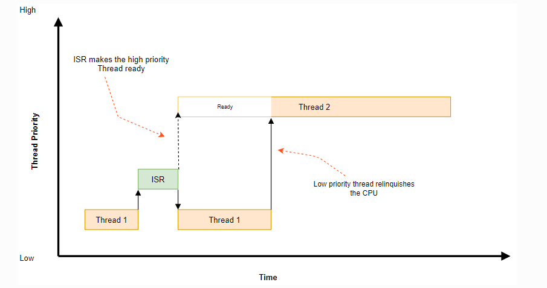

# kernel翻译

- kernel 服务
- device driver model 设备驱动模型
- User Mode  用户模式
- Memory Management 内存管理
- Executinig Time Functions 执行时间函数
- Object Core  对象核心
- Time Utilities 时间工具
- Utilities 工具
- Iterable Section 可迭代的部分，可以在任何位置实例化他
- Code and data relocation 代码和数据重定向


# kernel service 内核服务

Zephyr 内核是每个 Zephyr 应用程序的核心。它提供了一个低占用空间、高性能、多线程执行环境，并具有丰富的可用功能。Zephyr 生态系统的其余部分，包括设备驱动程序、网络堆栈和特定于应用程序的代码，使用内核的功能来创建完整的应用程序。

内核的可配置特性允许您仅合并应用程序所需的功能，使其非常适合内存量有限（低至 2 KB！）或具有简单多线程要求（例如一组中断）的系统。处理程序和单个后台任务）。此类系统的示例包括：嵌入式传感器集线器、环境传感器、简单的 LED 可穿戴设备和商店库存标签。

需要更多内存（50 至 900 KB）、多个通信设备（例如 Wi-Fi 和蓝牙低功耗）以及复杂多线程的应用程序也可以使用 Zephyr 内核进行开发。此类系统的示例包括：健身可穿戴设备、智能手表和物联网无线网关。

## 调度、中断和同步

这些页面涵盖了与线程调度和同步相关的基本内核服务。

- [线程数](https://docs.zephyrproject.org/latest/kernel/services/threads/index.html)
- [调度](https://docs.zephyrproject.org/latest/kernel/services/scheduling/index.html)
- [CPU闲置](https://docs.zephyrproject.org/latest/kernel/services/scheduling/index.html#cpu-idling)
- [系统线程](https://docs.zephyrproject.org/latest/kernel/services/threads/system_threads.html)
- [工作队列线程](https://docs.zephyrproject.org/latest/kernel/services/threads/workqueue.html)
- [无线程操作](https://docs.zephyrproject.org/latest/kernel/services/threads/nothread.html)
- [中断](https://docs.zephyrproject.org/latest/kernel/services/interrupts.html)
- [轮询API](https://docs.zephyrproject.org/latest/kernel/services/polling.html)
- [信号量](https://docs.zephyrproject.org/latest/kernel/services/synchronization/semaphores.html)
- [互斥体](https://docs.zephyrproject.org/latest/kernel/services/synchronization/mutexes.html)
- [条件变量](https://docs.zephyrproject.org/latest/kernel/services/synchronization/condvar.html)
- [活动](https://docs.zephyrproject.org/latest/kernel/services/synchronization/events.html)
- [对称多处理](https://docs.zephyrproject.org/latest/kernel/services/smp/smp.html)

## 数据传递

这些页面涵盖可用于在线程和 ISR 之间传递数据的内核对象。

下表总结了它们的高级功能。

| 目的     | 双向？ | 数据结构       | 数据项大小 | 数据对齐 | ISR 可以接收吗？ | ISRs可以发送吗？ | 超限处理             |
| -------- | ------ | -------------- | ---------- | -------- | ---------------- | ---------------- | -------------------- |
| 先进先出 | 不     | 队列           | 任意 [1]   | 4B [2]   | 是的 [3]         | 是的             | 不适用               |
| 后进先出 | 不     | 队列           | 任意 [1]   | 4B [2]   | 是的 [3]         | 是的             | 不适用               |
| 堆       | 不     | 大批           | 单词       | 单词     | 是的 [3]         | 是的             | 未定义的行为         |
| 消息队列 | 不     | 环形缓冲区     | 任意 [6]   | 两个的幂 | 是的 [3]         | 是的             | 挂起线程或返回-errno |
| 邮箱     | 是的   | 队列           | 任意 [1]   | 随意的   | 不               | 不               | 不适用               |
| 管道     | 不     | 环形缓冲区 [4] | 随意的     | 随意的   | 是的 [5]         | 是的 [5]         | 挂起线程或返回-errno |

[1] 调用者在数据元素本身中为队列开销分配空间。

[2] 使用 k_fifo_alloc_put() 和 k_lifo_alloc_put() 添加的对象没有对齐约束，但使用调用线程资源池中的临时内存。

[3] 仅当传递 K_NO_WAIT 作为超时参数时，ISR 才能接收。

[4] 可选。

[5] 仅当传递 K_NO_WAIT 作为超时参数时，ISRS 才能发送和/或接收。

[6] 数据项大小必须是数据对齐方式的倍数。


## 内存管理[¶](https://docs.zephyrproject.org/latest/kernel/services/index.html#memory-management)

请参阅[内存管理](https://docs.zephyrproject.org/latest/kernel/memory_management/index.html#memory-management-api)。

## 定时[¶](https://docs.zephyrproject.org/latest/kernel/services/index.html#timing)

这些页面涵盖与计时相关的服务。

- [内核时序](https://docs.zephyrproject.org/latest/kernel/services/timing/clocks.html)
- [定时器](https://docs.zephyrproject.org/latest/kernel/services/timing/timers.html)

## 其他[¶](https://docs.zephyrproject.org/latest/kernel/services/index.html#other)

这些页面涵盖其他内核服务。

- [原子服务](https://docs.zephyrproject.org/latest/kernel/services/other/atomic.html)
- [浮点服务](https://docs.zephyrproject.org/latest/kernel/services/other/float.html)
- [版本](https://docs.zephyrproject.org/latest/kernel/services/other/version.html)
- [致命错误](https://docs.zephyrproject.org/latest/kernel/services/other/fatal.html)
- [线程本地存储 (TLS)](https://docs.zephyrproject.org/latest/kernel/services/other/thread_local_storage.html)


# 线程数

- [生命周期](https://docs.zephyrproject.org/latest/kernel/services/threads/index.html#lifecycle)
  - [线程创建](https://docs.zephyrproject.org/latest/kernel/services/threads/index.html#thread-creation)
  - [线程终止](https://docs.zephyrproject.org/latest/kernel/services/threads/index.html#thread-termination)
  - [线程中止](https://docs.zephyrproject.org/latest/kernel/services/threads/index.html#thread-aborting)
  - [线程悬浮](https://docs.zephyrproject.org/latest/kernel/services/threads/index.html#thread-suspension)
- [线程状态](https://docs.zephyrproject.org/latest/kernel/services/threads/index.html#thread-states)
- [线程栈对象](https://docs.zephyrproject.org/latest/kernel/services/threads/index.html#thread-stack-objects)
  - [仅内核堆栈](https://docs.zephyrproject.org/latest/kernel/services/threads/index.html#kernel-only-stacks)
  - [线程栈](https://docs.zephyrproject.org/latest/kernel/services/threads/index.html#thread-stacks)
- [线程优先级](https://docs.zephyrproject.org/latest/kernel/services/threads/index.html#thread-priorities)
  - [元 IRQ 优先级](https://docs.zephyrproject.org/latest/kernel/services/threads/index.html#meta-irq-priorities)
- [线程选项](https://docs.zephyrproject.org/latest/kernel/services/threads/index.html#thread-options)
- [线程自定义数据](https://docs.zephyrproject.org/latest/kernel/services/threads/index.html#thread-custom-data)
- [执行](https://docs.zephyrproject.org/latest/kernel/services/threads/index.html#implementation)
  - [生成线程](https://docs.zephyrproject.org/latest/kernel/services/threads/index.html#spawning-a-thread)
  - [删除权限](https://docs.zephyrproject.org/latest/kernel/services/threads/index.html#dropping-permissions)
  - [终止线程](https://docs.zephyrproject.org/latest/kernel/services/threads/index.html#terminating-a-thread)
- [运行时统计](https://docs.zephyrproject.org/latest/kernel/services/threads/index.html#runtime-statistics)
- [建议用途](https://docs.zephyrproject.org/latest/kernel/services/threads/index.html#suggested-uses)
- [配置选项](https://docs.zephyrproject.org/latest/kernel/services/threads/index.html#configuration-options)
- [API参考](https://docs.zephyrproject.org/latest/kernel/services/threads/index.html#api-reference)

本节介绍用于创建、调度和删除独立可执行指令线程的内核服务。

线程是一个内核对象，用于处理太长或太复杂而无法由 ISR 执行的应用程序处理*。*

应用程序可以定义任意数量的线程（仅受可用 RAM 的限制）。每个线程都由线程生成时分配的*线程 ID*引用。

线程具有以下关键属性：

- 堆栈**区域**，是用于线程堆栈的内存区域。**堆栈区域的大小**可以根据线程处理的实际需要进行定制。存在特殊的宏来创建和使用堆栈内存区域。
- 用于线程元数据的私有内核簿记的**线程控制块**。这是类型的一个实例[`k_thread`](https://docs.zephyrproject.org/latest/kernel/services/threads/index.html#c.k_thread)。
- **入口点函数**，在线程启动时调用。最多可以将 3 个**参数值**传递给此函数。
- 调度**优先级**，它指示内核的调度程序如何为线程分配CPU时间。（参见[日程安排](https://docs.zephyrproject.org/latest/kernel/services/scheduling/index.html#scheduling-v2)。）
- 一组**线程选项**，允许线程在特定情况下接受内核的特殊处理。（请参阅[线程选项](https://docs.zephyrproject.org/latest/kernel/services/threads/index.html#thread-options-v2)。）
- 启动**延迟**，指定内核在启动线程之前应等待的时间。
- 执行**模式**，可以是超级用户模式，也可以是用户模式。默认情况下，线程在管理程序模式下运行，并允许访问特权 CPU 指令、整个内存地址空间和外设。用户模式线程的特权集有所减少。这取决于[`CONFIG_USERSPACE`](https://docs.zephyrproject.org/latest/kconfig.html#CONFIG_USERSPACE)选项。请参阅[用户模式](https://docs.zephyrproject.org/latest/kernel/usermode/index.html#usermode-api)。

## [生命周期](https://docs.zephyrproject.org/latest/kernel/services/threads/index.html#id3)

### [线程创建](https://docs.zephyrproject.org/latest/kernel/services/threads/index.html#id4)

线程必须先创建才能使用。内核初始化线程控制块以及堆栈部分的一端。线程堆栈的其余部分通常未初始化。

指定启动延迟[`K_NO_WAIT`](https://docs.zephyrproject.org/latest/kernel/services/timing/clocks.html#c.K_NO_WAIT)指示内核立即开始线程执行。或者，可以通过指定超时值来指示内核延迟线程的执行，例如，允许线程使用的设备硬件变得可用。

内核允许在线程开始执行之前取消延迟启动。如果线程已经启动，则取消请求无效。延迟启动被成功取消的线程必须重新生成才能使用。

### [线程终止](https://docs.zephyrproject.org/latest/kernel/services/threads/index.html#id5)

一旦线程启动，它通常会永远执行。然而，线程可以通过从其入口点函数返回来同步结束其执行。这称为**终止**。

终止的线程负责在返回之前释放它可能拥有的任何共享资源（例如互斥体和动态分配的内存），因为内核不会自动*回收*它们。

在某些情况下，一个线程可能想要休眠，直到另一个线程终止。这可以通过 API 来完成[`k_thread_join()`](https://docs.zephyrproject.org/latest/kernel/services/threads/index.html#c.k_thread_join)。这将阻塞调用线程，直到超时到期、目标线程自行退出或目标线程中止（由于调用 [`k_thread_abort()`](https://docs.zephyrproject.org/latest/kernel/services/threads/index.html#c.k_thread_abort)或触发致命错误）。

一旦线程终止，内核保证不会使用该线程结构。这样一个结构体的内存可以被重新用于任何目的，包括生成一个新线程。请注意，线程必须完全终止，这会出现竞争条件，其中线程自己的逻辑发出完成信号，在内核处理完成之前另一个线程可以看到该完成信号。在正常情况下，应用程序代码应该使用[`k_thread_join()`](https://docs.zephyrproject.org/latest/kernel/services/threads/index.html#c.k_thread_join)或 [`k_thread_abort()`](https://docs.zephyrproject.org/latest/kernel/services/threads/index.html#c.k_thread_abort)来同步线程终止状态，而不是依赖于应用程序逻辑内的信号。

### [线程中止](https://docs.zephyrproject.org/latest/kernel/services/threads/index.html#id6)

线程可以通过**aborting**异步结束其执行。如果线程触发致命错误条件（例如取消引用空指针），内核会自动中止该线程。

一个线程也可以通过调用 被另一个线程（或它自己）中止[`k_thread_abort()`](https://docs.zephyrproject.org/latest/kernel/services/threads/index.html#c.k_thread_abort)。但是，通常最好向线程发出信号以使其正常终止，而不是中止它。

与线程终止一样，内核不会回收中止线程拥有的共享资源。

> 笔记

> 内核当前没有对应用程序重生中止线程的能力做出任何声明。

### [线程悬浮](https://docs.zephyrproject.org/latest/kernel/services/threads/index.html#id7)

如果线程被挂起，则可以无限期地阻止该线程**执行**。该函数[`k_thread_suspend()`](https://docs.zephyrproject.org/latest/kernel/services/threads/index.html#c.k_thread_suspend) 可用于挂起任何线程，包括调用线程。挂起已经挂起的线程没有额外的效果。

一旦挂起，线程就无法被调度，直到另一个线程调用 [`k_thread_resume()`](https://docs.zephyrproject.org/latest/kernel/services/threads/index.html#c.k_thread_resume)来取消挂起。

笔记

线程可以使用 来阻止自己在指定的时间内执行[`k_sleep()`](https://docs.zephyrproject.org/latest/kernel/services/threads/index.html#c.k_sleep)。然而，这与挂起线程不同，因为当达到时间限制时，休眠线程会自动变为可执行状态。

## [线程状态](https://docs.zephyrproject.org/latest/kernel/services/threads/index.html#id8)

没有任何阻碍其执行的因素的线程被认为是**就绪的**，并且有资格被选为当前线程。

一个线程如果有一个或多个阻碍其执行的因素，就被认为是**未就绪的**，并且不能被选为当前线程。

以下因素会导致线程未就绪：

- 线程尚未启动。
- 线程正在等待内核对象完成操作。（例如，线程正在获取不可用的信号量。）
- 线程正在等待超时发生。
- 该线程已被挂起。
- 线程已终止或中止。


笔记

尽管上图似乎表明**“就绪”**和 **“运行”**是不同的线程状态，但这不是正确的解释。**Ready**是线程状态，**Running**是调度状态，仅适用于**Ready**线程。

## [线程栈对象](https://docs.zephyrproject.org/latest/kernel/services/threads/index.html#id9)

每个线程都需要自己的堆栈缓冲区，以便 CPU 推送上下文。根据配置，必须满足几个约束：

- 可能需要为内存管理结构保留额外的内存
- 如果启用基于保护的堆栈溢出检测，则必须在堆栈缓冲区之前立即设置一个小的写保护内存管理区域以捕获溢出。
- 如果启用了用户空间，则必须保留一个单独的固定大小的特权提升堆栈，作为处理系统调用的私有内核堆栈。
- 如果启用了用户空间，则线程的堆栈缓冲区必须适当调整大小并对齐，以便可以对内存保护区域进行编程以使其完全适合。

对齐约束可能非常严格，例如，某些 MPU 要求其区域的大小为 2 的幂，并与其自身的大小对齐。

因此，可移植代码不能简单地将任意字符缓冲区传递给[`k_thread_create()`](https://docs.zephyrproject.org/latest/kernel/services/threads/index.html#c.k_thread_create). 存在用于实例化堆栈的特殊宏，前缀为`K_KERNEL_STACK`和`K_THREAD_STACK`。

### [仅内核堆栈](https://docs.zephyrproject.org/latest/kernel/services/threads/index.html#id10)

如果知道线程永远不会在用户模式下运行，或者堆栈用于特殊上下文（例如处理中断），则最好使用宏定义堆栈`K_KERNEL_STACK`。

这些堆栈可以节省内存，因为 MPU 区域永远不需要编程来覆盖堆栈缓冲区本身，并且内核不需要为特权提升堆栈或仅与用户模式线程相关的内存管理数据结构保留额外的空间。

尝试从用户模式使用以这种方式声明的堆栈将导致调用者出现致命错误。

如果`CONFIG_USERSPACE`未启用，则该组`K_THREAD_STACK`宏与宏具有相同的效果`K_KERNEL_STACK`。

### [线程栈](https://docs.zephyrproject.org/latest/kernel/services/threads/index.html#id11)

如果已知堆栈需要托管用户线程，或者无法确定，请使用`K_THREAD_STACK`宏定义堆栈。这可能会使用更多内存，但堆栈对象适合托管用户线程。

如果`CONFIG_USERSPACE`未启用，则该组`K_THREAD_STACK`宏与宏具有相同的效果`K_KERNEL_STACK`。

## [线程优先级](https://docs.zephyrproject.org/latest/kernel/services/threads/index.html#id12)

线程的优先级是一个整数值，可以是负数，也可以是非负数。数值较低的优先级优先于数值较高的值。例如，调度程序赋予优先级为4的线程A比优先级为7的线程B*更高*的优先级；同样，优先级为 -2 的线程 C 的优先级高于线程 A 和线程 B。

调度程序根据每个线程的优先级区分两类线程。

- *协作线程*具有负优先级值。一旦成为当前线程，协作线程就会保持当前线程，直到它执行使其未就绪的操作。
- *可抢占线程*具有非负优先级值。一旦成为当前线程，如果协作线程或具有更高或相同优先级的可抢占线程准备就绪，则可抢占线程可以随时被取代。

线程启动后，可以向上或向下更改线程的初始优先级值。因此，通过更改其优先级，可抢占线程可以成为协作线程，反之亦然。

> 笔记

> 调度程序不会做出启发式决策来重新确定线程的优先级。线程优先级仅根据应用程序的请求进行设置和更改。

内核支持几乎无限数量的线程优先级。配置选项[`CONFIG_NUM_COOP_PRIORITIES`](https://docs.zephyrproject.org/latest/kconfig.html#CONFIG_NUM_COOP_PRIORITIES)并 [`CONFIG_NUM_PREEMPT_PRIORITIES`](https://docs.zephyrproject.org/latest/kconfig.html#CONFIG_NUM_PREEMPT_PRIORITIES)指定每类线程的优先级数量，从而产生以下可用优先级范围：

- 协作线程：(- [`CONFIG_NUM_COOP_PRIORITIES`](https://docs.zephyrproject.org/latest/kconfig.html#CONFIG_NUM_COOP_PRIORITIES)) 到 -1
- 抢占式线程：0 到 ( [`CONFIG_NUM_PREEMPT_PRIORITIES`](https://docs.zephyrproject.org/latest/kconfig.html#CONFIG_NUM_PREEMPT_PRIORITIES)- 1)


### Meta-IRQ Priorities[元 IRQ 优先级](https://docs.zephyrproject.org/latest/kernel/services/threads/index.html#id13)

启用后（请参阅 参考资料[`CONFIG_NUM_METAIRQ_PRIORITIES`](https://docs.zephyrproject.org/latest/kconfig.html#CONFIG_NUM_METAIRQ_PRIORITIES)），优先级空间的最高（数字最低）端有一个特殊的协作优先级子类：元 IRQ 线程。这些线程根据其正常优先级进行调度，但也具有以较低优先级抢占所有其他线程（和其他元 IRQ 线程）的特殊能力，即使这些线程是协作的和/或已获取调度程序锁。然而，Meta-IRQ 线程仍然是线程，并且仍然可以被任何硬件中断中断。

当由较低优先级线程或类似 ARM 的线程完成时，此行为使得解锁元 IRQ 线程（通过任何方式，例如创建它、调用 k_sem_give() 等）的行为相当于同步系统调用。当从真正的中断上下文完成时，“挂起的 IRQ”。目的是该功能将用于在驱动程序子系统中实现中断“下半部分”处理和/或“tasklet”功能。线程一旦被唤醒，将保证在当前 CPU 返回到应用程序代码之前运行。

与其他操作系统中的类似功能不同，元 IRQ 线程是真正的线程，并且在自己的堆栈（必须正常分配）上运行，而不是在每个 CPU 的中断堆栈上运行。在受支持的架构上启用 IRQ 堆栈的设计工作正在等待中。

请注意，因为这违反了 Zephyr API 对协作线程的承诺（即操作系统不会调度其他线程，直到当前线程故意阻塞），所以应用程序代码中应非常小心地使用它。这些不仅仅是非常高优先级的线程，不应该这样使用。

## [线程选项](https://docs.zephyrproject.org/latest/kernel/services/threads/index.html#id14)[¶](https://docs.zephyrproject.org/latest/kernel/services/threads/index.html#thread-options)

内核支持一小组*线程选项*，允许线程在特定情况下接受特殊处理。与线程关联的选项集是在生成线程时指定的。

不需要任何线程选项的线程的选项值为零。`|`需要线程选项的线程通过名称指定它，如果需要多个选项，则使用 字符作为分隔符（即使用按位 OR 运算符组合选项）。

支持以下线程选项。

- [`K_ESSENTIAL`](https://docs.zephyrproject.org/latest/kernel/services/threads/index.html#c.K_ESSENTIAL)

  该选项将线程标记为*基本线程*。这指示内核将线程的终止或中止视为致命的系统错误。默认情况下，该线程不被视为必需线程。

- `K_SSE_REGS`

  此 x86 特定选项指示线程使用 CPU 的 SSE 寄存器。另见[`K_FP_REGS`](https://docs.zephyrproject.org/latest/kernel/services/threads/index.html#c.K_FP_REGS)。默认情况下，内核在调度线程时不会尝试保存和恢复这些寄存器的内容。

- [`K_FP_REGS`](https://docs.zephyrproject.org/latest/kernel/services/threads/index.html#c.K_FP_REGS)

  该选项表明线程使用CPU的浮点寄存器。这指示内核在调度线程时采取额外的步骤来保存和恢复这些寄存器的内容。（有关详细信息，请参阅[浮点服务](https://docs.zephyrproject.org/latest/kernel/services/other/float.html#float-v2)。）默认情况下，内核在调度线程时不会尝试保存和恢复该寄存器的内容。

- [`K_USER`](https://docs.zephyrproject.org/latest/kernel/services/threads/index.html#c.K_USER)

  如果[`CONFIG_USERSPACE`](https://docs.zephyrproject.org/latest/kconfig.html#CONFIG_USERSPACE)启用，该线程将在用户模式下创建，并且权限会降低。请参阅[用户模式](https://docs.zephyrproject.org/latest/kernel/usermode/index.html#usermode-api)。否则这个标志什么也不做。

- [`K_INHERIT_PERMS`](https://docs.zephyrproject.org/latest/kernel/services/threads/index.html#c.K_INHERIT_PERMS)

  如果[`CONFIG_USERSPACE`](https://docs.zephyrproject.org/latest/kconfig.html#CONFIG_USERSPACE)启用，该线程将继承父线程拥有的除父线程对象之外的所有内核对象权限。请参阅[用户模式](https://docs.zephyrproject.org/latest/kernel/usermode/index.html#usermode-api)。


## [线程自定义数据](https://docs.zephyrproject.org/latest/kernel/services/threads/index.html#id15)[¶](https://docs.zephyrproject.org/latest/kernel/services/threads/index.html#thread-custom-data)

每个线程都有一个 32 位*自定义数据*区域，只能由线程本身访问，并且可由应用程序用于其选择的任何目的。线程的默认自定义数据值为零。

笔记

ISR 无法使用自定义数据支持，因为它们在单个共享内核中断处理上下文中运行。

默认情况下，线程自定义数据支持处于禁用状态。配置选项 [`CONFIG_THREAD_CUSTOM_DATA`](https://docs.zephyrproject.org/latest/kconfig.html#CONFIG_THREAD_CUSTOM_DATA)可用于启用支持。

和函数分别用于写入和读取线程的自定义数据[`k_thread_custom_data_set()`](https://docs.zephyrproject.org/latest/kernel/services/threads/index.html#c.k_thread_custom_data_set)。 [`k_thread_custom_data_get()`](https://docs.zephyrproject.org/latest/kernel/services/threads/index.html#c.k_thread_custom_data_get)线程只能访问自己的自定义数据，而不能访问另一个线程的自定义数据。

以下代码使用自定义数据功能来记录每个线程调用特定例程的次数。

> 笔记

> 显然，只有单个例程可以使用此技术，因为它垄断了自定义数据功能的使用。

```
int call_tracking_routine(void)
{
    uint32_t call_count;

    if (k_is_in_isr()) {
        /* ignore any call made by an ISR */
    } else {
        call_count = (uint32_t)k_thread_custom_data_get();
        call_count++;
        k_thread_custom_data_set((void *)call_count);
    }

    /* do rest of routine's processing */
    ...
}
```

使用线程自定义数据，通过使用自定义数据作为指向线程拥有的数据结构的指针，允许例程访问线程特定的信息。

## [执行](https://docs.zephyrproject.org/latest/kernel/services/threads/index.html#id16)

### [生成线程](https://docs.zephyrproject.org/latest/kernel/services/threads/index.html#id17)

通过定义其堆栈区域和线程控制块，然后调用 来生成线程[`k_thread_create()`](https://docs.zephyrproject.org/latest/kernel/services/threads/index.html#c.k_thread_create)。

堆栈区域必须使用[`K_THREAD_STACK_DEFINE`](https://docs.zephyrproject.org/latest/kernel/services/threads/index.html#c.K_THREAD_STACK_DEFINE)或 来定义[`K_KERNEL_STACK_DEFINE`](https://docs.zephyrproject.org/latest/kernel/services/threads/index.html#c.K_KERNEL_STACK_DEFINE)，以确保它在内存中正确设置。

堆栈的大小参数必须是三个值之一：

- `K_THREAD_STACK`传递给堆栈实例化宏系列的原始请求堆栈大小 `K_KERNEL_STACK`。
- 对于使用宏系列定义的堆栈对象，该对象`K_THREAD_STACK`的返回值。[`K_THREAD_STACK_SIZEOF()`](https://docs.zephyrproject.org/latest/kernel/services/threads/index.html#c.K_THREAD_STACK_SIZEOF)
- 对于使用宏系列定义的堆栈对象，该对象`K_KERNEL_STACK`的返回值。[`K_KERNEL_STACK_SIZEOF()`](https://docs.zephyrproject.org/latest/kernel/services/threads/index.html#c.K_KERNEL_STACK_SIZEOF)

线程生成函数返回其线程 ID，可用于引用该线程。

以下代码生成一个立即启动的线程。

```
#define MY_STACK_SIZE 500
#define MY_PRIORITY 5

extern void my_entry_point(void *, void *, void *);

K_THREAD_STACK_DEFINE(my_stack_area, MY_STACK_SIZE);
struct k_thread my_thread_data;

k_tid_t my_tid = k_thread_create(&my_thread_data, my_stack_area,
                                 K_THREAD_STACK_SIZEOF(my_stack_area),
                                 my_entry_point,
                                 NULL, NULL, NULL,
                                 MY_PRIORITY, 0, K_NO_WAIT);
```

或者，可以通过调用在编译时声明线程 [`K_THREAD_DEFINE`](https://docs.zephyrproject.org/latest/kernel/services/threads/index.html#c.K_THREAD_DEFINE)。观察宏自动定义堆栈区域、控制块和线程 ID 变量。

下面的代码与上面的代码段具有相同的效果。

```
#define MY_STACK_SIZE 500
#define MY_PRIORITY 5

extern void my_entry_point(void *, void *, void *);

K_THREAD_DEFINE(my_tid, MY_STACK_SIZE,
                my_entry_point, NULL, NULL, NULL,
                MY_PRIORITY, 0, 0);
```

> 笔记

> 其中delay参数to[`k_thread_create()`](https://docs.zephyrproject.org/latest/kernel/services/threads/index.html#c.k_thread_create)是一个 [`k_timeout_t`](https://docs.zephyrproject.org/latest/kernel/services/timing/clocks.html#c.k_timeout_t)值，所以[`K_NO_WAIT`](https://docs.zephyrproject.org/latest/kernel/services/timing/clocks.html#c.K_NO_WAIT)表示立即启动线程。对应的参数[`K_THREAD_DEFINE`](https://docs.zephyrproject.org/latest/kernel/services/threads/index.html#c.K_THREAD_DEFINE) 是以整数毫秒为单位的持续时间，因此等效参数为 0。

#### 用户模式约束

本节仅在启用时适用[`CONFIG_USERSPACE`](https://docs.zephyrproject.org/latest/kconfig.html#CONFIG_USERSPACE)，并且用户线程尝试创建新线程。该[`k_thread_create()`](https://docs.zephyrproject.org/latest/kernel/services/threads/index.html#c.k_thread_create)API 仍在使用，但必须满足其他约束，否则调用线程将被终止：

- 调用线程必须拥有子线程和堆栈参数的权限；两者都被内核作为内核对象进行跟踪。
- 子线程和堆栈对象必须处于未初始化状态，即当前未运行并且堆栈内存未使用。
- 传入的堆栈大小参数必须等于或小于声明堆栈对象时的边界。
- 必须使用该[`K_USER`](https://docs.zephyrproject.org/latest/kernel/services/threads/index.html#c.K_USER)选项，因为用户线程只能创建其他用户线程。
- [`K_ESSENTIAL`](https://docs.zephyrproject.org/latest/kernel/services/threads/index.html#c.K_ESSENTIAL)不得使用该选项，用户线程可能不被视为必需线程。
- 子线程的优先级必须是有效的优先级值，并且等于或低于父线程。

### [删除权限](https://docs.zephyrproject.org/latest/kernel/services/threads/index.html#id18)

如果[`CONFIG_USERSPACE`](https://docs.zephyrproject.org/latest/kconfig.html#CONFIG_USERSPACE)启用，在管理模式下运行的线程可以使用 API 执行到用户模式的单向转换 [`k_thread_user_mode_enter()`](https://docs.zephyrproject.org/latest/kernel/services/threads/index.html#c.k_thread_user_mode_enter)。这是一种单向操作，它将重置线程的堆栈内存并将其清零。该线程将被标记为非必要。

### [终止线程](https://docs.zephyrproject.org/latest/kernel/services/threads/index.html#id19)

线程通过从其入口点函数返回来终止自身。

以下代码说明了线程终止的方式。

```
void my_entry_point(int unused1, int unused2, int unused3)
{
    while (1) {
        ...
        if (<some condition>) {
            return; /* thread terminates from mid-entry point function */
        }
        ...
    }

    /* thread terminates at end of entry point function */
}
```

如果[`CONFIG_USERSPACE`](https://docs.zephyrproject.org/latest/kconfig.html#CONFIG_USERSPACE)启用，中止线程还会将线程和堆栈对象标记为未初始化，以便可以重新使用它们。

## [运行时统计](https://docs.zephyrproject.org/latest/kernel/services/threads/index.html#id20)[¶](https://docs.zephyrproject.org/latest/kernel/services/threads/index.html#runtime-statistics)

如果启用，可以收集和检索线程 [`CONFIG_THREAD_RUNTIME_STATS`](https://docs.zephyrproject.org/latest/kconfig.html#CONFIG_THREAD_RUNTIME_STATS)运行时统计信息，例如线程的执行周期总数。

默认情况下，运行时统计信息是使用默认内核计时器收集的。对于某些架构、SoC 或主板，可以通过计时功能使用具有更高分辨率的计时器。可以通过启用这些计时器的使用[`CONFIG_THREAD_RUNTIME_STATS_USE_TIMING_FUNCTIONS`](https://docs.zephyrproject.org/latest/kconfig.html#CONFIG_THREAD_RUNTIME_STATS_USE_TIMING_FUNCTIONS)。

这是一个例子：

```
k_thread_runtime_stats_t rt_stats_thread;

k_thread_runtime_stats_get(k_current_get(), &rt_stats_thread);

printk("Cycles: %llu\n", rt_stats_thread.execution_cycles);
```

## [建议用途](https://docs.zephyrproject.org/latest/kernel/services/threads/index.html#id21)[¶](https://docs.zephyrproject.org/latest/kernel/services/threads/index.html#suggested-uses)

使用线程来处理 ISR 中无法处理的处理。

使用单独的线程来处理可以并行执行的逻辑上不同的处理操作。

## [配置选项](https://docs.zephyrproject.org/latest/kernel/services/threads/index.html#id22)[¶](https://docs.zephyrproject.org/latest/kernel/services/threads/index.html#configuration-options)

相关配置选项：

- [`CONFIG_MAIN_THREAD_PRIORITY`](https://docs.zephyrproject.org/latest/kconfig.html#CONFIG_MAIN_THREAD_PRIORITY)
- [`CONFIG_MAIN_STACK_SIZE`](https://docs.zephyrproject.org/latest/kconfig.html#CONFIG_MAIN_STACK_SIZE)
- [`CONFIG_IDLE_STACK_SIZE`](https://docs.zephyrproject.org/latest/kconfig.html#CONFIG_IDLE_STACK_SIZE)
- [`CONFIG_THREAD_CUSTOM_DATA`](https://docs.zephyrproject.org/latest/kconfig.html#CONFIG_THREAD_CUSTOM_DATA)
- [`CONFIG_NUM_COOP_PRIORITIES`](https://docs.zephyrproject.org/latest/kconfig.html#CONFIG_NUM_COOP_PRIORITIES)
- [`CONFIG_NUM_PREEMPT_PRIORITIES`](https://docs.zephyrproject.org/latest/kconfig.html#CONFIG_NUM_PREEMPT_PRIORITIES)
- [`CONFIG_TIMESLICING`](https://docs.zephyrproject.org/latest/kconfig.html#CONFIG_TIMESLICING)
- [`CONFIG_TIMESLICE_SIZE`](https://docs.zephyrproject.org/latest/kconfig.html#CONFIG_TIMESLICE_SIZE)
- [`CONFIG_TIMESLICE_PRIORITY`](https://docs.zephyrproject.org/latest/kconfig.html#CONFIG_TIMESLICE_PRIORITY)
- [`CONFIG_USERSPACE`](https://docs.zephyrproject.org/latest/kconfig.html#CONFIG_USERSPACE)


# 调度

内核基于优先级的调度程序允许应用程序的线程共享CPU。

## 概念

调度程序决定在任何时间点允许执行哪个线程；该线程称为**当前线程**。

调度程序有机会在多个时间点更改当前线程的标识。这些点称为**重新安排点**。一些潜在的重新安排点是：

- 线程从运行状态转换到挂起或等待状态，例如通过[`k_sem_take()`](https://docs.zephyrproject.org/latest/kernel/services/synchronization/semaphores.html#c.k_sem_take)或[`k_sleep()`](https://docs.zephyrproject.org/latest/kernel/services/threads/index.html#c.k_sleep)。
- 线程到[就绪状态](https://docs.zephyrproject.org/latest/kernel/services/threads/index.html#thread-states)的转换，例如通过[`k_sem_give()`](https://docs.zephyrproject.org/latest/kernel/services/synchronization/semaphores.html#c.k_sem_give)或[`k_thread_start()`](https://docs.zephyrproject.org/latest/kernel/services/threads/index.html#c.k_thread_start)
- 处理中断后返回线程上下文
- 当正在运行的线程调用[`k_yield()`](https://docs.zephyrproject.org/latest/kernel/services/threads/index.html#c.k_yield)

当线程自愿启动将自身转换为挂起或等待状态的操作时，线程**将进入休眠状态。**

每当调度程序更改当前线程的标识，或者当前线程的执行被 ISR 替换时，内核首先保存当前线程的 CPU 寄存器值。当线程稍后恢复执行时，这些寄存器值将被恢复。

### 调度算法[¶](https://docs.zephyrproject.org/latest/kernel/services/scheduling/index.html#scheduling-algorithm)

内核的调度程序选择最高优先级的就绪线程作为当前线程。当存在多个相同优先级的就绪线程时，调度程序会选择等待时间最长的线程。

线程的相对优先级主要由其静态优先级决定。但是，当启用最早截止时间优先调度 ( [`CONFIG_SCHED_DEADLINE`](https://docs.zephyrproject.org/latest/kconfig.html#CONFIG_SCHED_DEADLINE)) 并且线程选择具有相同的静态优先级时，则截止时间较早的线程被认为具有较高优先级。因此，当启用最早截止时间优先调度时，只有当两个线程的静态优先级和截止时间相等时，才认为两个线程具有相同的优先级。该例程 [`k_thread_deadline_set()`](https://docs.zephyrproject.org/latest/kernel/services/threads/index.html#c.k_thread_deadline_set)用于设置线程的截止时间。

> 笔记

> ISR 的执行优先于线程执行，因此当前线程的执行可能随时被 ISR 替换，除非中断已被屏蔽。这适用于协作线程和抢占式线程。

可以使用就绪队列实现的多种选择之一来构建内核，从而在添加许多线程时在代码大小、恒定因子运行时开销和性能扩展之间提供不同的选择。

- 简单链表就绪队列 ( [`CONFIG_SCHED_DUMB`](https://docs.zephyrproject.org/latest/kconfig.html#CONFIG_SCHED_DUMB))

  调度程序就绪队列将被实现为一个简单的无序列表，具有非常快的单线程恒定时间性能和非常小的代码大小。应在代码大小受限的系统上选择此实现，这些系统在任何给定时间都不会在队列中看到超过少量（可能是 3 个）的可运行线程。在大多数平台（不使用红/黑树）上，这会节省约 2k 的代码大小。

- 红/黑树就绪队列 ( [`CONFIG_SCHED_SCALABLE`](https://docs.zephyrproject.org/latest/kconfig.html#CONFIG_SCHED_SCALABLE))

  调度程序就绪队列将被实现为红/黑树。这具有相当慢的恒定时间插入和删除开销，并且在大多数平台（不在某处使用红/黑树）需要额外的约 2kb 代码。由此产生的行为将干净、快速地扩展到数千个线程。

  将此用于需要许多并发可运行线程（> 20 左右）的应用程序。大多数应用程序不需要这种就绪队列实现。

- 传统多队列就绪队列( [`CONFIG_SCHED_MULTIQ`](https://docs.zephyrproject.org/latest/kconfig.html#CONFIG_SCHED_MULTIQ))

  选择后，调度程序就绪队列将被实现为经典/教科书列表数组，每个优先级一个（最多 32 个优先级）。

  这对应于 1.12 之前的 Zephyr 版本中使用的调度程序算法。

  与“哑”调度程序相比，它只产生很小的代码大小开销，并且在几乎所有情况下以非常低的常数因子运行 O(1) 时间。但它需要相当大的 RAM 预算来存储这些列表头，并且有限的功能使其与需要对线程进行更精细排序的截止时间调度和需要遍历线程列表的 SMP 关联等功能不兼容。

  具有少量可运行线程的典型应用程序可能需要 DUMB 调度程序。

IPC 原语中用于挂起线程以供稍后唤醒的 wait_q 抽象与调度程序共享相同的后端数据结构选择，并且可以使用相同的选项。

- 可扩展的 wait_q 实现 ( [`CONFIG_WAITQ_SCALABLE`](https://docs.zephyrproject.org/latest/kconfig.html#CONFIG_WAITQ_SCALABLE))

  当选择时，wait_q将使用平衡树来实现。如果您希望有许多线程等待单个基元，请选择此选项。如果应用程序中的其他地方未使用红/黑树，则代码大小会增加约 2kb（可能与 共享），并且“小”队列上的挂起/取消挂起操作会稍微慢一些（尽管这通常[`CONFIG_WAITQ_DUMB`](https://docs.zephyrproject.org/latest/kconfig.html#CONFIG_WAITQ_DUMB)不是[`CONFIG_SCHED_SCALABLE`](https://docs.zephyrproject.org/latest/kconfig.html#CONFIG_SCHED_SCALABLE)性能路径）。

- 简单链表 wait_q ( [`CONFIG_WAITQ_DUMB`](https://docs.zephyrproject.org/latest/kconfig.html#CONFIG_WAITQ_DUMB))

  当选择时，wait_q 将使用双向链表实现。如果您希望在任何单个 IPC 原语上只阻塞几个线程，请选择此选项。

### 合作时间切片[¶](https://docs.zephyrproject.org/latest/kernel/services/scheduling/index.html#cooperative-time-slicing)

一旦协作线程成为当前线程，它就保持当前线程，直到它执行使其未就绪的操作。因此，如果协作线程执行冗长的计算，则可能会导致其他线程（包括较高优先级和同等优先级的线程）的调度出现不可接受的延迟。



为了克服此类问题，协作线程可以时不时地自愿放弃 CPU 以允许其他线程执行。线程可以通过两种方式放弃 CPU：

- 调用[`k_yield()`](https://docs.zephyrproject.org/latest/kernel/services/threads/index.html#c.k_yield)将线程置于调度程序的就绪线程优先级列表的后面，然后调用调度程序。然后，在重新调度让步线程之前，允许执行优先级高于或等于让步线程优先级的所有就绪线程。如果不存在这样的就绪线程，则调度程序立即重新调度让出线程，而无需上下文切换。
- 调用[`k_sleep()`](https://docs.zephyrproject.org/latest/kernel/services/threads/index.html#c.k_sleep)会使线程在指定的时间段内处于未就绪状态。*然后允许所有*优先级的就绪线程执行；但是，不能保证优先级低于休眠线程优先级的线程会在休眠线程再次准备就绪之前实际得到调度。

### 抢占式时间切片[¶](https://docs.zephyrproject.org/latest/kernel/services/scheduling/index.html#preemptive-time-slicing)

一旦抢占式线程成为当前线程，它就会保持当前线程状态，直到更高优先级的线程准备好，或者直到该线程执行使其未就绪的操作。因此，如果抢占式线程执行冗长的计算，则可能会导致其他线程（包括同等优先级的线程）的调度出现不可接受的延迟。


为了克服此类问题，抢占式线程可以执行协作时间切片（如上所述），或者可以使用调度程序的时间切片功能来允许相同优先级的其他线程执行。


调度程序将时间划分为一系列**时间片**，其中时间片以系统时钟周期为单位进行测量。时间片大小是可配置的，但该大小可以在应用程序运行时更改。

在每个时间片结束时，调度程序都会检查当前线程是否可抢占，如果是，则代表[`k_yield()`](https://docs.zephyrproject.org/latest/kernel/services/threads/index.html#c.k_yield) 该线程隐式调用。这使得相同优先级的其他就绪线程有机会在当前线程再次调度之前执行。如果没有同等优先级的线程就绪，则当前线程仍然是当前线程。

优先级高于指定限制的线程不受抢占时间切片的限制，并且永远不会被同等优先级的线程抢占。这允许应用程序仅在处理对时间不太敏感的较低优先级线程时才使用抢占式时间切片。

> 笔记

> 内核的时间切片算法不能*确保*一组同等优先级的线程接收到相等的 CPU 时间，因为它不测量线程实际执行的时间量。然而，该算法*确实*确保线程的执行时间永远不会超过单个时间片而不需要让出。

### 调度程序锁定[¶](https://docs.zephyrproject.org/latest/kernel/services/scheduling/index.html#scheduler-locking)

不希望在执行关键操作时被抢占的可抢占线程可以通过调用 来指示调度程序暂时将其视为协作线程[`k_sched_lock()`](https://docs.zephyrproject.org/latest/kernel/services/threads/index.html#c.k_sched_lock)。这可以防止其他线程在执行关键操作时干扰。

一旦关键操作完成，可抢占线程必须调用 [`k_sched_unlock()`](https://docs.zephyrproject.org/latest/kernel/services/threads/index.html#c.k_sched_unlock)以恢复其正常的可抢占状态。

如果一个线程调用[`k_sched_lock()`](https://docs.zephyrproject.org/latest/kernel/services/threads/index.html#c.k_sched_lock)并随后执行了一个使其未就绪的操作，那么调度程序将切换锁定线程并允许其他线程执行。当加锁线程再次成为当前线程时，其不可抢占状态保持不变。

笔记

对于可抢占线程来说，锁定调度程序是一种比将其优先级更改为负值更有效的方法来防止抢占。

### 线程休眠[¶](https://docs.zephyrproject.org/latest/kernel/services/scheduling/index.html#thread-sleeping)

线程可以调用[`k_sleep()`](https://docs.zephyrproject.org/latest/kernel/services/threads/index.html#c.k_sleep)以将其处理延迟指定的时间段。在线程休眠期间，CPU 被释放以允许其他就绪线程执行。一旦指定的延迟过去，线程就准备好并可以再次调度。

睡眠线程可以使用 被另一个线程提前唤醒 [`k_wakeup()`](https://docs.zephyrproject.org/latest/kernel/services/threads/index.html#c.k_wakeup)。有时可以使用此技术来允许辅助线程向睡眠线程发出信号，表明发生了某些事情，*而不*需要线程定义内核同步对象（例如信号量）。唤醒未休眠的线程是允许的，但没有效果。

### 忙碌等待[¶](https://docs.zephyrproject.org/latest/kernel/services/scheduling/index.html#busy-waiting)

线程可以调用[`k_busy_wait()`](https://docs.zephyrproject.org/latest/kernel/services/threads/index.html#c.k_busy_wait)执行 a 来将 其处理延迟指定的时间段， *而无需*将 CPU 交给另一个就绪线程。`busy wait`

当所需的延迟太短而无法保证调度程序上下文从当前线程切换到另一个线程然后再返回时，通常使用繁忙等待而不是线程休眠。

## 建议用途[¶](https://docs.zephyrproject.org/latest/kernel/services/scheduling/index.html#suggested-uses)

将协作线程用于设备驱动程序和其他性能关键型工作。

使用协作线程来实现互斥，而不需要内核对象，例如互斥体。

使用抢占式线程使时间敏感的处理优先于时间不敏感的处理。

# CPU闲置[¶](https://docs.zephyrproject.org/latest/kernel/services/scheduling/index.html#cpu-idling)

尽管通常为空闲线程保留，但在某些特殊应用程序中，线程可能希望使 CPU 空闲。

- [概念](https://docs.zephyrproject.org/latest/kernel/services/scheduling/index.html#id3)
- [执行](https://docs.zephyrproject.org/latest/kernel/services/scheduling/index.html#implementation)
  - [使CPU空闲](https://docs.zephyrproject.org/latest/kernel/services/scheduling/index.html#making-the-cpu-idle)
  - [以原子方式使 CPU 空闲](https://docs.zephyrproject.org/latest/kernel/services/scheduling/index.html#making-the-cpu-idle-in-an-atomic-fashion)
- [建议用途](https://docs.zephyrproject.org/latest/kernel/services/scheduling/index.html#id4)
- [API参考](https://docs.zephyrproject.org/latest/kernel/services/scheduling/index.html#api-reference)

## [概念](https://docs.zephyrproject.org/latest/kernel/services/scheduling/index.html#id5)[¶](https://docs.zephyrproject.org/latest/kernel/services/scheduling/index.html#id3)

使 CPU 空闲会导致内核暂停所有操作，直到某个事件（通常是中断）唤醒 CPU。在常规系统中，空闲线程负责此操作。然而，在某些受限系统中，另一个线程可能承担此职责。

## [执行](https://docs.zephyrproject.org/latest/kernel/services/scheduling/index.html#id6)[¶](https://docs.zephyrproject.org/latest/kernel/services/scheduling/index.html#implementation)

### [使CPU空闲](https://docs.zephyrproject.org/latest/kernel/services/scheduling/index.html#id7)[¶](https://docs.zephyrproject.org/latest/kernel/services/scheduling/index.html#making-the-cpu-idle)

使 CPU 空闲很简单：调用 k_cpu_idle() API。CPU将停止执行指令，直到事件发生。最有可能的是，该函数将在循环内调用。请注意，在某些体系结构中，返回时，k_cpu_idle() 无条件取消屏蔽中断。

```
static k_sem my_sem;

void my_isr(void *unused)
{
    k_sem_give(&my_sem);
}

int main(void)
{
    k_sem_init(&my_sem, 0, 1);

    /* wait for semaphore from ISR, then do related work */

    for (;;) {

        /* wait for ISR to trigger work to perform */
        if (k_sem_take(&my_sem, K_NO_WAIT) == 0) {

            /* ... do processing */

        }

        /* put CPU to sleep to save power */
        k_cpu_idle();
    }
}
```

### [以原子方式使 CPU 空闲](https://docs.zephyrproject.org/latest/kernel/services/scheduling/index.html#id8)[¶](https://docs.zephyrproject.org/latest/kernel/services/scheduling/index.html#making-the-cpu-idle-in-an-atomic-fashion)

在使 CPU 空闲之前，可能需要原子地执行一些工作。在这种情况下，应该使用 k_cpu_atomic_idle() 来代替。

事实上，前面的示例中存在竞争条件：在获取信号量、发现信号量不可用以及使 CPU 再次空闲之间可能会发生中断。在某些系统中，这可能会导致 CPU 空闲，直到*另一个*中断发生（这可能*永远不会*发生），从而使系统完全挂起。为了防止这种情况，应该使用 k_cpu_atomic_idle()，如本例所示。

```
static k_sem my_sem;

void my_isr(void *unused)
{
    k_sem_give(&my_sem);
}

int main(void)
{
    k_sem_init(&my_sem, 0, 1);

    for (;;) {

        unsigned int key = irq_lock();

        /*
         * Wait for semaphore from ISR; if acquired, do related work, then
         * go to next loop iteration (the semaphore might have been given
         * again); else, make the CPU idle.
         */

        if (k_sem_take(&my_sem, K_NO_WAIT) == 0) {

            irq_unlock(key);

            /* ... do processing */


        } else {
            /* put CPU to sleep to save power */
            k_cpu_atomic_idle(key);
        }
    }
}
```

## [建议用途](https://docs.zephyrproject.org/latest/kernel/services/scheduling/index.html#id9)[¶](https://docs.zephyrproject.org/latest/kernel/services/scheduling/index.html#id4)

当线程除了闲置 CPU 来等待事件之外还必须执行一些实际工作时，请使用 k_cpu_atomic_idle()。请参阅上面的示例。

仅当线程仅负责空闲 CPU（即不执行任何实际工作）时才使用 k_cpu_idle()，如下例所示。

```
int main(void)
{
    /* ... do some system/application initialization */


    /* thread is only used for CPU idling from this point on */
    for (;;) {
        k_cpu_idle();
    }
}
```

> _笔记

> **除非绝对必要，否则不要使用这些 API。**在正常系统中，空闲线程负责电源管理，包括 CPU 空闲。

# 系统线程[¶](https://docs.zephyrproject.org/latest/kernel/services/threads/system_threads.html#system-threads)

- [执行](https://docs.zephyrproject.org/latest/kernel/services/threads/system_threads.html#implementation)
  - [编写 main() 函数](https://docs.zephyrproject.org/latest/kernel/services/threads/system_threads.html#writing-a-main-function)
- [建议用途](https://docs.zephyrproject.org/latest/kernel/services/threads/system_threads.html#suggested-uses)

系统*线程*是内核在系统初始化期间自动生成的线程。

内核产生以下系统线程：

- **主线程**

  该线程执行内核初始化，然后调用应用程序的 `main()`函数（如果已定义）。默认情况下，主线程使用配置的最高可抢占线程优先级（即0）。如果内核未配置为支持抢占式线程，则主线程使用配置的最低协作线程优先级（即-1）。主线程是执行内核初始化或执行应用程序`main()`功能时必不可少的线程；这意味着如果线程中止，则会引发致命系统错误。如果 `main()`未定义，或者如果它执行然后正常返回，则主线程正常终止并且不会引发错误。

- **空闲线程**

  当系统没有其他工作要做时，该线程就会执行。如果可能，空闲线程会激活主板的电源管理支持以节省电量；否则，空闲线程只是执行“不执行任何操作”循环。只要系统正在运行，空闲线程就一直存在并且永远不会终止。空闲线程始终使用配置的最低线程优先级。如果这使其成为协作线程，则空闲线程会重复让出 CPU，以允许应用程序的其他线程在需要时运行。空闲线程是重要线程，这意味着如果线程中止，则会引发致命系统错误。

还可能产生其他系统线程，具体取决于应用程序指定的内核和板配置选项。例如，启用系统工作队列会生成一个系统线程，为提交给它的工作项提供服务。（请参阅[工作队列线程](https://docs.zephyrproject.org/latest/kernel/services/threads/workqueue.html#workqueues-v2)。）

## [执行](https://docs.zephyrproject.org/latest/kernel/services/threads/system_threads.html#id1)[¶](https://docs.zephyrproject.org/latest/kernel/services/threads/system_threads.html#implementation)

### [编写 main() 函数](https://docs.zephyrproject.org/latest/kernel/services/threads/system_threads.html#id2)[¶](https://docs.zephyrproject.org/latest/kernel/services/threads/system_threads.html#writing-a-main-function)

`main()`一旦内核初始化完成，应用程序提供的函数就开始执行。内核不向该函数传递任何参数。

以下代码概述了一个简单的`main()`函数。实际应用程序使用的函数可以根据需要而复杂。

```
int main(void)
{
    /* initialize a semaphore */
    ...

    /* register an ISR that gives the semaphore */
    ...

    /* monitor the semaphore forever */
    while (1) {
        /* wait for the semaphore to be given by the ISR */
        ...
        /* do whatever processing is now needed */
        ...
    }
}
```


## [建议用途](https://docs.zephyrproject.org/latest/kernel/services/threads/system_threads.html#id3)[¶](https://docs.zephyrproject.org/latest/kernel/services/threads/system_threads.html#suggested-uses)

使用主线程在仅需要单个线程的应用程序中执行基于线程的处理，而不是定义额外的特定于应用程序的线程。

# 工作队列线程[¶](https://docs.zephyrproject.org/latest/kernel/services/threads/workqueue.html#workqueue-threads)

- [工作项生命周期](https://docs.zephyrproject.org/latest/kernel/services/threads/workqueue.html#work-item-lifecycle)
- [延迟工作](https://docs.zephyrproject.org/latest/kernel/services/threads/workqueue.html#delayable-work)
- [触发式工作](https://docs.zephyrproject.org/latest/kernel/services/threads/workqueue.html#triggered-work)
- [系统工作队列](https://docs.zephyrproject.org/latest/kernel/services/threads/workqueue.html#system-workqueue)
- [如何使用工作队列](https://docs.zephyrproject.org/latest/kernel/services/threads/workqueue.html#how-to-use-workqueues)
- [工作队列最佳实践](https://docs.zephyrproject.org/latest/kernel/services/threads/workqueue.html#workqueue-best-practices)
- [建议用途](https://docs.zephyrproject.org/latest/kernel/services/threads/workqueue.html#suggested-uses)
- [配置选项](https://docs.zephyrproject.org/latest/kernel/services/threads/workqueue.html#configuration-options)
- [API参考](https://docs.zephyrproject.org/latest/kernel/services/threads/workqueue.html#api-reference)

工作*队列*是一个内核对象，它使用专用线程以先进先出的方式处理工作项。每个工作项都是通过调用该工作项指定的函数来处理的。工作队列通常由 ISR 或高优先级线程使用，将非紧急处理卸载到较低优先级线程，因此不会影响时间敏感的处理。

可以定义任意数量的工作队列（仅受可用 RAM 的限制）。每个工作队列都由其内存地址引用。

工作队列具有以下关键属性：

- 已添加但尚未处理的工作项**队列**。
- 处理队列中的工作项的**线程**。线程的优先级是可配置的，允许它根据需要进行协作或抢占。

无论工作队列线程优先级如何，工作队列线程都会在每个提交的工作项之间让步，以防止协作工作队列导致其他线程饥饿。

工作队列必须在使用之前进行初始化。这会将其队列设置为空并生成工作队列的线程。该线程永远运行，但在没有可用工作项时休眠。

笔记

此处描述的行为与 2.6 版之前使用的 Zephyr 工作队列实现有所不同。其中的变化包括：

- 精确跟踪已取消工作项目的状态，以便调用者无需担心取消返回时项目可能正在处理。仍然需要检查取消时的返回值。
- 直接将可延迟工作项提交到队列， [`K_NO_WAIT`](https://docs.zephyrproject.org/latest/kernel/services/timing/clocks.html#c.K_NO_WAIT)而不是总是通过超时 API，这可能会导致延迟。
- 能够等待工作项完成或队列耗尽。
- 在安排可延迟工作项目时对行为进行更精细的控制，特别是在再次安排工作项目时允许先前的截止日期保持不变。
- 当在另一个工作队列上处理工作项时，安全处理工作项重新提交。

[`k_work_busy_get()`](https://docs.zephyrproject.org/latest/kernel/services/threads/workqueue.html#c.k_work_busy_get)应避免使用或 的返回值[`k_work_is_pending()`](https://docs.zephyrproject.org/latest/kernel/services/threads/workqueue.html#c.k_work_is_pending)，或在安排可延迟工作之前测量剩余时间，以防止出现先前实现中观察到的竞争条件类型。另请参阅[工作队列最佳实践](https://docs.zephyrproject.org/latest/kernel/services/threads/workqueue.html#workqueue-best-practices)。

## [工作项生命周期](https://docs.zephyrproject.org/latest/kernel/services/threads/workqueue.html#id1)[¶](https://docs.zephyrproject.org/latest/kernel/services/threads/workqueue.html#work-item-lifecycle)

可以定义任意数量的**工作项。**每个工作项都由其内存地址引用。

工作项被分配一个**处理函数**，该函数是在处理工作项时由工作队列的线程执行的函数。该函数接受一个参数，即工作项本身的地址。工作项还维护有关其状态的信息。

工作项必须在使用之前进行初始化。这会记录工作项的处理程序函数并将其标记为未挂起。

可以通过 ISR 或线程将工作项提交到工作队列来对工作项进行**排队**( )。[`K_WORK_QUEUED`](https://docs.zephyrproject.org/latest/kernel/services/threads/workqueue.html#c.@227.K_WORK_QUEUED)提交工作项会将工作项追加到工作队列的队列中。一旦工作队列的线程处理完其队列中的所有前面的工作项，该线程将从队列中删除下一个工作项并调用该工作项的处理程序函数。根据工作队列线程的调度优先级以及队列中其他项目所需的工作，排队的工作项目可能会被快速处理，也可能会在队列中保留较长时间。

可延迟工作项可以被**调度**[`K_WORK_DELAYED`](https://docs.zephyrproject.org/latest/kernel/services/threads/workqueue.html#c.@227.K_WORK_DELAYED)到工作队列( ) 中；请参阅[可延迟工作](https://docs.zephyrproject.org/latest/kernel/services/threads/workqueue.html#delayable-work)。

当工作项在工作队列上运行时，该工作项将处于**运行状态**( )；如果工作项在线程请求取消之前开始运行，则它也可能处于**取消状态**( )。[`K_WORK_RUNNING`](https://docs.zephyrproject.org/latest/kernel/services/threads/workqueue.html#c.@227.K_WORK_RUNNING)[`K_WORK_CANCELING`](https://docs.zephyrproject.org/latest/kernel/services/threads/workqueue.html#c.@227.K_WORK_CANCELING)

一个工作项可以处于多种状态；例如它可以是：

- 在队列上运行；
- 标记为取消（因为线程过去常常[`k_work_cancel_sync()`](https://docs.zephyrproject.org/latest/kernel/services/threads/workqueue.html#c.k_work_cancel_sync)等待工作项完成）；
- 排队在同一队列上再次运行；
- 计划提交到（可能不同的）队列

*全部同时进行*。处于这些状态之一的工作项处于**挂起** ( [`k_work_is_pending()`](https://docs.zephyrproject.org/latest/kernel/services/threads/workqueue.html#c.k_work_is_pending)) 或**忙碌**( [`k_work_busy_get()`](https://docs.zephyrproject.org/latest/kernel/services/threads/workqueue.html#c.k_work_busy_get)) 状态。

处理程序函数可以使用线程可用的任何内核 API。然而，必须小心使用可能阻塞的操作（例如获取信号量），因为工作队列在处理程序函数完成执行之前无法处理其队列中的后续工作项。

如果不需要，可以忽略传递给处理函数的单个参数。如果处理程序函数需要有关其要执行的工作的附加信息，则可以将工作项嵌入到更大的数据结构中。然后，处理函数可以使用参数值来计算封闭数据结构的地址[`CONTAINER_OF`](https://docs.zephyrproject.org/latest/kernel/util/index.html#c.CONTAINER_OF)，从而获得对其所需的附加信息的访问权限。

工作项通常初始化一次，然后在需要执行工作时提交到特定工作队列。如果 ISR 或线程尝试提交已排队的工作项，则该工作项不会受到影响；工作项保留在工作队列队列中的当前位置，并且该工作仅执行一次。

处理程序函数可以将其工作项参数重新提交到工作队列，因为此时工作项不再排队。这允许处理程序分阶段执行工作，而不会过度延迟工作队列队列中其他工作项的处理。

重要的

在工作队列线程处理完待处理工作项之前，*不得更改该工作项。*这意味着工作项在繁忙时不得重新初始化。此外，在处理程序函数完成执行之前，不得更改工作项的处理程序函数执行其工作所需的任何附加信息。


## [延迟工作](https://docs.zephyrproject.org/latest/kernel/services/threads/workqueue.html#id2)[¶](https://docs.zephyrproject.org/latest/kernel/services/threads/workqueue.html#delayable-work)

ISR 或线程可能需要安排仅在指定时间段之后而不是立即处理的工作项。**这可以通过安排****可延迟工作项**在未来某个时间提交到工作队列来完成。

可延迟工作项包含标准工作项，但添加了记录应提交该项目的时间和地点的字段。

尽管使用了不同的内核 API，但可延迟工作项以与标准工作项类似的方式初始化并调度到工作队列。当发出调度请求时，内核启动超时机制，该机制在指定的延迟过去后触发。一旦发生超时，内核就会将工作项提交到指定的工作队列，并在其中保持排队状态，直到以标准方式处理为止。

请注意，用于可延迟的工作处理程序仍然接收指向底层不可延迟工作结构的指针，该结构不能从 [`k_work_delayable`](https://docs.zephyrproject.org/latest/kernel/services/threads/workqueue.html#c.k_work_delayable). 要访问包含可延迟工作对象的对象，请使用以下惯用法：

```
static void work_handler(struct k_work *work)
{
        struct k_work_delayable *dwork = k_work_delayable_from_work(work);
        struct work_context *ctx = CONTAINER_OF(dwork, struct work_context,
                                                timed_work);
        ...
```


## [触发式工作](https://docs.zephyrproject.org/latest/kernel/services/threads/workqueue.html#id3)[¶](https://docs.zephyrproject.org/latest/kernel/services/threads/workqueue.html#triggered-work)

该[`k_work_poll_submit()`](https://docs.zephyrproject.org/latest/kernel/services/threads/workqueue.html#c.k_work_poll_submit)接口调度触发的工作项以响应**轮询事件**（请参阅[轮询 API](https://docs.zephyrproject.org/latest/kernel/services/polling.html#polling-v2)），当受监视的资源可用或引发轮询信号或发生超时时，该工作项将调用用户定义的函数。与此相反[`k_poll()`](https://docs.zephyrproject.org/latest/kernel/services/polling.html#c.k_poll)，触发的工作不需要专用线程等待或主动轮询轮询事件。

触发的工作项是一个标准工作项，具有以下附加属性：

- 指向轮询事件数组的指针，这些事件将触发工作项提交到工作队列
- 包含轮询事件的数组的大小。

尽管使用了专用的内核 API，但触发的工作项以与标准工作项类似的方式初始化并提交到工作队列。当发出提交请求时，内核开始观察轮询事件指定的内核对象。一旦至少一个观察到的内核对象的状态发生变化，工作项就会提交到指定的工作队列，并在其中保持排队状态，直到以标准方式处理为止。

重要的

对于完整的触发工作项生命周期（从提交到工作项执行或取消），触发的工作项以及引用的轮询事件数组必须有效且不能修改。

只要ISR 或线程仍在等待轮询事件，它就可以**取消**它已提交的触发工作项。在这种情况下，内核将停止等待附加的轮询事件，并且不会执行指定的工作。否则无法取消。

## [系统工作队列](https://docs.zephyrproject.org/latest/kernel/services/threads/workqueue.html#id4)[¶](https://docs.zephyrproject.org/latest/kernel/services/threads/workqueue.html#system-workqueue)

内核定义了一个称为*系统工作队列*的工作队列，它可供任何需要工作队列支持的应用程序或内核代码使用。系统工作队列是可选的，并且仅在应用程序使用它时才存在。

重要的

仅当无法向系统工作队列提交新工作项时才应定义其他工作队列，因为每个新工作队列都会产生大量内存占用成本。如果新工作队列的工作项不可能与现有系统工作队列工作项共存而不产生不可接受的影响，则新工作队列是合理的；例如，如果新工作项执行阻塞操作，则会将其他系统工作队列处理延迟到不可接受的程度。

## [如何使用工作队列](https://docs.zephyrproject.org/latest/kernel/services/threads/workqueue.html#id5)[¶](https://docs.zephyrproject.org/latest/kernel/services/threads/workqueue.html#how-to-use-workqueues)

### 定义和控制工作队列[¶](https://docs.zephyrproject.org/latest/kernel/services/threads/workqueue.html#defining-and-controlling-a-workqueue)

工作队列是使用 类型的变量定义的[`k_work_q`](https://docs.zephyrproject.org/latest/kernel/services/threads/workqueue.html#c.k_work_q)。工作队列的初始化方法是定义其线程使用的堆栈区域，初始化[`k_work_q`](https://docs.zephyrproject.org/latest/kernel/services/threads/workqueue.html#c.k_work_q)，将其内存清零或调用[`k_work_queue_init()`](https://docs.zephyrproject.org/latest/kernel/services/threads/workqueue.html#c.k_work_queue_init)，然后调用 [`k_work_queue_start()`](https://docs.zephyrproject.org/latest/kernel/services/threads/workqueue.html#c.k_work_queue_start)。必须使用堆栈区域来定义 [`K_THREAD_STACK_DEFINE`](https://docs.zephyrproject.org/latest/kernel/services/threads/index.html#c.K_THREAD_STACK_DEFINE)它以确保其在内存中正确设置。

以下代码定义并初始化工作队列：

```
#define MY_STACK_SIZE 512
#define MY_PRIORITY 5

K_THREAD_STACK_DEFINE(my_stack_area, MY_STACK_SIZE);

struct k_work_q my_work_q;

k_work_queue_init(&my_work_q);

k_work_queue_start(&my_work_q, my_stack_area,
                   K_THREAD_STACK_SIZEOF(my_stack_area), MY_PRIORITY,
                   NULL);
```


此外，队列标识和与线程重新调度相关的某些行为可以通过可选的最终参数来控制；[`k_work_queue_start()`](https://docs.zephyrproject.org/latest/kernel/services/threads/workqueue.html#c.k_work_queue_start)详情请参阅 。

以下 API 可用于与工作队列交互：

- [`k_work_queue_drain()`](https://docs.zephyrproject.org/latest/kernel/services/threads/workqueue.html#c.k_work_queue_drain)可用于阻止调用者，直到工作队列没有剩余项目。当队列耗尽时，从工作队列线程重新提交的工作项将被接受，但来自任何其他线程或 ISR 的工作项将被拒绝。对提交更多工作的限制可以延长到耗尽操作完成之后，以便允许阻塞线程在队列“插入”时执行额外的工作。请注意，清空队列对调度或处理可延迟项目没有影响，但如果队列被堵塞并且截止日期到期，则该项目将无法提交。
- [`k_work_queue_unplug()`](https://docs.zephyrproject.org/latest/kernel/services/threads/workqueue.html#c.k_work_queue_unplug)由于先前的耗尽操作，删除提交到队列时的任何先前块。

### 提交工作项目[¶](https://docs.zephyrproject.org/latest/kernel/services/threads/workqueue.html#submitting-a-work-item)

工作项是使用类型变量定义的[`k_work`](https://docs.zephyrproject.org/latest/kernel/services/threads/workqueue.html#c.k_work)。它必须通过调用 来初始化[`k_work_init()`](https://docs.zephyrproject.org/latest/kernel/services/threads/workqueue.html#c.k_work_init)，除非它是使用定义的， [`K_WORK_DEFINE`](https://docs.zephyrproject.org/latest/kernel/services/threads/workqueue.html#c.K_WORK_DEFINE)在这种情况下初始化是在编译时执行的。

初始化的工作项可以通过调用 提交到系统工作队列[`k_work_submit()`](https://docs.zephyrproject.org/latest/kernel/services/threads/workqueue.html#c.k_work_submit)，或者通过调用 提交到指定的工作队列[`k_work_submit_to_queue()`](https://docs.zephyrproject.org/latest/kernel/services/threads/workqueue.html#c.k_work_submit_to_queue)。

以下代码演示了 ISR 如何将错误消息的打印卸载到系统工作队列。请注意，如果 ISR 尝试重新提交仍在排队的工作项，则该工作项将保持不变，并且不会打印关联的错误消息。

```
struct device_info {
    struct k_work work;
    char name[16]
} my_device;

void my_isr(void *arg)
{
    ...
    if (error detected) {
        k_work_submit(&my_device.work);
    }
    ...
}

void print_error(struct k_work *item)
{
    struct device_info *the_device =
        CONTAINER_OF(item, struct device_info, work);
    printk("Got error on device %s\n", the_device->name);
}

/* initialize name info for a device */
strcpy(my_device.name, "FOO_dev");

/* initialize work item for printing device's error messages */
k_work_init(&my_device.work, print_error);

/* install my_isr() as interrupt handler for the device (not shown) */
...
```


以下 API 可用于检查工作项的状态或与工作项同步：

- [`k_work_busy_get()`](https://docs.zephyrproject.org/latest/kernel/services/threads/workqueue.html#c.k_work_busy_get)返回指示工作项状态的标志快照。零值表示工作未计划、提交、正在执行或仍被工作队列基础结构引用。
- [`k_work_is_pending()`](https://docs.zephyrproject.org/latest/kernel/services/threads/workqueue.html#c.k_work_is_pending)是一个帮助器，指示`true`当且仅当工作被计划、排队或运行时。
- [`k_work_flush()`](https://docs.zephyrproject.org/latest/kernel/services/threads/workqueue.html#c.k_work_flush)可以从线程调用以阻塞，直到工作项完成。如果工作没有挂起，它会立即返回。
- [`k_work_cancel()`](https://docs.zephyrproject.org/latest/kernel/services/threads/workqueue.html#c.k_work_cancel)尝试阻止工作项的执行。这可能成功，也可能不成功。从 ISR 中调用是安全的。
- [`k_work_cancel_sync()`](https://docs.zephyrproject.org/latest/kernel/services/threads/workqueue.html#c.k_work_cancel_sync)可以从线程调用来阻塞，直到工作完成；如果取消成功或不需要（工作未提交或运行），它将立即返回。这可以在[`k_work_cancel()`](https://docs.zephyrproject.org/latest/kernel/services/threads/workqueue.html#c.k_work_cancel)（从 ISR）调用后使用，以确认 ISR 发起的取消完成。

### 安排可延迟工作项目[¶](https://docs.zephyrproject.org/latest/kernel/services/threads/workqueue.html#scheduling-a-delayable-work-item)

可延迟工作项是使用 类型的变量定义的 [`k_work_delayable`](https://docs.zephyrproject.org/latest/kernel/services/threads/workqueue.html#c.k_work_delayable)。它必须通过调用来初始化 [`k_work_init_delayable()`](https://docs.zephyrproject.org/latest/kernel/services/threads/workqueue.html#c.k_work_init_delayable)。

对于延迟工作，有两种常见的用例，具体取决于发生新事件时是否应延长截止日期。一个例子是收集异步传入的数据，例如来自与键盘关联的 UART 的字符。有两个延迟后提交工作的 API：

- [`k_work_schedule()`](https://docs.zephyrproject.org/latest/kernel/services/threads/workqueue.html#c.k_work_schedule)(或[`k_work_schedule_for_queue()`](https://docs.zephyrproject.org/latest/kernel/services/threads/workqueue.html#c.k_work_schedule_for_queue)) 安排工作在特定时间或延迟后执行。在延迟完成之前进一步尝试使用此 API 安排同一项目不会更改该项目提交到其队列的时间。如果策略是自收到**第一个未处理的数据以来一直收集数据直到指定的延迟，请使用此选项；**
- [`k_work_reschedule()`](https://docs.zephyrproject.org/latest/kernel/services/threads/workqueue.html#c.k_work_reschedule)(或[`k_work_reschedule_for_queue()`](https://docs.zephyrproject.org/latest/kernel/services/threads/workqueue.html#c.k_work_reschedule_for_queue)) 无条件设置工作的截止日期，替换任何先前的不完整延迟并在必要时更改目标队列。如果策略是继续收集数据，直到自 **上次**收到未处理的数据以来指定的延迟为止，请使用此选项。

如果工作项未安排，则两个 API 的行为相同。如果 [`K_NO_WAIT`](https://docs.zephyrproject.org/latest/kernel/services/timing/clocks.html#c.K_NO_WAIT)指定为延迟，则行为就好像项目立即直接提交到目标队列，而不等待最小超时（除非[`k_work_schedule()`](https://docs.zephyrproject.org/latest/kernel/services/threads/workqueue.html#c.k_work_schedule)使用 且先前的延迟尚未完成）。

两者都有允许控制用于提交的队列的变体。

辅助函数可用于从传递给工作处理函数的指针中 [`k_work_delayable_from_work()`](https://docs.zephyrproject.org/latest/kernel/services/threads/workqueue.html#c.k_work_delayable_from_work)获取指向包含内容的指针。[`k_work_delayable`](https://docs.zephyrproject.org/latest/kernel/services/threads/workqueue.html#c.k_work_delayable)[`k_work`](https://docs.zephyrproject.org/latest/kernel/services/threads/workqueue.html#c.k_work)

以下附加 API 可用于检查工作项的状态或与工作项同步：

- [`k_work_delayable_busy_get()`](https://docs.zephyrproject.org/latest/kernel/services/threads/workqueue.html#c.k_work_delayable_busy_get)类似于[`k_work_busy_get()`](https://docs.zephyrproject.org/latest/kernel/services/threads/workqueue.html#c.k_work_busy_get) 可延迟工作。
- [`k_work_delayable_is_pending()`](https://docs.zephyrproject.org/latest/kernel/services/threads/workqueue.html#c.k_work_delayable_is_pending)类似于 [`k_work_is_pending()`](https://docs.zephyrproject.org/latest/kernel/services/threads/workqueue.html#c.k_work_is_pending)可延迟工作。
- [`k_work_flush_delayable()`](https://docs.zephyrproject.org/latest/kernel/services/threads/workqueue.html#c.k_work_flush_delayable)类似于[`k_work_flush()`](https://docs.zephyrproject.org/latest/kernel/services/threads/workqueue.html#c.k_work_flush) 可延迟工作。
- [`k_work_cancel_delayable()`](https://docs.zephyrproject.org/latest/kernel/services/threads/workqueue.html#c.k_work_cancel_delayable)类似于 [`k_work_cancel()`](https://docs.zephyrproject.org/latest/kernel/services/threads/workqueue.html#c.k_work_cancel)可延迟工作；与 类似 [`k_work_cancel_delayable_sync()`](https://docs.zephyrproject.org/latest/kernel/services/threads/workqueue.html#c.k_work_cancel_delayable_sync)。

### 与工作项同步[¶](https://docs.zephyrproject.org/latest/kernel/services/threads/workqueue.html#synchronizing-with-work-items)

虽然常规工作项和可延迟工作项的状态都可以从任何上下文中使用来确定[`k_work_busy_get()`](https://docs.zephyrproject.org/latest/kernel/services/threads/workqueue.html#c.k_work_busy_get)，但 [`k_work_delayable_busy_get()`](https://docs.zephyrproject.org/latest/kernel/services/threads/workqueue.html#c.k_work_delayable_busy_get)某些用例需要在提交工作项后与工作项同步。 [`k_work_flush()`](https://docs.zephyrproject.org/latest/kernel/services/threads/workqueue.html#c.k_work_flush)、 [`k_work_cancel_sync()`](https://docs.zephyrproject.org/latest/kernel/services/threads/workqueue.html#c.k_work_cancel_sync)、 和[`k_work_cancel_delayable_sync()`](https://docs.zephyrproject.org/latest/kernel/services/threads/workqueue.html#c.k_work_cancel_delayable_sync) 可以从线程上下文中调用以等待，直到达到请求的状态。

这些 API 必须提供一个[`k_work_sync`](https://docs.zephyrproject.org/latest/kernel/services/threads/workqueue.html#c.k_work_sync)对象，该对象没有应用程序可检查的组件，但需要提供同步对象。如果代码预期在具有 [`CONFIG_KERNEL_COHERENCE`](https://docs.zephyrproject.org/latest/kconfig.html#CONFIG_KERNEL_COHERENCE).

## [工作队列最佳实践](https://docs.zephyrproject.org/latest/kernel/services/threads/workqueue.html#id6)[¶](https://docs.zephyrproject.org/latest/kernel/services/threads/workqueue.html#workqueue-best-practices)

### 避免竞争条件[¶](https://docs.zephyrproject.org/latest/kernel/services/threads/workqueue.html#avoid-race-conditions)

有时，工作项必须处理的数据本质上是线程安全的，例如，当它被某个线程放入`k_queue`并在工作线程中处理时。更常见的是，需要外部同步来避免数据争用：工作线程可能检查或操作由另一个线程或中断访问的共享状态的情况。此类状态可能是指示需要完成工作的标志，或者是由 ISR 或线程填充并由工作处理程序读取的共享对象。

对于简单的标志[原子服务](https://docs.zephyrproject.org/latest/kernel/services/other/atomic.html#atomic-v2)可能就足够了。在其他情况下，可以使用自旋锁 ( `k_spinlock_t`) 或线程感知锁 ( `k_sem`、 、...) 来确保不会发生数据争用。[`k_mutex`](https://docs.zephyrproject.org/latest/kernel/services/synchronization/mutexes.html#c.k_mutex)

如果所选的锁机制可以[休眠](https://docs.zephyrproject.org/latest/develop/api/terminology.html#api-term-sleep)，那么允许工作线程休眠将使其他工作队列项挨饿，这些项可能需要取得进展才能释放锁。工作处理程序应尝试通过其无等待路径获取锁定。例如：

```
static void work_handler(struct work *work)
{
        struct work_context *parent = CONTAINER_OF(work, struct work_context,
                                                   work_item);

        if (k_mutex_lock(&parent->lock, K_NO_WAIT) != 0) {
                /* NB: Submit will fail if the work item is being cancelled. */
                (void)k_work_submit(work);
                return;
        }

        /* do stuff under lock */
        k_mutex_unlock(&parent->lock);
        /* do stuff without lock */
}
```


请注意，如果锁由优先级低于工作队列的线程持有，则重新提交可能会使释放锁的线程处于饥饿状态，从而导致应用程序失败。如果需要上述习惯用法，则首选可延迟工作项，并且应该以非零延迟（重新）安排工作，以允许持有锁的线程取得进展。

请注意，如果工作项已被取消，从工作处理程序提交可能会失败。一般来说，这是可以接受的，因为一旦处理程序完成，取消就会完成。如果不是，上面的代码必须采取其他步骤来通知应用程序无法执行该工作。

隔离的工作项是自锁的，因此您不需要仅仅为了提交或安排它们而持有外部锁。即使您使用受此类锁定保护的外部状态来防止进一步重新提交，只要您确定该项目最终将获得锁定并检查该状态以确定它是否应该执行任何操作，重新提交也是安全的。如果由于无法获取锁定而在其处理程序中重新安排可延迟工作项，则需要检测取消并执行某些其他自锁状态，例如应用程序/驱动程序在启动取消时设置的原子标志。避免在截止日期后再次提交已取消的工作项目。

### 检查返回值[¶](https://docs.zephyrproject.org/latest/kernel/services/threads/workqueue.html#check-return-values)

所有工作 API 函数都会返回底层操作的状态，在许多情况下，验证是否获得了预期结果非常重要。

- [`k_work_submit_to_queue()`](https://docs.zephyrproject.org/latest/kernel/services/threads/workqueue.html#c.k_work_submit_to_queue)如果工作被取消或队列不接受新项目，则提交工作项目 ( ) 可能会失败。如果发生这种情况，工作将不会被执行，这可能会导致由工作处理程序活动动画的子系统变得无响应。
- 当处理程序仍在运行工作项时，可以完成异步取消（[`k_work_cancel()`](https://docs.zephyrproject.org/latest/kernel/services/threads/workqueue.html#c.k_work_cancel)或 ）。[`k_work_cancel_delayable()`](https://docs.zephyrproject.org/latest/kernel/services/threads/workqueue.html#c.k_work_cancel_delayable)继续操作与工作处理程序共享的状态将导致数据竞争，从而导致失败。

Zephyr 代码中存在许多竞争条件，因为未检查操作结果。

可能有充分的理由相信指示操作未按预期完成的返回值不是问题。在这些情况下，代码应该清楚地记录这一点，方法是 (1) 将返回值转换为 来`void` 指示结果被有意忽略，以及 (2) 记录意外情况下发生的情况。例如：

```
/* If this fails, the work handler will check pub->active and
 * exit without transmitting.
 */
(void)k_work_cancel_delayable(&pub->timer);
```


然而，在这种情况下，以下代码仍然必须避免数据竞争，因为它不能保证工作线程不访问与工作相关的状态。

### 不要过早优化[¶](https://docs.zephyrproject.org/latest/kernel/services/threads/workqueue.html#don-t-optimize-prematurely)

工作队列 API 设计为在从多个线程和中断调用时是安全的。尝试从外部检查工作项的状态并根据结果做出决策可能会产生新的问题。

因此，当有新作品出现时，只需提交即可。[`k_work_is_pending()`](https://docs.zephyrproject.org/latest/kernel/services/threads/workqueue.html#c.k_work_is_pending)不要尝试通过使用或检查快照状态来检查工作项是否已提交[`k_work_busy_get()`](https://docs.zephyrproject.org/latest/kernel/services/threads/workqueue.html#c.k_work_busy_get)，或检查来自 的非零延迟 来“优化” [`k_work_delayable_remaining_get()`](https://docs.zephyrproject.org/latest/kernel/services/threads/workqueue.html#c.k_work_delayable_remaining_get)。这些检查很脆弱：当测试返回时，“繁忙”指示可能已过时，如果从多个上下文提交工作，或者（对于可延迟工作）如果截止日期，“不忙”指示也可能是错误的已完成，但工作仍处于排队或运行状态。

一般的最佳实践是始终在共享状态下维护一些条件，处理程序可以检查这些条件以确认是否有工作要做。通过这种方式，您可以使用工作处理程序作为标准清理路径：您可以在工作处理程序本身中完成所有操作，而不必在提交项目时处理取消和清理。

您可以安全使用的一种罕见情况[`k_work_is_pending()`](https://docs.zephyrproject.org/latest/kernel/services/threads/workqueue.html#c.k_work_is_pending)是作为检查以避免调用[`k_work_flush()`](https://docs.zephyrproject.org/latest/kernel/services/threads/workqueue.html#c.k_work_flush)或 [`k_work_cancel_sync()`](https://docs.zephyrproject.org/latest/kernel/services/threads/workqueue.html#c.k_work_cancel_sync)，如果您*确定*在检查时没有其他任何东西可以提交工作（通常是因为您持有阻止访问用于提交的状态的锁） ）。

## [建议用途](https://docs.zephyrproject.org/latest/kernel/services/threads/workqueue.html#id7)[¶](https://docs.zephyrproject.org/latest/kernel/services/threads/workqueue.html#suggested-uses)

使用系统工作队列将复杂的中断相关处理从 ISR 推迟到共享线程。这使得与中断相关的处理能够迅速完成，而不会影响系统响应后续中断的能力，并且不需要应用程序定义和管理额外的线程来进行处理。

## [配置选项](https://docs.zephyrproject.org/latest/kernel/services/threads/workqueue.html#id8)[¶](https://docs.zephyrproject.org/latest/kernel/services/threads/workqueue.html#configuration-options)

相关配置选项：

- [`CONFIG_SYSTEM_WORKQUEUE_STACK_SIZE`](https://docs.zephyrproject.org/latest/kconfig.html#CONFIG_SYSTEM_WORKQUEUE_STACK_SIZE)
- [`CONFIG_SYSTEM_WORKQUEUE_PRIORITY`](https://docs.zephyrproject.org/latest/kconfig.html#CONFIG_SYSTEM_WORKQUEUE_PRIORITY)
- [`CONFIG_SYSTEM_WORKQUEUE_NO_YIELD`](https://docs.zephyrproject.org/latest/kconfig.html#CONFIG_SYSTEM_WORKQUEUE_NO_YIELD)

# 无线程操作[¶](https://docs.zephyrproject.org/latest/kernel/services/threads/nothread.html#operation-without-threads)

在某些应用程序中线程支持不是必需的：

- 引导装载程序
- 简单的事件驱动应用程序
- 旨在演示核心功能的示例

[`CONFIG_MULTITHREADING`](https://docs.zephyrproject.org/latest/kconfig.html#CONFIG_MULTITHREADING)可以通过设置为 来禁用线程支持 `n`。由于此配置对 Zephyr 的功能有重大影响，并且其测试受到限制，因此在此配置中预期的工作有一些条件。

## 预期会发挥什么作用[¶](https://docs.zephyrproject.org/latest/kernel/services/threads/nothread.html#what-can-be-expected-to-work)

[`CONFIG_MULTITHREADING`](https://docs.zephyrproject.org/latest/kconfig.html#CONFIG_MULTITHREADING)禁用时，这些核心功能应正常运行 ：

- 构建[系统](https://docs.zephyrproject.org/latest/develop/application/index.html#application)
- 能够启动应用程序`main()`
- [中断管理](https://docs.zephyrproject.org/latest/kernel/services/interrupts.html#interrupts-v2)
- 系统时钟包括[`k_uptime_get()`](https://docs.zephyrproject.org/latest/kernel/services/timing/clocks.html#c.k_uptime_get)
- 定时器，即`k_timer()`
- 非睡眠延迟，例如[`k_busy_wait()`](https://docs.zephyrproject.org/latest/kernel/services/threads/index.html#c.k_busy_wait)。
- 睡觉了[`k_cpu_idle()`](https://docs.zephyrproject.org/latest/kernel/services/scheduling/index.html#c.k_cpu_idle)。
- 预`main()`驱动程序和子系统初始化，例如`SYS_INIT`。
- [内存管理](https://docs.zephyrproject.org/latest/kernel/services/index.html#kernel-memory-management-api)
- 具体确定了某些子系统中的驱动程序，如下所列。

上述期望会影响其他功能的选择；例如 [`CONFIG_SYS_CLOCK_EXISTS`](https://docs.zephyrproject.org/latest/kconfig.html#CONFIG_SYS_CLOCK_EXISTS)不能设置为`n`。

## 什么不能发挥作用[¶](https://docs.zephyrproject.org/latest/kernel/services/threads/nothread.html#what-cannot-be-expected-to-work)

无法使用的功能[`CONFIG_MULTITHREADING`](https://docs.zephyrproject.org/latest/kconfig.html#CONFIG_MULTITHREADING) 包括大部分内核 API：

- [线程数](https://docs.zephyrproject.org/latest/kernel/services/threads/index.html#threads-v2)
- [调度](https://docs.zephyrproject.org/latest/kernel/services/scheduling/index.html#scheduling-v2)
- [工作队列线程](https://docs.zephyrproject.org/latest/kernel/services/threads/workqueue.html#workqueues-v2)
- [轮询API](https://docs.zephyrproject.org/latest/kernel/services/polling.html#polling-v2)
- [信号量](https://docs.zephyrproject.org/latest/kernel/services/synchronization/semaphores.html#semaphores-v2)
- [互斥体](https://docs.zephyrproject.org/latest/kernel/services/synchronization/mutexes.html#mutexes-v2)
- [条件变量](https://docs.zephyrproject.org/latest/kernel/services/synchronization/condvar.html#condvar)
- [数据传递](https://docs.zephyrproject.org/latest/kernel/services/index.html#kernel-data-passing-api)

## 没有线程支持的子系统行为[¶](https://docs.zephyrproject.org/latest/kernel/services/threads/nothread.html#subsystem-behavior-without-thread-support)

[`CONFIG_MULTITHREADING`](https://docs.zephyrproject.org/latest/kconfig.html#CONFIG_MULTITHREADING)下面的部分列出了在禁用时预计可以在一定程度上工作的驱动程序和功能子系统。此处未列出的子系统不应正常工作。

所列子系统中的某些现有驱动程序在禁用线程时不起作用，但在其子系统的范围内，或者可能已充分隔离，在特定平台上支持它们的影响较小。将考虑增强对现有功能的支持，这些功能最初并未实现为与禁用的线程一起使用。

### 闪光[¶](https://docs.zephyrproject.org/latest/kernel/services/threads/nothread.html#flash)

该[闪存](https://docs.zephyrproject.org/latest/hardware/peripherals/flash.html#flash-api)预计适用于所有 SoC 闪存外设驱动程序。可能不支持串行存储器等总线访问设备。

*此处支持的驱动程序列表/表*

### 通用输入输出接口[¶](https://docs.zephyrproject.org/latest/kernel/services/threads/nothread.html#gpio)

[通用输入/输出 (GPIO)](https://docs.zephyrproject.org/latest/hardware/peripherals/gpio.html#gpio-api)预计适用于所有 SoC GPIO 外设驱动程序。可能不支持 GPIO 扩展器等总线访问设备。

*此处支持的驱动程序列表/表*

### 串口[¶](https://docs.zephyrproject.org/latest/kernel/services/threads/nothread.html#uart)

[通用异步接收器-发送器 (UART)](https://docs.zephyrproject.org/latest/hardware/peripherals/uart.html#uart-api)的一个子集预计适用于所有 SoC UART 外设驱动程序。

- 选择的应用程序[`CONFIG_UART_INTERRUPT_DRIVEN`](https://docs.zephyrproject.org/latest/kconfig.html#CONFIG_UART_INTERRUPT_DRIVEN)可能会工作，具体取决于驱动程序的实现。
- 选择的应用程序[`CONFIG_UART_ASYNC_API`](https://docs.zephyrproject.org/latest/kconfig.html#CONFIG_UART_ASYNC_API)可能会工作，具体取决于驱动程序的实现。
- 不选择其中之一的应用程序[`CONFIG_UART_ASYNC_API`](https://docs.zephyrproject.org/latest/kconfig.html#CONFIG_UART_ASYNC_API) 预计[`CONFIG_UART_INTERRUPT_DRIVEN`](https://docs.zephyrproject.org/latest/kconfig.html#CONFIG_UART_INTERRUPT_DRIVEN)可以工作。

*此处支持的驱动程序列表/表，包括支持哪些 API 选项*

# 轮询API[¶](https://docs.zephyrproject.org/latest/kernel/services/polling.html#polling-api)

轮询 API 用于同时等待满足多个条件中的任何一个。

- [概念](https://docs.zephyrproject.org/latest/kernel/services/polling.html#concepts)
- [执行](https://docs.zephyrproject.org/latest/kernel/services/polling.html#implementation)
  - [使用 k_poll()](https://docs.zephyrproject.org/latest/kernel/services/polling.html#using-k-poll)
  - [使用 k_poll_signal_raise()](https://docs.zephyrproject.org/latest/kernel/services/polling.html#using-k-poll-signal-raise)
- [建议用途](https://docs.zephyrproject.org/latest/kernel/services/polling.html#suggested-uses)
- [配置选项](https://docs.zephyrproject.org/latest/kernel/services/polling.html#configuration-options)
- [API参考](https://docs.zephyrproject.org/latest/kernel/services/polling.html#api-reference)

## [概念](https://docs.zephyrproject.org/latest/kernel/services/polling.html#id1)[¶](https://docs.zephyrproject.org/latest/kernel/services/polling.html#concepts)

轮询 API 的主要函数是[`k_poll()`](https://docs.zephyrproject.org/latest/kernel/services/polling.html#c.k_poll)，它在概念上与 POSIX[`poll()`](https://docs.zephyrproject.org/latest/connectivity/networking/api/sockets.html#c.poll)函数非常相似，只不过它操作的是内核对象而不是文件描述符。

轮询 API 允许单个线程同时等待一个或多个条件得到满足，而无需主动单独查看每个条件。

这些条件是有限的：

- 信号量变得可用
- 内核 FIFO 包含准备检索的数据
- 发出民意调查信号

想要等待多个条件的线程必须定义一组 **轮询事件**，每个条件对应一个轮询事件。

必须先初始化数组中的所有事件，然后才能轮询数组。

每个事件必须指定必须满足哪种**类型**的条件，以便更改其状态以表明所请求的条件已得到满足。

每个事件必须指定它希望满足条件的**内核对象。**

每个事件必须指定当条件满足时使用哪种操作**模式。**

每个事件都可以选择指定一个**标签，**以将多个事件分组在一起，具体由用户决定。

除了内核对象之外，还有一种可以直接发出信号的**轮询信号伪对象类型。**

[`k_poll()`](https://docs.zephyrproject.org/latest/kernel/services/polling.html#c.k_poll)一旦满足其等待的条件之一，该函数就会返回。返回时可能会满足多个条件[`k_poll()`](https://docs.zephyrproject.org/latest/kernel/services/polling.html#c.k_poll)，如果它们在 [`k_poll()`](https://docs.zephyrproject.org/latest/kernel/services/polling.html#c.k_poll)调用之前已满足，或者由于内核的抢占式多线程性质。调用者必须查看数组中所有轮询事件的状态，以确定哪些事件已完成以及要采取哪些操作。

目前，只有一种可用的操作模式：不获取对象。例如，这意味着当[`k_poll()`](https://docs.zephyrproject.org/latest/kernel/services/polling.html#c.k_poll)返回并且 poll 事件表明信号量可用时， 的调用者 [`k_poll()`](https://docs.zephyrproject.org/latest/kernel/services/polling.html#c.k_poll)必须调用[`k_sem_take()`](https://docs.zephyrproject.org/latest/kernel/services/synchronization/semaphores.html#c.k_sem_take)以获取信号量的所有权。[`k_sem_take()`](https://docs.zephyrproject.org/latest/kernel/services/synchronization/semaphores.html#c.k_sem_take)如果信号量存在争议，则不能保证它在调用时仍然可用。

## [执行](https://docs.zephyrproject.org/latest/kernel/services/polling.html#id2)[¶](https://docs.zephyrproject.org/latest/kernel/services/polling.html#implementation)

### [使用 k_poll()](https://docs.zephyrproject.org/latest/kernel/services/polling.html#id3)[¶](https://docs.zephyrproject.org/latest/kernel/services/polling.html#using-k-poll)

主要 API 是[`k_poll()`](https://docs.zephyrproject.org/latest/kernel/services/polling.html#c.k_poll)，它对类型为 的 poll 事件数组进行操作[`k_poll_event`](https://docs.zephyrproject.org/latest/kernel/services/polling.html#c.k_poll_event)。数组中的每个条目代表一个调用将[`k_poll()`](https://docs.zephyrproject.org/latest/kernel/services/polling.html#c.k_poll)等待其条件满足的事件。

可以使用运行时初始值设定项 [`K_POLL_EVENT_INITIALIZER()`](https://docs.zephyrproject.org/latest/kernel/services/polling.html#c.K_POLL_EVENT_INITIALIZER)或[`k_poll_event_init()`](https://docs.zephyrproject.org/latest/kernel/services/polling.html#c.k_poll_event_init)或静态初始值设定项来初始化轮询事件[`K_POLL_EVENT_STATIC_INITIALIZER()`](https://docs.zephyrproject.org/latest/kernel/services/polling.html#c.K_POLL_EVENT_STATIC_INITIALIZER)。**必须将与指定类型**匹配的对象传递给初始值设定项。模式 *必须*设置为**。** 状态*必须* 设置为（初始化器负责处理这个）。用户**标签**是可选的，并且对 API 完全不透明：它可以帮助用户将类似的事件分组在一起。作为可选，它被传递给静态初始化程序，但出于性能原因而不是运行时初始化程序。如果使用运行时初始值设定项，用户必须在 数据结构中单独设置它。如果要忽略数组中的事件（很可能是暂时的），则可以将其类型设置为 K_POLL_TYPE_IGNORE。[`K_POLL_MODE_NOTIFY_ONLY`](https://docs.zephyrproject.org/latest/kernel/services/polling.html#c.k_poll_modes.K_POLL_MODE_NOTIFY_ONLY)[`K_POLL_STATE_NOT_READY`](https://docs.zephyrproject.org/latest/kernel/services/polling.html#c.K_POLL_STATE_NOT_READY)[`k_poll_event`](https://docs.zephyrproject.org/latest/kernel/services/polling.html#c.k_poll_event)

```
struct k_poll_event events[2] = {
    K_POLL_EVENT_STATIC_INITIALIZER(K_POLL_TYPE_SEM_AVAILABLE,
                                    K_POLL_MODE_NOTIFY_ONLY,
                                    &my_sem, 0),
    K_POLL_EVENT_STATIC_INITIALIZER(K_POLL_TYPE_FIFO_DATA_AVAILABLE,
                                    K_POLL_MODE_NOTIFY_ONLY,
                                    &my_fifo, 0),
};
```


或者在运行时

```
struct k_poll_event events[2];
void some_init(void)
{
    k_poll_event_init(&events[0],
                      K_POLL_TYPE_SEM_AVAILABLE,
                      K_POLL_MODE_NOTIFY_ONLY,
                      &my_sem);

    k_poll_event_init(&events[1],
                      K_POLL_TYPE_FIFO_DATA_AVAILABLE,
                      K_POLL_MODE_NOTIFY_ONLY,
                      &my_fifo);

    // tags are left uninitialized if unused
}
```


事件初始化后，可以将数组传递给 [`k_poll()`](https://docs.zephyrproject.org/latest/kernel/services/polling.html#c.k_poll). 可以将超时指定为仅等待指定的时间量或特殊值，[`K_NO_WAIT`](https://docs.zephyrproject.org/latest/kernel/services/timing/clocks.html#c.K_NO_WAIT)并且 [`K_FOREVER`](https://docs.zephyrproject.org/latest/kernel/services/timing/clocks.html#c.K_FOREVER)不等待或等到事件条件满足而不是更早。

每个信号量或 FIFO 上都提供了轮询器列表，并且应用程序可以根据需要在其中等待任意数量的事件。请注意，服务员将按照先到先服务的顺序提供服务，而不是按照优先顺序。

成功则[`k_poll()`](https://docs.zephyrproject.org/latest/kernel/services/polling.html#c.k_poll)返回0，超时则返回- [`EAGAIN`](https://docs.zephyrproject.org/latest/develop/languages/c/minimal_libc.html#c.EAGAIN)。

```
// assume there is no contention on this semaphore and FIFO
// -EADDRINUSE will not occur; the semaphore and/or data will be available

void do_stuff(void)
{
    rc = k_poll(events, 2, 1000);
    if (rc == 0) {
        if (events[0].state == K_POLL_STATE_SEM_AVAILABLE) {
            k_sem_take(events[0].sem, 0);
        } else if (events[1].state == K_POLL_STATE_FIFO_DATA_AVAILABLE) {
            data = k_fifo_get(events[1].fifo, 0);
            // handle data
        }
    } else {
        // handle timeout
    }
}
```


当[`k_poll()`](https://docs.zephyrproject.org/latest/kernel/services/polling.html#c.k_poll)循环调用时，事件状态必须[`K_POLL_STATE_NOT_READY`](https://docs.zephyrproject.org/latest/kernel/services/polling.html#c.K_POLL_STATE_NOT_READY)由用户重置。

```
void do_stuff(void)
{
    for(;;) {
        rc = k_poll(events, 2, K_FOREVER);
        if (events[0].state == K_POLL_STATE_SEM_AVAILABLE) {
            k_sem_take(events[0].sem, 0);
        } else if (events[1].state == K_POLL_STATE_FIFO_DATA_AVAILABLE) {
            data = k_fifo_get(events[1].fifo, 0);
            // handle data
        }
        events[0].state = K_POLL_STATE_NOT_READY;
        events[1].state = K_POLL_STATE_NOT_READY;
    }
}
```


### [使用 k_poll_signal_raise()](https://docs.zephyrproject.org/latest/kernel/services/polling.html#id4)[¶](https://docs.zephyrproject.org/latest/kernel/services/polling.html#using-k-poll-signal-raise)

事件类型之一是[`K_POLL_TYPE_SIGNAL`](https://docs.zephyrproject.org/latest/kernel/services/polling.html#c.K_POLL_TYPE_SIGNAL)：这是轮询事件的“直接”信号。这可以看作是一种只有一个线程可以等待的轻量级二进制信号量。

[`k_poll_signal`](https://docs.zephyrproject.org/latest/kernel/services/polling.html#c.k_poll_signal)轮询信号是必须附加到 k_poll_event类型的独立对象，类似于信号量或 FIFO。[`K_POLL_SIGNAL_INITIALIZER()`](https://docs.zephyrproject.org/latest/kernel/services/polling.html#c.K_POLL_SIGNAL_INITIALIZER)它必须首先通过或 进行初始化[`k_poll_signal_init()`](https://docs.zephyrproject.org/latest/kernel/services/polling.html#c.k_poll_signal_init)。

```
struct k_poll_signal signal;
void do_stuff(void)
{
    k_poll_signal_init(&signal);
}
```


它通过[`k_poll_signal_raise()`](https://docs.zephyrproject.org/latest/kernel/services/polling.html#c.k_poll_signal_raise)函数发出信号。此函数采用对 API 不透明的用户**结果参数，可用于将额外信息传递给等待事件的线程。**

```
struct k_poll_signal signal;

// thread A
void do_stuff(void)
{
    k_poll_signal_init(&signal);

    struct k_poll_event events[1] = {
        K_POLL_EVENT_INITIALIZER(K_POLL_TYPE_SIGNAL,
                                 K_POLL_MODE_NOTIFY_ONLY,
                                 &signal),
    };

    k_poll(events, 1, K_FOREVER);

    if (events.signal->result == 0x1337) {
        // A-OK!
    } else {
        // weird error
    }
}

// thread B
void signal_do_stuff(void)
{
    k_poll_signal_raise(&signal, 0x1337);
}
```


如果要在循环中轮询信号，则如果已发出信号，*则**必须*在每次迭代时重置其事件状态及其 **发出信号的**字段。

```
struct k_poll_signal signal;
void do_stuff(void)
{
    k_poll_signal_init(&signal);

    struct k_poll_event events[1] = {
        K_POLL_EVENT_INITIALIZER(K_POLL_TYPE_SIGNAL,
                                 K_POLL_MODE_NOTIFY_ONLY,
                                 &signal),
    };

    for (;;) {
        k_poll(events, 1, K_FOREVER);

        if (events[0].signal->result == 0x1337) {
            // A-OK!
        } else {
            // weird error
        }

        events[0].signal->signaled = 0;
        events[0].state = K_POLL_STATE_NOT_READY;
    }
}
```


请注意，轮询信号不是内部同步的。传递信号的调用[`k_poll()`](https://docs.zephyrproject.org/latest/kernel/services/polling.html#c.k_poll)将在系统调用中的任何代码之后返回 [`k_poll_signal_raise()`](https://docs.zephyrproject.org/latest/kernel/services/polling.html#c.k_poll_signal_raise)。但是，如果信号是通过外部管理和重置的[`k_poll_signal_init()`](https://docs.zephyrproject.org/latest/kernel/services/polling.html#c.k_poll_signal_init)，那么当应用程序检查时，事件状态可能不再等于[`K_POLL_STATE_SIGNALED`](https://docs.zephyrproject.org/latest/kernel/services/polling.html#c.K_POLL_STATE_SIGNALED)，并且（天真的）应用程序将错过事件。最佳实践始终是仅从调用循环的线程内重置信号[`k_poll()`](https://docs.zephyrproject.org/latest/kernel/services/polling.html#c.k_poll)，或者使用跟踪事件计数的其他事件类型：从这个意义上来说，信号量和 FIFO 更能防错，因为它们不会“错过”事件，建筑上。

## [建议用途](https://docs.zephyrproject.org/latest/kernel/services/polling.html#id5)[¶](https://docs.zephyrproject.org/latest/kernel/services/polling.html#suggested-uses)

用于[`k_poll()`](https://docs.zephyrproject.org/latest/kernel/services/polling.html#c.k_poll)合并将在每个对象上挂起的多个线程，从而节省可能大量的堆栈空间。

如果只有一个线程挂起，请使用轮询信号作为轻量级二进制信号量。

笔记

因为对象只有在没有其他线程等待它们变得可用时才会发出信号，并且只有一个线程可以轮询特定对象，所以当对象不是多个线程之间争用的对象时（基本上是当单个线程作为一个线程运行时），最好使用轮询。多个对象的主“服务器”或“调度程序”，并且是唯一尝试获取这些对象的人。

# 信号量[¶](https://docs.zephyrproject.org/latest/kernel/services/synchronization/semaphores.html#semaphores)

*信号量*是实现传统计数信号量的内核对象。

- [概念](https://docs.zephyrproject.org/latest/kernel/services/synchronization/semaphores.html#concepts)
- [执行](https://docs.zephyrproject.org/latest/kernel/services/synchronization/semaphores.html#implementation)
  - [定义信号量](https://docs.zephyrproject.org/latest/kernel/services/synchronization/semaphores.html#defining-a-semaphore)
  - [给出信号量](https://docs.zephyrproject.org/latest/kernel/services/synchronization/semaphores.html#giving-a-semaphore)
  - [获取信号量](https://docs.zephyrproject.org/latest/kernel/services/synchronization/semaphores.html#taking-a-semaphore)
- [建议用途](https://docs.zephyrproject.org/latest/kernel/services/synchronization/semaphores.html#suggested-uses)
- [配置选项](https://docs.zephyrproject.org/latest/kernel/services/synchronization/semaphores.html#configuration-options)
- [API参考](https://docs.zephyrproject.org/latest/kernel/services/synchronization/semaphores.html#api-reference)
- [用户模式信号量 API 参考](https://docs.zephyrproject.org/latest/kernel/services/synchronization/semaphores.html#user-mode-semaphore-api-reference)

## [概念](https://docs.zephyrproject.org/latest/kernel/services/synchronization/semaphores.html#id1)[¶](https://docs.zephyrproject.org/latest/kernel/services/synchronization/semaphores.html#concepts)

可以定义任意数量的信号量（仅受可用 RAM 的限制）。每个信号量都由其内存地址引用。

信号量具有以下关键属性：

- **指示信号量**可以被获取的次数的计数。计数为零表示信号量不可用。
- 指示信号量计数可以达到的最大值的**限制**。

信号量在使用之前必须进行初始化。其计数必须设置为小于或等于其限制的非负值。

信号量可以由线程或 ISR**给出。**给予信号量会增加其计数，除非计数已经等于限制。

信号量可以被线程**获取。**除非信号量不可用（即为零），否则获取信号量会减少其计数。当信号量不可用时，线程可以选择等待信号量被给出。任意数量的线程可以同时等待不可用的信号量。当给出信号量时，等待时间最长的最高优先级线程将获取该信号量。

笔记

您可以初始化一个“完整”信号量（计数等于限制）来限制能够同时执行临界区的线程数量。您还可以初始化一个空信号量（计数等于 0，限制大于 0）来创建一个门，在信号量递增之前，任何等待线程都不能通过该门。支持通用信号量的所有标准用例。

笔记

内核确实允许 ISR 获取信号量，但是如果信号量不可用，ISR 不得尝试等待。

## [执行](https://docs.zephyrproject.org/latest/kernel/services/synchronization/semaphores.html#id2)[¶](https://docs.zephyrproject.org/latest/kernel/services/synchronization/semaphores.html#implementation)

### [定义信号量](https://docs.zephyrproject.org/latest/kernel/services/synchronization/semaphores.html#id3)[¶](https://docs.zephyrproject.org/latest/kernel/services/synchronization/semaphores.html#defining-a-semaphore)

信号量是使用类型变量定义的`k_sem`。然后必须通过调用 来初始化它[`k_sem_init()`](https://docs.zephyrproject.org/latest/kernel/services/synchronization/semaphores.html#c.k_sem_init)。

以下代码定义了一个信号量，然后通过将其计数设置为 0 并将限制设置为 1 将其配置为二进制信号量。

```
struct k_sem my_sem;

k_sem_init(&my_sem, 0, 1);
```

或者，可以通过调用在编译时定义和初始化信号量[`K_SEM_DEFINE`](https://docs.zephyrproject.org/latest/kernel/services/synchronization/semaphores.html#c.K_SEM_DEFINE)。

下面的代码与上面的代码段具有相同的效果。

```
K_SEM_DEFINE(my_sem, 0, 1);
```


### [给出信号量](https://docs.zephyrproject.org/latest/kernel/services/synchronization/semaphores.html#id4)[¶](https://docs.zephyrproject.org/latest/kernel/services/synchronization/semaphores.html#giving-a-semaphore)

通过调用 给出信号量[`k_sem_give()`](https://docs.zephyrproject.org/latest/kernel/services/synchronization/semaphores.html#c.k_sem_give)。

以下代码基于上面的示例构建，并提供信号量来指示数据单元可供消费者线程处理。

```
void input_data_interrupt_handler(void *arg)
{
    /* notify thread that data is available */
    k_sem_give(&my_sem);

    ...
}
```


### [获取信号量](https://docs.zephyrproject.org/latest/kernel/services/synchronization/semaphores.html#id5)[¶](https://docs.zephyrproject.org/latest/kernel/services/synchronization/semaphores.html#taking-a-semaphore)

通过调用 获取信号量[`k_sem_take()`](https://docs.zephyrproject.org/latest/kernel/services/synchronization/semaphores.html#c.k_sem_take)。

以下代码基于上面的示例构建，并等待最多 50 毫秒才能给出信号量。如果未及时获取信号量，则会发出警告。

```
void consumer_thread(void)
{
    ...

    if (k_sem_take(&my_sem, K_MSEC(50)) != 0) {
        printk("Input data not available!");
    } else {
        /* fetch available data */
        ...
    }
    ...
}
```


## [建议用途](https://docs.zephyrproject.org/latest/kernel/services/synchronization/semaphores.html#id6)[¶](https://docs.zephyrproject.org/latest/kernel/services/synchronization/semaphores.html#suggested-uses)

使用信号量来控制多个线程对一组资源的访问。

使用信号量来同步生产和消费线程或 ISR 之间的处理。

# 互斥体[¶](https://docs.zephyrproject.org/latest/kernel/services/synchronization/mutexes.html#mutexes)

互斥*体*是实现传统可重入互斥体的内核对象。互斥体通过确保对资源的互斥访问，允许多个线程安全地共享关联的硬件或软件资源。

- [概念](https://docs.zephyrproject.org/latest/kernel/services/synchronization/mutexes.html#concepts)
  - [可重入锁定](https://docs.zephyrproject.org/latest/kernel/services/synchronization/mutexes.html#reentrant-locking)
  - [优先继承](https://docs.zephyrproject.org/latest/kernel/services/synchronization/mutexes.html#priority-inheritance)
- [执行](https://docs.zephyrproject.org/latest/kernel/services/synchronization/mutexes.html#implementation)
  - [定义互斥体](https://docs.zephyrproject.org/latest/kernel/services/synchronization/mutexes.html#defining-a-mutex)
  - [锁定互斥体](https://docs.zephyrproject.org/latest/kernel/services/synchronization/mutexes.html#locking-a-mutex)
  - [解锁互斥锁](https://docs.zephyrproject.org/latest/kernel/services/synchronization/mutexes.html#unlocking-a-mutex)
- [建议用途](https://docs.zephyrproject.org/latest/kernel/services/synchronization/mutexes.html#suggested-uses)
- [配置选项](https://docs.zephyrproject.org/latest/kernel/services/synchronization/mutexes.html#configuration-options)
- [API参考](https://docs.zephyrproject.org/latest/kernel/services/synchronization/mutexes.html#api-reference)
- [Futex API 参考](https://docs.zephyrproject.org/latest/kernel/services/synchronization/mutexes.html#futex-api-reference)
- [用户模式互斥 API 参考](https://docs.zephyrproject.org/latest/kernel/services/synchronization/mutexes.html#user-mode-mutex-api-reference)

## [概念](https://docs.zephyrproject.org/latest/kernel/services/synchronization/mutexes.html#id1)[¶](https://docs.zephyrproject.org/latest/kernel/services/synchronization/mutexes.html#concepts)

可以定义任意数量的互斥体（仅受可用 RAM 的限制）。每个互斥锁都由其内存地址引用。

互斥体具有以下关键属性：

- 锁定**计数**，指示互斥锁被锁定它的线程锁定的次数。计数为零表示互斥体已解锁。
- 一个**拥有线程**，当互斥体被锁定时，它标识已锁定该互斥体的线程。

互斥体必须在使用之前进行初始化。这会将其锁定计数设置为零。

需要使用共享资源的线程必须首先通过**锁定**关联的互斥体来获得访问该资源的独占权限。如果互斥锁已经被另一个线程锁定，则请求线程可以选择等待互斥锁被解锁。

锁定互斥体后，线程可以根据需要安全地使用关联的资源；但是，最好的做法是保持锁的时间尽可能短，以避免对想要使用该资源的其他线程产生负面影响。当线程不再需要该资源时，它必须**解锁**互斥锁以允许其他线程使用该资源。

任意数量的线程可以同时等待锁定的互斥体。当互斥体解锁时，它会被等待时间最长的最高优先级线程锁定。

笔记

互斥对象不是*为*ISR 使用而设计的。

### [可重入锁定](https://docs.zephyrproject.org/latest/kernel/services/synchronization/mutexes.html#id2)[¶](https://docs.zephyrproject.org/latest/kernel/services/synchronization/mutexes.html#reentrant-locking)

允许线程锁定它已经锁定的互斥体。这允许线程在互斥体可能已锁定或尚未锁定的执行过程中的某个点访问关联的资源。

被线程重复锁定的互斥体必须在互斥体完全解锁之前解锁相同次数，以便另一个线程可以声明它。

### [优先继承](https://docs.zephyrproject.org/latest/kernel/services/synchronization/mutexes.html#id3)[¶](https://docs.zephyrproject.org/latest/kernel/services/synchronization/mutexes.html#priority-inheritance)

已锁定互斥体的线程有资格获得*优先级继承*。这意味着如果更高优先级的线程开始等待互斥体，内核将*暂时提高线程的优先级。*这允许拥有线程通过以与等待线程相同的优先级执行来完成其工作并更快地释放互斥锁。一旦互斥锁被解锁，解锁线程会将其优先级重置为锁定该互斥锁之前的级别。

笔记

该[`CONFIG_PRIORITY_CEILING`](https://docs.zephyrproject.org/latest/kconfig.html#CONFIG_PRIORITY_CEILING)配置选项限制了内核由于优先级继承而可以提高线程优先级的高度。默认值 0 允许无限提升。

当拥有线程获得锁时，其基本优先级将保存在互斥锁中。每次更高优先级的线程等待互斥体时，内核都会调整所属线程的优先级。当拥有线程释放锁时（或者高优先级等待线程超时），内核从互斥锁中保存的值恢复线程的基本优先级。

只要只涉及一个锁定的互斥体，这对于优先级继承就很有效。但是，如果涉及多个互斥体，并且未按照先前提升所属线程优先级的相反顺序解锁互斥体，则会观察到次优行为。因此，当不同优先级的线程之间共享多个互斥锁时，建议线程一次仅锁定一个互斥锁。

## [执行](https://docs.zephyrproject.org/latest/kernel/services/synchronization/mutexes.html#id4)[¶](https://docs.zephyrproject.org/latest/kernel/services/synchronization/mutexes.html#implementation)

### [定义互斥体](https://docs.zephyrproject.org/latest/kernel/services/synchronization/mutexes.html#id5)[¶](https://docs.zephyrproject.org/latest/kernel/services/synchronization/mutexes.html#defining-a-mutex)

互斥体是使用 类型的变量定义的[`k_mutex`](https://docs.zephyrproject.org/latest/kernel/services/synchronization/mutexes.html#c.k_mutex)。然后必须通过调用 来初始化它[`k_mutex_init()`](https://docs.zephyrproject.org/latest/kernel/services/synchronization/mutexes.html#c.k_mutex_init)。

以下代码定义并初始化互斥体。

```
struct k_mutex my_mutex;

k_mutex_init(&my_mutex);
```


或者，可以通过调用在编译时定义和初始化互斥体[`K_MUTEX_DEFINE`](https://docs.zephyrproject.org/latest/kernel/services/synchronization/mutexes.html#c.K_MUTEX_DEFINE)。

下面的代码与上面的代码段具有相同的效果。

```
K_MUTEX_DEFINE(my_mutex);
```


### [锁定互斥体](https://docs.zephyrproject.org/latest/kernel/services/synchronization/mutexes.html#id6)[¶](https://docs.zephyrproject.org/latest/kernel/services/synchronization/mutexes.html#locking-a-mutex)

通过调用 来锁定互斥体[`k_mutex_lock()`](https://docs.zephyrproject.org/latest/kernel/services/synchronization/mutexes.html#c.k_mutex_lock)。

以下代码基于上面的示例构建，如果互斥体已被另一个线程锁定，则无限期地等待互斥体变得可用。

```
k_mutex_lock(&my_mutex, K_FOREVER);
```


以下代码最多等待 100 毫秒以使互斥体变得可用，并在互斥体不可用时发出警告。

```
if (k_mutex_lock(&my_mutex, K_MSEC(100)) == 0) {
    /* mutex successfully locked */
} else {
    printf("Cannot lock XYZ display\n");
}
```


### [解锁互斥锁](https://docs.zephyrproject.org/latest/kernel/services/synchronization/mutexes.html#id7)[¶](https://docs.zephyrproject.org/latest/kernel/services/synchronization/mutexes.html#unlocking-a-mutex)

通过调用 来解锁互斥体[`k_mutex_unlock()`](https://docs.zephyrproject.org/latest/kernel/services/synchronization/mutexes.html#c.k_mutex_unlock)。

以下代码基于上面的示例构建，并解锁线程先前锁定的互斥体。

```
k_mutex_unlock(&my_mutex);
```


## [建议用途](https://docs.zephyrproject.org/latest/kernel/services/synchronization/mutexes.html#id8)[¶](https://docs.zephyrproject.org/latest/kernel/services/synchronization/mutexes.html#suggested-uses)

使用互斥体提供对资源（例如物理设备）的独占访问。


# 条件变量[¶](https://docs.zephyrproject.org/latest/kernel/services/synchronization/condvar.html#condition-variables)

条件*变量*是一个同步原语，它使线程能够等待直到特定条件发生。

- [概念](https://docs.zephyrproject.org/latest/kernel/services/synchronization/condvar.html#concepts)
- [执行](https://docs.zephyrproject.org/latest/kernel/services/synchronization/condvar.html#implementation)
  - [定义条件变量](https://docs.zephyrproject.org/latest/kernel/services/synchronization/condvar.html#defining-a-condition-variable)
  - [等待条件变量](https://docs.zephyrproject.org/latest/kernel/services/synchronization/condvar.html#waiting-on-a-condition-variable)
  - [发出条件变量信号](https://docs.zephyrproject.org/latest/kernel/services/synchronization/condvar.html#signaling-a-condition-variable)
- [建议用途](https://docs.zephyrproject.org/latest/kernel/services/synchronization/condvar.html#suggested-uses)
- [配置选项](https://docs.zephyrproject.org/latest/kernel/services/synchronization/condvar.html#configuration-options)
- [API参考](https://docs.zephyrproject.org/latest/kernel/services/synchronization/condvar.html#api-reference)

## [概念](https://docs.zephyrproject.org/latest/kernel/services/synchronization/condvar.html#id1)[¶](https://docs.zephyrproject.org/latest/kernel/services/synchronization/condvar.html#concepts)

可以定义任意数量的条件变量（仅受可用 RAM 的限制）。每个条件变量都由其内存地址引用。

要等待条件变为真，线程可以使用条件变量。

条件变量基本上是一个线程队列，当某些执行状态（即某些条件）不符合预期（通过等待条件）时，线程可以将自己放入该队列中。该函数 [`k_condvar_wait()`](https://docs.zephyrproject.org/latest/kernel/services/synchronization/condvar.html#c.k_condvar_wait)自动执行以下步骤；

1. 释放最后获取的互斥体。
2. 将当前线程放入条件变量队列中。

[`k_condvar_signal()`](https://docs.zephyrproject.org/latest/kernel/services/synchronization/condvar.html#c.k_condvar_signal)其他一些线程，当它改变所述状态时，可以唤醒一个（或多个）等待线程，从而允许它们通过使用或 然后在条件上发信号来继续[`k_condvar_broadcast()`](https://docs.zephyrproject.org/latest/kernel/services/synchronization/condvar.html#c.k_condvar_broadcast)：

1. 重新获取之前释放的互斥锁。
2. 返回自[`k_condvar_wait()`](https://docs.zephyrproject.org/latest/kernel/services/synchronization/condvar.html#c.k_condvar_wait).

条件变量必须在使用之前进行初始化。

## [执行](https://docs.zephyrproject.org/latest/kernel/services/synchronization/condvar.html#id2)[¶](https://docs.zephyrproject.org/latest/kernel/services/synchronization/condvar.html#implementation)

### [定义条件变量](https://docs.zephyrproject.org/latest/kernel/services/synchronization/condvar.html#id3)[¶](https://docs.zephyrproject.org/latest/kernel/services/synchronization/condvar.html#defining-a-condition-variable)

条件变量是使用类型变量定义的`k_condvar`。然后必须通过调用 来初始化它[`k_condvar_init()`](https://docs.zephyrproject.org/latest/kernel/services/synchronization/condvar.html#c.k_condvar_init)。

以下代码定义了一个条件变量：

```
struct k_condvar my_condvar;

k_condvar_init(&my_condvar);
```


或者，可以通过调用在编译时定义和初始化条件变量[`K_CONDVAR_DEFINE`](https://docs.zephyrproject.org/latest/kernel/services/synchronization/condvar.html#c.K_CONDVAR_DEFINE)。

下面的代码与上面的代码段具有相同的效果。

```
K_CONDVAR_DEFINE(my_condvar);
```


### [等待条件变量](https://docs.zephyrproject.org/latest/kernel/services/synchronization/condvar.html#id4)[¶](https://docs.zephyrproject.org/latest/kernel/services/synchronization/condvar.html#waiting-on-a-condition-variable)

线程可以通过调用来等待某个条件[`k_condvar_wait()`](https://docs.zephyrproject.org/latest/kernel/services/synchronization/condvar.html#c.k_condvar_wait)。

以下代码等待条件变量。

```
K_MUTEX_DEFINE(mutex);
K_CONDVAR_DEFINE(condvar)

int main(void)
{
    k_mutex_lock(&mutex, K_FOREVER);

    /* block this thread until another thread signals cond. While
     * blocked, the mutex is released, then re-acquired before this
     * thread is woken up and the call returns.
     */
    k_condvar_wait(&condvar, &mutex, K_FOREVER);
    ...
    k_mutex_unlock(&mutex);
}
```


### [发出条件变量信号](https://docs.zephyrproject.org/latest/kernel/services/synchronization/condvar.html#id5)[¶](https://docs.zephyrproject.org/latest/kernel/services/synchronization/condvar.html#signaling-a-condition-variable)

[`k_condvar_signal()`](https://docs.zephyrproject.org/latest/kernel/services/synchronization/condvar.html#c.k_condvar_signal)通过调用一个线程或调用多个线程来发出条件变量的信号[`k_condvar_broadcast()`](https://docs.zephyrproject.org/latest/kernel/services/synchronization/condvar.html#c.k_condvar_broadcast)。

以下代码基于上面的示例构建。

```
void worker_thread(void)
{
    k_mutex_lock(&mutex, K_FOREVER);

    /*
     * Do some work and fulfill the condition
     */
    ...
    ...
    k_condvar_signal(&condvar);
    k_mutex_unlock(&mutex);
}
```


## [建议用途](https://docs.zephyrproject.org/latest/kernel/services/synchronization/condvar.html#id6)[¶](https://docs.zephyrproject.org/latest/kernel/services/synchronization/condvar.html#suggested-uses)

使用带有互斥体的条件变量来表示从一个线程到另一线程的状态（条件）变化。条件变量不是条件本身，也不是事件。该条件包含在周围的编程逻辑中。

互斥体本身并不是设计用作通知/同步机制的。它们旨在仅提供对共享资源的互斥访问。

# 事件[¶](https://docs.zephyrproject.org/latest/kernel/services/synchronization/events.html#events)

*事件对象*是实现传统事件的内核对象。

- [概念](https://docs.zephyrproject.org/latest/kernel/services/synchronization/events.html#concepts)
- [执行](https://docs.zephyrproject.org/latest/kernel/services/synchronization/events.html#implementation)
  - [定义事件对象](https://docs.zephyrproject.org/latest/kernel/services/synchronization/events.html#defining-an-event-object)
  - [设置事件](https://docs.zephyrproject.org/latest/kernel/services/synchronization/events.html#setting-events)
  - [发布活动](https://docs.zephyrproject.org/latest/kernel/services/synchronization/events.html#posting-events)
  - [等待活动](https://docs.zephyrproject.org/latest/kernel/services/synchronization/events.html#waiting-for-events)
- [建议用途](https://docs.zephyrproject.org/latest/kernel/services/synchronization/events.html#suggested-uses)
- [配置选项](https://docs.zephyrproject.org/latest/kernel/services/synchronization/events.html#configuration-options)
- [API参考](https://docs.zephyrproject.org/latest/kernel/services/synchronization/events.html#api-reference)

## [概念](https://docs.zephyrproject.org/latest/kernel/services/synchronization/events.html#id2)[¶](https://docs.zephyrproject.org/latest/kernel/services/synchronization/events.html#concepts)

可以定义任意数量的事件对象（仅受可用 RAM 的限制）。每个事件对象都由其内存地址引用。一个或多个线程可以等待事件对象，直到所需的一组事件已被传递到该事件对象。当新事件被传递到事件对象时，所有等待条件已满足的线程同时变为就绪状态。

事件对象具有以下关键属性：

- 一个 32 位值，用于跟踪已传送给它的事件。

事件对象必须在使用之前进行初始化。

事件可以由线程或 ISR**传递。**当传递事件时，事件可以覆盖现有的事件集或者以按位方式添加到它们。当覆盖现有的事件集时，这称为设置。当以按位方式添加时，这称为发布。发布和设置事件都有可能满足等待事件对象的多个线程的匹配条件。所有满足匹配条件的线程同时处于活动状态。

线程可以等待一个或多个事件。他们可以等待所有请求的事件，也可以等待其中的任何事件。此外，发出等待请求的线程可以选择在等待之前重置事件对象跟踪的当前事件集。当多个线程等待同一事件对象时，必须小心使用此选项。

笔记

内核确实允许 ISR 查询事件对象，但是 ISR 不得尝试等待事件。

## [执行](https://docs.zephyrproject.org/latest/kernel/services/synchronization/events.html#id3)[¶](https://docs.zephyrproject.org/latest/kernel/services/synchronization/events.html#implementation)

### [定义事件对象](https://docs.zephyrproject.org/latest/kernel/services/synchronization/events.html#id4)[¶](https://docs.zephyrproject.org/latest/kernel/services/synchronization/events.html#defining-an-event-object)

事件对象是使用类型变量定义的[`k_event`](https://docs.zephyrproject.org/latest/kernel/services/synchronization/events.html#c.k_event)。然后必须通过调用 来初始化它[`k_event_init()`](https://docs.zephyrproject.org/latest/kernel/services/synchronization/events.html#c.k_event_init)。

以下代码定义了一个事件对象。

```
struct k_event my_event;

k_event_init(&my_event);
```


或者，可以通过调用在编译时定义和初始化事件对象[`K_EVENT_DEFINE`](https://docs.zephyrproject.org/latest/kernel/services/synchronization/events.html#c.K_EVENT_DEFINE)。

下面的代码与上面的代码段具有相同的效果。

```
K_EVENT_DEFINE(my_event);
```


### [设置事件](https://docs.zephyrproject.org/latest/kernel/services/synchronization/events.html#id5)[¶](https://docs.zephyrproject.org/latest/kernel/services/synchronization/events.html#setting-events)

事件对象中的事件通过调用来设置[`k_event_set()`](https://docs.zephyrproject.org/latest/kernel/services/synchronization/events.html#c.k_event_set)。

以下代码基于上面的示例构建，并将事件对象跟踪的事件设置为 0x001。

```
void input_available_interrupt_handler(void *arg)
{
    /* notify threads that data is available */

    k_event_set(&my_event, 0x001);

    ...
}
```


### [发布活动](https://docs.zephyrproject.org/latest/kernel/services/synchronization/events.html#id6)[¶](https://docs.zephyrproject.org/latest/kernel/services/synchronization/events.html#posting-events)

通过调用将事件发布到事件对象[`k_event_post()`](https://docs.zephyrproject.org/latest/kernel/services/synchronization/events.html#c.k_event_post)。

以下代码基于上面的示例构建，并将一组事件发布到事件对象。

```
void input_available_interrupt_handler(void *arg)
{
    ...

    /* notify threads that more data is available */

    k_event_post(&my_event, 0x120);

    ...
}
```


### [等待活动](https://docs.zephyrproject.org/latest/kernel/services/synchronization/events.html#id7)[¶](https://docs.zephyrproject.org/latest/kernel/services/synchronization/events.html#waiting-for-events)

线程通过调用 来等待事件[`k_event_wait()`](https://docs.zephyrproject.org/latest/kernel/services/synchronization/events.html#c.k_event_wait)。

以下代码基于上面的示例构建，并等待最多 50 毫秒以发布任何指定的事件。如果没有及时发布任何事件，则会发出警告。

```
void consumer_thread(void)
{
    uint32_t  events;

    events = k_event_wait(&my_event, 0xFFF, false, K_MSEC(50));
    if (events == 0) {
        printk("No input devices are available!");
    } else {
        /* Access the desired input device(s) */
        ...
    }
    ...
}
```


或者，消费者线程可能希望在继续之前等待所有事件。

```
void consumer_thread(void)
{
    uint32_t  events;

    events = k_event_wait_all(&my_event, 0x121, false, K_MSEC(50));
    if (events == 0) {
        printk("At least one input device is not available!");
    } else {
        /* Access the desired input devices */
        ...
    }
    ...
}
```


## [建议用途](https://docs.zephyrproject.org/latest/kernel/services/synchronization/events.html#id8)[¶](https://docs.zephyrproject.org/latest/kernel/services/synchronization/events.html#suggested-uses)

使用事件来指示一组条件已经发生。

使用事件将少量数据一次传递到多个线程。


# 对称多处理[¶](https://docs.zephyrproject.org/latest/kernel/services/smp/smp.html#symmetric-multiprocessing)

在多处理器架构上，Zephyr 支持使用多个物理 CPU 来运行 Zephyr 应用程序代码。这种支持是“对称的”，因为默认情况下没有特殊处理特定的 CPU。任何处理器都能够运行任何 Zephyr 线程，并可以访问支持的所有标准 Zephyr API。

无需编写特殊的应用程序代码即可利用此功能。如果有两个可在受支持的双处理器设备上运行的 Zephyr 应用程序线程，它们将同时运行。

SMP 配置由 kconfig 变量控制[`CONFIG_SMP`](https://docs.zephyrproject.org/latest/kconfig.html#CONFIG_SMP)。必须将其设置为“y”才能启用 SMP 功能，否则将构建单处理器内核。一般来说，平台默认会在支持的任何地方启用此功能。启用后，可用物理 CPU 的数量在构建时可见为 [`CONFIG_MP_MAX_NUM_CPUS`](https://docs.zephyrproject.org/latest/kconfig.html#CONFIG_MP_MAX_NUM_CPUS)。同样，默认值是平台上可用 CPU 的数量，预计典型应用程序不会更改它。但出于特殊目的（例如用于测试，或保留物理 CPU 来运行非 Zephyr 代码），将其设置为较小（但显然不是较大）的数字是合法且受支持的。

## 同步[¶](https://docs.zephyrproject.org/latest/kernel/services/smp/smp.html#synchronization)

在应用程序级别，Zephyr IPC 核心和同步原语在 SMP 内核下的行为均相同。例如，用于实现阻塞互斥的信号量仍然是正确的应用程序选择。

然而，在最低级别，Zephyr 代码经常使用 [`irq_lock()`](https://docs.zephyrproject.org/latest/kernel/services/interrupts.html#c.irq_lock)/[`irq_unlock()`](https://docs.zephyrproject.org/latest/kernel/services/interrupts.html#c.irq_unlock)原语通过中断屏蔽来实现细粒度的关键部分。这些 API 继续通过仿真层工作（见下文），但屏蔽技术则不然：当您处于关键部分时，您的 CPU 不会被中断，这一事实并没有说明不同的 CPU 是否会同时运行并被中断。检查或修改相同的数据！

### 自旋锁[¶](https://docs.zephyrproject.org/latest/kernel/services/smp/smp.html#spinlocks)

SMP 系统提供了一种更受约束的[`k_spin_lock()`](https://docs.zephyrproject.org/latest/kernel/services/smp/smp.html#c.k_spin_lock)原语，它不仅可以像 那样屏蔽本地中断，[`irq_lock()`](https://docs.zephyrproject.org/latest/kernel/services/interrupts.html#c.irq_lock)而且还可以在返回调用者之前原子地验证共享锁变量是否已被修改，如果需要等待其他 CPU，则在检查上“旋转”退出锁定。[`k_spin_lock()`](https://docs.zephyrproject.org/latest/kernel/services/smp/smp.html#c.k_spin_lock)和的默认 Zephyr 实现[`k_spin_unlock()`](https://docs.zephyrproject.org/latest/kernel/services/smp/smp.html#c.k_spin_unlock)构建在预先存在的层之上`atomic_`（本身通常使用编译器内部函数实现），尽管架构存在出于性能原因定义自己的设施。

IRQ 锁和自旋锁之间的一个重要区别是，早期的 API 是自然递归的：锁是全局的，因此在关键部分内获取嵌套锁是合法的。自旋锁是可分离的：您可以为单独的子系统或数据结构拥有许多锁，从而防止 CPU 争用单个全局资源。但这意味着自旋锁不能递归使用。持有特定锁的代码不得尝试重新获取它，否则会死锁（但是，嵌套 **不同的**自旋锁是完全合法的）。验证层可用于检测和报告此类错误。

当在单处理器系统上使用时，自旋锁的数据组件（原子锁变量）是不必要的并且被省略。除了上面的递归语义之外，单 CPU 上下文中的自旋锁生成与传统 IRQ 锁相同的代码。事实上，整个 Zephyr 核心内核现已移植为专门使用自旋锁。

### 旧版 irq_lock() 模拟[¶](https://docs.zephyrproject.org/latest/kernel/services/smp/smp.html#legacy-irq-lock-emulation)

为了写入单处理器锁定 API 的应用程序受益，[`irq_lock()`](https://docs.zephyrproject.org/latest/kernel/services/interrupts.html#c.irq_lock)并[`irq_unlock()`](https://docs.zephyrproject.org/latest/kernel/services/interrupts.html#c.irq_unlock)继续在具有与其旧版本相同语义的 SMP 系统上兼容地工作。它们被实现为单个全局自旋锁，具有嵌套计数以及在上下文切换到锁定线程时自动重新获取的能力。内核将确保任何时候所有 CPU 上只有一个线程可以持有锁，并在上下文切换时释放锁，并在线程切换时需要恢复锁状态时重新获取锁。 其他 CPU将旋转等待释放发生。

然而，此过程中涉及的开销会对性能产生显着的影响。与单处理器应用程序不同，SMP 应用程序使用的 [`irq_lock()`](https://docs.zephyrproject.org/latest/kernel/services/interrupts.html#c.irq_lock)不仅仅是调用非常短（通常约为 1 条指令）的中断屏蔽操作。这一点，以及 IRQ 锁是全局的这一事实，意味着希望在 SMP 上下文中运行的代码应该尽可能使用自旋锁 API。

## CPU掩码[¶](https://docs.zephyrproject.org/latest/kernel/services/smp/smp.html#cpu-mask)

对于实时应用程序来说，通常需要有意地在物理 CPU 之间划分工作，而不是仅仅依赖内核调度程序来决定执行哪些线程。Zephyr 提供了一个由 kconfig 变量控制的 API [`CONFIG_SCHED_CPU_MASK`](https://docs.zephyrproject.org/latest/kconfig.html#CONFIG_SCHED_CPU_MASK) ，它可以将一组特定的 CPU 与每个线程关联起来，指示它可以在哪些 CPU 上运行。

默认情况下，新线程可以在任何 CPU 上运行。[`k_thread_cpu_mask_disable()`](https://docs.zephyrproject.org/latest/kernel/services/threads/index.html#c.k_thread_cpu_mask_disable)使用特定 CPU ID进行调用 将阻止该线程将来在该 CPU 上运行。同样 [`k_thread_cpu_mask_enable()`](https://docs.zephyrproject.org/latest/kernel/services/threads/index.html#c.k_thread_cpu_mask_enable)将重新启用执行。为了方便起见，还 提供了[`k_thread_cpu_mask_clear()`](https://docs.zephyrproject.org/latest/kernel/services/threads/index.html#c.k_thread_cpu_mask_clear)API [`k_thread_cpu_mask_enable_all()`](https://docs.zephyrproject.org/latest/kernel/services/threads/index.html#c.k_thread_cpu_mask_enable_all)。出于显而易见的原因，如果在可运行线程上调用这些 API 是非法的。线程必须被阻塞或挂起，否则`-EINVAL`将返回一个。

请注意，启用此功能后，执行每个 CPU 掩码测试所涉及的调度程序算法要求完整遍历该列表。内核不保留每个 CPU 的运行队列。 这意味着无法实现调度程序后端[`CONFIG_SCHED_SCALABLE`](https://docs.zephyrproject.org/latest/kconfig.html#CONFIG_SCHED_SCALABLE)的性能优势 。仅当选择后端[`CONFIG_SCHED_MULTIQ`](https://docs.zephyrproject.org/latest/kconfig.html#CONFIG_SCHED_MULTIQ)时，CPU 掩码处理才可用。[`CONFIG_SCHED_DUMB`](https://docs.zephyrproject.org/latest/kconfig.html#CONFIG_SCHED_DUMB)此要求在配置层中强制执行。

## SMP启动过程[¶](https://docs.zephyrproject.org/latest/kernel/services/smp/smp.html#smp-boot-process)

Zephyr SMP 内核的启动方式与单处理器内核相同。辅助 CPU 在架构层中开始处于禁用状态。所有标准内核初始化（包括设备初始化）都在其他 CPU 上线之前在单个 CPU 上进行。

就在进入应用`main()`程序函数之前，内核调用`z_smp_init()`启动SMP初始化过程。这会枚举已配置的 CPU，并调用[`arch_start_cpu()`](https://docs.zephyrproject.org/latest/hardware/porting/arch.html#c.arch_start_cpu)每个 CPU 使用的架构层。该函数传递一个内存区域以用作外部 CPU 上的堆栈（实际上，它使用将成为该 CPU 中断堆栈的区域）、要在该 CPU 上运行的本地回调函数的地址以及`smp_init_top()`指向“起始标志”地址将用作原子信号。

`smp_init_top()`然后架构层调用每个 CPU 上的本地 SMP 初始化 ( )。请注意，此时中断仍然被屏蔽。该例程负责调用以 `smp_timer_init()`在计时器驱动程序中设置任何所需的统计数据。在许多架构上，定时器是每个 CPU 的设备，需要在辅助 CPU 上进行专门配置。然后，它等待（旋转）主线程中释放原子“启动标志”，以保证在任何 Zephyr 应用程序代码运行之前完成所有 SMP 初始化，最后通过标准调用将控制权转移到适当的可运行`z_swap()`线程调度程序 API。


*SMP 初始化过程示例，显示了具有两个 CPU 和两个开始同时运行的应用程序线程的配置。*[¶](https://docs.zephyrproject.org/latest/kernel/services/smp/smp.html#id1)

## 处理器间中断[¶](https://docs.zephyrproject.org/latest/kernel/services/smp/smp.html#interprocessor-interrupts)

在多处理器环境中运行时，有时会出现本地 CPU 上修改的状态需要在不同处理器上同步处理的情况。

Zephyr [`k_thread_abort()`](https://docs.zephyrproject.org/latest/kernel/services/threads/index.html#c.k_thread_abort)API 就是一个例子，它只有在已中止的线程不再可运行时才能返回。如果它当前正在另一个 CPU 上运行，那么实现起来就会变得困难。

另一个是低功耗空闲。许多设备都严格要求使用低功耗模式来实现系统空闲，并尽可能多地禁用或推迟中断（包括周期性定时器中断）。如果一个 CPU 处于这种状态，而另一个 CPU 上的线程变为可运行，则空闲 CPU 无法“唤醒”来处理新的可运行负载。

因此，在可能的情况下，Zephyr SMP 架构应实现处理器间中断。当前的框架非常简单：该架构提供了一个[`arch_sched_ipi()`](https://docs.zephyrproject.org/latest/hardware/porting/arch.html#c.arch_sched_ipi)调用，该调用在调用时将在所有 CPU 上标记一个中断（当前 CPU 除外，尽管这是允许的行为），然后调用`z_sched_ipi()` 调度程序中实现的函数。我们期望这些 API 将随着时间的推移而发展以包含更多功能（例如跨 CPU 调用），并且此处特定于调度程序的调用将根据更通用的框架来实现。

请注意，并非所有 SMP 架构都具有可用的 IPI 机制（要么缺失，要么只是未记录/未实现）。在这些情况下，Zephyr 提供的后备行为是正确的，但可能不是最理想的。

使用这个，[`k_thread_abort()`](https://docs.zephyrproject.org/latest/kernel/services/threads/index.html#c.k_thread_abort)在 SMP 中只会变得稍微复杂一些：对于线程实际上在另一个 CPU 上运行的情况（我们可以在调度程序内部自动检测到这一点），我们广播一个 IPI 并自旋，等待线程变得“死亡” ”或者让它重新进入队列（在这种情况下，我们以与单处理器模式相同的方式终止它）。请注意，“中止”检查发生在任何中断退出时，因此 IPI 本身不需要特殊处理。这使我们能够在 IPI 不可用时实现合理的回退：我们可以简单地旋转，等待外部 CPU 收到任何中断，尽管这可能需要更长的时间！

同样，空闲唤醒可以使用空的 IPI 处理程序轻松实现。如果一个线程被添加到一个空的运行队列（即可能有空闲的CPU），我们会广播一个IPI。然后，外部 CPU 在退出中断时将能够看到新线程，并在可用时切换到新线程。

然而，如果没有 IPI，需要中断的低功耗空闲将无法同步运行新线程。这种情况下的解决方法更具侵入性：Zephyr 不会**进入**系统空闲处理程序，而是在其空闲循环中旋转，以高频率测试调度程序状态（但不会在其上旋转，因为这会涉及严重的锁争用）以获取新的线程。人们期望功耗受限的 SMP 应用始终会提供 IPI，并且此代码将仅用于测试目的或没有功耗要求的系统。

## SMP 内核内部结构[¶](https://docs.zephyrproject.org/latest/kernel/services/smp/smp.html#smp-kernel-internals)

一般来说，Zephyr 内核代码与 SMP 无关，并且与应用程序代码一样，无论可用的 CPU 数量如何，都可以正常工作。但在一些领域，结构或行为发生了显着变化。

### 每个CPU的数据[¶](https://docs.zephyrproject.org/latest/kernel/services/smp/smp.html#per-cpu-data)

核心内核数据的许多元素需要在 SMP 模式下为每个 CPU 实现。例如，`_current`线程指针显然需要反映本地正在运行什么，有很多线程在并发运行。同样，需要为每个物理 CPU 创建并分配内核提供的中断堆栈，以及用于检测 ISR 状态的中断嵌套计数。

这些字段现在被移动到结构`_cpu`中的一个单独的结构实例中`_kernel`，该实例具有一个`cpus[]`按 ID 索引的数组。为尝试访问使用旧语法和汇编偏移量的字段的旧单处理器代码提供了兼容性字段`cpus[0]`。

请注意，架构层的一个重要要求是指向此 CPU 结构的指针在内核上下文中可以快速可用。预期将[`arch_curr_cpu()`](https://docs.zephyrproject.org/latest/hardware/porting/arch.html#c.arch_curr_cpu)使用 CPU 提供的寄存器或寻址模式来实现，该寄存器或寻址模式可以跨任意上下文切换或中断存储该值，并使其可用于任何内核模式代码。

类似地，在单处理器系统上，Zephyr 可以简单地以最低优先级创建一个全局“空闲线程”，而在 SMP 中，我们可能需要为每个 CPU 创建一个全局“空闲线程”。这使得调度程序（这是一个热路径性能环境）中“_is_idle()”的内部谓词测试比简单地测试线程指针与已知静态变量是否相等更加复杂。在SMP模式下，空闲线程通过线程结构中的单独字段来区分。

### 基于开关的上下文切换[¶](https://docs.zephyrproject.org/latest/kernel/services/smp/smp.html#switch-based-context-switching)

传统的 Zephyr 上下文切换原语是`z_swap()`. 不幸的是，这个函数没有参数指定要切换到的线程。人们一直期望调度程序在其状态最后一次修改时已经做出抢占决定，并将生成的“下一个线程”指针缓存在体系结构上下文切换原语可以通过简单的结构偏移找到它的位置。该技术在 SMP 中不起作用，因为自当前 CPU 上次退出调度程序以来，另一个 CPU 可能已经修改了调度程序状态（例如：它可能已经在运行该缓存的线程！）。

相反，SMP“切换到”决策需要与交换调用同步做出，并且由于我们不希望每个架构的汇编代码处理调度程序内部状态，因此 Zephyr 需要 SMP 的较低级别的上下文切换原语Systems： [`arch_switch()`](https://docs.zephyrproject.org/latest/hardware/porting/arch.html#c.arch_switch)总是在屏蔽中断的情况下调用，并且只接受两个参数。第一个是一个不透明的（架构定义的）句柄，指向它应该切换到的上下文，第二个是一个指向这样一个句柄的指针，它应该在其中存储由被切换出的线程产生的句柄。然后，内核`z_swap()`在此原语之上实现一个可移植的实现，其中在体系结构不需要理解它的位置包含相关的调度程序逻辑。

类似地，在中断退出时，基于开关的体系结构预计会调用`z_get_next_switch_handle()`以从调度程序检索要运行的下一个线程。的参数`z_get_next_switch_handle()` 要么是被中断线程的“句柄”，反映了 所使用的相同不透明类型[`arch_switch()`](https://docs.zephyrproject.org/latest/hardware/porting/arch.html#c.arch_switch)，要么是 NULL（如果该线程还不能释放给调度程序）。句柄值或 NULL 之间的选择取决于 CPU 中断模式的实现方式。

具有大型 CPU 寄存器文件的体系结构通常会在中断时仅在当前线程的堆栈上保留调用者保存的寄存器，以便最大限度地减少中断延迟，并且仅在调用时保留被调用者保存的寄存器，以最大限度地减少上下文切换延迟[`arch_switch()`](https://docs.zephyrproject.org/latest/hardware/porting/arch.html#c.arch_switch)。此类架构必须使用 NULL 作为参数来 确定是否有新线程要调度，如果有，则`z_get_next_switch_handle()`使用它们自己的线程或派生线程，否则直接离开中断模式。[`arch_switch()`](https://docs.zephyrproject.org/latest/hardware/porting/arch.html#c.arch_switch)在前一种情况下，在其上下文完全保存后，由切换代码将正在切换的线程所产生的句柄存储在该线程的“switch_handle”字段中。

进入中断模式已经保留了整个线程状态的体系结构可以将该线程的句柄直接传递给 `z_get_next_switch_handle()`并在一步中完成。

请注意，虽然 SMP 需要[`CONFIG_USE_SWITCH`](https://docs.zephyrproject.org/latest/kconfig.html#CONFIG_USE_SWITCH)，但反之则不然。设置为 No构建的单处理器架构[`CONFIG_SMP`](https://docs.zephyrproject.org/latest/kconfig.html#CONFIG_SMP)可能仍会决定使用 来实现其上下文切换 [`arch_switch()`](https://docs.zephyrproject.org/latest/hardware/porting/arch.html#c.arch_switch)。

# 队列[¶](https://docs.zephyrproject.org/latest/kernel/services/data_passing/queues.html#queues)

Zephyr 中的队列是一个实现传统队列的内核对象，允许线程和 ISR 添加和删除任意大小的数据项。该队列类似于 FIFO，并且充当[k_fifo](https://docs.zephyrproject.org/latest/kernel/services/data_passing/fifos.html#fifos-v2)和[k_lifo](https://docs.zephyrproject.org/latest/kernel/services/data_passing/lifos.html#lifos-v2)的底层实现。有关使用的更多信息，请参阅 [k_fifo](https://docs.zephyrproject.org/latest/kernel/services/data_passing/fifos.html#fifos-v2)。

# 先进先出[¶](https://docs.zephyrproject.org/latest/kernel/services/data_passing/fifos.html#fifos)

FIFO是一个内核对象，它实现传统的先进先出 (FIFO) 队列，允许线程和 ISR 添加和删除任意大小的数据项*。*

- [概念](https://docs.zephyrproject.org/latest/kernel/services/data_passing/fifos.html#concepts)
- [执行](https://docs.zephyrproject.org/latest/kernel/services/data_passing/fifos.html#implementation)
  - [定义 FIFO](https://docs.zephyrproject.org/latest/kernel/services/data_passing/fifos.html#defining-a-fifo)
  - [写入 FIFO](https://docs.zephyrproject.org/latest/kernel/services/data_passing/fifos.html#writing-to-a-fifo)
  - [从 FIFO 读取](https://docs.zephyrproject.org/latest/kernel/services/data_passing/fifos.html#reading-from-a-fifo)
- [建议用途](https://docs.zephyrproject.org/latest/kernel/services/data_passing/fifos.html#suggested-uses)
- [配置选项](https://docs.zephyrproject.org/latest/kernel/services/data_passing/fifos.html#configuration-options)
- [API参考](https://docs.zephyrproject.org/latest/kernel/services/data_passing/fifos.html#api-reference)

## [概念](https://docs.zephyrproject.org/latest/kernel/services/data_passing/fifos.html#id1)[¶](https://docs.zephyrproject.org/latest/kernel/services/data_passing/fifos.html#concepts)

可以定义任意数量的 FIFO（仅受可用 RAM 的限制）。每个 FIFO 均由其内存地址引用。

FIFO 具有以下关键属性：

- 已添加但尚未删除的数据项**队列**。队列被实现为一个简单的链表。

FIFO 在使用之前必须进行初始化。这会将其队列设置为空。

FIFO 数据项必须在字边界上对齐，因为内核保留项目的第一个字用作指向队列中下一个数据项的指针。因此，保存 N 字节应用程序数据的数据项需要 N+4（或 N+8）字节内存。如果使用 来添加数据项，则没有对齐或保留空间要求 [`k_fifo_alloc_put()`](https://docs.zephyrproject.org/latest/kernel/services/data_passing/fifos.html#c.k_fifo_alloc_put)，而是从调用线程的资源池中临时分配额外的内存。

笔记

FIFO 数据项仅限于所有 FIFO 数据队列中的单个活动实例。在将 FIFO 数据项从先前添加到的队列中删除之前，尝试将其重新添加到队列中将导致未定义的行为。

数据项可以通过线程或 ISR**添加到 FIFO。**该项目被直接提供给等待线程（如果存在）；否则该项目将添加到 FIFO 队列中。可以排队的项目数量没有限制。

数据项可以由线程从 FIFO 中**删除。**如果 FIFO 队列为空，则线程可以选择等待给出数据项。任意数量的线程可以同时等待空的 FIFO。当添加数据项时，它会被赋予等待时间最长的最高优先级线程。

笔记

内核确实允许 ISR 从 FIFO 中删除项目，但是如果 FIFO 为空，ISR 不得尝试等待。

如果需要，如果**多个数据项**链接在一起形成单链表，则可以在单个操作中将多个数据项添加到 FIFO。如果多个写入器将相关数据项组添加到 FIFO，则此功能非常有用，因为它确保每个组中的数据项不会与其他数据项交错。向 FIFO 添加多个数据项也比一次添加一个数据项更有效，并且可用于保证删除一组中第一个数据项的任何人都能够删除剩余的数据项，而无需等待。

## [执行](https://docs.zephyrproject.org/latest/kernel/services/data_passing/fifos.html#id2)[¶](https://docs.zephyrproject.org/latest/kernel/services/data_passing/fifos.html#implementation)

### [定义 FIFO](https://docs.zephyrproject.org/latest/kernel/services/data_passing/fifos.html#id3)[¶](https://docs.zephyrproject.org/latest/kernel/services/data_passing/fifos.html#defining-a-fifo)

FIFO 是使用 类型的变量定义的`k_fifo`。然后必须通过调用 来初始化它[`k_fifo_init()`](https://docs.zephyrproject.org/latest/kernel/services/data_passing/fifos.html#c.k_fifo_init)。

以下代码定义并初始化一个空 FIFO。

```
struct k_fifo my_fifo;

k_fifo_init(&my_fifo);
```


或者，可以通过调用在编译时定义并初始化一个空 FIFO [`K_FIFO_DEFINE`](https://docs.zephyrproject.org/latest/kernel/services/data_passing/fifos.html#c.K_FIFO_DEFINE)。

下面的代码与上面的代码段具有相同的效果。

```
K_FIFO_DEFINE(my_fifo);
```


### [写入 FIFO](https://docs.zephyrproject.org/latest/kernel/services/data_passing/fifos.html#id4)[¶](https://docs.zephyrproject.org/latest/kernel/services/data_passing/fifos.html#writing-to-a-fifo)

通过调用将数据项添加到 FIFO 中[`k_fifo_put()`](https://docs.zephyrproject.org/latest/kernel/services/data_passing/fifos.html#c.k_fifo_put)。

以下代码基于上面的示例构建，并使用 FIFO 将数据发送到一个或多个使用者线程。

```
struct data_item_t {
    void *fifo_reserved;   /* 1st word reserved for use by FIFO */
    ...
};

struct data_item_t tx_data;

void producer_thread(int unused1, int unused2, int unused3)
{
    while (1) {
        /* create data item to send */
        tx_data = ...

        /* send data to consumers */
        k_fifo_put(&my_fifo, &tx_data);

        ...
    }
}
```


[`k_fifo_put_list()`](https://docs.zephyrproject.org/latest/kernel/services/data_passing/fifos.html#c.k_fifo_put_list)此外，可以通过调用或将数据项的单链接列表添加到 FIFO [`k_fifo_put_slist()`](https://docs.zephyrproject.org/latest/kernel/services/data_passing/fifos.html#c.k_fifo_put_slist)。

最后，可以使用 向 FIFO 添加数据项[`k_fifo_alloc_put()`](https://docs.zephyrproject.org/latest/kernel/services/data_passing/fifos.html#c.k_fifo_alloc_put)。使用此 API，无需在数据项中为内核使用保留空间，而是将从调用线程的资源池中分配额外的内存，直到读取该项为止。

### [从 FIFO 读取](https://docs.zephyrproject.org/latest/kernel/services/data_passing/fifos.html#id5)[¶](https://docs.zephyrproject.org/latest/kernel/services/data_passing/fifos.html#reading-from-a-fifo)

通过调用从 FIFO 中删除数据项[`k_fifo_get()`](https://docs.zephyrproject.org/latest/kernel/services/data_passing/fifos.html#c.k_fifo_get)。

以下代码基于上面的示例构建，并使用 FIFO 从生产者线程获取数据项，然后以某种方式处理这些数据项。

```
void consumer_thread(int unused1, int unused2, int unused3)
{
    struct data_item_t  *rx_data;

    while (1) {
        rx_data = k_fifo_get(&my_fifo, K_FOREVER);

        /* process FIFO data item */
        ...
    }
}
```


## [建议用途](https://docs.zephyrproject.org/latest/kernel/services/data_passing/fifos.html#id6)[¶](https://docs.zephyrproject.org/latest/kernel/services/data_passing/fifos.html#suggested-uses)

使用 FIFO 以“先进先出”的方式异步传输任意大小的数据项。

# 后进先出法[¶](https://docs.zephyrproject.org/latest/kernel/services/data_passing/lifos.html#lifos)

LIFO是一个内核对象，它实现传统的后进先出 (LIFO) 队列，允许线程和 ISR 添加和删除任意大小的数据项*。*

- [概念](https://docs.zephyrproject.org/latest/kernel/services/data_passing/lifos.html#concepts)
- [执行](https://docs.zephyrproject.org/latest/kernel/services/data_passing/lifos.html#implementation)
  - [定义后进先出法](https://docs.zephyrproject.org/latest/kernel/services/data_passing/lifos.html#defining-a-lifo)
  - [写入 LIFO](https://docs.zephyrproject.org/latest/kernel/services/data_passing/lifos.html#writing-to-a-lifo)
  - [从 LIFO 读取](https://docs.zephyrproject.org/latest/kernel/services/data_passing/lifos.html#reading-from-a-lifo)
- [建议用途](https://docs.zephyrproject.org/latest/kernel/services/data_passing/lifos.html#suggested-uses)
- [配置选项](https://docs.zephyrproject.org/latest/kernel/services/data_passing/lifos.html#configuration-options)
- [API参考](https://docs.zephyrproject.org/latest/kernel/services/data_passing/lifos.html#api-reference)

## [概念](https://docs.zephyrproject.org/latest/kernel/services/data_passing/lifos.html#id1)[¶](https://docs.zephyrproject.org/latest/kernel/services/data_passing/lifos.html#concepts)

可以定义任意数量的 LIFO（仅受可用 RAM 的限制）。每个 LIFO 都由其内存地址引用。

后进先出法具有以下关键属性：

- 已添加但尚未删除的数据项**队列**。队列被实现为一个简单的链表。

后进先出 (LIFO) 必须在使用前进行初始化。这会将其队列设置为空。

后进先出数据项必须在字边界上对齐，因为内核保留项目的第一个字用作指向队列中下一个数据项的指针。因此，保存 N 字节应用程序数据的数据项需要 N+4（或 N+8）字节内存。如果使用 来添加数据项，则没有对齐或保留空间要求 [`k_lifo_alloc_put()`](https://docs.zephyrproject.org/latest/kernel/services/data_passing/lifos.html#c.k_lifo_alloc_put)，而是从调用线程的资源池中临时分配额外的内存。

笔记

LIFO 数据项仅限于所有 LIFO 数据队列中的单个活动实例。在将 LIFO 数据项从先前添加到的队列中删除之前，尝试将 LIFO 数据项重新添加到队列中将导致未定义的行为。

数据项可以通过线程或 ISR**添加到 LIFO。**该项目被直接提供给等待线程（如果存在）；否则该项目将添加到 LIFO 队列中。可以排队的项目数量没有限制。

线程可以从 LIFO 中**删除**数据项。如果 LIFO 的队列为空，则线程可以选择等待给出数据项。任意数量的线程可以同时等待空的 LIFO。当添加数据项时，它会被赋予等待时间最长的最高优先级线程。

笔记

内核确实允许 ISR 从 LIFO 中删除项目，但是如果 LIFO 为空，ISR 不得尝试等待。

## [执行](https://docs.zephyrproject.org/latest/kernel/services/data_passing/lifos.html#id2)[¶](https://docs.zephyrproject.org/latest/kernel/services/data_passing/lifos.html#implementation)

### [定义后进先出法](https://docs.zephyrproject.org/latest/kernel/services/data_passing/lifos.html#id3)[¶](https://docs.zephyrproject.org/latest/kernel/services/data_passing/lifos.html#defining-a-lifo)

LIFO 是使用类型变量定义的`k_lifo`。然后必须通过调用 来初始化它[`k_lifo_init()`](https://docs.zephyrproject.org/latest/kernel/services/data_passing/lifos.html#c.k_lifo_init)。

下面定义并初始化一个空的 LIFO。

```
struct k_lifo my_lifo;

k_lifo_init(&my_lifo);
```


或者，可以通过调用在编译时定义并初始化一个空的 LIFO [`K_LIFO_DEFINE`](https://docs.zephyrproject.org/latest/kernel/services/data_passing/lifos.html#c.K_LIFO_DEFINE)。

下面的代码与上面的代码段具有相同的效果。

```
K_LIFO_DEFINE(my_lifo);
```


### [写入 LIFO](https://docs.zephyrproject.org/latest/kernel/services/data_passing/lifos.html#id4)[¶](https://docs.zephyrproject.org/latest/kernel/services/data_passing/lifos.html#writing-to-a-lifo)

通过调用将数据项添加到 LIFO [`k_lifo_put()`](https://docs.zephyrproject.org/latest/kernel/services/data_passing/lifos.html#c.k_lifo_put)。

以下代码基于上面的示例构建，并使用 LIFO 将数据发送到一个或多个使用者线程。

```
struct data_item_t {
    void *LIFO_reserved;   /* 1st word reserved for use by LIFO */
    ...
};

struct data_item_t tx data;

void producer_thread(int unused1, int unused2, int unused3)
{
    while (1) {
        /* create data item to send */
        tx_data = ...

        /* send data to consumers */
        k_lifo_put(&my_lifo, &tx_data);

        ...
    }
}
```


可以使用 来将数据项添加到 LIFO 中[`k_lifo_alloc_put()`](https://docs.zephyrproject.org/latest/kernel/services/data_passing/lifos.html#c.k_lifo_alloc_put)。使用此 API，无需在数据项中为内核使用保留空间，而是将从调用线程的资源池中分配额外的内存，直到读取该项为止。

### [从 LIFO 读取](https://docs.zephyrproject.org/latest/kernel/services/data_passing/lifos.html#id5)[¶](https://docs.zephyrproject.org/latest/kernel/services/data_passing/lifos.html#reading-from-a-lifo)

通过调用 可以从 LIFO 中删除数据项[`k_lifo_get()`](https://docs.zephyrproject.org/latest/kernel/services/data_passing/lifos.html#c.k_lifo_get)。

以下代码基于上面的示例构建，并使用 LIFO 从生产者线程获取数据项，然后以某种方式处理这些数据项。

```
void consumer_thread(int unused1, int unused2, int unused3)
{
    struct data_item_t  *rx_data;

    while (1) {
        rx_data = k_lifo_get(&my_lifo, K_FOREVER);

        /* process LIFO data item */
        ...
    }
}
```

# 堆栈[¶](https://docs.zephyrproject.org/latest/kernel/services/data_passing/stacks.html#stacks)

堆栈是一个内核对象，它实现传统的后进先出 (LIFO) 队列，允许线程和 ISR 添加和删除有限数量的整数数据值*。*

- [概念](https://docs.zephyrproject.org/latest/kernel/services/data_passing/stacks.html#concepts)
- [执行](https://docs.zephyrproject.org/latest/kernel/services/data_passing/stacks.html#implementation)
  - [定义堆栈](https://docs.zephyrproject.org/latest/kernel/services/data_passing/stacks.html#defining-a-stack)
  - [压入堆栈](https://docs.zephyrproject.org/latest/kernel/services/data_passing/stacks.html#pushing-to-a-stack)
  - [从堆栈中弹出](https://docs.zephyrproject.org/latest/kernel/services/data_passing/stacks.html#popping-from-a-stack)
- [建议用途](https://docs.zephyrproject.org/latest/kernel/services/data_passing/stacks.html#suggested-uses)
- [配置选项](https://docs.zephyrproject.org/latest/kernel/services/data_passing/stacks.html#configuration-options)
- [API参考](https://docs.zephyrproject.org/latest/kernel/services/data_passing/stacks.html#api-reference)

## [概念](https://docs.zephyrproject.org/latest/kernel/services/data_passing/stacks.html#id1)[¶](https://docs.zephyrproject.org/latest/kernel/services/data_passing/stacks.html#concepts)

可以定义任意数量的堆栈（仅受可用 RAM 的限制）。每个堆栈都由其内存地址引用。

堆栈具有以下关键属性：

- 已添加但尚未删除的整数数据值**队列**。该队列是使用 stack_data_t 值数组实现的，并且必须在本机字边界上对齐。stack_data_t 类型对应于本机字大小，即 32 位或 64 位，具体取决于 CPU 架构和编译模式。
- 可以在数组中排队的数据值的**最大数量**。

堆栈在使用之前必须先初始化。这会将其队列设置为空。

数据值可以通过线程或 ISR**添加**到堆栈中。该值被直接赋予等待线程（如果存在）；否则该值将添加到 LIFO 队列中。

笔记

如果[`CONFIG_NO_RUNTIME_CHECKS`](https://docs.zephyrproject.org/latest/kconfig.html#CONFIG_NO_RUNTIME_CHECKS)启用，内核将*不会*检测并阻止尝试将已达到排队值最大数量的数据值添加到堆栈中。将数据值添加到已满的堆栈中将导致数组溢出，并导致不可预测的行为。

数据值可以由线程从堆栈中**移除。**如果堆栈的队列为空，则线程可以选择等待它被给出。任意数量的线程可以同时等待空堆栈。当添加数据项时，它会被赋予等待时间最长的最高优先级线程。

笔记

内核确实允许 ISR 从堆栈中删除项目，但是如果堆栈为空，ISR 不得尝试等待。

## [执行](https://docs.zephyrproject.org/latest/kernel/services/data_passing/stacks.html#id2)[¶](https://docs.zephyrproject.org/latest/kernel/services/data_passing/stacks.html#implementation)

### [定义堆栈](https://docs.zephyrproject.org/latest/kernel/services/data_passing/stacks.html#id3)[¶](https://docs.zephyrproject.org/latest/kernel/services/data_passing/stacks.html#defining-a-stack)

堆栈是使用类型变量定义的`k_stack`。然后必须通过调用[`k_stack_init()`](https://docs.zephyrproject.org/latest/kernel/services/data_passing/stacks.html#c.k_stack_init)或 对其进行初始化[`k_stack_alloc_init()`](https://docs.zephyrproject.org/latest/kernel/services/data_passing/stacks.html#c.k_stack_alloc_init)。在后一种情况下，不提供缓冲区，而是从调用线程的资源池中分配缓冲区。

以下代码定义并初始化一个空堆栈，最多可容纳十个字大小的数据值。

```
#define MAX_ITEMS 10

stack_data_t my_stack_array[MAX_ITEMS];
struct k_stack my_stack;

k_stack_init(&my_stack, my_stack_array, MAX_ITEMS);
```


或者，可以通过调用在编译时定义和初始化堆栈[`K_STACK_DEFINE`](https://docs.zephyrproject.org/latest/kernel/services/data_passing/stacks.html#c.K_STACK_DEFINE)。

下面的代码与上面的代码段具有相同的效果。请注意，该宏定义了堆栈及其数据值数组。

```
K_STACK_DEFINE(my_stack, MAX_ITEMS);
```


### [压入堆栈](https://docs.zephyrproject.org/latest/kernel/services/data_passing/stacks.html#id4)[¶](https://docs.zephyrproject.org/latest/kernel/services/data_passing/stacks.html#pushing-to-a-stack)

通过调用将数据项添加到堆栈中[`k_stack_push()`](https://docs.zephyrproject.org/latest/kernel/services/data_passing/stacks.html#c.k_stack_push)。

以下代码基于上面的示例构建，并显示线程如何通过将其内存地址保存在堆栈中来创建数据结构池。

```
/* define array of data structures */
struct my_buffer_type {
    int field1;
    ...
    };
struct my_buffer_type my_buffers[MAX_ITEMS];

/* save address of each data structure in a stack */
for (int i = 0; i < MAX_ITEMS; i++) {
    k_stack_push(&my_stack, (stack_data_t)&my_buffers[i]);
}
```


### [从堆栈中弹出](https://docs.zephyrproject.org/latest/kernel/services/data_passing/stacks.html#id5)[¶](https://docs.zephyrproject.org/latest/kernel/services/data_passing/stacks.html#popping-from-a-stack)

通过调用从堆栈中获取数据项[`k_stack_pop()`](https://docs.zephyrproject.org/latest/kernel/services/data_passing/stacks.html#c.k_stack_pop)。

以下代码基于上面的示例构建，并显示线程如何动态分配未使用的数据结构。当不再需要该数据结构时，线程必须将其地址推回到堆栈上，以允许重用该数据结构。

```
struct my_buffer_type *new_buffer;

k_stack_pop(&buffer_stack, (stack_data_t *)&new_buffer, K_FOREVER);
new_buffer->field1 = ...
```

# 消息队列[¶](https://docs.zephyrproject.org/latest/kernel/services/data_passing/message_queues.html#message-queues)

消息*队列*是一个实现简单消息队列的内核对象，允许线程和 ISR 异步发送和接收固定大小的数据项。

- [概念](https://docs.zephyrproject.org/latest/kernel/services/data_passing/message_queues.html#concepts)
- [执行](https://docs.zephyrproject.org/latest/kernel/services/data_passing/message_queues.html#implementation)
  - [定义消息队列](https://docs.zephyrproject.org/latest/kernel/services/data_passing/message_queues.html#defining-a-message-queue)
  - [写入消息队列](https://docs.zephyrproject.org/latest/kernel/services/data_passing/message_queues.html#writing-to-a-message-queue)
  - [从消息队列中读取](https://docs.zephyrproject.org/latest/kernel/services/data_passing/message_queues.html#reading-from-a-message-queue)
  - [查看消息队列](https://docs.zephyrproject.org/latest/kernel/services/data_passing/message_queues.html#peeking-into-a-message-queue)
- [建议用途](https://docs.zephyrproject.org/latest/kernel/services/data_passing/message_queues.html#suggested-uses)
- [配置选项](https://docs.zephyrproject.org/latest/kernel/services/data_passing/message_queues.html#configuration-options)
- [API参考](https://docs.zephyrproject.org/latest/kernel/services/data_passing/message_queues.html#api-reference)

## [概念](https://docs.zephyrproject.org/latest/kernel/services/data_passing/message_queues.html#id1)[¶](https://docs.zephyrproject.org/latest/kernel/services/data_passing/message_queues.html#concepts)

可以定义任意数量的消息队列（仅受可用 RAM 的限制）。每个消息队列都由其内存地址引用。

消息队列具有以下关键属性：

- 已发送但尚未接收的数据项的**环形缓冲区**。
- 数据**项大小**，以字节为单位。
- 可以在环形缓冲区中排队的数据项的最大**数量。**

消息队列必须在使用之前进行初始化。这将其环形缓冲区设置为空。

数据项可以通过线程或 ISR**发送到消息队列。**发送线程指向的数据项被复制到等待线程（如果存在）；否则，如果空间可用，则该项目将被复制到消息队列的环形缓冲区中。无论哪种情况，发送的数据区域的大小都 *必须*等于消息队列的数据项大小。

如果线程在环形缓冲区已满时尝试发送数据项，则发送线程可以选择等待空间变得可用。当环形缓冲区已满时，任意数量的发送线程可以同时等待；当空间变得可用时，它被分配给等待时间最长的最高优先级发送线程。

线程可以从消息队列**接收**数据项。将数据项复制到接收线程指定的区域；接收区域的大小*必须*等于消息队列的数据项大小。

如果线程在环形缓冲区为空时尝试接收数据项，则接收线程可以选择等待数据项被发送。当环形缓冲区为空时，任意数量的接收线程可以同时等待；当数据项变得可用时，它将被赋予等待时间最长的最高优先级接收线程。

线程还可以**查看**消息队列头部的消息，而不将其从队列中删除。将数据项复制到接收线程指定的区域；接收区域的大小*必须*等于消息队列的数据项大小。

笔记

内核确实允许 ISR 从消息队列接收项目，但是如果消息队列为空，ISR 不得尝试等待。

笔记

消息队列的环形缓冲区的对齐不是必需的。底层实现使用`memcpy()`（与对齐无关）并且不公开任何内部指针。

## [执行](https://docs.zephyrproject.org/latest/kernel/services/data_passing/message_queues.html#id2)[¶](https://docs.zephyrproject.org/latest/kernel/services/data_passing/message_queues.html#implementation)

### [定义消息队列](https://docs.zephyrproject.org/latest/kernel/services/data_passing/message_queues.html#id3)[¶](https://docs.zephyrproject.org/latest/kernel/services/data_passing/message_queues.html#defining-a-message-queue)

消息队列是使用类型变量定义的[`k_msgq`](https://docs.zephyrproject.org/latest/kernel/services/data_passing/message_queues.html#c.k_msgq)。然后必须通过调用 来初始化它[`k_msgq_init()`](https://docs.zephyrproject.org/latest/kernel/services/data_passing/message_queues.html#c.k_msgq_init)。

以下代码定义并初始化一个空消息队列，该队列能够容纳 10 个项目，每个项目的长度为 12 字节。

```
struct data_item_type {
    uint32_t field1;
    uint32_t field2;
    uint32_t field3;
};

char my_msgq_buffer[10 * sizeof(struct data_item_type)];
struct k_msgq my_msgq;

k_msgq_init(&my_msgq, my_msgq_buffer, sizeof(struct data_item_type), 10);
```


或者，可以通过调用在编译时定义和初始化消息队列[`K_MSGQ_DEFINE`](https://docs.zephyrproject.org/latest/kernel/services/data_passing/message_queues.html#c.K_MSGQ_DEFINE)。

下面的代码与上面的代码段具有相同的效果。请注意，该宏定义了消息队列及其缓冲区。

```
K_MSGQ_DEFINE(my_msgq, sizeof(struct data_item_type), 10, 1);
```


### [写入消息队列](https://docs.zephyrproject.org/latest/kernel/services/data_passing/message_queues.html#id4)[¶](https://docs.zephyrproject.org/latest/kernel/services/data_passing/message_queues.html#writing-to-a-message-queue)

通过调用将数据项添加到消息队列中[`k_msgq_put()`](https://docs.zephyrproject.org/latest/kernel/services/data_passing/message_queues.html#c.k_msgq_put)。

以下代码基于上面的示例构建，并使用消息队列将数据项从生产线程传递到一个或多个消费线程。如果消息队列因消费者无法跟上而填满，则生产线程将丢弃所有现有数据，以便保存较新的数据。

```
void producer_thread(void)
{
    struct data_item_type data;

    while (1) {
        /* create data item to send (e.g. measurement, timestamp, ...) */
        data = ...

        /* send data to consumers */
        while (k_msgq_put(&my_msgq, &data, K_NO_WAIT) != 0) {
            /* message queue is full: purge old data & try again */
            k_msgq_purge(&my_msgq);
        }

        /* data item was successfully added to message queue */
    }
}
```


### [从消息队列中读取](https://docs.zephyrproject.org/latest/kernel/services/data_passing/message_queues.html#id5)[¶](https://docs.zephyrproject.org/latest/kernel/services/data_passing/message_queues.html#reading-from-a-message-queue)

通过调用从消息队列中获取数据项[`k_msgq_get()`](https://docs.zephyrproject.org/latest/kernel/services/data_passing/message_queues.html#c.k_msgq_get)。

以下代码基于上面的示例构建，并使用消息队列来处理由一个或多个生产线程生成的数据项。[`k_msgq_get()`](https://docs.zephyrproject.org/latest/kernel/services/data_passing/message_queues.html#c.k_msgq_get)请注意，应测试的返回值，因为`-ENOMSG` 可以由于 而返回[`k_msgq_purge()`](https://docs.zephyrproject.org/latest/kernel/services/data_passing/message_queues.html#c.k_msgq_purge)。

```
void consumer_thread(void)
{
    struct data_item_type data;

    while (1) {
        /* get a data item */
        k_msgq_get(&my_msgq, &data, K_FOREVER);

        /* process data item */
        ...
    }
}
```


### [查看消息队列](https://docs.zephyrproject.org/latest/kernel/services/data_passing/message_queues.html#id6)[¶](https://docs.zephyrproject.org/latest/kernel/services/data_passing/message_queues.html#peeking-into-a-message-queue)

通过调用从消息队列中读取数据项[`k_msgq_peek()`](https://docs.zephyrproject.org/latest/kernel/services/data_passing/message_queues.html#c.k_msgq_peek)。

以下代码查看消息队列以读取由一个或多个生产线程生成的队列头部的数据项。

```
void consumer_thread(void)
{
    struct data_item_type data;

    while (1) {
        /* read a data item by peeking into the queue */
        k_msgq_peek(&my_msgq, &data);

        /* process data item */
        ...
    }
}
```


## [建议用途](https://docs.zephyrproject.org/latest/kernel/services/data_passing/message_queues.html#id7)[¶](https://docs.zephyrproject.org/latest/kernel/services/data_passing/message_queues.html#suggested-uses)

使用消息队列以异步方式在线程之间传输小数据项。

# 邮箱[¶](https://docs.zephyrproject.org/latest/kernel/services/data_passing/mailboxes.html#mailboxes)

邮箱是一个内核对象，它提供了超出消息队列对象功能的增强消息队列功能*。*邮箱允许线程同步或异步发送和接收任何大小的消息。

- [概念](https://docs.zephyrproject.org/latest/kernel/services/data_passing/mailboxes.html#concepts)
  - [消息格式](https://docs.zephyrproject.org/latest/kernel/services/data_passing/mailboxes.html#message-format)
  - [消息生命周期](https://docs.zephyrproject.org/latest/kernel/services/data_passing/mailboxes.html#message-lifecycle)
  - [螺纹兼容性](https://docs.zephyrproject.org/latest/kernel/services/data_passing/mailboxes.html#thread-compatibility)
  - [消息流控制](https://docs.zephyrproject.org/latest/kernel/services/data_passing/mailboxes.html#message-flow-control)
- [执行](https://docs.zephyrproject.org/latest/kernel/services/data_passing/mailboxes.html#implementation)
  - [定义邮箱](https://docs.zephyrproject.org/latest/kernel/services/data_passing/mailboxes.html#defining-a-mailbox)
  - [消息描述符](https://docs.zephyrproject.org/latest/kernel/services/data_passing/mailboxes.html#message-descriptors)
  - [发送消息](https://docs.zephyrproject.org/latest/kernel/services/data_passing/mailboxes.html#sending-a-message)
  - [接收消息](https://docs.zephyrproject.org/latest/kernel/services/data_passing/mailboxes.html#receiving-a-message)
- [建议用途](https://docs.zephyrproject.org/latest/kernel/services/data_passing/mailboxes.html#suggested-uses)
- [配置选项](https://docs.zephyrproject.org/latest/kernel/services/data_passing/mailboxes.html#configuration-options)
- [API参考](https://docs.zephyrproject.org/latest/kernel/services/data_passing/mailboxes.html#api-reference)

## [概念](https://docs.zephyrproject.org/latest/kernel/services/data_passing/mailboxes.html#id1)[¶](https://docs.zephyrproject.org/latest/kernel/services/data_passing/mailboxes.html#concepts)

可以定义任意数量的邮箱（仅受可用 RAM 的限制）。每个邮箱都由其内存地址引用。

邮箱具有以下关键属性：

- 已发送但尚未接收的消息的**发送队列**。
- 等待接收消息的线程的**接收队列**。

邮箱在使用之前必须进行初始化。这会将其两个队列设置为空。

邮箱允许线程（但不允许 ISR）交换消息。发送消息的线程称为**发送线程**，而接收消息的线程称为**接收线程**。每条消息只能由一个线程接收（即不支持点对多点和广播消息传送）。

使用邮箱交换的消息是非匿名处理的，允许参与交换的两个线程知道（甚至指定）另一个线程的身份。

### [消息格式](https://docs.zephyrproject.org/latest/kernel/services/data_passing/mailboxes.html#id2)[¶](https://docs.zephyrproject.org/latest/kernel/services/data_passing/mailboxes.html#message-format)

消息**描述符**是一种数据结构，它指定消息数据所在的位置以及邮箱如何处理该消息。访问邮箱时，发送线程和接收线程都提供消息描述符。邮箱使用消息描述符在兼容的发送和接收线程之间执行消息交换。邮箱还在交换期间更新某些消息描述符字段，使两个线程都知道发生了什么。

邮箱消息包含零个或多个字节的**消息数据**。消息数据的大小和格式是由应用程序定义的，并且每条消息的大小和格式可能有所不同。

消息**缓冲区**是由发送或接收消息数据的线程提供的内存区域。数组或结构变量通常可用于此目的。

没有两种形式的消息数据的消息称为**空消息**。

笔记

消息缓冲区存在但包含零字节实际数据的消息不是*空*消息。

### [消息生命周期](https://docs.zephyrproject.org/latest/kernel/services/data_passing/mailboxes.html#id3)[¶](https://docs.zephyrproject.org/latest/kernel/services/data_passing/mailboxes.html#message-lifecycle)

消息的生命周期很简单。当发送线程将消息发送到邮箱时，消息就会被创建。然后，该消息归邮箱所有，直到将其提供给接收线程为止。接收线程可以在从邮箱接收到消息时检索消息数据，或者它可以在第二个后续邮箱操作期间执行数据检索。仅当发生数据检索时，邮箱才会删除邮件。

### [螺纹兼容性](https://docs.zephyrproject.org/latest/kernel/services/data_passing/mailboxes.html#id4)[¶](https://docs.zephyrproject.org/latest/kernel/services/data_passing/mailboxes.html#thread-compatibility)

发送线程可以指定消息发送到的线程的地址，也可以通过指定将消息发送到任何线程`K_ANY`。同样，接收线程可以指定它希望从中接收消息的线程的地址，或者它可以通过指定从任何线程接收消息`K_ANY`。只有当发送线程和接收线程的要求都满足时才会交换消息；这样的线程被认为是**兼容的**。

例如，如果线程 A 向线程 B（且仅线程 B）发送消息，则当线程 B 尝试从线程 A 接收消息或线程 B 尝试从任何线程接收消息时，线程 B 都会收到该消息。如果线程 B 尝试从线程 C 接收消息，则不会发生交换。线程 C 永远无法接收该消息，即使它尝试从线程 A（或任何线程）接收消息。

### [消息流控制](https://docs.zephyrproject.org/latest/kernel/services/data_passing/mailboxes.html#id5)[¶](https://docs.zephyrproject.org/latest/kernel/services/data_passing/mailboxes.html#message-flow-control)

**邮箱消息可以同步**或**异步**交换。在同步交换中，发送线程会阻塞，直到接收线程完全处理消息为止。在异步交换中，发送线程不会等到另一个线程接收到消息才继续；这允许发送线程在将消息提供给接收线程并完全处理*之前*执行其他工作（例如收集将在下一条消息中使用的数据） 。用于给定消息交换的技术由发送线程确定。

同步交换技术提供了隐式形式的流控制，防止发送线程生成消息的速度快于接收线程使用消息的速度。异步交换技术提供了一种显式的流控制形式，允许发送线程在发送后续消息之前确定先前发送的消息是否仍然存在。

## [执行](https://docs.zephyrproject.org/latest/kernel/services/data_passing/mailboxes.html#id6)[¶](https://docs.zephyrproject.org/latest/kernel/services/data_passing/mailboxes.html#implementation)

### [定义邮箱](https://docs.zephyrproject.org/latest/kernel/services/data_passing/mailboxes.html#id7)[¶](https://docs.zephyrproject.org/latest/kernel/services/data_passing/mailboxes.html#defining-a-mailbox)

邮箱是使用类型变量定义的[`k_mbox`](https://docs.zephyrproject.org/latest/kernel/services/data_passing/mailboxes.html#c.k_mbox)。然后必须通过调用 来初始化它[`k_mbox_init()`](https://docs.zephyrproject.org/latest/kernel/services/data_passing/mailboxes.html#c.k_mbox_init)。

以下代码定义并初始化一个空邮箱。

```
struct k_mbox my_mailbox;

k_mbox_init(&my_mailbox);
```


或者，可以通过调用在编译时定义和初始化邮箱[`K_MBOX_DEFINE`](https://docs.zephyrproject.org/latest/kernel/services/data_passing/mailboxes.html#c.K_MBOX_DEFINE)。

下面的代码与上面的代码段具有相同的效果。

```
K_MBOX_DEFINE(my_mailbox);
```


### [消息描述符](https://docs.zephyrproject.org/latest/kernel/services/data_passing/mailboxes.html#id8)[¶](https://docs.zephyrproject.org/latest/kernel/services/data_passing/mailboxes.html#message-descriptors)

消息描述符是类型的结构[`k_mbox_msg`](https://docs.zephyrproject.org/latest/kernel/services/data_passing/mailboxes.html#c.k_mbox_msg)。仅应使用下面列出的字段；任何其他字段仅供内部邮箱使用。

- *信息*

  由消息发送者和接收者交换的 32 位值，其含义由应用程序定义。这种交换是双向的，允许发送者在任何消息交换期间将值传递给接收者，并允许接收者在同步消息交换期间将值传递给发送者。

- *尺寸*

  消息数据大小，以字节为单位。当发送空消息或发送没有实际数据的消息缓冲区时，将其设置为零。接收消息时，将其设置为所需的最大数据量，如果不需要消息数据，则将其设置为零。一旦收到消息，邮箱就会用实际交换的数据字节数更新此字段。

- *发送数据*

  指向发送线程的消息缓冲区的指针。`NULL` 发送空消息时设置为。接收消息时保留此字段未初始化。

- *tx_目标_线程*

  所需接收线程的地址。将其设置`K_ANY` 为允许任何线程接收消息。接收消息时保留此字段未初始化。一旦收到消息，邮箱就会用实际收件人的地址更新此字段。

- *rx_源_线程*

  所需发送线程的地址。将其设置为`K_ANY` 接收任何线程发送的消息。发送消息时请保留此字段未初始化。当邮件放入邮箱时，邮箱会使用实际发件人地址更新此字段。

### [发送消息](https://docs.zephyrproject.org/latest/kernel/services/data_passing/mailboxes.html#id9)[¶](https://docs.zephyrproject.org/latest/kernel/services/data_passing/mailboxes.html#sending-a-message)

线程通过首先创建其消息数据（如果有）来发送消息。

接下来，发送线程创建一个消息描述符，用于表征要发送的消息，如上一节所述。

最后，发送线程调用邮箱发送API来发起消息交换。如果当前正在等待，则该消息将立即发送给兼容的接收线程。否则，邮件将添加到邮箱的发送队列中。

发送队列中可以同时存在任意数量的消息。发送队列中的消息按照发送线程的优先级排序。同等优先级的消息被排序，以便最先接收到最旧的消息。

对于同步发送操作，该操作通常在接收线程接收到消息并检索消息数据时完成。如果在达到发送线程指定的等待时间之前仍未收到消息，则该消息将从邮箱的发送队列中删除，并且发送操作失败。当发送操作成功完成时，发送线程可以检查消息描述符以确定哪个线程接收到消息、交换了多少数据以及接收线程提供的应用程序定义的信息值。

笔记

即使线程指定了最大等待时间，同步发送操作也可能无限期地阻塞发送线程。等待时间仅限制邮箱在消息被另一个线程接收之前等待的时间。一旦接收到消息，接收线程检索消息数据和解除发送线程阻塞所需的时间就*没有限制。*

对于异步发送操作，操作始终立即完成。这允许发送线程继续处理，无论消息是立即发送给接收线程还是添加到发送队列。发送线程可以选择指定当邮箱删除消息时邮箱给出的信号量，例如，当接收线程已接收到消息并检索其数据时。信号量的使用允许发送线程轻松实现流量控制机制，确保邮箱在任何时间点保存的来自发送线程（或发送线程集）的消息数不超过应用程序指定的数量。

笔记

异步发送消息的线程无法确定哪个线程接收了消息、交换了多少数据或接收线程提供的应用程序定义的信息值。

#### 发送空消息[¶](https://docs.zephyrproject.org/latest/kernel/services/data_passing/mailboxes.html#sending-an-empty-message)

此代码使用邮箱将 4 字节随机值同步传递给任何需要该值的消费线程。消息“info”字段足够大，足以承载正在交换的信息，因此不使用消息的数据部分。

```
void producer_thread(void)
{
    struct k_mbox_msg send_msg;

    while (1) {

        /* generate random value to send */
        uint32_t random_value = sys_rand32_get();

        /* prepare to send empty message */
        send_msg.info = random_value;
        send_msg.size = 0;
        send_msg.tx_data = NULL;
        send_msg.tx_target_thread = K_ANY;

        /* send message and wait until a consumer receives it */
        k_mbox_put(&my_mailbox, &send_msg, K_FOREVER);
    }
}
```


#### 使用消息缓冲区发送数据[¶](https://docs.zephyrproject.org/latest/kernel/services/data_passing/mailboxes.html#sending-data-using-a-message-buffer)

此代码使用邮箱将可变大小的请求从生产线程同步传递到任何需要它的消费线程。消息“info”字段用于交换有关每个线程可以处理的最大消息缓冲区大小的信息。

```
void producer_thread(void)
{
    char buffer[100];
    int buffer_bytes_used;

    struct k_mbox_msg send_msg;

    while (1) {

        /* generate data to send */
        ...
        buffer_bytes_used = ... ;
        memcpy(buffer, source, buffer_bytes_used);

        /* prepare to send message */
        send_msg.info = buffer_bytes_used;
        send_msg.size = buffer_bytes_used;
        send_msg.tx_data = buffer;
        send_msg.tx_target_thread = K_ANY;

        /* send message and wait until a consumer receives it */
        k_mbox_put(&my_mailbox, &send_msg, K_FOREVER);

        /* info, size, and tx_target_thread fields have been updated */

        /* verify that message data was fully received */
        if (send_msg.size < buffer_bytes_used) {
            printf("some message data dropped during transfer!");
            printf("receiver only had room for %d bytes", send_msg.info);
        }
    }
}
```


### [接收消息](https://docs.zephyrproject.org/latest/kernel/services/data_passing/mailboxes.html#id10)[¶](https://docs.zephyrproject.org/latest/kernel/services/data_passing/mailboxes.html#receiving-a-message)

线程通过首先创建描述其想要接收的消息的消息描述符来接收消息。然后，它调用邮箱接收 API 之一。邮箱搜索其发送队列并从它找到的第一个兼容线程中获取消息。如果不存在兼容的线程，则接收线程可以选择等待一个。如果在达到接收线程指定的等待时间之前没有出现兼容线程，则接收操作失败。一旦接收操作成功完成，接收线程就可以检查消息描述符以确定哪个线程发送了消息、交换了多少数据以及发送线程提供的应用程序定义的信息值。

任意数量的接收线程可以同时在邮箱的接收队列上等待。线程按照优先级排序；同等优先级的线程会被排序，以便最先开始等待的线程可以先接收消息。

笔记

由于消息描述符指定的线程兼容性约束，接收线程并不总是按照先进先出 (FIFO) 顺序接收消息。例如，如果线程 A 仅等待接收来自线程 X 的消息，然后线程 B 等待接收来自线程 Y 的消息，则从线程 Y 到任何线程的传入消息都会传递给线程 B，而线程 A 将继续等待。

接收线程控制从传入消息中检索的数据量以及数据的最终位置。线程可以选择获取消息中的所有数据、仅获取数据的初始部分或根本不获取数据。类似地，线程可以选择将数据复制到它选择的消息缓冲区中。

以下部分概述了接收线程在检索消息数据时可以使用的各种方法。

#### 在接收时检索数据[¶](https://docs.zephyrproject.org/latest/kernel/services/data_passing/mailboxes.html#retrieving-data-at-receive-time)

线程检索消息数据最直接的方法是在接收消息时指定消息缓冲区。线程指示消息缓冲区的位置（不得为`NULL`）及其大小。

作为接收操作的一部分，邮箱将消息的数据复制到消息缓冲区。如果消息缓冲区不够大，无法容纳所有消息数据，则所有未复制的数据都会丢失。如果消息不够大，无法用数据填充所有缓冲区，则消息缓冲区的未使用部分将保持不变。在所有情况下，邮箱都会更新接收线程的消息描述符以指示复制了多少数据字节（如果有）。

立即数据检索技术最适合预先知道消息的最大大小的小消息。

以下代码使用邮箱来处理来自任何生成线程的可变大小的请求，并使用立即数据检索技术。消息“info”字段用于交换有关每个线程可以处理的最大消息缓冲区大小的信息。

```
void consumer_thread(void)
{
    struct k_mbox_msg recv_msg;
    char buffer[100];

    int i;
    int total;

    while (1) {
        /* prepare to receive message */
        recv_msg.info = 100;
        recv_msg.size = 100;
        recv_msg.rx_source_thread = K_ANY;

        /* get a data item, waiting as long as needed */
        k_mbox_get(&my_mailbox, &recv_msg, buffer, K_FOREVER);

        /* info, size, and rx_source_thread fields have been updated */

        /* verify that message data was fully received */
        if (recv_msg.info != recv_msg.size) {
            printf("some message data dropped during transfer!");
            printf("sender tried to send %d bytes", recv_msg.info);
        }

        /* compute sum of all message bytes (from 0 to 100 of them) */
        total = 0;
        for (i = 0; i < recv_msg.size; i++) {
            total += buffer[i];
        }
    }
}
```


#### 稍后使用消息缓冲区检索数据[¶](https://docs.zephyrproject.org/latest/kernel/services/data_passing/mailboxes.html#retrieving-data-later-using-a-message-buffer)

接收线程可以选择在接收消息时推迟消息数据检索，以便稍后可以将数据检索到消息缓冲区中。线程通过指定消息缓冲区位置`NULL` 和指示其稍后愿意检索的最大数据量的大小来完成此操作。

作为接收操作的一部分，邮箱不会复制任何邮件数据。然而，邮箱仍然更新接收线程的消息描述符以指示有多少数据字节可用于检索。

接收线程必须做出如下响应：

- 如果消息描述符大小为零，则发送方的消息不包含数据，或者接收线程不想接收任何数据。接收线程不需要采取任何进一步的操作，因为邮箱已经完成数据检索并删除了消息。
- 如果消息描述符大小非零并且接收线程仍然想要检索数据，则该线程必须调用[`k_mbox_data_get()`](https://docs.zephyrproject.org/latest/kernel/services/data_passing/mailboxes.html#c.k_mbox_data_get) 并提供足够大的消息缓冲区来容纳数据。邮箱将数据复制到消息缓冲区并删除消息。
- 如果消息描述符大小非零并且接收线程不想*检索* 数据，则该线程必须调用[`k_mbox_data_get()`](https://docs.zephyrproject.org/latest/kernel/services/data_passing/mailboxes.html#c.k_mbox_data_get). 并指定消息缓冲区`NULL`。邮箱删除邮件而不复制数据。

后续数据检索技术适用于不希望立即检索消息数据的应用。例如，当内存限制使得接收线程无法始终提供能够容纳最大可能传入消息的消息缓冲区时，可以使用它。

以下代码使用邮箱的延迟数据检索机制，仅当消息满足特定条件时才从生成线程获取消息数据，从而消除了不必要的数据复制。发送者提供的消息“信息”字段用于对消息进行分类。

```
void consumer_thread(void)
{
    struct k_mbox_msg recv_msg;
    char buffer[10000];

    while (1) {
        /* prepare to receive message */
        recv_msg.size = 10000;
        recv_msg.rx_source_thread = K_ANY;

        /* get message, but not its data */
        k_mbox_get(&my_mailbox, &recv_msg, NULL, K_FOREVER);

        /* get message data for only certain types of messages */
        if (is_message_type_ok(recv_msg.info)) {
            /* retrieve message data and delete the message */
            k_mbox_data_get(&recv_msg, buffer);

            /* process data in "buffer" */
            ...
        } else {
            /* ignore message data and delete the message */
            k_mbox_data_get(&recv_msg, NULL);
        }
    }
}
```


## [建议用途](https://docs.zephyrproject.org/latest/kernel/services/data_passing/mailboxes.html#id11)[¶](https://docs.zephyrproject.org/latest/kernel/services/data_passing/mailboxes.html#suggested-uses)

当消息队列的能力不足时，使用邮箱在线程之间传输数据项。

# 管道[¶](https://docs.zephyrproject.org/latest/kernel/services/data_passing/pipes.html#pipes)

管道是一个内核对象，允许线程将字节流发送到另一个线程*。*管道可用于同步传输全部或部分数据块。

- [概念](https://docs.zephyrproject.org/latest/kernel/services/data_passing/pipes.html#concepts)
- [执行](https://docs.zephyrproject.org/latest/kernel/services/data_passing/pipes.html#implementation)
  - [写入管道](https://docs.zephyrproject.org/latest/kernel/services/data_passing/pipes.html#writing-to-a-pipe)
  - [从管道读取](https://docs.zephyrproject.org/latest/kernel/services/data_passing/pipes.html#reading-from-a-pipe)
  - [冲洗管道的缓冲区](https://docs.zephyrproject.org/latest/kernel/services/data_passing/pipes.html#flushing-a-pipe-s-buffer)
  - [冲洗管道](https://docs.zephyrproject.org/latest/kernel/services/data_passing/pipes.html#flushing-a-pipe)
- [建议用途](https://docs.zephyrproject.org/latest/kernel/services/data_passing/pipes.html#suggested-uses)
- [配置选项](https://docs.zephyrproject.org/latest/kernel/services/data_passing/pipes.html#configuration-options)
- [API参考](https://docs.zephyrproject.org/latest/kernel/services/data_passing/pipes.html#api-reference)

## [概念](https://docs.zephyrproject.org/latest/kernel/services/data_passing/pipes.html#id1)[¶](https://docs.zephyrproject.org/latest/kernel/services/data_passing/pipes.html#concepts)

管道可以配置一个环形缓冲区，用于保存已发送但尚未接收的数据；或者，管道可以没有环形缓冲区。

可以定义任意数量的管道（仅受可用 RAM 的限制）。每个管道都由其内存地址引用。

管道具有以下关键属性：

- 指示管道环形缓冲区大小的**大小**。请注意，大小为零定义了没有环形缓冲区的管道。

管道在使用之前必须进行初始化。管道最初是空的。

数据通过线程全部或部分同步**发送到管道。**如果不能立即满足指定的最小字节数，则操作将立即失败或尝试发送尽可能多的字节，然后挂起，希望稍后可以完成发送。接受的数据要么复制到管道的环形缓冲区，要么直接复制到等待的读取器。

线程从管道同步**接收数据。**如果不能立即满足指定的最小字节数，则操作将立即失败或尝试接收尽可能多的字节，然后挂起，希望稍后可以完成接收。接受的数据要么从管道的环形缓冲区复制，要么直接从等待的发送方复制。

数据也可以通过线程从管道中**刷新。**刷新可以在整个管道上执行，也可以仅在其环形缓冲区上执行。刷新整个管道相当于读取环形缓冲区中的所有信息**并**等待写入一个巨大的临时缓冲区，然后将其丢弃。刷新环形缓冲区相当于**仅**将环形缓冲区中的数据读入临时缓冲区，然后将其丢弃。刷新环形缓冲区并不能保证环形缓冲区保持为空；刷新它可能允许挂起的写入器填充环形缓冲区。

笔记

刷新实际上并不分配或使用额外的缓冲区。

笔记

内核确实允许 ISR 从 ISR 刷新管道。它还允许它向/从一个发送/接收数据，前提是它不尝试等待空间/数据。

## [执行](https://docs.zephyrproject.org/latest/kernel/services/data_passing/pipes.html#id2)[¶](https://docs.zephyrproject.org/latest/kernel/services/data_passing/pipes.html#implementation)

管道是使用 类型的变量[`k_pipe`](https://docs.zephyrproject.org/latest/kernel/services/data_passing/pipes.html#c.k_pipe)和类型的可选字符缓冲区来定义的。然后必须通过调用 来初始化它。`unsigned char`[`k_pipe_init()`](https://docs.zephyrproject.org/latest/kernel/services/data_passing/pipes.html#c.k_pipe_init)

以下代码定义并初始化一个空管道，该管道具有能够容纳 100 字节的环形缓冲区，并与 4 字节边界对齐。

```
unsigned char __aligned(4) my_ring_buffer[100];
struct k_pipe my_pipe;

k_pipe_init(&my_pipe, my_ring_buffer, sizeof(my_ring_buffer));
```


或者，可以通过调用在编译时定义和初始化管道[`K_PIPE_DEFINE`](https://docs.zephyrproject.org/latest/kernel/services/data_passing/pipes.html#c.K_PIPE_DEFINE)。

下面的代码与上面的代码段具有相同的效果。观察该宏定义了管道及其环形缓冲区。

```
K_PIPE_DEFINE(my_pipe, 100, 4);
```


### [写入管道](https://docs.zephyrproject.org/latest/kernel/services/data_passing/pipes.html#id3)[¶](https://docs.zephyrproject.org/latest/kernel/services/data_passing/pipes.html#writing-to-a-pipe)

通过调用将数据添加到管道中[`k_pipe_put()`](https://docs.zephyrproject.org/latest/kernel/services/data_passing/pipes.html#c.k_pipe_put)。

以下代码基于上面的示例构建，并使用管道将数据从生产线程传递到一个或多个消费线程。如果管道的环形缓冲区由于消费者无法跟上而填满，则生产线程将等待指定的时间。

```
struct message_header {
    ...
};

void producer_thread(void)
{
    unsigned char *data;
    size_t total_size;
    size_t bytes_written;
    int    rc;
    ...

    while (1) {
        /* Craft message to send in the pipe */
        data = ...;
        total_size = ...;

        /* send data to the consumers */
        rc = k_pipe_put(&my_pipe, data, total_size, &bytes_written,
                        sizeof(struct message_header), K_NO_WAIT);

        if (rc < 0) {
            /* Incomplete message header sent */
            ...
        } else if (bytes_written < total_size) {
            /* Some of the data was sent */
            ...
        } else {
            /* All data sent */
            ...
        }
    }
}
```


### [从管道读取](https://docs.zephyrproject.org/latest/kernel/services/data_passing/pipes.html#id4)[¶](https://docs.zephyrproject.org/latest/kernel/services/data_passing/pipes.html#reading-from-a-pipe)

通过调用从管道读取数据[`k_pipe_get()`](https://docs.zephyrproject.org/latest/kernel/services/data_passing/pipes.html#c.k_pipe_get)。

以下代码基于上面的示例构建，并使用管道来处理由一个或多个生产线程生成的数据项。

```
void consumer_thread(void)
{
    unsigned char buffer[120];
    size_t   bytes_read;
    struct message_header  *header = (struct message_header *)buffer;

    while (1) {
        rc = k_pipe_get(&my_pipe, buffer, sizeof(buffer), &bytes_read,
                        sizeof(*header), K_MSEC(100));

        if ((rc < 0) || (bytes_read < sizeof (*header))) {
            /* Incomplete message header received */
            ...
        } else if (header->num_data_bytes + sizeof(*header) > bytes_read) {
            /* Only some data was received */
            ...
        } else {
            /* All data was received */
            ...
        }
    }
}
```


使用管道在线程之间发送数据流。

笔记

如果需要，可以使用管道来传输长数据流。然而，通常最好发送指向大数据项的指针以避免复制数据。

### [冲洗管道的缓冲区](https://docs.zephyrproject.org/latest/kernel/services/data_passing/pipes.html#id5)[¶](https://docs.zephyrproject.org/latest/kernel/services/data_passing/pipes.html#flushing-a-pipe-s-buffer)

通过调用从管道的环形缓冲区中刷新数据 [`k_pipe_buffer_flush()`](https://docs.zephyrproject.org/latest/kernel/services/data_passing/pipes.html#c.k_pipe_buffer_flush)。

以下代码基于上面的示例构建，并刷新管道的缓冲区。

```
void monitor_thread(void)
{
    while (1) {
        ...
        /* Pipe buffer contains stale data. Flush it. */
        k_pipe_buffer_flush(&my_pipe);
        ...
    }
}
```


### [冲洗管道](https://docs.zephyrproject.org/latest/kernel/services/data_passing/pipes.html#id6)[¶](https://docs.zephyrproject.org/latest/kernel/services/data_passing/pipes.html#flushing-a-pipe)

通过调用 刷新管道中的所有数据[`k_pipe_flush()`](https://docs.zephyrproject.org/latest/kernel/services/data_passing/pipes.html#c.k_pipe_flush)。

以下代码基于上面的示例构建，并刷新管道中的所有数据。

```
void monitor_thread(void)
{
    while (1) {
        ...
        /* Critical error detected. Flush the entire pipe to reset it. */
        k_pipe_flush(&my_pipe);
        ...
    }
}
```


## [建议用途](https://docs.zephyrproject.org/latest/kernel/services/data_passing/pipes.html#id7)[¶](https://docs.zephyrproject.org/latest/kernel/services/data_passing/pipes.html#suggested-uses)

使用管道在线程之间发送数据流。

笔记

如果需要，可以使用管道来传输长数据流。然而，通常最好发送指向大数据项的指针以避免复制数据。复制大数据项将对中断延迟产生负面影响，因为复制该数据时会保留自旋锁。

# 内存堆[¶](https://docs.zephyrproject.org/latest/kernel/memory_management/heap.html#memory-heaps)

Zephyr 提供了一系列实用程序，允许线程动态分配内存。

## 同步堆分配器[¶](https://docs.zephyrproject.org/latest/kernel/memory_management/heap.html#synchronized-heap-allocator)

### 创建堆[¶](https://docs.zephyrproject.org/latest/kernel/memory_management/heap.html#creating-a-heap)

定义堆的最简单方法是使用 [`K_HEAP_DEFINE`](https://docs.zephyrproject.org/latest/kernel/memory_management/heap.html#c.K_HEAP_DEFINE)宏静态定义堆。这将创建一个具有给定名称的静态[`k_heap`](https://docs.zephyrproject.org/latest/kernel/memory_management/heap.html#c.k_heap)变量，用于管理指定大小的内存区域。

还可以创建堆来管理应用程序控制的内存的任意区域[`k_heap_init()`](https://docs.zephyrproject.org/latest/kernel/memory_management/heap.html#c.k_heap_init)。

### 分配内存[¶](https://docs.zephyrproject.org/latest/kernel/memory_management/heap.html#allocating-memory)

可以使用从堆中分配内存[`k_heap_alloc()`](https://docs.zephyrproject.org/latest/kernel/memory_management/heap.html#c.k_heap_alloc)，并向其传递堆对象的地址和所需的字节数。此功能与标准 C 类似`malloc()`，在分配失败时返回 NULL 指针。

堆支持阻塞操作，允许线程进入休眠状态，直到内存可用。最后一个参数是一个 [`k_timeout_t`](https://docs.zephyrproject.org/latest/kernel/services/timing/clocks.html#c.k_timeout_t)超时值，指示线程在返回之前可以休眠多长时间，或者是常量超时值之一 [`K_NO_WAIT`](https://docs.zephyrproject.org/latest/kernel/services/timing/clocks.html#c.K_NO_WAIT)或[`K_FOREVER`](https://docs.zephyrproject.org/latest/kernel/services/timing/clocks.html#c.K_FOREVER).

### 释放内存[¶](https://docs.zephyrproject.org/latest/kernel/memory_management/heap.html#releasing-memory)

分配的内存[`k_heap_alloc()`](https://docs.zephyrproject.org/latest/kernel/memory_management/heap.html#c.k_heap_alloc)必须使用 释放 [`k_heap_free()`](https://docs.zephyrproject.org/latest/kernel/memory_management/heap.html#c.k_heap_free)。与标准 C 类似`free()`，提供的指针必须是一个值或先前为同一堆`NULL`返回的指针。[`k_heap_alloc()`](https://docs.zephyrproject.org/latest/kernel/memory_management/heap.html#c.k_heap_alloc)释放 `NULL`值被定义为没有效果。

## 低级堆分配器[¶](https://docs.zephyrproject.org/latest/kernel/memory_management/heap.html#low-level-heap-allocator)

抽象的底层实现[`k_heap`](https://docs.zephyrproject.org/latest/kernel/memory_management/heap.html#c.k_heap) 提供了一个名为 的数据结构`sys_heap`。这实现了完全相同的分配语义，但不提供内核同步工具。它适用于想要在同步不可用或更复杂的上下文（例如用户空间）中管理自己的内存块的应用程序。与 不同的是`k_heap`，对`sys_heap` 单个堆上任何函数的所有调用都必须由调用者序列化。不允许从单独的线程同时使用。

### 执行[¶](https://docs.zephyrproject.org/latest/kernel/memory_management/heap.html#implementation)

在内部，`sys_heap`内存块被划分为 8 个字节的“块”。所有分配都是在连续的块区域中进行的。每个分配或未使用块的第一个块都以块头为前缀，块头存储块的长度、物理内存中下一个较低（“左”）块的长度、指示块是否正在使用的位，以及块索引链接指针指向“空闲列表”中的前一个和下一个块，未使用的块将添加到该“空闲列表”中。

堆代码采取合理的措施以避免碎片。空闲块列表按其大小存储在“桶”中，每个桶存储 2 的一次方内的块（即一个桶用于 3-4 个块的块，另一个用于 5-8、9-16 等块的块），这允许新的块列表从可用的最小/最分散的块中进行分配。此外，当分配被释放并添加到堆中时，它们会自动与相邻的空闲块组合以防止碎片。

所有元数据都存储在堆内存的连续块的开头，包括存储桶列表头的可变长度列表（取决于堆大小）。唯一需要的外部存储器是 `sys_heap`结构本身。

功能`sys_heap`不同步。所有用户都必须小心防止并发访问。一次只能有一个上下文位于 API 函数之一内。

堆代码致力于提供高性能和可靠的延迟。所有`sys_heap`API 函数都保证在恒定时间内完成。在典型的架构上，它们都将在 1-200 个周期内完成。一个复杂性是，对分配的最小存储桶大小（“可能适合”的空闲块集）的搜索具有编译时迭代上限，以防止无界列表搜索，但代价是一些碎片阻力。该[`CONFIG_SYS_HEAP_ALLOC_LOOPS`](https://docs.zephyrproject.org/latest/kconfig.html#CONFIG_SYS_HEAP_ALLOC_LOOPS)值可以由用户在构建时选择，默认值为 3。

## 多堆包装实用程序[¶](https://docs.zephyrproject.org/latest/kernel/memory_management/heap.html#multi-heap-wrapper-utility)

该`sys_heap`实用程序要求所有托管内存位于单个连续块中。复杂的微控制器应用程序通常具有更复杂的内存设置，但它们仍然希望将其作为“堆”进行动态管理。例如，内存可能作为单独的不连续区域存在，不同区域可能具有不同的缓存、性能或功耗行为，外围设备可能只能对某些区域执行 DMA 等……

对于这些情况，Zephyr 提供了一个`sys_multi_heap`实用程序。实际上，这是一组一个或多个对象的简单包装 `sys_heap`。它应该在其子堆之后通过 进行初始化`sys_multi_heap_init()`，之后每个堆可以通过 被添加到托管集`sys_multi_heap_add_heap()`。不提供销毁实用程序；就像 一样`sys_heap`，想要销毁多堆的应用程序应该简单地确保所有分配的块都被释放（或者至少不会再次使用）并将底层内存重新用于其他用途。

它有一对分配入口点， `sys_multi_heap_alloc()`并且 `sys_multi_heap_aligned_alloc()`. 它们的行为与具有相似名称的函数相同`sys_heap`，只是它们还接受不透明的“配置”参数。该指针不受多堆代码本身的检查；相反，它被传递给初始化时提供的回调函数。这个应用程序提供的回调负责从托管堆之一进行底层分配，并且可以以任何它喜欢的方式使用配置参数来做出决定。

当不使用时，可以通过 释放多堆 `sys_multi_heap_free()`。应用程序不需要传递配置参数。从任何管理 `sys_heap`对象分配的内存可以以相同的方式释放。

## 系统堆[¶](https://docs.zephyrproject.org/latest/kernel/memory_management/heap.html#system-heap)

系统*堆*是一个预定义的内存分配器，允许线程以`malloc()`类似的方式从公共内存区域动态分配内存。

仅定义了一个系统堆。与其他堆或内存池不同，系统堆不能使用其内存地址直接引用。

系统堆的大小可配置为任意大小，具体取决于空间可用性。

线程可以通过调用动态分配一块堆内存 [`k_malloc()`](https://docs.zephyrproject.org/latest/kernel/memory_management/heap.html#c.k_malloc)。保证分配的块的地址在多个指针大小上对齐。如果找不到合适的堆内存块`NULL`则返回。

当线程使用完一块堆内存时，它可以通过调用将该块释放回系统堆[`k_free()`](https://docs.zephyrproject.org/latest/kernel/memory_management/heap.html#c.k_free)。

### 定义堆内存池[¶](https://docs.zephyrproject.org/latest/kernel/memory_management/heap.html#defining-the-heap-memory-pool)

堆内存池的大小是使用 [`CONFIG_HEAP_MEM_POOL_SIZE`](https://docs.zephyrproject.org/latest/kconfig.html#CONFIG_HEAP_MEM_POOL_SIZE)配置选项指定的。

默认情况下，堆内存池大小为零字节。该值指示内核不要定义堆内存池对象。最大大小受系统中可用内存量的限制。如果不支持指定的大小，则项目构建将在链接阶段失败。

### 分配内存[¶](https://docs.zephyrproject.org/latest/kernel/memory_management/heap.html#id1)

通过调用分配一块堆内存[`k_malloc()`](https://docs.zephyrproject.org/latest/kernel/memory_management/heap.html#c.k_malloc)。

以下代码分配 200 字节的堆内存块，然后用零填充它。如果未获得合适的块，则会发出警告。

```
char *mem_ptr;

mem_ptr = k_malloc(200);
if (mem_ptr != NULL)) {
    memset(mem_ptr, 0, 200);
    ...
} else {
    printf("Memory not allocated");
}
```


### 释放内存[¶](https://docs.zephyrproject.org/latest/kernel/memory_management/heap.html#id2)

通过调用释放一块堆内存[`k_free()`](https://docs.zephyrproject.org/latest/kernel/memory_management/heap.html#c.k_free)。

以下代码分配一块 75 字节的内存块，然后在不再需要时释放它。

```
char *mem_ptr;

mem_ptr = k_malloc(75);
... /* use memory block */
k_free(mem_ptr);
```


### 建议用途[¶](https://docs.zephyrproject.org/latest/kernel/memory_management/heap.html#suggested-uses)

使用堆内存池以 `malloc()`类似的方式动态分配内存。

# 共享多堆[¶](https://docs.zephyrproject.org/latest/kernel/memory_management/shared_multi_heap.html#shared-multi-heap)

共享多堆内存池管理器使用多堆分配器来管理一组具有不同功能/属性（可缓存、不可缓存等）的保留内存区域。

所有不同的区域都可以在运行时添加到共享多堆池中，提供不透明的“属性”值（整数或枚举值），驱动程序或应用程序可以使用该值来请求具有某些功能的内存。

该框架常用如下：

1. 在启动时，某些平台代码使用 初始化共享多堆框架，[`shared_multi_heap_pool_init()`](https://docs.zephyrproject.org/latest/kernel/memory_management/shared_multi_heap.html#c.shared_multi_heap_pool_init)并将内存区域添加到池中[`shared_multi_heap_add()`](https://docs.zephyrproject.org/latest/kernel/memory_management/shared_multi_heap.html#c.shared_multi_heap_add)，可能会从 DT 收集区域所需的信息。
2. 每个内存区域都编码在一个[`shared_multi_heap_region`](https://docs.zephyrproject.org/latest/kernel/memory_management/shared_multi_heap.html#c.shared_multi_heap_region) 结构中。该结构还携带一个不透明的用户定义的整数值，用于定义区域功能（例如：可缓存性、CPU 亲和力等......）

```
// Init the shared multi-heap pool
shared_multi_heap_pool_init()

// Fill the struct with the data for cacheable memory
struct shared_multi_heap_region cacheable_r0 = {
     .addr = addr_r0,
     .size = size_r0,
     .attr = SMH_REG_ATTR_CACHEABLE,
};

// Add the region to the pool
shared_multi_heap_add(&cacheable_r0, NULL);

// Add another cacheable region
struct shared_multi_heap_region cacheable_r1 = {
     .addr = addr_r1,
     .size = size_r1,
     .attr = SMH_REG_ATTR_CACHEABLE,
};

shared_multi_heap_add(&cacheable_r0, NULL);

// Add a non-cacheable region
struct shared_multi_heap_region non_cacheable_r2 = {
     .addr = addr_r2,
     .size = size_r2,
     .attr = SMH_REG_ATTR_NON_CACHEABLE,
};

shared_multi_heap_add(&non_cacheable_r2, NULL);
```


1. 当驱动程序或应用程序需要具有某种功能的动态内存时，它可以通过使用[`shared_multi_heap_alloc()`](https://docs.zephyrproject.org/latest/kernel/memory_management/shared_multi_heap.html#c.shared_multi_heap_alloc)opaque 参数（或对齐版本）来请求内存，从而为所需内存选择正确的属性集。框架将根据不透明参数和堆的运行时状态（可用内存、堆状态等），负责选择正确的堆（即内存区域）来划分内存。

```
// Allocate 4K from cacheable memory
shared_multi_heap_alloc(SMH_REG_ATTR_CACHEABLE, 0x1000);

// Allocate 4K from non-cacheable memory
shared_multi_heap_alloc(SMH_REG_ATTR_NON_CACHEABLE, 0x1000);
```

# 内存板[¶](https://docs.zephyrproject.org/latest/kernel/memory_management/slabs.html#memory-slabs)

内存*板*是一个内核对象，允许从指定的内存区域动态分配内存块。内存片中的所有内存块都具有单一的固定大小，从而可以有效地分配和释放它们，并避免内存碎片问题。

- [概念](https://docs.zephyrproject.org/latest/kernel/memory_management/slabs.html#concepts)
  - [内部运作](https://docs.zephyrproject.org/latest/kernel/memory_management/slabs.html#internal-operation)
- [执行](https://docs.zephyrproject.org/latest/kernel/memory_management/slabs.html#implementation)
  - [定义内存板](https://docs.zephyrproject.org/latest/kernel/memory_management/slabs.html#defining-a-memory-slab)
  - [分配内存块](https://docs.zephyrproject.org/latest/kernel/memory_management/slabs.html#allocating-a-memory-block)
  - [释放内存块](https://docs.zephyrproject.org/latest/kernel/memory_management/slabs.html#releasing-a-memory-block)
- [建议用途](https://docs.zephyrproject.org/latest/kernel/memory_management/slabs.html#suggested-uses)
- [配置选项](https://docs.zephyrproject.org/latest/kernel/memory_management/slabs.html#configuration-options)
- [API参考](https://docs.zephyrproject.org/latest/kernel/memory_management/slabs.html#api-reference)

## [概念](https://docs.zephyrproject.org/latest/kernel/memory_management/slabs.html#id1)[¶](https://docs.zephyrproject.org/latest/kernel/memory_management/slabs.html#concepts)

可以定义任意数量的内存片（仅受可用 RAM 的限制）。每个内存片都由其内存地址引用。

内存板具有以下关键属性：

- 每个块的**块大小**，以字节为单位。它的长度必须至少为 4N 字节，其中 N 大于 0。
- 可用于分配的**块数**。它必须大于零。
- 为内存板块提供内存的**缓冲区**。它必须至少为“块大小”乘以“块数”字节长。

内存板的缓冲区必须与 N 字节边界对齐，其中 N 是大于 2 的 2 的幂（即 4、8、16，...）。为了确保缓冲区中的所有内存块都与此边界类似地对齐，块大小也必须是 N 的倍数。

内存片在使用之前必须进行初始化。这将其所有块标记为未使用。

需要使用内存块的线程只需从内存片中分配它即可。当线程完成内存块时，它必须将该块释放回内存板，以便可以重用该块。

如果所有块当前都在使用中，则线程可以选择等待其中一个块变得可用。任意数量的线程可以同时等待空的内存片；当内存块变得可用时，它会被分配给等待时间最长的最高优先级线程。

与堆不同，如果需要，可以定义多个内存片。这允许内存板具有较小的块，而其他内存板具有较大的块。或者，可以使用内存池对象。

### [内部运作](https://docs.zephyrproject.org/latest/kernel/memory_management/slabs.html#id2)[¶](https://docs.zephyrproject.org/latest/kernel/memory_management/slabs.html#internal-operation)

内存板的缓冲区是固定大小块的数组，块之间没有浪费的空间。

内存板使用链表跟踪未分配的块；每个未使用块的前 4 个字节提供必要的链接。

## [执行](https://docs.zephyrproject.org/latest/kernel/memory_management/slabs.html#id3)[¶](https://docs.zephyrproject.org/latest/kernel/memory_management/slabs.html#implementation)

### [定义内存板](https://docs.zephyrproject.org/latest/kernel/memory_management/slabs.html#id4)[¶](https://docs.zephyrproject.org/latest/kernel/memory_management/slabs.html#defining-a-memory-slab)

内存片是使用类型变量定义的`k_mem_slab`。然后必须通过调用 来初始化它[`k_mem_slab_init()`](https://docs.zephyrproject.org/latest/kernel/memory_management/slabs.html#c.k_mem_slab_init)。

以下代码定义并初始化一个内存片，该内存片有 6 个 400 字节长的块，每个块都与 4 字节边界对齐。

```
struct k_mem_slab my_slab;
char __aligned(4) my_slab_buffer[6 * 400];

k_mem_slab_init(&my_slab, my_slab_buffer, 400, 6);
```


或者，可以通过调用在编译时定义和初始化内存片[`K_MEM_SLAB_DEFINE`](https://docs.zephyrproject.org/latest/kernel/memory_management/slabs.html#c.K_MEM_SLAB_DEFINE)。

下面的代码与上面的代码段具有相同的效果。观察该宏定义了内存板及其缓冲区。

```
K_MEM_SLAB_DEFINE(my_slab, 400, 6, 4);
```


同样，您可以在私有范围内定义内存板：

```
K_MEM_SLAB_DEFINE_STATIC(my_slab, 400, 6, 4);
```


### [分配内存块](https://docs.zephyrproject.org/latest/kernel/memory_management/slabs.html#id5)[¶](https://docs.zephyrproject.org/latest/kernel/memory_management/slabs.html#allocating-a-memory-block)

通过调用分配内存块[`k_mem_slab_alloc()`](https://docs.zephyrproject.org/latest/kernel/memory_management/slabs.html#c.k_mem_slab_alloc)。

以下代码基于上面的示例构建，并等待长达 100 毫秒的内存块变得可用，然后用零填充它。如果未获得合适的块，则会打印警告。

```
char *block_ptr;

if (k_mem_slab_alloc(&my_slab, (void **)&block_ptr, K_MSEC(100)) == 0) {
    memset(block_ptr, 0, 400);
    ...
} else {
    printf("Memory allocation time-out");
}
```


### [释放内存块](https://docs.zephyrproject.org/latest/kernel/memory_management/slabs.html#id6)[¶](https://docs.zephyrproject.org/latest/kernel/memory_management/slabs.html#releasing-a-memory-block)

通过调用 释放内存块[`k_mem_slab_free()`](https://docs.zephyrproject.org/latest/kernel/memory_management/slabs.html#c.k_mem_slab_free)。

以下代码基于上面的示例构建，并分配一个内存块，然后在不再需要时释放它。

```
char *block_ptr;

k_mem_slab_alloc(&my_slab, (void **)&block_ptr, K_FOREVER);
... /* use memory block pointed at by block_ptr */
k_mem_slab_free(&my_slab, (void *)block_ptr);
```


## [建议用途](https://docs.zephyrproject.org/latest/kernel/memory_management/slabs.html#id7)[¶](https://docs.zephyrproject.org/latest/kernel/memory_management/slabs.html#suggested-uses)

使用内存板以固定大小的块的形式分配和释放内存。

当从一个线程向另一个线程发送大量数据时，请使用内存板块，以避免不必要的数据复制。

# 内存块分配器[¶](https://docs.zephyrproject.org/latest/kernel/memory_management/sys_mem_blocks.html#memory-blocks-allocator)

内存块分配器允许从指定的内存区域动态分配内存块，其中：

- 所有内存块都有一个固定大小。
- 可以同时分配或释放多个块。
- 分配在一起的一组块可能不连续。这对于分散-聚集 DMA 传输等操作很有用。
- 分配块的簿记是在关联的缓冲区之外完成的（与内存板不同）。这允许缓冲区驻留在内存区域中，在这些内存区域中可以断电以节省能源。

- [概念](https://docs.zephyrproject.org/latest/kernel/memory_management/sys_mem_blocks.html#concepts)
  - [内部运作](https://docs.zephyrproject.org/latest/kernel/memory_management/sys_mem_blocks.html#internal-operation)
- [内存块分配器](https://docs.zephyrproject.org/latest/kernel/memory_management/sys_mem_blocks.html#id1)
- [多内存块分配器组](https://docs.zephyrproject.org/latest/kernel/memory_management/sys_mem_blocks.html#multi-memory-blocks-allocator-group)
- [用法](https://docs.zephyrproject.org/latest/kernel/memory_management/sys_mem_blocks.html#usage)
  - [定义内存块分配器](https://docs.zephyrproject.org/latest/kernel/memory_management/sys_mem_blocks.html#defining-a-memory-blocks-allocator)
  - [分配内存块](https://docs.zephyrproject.org/latest/kernel/memory_management/sys_mem_blocks.html#allocating-memory-blocks)
  - [释放内存块](https://docs.zephyrproject.org/latest/kernel/memory_management/sys_mem_blocks.html#releasing-a-memory-block)
  - [使用多内存块分配器组](https://docs.zephyrproject.org/latest/kernel/memory_management/sys_mem_blocks.html#using-multi-memory-blocks-allocator-group)
- [API参考](https://docs.zephyrproject.org/latest/kernel/memory_management/sys_mem_blocks.html#api-reference)

## [概念](https://docs.zephyrproject.org/latest/kernel/memory_management/sys_mem_blocks.html#id2)[¶](https://docs.zephyrproject.org/latest/kernel/memory_management/sys_mem_blocks.html#concepts)

可以定义任意数量的内存块分配器（仅受可用 RAM 的限制）。每个分配器都由其内存地址引用。

内存块分配器具有以下关键属性：

- 每个块的**块大小**，以字节为单位。它的长度必须至少为 4N 字节，其中 N 大于 0。
- 可用于分配的**块数**。它必须大于零。
- 为内存板块提供内存的**缓冲区**。它必须至少为“块大小”乘以“块数”字节长。
- 块**位图**用于跟踪已分配的块。

缓冲区必须与 N 字节边界对齐，其中 N 是大于 2 的 2 的幂（即 4、8、16，...）。为了确保缓冲区中的所有内存块都与此边界类似地对齐，块大小也必须是 N 的倍数。

由于内部簿记结构的使用及其创建，每个内存块分配器必须在编译时声明和定义。

### [内部运作](https://docs.zephyrproject.org/latest/kernel/memory_management/sys_mem_blocks.html#id3)[¶](https://docs.zephyrproject.org/latest/kernel/memory_management/sys_mem_blocks.html#internal-operation)

与分配器关联的每个缓冲区都是固定大小块的数组，块之间没有浪费的空间。

内存块分配器使用位图来跟踪未分配的块。

## [内存块分配器](https://docs.zephyrproject.org/latest/kernel/memory_management/sys_mem_blocks.html#id4)[¶](https://docs.zephyrproject.org/latest/kernel/memory_management/sys_mem_blocks.html#id1)

在内部，内存块分配器使用位图来跟踪已分配的块。每个分配器利用该`sys_bitarray`接口从后备缓冲区中一个接一个地获取内存块，直至达到请求的块数。有关分配器的所有元数据都存储在后备缓冲区之外。这允许后备缓冲区的内存区域断电以节省能量，因为分配器代码永远不会触及缓冲区的内容。

## [多内存块分配器组](https://docs.zephyrproject.org/latest/kernel/memory_management/sys_mem_blocks.html#id5)[¶](https://docs.zephyrproject.org/latest/kernel/memory_management/sys_mem_blocks.html#multi-memory-blocks-allocator-group)

多内存块分配器组实用函数提供了管理一组分配器的便利。自定义分配器选择函数用于选择在该组中使用哪个分配器。

分配器组应在运行时通过 初始化 [`sys_multi_mem_blocks_init()`](https://docs.zephyrproject.org/latest/kernel/memory_management/sys_mem_blocks.html#c.sys_multi_mem_blocks_init)。然后可以通过添加每个分配器[`sys_multi_mem_blocks_add_allocator()`](https://docs.zephyrproject.org/latest/kernel/memory_management/sys_mem_blocks.html#c.sys_multi_mem_blocks_add_allocator)。

[`sys_multi_mem_blocks_alloc()`](https://docs.zephyrproject.org/latest/kernel/memory_management/sys_mem_blocks.html#c.sys_multi_mem_blocks_alloc)使用不透明的“配置”参数调用从组中分配内存块 。该参数直接传递给分配器选择函数，以便选择合适的分配器。选择分配器后，通过 分配内存块[`sys_mem_blocks_alloc()`](https://docs.zephyrproject.org/latest/kernel/memory_management/sys_mem_blocks.html#c.sys_mem_blocks_alloc)。

分配的内存块可以通过 释放 [`sys_multi_mem_blocks_free()`](https://docs.zephyrproject.org/latest/kernel/memory_management/sys_mem_blocks.html#c.sys_multi_mem_blocks_free)。调用者不需要传递配置参数。分配器代码匹配传入的内存地址以找到正确的分配器，然后通过 释放内存块[`sys_mem_blocks_free()`](https://docs.zephyrproject.org/latest/kernel/memory_management/sys_mem_blocks.html#c.sys_mem_blocks_free)。

## [用法](https://docs.zephyrproject.org/latest/kernel/memory_management/sys_mem_blocks.html#id6)[¶](https://docs.zephyrproject.org/latest/kernel/memory_management/sys_mem_blocks.html#usage)

### [定义内存块分配器](https://docs.zephyrproject.org/latest/kernel/memory_management/sys_mem_blocks.html#id7)[¶](https://docs.zephyrproject.org/latest/kernel/memory_management/sys_mem_blocks.html#defining-a-memory-blocks-allocator)

内存块分配器是使用类型变量定义的 [`sys_mem_blocks_t`](https://docs.zephyrproject.org/latest/kernel/memory_management/sys_mem_blocks.html#c.sys_mem_blocks_t)。它需要在编译时通过调用 来定义和初始化[`SYS_MEM_BLOCKS_DEFINE`](https://docs.zephyrproject.org/latest/kernel/memory_management/sys_mem_blocks.html#c.SYS_MEM_BLOCKS_DEFINE)。

以下代码定义并初始化一个内存块分配器，该分配器有 4 个 64 字节长的块，每个块都与 4 字节边界对齐：

```
SYS_MEM_BLOCKS_DEFINE(allocator, 64, 4, 4);
```


同样，您可以在私有范围内定义内存块分配器：

```
SYS_MEM_BLOCKS_DEFINE_STATIC(static_allocator, 64, 4, 4);
```


还可以向分配器提供预定义的缓冲区，其中可以单独放置缓冲区。请注意，缓冲区的对齐需要在其定义时完成。

```
uint8_t __aligned(4) backing_buffer[64 * 4];
SYS_MEM_BLOCKS_DEFINE_WITH_EXT_BUF(allocator, 64, 4, backing_buffer);
```


### [分配内存块](https://docs.zephyrproject.org/latest/kernel/memory_management/sys_mem_blocks.html#id8)[¶](https://docs.zephyrproject.org/latest/kernel/memory_management/sys_mem_blocks.html#allocating-memory-blocks)

可以通过调用来分配内存块[`sys_mem_blocks_alloc()`](https://docs.zephyrproject.org/latest/kernel/memory_management/sys_mem_blocks.html#c.sys_mem_blocks_alloc)。

```
int ret;
uintptr_t blocks[2];

ret = sys_mem_blocks_alloc(allocator, 2, blocks);
```


如果，该数组将包含指向已分配块的内存地址数组。`ret == 0``blocks`

### [释放内存块](https://docs.zephyrproject.org/latest/kernel/memory_management/sys_mem_blocks.html#id9)[¶](https://docs.zephyrproject.org/latest/kernel/memory_management/sys_mem_blocks.html#releasing-a-memory-block)

内存块通过调用 来释放[`sys_mem_blocks_free()`](https://docs.zephyrproject.org/latest/kernel/memory_management/sys_mem_blocks.html#c.sys_mem_blocks_free)。

以下代码基于上面的示例构建，分配 2 个内存块，然后在不再需要时释放它们。

```
int ret;
uintptr_t blocks[2];

ret = sys_mem_blocks_alloc(allocator, 2, blocks);
... /* perform some operations on the allocated memory blocks */
ret = sys_mem_blocks_free(allocator, 2, blocks);
```


### [使用多内存块分配器组](https://docs.zephyrproject.org/latest/kernel/memory_management/sys_mem_blocks.html#id10)[¶](https://docs.zephyrproject.org/latest/kernel/memory_management/sys_mem_blocks.html#using-multi-memory-blocks-allocator-group)

以下代码演示了如何初始化分配器组：

```
sys_mem_blocks_t *choice_fn(struct sys_multi_mem_blocks *group, void *cfg)
{
    ...
}

SYS_MEM_BLOCKS_DEFINE(allocator0, 64, 4, 4);
SYS_MEM_BLOCKS_DEFINE(allocator1, 64, 4, 4);

static sys_multi_mem_blocks_t alloc_group;

sys_multi_mem_blocks_init(&alloc_group, choice_fn);
sys_multi_mem_blocks_add_allocator(&alloc_group, &allocator0);
sys_multi_mem_blocks_add_allocator(&alloc_group, &allocator1);
```


从组中分配和释放内存块：

```
int ret;
uintptr_t blocks[1];
size_t blk_size;

ret = sys_multi_mem_blocks_alloc(&alloc_group, UINT_TO_POINTER(0),
                                 1, blocks, &blk_size);

ret = sys_multi_mem_blocks_free(&alloc_group, 1, blocks);
```

# 请求寻呼[¶](https://docs.zephyrproject.org/latest/kernel/memory_management/demand_paging.html#demand-paging)

请求分页提供了一种机制，仅根据当前执行上下文的需要将数据带入物理内存。物理内存在概念上被划分为页面大小的页帧作为保存数据的区域。

- 当处理器尝试访问数据并且数据页存在于其中一个页框中时，执行将继续而不会中断。
- 当处理器尝试访问任何页框中都不存在的数据页时，就会发生页面错误。如果存在空闲页帧，则分页代码将相应的数据页从后备存储带入物理内存。如果没有更多的空闲页框，则调用逐出算法选择要调出的数据页，从而释放页框以供新数据调入。如果该数据页在首次调出后已被修改中，数据将被写回到后备存储中。如果未进行任何修改或在写回后备存储后，则数据页现在被视为已调出，并且相应的页框现在是空闲的。然后，分页代码调用后备存储来对与所请求数据的位置相对应的数据页进行分页。后备存储将该数据页复制到空闲页帧中。现在数据页位于物理内存中并且可以继续执行。

有些函数可以使用[`k_mem_page_in()`](https://docs.zephyrproject.org/latest/kernel/memory_management/demand_paging.html#c.k_mem_page_in)和手动调用分页调入和调出[`k_mem_page_out()`](https://docs.zephyrproject.org/latest/kernel/memory_management/demand_paging.html#c.k_mem_page_out)。 [`k_mem_page_in()`](https://docs.zephyrproject.org/latest/kernel/memory_management/demand_paging.html#c.k_mem_page_in)可用于在预计不久的将来需要数据页时对数据页进行分页。这用于最大限度地减少页面错误的数量，因为这些数据页已经在物理内存中，从而最大限度地减少了延迟。[`k_mem_page_out()`](https://docs.zephyrproject.org/latest/kernel/memory_management/demand_paging.html#c.k_mem_page_out)可用于调出在相当长一段时间内不会被访问的数据页。这会释放页面框架，以便可以更快地执行下一页，因为分页代码不需要调用逐出算法。

## 术语[¶](https://docs.zephyrproject.org/latest/kernel/memory_management/demand_paging.html#terminology)

- 数据页

  数据页是页大小的数据区域。它可能存在于页面框架中，或者被分页到某个后备存储。它的位置始终可以通过虚拟地址在 CPU 的页表（或等效页表）中查找。 在进行指针算术时，数据类型始终是或在某些情况下。`void *``uint8_t *`

- 页框

  页框是 RAM 中页大小的物理内存区域。它是一个可以放置数据页的容器。它总是通过物理地址来引用。`uintptr_t`Zephyr 有一个使用物理地址的约定。对于每个页面框架，都会实例化 a 以存储元数据。每个页面框架的标志：`struct z_page_frame``Z_PAGE_FRAME_PINNED`表示页框已固定在内存中，并且永远不应被调出。`Z_PAGE_FRAME_RESERVED`表示由硬件保留的物理页，根本不应该使用。`Z_PAGE_FRAME_MAPPED`当物理页映射到虚拟内存地址时设置。`Z_PAGE_FRAME_BUSY`指示当前正在执行页调入/调出操作的页框。`Z_PAGE_FRAME_BACKED`表示页框在后备存储中有一个干净的副本。

- Z_SCRATCH_PAGE

  提供给后备存储的特殊页的虚拟地址用于： * 将数据页复制`Z_SCRATCH_PAGE`到指定位置；或者， * 将数据页从提供的位置复制到`Z_SCRATCH_PAGE`。这用作页输入/输出操作的中间页。此暂存需要映射为读/写，以便后备存储代码进行访问。然而，数据页本身只能在虚拟地址空间中映射为只读。如果此页按原样提供给后备存储，则必须将数据页重新映射为读/写，这会产生安全隐患，因为数据页对于应用程序的其他部分不再是只读的。

## 寻呼统计[¶](https://docs.zephyrproject.org/latest/kernel/memory_management/demand_paging.html#paging-statistics)

启用后，可以通过各种函数调用来获取分页统计信息 [`CONFIG_DEMAND_PAGING_TIMING_HISTOGRAM_NUM_BINS`](https://docs.zephyrproject.org/latest/kconfig.html#CONFIG_DEMAND_PAGING_TIMING_HISTOGRAM_NUM_BINS)：

- 总体统计数据通过[`k_mem_paging_stats_get()`](https://docs.zephyrproject.org/latest/kernel/memory_management/demand_paging.html#c.k_mem_paging_stats_get)
- [`k_mem_paging_thread_stats_get()`](https://docs.zephyrproject.org/latest/kernel/memory_management/demand_paging.html#c.k_mem_paging_thread_stats_get) 通过if[`CONFIG_DEMAND_PAGING_THREAD_STATS`](https://docs.zephyrproject.org/latest/kconfig.html#CONFIG_DEMAND_PAGING_THREAD_STATS)启用的每线程统计信息
- [`CONFIG_DEMAND_PAGING_TIMING_HISTOGRAM`](https://docs.zephyrproject.org/latest/kconfig.html#CONFIG_DEMAND_PAGING_TIMING_HISTOGRAM)当启用并定义时， 可以获得执行时间直方图 [`CONFIG_DEMAND_PAGING_TIMING_HISTOGRAM_NUM_BINS`](https://docs.zephyrproject.org/latest/kconfig.html#CONFIG_DEMAND_PAGING_TIMING_HISTOGRAM_NUM_BINS)。请注意，时序高度依赖于架构、SoC 或主板。强烈建议为 特定应用程序定义`k_mem_paging_eviction_histogram_bounds[]`和 。`k_mem_paging_backing_store_histogram_bounds[]`
  - 逐出算法的执行时间直方图 [`k_mem_paging_histogram_eviction_get()`](https://docs.zephyrproject.org/latest/kernel/memory_management/demand_paging.html#c.k_mem_paging_histogram_eviction_get)
  - 通过以下方式进行页面调入的后备存储的执行时间直方图 [`k_mem_paging_histogram_backing_store_page_in_get()`](https://docs.zephyrproject.org/latest/kernel/memory_management/demand_paging.html#c.k_mem_paging_histogram_backing_store_page_in_get)
  - 通过以下方式进行页面调出的后备存储的执行时间直方图 [`k_mem_paging_histogram_backing_store_page_out_get()`](https://docs.zephyrproject.org/latest/kernel/memory_management/demand_paging.html#c.k_mem_paging_histogram_backing_store_page_out_get)

## 驱逐算法[¶](https://docs.zephyrproject.org/latest/kernel/memory_management/demand_paging.html#eviction-algorithm)

逐出算法用于确定哪个数据页及其对应的页框可以被调出，以便为操作中的下一页释放页框。内核分页代码调用了两个函数：

- [`k_mem_paging_eviction_init()`](https://docs.zephyrproject.org/latest/kernel/memory_management/demand_paging.html#c.k_mem_paging_eviction_init)被调用来初始化驱逐算法。这称为`POST_KERNEL`。
- [`k_mem_paging_eviction_select()`](https://docs.zephyrproject.org/latest/kernel/memory_management/demand_paging.html#c.k_mem_paging_eviction_select)被调用来选择要驱逐的数据页。写入函数参数`dirty`以通知调用者所选数据页自首次分页以来是否已被修改。如果该位`dirty`按设置返回，则分页代码向后备存储发出信号，将数据页写回到存储中（因此更新其内容）。该函数返回指向与所选数据页相对应的页框的指针。

目前，NRU（Not-Recently-Used）驱逐算法已经作为示例实现。这是一个非常简单的算法，根据每个数据页是否已被访问和修改对它们进行排名。评选是根据这个排名进行的。

要实现新的逐出算法，必须实现上述两个函数。

## 后备存储[¶](https://docs.zephyrproject.org/latest/kernel/memory_management/demand_paging.html#backing-store)

后备存储负责在相应的页框和存储之间调入/调出数据页。这些是必须实现的功能：

- [`k_mem_paging_backing_store_init()`](https://docs.zephyrproject.org/latest/kernel/memory_management/demand_paging.html#c.k_mem_paging_backing_store_init)被调用以初始化位于 的后备存储`POST_KERNEL`。
- [`k_mem_paging_backing_store_location_get()`](https://docs.zephyrproject.org/latest/kernel/memory_management/demand_paging.html#c.k_mem_paging_backing_store_location_get)调用以保留后备存储位置，以便可以将数据页调出。该`location`令牌被传递 [`k_mem_paging_backing_store_page_out()`](https://docs.zephyrproject.org/latest/kernel/memory_management/demand_paging.html#c.k_mem_paging_backing_store_page_out)以执行实际的页出操作。
- [`k_mem_paging_backing_store_location_free()`](https://docs.zephyrproject.org/latest/kernel/memory_management/demand_paging.html#c.k_mem_paging_backing_store_location_free)调用以释放后备存储位置（`location`令牌），然后可以将其用于后续的页出操作。
- [`k_mem_paging_backing_store_page_in()`](https://docs.zephyrproject.org/latest/kernel/memory_management/demand_paging.html#c.k_mem_paging_backing_store_page_in)将数据页从与提供的令牌关联的后备存储位置复制 `location`到 指向的页面`Z_SCRATCH_PAGE`。
- [`k_mem_paging_backing_store_page_out()`](https://docs.zephyrproject.org/latest/kernel/memory_management/demand_paging.html#c.k_mem_paging_backing_store_page_out)将数据页复制`Z_SCRATCH_PAGE`到与所提供的令牌关联的后备存储位置`location`。
- [`k_mem_paging_backing_store_page_finalize()`](https://docs.zephyrproject.org/latest/kernel/memory_management/demand_paging.html#c.k_mem_paging_backing_store_page_finalize)之后调用， [`k_mem_paging_backing_store_page_in()`](https://docs.zephyrproject.org/latest/kernel/memory_management/demand_paging.html#c.k_mem_paging_backing_store_page_in)以便可以更新页框结构以进行内部记帐。这可能是一个空操作。

要实现新的后备存储，必须实现上述功能。 [`k_mem_paging_backing_store_page_finalize()`](https://docs.zephyrproject.org/latest/kernel/memory_management/demand_paging.html#c.k_mem_paging_backing_store_page_finalize)如果需要的话可以是一个空函数。

# 执行时间函数[¶](https://docs.zephyrproject.org/latest/kernel/timing_functions/index.html#executing-time-functions)

计时函数可用于获取一段代码的执行时间，以帮助分析和优化。

请注意，计时函数可能使用与默认内核定时器不同的定时器，其中使用的定时器由架构、SoC 或板配置指定。

## 配置[¶](https://docs.zephyrproject.org/latest/kernel/timing_functions/index.html#configuration)

要允许使用定时功能，[`CONFIG_TIMING_FUNCTIONS`](https://docs.zephyrproject.org/latest/kconfig.html#CONFIG_TIMING_FUNCTIONS) 需要启用。

## 用法[¶](https://docs.zephyrproject.org/latest/kernel/timing_functions/index.html#usage)

收集计时信息：

1. 调用[`timing_init()`](https://docs.zephyrproject.org/latest/kernel/timing_functions/index.html#c.timing_init)以初始化计时器。
2. 调用[`timing_start()`](https://docs.zephyrproject.org/latest/kernel/timing_functions/index.html#c.timing_start)以表示开始收集计时信息。这通常会启动计时器。
3. 调用[`timing_counter_get()`](https://docs.zephyrproject.org/latest/kernel/timing_functions/index.html#c.timing_counter_get)以标记代码执行的开始。
4. 调用[`timing_counter_get()`](https://docs.zephyrproject.org/latest/kernel/timing_functions/index.html#c.timing_counter_get)以标记代码执行结束。
5. 调用[`timing_cycles_get()`](https://docs.zephyrproject.org/latest/kernel/timing_functions/index.html#c.timing_cycles_get)以获取代码执行开始和结束之间的计时器周期数。
6. 调用[`timing_cycles_to_ns()`](https://docs.zephyrproject.org/latest/kernel/timing_functions/index.html#c.timing_cycles_to_ns)总周期数将周期数转换为纳秒。
7. 重复步骤 3 以收集其他代码块的计时信息。
8. 调用[`timing_stop()`](https://docs.zephyrproject.org/latest/kernel/timing_functions/index.html#c.timing_stop)以表示计时信息收集结束。这通常会停止计时器。

### 例子[¶](https://docs.zephyrproject.org/latest/kernel/timing_functions/index.html#example)

这显示了如何使用计时功能的示例：

```
#include <zephyr/timing/timing.h>

void gather_timing(void)
{
    timing_t start_time, end_time;
    uint64_t total_cycles;
    uint64_t total_ns;

    timing_init();
    timing_start();

    start_time = timing_counter_get();

    code_execution_to_be_measured();

    end_time = timing_counter_get();

    total_cycles = timing_cycles_get(&start_time, &end_time);
    total_ns = timing_cycles_to_ns(total_cycles);

    timing_stop();
}
```

# 对象核心[¶](https://docs.zephyrproject.org/latest/kernel/object_cores/index.html#object-cores)

对象核心是一种内核调试工具，可用于识别已注册的对象并对其执行操作。

- [对象核心概念](https://docs.zephyrproject.org/latest/kernel/object_cores/index.html#object-core-concepts)
- [对象核心统计概念](https://docs.zephyrproject.org/latest/kernel/object_cores/index.html#object-core-statistics-concepts)
- [执行](https://docs.zephyrproject.org/latest/kernel/object_cores/index.html#implementation)
  - [定义新的对象类型](https://docs.zephyrproject.org/latest/kernel/object_cores/index.html#defining-a-new-object-type)
  - [初始化一个新的对象核心](https://docs.zephyrproject.org/latest/kernel/object_cores/index.html#initializing-a-new-object-core)
  - [遍历对象核心列表](https://docs.zephyrproject.org/latest/kernel/object_cores/index.html#walking-a-list-of-object-cores)
  - [对象核心统计查询](https://docs.zephyrproject.org/latest/kernel/object_cores/index.html#object-core-statistics-querying)
- [配置选项](https://docs.zephyrproject.org/latest/kernel/object_cores/index.html#configuration-options)
- [API参考](https://docs.zephyrproject.org/latest/kernel/object_cores/index.html#api-reference)

## [对象核心概念](https://docs.zephyrproject.org/latest/kernel/object_cores/index.html#id1)[¶](https://docs.zephyrproject.org/latest/kernel/object_cores/index.html#object-core-concepts)

对象的每个实例都嵌入一个名为obj_core的对象核心字段。相同类型的对象通过各自的对象核心链接在一起，形成单链表。每个对象核心还链接到它们各自的对象类型。每个对象类型都包含一个将该类型的所有对象核心链接在一起的单链表。对象类型也通过单链表链接在一起。总之，这可以允许调试工具遍历系统中的所有对象。

- 对象核心已集成到以下内核对象中：

  [条件变量](https://docs.zephyrproject.org/latest/kernel/services/synchronization/condvar.html#condvar)[活动](https://docs.zephyrproject.org/latest/kernel/services/synchronization/events.html#events)[先进先出 (FIFO)](https://docs.zephyrproject.org/latest/kernel/services/data_passing/fifos.html#fifos-v2)和[后进先出 (LIFO)](https://docs.zephyrproject.org/latest/kernel/services/data_passing/lifos.html#lifos-v2)[邮箱](https://docs.zephyrproject.org/latest/kernel/services/data_passing/mailboxes.html#mailboxes-v2)[内存板](https://docs.zephyrproject.org/latest/kernel/memory_management/slabs.html#memory-slabs-v2)[消息队列](https://docs.zephyrproject.org/latest/kernel/services/data_passing/message_queues.html#message-queues-v2)[互斥体](https://docs.zephyrproject.org/latest/kernel/services/synchronization/mutexes.html#mutexes-v2)[管道](https://docs.zephyrproject.org/latest/kernel/services/data_passing/pipes.html#pipes-v2)[信号量](https://docs.zephyrproject.org/latest/kernel/services/synchronization/semaphores.html#semaphores-v2)[线程数](https://docs.zephyrproject.org/latest/kernel/services/threads/index.html#threads-v2)[定时器](https://docs.zephyrproject.org/latest/kernel/services/timing/timers.html#timers-v2)[系统内存块](https://docs.zephyrproject.org/latest/kernel/memory_management/sys_mem_blocks.html#sys-mem-blocks)

如果需要，开发人员可以自由地将它们集成到项目中的其他对象中。

## [对象核心统计概念](https://docs.zephyrproject.org/latest/kernel/object_cores/index.html#id2)[¶](https://docs.zephyrproject.org/latest/kernel/object_cores/index.html#object-core-statistics-concepts)

各种内核对象允许收集和报告统计数据。对象核心提供了一种通过对象核心统计信息检索信息的统一方法。启用后，对象类型包含一个指向统计描述符的指针，该描述符定义已启用用于与对象统计信息交互的各种操作。此外，对象核心包含指向与该对象关联的“原始”统计信息的指针。原始数据是与统计相关的原始的、未经处理的数据。查询的数据可能是“原始”的，但也可能通过计算以某种方式进行了操作（例如确定平均值）。

下表指示了哪些对象已集成到对象核心统计信息中以及用于“原始”和“查询”数据的结构。

| 目的                 | 原始数据类型                   | 查询数据类型                  |
| -------------------- | ------------------------------ | ----------------------------- |
| 结构体mem_slab       | 结构mem_slab_info              | 结构体sys_memory_stats        |
| 结构体sys_mem_blocks | 结构体sys_mem_blocks_info      | 结构体sys_memory_stats        |
| 结构体k_thread       | 结构体k_cycle_stats            | 结构体 k_thread_runtime_stats |
| 结构体_cpu           | 结构体k_cycle_stats            | 结构体 k_thread_runtime_stats |
| 结构z_kernel         | struct k_cycle_stats[CPU 数量] | 结构体 k_thread_runtime_stats |

## [执行](https://docs.zephyrproject.org/latest/kernel/object_cores/index.html#id3)[¶](https://docs.zephyrproject.org/latest/kernel/object_cores/index.html#implementation)

### [定义新的对象类型](https://docs.zephyrproject.org/latest/kernel/object_cores/index.html#id4)[¶](https://docs.zephyrproject.org/latest/kernel/object_cores/index.html#defining-a-new-object-type)

对象类型是使用类型的全局变量定义的 [`k_obj_type`](https://docs.zephyrproject.org/latest/kernel/object_cores/index.html#c.k_obj_type)。必须在初始化该类型的任何对象之前对其进行初始化。以下代码显示了如何初始化新的对象类型以与对象核心和对象核心统计信息一起使用。

```
/* Unique object type ID */

#define K_OBJ_TYPE_MY_NEW_TYPE  K_OBJ_TYPE_ID_GEN("UNIQ")
struct k_obj_type  my_obj_type;

struct my_obj_type_raw_info {
    ...
};

struct my_obj_type_query_stats {
    ...
};

struct my_new_obj {
    ...
    struct k_obj_core obj_core;
    struct my_obj_type_raw_info  info;
};

struct k_obj_core_stats_desc my_obj_type_stats_desc = {
    .raw_size = sizeof(struct my_obj_type_raw_stats),
    .query_size = sizeof(struct my_obj_type_query_stats),
    .raw = my_obj_type_stats_raw,
    .query = my_obj_type_stats_query,
    .reset = my_obj_type_stats_reset,
    .disable = NULL,    /* Stats gathering is always on */
    .enable = NULL,     /* Stats gathering is always on */
};

void my_obj_type_init(void)
{
    z_obj_type_init(&my_obj_type, K_OBJ_TYPE_MY_NEW_TYPE,
                    offsetof(struct my_new_obj, obj_core);
    k_obj_type_stats_init(&my_obj_type, &my_obj_type_stats_desc);
}
```


### [初始化一个新的对象核心](https://docs.zephyrproject.org/latest/kernel/object_cores/index.html#id5)[¶](https://docs.zephyrproject.org/latest/kernel/object_cores/index.html#initializing-a-new-object-core)

已经集成到对象核心框架中的内核对象在对象初始化时会自动初始化其对象核心。然而，希望将自己的对象添加到框架中的开发人员需要初始化对象核心并链接它。以下代码基于上面的示例构建并初始化对象 core。

```
void my_new_obj_init(struct my_new_obj *new_obj)
{
    ...
    k_obj_core_init(K_OBJ_CORE(new_obj), &my_obj_type);
    k_obj_core_link(K_OBJ_CORE(new_obj));
    k_obj_core_stats_register(K_OBJ_CORE(new_obj), &new_obj->raw_stats,
                              sizeof(struct my_obj_type_raw_info));
}
```


### [遍历对象核心列表](https://docs.zephyrproject.org/latest/kernel/object_cores/index.html#id6)[¶](https://docs.zephyrproject.org/latest/kernel/object_cores/index.html#walking-a-list-of-object-cores)

有两个例程用于遍历链接到对象类型的对象核心列表。这些是[`k_obj_type_walk_locked()`](https://docs.zephyrproject.org/latest/kernel/object_cores/index.html#c.k_obj_type_walk_locked)和 [`k_obj_type_walk_unlocked()`](https://docs.zephyrproject.org/latest/kernel/object_cores/index.html#c.k_obj_type_walk_unlocked)。以下代码基于上面的示例构建，并打印该新对象类型的所有对象的地址。

```
int walk_op(struct k_obj_core *obj_core, void *data)
{
    uint8_t *ptr;

    ptr = obj_core;
    ptr -= obj_core->type->obj_core_offset;

    printk("%p\n", ptr);

    return 0;
}

void print_object_addresses(void)
{
    struct k_obj_type *obj_type;

    /* Find the object type */

    obj_type = k_obj_type_find(K_OBJ_TYPE_MY_NEW_TYPE);

    /* Walk the list of objects */

    k_obj_type_walk_unlocked(obj_type, walk_op, NULL);
}
```


### [对象核心统计查询](https://docs.zephyrproject.org/latest/kernel/object_cores/index.html#id7)[¶](https://docs.zephyrproject.org/latest/kernel/object_cores/index.html#object-core-statistics-querying)

以下代码基于上述示例，展示了集成到对象核心统计框架中的对象如何检索查询的数据并重置与该对象关联的统计信息。

```
struct my_new_obj my_obj;

...

void my_func(void)
{
    struct my_obj_type_query_stats  my_stats;
    int  status;

    my_obj_type_init(&my_obj);

    ...

    status = k_obj_core_stats_query(K_OBJ_CORE(&my_obj),
                                    &my_stats, sizeof(my_stats));
    if (status != 0) {
        /* Failed to get stats */
        ...
    } else {
        k_obj_core_stats_reset(K_OBJ_CORE(&my_obj));
    }

    ...
}
```


## [配置选项](https://docs.zephyrproject.org/latest/kernel/object_cores/index.html#id8)[¶](https://docs.zephyrproject.org/latest/kernel/object_cores/index.html#configuration-options)

相关配置选项：

- [`CONFIG_OBJ_CORE`](https://docs.zephyrproject.org/latest/kconfig.html#CONFIG_OBJ_CORE)
- [`CONFIG_OBJ_CORE_CONDVAR`](https://docs.zephyrproject.org/latest/kconfig.html#CONFIG_OBJ_CORE_CONDVAR)
- [`CONFIG_OBJ_CORE_EVENT`](https://docs.zephyrproject.org/latest/kconfig.html#CONFIG_OBJ_CORE_EVENT)
- [`CONFIG_OBJ_CORE_FIFO`](https://docs.zephyrproject.org/latest/kconfig.html#CONFIG_OBJ_CORE_FIFO)
- [`CONFIG_OBJ_CORE_LIFO`](https://docs.zephyrproject.org/latest/kconfig.html#CONFIG_OBJ_CORE_LIFO)
- [`CONFIG_OBJ_CORE_MAILBOX`](https://docs.zephyrproject.org/latest/kconfig.html#CONFIG_OBJ_CORE_MAILBOX)
- [`CONFIG_OBJ_CORE_MEM_SLAB`](https://docs.zephyrproject.org/latest/kconfig.html#CONFIG_OBJ_CORE_MEM_SLAB)
- [`CONFIG_OBJ_CORE_MSGQ`](https://docs.zephyrproject.org/latest/kconfig.html#CONFIG_OBJ_CORE_MSGQ)
- [`CONFIG_OBJ_CORE_MUTEX`](https://docs.zephyrproject.org/latest/kconfig.html#CONFIG_OBJ_CORE_MUTEX)
- [`CONFIG_OBJ_CORE_PIPE`](https://docs.zephyrproject.org/latest/kconfig.html#CONFIG_OBJ_CORE_PIPE)
- [`CONFIG_OBJ_CORE_SEM`](https://docs.zephyrproject.org/latest/kconfig.html#CONFIG_OBJ_CORE_SEM)
- [`CONFIG_OBJ_CORE_STACK`](https://docs.zephyrproject.org/latest/kconfig.html#CONFIG_OBJ_CORE_STACK)
- [`CONFIG_OBJ_CORE_THREAD`](https://docs.zephyrproject.org/latest/kconfig.html#CONFIG_OBJ_CORE_THREAD)
- [`CONFIG_OBJ_CORE_TIMER`](https://docs.zephyrproject.org/latest/kconfig.html#CONFIG_OBJ_CORE_TIMER)
- [`CONFIG_OBJ_CORE_SYS_MEM_BLOCKS`](https://docs.zephyrproject.org/latest/kconfig.html#CONFIG_OBJ_CORE_SYS_MEM_BLOCKS)
- [`CONFIG_OBJ_CORE_STATS`](https://docs.zephyrproject.org/latest/kconfig.html#CONFIG_OBJ_CORE_STATS)
- [`CONFIG_OBJ_CORE_STATS_MEM_SLAB`](https://docs.zephyrproject.org/latest/kconfig.html#CONFIG_OBJ_CORE_STATS_MEM_SLAB)
- [`CONFIG_OBJ_CORE_STATS_THREAD`](https://docs.zephyrproject.org/latest/kconfig.html#CONFIG_OBJ_CORE_STATS_THREAD)
- [`CONFIG_OBJ_CORE_STATS_SYSTEM`](https://docs.zephyrproject.org/latest/kconfig.html#CONFIG_OBJ_CORE_STATS_SYSTEM)
- [`CONFIG_OBJ_CORE_STATS_SYS_MEM_BLOCKS`](https://docs.zephyrproject.org/latest/kconfig.html#CONFIG_OBJ_CORE_STATS_SYS_MEM_BLOCKS)

# 时间 工具

## 概述[¶](https://docs.zephyrproject.org/latest/kernel/timeutil.html#overview)

[Zephyr 中的正常运行时间](https://docs.zephyrproject.org/latest/kernel/services/timing/clocks.html#kernel-timing-uptime)基于滴答计数器。默认情况下，[`CONFIG_TICKLESS_KERNEL`](https://docs.zephyrproject.org/latest/kconfig.html#CONFIG_TICKLESS_KERNEL)该计数器在系统启动时从零开始以名义上恒定的速率前进。与此计数器等效的 POSIX 类似于`CLOCK_MONOTONIC`或（在 Linux 中） `CLOCK_MONOTONIC_RAW`。 [`k_uptime_get()`](https://docs.zephyrproject.org/latest/kernel/services/timing/clocks.html#c.k_uptime_get)提供该时间的毫秒表示。

应用程序通常需要将 Zephyr 内部时间与日常生活中使用的外部时间尺度（例如当地时间或协调世界时间）相关联。这些系统以不同的方式解释时间，并且可能由于[闰秒](https://what-if.xkcd.com/26/)和夏令时等本地时间偏移而出现不连续性。

由于这些不连续性以及周期计数器基础时钟的显着不准确性，Zephyr 时钟估计的时间与“真实”民用时标中的实际时间之间的偏移不是恒定的，并且在运行时间内可能会有很大变化。 Zephyr 应用程序。

时间实用程序 API 支持：

- [时间表示之间的转换](https://docs.zephyrproject.org/latest/kernel/timeutil.html#timeutil-repr)
- [同步和调整时间尺度](https://docs.zephyrproject.org/latest/kernel/timeutil.html#timeutil-sync)

有关支持这些功能的术语和概念，请参阅 [Zephyr 中时间支持的概念](https://docs.zephyrproject.org/latest/kernel/timeutil.html#timeutil-concepts)。

## 时间实用程序 API[¶](https://docs.zephyrproject.org/latest/kernel/timeutil.html#time-utility-apis)


### 表示变换[¶](https://docs.zephyrproject.org/latest/kernel/timeutil.html#representation-transformation)

时间尺度瞬间可以用多种方式表示，包括：

- 自一个纪元以来的秒数。这种形式的时间 POSIX 表示形式包括 `time_t`和，它们通常被解释为[“UNIX 时间”](https://tools.ietf.org/html/rfc8536#section-2)的表示形式。`struct timespec`
- 相对于纪元的日历时间为年、月、日、小时、分钟和秒。这种形式的 POSIX 时间表示包括.`struct tm`

请记住，这些只是时间表示，必须相对于时间尺度进行解释，时间尺度可以是本地时间、UTC 或其他一些连续或不连续的尺度。

标准 C 库例程中提供了一些必要的转换。例如，使用[gmtime()](https://pubs.opengroup.org/onlinepubs/9699919799/functions/gmtime.html)`time_t`测量自 POSIX EPOCH 以来的秒数转换为表示日历时间。亚秒时间戳也可以使用它来生成日历时间表示并单独处理亚秒偏移。`struct tm``struct timespec`

逆变换并未标准化：API 等`mktime()`期望有关时区的信息。[`timeutil_timegm()`](https://docs.zephyrproject.org/latest/kernel/timeutil.html#c.timeutil_timegm)Zephyr 通过和提供了这种转换 [`timeutil_timegm64()`](https://docs.zephyrproject.org/latest/kernel/timeutil.html#c.timeutil_timegm64)。

### 时标同步[¶](https://docs.zephyrproject.org/latest/kernel/timeutil.html#time-scale-synchronization)

有几个因素会影响同步时间尺度：

- 离散瞬时表示变化率。例如，Zephyr 的正常运行时间以滴答为单位进行跟踪，这些滴答在名义上以 [`CONFIG_SYS_CLOCK_TICKS_PER_SEC`](https://docs.zephyrproject.org/latest/kconfig.html#CONFIG_SYS_CLOCK_TICKS_PER_SEC)赫兹发生的事件中提前，而外部时间源可以以整秒或小数秒（例如微秒）提供数据。
- 在同一时刻对齐两个刻度所需的绝对偏移量。
- 每个尺度中可观察时刻之间的相对误差，需要一致地对齐多个时刻。例如，由每秒 1 个脉冲的 GPS 信号调节的参考时钟比由 RC 振荡器驱动的 Zephyr 系统时钟精确得多，误差为 +/- 250 ppm。

时间尺度之间的同步或对齐是通过多步骤过程完成的：

- 时间尺度中的瞬间由（无符号）64 位整数表示，假设以固定的标称速率前进。
- [`timeutil_sync_config`](https://docs.zephyrproject.org/latest/kernel/timeutil.html#c.timeutil_sync_config)[`k_uptime_ticks()`](https://docs.zephyrproject.org/latest/kernel/services/timing/clocks.html#c.k_uptime_ticks)记录参考时间尺度/源（例如 TAI）和本地时间源（例如）的标称速率。
- [`timeutil_sync_instant`](https://docs.zephyrproject.org/latest/kernel/timeutil.html#c.timeutil_sync_instant)记录参考时间尺度和本地时间尺度中单个时刻的表示。
- [`timeutil_sync_state`](https://docs.zephyrproject.org/latest/kernel/timeutil.html#c.timeutil_sync_state)提供初始时刻、最近收到的第二次观测值以及可调整每个时间尺度实际速率中的相对误差的偏斜的存储。
- [`timeutil_sync_ref_from_local()`](https://docs.zephyrproject.org/latest/kernel/timeutil.html#c.timeutil_sync_ref_from_local)并将 [`timeutil_sync_local_from_ref()`](https://docs.zephyrproject.org/latest/kernel/timeutil.html#c.timeutil_sync_local_from_ref)一个时间尺度的瞬时转换为另一个时间尺度，考虑到可以从状态结构中存储的两个实例估计的偏差 [`timeutil_sync_estimate_skew()`](https://docs.zephyrproject.org/latest/kernel/timeutil.html#c.timeutil_sync_estimate_skew)。

## Zephyr 中时间支持的基本概念[¶](https://docs.zephyrproject.org/latest/kernel/timeutil.html#concepts-underlying-time-support-in-zephyr)

[ISO/TC 154/WG 5 N0038](https://www.loc.gov/standards/datetime/iso-tc154-wg5_n0038_iso_wd_8601-1_2016-02-16.pdf) (ISO/WD 8601-1) 和其他地方的术语：

- 时间轴是将时间表示为有序*的*瞬间序列。
- 时间*尺度*是一种表示相对于作为纪元的原点的瞬间的方式。
- 如果连续时刻的表示值从不减少，则时间尺度是*单调的（递增）。*
- 如果表示的值没有突然变化，例如在连续时刻之间前进或后退，则时间尺度是*连续的。*
- [民用时间](https://en.wikipedia.org/wiki/Civil_time)通常是指由地方政府等民事机构合法定义的时间尺度，通常用于将当地午夜与太阳时对齐。

### 相关时间尺度[¶](https://docs.zephyrproject.org/latest/kernel/timeutil.html#relevant-time-scales)

[国际原子时](https://en.wikipedia.org/wiki/International_Atomic_Time)(TAI) 是一种基于平均时钟的时间尺度，以 SI 秒为单位。TAI 是单调且连续的时间尺度。

[世界时](https://en.wikipedia.org/wiki/Universal_Time)(UT) 是基于地球自转的时间尺度。UT 是一个不连续的时间尺度，因为它需要偶尔调整（[闰秒](https://en.wikipedia.org/wiki/Leap_second)）以保持与地球自转变化的一致。因此，TAI 和 UT 之间的差异随着时间的推移而变化。UT 有多种变体，其中[UTC](https://en.wikipedia.org/wiki/Coordinated_Universal_Time)是最常见的。

UT 时间与地点无关。UT 是标准时间（或“当地时间”）的基础，即特定地点的时间。标准时间在任何给定时刻与世界标准时间都有固定的偏移量，主要受经度影响，但可以调整偏移量（“夏令时”）以使标准时间与当地太阳时保持一致。从某种意义上说，本地时间比世界标准时间“更加不连续”。

[POSIX 时间](https://tools.ietf.org/html/rfc8536#section-2)是一个时间尺度，从 1970-01-01T00:00:00Z（即 1970 UTC 开始）的“POSIX 纪元”开始计算秒数。[UNIX 时间](https://tools.ietf.org/html/rfc8536#section-2)是 POSIX 时间的扩展，使用负值来表示 POSIX 纪元之前的时间。这两个尺度都假设每天正好有 86400 秒。在正常使用中，这些刻度中的时刻对应于 UTC 刻度中的时间，因此它们继承了不连续性。

连续的模拟是[UNIX 闰时间](https://tools.ietf.org/html/rfc8536#section-2)，它是 UNIX 时间加上 POSIX 纪元（当 TAI-UTC 为 8 秒时）之后添加的所有闰秒校正。

#### 时间尺度差异的示例[¶](https://docs.zephyrproject.org/latest/kernel/timeutil.html#example-of-time-scale-differences)

2016 年底引入了正闰秒，将 TAI 与 UTC 之间的时差从 36 秒增加到 37 秒。1999年底还没有引入闰秒，当时TAI和UTC之间的时差只有32秒。下表显示了不同尺度的相关文明和纪元时间：

| 世界标准时间         | UNIX时间   | 泰日期              | 泰国-UTC | UNIX 跳跃时间 |
| -------------------- | ---------- | ------------------- | -------- | ------------- |
| 1970-01-01T00:00:00Z | 0          | 1970-01-01T00:00:08 | +8       | 0             |
| 1999-12-31T23:59:28Z | 946684768  | 2000-01-01T00:00:00 | +32      | 946684792     |
| 1999-12-31T23:59:59Z | 946684799  | 2000-01-01T00:00:31 | +32      | 946684823     |
| 2000-01-01T00:00:00Z | 946684800  | 2000-01-01T00:00:32 | +32      | 946684824     |
| 2016-12-31T23:59:59Z | 1483228799 | 2017-01-01T00:00:35 | +36      | 1483228827    |
| 2016-12-31T23:59:60Z | 不明确的   | 2017-01-01T00:00:36 | +36      | 1483228828    |
| 2017-01-01T00:00:00Z | 1483228800 | 2017-01-01T00:00:37 | +37      | 1483228829    |

#### 功能要求[¶](https://docs.zephyrproject.org/latest/kernel/timeutil.html#functional-requirements)

Zephyr 刻度计数器没有闰秒或标准时间偏移的概念，并且是连续的时间刻度。然而，它可能相对不准确，每小时漂移多达三分钟（假设 RC 计时器的容差为 5%）。

支持 Zephyr 时间和常见人类时间尺度之间的转换需要两个阶段：

- 连续但不准确的 Zephyr 时标与准确的外部稳定时标之间的转换；
- 稳定时间尺度和（可能不连续的）民用时间尺度之间的转换。

周围的API[`timeutil_sync_state_update()`](https://docs.zephyrproject.org/latest/kernel/timeutil.html#c.timeutil_sync_state_update)支持连续时间尺度之间转换的第一步。

第二步需要外部信息，包括闰秒时间表和当地时间偏移变化。这可能最好由外部库提供，并且当前不是时间实用程序 API 的一部分。

#### 选择外部源和时间尺度[¶](https://docs.zephyrproject.org/latest/kernel/timeutil.html#selecting-an-external-source-and-time-scale)

如果应用程序需要几秒内的民用时间精度，则可以使用 UTC 作为稳定的时间源。但是，如果外部源调整为闰秒，则会出现不连续性：以 1 Hz 进行的两次观测之间的经过时间不等于它们时间戳之间的数值差。

对于精确的活动，独立于当地和太阳调整的连续尺度可以大大简化事情。合适的连续尺度包括：

- GPS时间：纪元1980-01-06T00:00:00Z，连续跟随TAI，偏移量为TAI-GPS=19秒。
- 蓝牙网状网络时间：纪元 2000-01-01T00:00:00Z，连续跟随 TAI，偏移量为 -32。
- UNIX 跃点时间：纪元 1970-01-01T00:00:00Z，连续跟随 TAI，偏移量为 -8。

由于 C 和 Zephyr 库函数支持使用 UNIX 纪元在整数时间和日历时间表示之间进行转换，因此 UNIX Leap Time 是外部时间刻度的理想选择。

用于填充同步点的机制不相关：它可能涉及从本地高精度 RTC 外设读取、使用 NTP 或 PTP 等协议通过网络交换数据包，或者处理 GPS 接收到的具有或不具有 1pps 信号的 NMEA 消息。

# 公用事业[¶](https://docs.zephyrproject.org/latest/kernel/util/index.html#utilities)

此页面包含 的参考文档`<sys/util.h>`，其中提供了各种实用函数和宏。

# 可迭代部分[¶](https://docs.zephyrproject.org/latest/kernel/iterable_sections/index.html#iterable-sections)

本页面包含可迭代部分 API 的参考文档，可用于定义大小相同的数据结构的可迭代区域，并可使用[`STRUCT_SECTION_FOREACH`](https://docs.zephyrproject.org/latest/kernel/iterable_sections/index.html#c.STRUCT_SECTION_FOREACH).

## 用法[¶](https://docs.zephyrproject.org/latest/kernel/iterable_sections/index.html#usage)

可迭代节元素通常通过在公共头文件中定义数据结构和关联的初始值设定项来使用，以便可以在代码库中的任何位置实例化它们。

```
struct my_data {
         int a, b;
};

#define DEFINE_DATA(name, _a, _b) \
         STRUCT_SECTION_ITERABLE(my_data, name) = { \
                 .a = _a, \
                 .b = _b, \
         }

...

DEFINE_DATA(d1, 1, 2);
DEFINE_DATA(d2, 3, 4);
DEFINE_DATA(d3, 5, 6);
```


[`ITERABLE_SECTION_RAM`](https://docs.zephyrproject.org/latest/kernel/iterable_sections/index.html#c.ITERABLE_SECTION_RAM)然后必须设置链接器，使用链接器宏之一（例如或 ）将结构放置在连续段中 [`ITERABLE_SECTION_ROM`](https://docs.zephyrproject.org/latest/kernel/iterable_sections/index.html#c.ITERABLE_SECTION_ROM)。对于 RAM 结构和ROM 结构，自定义链接器片段通常使用 CMake 函数之一 `zephyr_linker_sources()`、使用适当的节标识符来声明。`DATA_SECTIONS``SECTIONS`

```
# CMakeLists.txt
zephyr_linker_sources(DATA_SECTIONS iterables.ld)
```


```
# iterables.ld
ITERABLE_SECTION_RAM(my_data, 4)
```


然后可以使用访问数据[`STRUCT_SECTION_FOREACH`](https://docs.zephyrproject.org/latest/kernel/iterable_sections/index.html#c.STRUCT_SECTION_FOREACH)。

```
STRUCT_SECTION_FOREACH(my_data, data) {
        printk("%p: a: %d, b: %d\n", data, data->a, data->b);
}
```


> 笔记

> 链接器将按名称排序条目，因此上面的示例将按该顺序访问, `d1`，无论它们在代码中如何定义。`d2``d3`

# 代码和数据迁移[¶](https://docs.zephyrproject.org/latest/kernel/code-relocation.html#code-and-data-relocation)

## 概述[¶](https://docs.zephyrproject.org/latest/kernel/code-relocation.html#overview)

此功能将允许从所需文件中重新定位 .text、.rodata、.data 和 .bss 部分，并将它们放置在所需的内存区域中。内存区域和文件以字符串的形式提供给[scripts/build/gen_relocate_app.py脚本。](https://docs.zephyrproject.org/latest/build/cmake/index.html#gen-relocate-app-py)该脚本始终从 cmake 内部调用。

该脚本提供了一种强大的方法来重新排序内存内容，而无需实际修改代码。`__attribute__((section("name")))`简单来说，这个脚本将完成一堆文件的工作。

## 细节[¶](https://docs.zephyrproject.org/latest/kernel/code-relocation.html#details)

内存区域和文件以字符串的形式提供给[scripts/build/gen_relocate_app.py脚本。](https://docs.zephyrproject.org/latest/build/cmake/index.html#gen-relocate-app-py)

此类字符串的一个示例是： `SRAM2:/home/xyz/zephyr/samples/hello_world/src/main.c,SRAM1:/home/xyz/zephyr/samples/hello_world/src/main2.c`

使用以下参数调用该脚本： `python3 gen_relocate_app.py -i input_string -o generated_linker -c generated_code`

当在 中启用Kconfig[`CONFIG_CODE_DATA_RELOCATION`](https://docs.zephyrproject.org/latest/kconfig.html#CONFIG_CODE_DATA_RELOCATION)选项时 `prj.conf`，将调用脚本并执行所需的重定位。

`linker_relocate.ld`该脚本还会触发和 文件的生成`code_relocation.c`。该`linker_relocate.ld`文件创建适当的部分并链接所有选定文件中所需的函数或变量。

笔记

在主链接描述文件中，文本部分分为两部分。第一部分将包含一些有关向量表的信息和其他调试相关信息。第二部分将有完整的文本部分。这需要将所需的函数和数据变量强制到正确的位置。这是由于链接器的行为造成的。链接器只会链接一次，因此必须分割此文本部分，以便为生成的链接器脚本腾出空间。

该`code_relocation.c`文件包含初始化数据部分所需的代码以及文本部分的副本（如果是 XIP）。它还包含 bss 归零和从 ROM 到所需内存类型的数据复制操作所需的代码。

**调用此功能的过程是：**

- [`CONFIG_CODE_DATA_RELOCATION`](https://docs.zephyrproject.org/latest/kconfig.html#CONFIG_CODE_DATA_RELOCATION)在`prj.conf`文件中启用

- 在项目的文件中`CMakeLists.txt`，提及所有需要重新定位的文件。

  `zephyr_code_relocate(FILES src/*.c LOCATION SRAM2)`

  其中第一个参数是文件，第二个参数是必须放置的内存。

  笔记

  函数 zephyr_code_relocate() 可以根据需要调用任意多次。

### 附加配置[¶](https://docs.zephyrproject.org/latest/kernel/code-relocation.html#additional-configurations)

本节显示了可以在中设置的其他配置选项 `CMakeLists.txt`

- 如果存储器是 SRAM1、SRAM2、CCD 或 AON，则将完整对象放置在各个部分中，例如：

  ```
  zephyr_code_relocate(FILES src/file1.c LOCATION SRAM2)
  zephyr_code_relocate(FILES src/file2.c LOCATION SRAM)
  ```

  

- 如果内存类型附加_DATA、_TEXT、_RODATA 或_BSS，则仅将选定的内存放置在所需的内存区域中。例如：

  ```
  zephyr_code_relocate(FILES src/file1.c LOCATION SRAM2_DATA)
  zephyr_code_relocate(FILES src/file2.c LOCATION SRAM2_TEXT)
  ```

  

- 多个区域也可以附加在一起，例如：SRAM2_DATA_BSS。这会将数据和 bss 放入 SRAM2 中。

- 可以将多个文件传递给 FILES 参数，或者可以使用 CMake 生成器表达式来重新定位以逗号分隔的文件列表

  ```
  file(GLOB sources "file*.c")
  zephyr_code_relocate(FILES ${sources} LOCATION SRAM)
  zephyr_code_relocate(FILES $<TARGET_PROPERTY:my_tgt,SOURCES> LOCATION SRAM)
  ```

  

### 无复制标志[¶](https://docs.zephyrproject.org/latest/kernel/code-relocation.html#nocopy-flag)

当`NOCOPY`选项传递给`zephyr_code_relocate()`函数时，重定位代码不会在`code_relocation.c`. 当我们想要将特定文件（或文件集）的内容移动到 XIP 区域时，可以使用此标志。

此示例将文件的 .text 部分放置`xip_external_flash.c`到`EXTFLASH`将从中执行的内存区域 (XIP)。.data 将像平常一样重新定位到 SRAM 中。

> ```
> zephyr_code_relocate(FILES src/xip_external_flash.c LOCATION EXTFLASH_TEXT NOCOPY)
> zephyr_code_relocate(FILES src/xip_external_flash.c LOCATION SRAM_DATA)
> ```

### 搬迁图书馆[¶](https://docs.zephyrproject.org/latest/kernel/code-relocation.html#relocating-libraries)

可以使用 LIBRARY 参数 `zephyr_code_relocation()`和库名称来重新定位库。例如，以下代码片段会将内核代码重新定位到 ITCM，并将串行驱动程序重新定位到 SRAM2：

> ```
> zephyr_code_relocate(LIBRARY kernel LOCATION ITCM_TEXT)
> zephyr_code_relocate(LIBRARY drivers__serial LOCATION SRAM2)
> ```

### 样品/测试[¶](https://docs.zephyrproject.org/latest/kernel/code-relocation.html#samples-tests)

展示此功能的测试位于 `$ZEPHYR_BASE/tests/application_development/code_relocation`

该测试展示了如何使用代码重定位功能。

此测试将使用派生的自定义链接器文件将 3 个文件中的 .text、.data、.bss 放置到 SRAM 中的各个部分`include/zephyr/arch/arm/cortex_m/scripts/linker.ld`

展示 NOCOPY 标志的示例位于 `$ZEPHYR_BASE/samples/application_development/code_relocation_nocopy/`


测试：

tests\kernel

example:

samples\application_development\code_relocation_nocopy

最小系统：

samples\basic\minimal

系统heap:

samples\basic\sys_heap

tests\kernel\mem_heap

tests\kernel\mem_slab

线程创建：

samples\basic\threads

条件变量：

samples\kernel\condition_variables

tests\kernel\condvar\condvar_api

MetaIRQ：

samples\kernel\metairq_dispatch

tests\kernel\sched\metairq

同步：

samples\synchronization

提前睡眠：

tests\kernel\early_sleep

事件：

tests\kernel\events

FIFO:

tests\kernel\fifo

LIFO:

tests\kernel\lifo

MAILBOX:

tests\kernel\mbox

互斥：

tests\kernel\mutex

管道pipe:

tests\kernel\pipe

Timer:

tests\kernel\timer


- 调度
- 进程间通信， 信号量，互斥锁，
- 工作队列
- 数据传递
- Timer
- Thread