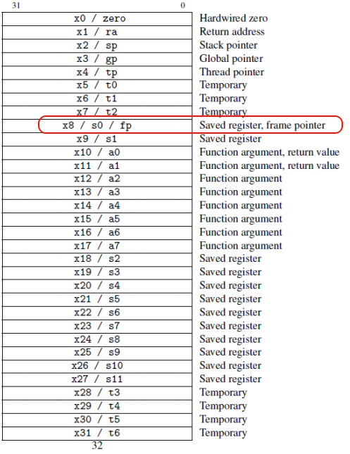
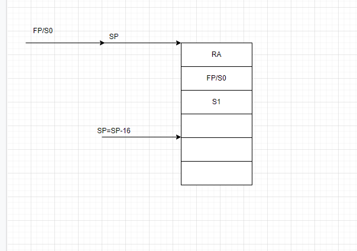
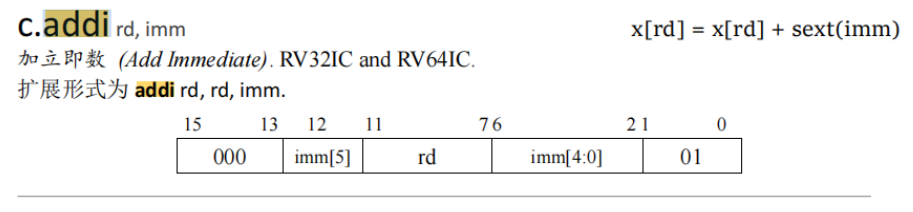

# RV BACKTRACE

## 简介

本文主要讲述RV BACKTRACE 的内部主要原理

没有接触过rvbacktrace可以看下面两篇文章，理解一下如何使用RVBACKTRACE

RVBacktrace RISC-V极简栈回溯组件：https://club.rt-thread.org/ask/article/64bfe06feb7b3e29.html

RVBacktrace RISC-V极简栈回溯组件V1.2：https://club.rt-thread.org/ask/article/09737357e4a95b06.html

## RVBACKTRACE

 https://github.com/Yaochenger/RvBacktrace

rvbacktrace更多的利用RISCV的一些特性

组件支持两种方式栈回溯，默认使用配置简单的方式一。

方式一：不添加编译参数，通过调用栈结构进行栈回溯，默认是方式一。

优点：不额外占用系统寄存器 缺点：增加代码空间，效率较方式二较低

方式二：通过添加编译参数的方式，基于FP寄存器进行栈回溯。

优点：几乎不增加代码空间 缺点：占用s0寄存器，


rvbacktrace有两种方法，一种是编译器编译的时候，添加`-fno-omit-frame-pointer`, 另一个是编译器在默认情况下，会优化frame-pointer。

我们来理解一下什么是`-fno-omit-frame-pointer`

- -fno-omit-frame-pointer: 这里有个no-omit 大概意思是，不要忽略，或者不要优化，frame-pointer是一个寄存器，代表是帧指针寄存器。
- 默认情况下是-fomit-frame-pointer: 这里是忽略帧指针。

先讲下两个配置，类似于一个是优化掉帧指针(代码中不保存帧指针)，一个是`-fno-omit-frame-pointer` 不优化帧指针。

我们来看下优化和不优化的区别：

这个是加了`-fno-omit-frame-pointer`的函数：

```
void rvbacktrace_fno()
{
8000e02c:	1141                	addi	sp,sp,-16
8000e02e:	c606                	sw	ra,12(sp)
8000e030:	c422                	sw	s0,8(sp)
8000e032:	c226                	sw	s1,4(sp)
8000e034:	0800                	addi	s0,sp,16
```

这个是没有加`-fno-omit-frame-pointer`的函数：

```
void rvbacktrace_fno()
{
8000d7c6:	1141                	addi	sp,sp,-16
8000d7c8:	c606                	sw	ra,12(sp)
8000d7ca:	c422                	sw	s0,8(sp)
```

差异是什么呢？多了两条指令

```
8000e032:	c226                	sw	s1,4(sp)
8000e034:	0800                	addi	s0,sp,16
```

来讲下大概原理：

加了`-fno-omit-frame-pointer` 之后，s0寄存器就不能用来通用功能了，只能用来作为fp使用，用来保存sp的初始值(即进函数之前的值)



帧指针就是用来保存上一次的SP的地址，然后该地址可以用来读到上一次函数的地址。ra地址就是类似于ARM中的LR的地址，就是返回的函数的地址。

从下面这张图中可以看到，加了`-fno-omit-frame-pointer` 之后，默认当前代码的S0就是进该函数刚进来的时候SP值，然后固定下面两个寄存器保存的是RA和FP这个位置没有变



所以对于`rv_backtrace_fno.c`中的核心函数，就可以按照下面的写法写。

```
        sp = (unsigned long) _backtrace_threadn->sp;
        fp = ((rt_ubase_t *) (_backtrace_threadn->sp))[BACKTRACE_FP_POS]; // get current frame pointer
        while (1)
        {
            frame = (struct stackframe *) (fp - BACKTRACE_LEN); //   get frame pointer

            if ((uint32_t *) frame > (uint32_t *) (uintptr_t) _rt_eusrstack)
            {
                rvstack_frame_len = num;
                rvbacktrace_addr2line((uint32_t *) &rvstack_frame[0]);
                num = 0;
                break;
            }

            sp = fp;  // get stack pointer
            fp = frame->s_fp; // get frame pointer
            ra = frame->s_ra; // get return address
            pc = frame->s_ra - 4; // get program counter

            //  print stack interval, return address, program counter
            BACKTRACE_PRINTF("[%d]Stack interval :[0x%016lx - 0x%016lx]  ra 0x%016lx pc 0x%016lx\n", num, sp, fp, ra, pc);
            rvstack_frame[num] = pc; // save stack frame address
            num++;
        }
```

### RVBACKTRACE的通用改法

在编译器还没有加`-fno-omit-frame-pointer` 代码中需要从PC往上找

这里第一步就是找到1141这条指令，然后计算出立即数16，根据当前的SP值，然后计算出进函数之前的SP值。

```
void rvbacktrace_fno()
{
8000d7c6:	1141                	addi	sp,sp,-16
8000d7c8:	c606                	sw	ra,12(sp)
8000d7ca:	c422                	sw	s0,8(sp)
```

在函数`riscv_backtraceFromStack` 中就是计算SP值，计算也是为了适配64bit和32bit的RISCV，计算出SP的原始值，然后再往上继续找对应的函数，保存下来。

```
   /* 1. scan code, find lr pushed */
    for (i = 0; i < BT_FUNC_LIMIT;) {
        /* FIXME: not accurate from bottom to up. how to judge 2 or 4byte inst */
        //CodeAddr = (char *)(((long)PC & (~0x3)) - i);
        //非对齐访问
        CodeAddr = (char *)(PC - i);
        ins32 = *(unsigned int *)(CodeAddr);
        if ((ins32 & 0x3) == 0x3) {
            ins16 = *(unsigned short *)(CodeAddr - 2);
            if ((ins16 & 0x3) != 0x3) {
                i += 4;
                framesize = riscv_backtrace_framesize_get1(ins32);
                if (framesize >= 0) {
                    CodeAddr += 4;
                    break;
                }
                continue;
            }
        }
        i += 2;
        ins16 = (ins32 >> 16) & 0xffff;
        framesize = riscv_backtrace_framesize_get(ins16);
        if (framesize >= 0) {
            CodeAddr += 2;
            break;
        }
    }

    if (i == BT_FUNC_LIMIT) {
        /* error branch */
        #ifdef BACKTRACE_PRINTF
            BACKTRACE_PRINTF("Backtrace fail!\r\n");
        #endif
        return -1;
    }

    /* 2. scan code, find ins: sd ra,24(sp) or sd ra,552(sp) */
    for (i = 0; CodeAddr + i < PC;) {
        ins32 = *(unsigned int *)(CodeAddr + i);
        if ((ins32 & 0x3) == 0x3) {
            i += 4;
            offset = riscv_backtrace_ra_offset_get1(ins32);
            if (offset >= 0) {
                break;
            }
        } else {
            i += 2;
            ins16 = ins32 & 0xffff;
            offset = riscv_backtrace_ra_offset_get(ins16);
            if (offset >= 0) {
                break;
            }
        }
    }
```

这段代码，根据当前的PC值，知道当前的函数的进来的时候SP开启的地址。计算每次SP开始的地址和结束地址，然后找到上一次的PC值，然后再往上一个函数查找。

### RVBACKTRACE的加`-fno-omit-frame-pointer`的用法

加了编译参数`-fno-omit-frame-pointer` 之后，进函数之前就会记录当前的SP的值，经过验证，大部分的RISCV64平台的这个选项是默认打开的，所以RISCV64可以用这个方法，估计RISCV64平台一般都比较大。这个时候我们就要用`rv_backtrace_fno.c` 这个文件来处理栈回溯了。

在RVBACKTRACE中就要开启`BACKTRACE_USE_FP` 这个宏

```
void rvbacktrace_fno()
{
8000e02c:	1141                	addi	sp,sp,-16
8000e02e:	c606                	sw	ra,12(sp)
8000e030:	c422                	sw	s0,8(sp)
8000e032:	c226                	sw	s1,4(sp)
8000e034:	0800                	addi	s0,sp,16
```

S0的值就是保存的栈信息。默认这个寄存器就给栈回溯用。

主要实现函数如下，获取fp的值为`__builtin_frame_address` 这是一个libc的库函数

```
    fp = (unsigned long)__builtin_frame_address(0); //  get current frame pointer
    while (1)
    {
        frame = (struct stackframe *)(fp - BACKTRACE_LEN); //   get frame pointer

        if ((uint32_t *)frame > (uint32_t *)(uintptr_t)_rt_eusrstack)
        {
            rvstack_frame_len = num;
            return;
        }

        sp = fp;  // get stack pointer
        fp = frame->s_fp; // get frame pointer
        ra = frame->s_ra; // get return address
        pc = frame->s_ra - 4; // get program counter

        //  print stack interval, return address, program counter
        BACKTRACE_PRINTF("[%d]Stack interval :[0x%016lx - 0x%016lx]  ra 0x%016lx pc 0x%016lx\n", num, sp, fp, ra, pc);
        rvstack_frame[num] = pc; // save stack frame address
        num++;
    }
```

看下反汇编

```
 36           fp = (unsigned long)__builtin_frame_address(0); //  get current frame pointer
8000b09c:   mv      s2,s0
```

其实就是读取s0的值。

因为有s0保存了进入函数的时候的栈地址，就很容易找到SP进来的时候初始地址，然后也比较方便找到上一次的RA和S0。代码实现起来就比较方便，不需要一直解析反汇编。

其他的线程回溯的方法也是类似的。


## 汇编指令过滤方法

知道了上面的两种方法之后，比较难的其实是第一种，没有编译选项的时候，如何根据PC指针找到栈的地址。

```
void rvbacktrace_fno()
{
8000d7c6:	1141                	addi	sp,sp,-16
8000d7c8:	c606                	sw	ra,12(sp)
8000d7ca:	c422                	sw	s0,8(sp
```

例如上面的函数，我们就要知道两个命令`addi	sp,sp,-16` 和`sw	ra,12(sp)`

我们翻阅RISCV手册之后，看到如下的命令：



当然这个是压缩命令

主要的是计算出它的立即数，imm

https://riscv.github.io/riscv-isa-manual/snapshot/unprivileged/#_integer_register_immediate_instructions

```
static int riscv_backtrace_framesize_get1(unsigned int inst)
{
    unsigned int imm = 0;
    /* addi sp, sp, -im
     * example
     * d1010113             addi    sp,sp,-752
     * from spec addi FROM https://riscv.github.io/riscv-isa-manual/snapshot/unprivileged/#_integer_register_immediate_instructions
     * bit[31:20] = imm[11:0]
     * bit[19:15] = 00010
     * bit[14:12] = 000
     * bit[11:7]  = 00010
     * bit[6:0]  = 0010011
     */
    if ((inst & 0x800FFFFF) == 0x80010113) {
        imm = (inst >> 20) & 0x7FF;
        imm = (~imm & 0x7FF) + 1;
#if __riscv_xlen == 64
        return imm >> 3; // RV64: 以 8 字节为单位
#else
        return imm >> 2;  // RV32: 以 4 字节为单位
#endif
    }

    return -1;
}
```

## CM BACKTRACE

https://github.com/armink-rtt-pkgs/CmBacktrace

CM backtrace 核心代码：

```
            /* first depth is PC */
            buffer[depth++] = regs.saved.pc;
            /* fix the LR address in thumb mode */
            pc = regs.saved.lr - 1;
            if ((pc >= code_start_addr) && (pc <= code_start_addr + code_size) && (depth < CMB_CALL_STACK_MAX_DEPTH)
                    && (depth < size)) {
                buffer[depth++] = pc;
                regs_saved_lr_is_valid = true;
            }
            
            
size_t cm_backtrace_call_stack_any(uint32_t *buffer, size_t size, uint32_t sp, uint32_t stack_start_addr, uint32_t stack_size)
{
    uint32_t pc;
    size_t depth = 0;
    /* copy called function address */
    for (; sp < stack_start_addr + stack_size; sp += sizeof(size_t)) {
        /* the *sp value may be LR, so need decrease a word to PC */
        pc = *((uint32_t *) sp) - sizeof(size_t);
        /* the Cortex-M using thumb instruction, so the pc must be an odd number */
        if (pc % 2 == 0) {
            continue;
        }
        /* fix the PC address in thumb mode */
        pc = *((uint32_t *) sp) - 1;
        if ((pc >= code_start_addr + sizeof(size_t)) && (pc <= code_start_addr + code_size) && (depth < CMB_CALL_STACK_MAX_DEPTH)
                /* check the the instruction before PC address is 'BL' or 'BLX' */
                && disassembly_ins_is_bl_blx(pc - sizeof(size_t)) && (depth < size)) {
            /* the second depth function may be already saved, so need ignore repeat */
            buffer[depth++] = pc;
        }
    }

    return depth;
}
static bool disassembly_ins_is_bl_blx(uint32_t addr) {
    uint16_t ins1 = *((uint16_t *)addr);
    uint16_t ins2 = *((uint16_t *)(addr + 2));

#define BL_INS_MASK         0xF800
#define BL_INS_HIGH         0xF800
#define BL_INS_LOW          0xF000
#define BLX_INX_MASK        0xFF00
#define BLX_INX             0x4700

    if ((ins2 & BL_INS_MASK) == BL_INS_HIGH && (ins1 & BL_INS_MASK) == BL_INS_LOW) {
        return true;
    } else if ((ins2 & BLX_INX_MASK) == BLX_INX) {
        return true;
    } else {
        return false;
    }
}
```

用一个数组`buffer[]` 用来存放对应的PC和回溯的地址

然后从LR往上进行检查PC的值`-1` 之后，判断PC是否在代码开始段和结束段

如果在，则放到回溯的地址里面。