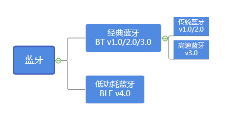
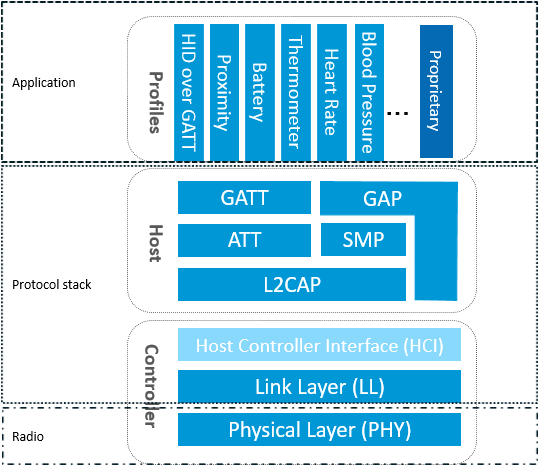

# 蓝牙协议栈整体框架

蓝牙：一种支持设备短距离通信（一般10m内）的无线电技术。能在包括移动电话、PDA、无线耳机、笔记本电脑、相关外设等众多设备之间进行无线信息交换。利用“蓝牙”技术，能够有效地简化移动通信终端设备之间的通信，也能够成功地简化设备与因特网Internet之间的通信，从而数据传输变得更加迅速高效，为无线通信拓宽道路。蓝牙采用分散式网络结构以及快跳频和短包技术，支持点对点及点对多点通信，工作在全球通用的2.4GHz ISM（即工业、科学、医学）频段。其数据速率为1Mbps。采用时分双工传输方案实现全双工传输。

一般而言，我们把某个协议的实现代码成为协议栈，蓝牙协议栈就是实现蓝牙协议的代码，当前的蓝牙协议分为基础率/增强数据率（BR/EDR）和低耗能（LE）两种技术类型。

低功耗蓝牙（BLE）和经典蓝牙（Classic Bluetooth）都使用2.4GHz ISM波段。它们还使用调频来发送RF能量。但相互之间是不兼容的，低功耗蓝牙使用2MHz频宽的40频道，而经典蓝牙使用1MHz频宽的79频道。

下图展示了BluetoothBR/EDR、BluetoothSmart Ready和 Bluetooth Smart (Bluetooth Low Energy)主要应用场景。

本文就重点介绍一下BLE蓝牙。

要实现一个BLE应用，首先需要一个支持BLE射频的芯片，然后还需要提供一个与此芯片配套的BLE协议栈，最后在协议栈上开发自己的应用。可以看出BLE协议栈是连接芯片和应用的桥梁，是实现整个BLE应用的关键。那BLE协议栈具体包含哪些功能呢？简单来说，BLE协议栈主要用来对你的应用数据进行层层封包，以生成一个满足BLE协议的空中数据包，也就是说，把应用数据包裹在一系列的帧头（header）和帧尾（tail）中。

蓝牙协议规定了两个层次的协议，分别为蓝牙核心协议（Bluetooth Core）和蓝牙应用层协议（Bluetooth Application）。蓝牙核心协议关注对蓝牙核心技术的描述和规范，它只提供基础的机制，并不关心如何使用这些机制；蓝牙应用层协议，是在蓝牙核心协议的基础上，根据具体的应用需求，百花齐放，定义出各种各样的策略，如FTP、文件传输、局域网等等。

而蓝牙核心协议（Bluetooth Core）又包含BLE Controller和BLE Host两部分。这两部分在不同的蓝牙技术中（BR/EDR、AMP、LE），承担角色略有不同，但大致的功能是相同的。Controller负责定义RF、Baseband等偏硬件的规范，并在这之上抽象出用于通信的逻辑链路（Logical Link）；Host负责在逻辑链路的基础上，进行更为友好的封装，这样就可以屏蔽掉蓝牙技术的细节，让Bluetooth Application更为方便的使用。

如图所示，BLE协议栈包含如下部分：

- PHY层

  PHY层用来指定BLE所用的无线频段，调制解调方式和方法等。PHY层做得好不好，直接决定整个BLE芯片的功耗，灵敏度以及selectivity等射频指标。

- LL层

  LL层是整个BLE协议栈的核心，也是BLE协议栈的难点和重点。像Nordic的BLE协议栈能同时支持20个link（连接），就是LL层的功劳。LL层要做的事情非常多，比如具体选择哪个射频通道进行通信，怎么识别空中数据包，具体在哪个时间点把数据包发送出去，怎么保证数据的完整性，ACK如何接收，如何进行重传，以及如何对链路进行管理和控制等等。LL层只负责把数据发出去或者收回来，对数据进行怎样的解析则交给上面的GAP或者GATT。

- HCI层

  HCI是可选的，HCI主要用于2颗芯片实现BLE协议栈的场合，用来规范两者之间的通信协议和通信命令等。

- GAP层

  GAP是对LL层payload（有效数据包）如何进行解析的两种方式中的一种，而且是最简单的那一种。GAP简单的对LL payload进行一些规范和定义，因此GAP能实现的功能极其有限。GAP目前主要用来进行广播，扫描和发起连接等。

- L2CAP层

  L2CAP对LL进行了一次简单封装，LL只关心传输的数据本身，L2CAP就要区分是加密通道还是普通通道，同时还要对连接间隔进行管理。

- SMP层

  SMP用来管理BLE连接的加密和安全的，如何保证连接的安全性，同时不影响用户的体验，这些都是SMP要考虑的工作。

- ATT层

  ATT层用来定义用户命令及命令操作的数据，比如读取某个数据或者写某个数据。BLE协议栈中，开发者接触最多的就是ATT。BLE引入了attribute概念，用来描述一条一条的数据。Attribute除了定义数据，同时定义该数据可以使用的ATT命令，因此这一层被称为ATT层。

- GATT层

  GATT用来规范attribute中的数据内容，并运用group（分组）的概念对attribute进行分类管理。没有GATT，BLE协议栈也能跑，但互联互通就会出问题，也正是因为有了GATT和各种各样的应用profile，BLE摆脱了ZigBee等无线协议的兼容性困境，成了出货量最大的2.4G无线通信产品。

