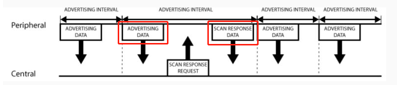

# 蓝牙协议GAP层介绍

[01-蓝牙协议栈整体框架](./01-蓝牙协议栈整体框架.md) 我们描述了蓝牙协议栈的整体架构。

GAP（Generic Access Profile），它在用来控制设备连接和广播。GAP 使你的设备被其它设备可见，并决定了你的设备是否可以或者怎样与合同设备进行交互。例如 Beacon 设备就只是向外广播，不支持连接，小米手环就等设备就可以与中心设备连接。

1. 设备角色

   GAP 给设备定义了若干角色，其中主要的两个是：外围设备（Peripheral）和中心设备（Central）。
   外围设备：这一般就是非常小或者简单的低功耗设备，用来提供数据，并连接到一个更加相对强大的中心设备。例如小米手环。
   中心设备：中心设备相对比较强大，用来连接其他外围设备。例如手机等。

   

2. 广播数据

   在 GAP 中外围设备通过两种方式向外广播数据： Advertising Data Payload（广播数据）和 Scan Response Data Payload（扫描回复），每种数据最长可以包含 31 byte。这里广播数据是必需的，因为外设必需不停的向外广播，让中心设备知道它的存在。扫描回复是可选的，中心设备可以向外设请求扫描回复，这里包含一些设备额外的信息，例如设备的名字。

   

3. 广播流程

   

   从上图中我们可以清晰看出广播数据和扫描回复数据是怎么工作的。外围设备会设定一个广播间隔，每个广播间隔中，它会重新发送自己的广播数据。广播间隔越长，越省电，同时也不太容易扫描到。

   

4. 广播的网络拓扑结构

   大部分情况下，外设通过广播自己来让中心设备发现自己，并建立 GATT 连接，从而进行更多的数据交换。

   还有些情况是不需要连接的，只要外设广播自己的数据即可。用这种方式主要目的是让外围设备，把自己的信息发送给多个中心设备。因为基于 GATT 连接的方式的，只能是一个外设连接一个中心设备。

   广播工作模式下的网络拓扑图如下：

   

