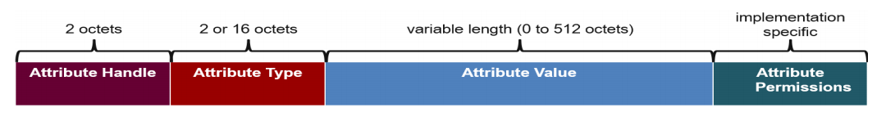
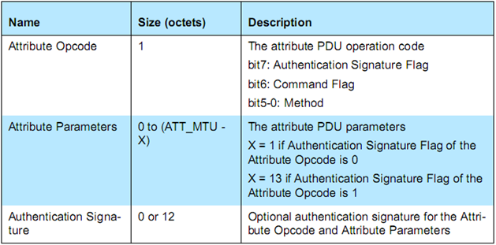
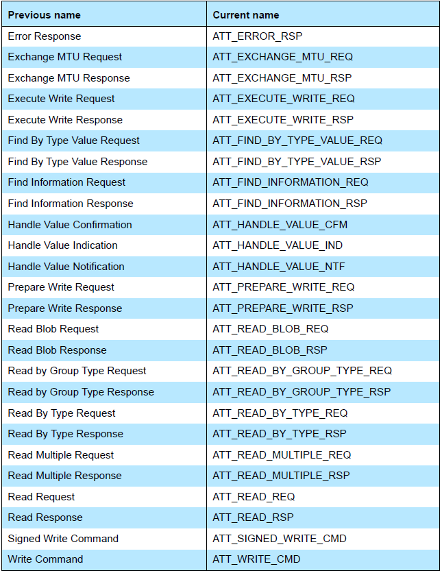
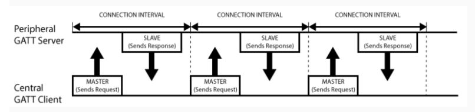
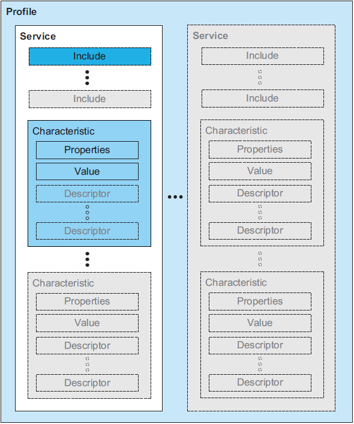
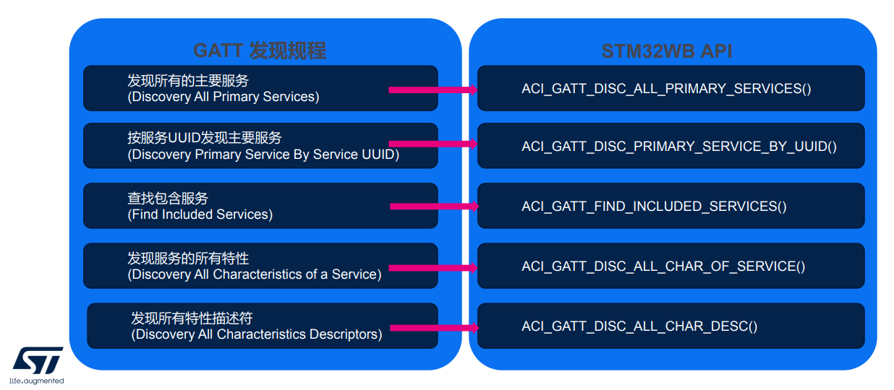

# 蓝牙协议ATT、GATT层介绍

[01-蓝牙协议栈整体框架](./01-蓝牙协议栈整体框架.md) 我们描述了蓝牙协议栈的整体架构。

* BLE Client/Server架构

GATT封装了ATT协议，应用程序调用的都是GATT API，而GATT又调用了ATT API。在讲解ATT和GATT之前，我们先看一下蓝牙核心规范中一个重要概念：Client/Server（客户端/服务端）架构：


如上图所示，BLE采用了Client/Server (C/S) 架构来进行数据交互，C/S架构是一种非常常见的架构，在我们身边随处可见，比如我们经常用到的浏览器和服务器也是一种C/S架构，这其中浏览器是客户端Client，服务器是服务端Server。

BLE与此类似，一般而言设备提供服务，因此设备是Server，手机使用设备提供的服务，因此手机是Client。比如智能手环，它可以提供 “心率” 数据服务，因此是一个Server，而手机则可以请求“心率”数据以显示在手机上，因此手机是一个Client。

服务是以数据为载体的，所以说Server提供服务其实就是提供各种有价值的数据。

客户端要访问某一个数据，就发送一个request/请求（其实就是一条命令或者PDU），服务端再把该数据返回给客户端（一条response/响应命令或者PDU），这就是C/S架构。 

* ATT

  ATT（Attribute Protocol），属性协议，前面说过，每个蓝牙设备就是用来提供服务的，而服务就是众多数据的合集，这个合集可以称为数据库，数据库里面每个条目都是一个Attribute。

  Attribute的格式参见下图：

  

  Attribute包含以下元素：

  * Attribute Handle，Attribute句柄，16-bit长度。Client要访问Server的Attribute，都是通过这个句柄来访问的，也就是说ATT PDU一般都包含handle的值。

  * Attribute type，Attribute类型，2字节或者16字节长。在BLE中我们使用UUID来定义数据的类型，UUID是128 bit的，所以我们有足够的UUID来表达万事万物。

    其中有一个UUID非常特殊，它被蓝牙联盟采用为官方UUID，这个UUID如下所示：

    > UUID = 0x0000xxxx-0000-1000-8000-00805F9B34FB；

    

    ***Attribute type一般是由service和characteristic规格来定义，站在蓝牙协议栈角度来看，ATT层定义了一个通信的基本框架，数据的基本结构，以及通信的指令，而GATT层就是定义Service和Characteristic，GATT层用来赋予每个数据一个具体的内涵，让数据变得有结构和意义。换句话说，没有GATT层，低功耗蓝牙也可以通信起来，但会产生兼容性问题以及通信的低效率。***

    

  * Attribute value，就是数据真正的值，0到512字节长。

  * Attribute permissions，Attribute的权限属性，权限属性不会直接在空口包中体现，而是隐含在ATT命令的操作结果中。

    目前主要有以下几种的权限：

    1) Open，直接可以读或者写

    2) No Access，禁止读或者写

    3) Authentication，需要配对才能读或者写，由于配对有多种类型，因此Authentication又可以衍生多种子类型，比如带不带MITM，有没有LESC。

    4) Authorization，跟open一样，不过Server返回Attribute的值之前需要应用先授权，也就是说应用可以在回调函数里面去修改读或者写的原始值。

    举一个简单的例子：

    假设一个Attribute Read属性设为open（即读操作不需要任何权限），那么Client去读这个Attribute时Server将直接返回Attribute的值；如果这个Attribute Read属性设为authentication（即需要配对才能访问），如果Client没有与Server配对而直接去访问这个Attribute，那么Server会返回一个错误码：告诉Client你的权限不够，此时Client会对Server发起配对请求，以满足这个Attribute的读属性要求，从而在第二次读操作时Server将把相应的数据返回给Client。

    

  前面我们说C/S架构时说了客户端要访问某一个数据，就发送一个request/请求（其实就是一条命令或者PDU），服务端再把该数据返回给客户端（一条response/响应命令或者PDU）。

  Attribute PDU格式如下：

   

  Attribute OpCode中的Method主要包含以下6种：

  ```
  - Requests      : Client->Server, 请求回应 
  - Responses     : Server->Client, 响应请求. 
  - Commands      : Client->Server, 命令 
  - Notifications : Server->Client, 服务端通知 
  - Indications   : Server->Client, 请求确认 
  - Confirmations : Client->Server, Ind确认
  ```

​	Attribute Protocol PDU，当前支持的全部Request如下图：

​	

​	**后面我们再具体分析每一种Attribute Protocol PDU的详细数据交互内容。**

- GATT

  GATT 的全名是 Generic Attribute Profile（通用属性协议），它定义两个 BLE 设备通过叫做 Service 和 Characteristic 的东西进行通信。

  1) 连接的网络拓扑

  

  如上图所示，一个外设只能连接一个中心设备，而一个中心设备可以连接多个外设。ConnectedTopology一旦建立起了连接，通信就是双向的了，对比前面的 GAP 广播的网络拓扑，GAP 通信是单向的。如果你要让两个设备外设能通信，就只能通过中心设备中转。

  

  2) GATT 通信事务 

  GATT 通信的双方是 C/S 关系。外设作为 GATT 服务端（Server），它维持了 ATT 的查找表以及 service 和 characteristic 的定义。中心设备是 GATT 客户端（Client），它向 Server 发起请求。需要注意的是，所有的通信事件，都是由客户端（也叫主设备，Master）发起，并且接收服务端（也叫从设备，Slave）的响应。

  一旦连接建立，外设将会给中心设备建议一个连接间隔（Connection Interval）,这样，中心设备就会在每个连接间隔尝试去重新连接，检查是否有新的数据。但是，这个连接间隔只是一个建议，你的中心设备可能并不会严格按照这个间隔来执行，例如你的中心设备正在忙于连接其他的外设，或者中心设备资源太忙。

  

  下图展示一个外设（GATT 服务端）和中心设备（GATT 客户端）之间的数据交换流程，可以看到的是，每次都是主设备发起请求：

  

  

  3) GATT 结构

  GATT指定了数据交互的结构(Structure)；这个结构体定义了一些基本元素，如Service、Characteristic
  这些元素存在于Attribute中。

  

  如上图所示，GATT中最上层是Profile，Profile由一个或多个服务(Service)组成服务是由Characteristics组成，或是其他服务的引用(Reference)Characteristic包含一个值(Value)，可能包含该Value的相关信息。

  * Service包含如下元素

    * 主要服务（Primery Services），暴露设备的主要可用功能；

    * 次要服务（Secondary Services），旨在由主要服务引用；

    * 扩展服务，保证扩展某项Service时的兼容性；

    * 结合服务，引用其他服务，融合在一起，称为其他组合的行为；

      

  * Characteristic包含如下元素

    * 声明（Declaration），标识一个Characteristic的开始；
      * 性质（读取/写入/通知/指示/广播/命令/签名认证）；
      * 数值句柄：特性值的存储位置；
      * 特性UUID；
    * 值（Value），包含此特性的实际值；
    * 描述符（Descriptors），描述符包含此特性的附加信息或配置；
      * 附加信息；
      * 任何数量；
      * 任何顺序；
      * 可以是供应商特定的；

STM32WB中GATT程序中发现Service、Characteristic的API如下图：



