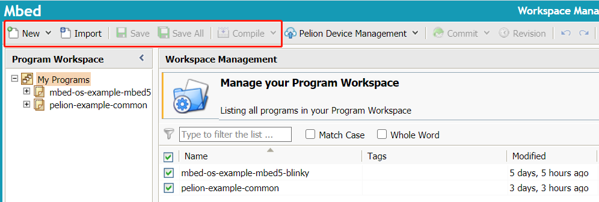

# mbedOS介绍

## 简介

Arm Mbed OS 是 Arm 专门为物联网设备而设计的开源嵌入式操作系统，主要面向 ARM Cortex-M 系列微控制器，非常适合涉及智能城市、智能家庭和穿戴式设备等领域的应用程序。

当前最新版本为`Mbed OS 6.3`。

相比于其他嵌入式操作系统，Arm Mbed OS 的主要优势在于：

* 安全性：提供 mbed TLS 和 mbed uVisor 安全机制；
* 连接性：支持多种协议栈，包括 Bluetooth LE、Wi-Fi、6LoWPAN, Thread、Lora等等；
* 完整的工具链支持：提供在线 IDE、mbed CLI、Mbed Studio和第三方 IDE；
* 良好的社区生态；

整体的框架图如下：  

应用代码采用C++编写，使用Mbed OS提供的API，在不同的微处理器上按照统一的编程实现。便于应用的开发。

## 开发工具

* [在线IDE](https://ide.mbed.com/compiler)

使用在线IDE无需安装软件，比较方便，但是无法进行调试，且代码会在云端存储，用来测试官方的示例还是很便捷的，能快速搭建产品原型。

**注：使用在线IDE需要注册开发账号**

在线IDE界面如下图：  

提供了选择开发板、导入指定的官方例程、编译、导出工程等功能；

* Mbed CLI

Mbed CLI是官方提供的命令行开发工具，详细安装与使用参见[mbedOS移植到STM32L4R5ZI开发板](./02.mbedOS移植到STM32L4R5ZI开发板.md)文档中相关章节。

* Mbed Studio 和 第三方IDE

Mbed Studio是官方提供的桌面IDE，安装与使用参见[官方说明文档](https://os.mbed.com/docs/mbed-studio/current/getting-started/index.html)