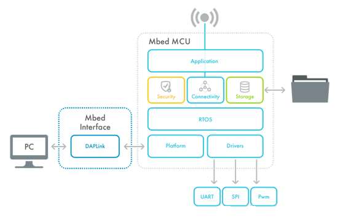

# mbedOS API说明

mbedOS的中间层接口都是以C++的接口形式实现，也就是说对于某一类对象或者操作都会封装成类。所以API都是以类函数和静态函数提供。当然重载的操作符Operator，例如=，()，+/-都是很常见的，它可以非常直观的操作设备和对象。

前面我们介绍了mbedOS的整体框架：  

下面我们自顶向下介绍这个框架图每一部分提供的类：

* RTOS  
  * Kernel
    * [Kernel interface functions](https://os.mbed.com/docs/mbed-os/v6.4/apis/kernel-interface-functions.html)
  * 任务管理  
    * [Thread](https://os.mbed.com/docs/mbed-os/v6.4/apis/thread.html)
    * [ThisThread](https://os.mbed.com/docs/mbed-os/v6.4/apis/thisthread.html)
    * [Idle loop](https://os.mbed.com/docs/mbed-os/v6.4/apis/idle-loop.html)
  * 事件管理
    * [Event](https://os.mbed.com/docs/mbed-os/v6.4/apis/event-handling-apis.html)
    * [EventFlags](https://os.mbed.com/docs/mbed-os/v6.4/apis/eventflags.html)
    * [UserAllocatedEvent](https://os.mbed.com/docs/mbed-os/v6.4/apis/userallocatedevent.html)
  * Thread间通信
    * [Mail](https://os.mbed.com/docs/mbed-os/v6.4/apis/mail.html)
    * [Queue](https://os.mbed.com/docs/mbed-os/v6.4/apis/queue.html)
  * Thread间同步
    * [Mutex](https://os.mbed.com/docs/mbed-os/v6.4/apis/mutex.html)
    * [Semaphore](https://os.mbed.com/docs/mbed-os/v6.4/apis/semaphore.html)
    * [EventQueue](https://os.mbed.com/docs/mbed-os/v6.4/apis/eventqueue.html)

* Security
  * [DeviceKey](https://os.mbed.com/docs/mbed-os/v6.4/apis/security-apis.html)
  * [Mbed Crypto](https://os.mbed.com/docs/mbed-os/v6.4/apis/mbed-crypto.html)
  * [PSA initial attestation](https://os.mbed.com/docs/mbed-os/v6.4/apis/psa-initial-attestation.html)
  * [PSA lifecycle](https://os.mbed.com/docs/mbed-os/v6.4/apis/psa-lifecycle.html)
  * [TLS](https://os.mbed.com/docs/mbed-os/v6.4/apis/tls.html)

* Connectivity
  * Network Socket
    * [Non-IP cellular socket](https://os.mbed.com/docs/mbed-os/v6.4/apis/network-socket-apis.html)
    * [Socket](https://os.mbed.com/docs/mbed-os/v6.4/apis/socket.html)
    * [SocketAddress](https://os.mbed.com/docs/mbed-os/v6.4/apis/socketaddress.html)
    * [SocketStats](https://os.mbed.com/docs/mbed-os/v6.4/apis/socketstats.html)
    * [TCPSocket](https://os.mbed.com/docs/mbed-os/v6.4/apis/tcpsocket.html)
    * [UDPSocket](https://os.mbed.com/docs/mbed-os/v6.4/apis/udpsocket.html)
  * NetWork Interface
    * [Cellular](https://os.mbed.com/docs/mbed-os/v6.4/apis/network-interface-apis.html)
    * [Ethernet](https://os.mbed.com/docs/mbed-os/v6.4/apis/ethernet.html)
    * [Mesh](https://os.mbed.com/docs/mbed-os/v6.4/apis/mesh-api.html)
    * [Network status](https://os.mbed.com/docs/mbed-os/v6.4/apis/network-status.html)
    * [Wi-Fi](https://os.mbed.com/docs/mbed-os/v6.4/apis/wi-fi.html)
  * Secure Socket
    * [DTLSSocket](https://os.mbed.com/docs/mbed-os/v6.4/apis/secure-socket-apis.html)
    * [TLSSocket](https://os.mbed.com/docs/mbed-os/v6.4/apis/tlssocket.html)
  * DNS
    * [DNS Resolver](https://os.mbed.com/docs/mbed-os/v6.4/apis/dns-apis.html)
  * Bluetooth(BLE)
    * [BatteryService](https://os.mbed.com/docs/mbed-os/v6.4/apis/bluetooth-apis.html)
    * [BLE](https://os.mbed.com/docs/mbed-os/v6.4/apis/ble.html)
    * [GAP](https://os.mbed.com/docs/mbed-os/v6.4/apis/gap.html)
    * [GattClient](https://os.mbed.com/docs/mbed-os/v6.4/apis/gattclient.html)
    * [GattServer](https://os.mbed.com/docs/mbed-os/v6.4/apis/gattserver.html)
    * [HeartRateService](https://os.mbed.com/docs/mbed-os/v6.4/apis/heartrateservice.html)
    * [SecurityManager](https://os.mbed.com/docs/mbed-os/v6.4/apis/securitymanager.html)
  * NFC
    * [MessageBuilder](https://os.mbed.com/docs/mbed-os/v6.4/apis/nfc-apis.html)
    * [MessageParser](https://os.mbed.com/docs/mbed-os/v6.4/apis/messageparser.html)
    * [NFCController](https://os.mbed.com/docs/mbed-os/v6.4/apis/nfccontroller.html)
    * [NFC EEPROM](https://os.mbed.com/docs/mbed-os/v6.4/apis/nfc-eeprom.html)
    * [SimpleMessageParser](https://os.mbed.com/docs/mbed-os/v6.4/apis/simplemessageparser.html)
  * LoRaWAN
    * [LoRaWANInterface](https://os.mbed.com/docs/mbed-os/v6.4/apis/lorawan-apis.html)
    * [LoRaRadio](https://os.mbed.com/docs/mbed-os/v6.4/apis/loraradio.html)

* Data Storage
  * File System API
    * [Dir](https://os.mbed.com/docs/mbed-os/v6.4/apis/file-system-apis.html)
    * [FATFileSystem](https://os.mbed.com/docs/mbed-os/v6.4/apis/fatfilesystem.html)
    * [File](https://os.mbed.com/docs/mbed-os/v6.4/apis/file.html)
    * [FileSystem](https://os.mbed.com/docs/mbed-os/v6.4/apis/filesystem.html)
    * [KVStore](https://os.mbed.com/docs/mbed-os/v6.4/apis/kvstore.html)
    * [kvstore_global_api](https://os.mbed.com/docs/mbed-os/v6.4/apis/static-global-api.html)
    * [LittleFileStstem](https://os.mbed.com/docs/mbed-os/v6.4/apis/littlefilesystem.html)
  * BlockDevice API 

* Platfrom
  * Time
    * [RTC](https://os.mbed.com/docs/mbed-os/v6.4/apis/time-apis.html)
    * [Ticker](https://os.mbed.com/docs/mbed-os/v6.4/apis/ticker.html)
    * [Time](https://os.mbed.com/docs/mbed-os/v6.4/apis/time.html)
    * [Timeout](https://os.mbed.com/docs/mbed-os/v6.4/apis/timeout.html)
    * [Timer](https://os.mbed.com/docs/mbed-os/v6.4/apis/timer.html)
    * [Wait](https://os.mbed.com/docs/mbed-os/v6.4/apis/wait)
  * Power
    * [DeepSleepLock](https://os.mbed.com/docs/mbed-os/v6.4/apis/power-apis.html)
    * [LowerPowerTicker](https://os.mbed.com/docs/mbed-os/v6.4/apis/lowpowerticker.html)
    * [LowerPowerTimeout](https://os.mbed.com/docs/mbed-os/v6.4/apis/lowpowertimeout.html)
    * [LowerPowerTimer](https://os.mbed.com/docs/mbed-os/v6.4/apis/lowpowertimer.html)
    * [PowerManagement](https://os.mbed.com/docs/mbed-os/v6.4/apis/power-management-sleep.html)
  * Memory
    * [mbed_mem_trace](https://os.mbed.com/docs/mbed-os/v6.4/apis/memory-apis.html)
    * [mpug_mgmt](https://os.mbed.com/docs/mbed-os/v6.4/apis/mpu-management.html)
    * [MemoryPool](https://os.mbed.com/docs/mbed-os/v6.4/apis/memorypool.html)
    * [mbed_stats](https://os.mbed.com/docs/mbed-os/v6.4/apis/mbed-statistics.html)
  * Other Platform APIS
    * [Assert](https://os.mbed.com/docs/mbed-os/v6.4/apis/other-platform-apis.html)
    * [ATCmdParser](https://os.mbed.com/docs/mbed-os/v6.4/apis/atcmdparser.html)
    * [Callback](https://os.mbed.com/docs/mbed-os/v6.4/apis/callback.html)
    * [CircularBuffer](https://os.mbed.com/docs/mbed-os/v6.4/apis/circularbuffer.html)
    * [CriticalSectionLock](https://os.mbed.com/docs/mbed-os/v6.4/apis/criticalsectionlock.html)
    * [Debug](https://os.mbed.com/docs/mbed-os/v6.4/apis/debug.html)
    * [ErrorHandling](https://os.mbed.com/docs/mbed-os/v6.4/apis/error-handling.html)
    * [FileHandle](https://os.mbed.com/docs/mbed-os/v6.4/apis/filehandle.html)
    * [NonCopyable](https://os.mbed.com/docs/mbed-os/v6.4/apis/noncopyable.html)
    * [PlatformMutex](https://os.mbed.com/docs/mbed-os/v6.4/apis/platformmutex.html)
    * [Poll](https://os.mbed.com/docs/mbed-os/v6.4/apis/poll.html)
    * [ScopedRomExecutionLock](https://os.mbed.com/docs/mbed-os/v6.4/apis/scopedramexecutionlock.html)
    * [ScopedRomWriteLock](https://os.mbed.com/docs/mbed-os/v6.4/apis/scopedromwritelock.html)
    * [SharedPtr](https://os.mbed.com/docs/mbed-os/v6.4/apis/shared-pointer.html)
    * [Span](https://os.mbed.com/docs/mbed-os/v6.4/apis/span.html)

* Drivers
  * Serial UART
    * [BufferedSerial](https://os.mbed.com/docs/mbed-os/v6.4/apis/serial-uart-apis.html)
    * [UnbufferedSerial](https://os.mbed.com/docs/mbed-os/v6.4/apis/unbufferedserial.html)
  * SPI Drivers
    * [QuadSPI](https://os.mbed.com/docs/mbed-os/v6.4/apis/spi-apis.html)
    * [SPI](https://os.mbed.com/docs/mbed-os/v6.4/apis/spi.html)
    * [SPISlave](https://os.mbed.com/docs/mbed-os/v6.4/apis/spislave.html)
  * Input/Output Drivers
    * [AnalogIn](https://os.mbed.com/docs/mbed-os/v6.4/apis/i-o-apis.html)
    * [AnalogOut](https://os.mbed.com/docs/mbed-os/v6.4/apis/analogout.html)
    * [BusIn](https://os.mbed.com/docs/mbed-os/v6.4/apis/busin.html)
    * [BusOut](https://os.mbed.com/docs/mbed-os/v6.4/apis/busout.html)
    * [BusInOut](https://os.mbed.com/docs/mbed-os/v6.4/apis/businout.html)
    * [DigitalIn](https://os.mbed.com/docs/mbed-os/v6.4/apis/digitalin.html)
    * [DigitalOut](https://os.mbed.com/docs/mbed-os/v6.4/apis/digitalout.html)
    * [DigitalInOut](https://os.mbed.com/docs/mbed-os/v6.4/apis/digitalinout.html)
    * [InterruptIn](https://os.mbed.com/docs/mbed-os/v6.4/apis/interruptin.html)
    * [PortIn](https://os.mbed.com/docs/mbed-os/v6.4/apis/portin.html)
    * [PortOut](https://os.mbed.com/docs/mbed-os/v6.4/apis/portout.html)
    * [PortInOut](https://os.mbed.com/docs/mbed-os/v6.4/apis/portinout.html)
    * [PwmOut](https://os.mbed.com/docs/mbed-os/v6.4/apis/pwmout.html)
  * USB Drivers
    * [USBAudio](https://os.mbed.com/docs/mbed-os/v6.4/apis/usb-apis.html)
    * [USBCDC](https://os.mbed.com/docs/mbed-os/v6.4/apis/usbcdc.html)
    * [USBCDC_ECM](https://os.mbed.com/docs/mbed-os/v6.4/apis/usbcdc-ecm.html)
    * [USBHID](https://os.mbed.com/docs/mbed-os/v6.4/apis/usbhid.html)
    * [USBKeyboard](https://os.mbed.com/docs/mbed-os/v6.4/apis/usbkeyboard.html)
    * [USBMIDI](https://os.mbed.com/docs/mbed-os/v6.4/apis/usbmidi.html)
    * [USBMouse](https://os.mbed.com/docs/mbed-os/v6.4/apis/usbmouse.html)
    * [USBMouseKeyboard](https://os.mbed.com/docs/mbed-os/v6.4/apis/usbmousekeyboard.html)
    * [USBMSD](https://os.mbed.com/docs/mbed-os/v6.4/apis/usbmsd.html)
    * [USBSerial](https://os.mbed.com/docs/mbed-os/v6.4/apis/usbserial.html)
  * Other Drivers
    * [CAN](https://os.mbed.com/docs/mbed-os/v6.4/apis/other-driver-apis.html)
    * [FlashIAP](https://os.mbed.com/docs/mbed-os/v6.4/apis/flash-iap.html)
    * [I2C](https://os.mbed.com/docs/mbed-os/v6.4/apis/i2c.html)
    * [I2CSlave](https://os.mbed.com/docs/mbed-os/v6.4/apis/i2cslave.html)
    * [MbedCRC](https://os.mbed.com/docs/mbed-os/v6.4/apis/mbedcrc.html)
    * [ResetReason](https://os.mbed.com/docs/mbed-os/v6.4/apis/resetreason.html)
    * [WatchDog](https://os.mbed.com/docs/mbed-os/v6.4/apis/watchdog.html)
