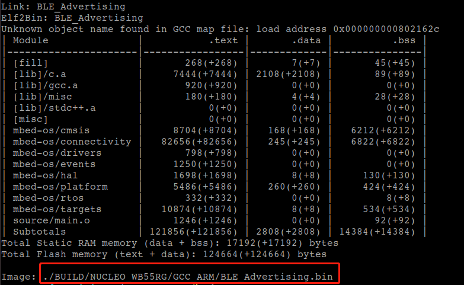

# mbedOS BLE例程STM32WB55开发板实践

拉取官方的例程仓库：  
> git clone https://github.com/ARMmbed/mbed-os-example-ble.git

## 例程`BLE_Advertising`

> cd BLE_Advertising  

修改官方mbed-os仓库的链接为frok到gitee的仓库链接：  
change from   
`https://github.com/ARMmbed/mbed-os/#f2278567d09b9ae9f4843e1d9d393526b9462783`  
to  
`https://gitee.com/null_752_5567/mbed-os/#f2278567d09b9ae9f4843e1d9d393526b9462783`

然后执行同步动作，拉取相应的代码:
> mbed deploy

同步完成后的目录下有如下内容：  

### 生成针对STM32WB55开发板的bin文件

执行如下命令:  
> mbed compile -m NUCLEO_WB55RG -t GCC_ARM

    -m 选项指定目标开发板  
    -t 选项指定使用的交叉编译器  

编译完成后，结果如下：  

