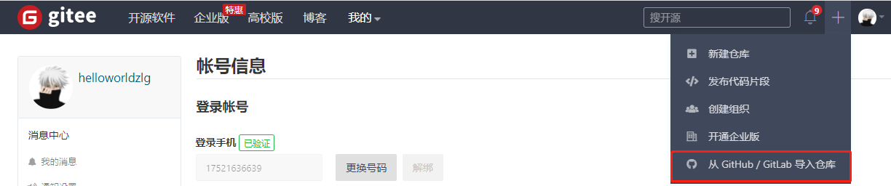
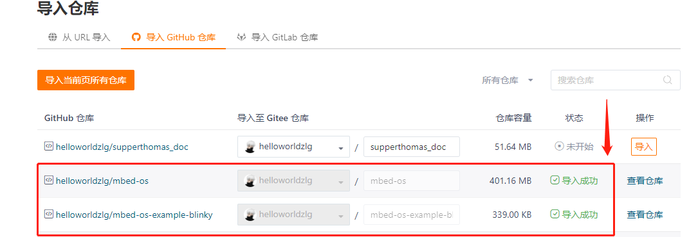

# mbedOS优化代码同步速度的小技巧

官方的代码仓库托管在`github`平台，由于国内访问速度比较慢，可能存在同步失败的情况，以下提供优化的方法：

## fork官方的代码仓库到自己的`github`代码仓库下

找到对应的官方的代码仓库，点击`fork`即可。

需要frok的代码仓库(代码量比较大的依赖库)如下：

* `mbed-os`
* `mbed-os-ble-utils`

## 将上述fork后的代码同步到gitee平台

这个动作可以借助gitee平台本身提供的功能实现，具体如下：

选择`github`上对应的仓库点击`导入`即可

## 修改代码中指明的依赖仓库路径到gitee平台的路径

我们`clone`官方例程到本地时，官方例程中默认的依赖库的路径需要修改为`gitee`平台的路径。

例如我们从官方`clone`的`mbed-os-example-blinky`例程中，`mbed-os.lib`文件中需要将路径作如下修改：

change from   
`https://github.com/ARMmbed/mbed-os/#f2278567d09b9ae9f4843e1d9d393526b9462783`  
to  
`https://gitee.com/null_752_5567/mbed-os/#f2278567d09b9ae9f4843e1d9d393526b9462783`

修改完后，再执行`mbed deploy`，速度将获得极大的提升。