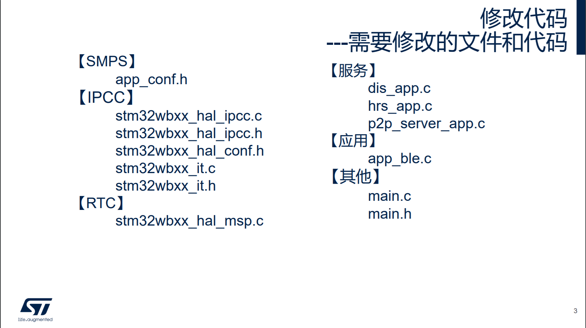
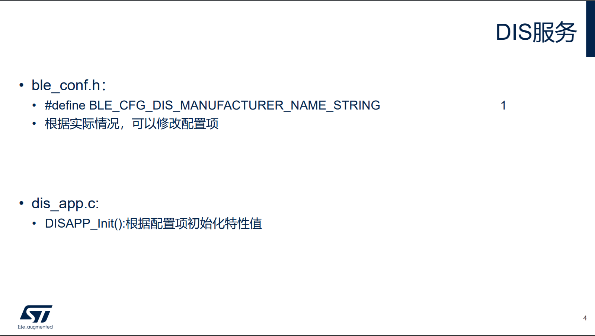
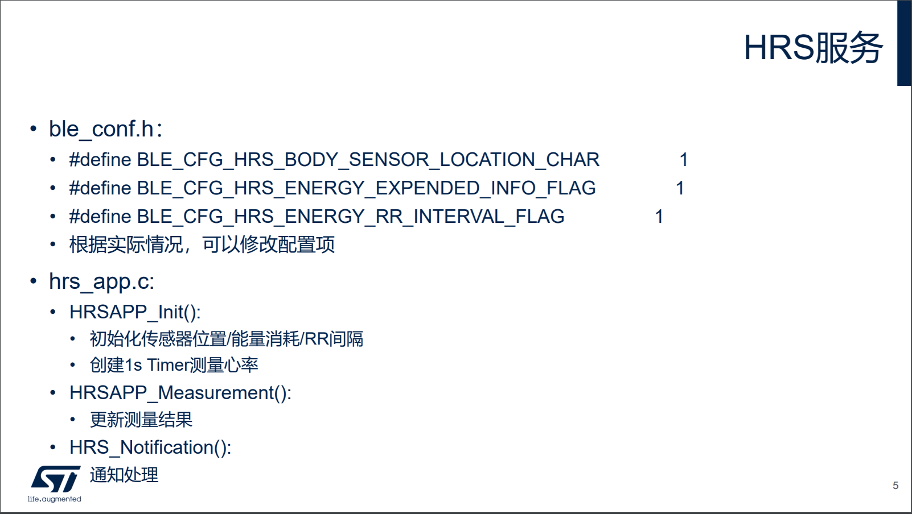
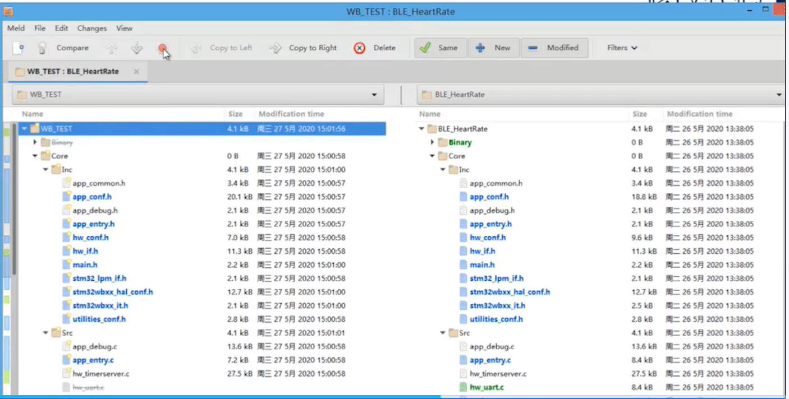
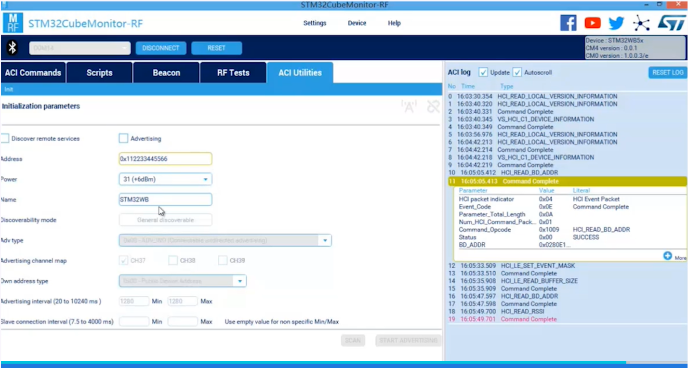

# CubeMX生成BLE应用(二)

使用 CubeMX 5.6.0 创建的 BLE 应用代码文件格式如下图所示，我们需要修改 BLE 的相关代码，以下主要介绍如何添加 BLE 的服务和相关应用，在后续的 CubeMX 版本中，SMPS，IPCC 和 RTC 这些配置代码都会自动生成。



## 1 BLE 服务介绍

### 1.1 DIS 服务

DIS 服务是设备的信息服务，用于让对方设备去发现服务端设备的一些基本信息，比如设备的厂商名，设备名以及版本号等。与 DIS 服务相关的有 `ble_conf.h` 和 `dis_app.c`这两个文件。



`ble_conf.h`定义了下面这些配置项，用户可以根据实际情况修改，默认只打开了设备厂商名。

```C
/******************************************************************************
 * Device Information Service (DIS)
 ******************************************************************************/
/**< Options: Supported(1) or Not Supported(0) */
#define BLE_CFG_DIS_MANUFACTURER_NAME_STRING                                   1
#define BLE_CFG_DIS_MODEL_NUMBER_STRING                                        0
#define BLE_CFG_DIS_SERIAL_NUMBER_STRING                                       0
#define BLE_CFG_DIS_HARDWARE_REVISION_STRING                                   0
#define BLE_CFG_DIS_FIRMWARE_REVISION_STRING                                   0
#define BLE_CFG_DIS_SOFTWARE_REVISION_STRING                                   0
#define BLE_CFG_DIS_SYSTEM_ID                                                  0
#define BLE_CFG_DIS_IEEE_CERTIFICATION                                         0
#define BLE_CFG_DIS_PNP_ID                                                     0
```

`dis_app.c`文件里的`DISAPP_Init()`用户可以根据`ble_conf.h`里定义配置项初始化设备的一些特性值，使用 `DIS_UpdateChar()`来将特性值更新到服务端里。这样客户端来读取设备的信息时就是读取的我们自己设定的设备信息。

以下仅截取了一部分 demo 工程的代码，可以看出是使用宏开关来控制更新哪些特性值。

```C
void DISAPP_Init(void)
{
/* USER CODE BEGIN DISAPP_Init */
  DIS_Data_t dis_information_data;

#if ((BLE_CFG_DIS_MANUFACTURER_NAME_STRING != 0) || (CFG_MENU_DEVICE_INFORMATION != 0))
  /**
   * Update MANUFACTURER NAME Information
   *
   * @param UUID
   * @param pPData
   * @return
   */
  dis_information_data.pPayload = (uint8_t*)DISAPP_MANUFACTURER_NAME;
  dis_information_data.Length = sizeof(DISAPP_MANUFACTURER_NAME);
  DIS_UpdateChar(MANUFACTURER_NAME_UUID, &dis_information_data);
#endif
    
    ......
}
```

`dis_app.h`里面存储了实际的特性值。

```C
#define DISAPP_MANUFACTURER_NAME              "STM"
#define DISAPP_MODEL_NUMBER                   "4502-1.0"
#define DISAPP_SERIAL_NUMBER                  "1.0"
#define DISAPP_HARDWARE_REVISION_NUMBER       "1.0"
#define DISAPP_FIRMWARE_REVISION_NUMBER       "1.0"
#define DISAPP_SOFTWARE_REVISION_NUMBER       "1.0"
#define DISAPP_OUI                            0x123456
#define DISAPP_MANUFACTURER_ID                0x9ABCDE
```

### 1.2 HRS心率服务

HRS 服务是 ST 提供的心率测量服务框架，用于快速开发模型。与 HRS 服务相关的有 `ble_conf.h` 和 `hrs_app.c` 这两个文件。



`ble_conf.h`里 HRS 服务的配置选项可以根据需要进行配置。有传感器的位置选项，扩展信息选项以及 RR 值选项。

```C
/******************************************************************************
 * Heart Rate Service (HRS)
 ******************************************************************************/
/**< BODY SENSOR LOCATION CHARACTERISTIC */
#define BLE_CFG_HRS_BODY_SENSOR_LOCATION_CHAR               1
/**< ENERGY EXTENDED INFO FLAG */
#define BLE_CFG_HRS_ENERGY_EXPENDED_INFO_FLAG               1
/**< Max number of RR interval values - Shall not be greater than 9 */
#define BLE_CFG_HRS_ENERGY_RR_INTERVAL_FLAG                 1
```

`hrs_app.c`里需要修改 `HRSAPP_Init()`，`HRSAPP_Measurement()`，`HRS_Notification()`这三个函数代码。

用户在 `hrs_app.c`的`HRSAPP_Init()`里使用`HRS_UpdateChar()`更新特性值到服务端。在初始化的末尾，一般使用`HW_TS_Create()`创建一个重复定时的 Timer ，通过这个 Timer 来测量心率值并通知给客户端。这个 Timer 每次溢出时会调用用户实现的 `HRSAPP_Measurement()`，因此需要在该函数里实现整个心率测量，并把测量结果通知给客户端。代码如下：

```C
void HRSAPP_Init(void)
{
  UTIL_SEQ_RegTask( 1<< CFG_TASK_MEAS_REQ_ID, UTIL_SEQ_RFU, HRSAPP_Measurement );
/* USER CODE BEGIN HRSAPP_Init */
  /**
   * Set Body Sensor Location
   */
  HRSAPP_Context.ResetEnergyExpended = 0;
  HRSAPP_Context.BodySensorLocationChar = HRS_BODY_SENSOR_LOCATION_HAND;
  HRS_UpdateChar(SENSOR_LOCATION_UUID, (uint8_t *)&HRSAPP_Context.BodySensorLocationChar);


  /**
   * Set Flags for measurement value
   */

  HRSAPP_Context.MeasurementvalueChar.Flags = ( HRS_HRM_VALUE_FORMAT_UINT16      | 
                                                  HRS_HRM_SENSOR_CONTACTS_PRESENT   | 
                                                  HRS_HRM_SENSOR_CONTACTS_SUPPORTED |
                                                  HRS_HRM_ENERGY_EXPENDED_PRESENT  |
                                                  HRS_HRM_RR_INTERVAL_PRESENT );

#if (BLE_CFG_HRS_ENERGY_EXPENDED_INFO_FLAG != 0)
  if(HRSAPP_Context.MeasurementvalueChar.Flags & HRS_HRM_ENERGY_EXPENDED_PRESENT)
    HRSAPP_Context.MeasurementvalueChar.EnergyExpended = 10;
#endif
  
#if (BLE_CFG_HRS_ENERGY_RR_INTERVAL_FLAG != 0)
  if(HRSAPP_Context.MeasurementvalueChar.Flags & HRS_HRM_RR_INTERVAL_PRESENT)
  {
    uint8_t i;
    
    HRSAPP_Context.MeasurementvalueChar.NbreOfValidRRIntervalValues = BLE_CFG_HRS_ENERGY_RR_INTERVAL_FLAG;
    for(i = 0; i < BLE_CFG_HRS_ENERGY_RR_INTERVAL_FLAG; i++)
      HRSAPP_Context.MeasurementvalueChar.aRRIntervalValues[i] = 1024;
  }
#endif
  
  /**
   * Create timer for Heart Rate Measurement
   */
  HW_TS_Create(CFG_TIM_PROC_ID_ISR, &(HRSAPP_Context.TimerMeasurement_Id), hw_ts_Repeated, HrMeas);

/* USER CODE END HRSAPP_Init */
  return;
}
```

`HRS_Notification()`一般在客户端打开关闭服务端的一些通知时调用（OTA暂未考虑），比如打开心率测量通知。

```C
void HRS_Notification(HRS_App_Notification_evt_t *pNotification)
{
/* USER CODE BEGIN HRS_Notification_1 */

/* USER CODE END HRS_Notification_1 */
  switch(pNotification->HRS_Evt_Opcode)
  {
/* USER CODE BEGIN HRS_Notification_HRS_Evt_Opcode */

/* USER CODE END HRS_Notification_HRS_Evt_Opcode */ 
    case HRS_NOTIFICATION_ENABLED:
/* USER CODE BEGIN HRS_NOTIFICATION_ENABLED */
      /**
       * It could be the enable notification is received twice without the disable notification in between
       */
      HW_TS_Stop(HRSAPP_Context.TimerMeasurement_Id);
      HW_TS_Start(HRSAPP_Context.TimerMeasurement_Id, HRSAPP_MEASUREMENT_INTERVAL);
/* USER CODE END HRS_NOTIFICATION_ENABLED */
      break;

    case HRS_NOTIFICATION_DISABLED:
/* USER CODE BEGIN HRS_NOTIFICATION_DISABLED */
      HW_TS_Stop(HRSAPP_Context.TimerMeasurement_Id);
/* USER CODE END HRS_NOTIFICATION_DISABLED */
      break; 
   default:
/* USER CODE BEGIN HRS_Notification_Default */

/* USER CODE END HRS_Notification_Default */
      break;
  }
/* USER CODE BEGIN HRS_Notification_2 */

/* USER CODE END HRS_Notification_2 */
  return;
}
```

### 1.3 P2P 服务

P2P 服务是 ST 的自定义服务，实现了一个较为简单的功能，通过客户端可以控制服务端 LED 灯的状态，也可以通过服务端控制客户端 LED 灯的状态。


用户需要实现`P2PS_APP_Init()`，`P2PS_STM_App_Notification()`和`P2PS_Send_Notification()`这三个函数。

`P2PS_APP_Init()`需要完成以下功能：

- 定义一个 Task，当一个 Button 被按下时，响应这个按下事件，并通知客户端，即调用`P2PS_Send_Notification()`。
- 初始化 LED 灯的状态。
- 初始化 P2PServer 上下文的状态。

代码如下：

```C
void P2PS_APP_Init(void)
{
/* USER CODE BEGIN P2PS_APP_Init */
  UTIL_SEQ_RegTask( 1<< CFG_TASK_SW1_BUTTON_PUSHED_ID, UTIL_SEQ_RFU, P2PS_Send_Notification );

  /**
   * Initialize LedButton Service
   */
  P2P_Server_App_Context.Notification_Status=0; 
  P2PS_APP_LED_BUTTON_context_Init();
/* USER CODE END P2PS_APP_Init */
  return;
}
```

`P2PS_STM_App_Notification()`用于实现客户端控制服务端的 LED 灯的状态。在属性被修改时会被调用。代码如下：

```C
void P2PS_APP_Notification(P2PS_APP_ConnHandle_Not_evt_t *pNotification)
{
/* USER CODE BEGIN P2PS_APP_Notification_1 */

/* USER CODE END P2PS_APP_Notification_1 */
  switch(pNotification->P2P_Evt_Opcode)
  {
/* USER CODE BEGIN P2PS_APP_Notification_P2P_Evt_Opcode */

/* USER CODE END P2PS_APP_Notification_P2P_Evt_Opcode */
  case PEER_CONN_HANDLE_EVT :
/* USER CODE BEGIN PEER_CONN_HANDLE_EVT */
          
/* USER CODE END PEER_CONN_HANDLE_EVT */
    break;

    case PEER_DISCON_HANDLE_EVT :
/* USER CODE BEGIN PEER_DISCON_HANDLE_EVT */
       P2PS_APP_LED_BUTTON_context_Init();       
/* USER CODE END PEER_DISCON_HANDLE_EVT */
    break;
    
    default:
/* USER CODE BEGIN P2PS_APP_Notification_default */

/* USER CODE END P2PS_APP_Notification_default */
      break;
  }
/* USER CODE BEGIN P2PS_APP_Notification_2 */

/* USER CODE END P2PS_APP_Notification_2 */
  return;
}
```

在 `main.c`里面需要处理

- Button 中断，需要在 Button 中断里回调 `P2PS_APP_SW1_Button_Action()`函数。
- 启动调度器，在 While(1) 中调用 `UTIL_SEQ_Run(UTIL_SEQ_DEFAULT)`。

## 2 代码对比

可以用 CubeMX 自动生成的代码和 WB 软件包的 demo 工程里的代码相比较，来完成相应工程的配置编写。

STM32CubeMX 的软件包一般在 **C:\Users\<用户名>\STM32Cube\Repository** 里面。



## 3 STM32CubeMonitor-RF

可以利用 STM32CubeMonitor-RF 来观察 nucleo 板的 DIS 服务，HRS 服务和 P2P 服务的现象。

