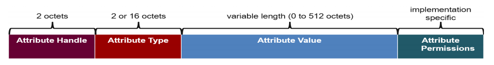
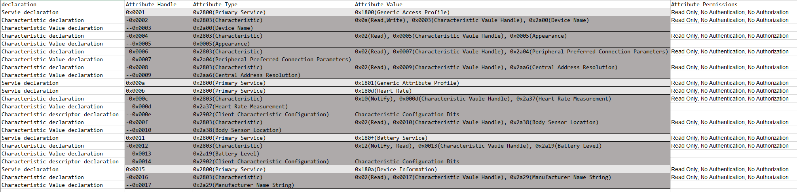
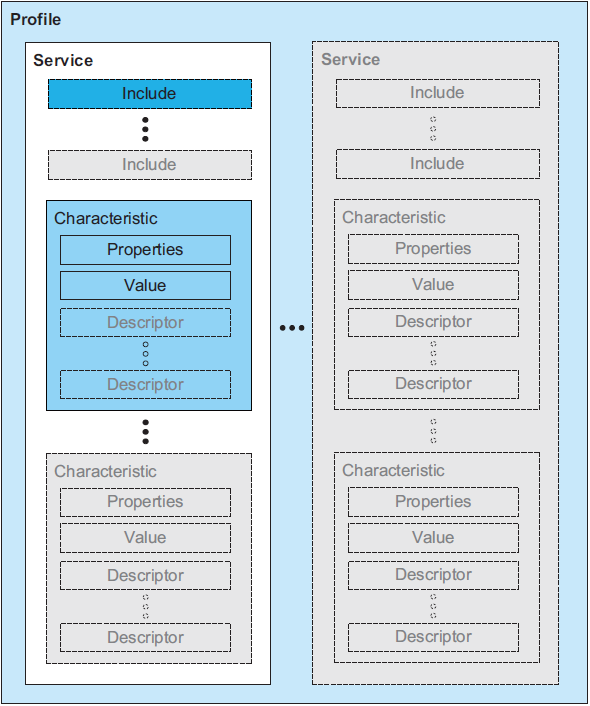
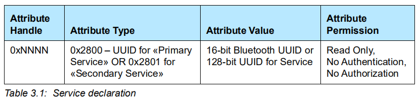
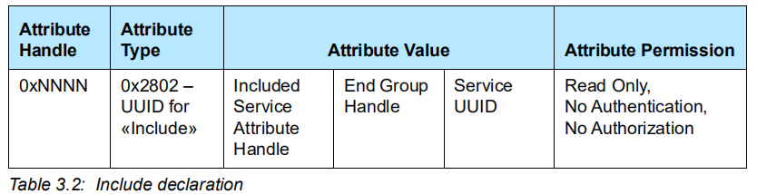
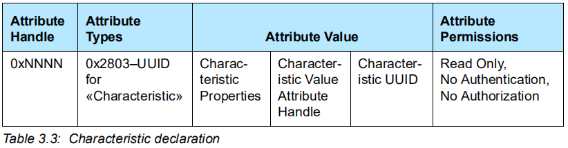
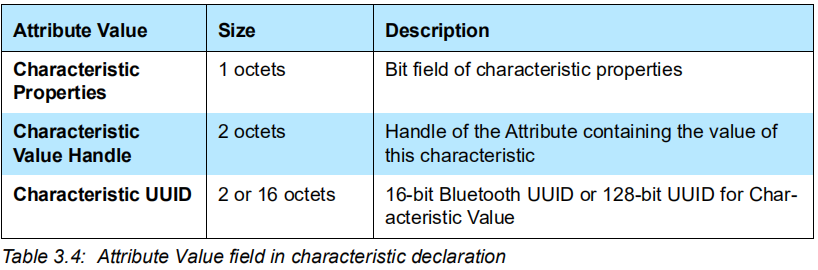
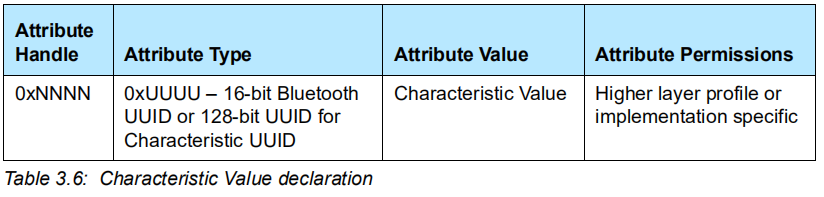
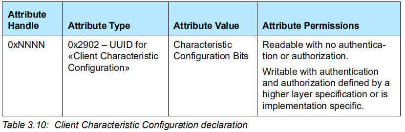
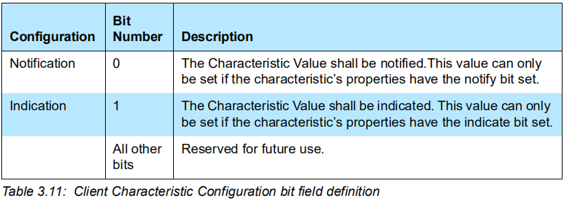

# GATT Service 定义总结

最近跑了很多关于 GATT Service 的 demo，对于相关概念有了一定的印象。

为了更深入的学习，我系统的学习了 Core Spec 5.2 里 

Vol 3: Host -> Part G: Generic Attribute Profile (GATT) -> 3 Service interoperability requirements 

里的相关内容，对于 Service definition，Include definiton 和 Characteristic definition 有了更深刻的认识，在这里记录下我的理解，我会结合一张 Heart Rate Server 里的 attribute 表来介绍。 

## ATT 基础回顾

ATT(Attribute Protocol) ，属性协议，定义了属性 attribute 的格式，众多的 attributes 组合成了一个数据库，蓝牙设备通过这个数据库对外提供服务。

由此可以看出一个 attribute 是由

- Attribute Handle：访问该 attribute 的句柄。
- Attribute Type
- Attribute Value
- Attribute Permissions：访问该 attribute 的权限。

组成。该 attribute 代表什么含义由 GATT(Generic Attribute Profile) 定义。

## Heart Rate Attribute Table

这是一张 Heart Rate Server 里存储的 attribute 表，下面的分析会结合这张表。

## GATT 基础回顾

GATT 里的数据包含 Service, Include, Characteristic 。下面的图片表示的很清楚：

我们依次来看看 Service, Include, Characteristic 。

## Service

在 GATT 里，Service 是由 service definition 来定义的。

一个 service definition 必须包含一个 service declaration ，可以包含一些 include definitions 和 characteristic definitions 。

service declaration 的 attribute 格式定义如下：

Attribute Type 可以是 «Primary Service» 或 «Secondary Service»，其 Attribute Value 就是该 Service 的 UUID 。

从上述的表格里找出一个 service declaration 条目：

| Attribute Handle | Attribute Type          | Attribute Value    | Attribute Permissions                           |
| ---------------- | ----------------------- | ------------------ | ----------------------------------------------- |
| 0x000b           | 0x2800(Primary Service) | 0x180d(Heart Rate) | Read Only, No Authentication, No  Authorization |

接下来介绍 include definitions 和 characteristic definitions 。

## Include Services

Include Services 有点像 C 语言里包含头文件，然后就可以引用其他模块给我们提供的接口。

Include Services 用于引用该设备里已经定义好的另一个 Service 。

一个 include definitions 只能包含一个 **include declaration** 其 attribute 格式定义如下：

这个用的比较少，而且上述的表格里也没有相关内容，就不介绍了。

## Characteristic

一个 characteristic definition 必须包含一个 characteristic declaration 和一个 Characteristic Value declaration ，可以包含多个 characteristic descriptor declaration 。

### Characteristic declaration

其 attribute 格式定义如下：

- Attribute Types 固定为 0x2803 。
- Characteristic Properties 为该 Characteristic 的属性，常用的由 Write, Read, Notify 。
- Characteristic Value Attribute Handle ，
- Characteristic UUID，

各字段的大小如下：

上述表格中也有例子：

| Attribute  Handle | Attribute Type         | Attribute Value                                              | Attribute Permissions                           |
| ----------------- | ---------------------- | ------------------------------------------------------------ | ----------------------------------------------- |
| 0x000c            | 0x2803(Characteristic) | 0x10(Notify),  0x000d(Characteristic Vaule Handle), 0x2a37(Heart Rate Measurement) | Read  Only, No Authentication, No Authorization |

### Characteristic Value declaration

其 attribute 格式定义如下：

Attribute Type 为该 Characteristic 的 UUID 。

上述表格中有例子：

| Attribute  Handle | Attribute Type                 | Attribute Value | Attribute Permissions |
| ----------------- | ------------------------------ | --------------- | --------------------- |
| 0x000d            | 0x2a37(Heart Rate Measurement) |                 |                       |

### Characteristic descriptor declarations

Characteristic Value declaration 目前一共有 6 种，

- Characteristic Extended Properties
- Characteristic User Description
- Client Characteristic Configuration
- Server Characteristic Configuration
- Characteristic Presentation Format
- Characteristic Aggregate Format

其中常用的为 Client Characteristic Configuration ，这里就以它为例子介绍了，其他的可以参考 Core Spec ，都是类似的。

attribute 的格式定义如下：

- Attribute Type 固定为 0x2902 ，
- Attribute Value 为配置 Characteristic 的位数据，定义如下：

其中第 0 位为 Notification 的配置位，第 1 位为 Indication 的配置位。

若想要 Server 通知该 Characteristic ，将该描述符的第 0 位置 1 即可。

在上述表格里有相应例子：

| Attribute  Handle | Attribute Type                               | Attribute Value | Attribute Permissions |
| ----------------- | -------------------------------------------- | --------------- | --------------------- |
| 0x000e            | 0x2902(Client Characteristic  Configuration) | 0x01(Notify)    |                       |