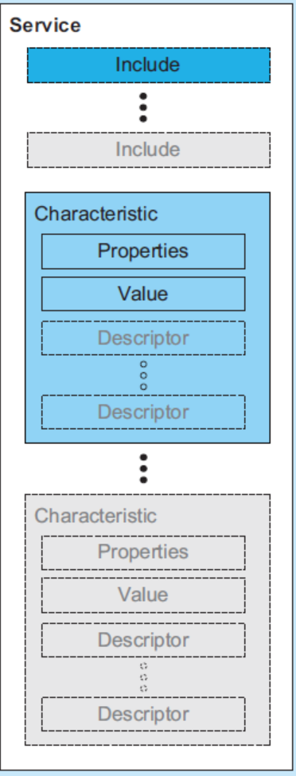
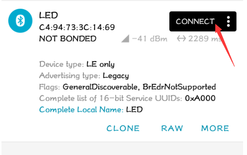
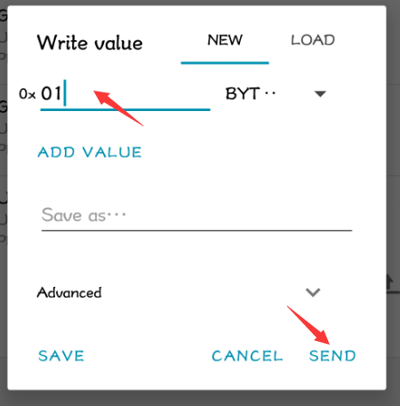
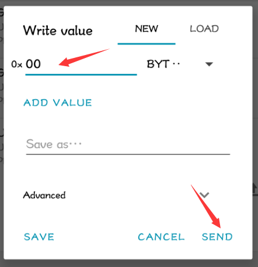

# mbed-os LEDDemo 介绍

这个工程可以在线上编译器里找到，mbed-os 的官方例程里没有这个。

## mbed-os如何定义一个 GATT Service

根据对 GATT 的理解，一个 GATT Service 包含多个 Characteristic ，Service 和 Characteristic 都有自己的 UUID 来标识，如下图所示：



### GattCharacteristic 

在 mbed-os 里 `GattCharacteristic` 类用来表示 Characteristic 。

为了方便使用，mbed-os 根据对 Characteristic 的读/写属性提供了几个更方便使用的类：

- `ReadOnlyGattCharacteristic`
- `WriteOnlyGattCharacteristic`
- `ReadWriteGattCharacteristic`
- `WriteOnlyArrayGattCharacteristic`
- `ReadOnlyArrayGattCharacteristic`
- `ReadWriteArrayGattCharacteristic`

TODO: 解释带 "Array" 的 Characteristic 。

这些类都是模板类，可以很方便地实现任意类型的 Characteristic Value 值。

#### LEDService

以 mbed-os-example-ble-LED 例程里实现的 LEDService 为例。

先从 Characteristic 介绍：

```C++
class LEDService {
public:
	const static uint16_t LED_STATE_CHARACTERISTIC_UUID = 0xA001;
    ......
private:
    ReadWriteGattCharacteristic<bool> ledState; 
};
```

LEDService 定义了一个 `ReadWriteGattCharacteristic<bool>` 类型的 Characteristic `ledState`，`ledState` 可读可写。 true 表示灯亮状态，false 表示灯灭状态， UUID 自定义为 0xA001 。

### GattService

接下来看看这个 demo 里如何定义一个 GATT Service 。

```C++
class LEDService {
public:
    const static uint16_t LED_SERVICE_UUID              = 0xA000;
    const static uint16_t LED_STATE_CHARACTERISTIC_UUID = 0xA001;

    LEDService(BLEDevice &_ble, bool initialValueForLEDCharacteristic) :
        ble(_ble), ledState(LED_STATE_CHARACTERISTIC_UUID, &initialValueForLEDCharacteristic)
    {
        GattCharacteristic *charTable[] = {&ledState};
        GattService         ledService(LED_SERVICE_UUID, charTable, sizeof(charTable) / sizeof(GattCharacteristic *));

        ble.gattServer().addService(ledService);
    }

    GattAttribute::Handle_t getValueHandle() const
    {
        return ledState.getValueHandle();
    }

private:
    BLEDevice                         &ble;
    ReadWriteGattCharacteristic<bool> ledState; 
};
```

在 LEDService 的构造函数初始化列表里，得到了传入的 BLE 协议栈实例的引用，并且根据 Characteristic 的 UUID 和初始状态值构造了 `ledState` 。

此处的 `BLEDevice` 是为了兼容较老版本的协议栈，新版本协议栈不建议使用，直接使用 `BLE` 即可。官方解释如下：

```C++
/**
 * @deprecated This type alias is retained for the sake of compatibility with
 * older code. This will be dropped at some point.
 */
typedef BLE BLEDevice;
```

第 9，10 行构建了一张 GattCharacteristic 的表，并且用这张表和 UUID 构建了 GATT Service `ledService`，之后就调用接口 `addService()` 将 `ledService` 作为一个 Service 加入了协议栈。

注意，`addService()` 会为 Service 里的所有 attributes 统一分配 Handle 句柄，因此我们编写程序时想要获得一个 attribute 的句柄，只能调用协议栈提供的接口。就比如获取 `ledState` Characteristic Value 的 Handle 句柄，就只能调用 `ledState.getValueHandle();` 来获得，返回类型是 `GattAttribute::Handle_t` 。

## LEDDemo 介绍

### 异步通知

LEDDemo 里也有打广播的流程，这里就不详细介绍了，mbed-os BLE_Advertising 这篇文章里把流程介绍的很详细。

我们来看看 LEDDemo 作为一个 BLE Server 与单纯的打广播有什么不同的地方。

首先在 BLE 协议栈初始化完成后的回调函数里：

```C++
/** Callback triggered when the ble initialization process has finished */
void on_init_complete(BLE::InitializationCompleteCallbackContext *params) {
    ......

    _led_service = new LEDService(_ble, false);

    _ble.gattServer().onDataWritten(this, &LEDDemo::on_data_written);

    ......
}
```

在这里多了创建 `_led_service` 这个 BLE Service 的步骤，并且调用了 `_ble.gattServer().onDataWritten()` 这个接口，设置了 client 和 server 建立连接后，client 向 server 写数据这个事件的回调函数，在这个回调函数里实现了 LED 灯的亮灭，也就是所谓的蓝牙点灯。

```C++
/**
     * This callback allows the LEDService to receive updates to the ledState Characteristic.
     *
     * @param[in] params Information about the characterisitc being updated.
     */
void on_data_written(const GattWriteCallbackParams *params) {
    if ((params->handle == _led_service->getValueHandle()) && (params->len == 1)) {
        _actuated_led = *(params->data);
    }
}
```

mbed-os BLE 协议栈还定义了其他类似的事件接口：

- `onDataSent`：注册一个事件回调函数，当 server 发送一个 characteristic value 更新值给 client 时回调该函数。
- `onDataWriten`：注册一个事件回调函数，当 client 写了一个 server 的 attribute 之后回调该函数。
- `onDataRead`：注册一个事件回调函数，当 client 读取了一个 server 的 attribute 之后回调该函数。
- `onUpdatesEnabled`：注册一个事件回调函数，当 client 订阅某个 characteristic 的更新值时回调该函数。
- `onUpdatesDisabled`：注册一个事件回调函数，当 client 取消订阅某个 characteristic 的更新值时回调该函数。
- `onConfimationReceived`：注册一个事件回调函数，当 client 确认收到了一个 characteristic value 的通知时回调该函数（也就是收到 ATT_HANDLE_VALUE_CFM  这个包的时候）。

### 广播数据

首先设置广播参数：

- 广播类型：可连接，不定向
- 广播间隔：1000 ms

然后设置了广播数据：

| Length | AD Type                             | AD Data                                       |
| ------ | ----------------------------------- | --------------------------------------------- |
|        | 0x01 - «Flags»                      | `BREDR_NOT_SUPPORTED|LE_GENERAL_DISCOVERABLE` |
|        | 0x03 - «16-bit Service Class UUIDs» | 0xA000                                        |
|        | 0x09 - «Device Name»                | "LED"                                         |

### 使用示例

WB55 上电后，手机端 nRF Connect 可以看到 LED 设备发送的广播消息，点击 CONNECT ，如下图：



选择 CLIENT，Unknown Service，可以看见这个 Service 的 UUID 为 0xA001，其 value 的属性为可读可写，与我们上面的代码是一样的。点击右边向上的箭头，


会弹出来一个对话框，在这里输入 01，点击发送即给 WB55 发送了一条写命令，值为 0x01，此时会看见 LED2 灯亮。



若发送 0x00 ，则 LED 灯灭。



## 抓包分析

TODO