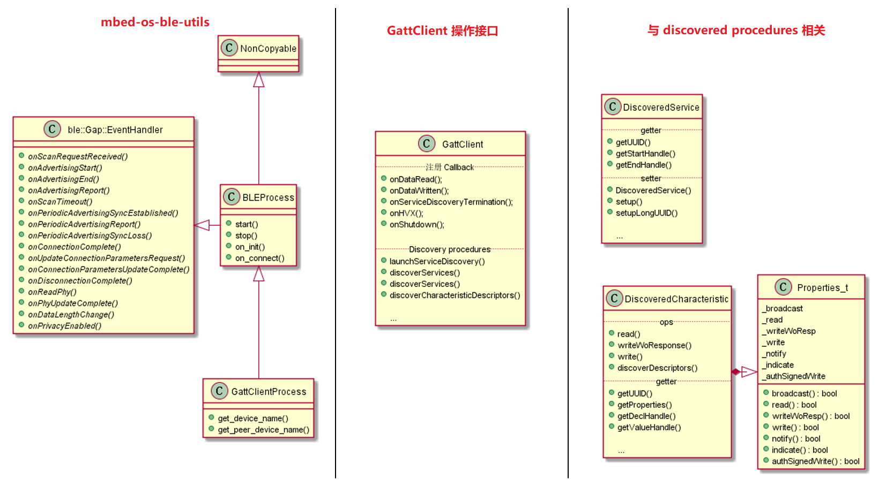

# mbed os GattClient 介绍

这里列出了与 GATT Client 相关的一些类，以及需要使用的方法。

左侧是 mbed os 提供了 BLE 相关工具，用于快速构建应用程序，这个留到最后再说。

中间是 GattClient 类的一些操作接口，主要是注册回调函数，以及从 Server 端发现 Service，Characteristic 和 Characteristic Descriptor 的接口。

右侧是与发现过程相关的，这里 DiscoveredService 类是指发现过程中找到的 Service，DiscoveredCharacteristic 类是指发现过程中找到的 Characteristic 。



## 本文目标

每一个类的 API 详细说明，请查看[官方API手册](https://os.mbed.com/docs/mbed-os/v6.5/mbed-os-api-doxy/index.html)，本文仅将这些 API 汇总出来，并简单分析其用途，最终学习 BLE_GattClient_CharacteristicWrite 这个例程是怎么使用这些 API 的。

## GattClient 操作接口

GattClient 有很多方法，我上面罗列了一些常用方法，并分成了两组：

- 与注册回调函数相关
- 与发现服务过程相关

### 注册 Callback

接口如下：

```C++
void onDataRead(ble::ReadCallback_t callback);
void onDataWritten(ble::WriteCallback_t callback);
void onServiceDiscoveryTermination(ServiceDiscovery::TerminationCallback_t callback);
void onHVX(HVXCallback_t callback);
void onShutdown(const GattClientShutdownCallback_t &callback);
```

- `onDataRead`：注册读 attribute 事件的回调函数。
- `onDataWritten`：注册写 attribute 事件的回调函数。
- `onServiceDiscoveryTermination`：注册服务发现结束事件的回调函数。
- `onHVX`：注册 Server 端 Characteristic Value 通知（Notification）或指示（Indication）事件的回调函数。
- `onShutdown`：注册连接关闭事件的回调函数。

注意：GattClient 里的读写操作的是某一个 attribute ，后面会看到 DiscoveredCharacteristic 里读写是操作 Characteristic Value 。

### Discovery procedures

GATT Client 端可以发现 Service, Characteristic 和 Characteristic Descriptor 。GattClient 类与发现过程相关的 API 提供了这些功能。

```C++
// 根据给定 UUID 开启发现 Service 和 Characteristic 的过程。
ble_error_t launchServiceDiscovery (
    ble::connection_handle_t connectionHandle,
    ServiceDiscovery::ServiceCallback_t sc = nullptr,
    ServiceDiscovery::CharacteristicCallback_t cc = nullptr, 
    const UUID &matchingServiceUUID = UUID::ShortUUIDBytes_t(BLE_UUID_UNKNOWN), 
    const UUID &matchingCharacteristicUUIDIn = UUID::ShortUUIDBytes_t(BLE_UUID_UNKNOWN)
);

// 根据给定 UUID 开启发现 Service 的过程。
ble_error_t discoverServices (
    ble::connection_handle_t connectionHandle,
    ServiceDiscovery::ServiceCallback_t callback, 
    const UUID &matchingServiceUUID = UUID::ShortUUIDBytes_t(BLE_UUID_UNKNOWN)
);

// 根据给定 [startHandle, endHandle] 发现 Service 的过程。
ble_error_t discoverServices (
    ble::connection_handle_t connectionHandle, 
    ServiceDiscovery::ServiceCallback_t callback, 
    GattAttribute::Handle_t startHandle, 
    GattAttribute::Handle_t endHandle
);

// 根据给定 Characteristic 发现其 descriptor 的过程。
ble_error_t discoverCharacteristicDescriptors (
    const DiscoveredCharacteristic &characteristic, 
    const CharacteristicDescriptorDiscovery::DiscoveryCallback_t &discoveryCallback, 
    const CharacteristicDescriptorDiscovery::TerminationCallback_t &terminationCallback
);
```

- `launchServiceDiscovery`：

该函数用于发现 Service 和 Characteristic（只能由该 API 调用时发现），若在 Server 端发现了与 `matchingServiceUUID` 相匹配的 UUID ，那么就会回调函数 `sc` ；若在 Server 端发现了与 `matchingCharacteristicUUIDIn` 相匹配的 UUID ，那么就会回调函数 `cc` 。默认查找所有的 Service 和 Characteristic 。`connectionHandle` 是连接句柄，用于表示与 Server 端的连接 。

- `discoverServices`：

该函数用于单独发现 Service ，可以用 `matchingServiceUUID` 来匹配 Server 端的 Service 。也可以查找 Attribute Handle 范围为 `[startHandle, endHandle]` 里的 Service 。若找到，则回调 `callback` 函数。 `connectionHandle` 是连接句柄，用于表示与 Server 端的连接 。

- `discoverCharacteristicDescriptors`：

该函数用于发现 Characteristic Descriptors ，需要指明是哪一个 `characteristic` ，每发现一个 descriptor 就回调函数 `discoveryCallback` ，当所有的 descriptor 都查找完全后，回调函数 `terminationCallback` 。

## discovery procedures  中的数据

该部分会介绍 DiscoveredService 和 DiscoveredCharacteristic 这两个类。

### DiscoveredService 

该类有 getter 和 setter 两类方法，Client 端主要用 getter 方法，因为相应的 Service 已经在 Server 端实现了。

可以通过 `getUUID()` 获取该 Service 的 UUID ，也可以通过 `getStartHandle()` 和 `getEndHandle()` 获得该 Service 在 attribute 表里的 attribute handle 范围。

### DiscoveredCharacteristic 

与 DiscoveredService 相比较，DiscoveredCharacteristic 拥有的方法更多，这很好理解，因为我们需要读写 Characteristic 的值。

其拥有一个 Properties_t 类，里面存储了该 Characteristic 的属性（读/写/通知...），并提供了相应的读属性方法。

`read()` 用于读取其 Value 值（需要该 Characteristic 拥有 read 属性），Server 返回读取的数据。

`write()` 用于写 Value 值（需要该 Characteristic 拥有 write 属性），Server 返回写成功或失败。

`writeWoResponse()` 用于写 Value 值（需要该 Characteristic 拥有 writeWoResponse 属性），Server 不返回任何消息。

`discoverDescriptors()` 用于发现其 descroptor 。

## 使用 mbed-os-ble-utils 工具

### 如何使用

该工具在 mbed-os-ble-utils 目录下，简单使用该工具，我们就可以抽象出一层应用层，在应用层只用于完成业务代码即可。该工具封装了广播、扫描、连接的过程，我们只需关注服务发现过程，以及对 Characteristic 的读写操作过程。

client 使用了 ble_process.h 和 gatt_client_process.h 这两个文件。

该工具的简单使用如下：

```C++
int main()
{
    BLE &ble = BLE::Instance();
    events::EventQueue event_queue;

    GattClientDemo demo;

    /* this process will handle basic ble setup and advertising for us */
    GattClientProcess ble_process(event_queue, ble);

    /* once it's done it will let us continue with our demo */
    ble_process.on_init(mbed::callback(&demo, &GattClientDemo::start));
    ble_process.on_connect(mbed::callback(&demo, &GattClientDemo::start_discovery));

    ble_process.start();

    return 0;
}
```

创建 GattClientProcess 类的一个实例，然后使用 `on_init()` 注册回调函数，当 mbed os BLE 协议栈初始化完成后调用，一般用于初始化所需内容。之后使用 `on_connect()` 注册回调函数，当 BLE 协议栈建立连接后调用，这里用于开始发现服务的过程。之后调用 `start()` 方法启动 BLE 协议栈。

### 内部架构简析

`ble::Gap::EventHandler` 这个类定义了许多事件的回调函数，这些函数都是虚函数，如下所示：

```C++
struct EventHandler {
        /**
         * Called when an advertising device receive a scan response.
         * @param event Scan request event.
         * @version: 5+.
         * @see AdvertisingParameters::setScanRequestNotification().
         */
        virtual void onScanRequestReceived(const ScanRequestEvent &event)
        {
        }
		......
}
```

当我们需要使用这些事件时，需要继承 `ble::Gap::EventHandler` 这个类，然后重写（override）相应的虚函数，所有的虚函数在文章最开始的图片里有。

`BLEProcess` 这个类用于处理设备位于广播态（Advertising）的相关内容。

`GattClientProcess` 这个类用于处理设备位于扫描态（Scanning）和发起态（Initiating）的相关内容。

而我们的应用程序则处理连接态（Connection）的相关内容。

有关 BLE 设备的广播态、扫描态、发起态和连接态可以参考[爱洋葱的 BLE 系列博客](https://blog.csdn.net/zhoutaopower/category_9083143.html) 。

## 例程分析+实验

以下简单分析 BLE_GattClient_CharacteristicWrite 这个官方例程。

首先看 main.c 函数

```C++
int main()
{
    BLE &ble = BLE::Instance();
    printf("\r\nGattClient demo of a writable characteristic\r\n");
    
    GattClientDemo demo;
    /* this process will handle basic setup and advertising for us */
    GattClientProcess ble_process(event_queue, ble);
    /* once it's done it will let us continue with our demo*/
    ble_process.on_init(callback(&demo, &GattClientDemo::start));
    ble_process.on_connect(callback(&demo, &GattClientDemo::start_discovery));
    ble_process.start();
    return 0;
}
```

这里借助了 ble 工具类 `GattClientProcess` ，注册了两个回调函数：

- `GattClientDemo::start()` ，BLE 协议栈初始化完成后调用。
- `GattClientDemo::start_discovery()`，BLE 协议栈建立连接后调用。

然后启动 BLE 协议栈。

BLE 协议栈初始化完成后会调用 `GattClientDemo::start()` 函数，在这里面注册了读 attribute 完成的回调函数 `on_read()` ，以及写 attribute 完成的回调函数 `on_write()` 。

```C++
/** Callback triggered when the ble initialization process has finished */
void start(BLE &ble, events::EventQueue &event_queue) {
    ble.gattClient().onDataRead(on_read);
    ble.gattClient().onDataWritten(on_write);
}
```

之后成功连接 Server ，`GattClientDemo::start_discovery()` 函数被调用，开始发现服务过程。

```C++
void start_discovery(BLE &ble, events::EventQueue &event_queue, const ble::ConnectionCompleteEvent &event) {
    printf("We are looking for a service with UUID 0xA000\r\n");
    printf("And a characteristic with UUID 0xA001\r\n");

    ble.gattClient().onServiceDiscoveryTermination(discovery_termination);
    ble.gattClient().launchServiceDiscovery(
        event.getConnectionHandle(),
        service_discovery,
        characteristic_discovery,
        EXAMPLE_SERVICE_UUID,
        WRITABLE_CHARACTERISTIC_UUID
    );
}
```

这里注册了发现服务过程结束的回调函数 `discovery_termination()` ，然后使用 `launchServiceDiscovery` 查找 Service (EXAMPLE_SERVICE_UUID -- 0xA000) 和 Characteristic (WRITABLE_CHARACTERISTIC_UUID -- 0xA001) 。当查找到 Service 时，回调函数 `service_discovery()` ；当查找到 Characteristic 时，回调函数 `characteristic_discovery()` 。

这三个回调函数很简单，就是简单打印信息，并且记录了找到的 Characteristic，因为待会要读写它的 Value 值。

```C++
static DiscoveredCharacteristic writable_characteristic;
static bool writable_characteristic_found = false;

void service_discovery(const DiscoveredService *service) {
    if (service->getUUID().shortOrLong() == UUID::UUID_TYPE_SHORT) {
        if (service->getUUID().getShortUUID() == EXAMPLE_SERVICE_UUID) {
            printf("We found the service we were looking for\r\n");
        }
    }
}
void characteristic_discovery(const DiscoveredCharacteristic *characteristic) {
    if (characteristic->getUUID().getShortUUID() == WRITABLE_CHARACTERISTIC_UUID) {
        printf("We found the characteristic we were looking for\r\n");
        writable_characteristic = *characteristic;
        writable_characteristic_found = true;
    }
}
void discovery_termination(ble::connection_handle_t connectionHandle) {
    if (writable_characteristic_found) {
        writable_characteristic_found = false;
        event_queue.call([]{ writable_characteristic.read(); });
    }
}
```

注意在发现服务过程结束的回调函数 `discovery_termination()`里 ，调用了这一行代码：

```C++
event_queue.call([]{ writable_characteristic.read(); });
```

因此下一步会执行事件队列里存储的 `writable_characteristic.read();` 这个函数，读取数据完成后会触发 BLE 协议栈回调之前使用 `onDataRead()` 注册过的回调函数，即 `on_read()` 。

```C++
void on_read(const GattReadCallbackParams *response) {
    if (response->handle == writable_characteristic.getValueHandle()) {
        /* increment the value we just read */
        uint8_t value = response->data[0];
        value++;
        /* and write it back */
        writable_characteristic.write(1, &value);
        printf("Written new value of %x\r\n", value);
    }
}
```

这里简单将第一个字节的数据读取出来，并加 1，然后又使用 `writable_characteristic.write()` 将该数据写回 Server 端，Server 发生写完成响应包给 Client 后触发 BLE 协议栈回调之前使用 `onDataWritten()` 注册过的回调函数，即 `on_write()` 。

```C++
void on_write(const GattWriteCallbackParams *response) {
    if (response->handle == writable_characteristic.getValueHandle()) {
        event_queue.call_in(5000ms, []{ writable_characteristic.read(); });
    }
}
```

这里只是加入了一个事件：5 秒后再次使用 `writable_characteristic.read()` 读取数据，循环往复，永不停止。

实现现象如下：

```
GattClient demo of a writable characteristic
Ble process started.
Ble instance initialized
Started scanning for "GattServer"
We found "GattServer", connecting...
Connected to: 84:2e:14:31:b6:38
We are looking for a service with UUID 0xA000
And a characteristic with UUID 0xA001
We found the service we were looking for
We found the characteristic we were looking for
Written new value of 2
Written new value of 3
Written new value of 4
Written new value of 5
Written new value of 6

```


