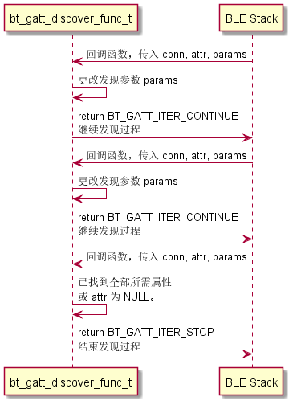
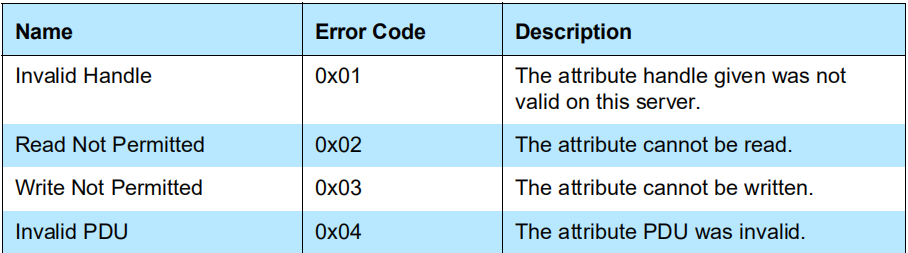

# Zephyr - GATT


## 发现过程

```C
int bt_gatt_discover(struct bt_conn *conn,
		     struct bt_gatt_discover_params *params);
```

Zephye BLE 里 GATT 发现过程的接口为 `bt_gatt_discover`，BLE 客户端使用该函数发现服务端上的属性。第一个参数 `conn` 为连接的句柄，我们一般不直接读写它，而是由协议栈完成；重点需要关注的是第二个参数 `param` ，它决定了发现的内容是什么：服务（Service）、包含服务（Include Service）、特征（Characteristic）还是特征描述符（Characteristic Descriptor）。返回 0 表示成功，其他值表示失败。

该函数是异步的，因此参数 `param` 需要一直保持有效，最好为全局变量。

### bt_gatt_discover_params

```C
struct bt_gatt_discover_params {
	/** Discover UUID type */
	const struct bt_uuid *uuid;
	/** Discover attribute callback */
	bt_gatt_discover_func_t func;
	union {
		struct {
			/** Include service attribute declaration handle */
			uint16_t attr_handle;
			/** Included service start handle */
			uint16_t start_handle;
			/** Included service end handle */
			uint16_t end_handle;
		} _included;
		/** Discover start handle */
		uint16_t start_handle;
	};
	/** Discover end handle */
	uint16_t end_handle;
	/** Discover type */
	uint8_t type;
#if defined(CONFIG_BT_GATT_AUTO_DISCOVER_CCC)
	/** Only for stack-internal use, used for automatic discovery. */
	struct bt_gatt_subscribe_params *sub_params;
#endif /* defined(CONFIG_BT_GATT_AUTO_DISCOVER_CCC) */
};
```

以下列举常用的参数：

- `uuid`：指向要发现的 UUID ，`bt_uuid` 结构体使用了面向对象的封装手法，在最后有介绍。
- `start_hanlde`：发现的起始 handle，参考 ATT 协议。
- `stop_handle`：发现的结束 handle。
- `type`：发现类型，一共有六种，根据想要发现的内容自行填充。

```C
enum {
	BT_GATT_DISCOVER_PRIMARY,		// 发现主要服务（常用）
	BT_GATT_DISCOVER_SECONDARY,		// 发现次要服务
	BT_GATT_DISCOVER_INCLUDE,       // 发现包含服务
	BT_GATT_DISCOVER_CHARACTERISTIC,// 发现特征（常用）
	BT_GATT_DISCOVER_DESCRIPTOR,	// 发现特征描述符（常用）
	BT_GATT_DISCOVER_ATTRIBUTE,		// 发现属性
};
```

- `func`：回调函数，找到发现的内容时会回调该函数，后面会有详细介绍。

其中 `type` 字段还影响到了发现函数 `bt_gatt_discover` 的行为：

- 发现主要服务：函数会根据 `uuid` 查找特定的主要服务。
- 发现包含服务：函数会在 $[start\_handle, end\_handle]$ 里查找所有的包含服务。
- 发现特性：函数会在 $[start\_handle, end\_handle]$ 里查找所有的特征，同时也会根据 `uuid` 查找特定的特征。
- 发现特征描述符：函数会在 $[start\_handle, end\_handle]$ 里查找所有的特征描述符。

### bt_gatt_discover_func_t

```C
typedef uint8_t (*bt_gatt_discover_func_t)(struct bt_conn *conn,
					const struct bt_gatt_attr *attr,
					struct bt_gatt_discover_params *params);
```

该函数类型就是上述 `bt_gatt_discover_params` 里回调函数 `func` 的类型，当发现过程中找到了相应的属性会回调该函数。

- **参数**：
  - `conn`：连接句柄。
  - `attr`：发现的属性，如果未找到则为 NULL。
  - `params`：发现过程参数，也就是 `bt_gatt_discover` 函数里传入的参数。
- **返回值**：
  - `BT_GATT_ITER_CONTINUE`：继续发现过程。
  - `BT_GATT_ITER_STOP`：停止发现过程。

该回调函数的使用方法大致如下：



一般一个 `bt_gatt_discover_func_t` 用于处理一个服务端所有需要发现的服务，特征以及描述符，当找到所有需要的属性或者传入的 attr 为 NULL 时，代表需要结束发现过程了，此时返回 BT_GATT_ITER_STOP 结束发现过程。可以参考例程：samples/bluetooth/central_ht 。

现在来看看传入的 `bt_gatt_attr` 这个结构体，

```C
struct bt_gatt_attr {
	const struct bt_uuid *uuid;

	ssize_t (*read)(struct bt_conn *conn, const struct bt_gatt_attr *attr,
			void *buf, uint16_t len, uint16_t offset);

	ssize_t	(*write)(struct bt_conn *conn, const struct bt_gatt_attr *attr,
			 const void *buf, uint16_t len, uint16_t offset,
			 uint8_t flags);
    
	void *user_data;
	uint16_t handle;
	uint8_t perm;
};
```

- `uuid`：属性的 UUID 。
- `handle`：属性 handle 。
- `perm`：属性的权限。
- `user_data`：用户数据。
- `read`：属性读回调函数（使用未知）。
- `write`：属性写回调函数（使用未知）。

一般在发现过程中需要保持属性 handle 值，以便后续读写。


## 读属性过程

```C
int bt_gatt_read(struct bt_conn *conn, struct bt_gatt_read_params *params);
```

Zephyr BLE 协议栈里读属性值使用的接口为 `bt_gatt_read`，该函数可以同时处理

- 读属性值
- 读长属性值（属性值大小大于 ATT_MTU-1）
- 一次读取多个属性

的情况，其中 `conn` 为建立的连接，`param` 为读取时传入的参数。该函数是异步的，读取到属性值后会调用传入回调函数，因此需保持 param 一直有效。

```C
struct bt_gatt_read_params {
	/** Read attribute callback. */
	bt_gatt_read_func_t func;
	/** If equals to 1 single.handle and single.offset are used.
	 *  If >1 Read Multiple Characteristic Values is performed and handles
	 *  are used.
	 *  If equals to 0 by_uuid is used for Read Using Characteristic UUID.
	 */
	size_t handle_count;
	union {
		struct {
			/** Attribute handle. */
			uint16_t handle;
			/** Attribute data offset. */
			uint16_t offset;
		} single;
		/** Handles to read in Read Multiple Characteristic Values. */
		uint16_t *handles;
		struct {
			/** First requested handle number. */
			uint16_t start_handle;
			/** Last requested handle number. */
			uint16_t end_handle;
			/** 2 or 16 octet UUID. */
			const struct bt_uuid *uuid;
		} by_uuid;
	};
};
```

- `func`：回调函数，读取到属性值时会回调该函数，可能会多次回调。
- `handle_count`：该参数决定了使用之后 union 结构体的哪一个字段。
  - = 0 ：`by_uuid` 会被使用，在 $[start\_handle, end\_handle]$ 之间读取特征 UUID 为 `uuid` 的特性值。
  - = 1 ：`single` 会被使用，用于读取长属性。
  - \> 1 ：`handles` 会被使用，用于一次读取多个属性。

`by_uuid` 使用的较多，读取特征值都会使用它。

再来看看 `bt_gatt_read_func_t` 这个回调函数类型，

```C
typedef uint8_t (*bt_gatt_read_func_t)(struct bt_conn *conn, uint8_t err,
				    struct bt_gatt_read_params *params,
				    const void *data, uint16_t length);
```

该函数有两种返回值：

- `BT_GATT_ITER_CONTINUE`：继续尝试读取下一个属性值。
- `BT_GATT_ITER_STOP`：停止读取属性的过程。

其传入的参数有：

- `conn`：连接句柄。
- `err`：ATT 错误码，相关描述可以在 att.h 文件里找到，也可以在 Core Spec 里找到

> Core_v5.2 - Vol 3: Host - Part F: Attribute Protocol (ATT)
>
> 3 Protocol requirements - 3.4 Attribute protocol PDUs - Error handling

这里列举了常用的 ATT 错误码。



- `params`：之前定义的参数。
- `data`：读取到的属性值缓冲区（为 NULL 代表属性读取完成）。
- `length`：属性值缓冲区大小。

## 写属性过程

```C
int bt_gatt_write(struct bt_conn *conn, struct bt_gatt_write_params *params);
```

套路跟发现过程和读属性过程一样，

```C
typedef void (*bt_gatt_write_func_t)(struct bt_conn *conn, uint8_t err,
				     struct bt_gatt_write_params *params);

/** @brief GATT Write parameters */
struct bt_gatt_write_params {
	/** Response callback */
	bt_gatt_write_func_t func;
	/** Attribute handle */
	uint16_t handle;
	/** Attribute data offset */
	uint16_t offset;
	/** Data to be written */
	const void *data;
	/** Length of the data */
	uint16_t length;
};
```

这里的 `params` 里的参数意义是：向服务端 `handle` 处的属性值的偏移 `offset` 处写入输入 `data`，长度为 `length` 。

## 通知指示过程

```C
int bt_gatt_subscribe(struct bt_conn *conn,
		      struct bt_gatt_subscribe_params *params);

int bt_gatt_unsubscribe(struct bt_conn *conn,
			struct bt_gatt_subscribe_params *params);
```

`bt_gatt_subscribe` 用于订阅一个通知或指示（Notify or Indication）。`bt_gatt_unsubcribe` 用于取消订阅。

```C
struct bt_gatt_subscribe_params {
	/** Notification value callback */
	bt_gatt_notify_func_t notify;
	/** Subscribe CCC write request response callback */
	bt_gatt_write_func_t write;
	/** Subscribe value handle */
	uint16_t value_handle;
	/** Subscribe CCC handle */
	uint16_t ccc_handle;
#if defined(CONFIG_BT_GATT_AUTO_DISCOVER_CCC)
	/** Subscribe End handle (for automatic discovery) */
	uint16_t end_handle;
	/** Discover parameters used when ccc_handle = 0 */
	struct bt_gatt_discover_params *disc_params;
#endif /* CONFIG_BT_GATT_AUTO_DISCOVER_CCC */
	/** Subscribe value */
	uint16_t value;
	/** Subscription flags */
	ATOMIC_DEFINE(flags, BT_GATT_SUBSCRIBE_NUM_FLAGS);

	sys_snode_t node;
};
```


## uuid 面向对象设计分析