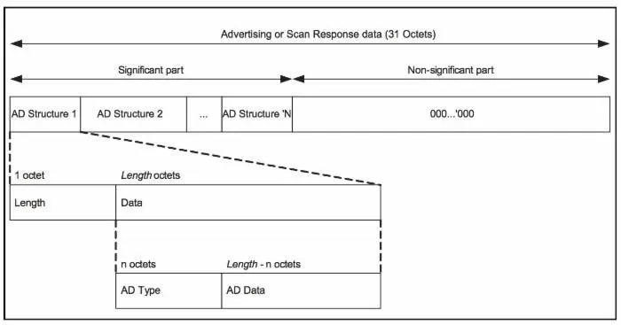
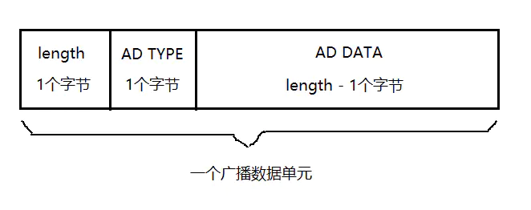
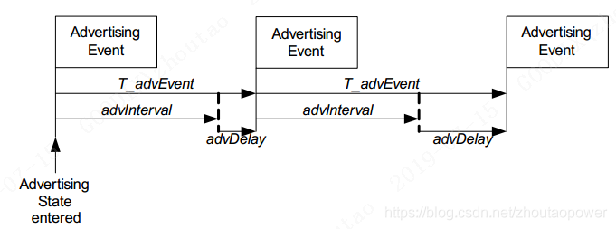

# Zephyr - BLE 广播

此处介绍的广播是传统广播，不涉及扩展广播。

## 广播数据

### 概念介绍

在传统广播里，广播包里携带的数据只有 31 个字节，一个经典的图示如下：



这 31 个字节又分为**有效部分**和**无效部分**。

有效部分也就是我们想要发送的数据，里面每一个数据单元都由一个 AD Structure 组成，N 个 AD Structure 共同填充了有效部分。

每个 AD Structure 又是由 Length + AD Type + AD Data（LTD）组成，图示如下：



- Length： 这个数据单元的长度。
- AD Type：广播数据单元的类型，蓝牙 SIG 联盟定义了一些[标准类型](https://www.bluetooth.com/specifications/assigned-numbers/generic-access-profile/)。
- AD Data：数据内容，需要根据 AD Type 来解析。

这样 BLE 传统广播的数据包内容基本介绍完了，接下来看看 Zephyr 里如何定义 AD Structure 的。

### bt_data

```C
struct bt_data {
	uint8_t type;
	uint8_t data_len;
	const uint8_t *data;
};
```

`bt_data` 就是 Zephyr 蓝牙协议栈定义的 AD Structure，其中 `type` 是该数据单元的类型（AD Type），`data` 指向数据内容（AD Data）缓冲区的首地址，而 `data_len` 是数据内容（AD Data）缓冲区的首地址，不是前面介绍的数据单元的长度（Length），数据单元的长度（Length）协议栈会自动设置。

协议栈还提供了一系列的宏来帮助我们快速构造 `bt_data`。

#### BT_DATA

```C
#define BT_DATA(_type, _data, _data_len) \
	{ \
		.type = (_type), \
		.data_len = (_data_len), \
		.data = (const uint8_t *)(_data), \
	}
```

这个参数宏的参数和 bt_data 里的成员变量是一一对应的。

使用 `BT_DATA(0x09, "name", sizeof("name")-1)` 即可快速构造一个 `bt_data`，而且它的宏名称是相应的大写版本，方便记忆。

#### BT_DATA_BYTES

```C
#define BT_DATA_BYTES(_type, _bytes...) \
	BT_DATA(_type, ((uint8_t []) { _bytes }), \
		sizeof((uint8_t []) { _bytes }))
```

有时候我们想要在定义 `bt_data` 时直接手动输入数据部分，让程序自己判断数据的长度，这个时候就可以用宏 BT_DATA_BYTES 了。这个参数宏将第 2 个参数及之后的参数全部放置到了 `_bytes` 里，然后用它构建了一个数组，并自动获取该数组的长度，从而达到了上述的目的。

例如：

```C
static const struct bt_data ad[] = {
	BT_DATA_BYTES(BT_DATA_FLAGS, BT_LE_AD_NO_BREDR),
	BT_DATA_BYTES(BT_DATA_UUID16_ALL, 0xaa, 0xfe),
	BT_DATA_BYTES(BT_DATA_SVC_DATA16,
		      0xaa, 0xfe, /* Eddystone UUID */
		      0x10, /* Eddystone-URL frame type */
		      0x00, /* Calibrated Tx power at 0m */
		      0x00, /* URL Scheme Prefix http://www. */
		      'z', 'e', 'p', 'h', 'y', 'r',
		      'p', 'r', 'o', 'j', 'e', 'c', 't',
		      0x08) /* .org */
};
```

## 广播参数

### 概念介绍

BLE 设备是以一定间隔（Interval）来广播的，每一次广播就叫做广播事件（Advertising Event），如下图：



这里 advInterval 就是广播间隔，但实际上的 T_advEvent（广播事件）还加了一个 10ms 的伪随机数（advDelay）。

如果在这一次广播事件内，对端扫描到了这个广播，那么就可以进行一系列的交互了，否则只能等待下一次的广播事件。

### bt_le_adv_param

```C
struct bt_le_adv_param {
	uint8_t  id;
	uint8_t  sid;
	uint8_t  secondary_max_skip;
	/** Bit-field of advertising options */
	uint32_t options;
	/** Minimum Advertising Interval (N * 0.625) */
	uint32_t interval_min;
	/** Maximum Advertising Interval (N * 0.625) */
	uint32_t interval_max;
	/**
	 * @brief Directed advertising to peer
	 *
	 * When this parameter is set the advertiser will send directed
	 * advertising to the remote device.
	 *
	 * The advertising type will either be high duty cycle, or low duty
	 * cycle if the BT_LE_ADV_OPT_DIR_MODE_LOW_DUTY option is enabled.
	 * When using @ref BT_LE_ADV_OPT_EXT_ADV then only low duty cycle is
	 * allowed.
	 *
	 * In case of connectable high duty cycle if the connection could not
	 * be established within the timeout the connected() callback will be
	 * called with the status set to @ref BT_HCI_ERR_ADV_TIMEOUT.
	 */
	const bt_addr_le_t *peer;
};
```

这里传统广播只需要关注 `options`，`interval_min`，`interval_max` 和 `peer` 即可。

- **options**: 广播包的类型。

这里的类型定义了很多，我这里列几个常用的，更全面地需要参考代码。

`BT_LE_ADV_OPT_CONNECTABLE`：可连接的广播包。

`BT_LE_ADV_OPT_USE_NAME`：广播使用 GAP 设备名称。

`BT_LE_ADV_OPT_SCANNABLE`：可扫描的广播包。

`BT_LE_ADV_OPT_DISABLE_CHAN_37`：不允许在通道 37 打广播。

- **interval_min**: 最小的广播间隔。
- **interval_max**: 最大的广播间隔。
- **peer**: 定向广播的地址。若该地址被设置，则广播包自动变为定向的，否则为不定向的。

协议栈也提供了辅助宏来帮助我们初始化广播参数。

#### BT_LE_ADV_PARAM_INIT

```C
#define BT_LE_ADV_PARAM_INIT(_options, _int_min, _int_max, _peer) \
{ \
	.id = BT_ID_DEFAULT, \
	.sid = 0, \
	.secondary_max_skip = 0, \
	.options = (_options), \
	.interval_min = (_int_min), \
	.interval_max = (_int_max), \
	.peer = (_peer), \
}
```

`BT_LE_ADV_PARAM_INIT` 宏传入选项，广播间隔以及对端地址来初始化一个传统广播的参数。

当前，我们一般不直接使用这个来初始化广播参数，协议栈提供了一种更便利的方式。

#### BT_LE_ADV_PARAM

```C
#define BT_LE_ADV_PARAM(_options, _int_min, _int_max, _peer) \
	((struct bt_le_adv_param[]) { \
		BT_LE_ADV_PARAM_INIT(_options, _int_min, _int_max, _peer) \
	 })
```

协议栈利用 `BT_LE_ADV_PARAM` 来构造了一个 struct bt_le_adv_param 类型的数组，里面只有一个元素，并且该参数宏展开后的含义是该数组的数组名，也就是广播参数的首地址。

借助该参数宏，协议栈定义了一系列更便捷的宏供我们使用。

```C
/* 可连接的，定向的广播包 */
#define BT_LE_ADV_CONN_DIR(_peer) BT_LE_ADV_PARAM(BT_LE_ADV_OPT_CONNECTABLE |  \
						  BT_LE_ADV_OPT_ONE_TIME, 0, 0,\
						  _peer)

/* 可连接的，不定向的广播包 */
#define BT_LE_ADV_CONN BT_LE_ADV_PARAM(BT_LE_ADV_OPT_CONNECTABLE, \
				       BT_GAP_ADV_FAST_INT_MIN_2, \
				       BT_GAP_ADV_FAST_INT_MAX_2, NULL)
/* 可连接的，不定向的广播包，并且带有 GAP 设备名 */
#define BT_LE_ADV_CONN_NAME BT_LE_ADV_PARAM(BT_LE_ADV_OPT_CONNECTABLE | \
					    BT_LE_ADV_OPT_USE_NAME, \
					    BT_GAP_ADV_FAST_INT_MIN_2, \
					    BT_GAP_ADV_FAST_INT_MAX_2, NULL)
```

这里只列举出了这三个宏，全部的辅助宏感兴趣的可以去参考代码。如果没有我们需要的，我们自己也可以按照这个格式实现。

可以看出本质上就是借用 `BT_LE_ADV_PARAM` 来构建了一个 `bt_le_adv_param` 参数，并获取了其地址，只不过中间利用了一些宏的技巧而已。

## 广播控制

协议栈提供了接口 `bt_le_adv_start` 来启动广播，`bt_le_adv_update_data` 来更新数据，`bt_le_adv_stop` 来停止广播。

### bt_le_adv_start

```C
int bt_le_adv_start(const struct bt_le_adv_param *param,
		    const struct bt_data *ad, size_t ad_len,
		    const struct bt_data *sd, size_t sd_len)
```

启动广播，并同时设置广播数据和扫描回复数据。

- **返回值**：
  - 0 表示成功，其他值表示失败。
  
- **参数**：
  - `param`：广播参数，bt_le_adv_param 结构体类型的指针，可有上述辅助宏创建。
  - `ad`, `ad_len`：广播数据数组的首地址，以及数组的长度。
  - `sd`, `sd_len` : 扫描回复数据数组的首地址，以及数组的长度。扫描回复数据与广播数据一模一样。

例如：

```C
static const struct bt_data ad[] = {
	BT_DATA_BYTES(BT_DATA_FLAGS, BT_LE_AD_NO_BREDR),
	BT_DATA_BYTES(BT_DATA_UUID16_ALL, 0xaa, 0xfe),
};
/* Set Scan Response data */
static const struct bt_data sd[] = {
	BT_DATA(BT_DATA_NAME_COMPLETE, DEVICE_NAME, DEVICE_NAME_LEN),
};
{
    ...
	bt_le_adv_start(BT_LE_ADV_CONN, ad, ARRAY_SIZE(ad),
			      sd, ARRAY_SIZE(sd));
    ...
}
```

### bt_le_adv_update_data

```C
int bt_le_adv_update_data(const struct bt_data *ad, size_t ad_len,
			  const struct bt_data *sd, size_t sd_len);
```

更新广播数据。

- **返回值**：
  - 0 表示成功，其他值表示失败。

- **参数**：
  - `ad`, `ad_len`：广播数据数组的首地址，以及数组的长度。
  - `sd`, `sd_len` : 扫描回复数据数组的首地址，以及数组的长度。扫描回复数据与广播数据一模一样。

### bt_le_adv_stop

```C
int bt_le_adv_stop(void);
```

停止广播。

- **返回值**：
  - 0 表示成功，其他值表示失败。