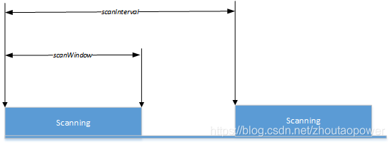
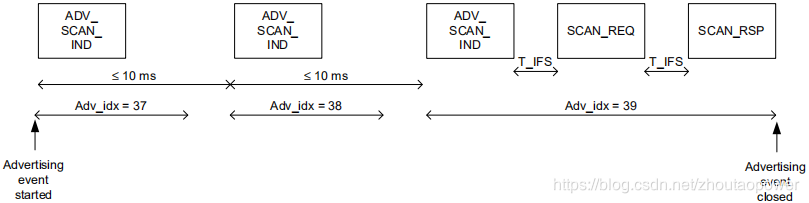

# Zephyr - BLE 扫描

## 扫描数据

协议栈提供的扫描数据有两类：数据包的相关信息，广播数据。

### bt_le_scan_recv_info

`bt_le_scan_recv_info` 结构体描述了收到数据包的相关信息。

```C
struct bt_le_scan_recv_info {
	/**
	 * @brief Advertiser LE address and type.
	 *
	 * If advertiser is anonymous then this address will be
	 * @ref BT_ADDR_LE_ANY.
	 */
	const bt_addr_le_t *addr;
	/** Advertising Set Identifier. */
	uint8_t sid;
	/** Strength of advertiser signal. */
	int8_t rssi;
	/** Transmit power of the advertiser. */
	int8_t tx_power;
	/** Advertising packet type. */
	uint8_t adv_type;
	/** Advertising packet properties. */
	uint16_t adv_props;
	/**
	 * @brief Periodic advertising interval.
	 *
	 * If 0 there is no periodic advertising.
	 */
	uint16_t interval;
	/** Primary advertising channel PHY. */
	uint8_t primary_phy;
	/** Secondary advertising channel PHY. */
	uint8_t secondary_phy;
};
```

- addr：广播者的链路地址。
- sid：不同的广播事件（扩展广播里使用）。
- rssi：广播信号的强度。
- tx_power：广播者的传输能力（物理层相关）。
- adv_type：广播包类型。

```C
/** Scannable and connectable advertising. */
BT_GAP_ADV_TYPE_ADV_IND               = 0x00,
/** Directed connectable advertising. */
BT_GAP_ADV_TYPE_ADV_DIRECT_IND        = 0x01,
/** Non-connectable and scannable advertising. */
BT_GAP_ADV_TYPE_ADV_SCAN_IND          = 0x02,
/** Non-connectable and non-scannable advertising. */
BT_GAP_ADV_TYPE_ADV_NONCONN_IND       = 0x03,
/** Additional advertising data requested by an active scanner. */
BT_GAP_ADV_TYPE_SCAN_RSP              = 0x04,
```

- adv_props：广播包属性。

```C
/** Connectable advertising. */
BT_GAP_ADV_PROP_CONNECTABLE           = BIT(0),
/** Scannable advertising. */
BT_GAP_ADV_PROP_SCANNABLE             = BIT(1),
/** Directed advertising. */
BT_GAP_ADV_PROP_DIRECTED              = BIT(2),
/** Additional advertising data requested by an active scanner. */
BT_GAP_ADV_PROP_SCAN_RESPONSE         = BIT(3),
```

interval 与周期性广播相关，此处不介绍；primary_phy 和 secondary_phy 与扩展广播相关，此处也不介绍。

### net_buf_simple

`net_buf_simple` 是收到的广播数据。这个结构体是 Zephyr 定义的，我们不用自己解析内容，BLE 协议栈提供了 `bt_data_parse` 函数来辅助解析。

```C
void bt_data_parse(struct net_buf_simple *ad,
		   bool (*func)(struct bt_data *data, void *user_data),
		   void *user_data);
```

- **参数**：
  - `ad`：`net_buf_simple` 类型数据的指针，也就是我们收到的广播数据缓冲区的指针。
  - `func`：回调函数，每次解析出一个完整的数据单元（AD Structure）就会回调 `func` 函数，传入 `bt_data` 类型数据的指针和 `user_data` 。
  - `user_data`：用户数据。

该函数是同步的，解析完所有的数据才返回。

## 扫描参数

### 概念理解

BLE 扫描是一个周期性的行为。设备每一个周期（scanInterval）进行一次扫描业务，在这个周期里，设备也不是一直都在接收广播包，而是有一个扫描窗口（scanWindow）的时间，在这个时间内接收包。如下图所示：




Passive Scanning：这种类型的扫描只收包，不发生任何包。

Active Scanning：这种类型的扫描收到可扫描的包后，会主动发送请求包（SCAN_REQ）。如下图所示：



### bt_le_scan_param

```C
/** LE scan parameters */
struct bt_le_scan_param {
	/** Scan type (BT_LE_SCAN_TYPE_ACTIVE or BT_LE_SCAN_TYPE_PASSIVE) */
	uint8_t  type;
	union {
		/** Bit-field of scanning filter options. */
		uint32_t filter_dup __deprecated;

		/** Bit-field of scanning options. */
		uint32_t options;
	};
	/** Scan interval (N * 0.625 ms) */
	uint16_t interval;
	/** Scan window (N * 0.625 ms) */
	uint16_t window;
	/**
	 * @brief Scan timeout (N * 10 ms)
	 *
	 * Application will be notified by the scan timeout callback.
	 * Set zero to disable timeout.
	 */
	uint16_t timeout;
	/**
	 * @brief Scan interval LE Coded PHY (N * 0.625 MS)
	 *
	 * Set zero to use same as LE 1M PHY scan interval.
	 */
	uint16_t interval_coded;
	/**
	 * @brief Scan window LE Coded PHY (N * 0.625 MS)
	 *
	 * Set zero to use same as LE 1M PHY scan window.
	 */
	uint16_t window_coded;
};
```

`bt_le_scan_param` 结构体就是协议栈的扫描参数。常用的有 `type`，`options`，`interval`，`window` 和 `timeout`；后面两个 `interval_coded` 和 `window_coded` 是与协议栈物理层相关的参数，一般用不到。

- `type` ：指明了扫描是 Active 还是 Passive 的。
- `interval`：扫描间隔。
- `window`：扫描窗口。
- `timeout`：超时时间。（扩展扫描使用）
- `options`：扫描选项。这里列举一些常用的选项

 `BT_LE_SCAN_OPT_NONE`：不使用扫描选项。

 `BT_LE_SCAN_OPT_FILTER_DUPLICATE`：失能重复过滤策略，这样能够实时收到同一设备更新的广播包。

 `BT_LE_SCAN_OPT_FILTER_WHITELIST`：使用白名单过滤策略，这样物理层只接收白名单里存储的设备地址发来的广播。

 `BT_LE_SCAN_OPT_CODED`：是否在 *coded PHY* 上进行扫描，开启后扫描距离会更远，但是速率会降低。

当然，协议栈为了方便我们使用，也提供了一系列的参数宏来辅助构造扫描参数。

#### BT_LE_SCAN_PARAM_INIT

```C
#define BT_LE_SCAN_PARAM_INIT(_type, _options, _interval, _window) \
{ \
	.type = (_type), \
	.options = (_options), \
	.interval = (_interval), \
	.window = (_window), \
	.timeout = 0, \
	.interval_coded = 0, \
	.window_coded = 0, \
}
```

该参数宏使用 type, options, interval 和 window 快速初始化了一个扫描参数，不常用的部分默认为 0 。

#### BT_LE_SCAN_PARAM

```C
#define BT_LE_SCAN_PARAM(_type, _options, _interval, _window) \
	((struct bt_le_scan_param[]) { \
		BT_LE_SCAN_PARAM_INIT(_type, _options, _interval, _window) \
	 })
```

为了更加方便使用，`BT_LE_SCAN_PARAM` 宏直接构造了只有一个 `bt_le_scan_param` 元素的数组，并且展开后是该数组的首地址，也就是该元素的地址。

协议栈还利用 `BT_LE_SCAN_PARAM`  构造了一些常用的宏供我们使用：

```C
/* Active 扫描 */
#define BT_LE_SCAN_ACTIVE BT_LE_SCAN_PARAM(BT_LE_SCAN_TYPE_ACTIVE, \
					   BT_LE_SCAN_OPT_FILTER_DUPLICATE, \
					   BT_GAP_SCAN_FAST_INTERVAL, \
					   BT_GAP_SCAN_FAST_WINDOW)
/* Pasive 扫描 */
#define BT_LE_SCAN_PASSIVE BT_LE_SCAN_PARAM(BT_LE_SCAN_TYPE_PASSIVE, \
					    BT_LE_SCAN_OPT_FILTER_DUPLICATE, \
					    BT_GAP_SCAN_FAST_INTERVAL, \
					    BT_GAP_SCAN_FAST_WINDOW)
/* 在 Coded PHY Active 扫描 */
#define BT_LE_SCAN_CODED_ACTIVE \
		BT_LE_SCAN_PARAM(BT_LE_SCAN_TYPE_ACTIVE, \
				 BT_LE_SCAN_OPT_CODED | \
				 BT_LE_SCAN_OPT_FILTER_DUPLICATE, \
				 BT_GAP_SCAN_FAST_INTERVAL, \
				 BT_GAP_SCAN_FAST_WINDOW)
/* 在 Coded PHY Pasive 扫描 */
#define BT_LE_SCAN_CODED_PASSIVE \
		BT_LE_SCAN_PARAM(BT_LE_SCAN_TYPE_PASSIVE, \
				 BT_LE_SCAN_OPT_CODED | \
				 BT_LE_SCAN_OPT_FILTER_DUPLICATE, \
				 BT_GAP_SCAN_FAST_INTERVAL, \
				 BT_GAP_SCAN_FAST_WINDOW)
```

## 控制扫描

### bt_le_scan_cb_register

```C
struct bt_le_scan_cb {
	/**
	 * @brief Advertisement packet received callback.
	 *
	 * @param info Advertiser packet information.
	 * @param buf  Buffer containing advertiser data.
	 */
	void (*recv)(const struct bt_le_scan_recv_info *info,
		     struct net_buf_simple *buf);
	/** @brief The scanner has stopped scanning after scan timeout. */
	void (*timeout)(void);
	sys_snode_t node;
};

void bt_le_scan_cb_register(struct bt_le_scan_cb *cb);
```

`bt_le_scan_cb_register` 用于注册一个全局的扫描回调结构体。

- **参数**：
  - `cb`，`bt_le_scan_cb` 结构体类型的指针，其指向的结构体必须保持有效，最好是静态变量。

`bt_le_scan_cb` 结构体包含了 

- `recv` 函数，每次收到广播包后就会回调该函数。
- `timeout` 函数，如果开启扫描时提供了扫描超时时间，那么协议栈停止扫描时会回调该函数。
- `node` 是一个链表节点，这意味着可以多次调用 `bt_le_scan_cb_register` 来注册多个结构体，提高了编程的灵活性。

### bt_le_scan_cb_unregister

```
void bt_le_scan_cb_unregister(struct bt_le_scan_cb *cb);
```

`bt_le_scan_cb_unregister` 用于取消注册一个扫描回调结构体。

- **参数**：
  - `cb`，`bt_le_scan_cb` 结构体类型的指针，其指向的结构体必须保持有效，最好是静态变量。

## 开启扫描

```C
typedef void bt_le_scan_cb_t(const bt_addr_le_t *addr, int8_t rssi,
			     uint8_t adv_type, struct net_buf_simple *buf);

int bt_le_scan_start(const struct bt_le_scan_param *param, bt_le_scan_cb_t cb);
```

`bt_le_scan_start` 用于开启扫描。

- **参数**：
  - `params`：扫描参数。
  - `cb`：扫描回调函数，协议栈收到广播数据后会回调该函数。与使用 `bt_le_scan_cb_register` 注册的回调结构体不同，`cb` 只针对本次扫描有效，而前者针对所有的扫描都有效。`cb` 可以为 NULL 。
- **返回值**：
  - 0 表示成功，其他值表示失败。

## 停止扫描

```C
int bt_le_scan_stop(void);
```

`bt_le_scan_stop` 用于手动停止扫描，前面还介绍了使用 timeout 协议栈会自动停止扫描。

- **返回值**：
  - 0 表示成功，其他值表示失败。

## 内核配置

想要使用 Zephyr Bluetooth 协议栈的扫描功能，需要配置内核，在 prj.conf 文件里添加下述内容即可，或者通过 `west build -t guiconfig` 方法配置。 

```
CONFIG_BT_OBSERVER=y
```


-----

参考：

[BLE（10）—— 细说 Scanning](https://blog.csdn.net/zhoutaopower/article/details/96120397)

[BLE（14）—— Device Filtering](https://blog.csdn.net/zhoutaopower/article/details/96434930)

