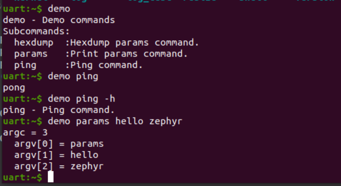

# Zephyr - Shell

版本：Zephyr v2.4-branch 。

## 概要介绍

Zephyr Shell 组件运行用户为 Shell 命令创建处理函数，是 Unix 风格的 Shell，支持下述特性：

- 支持多个实例（Segger RTT，UART，DUMMY , ），master 分支还支持 Telnet, USB, SMP。
- 与日志系统有更好地协作性。
- 支持静态和动态命令。
- 支持 `Tab` 键补全。
- 内嵌命令：**clear**, **shell**, **colors**, **echo**, **history**, **resize** 。
- 使用 `↑` `↓` 键浏览最近的执行命令。
- 支持文本编辑：`←`, `→`, `Backspace`, `Delete`, `End`, `Home`, `Insert`。
- 支持 ANSI 转义字符：`VT100` 控制光标，`ESC[n~` 控制颜色。
- 支持多行命令。
- 内嵌显示 Shell 命令帮助信息的函数。（特色）
- 支持通配符：`*`, `?` 。
- 支持元键（meta keys）。
- 可使用 Kconfig 配置内存使用率。

更详细的介绍可以参考官方 [Shell文档](https://docs.zephyrproject.org/2.4.0/reference/shell/index.html)。

## 命令

Shell 命令以树形结构进行组织，并且分为以下几种类型：

- 根命令：被收集且以字母顺序存储在一个特定的段（section）里。
- 静态命令：数量和语法（syntax）必须在编译期都知道。
- 动态命令：数量和语法（syntax）可以在编译器不知道。

### 静态命令

一棵静态命令树如下图所示：


demo 命令是根命令，params，ping 命令都是子命令，而且都是静态命令。命令效果如下：



输入 `demo` 根命令，若该命令没有处理函数，则会自动显示所有的子命令，以及他们的帮助信息，相当于 `demo -h` 的效果。输入 `demo ping` 执行 ping 程序，输入 `demo params` 执行 params 程序。

上述例程可以在 samples/subsys/shell/shell_module/src/main.c 里找到，关键代码如下：

```C
/* Creating subcommands (level 1 command) array for command "demo". */
SHELL_STATIC_SUBCMD_SET_CREATE(sub_demo,
        SHELL_CMD(params, NULL, "Print params command.",
                                               cmd_demo_params),
        SHELL_CMD(ping,   NULL, "Ping command.", cmd_demo_ping),
        SHELL_SUBCMD_SET_END
);
/* Creating root (level 0) command "demo" */
SHELL_CMD_REGISTER(demo, &sub_demo, "Demo commands", NULL);
```

首先使用 `SHELL_STATIC_SUBCMD_SET_CREATE` 创建静态子命令数组，其中 `sub_demo` 是子命令集的名称（此处利用宏构建了一个结构体数组，标识符是 sub_demo）。然后使用 `SHELL_CMD` 创建具体的子命令，`params` 是命令语法，也就是需要在 Shell 里输入的；`NULL` 代表 `params` 命令下没有子命令了（如有需为指向子命令的数组的指针）；`"Print params command."` 是帮助信息，添加后缀 -h 或 --help 会自动显示，不需要应用程序手动处理，使用感极佳。`cmd_demo_params` 是命令的处理函数。`ping` 命令也是类似的，就不介绍了，最后注意子命令数组需要以 `SHELL_SUBCMD_SET_END` 结束。

然后使用 `SHELL_CMD_REGISTER` 来创建根命令，`demo` 是命令语法，`&sub_demo` 是之前创建的子命令数组的指针，`"Demo commands"` 是帮助信息，`NULL` 表示该命令没有处理函数。

这样就完成了 Shell 静态命令的创建，而且集成了帮助信息，命令层次清晰，使用方便。

与上述命令相关的 API 地址如下：

[`SHELL_CMD_REGISTER`](https://docs.zephyrproject.org/2.4.0/reference/shell/index.html#c.SHELL_CMD_REGISTER)

[`SHELL_STATIC_SUBCMD_SET_CREATE`](https://docs.zephyrproject.org/2.4.0/reference/shell/index.html#c.SHELL_STATIC_SUBCMD_SET_CREATE) 

[`SHELL_CMD`](https://docs.zephyrproject.org/2.4.0/reference/shell/index.html#c.SHELL_CMD)

除此之外，在创建命令时还有一种方法可以使用：[`SHELL_CMD_ARG`](https://docs.zephyrproject.org/2.4.0/reference/shell/index.html#c.SHELL_CMD_ARG) 。

```C
SHELL_CMD_ARG(syntax, subcmd, help, handler, mand, opt)
```

利用该宏创建的命令会强制检查命令的参数使用满足要求，`mand` 表示强制（mandatory）需要的参数个数，`opt` 表示可选（optional）的参数个数，这样的好处是我们可以在应用程序里直接使用参数，而不需要在程序里处理 `if (argc < mand)` 这类的情况，Shell 组件会自动输出帮助信息来处理。

此处需注意 Shell 组件传入子命令参数时，也会将子命令当作一个参数传递，参考命令 `demo params` 。

### 动态命令

动态命令也就是指命令可以动态添加和删除，极其灵活。一个动态命令树如下所示：


由于我还不知道动态命令的具体使用场景，就没有去具体研究，留待以后补充吧。


----

更多更全面的内容请参考官方 [Shell文档](https://docs.zephyrproject.org/2.4.0/reference/shell/index.html#c.SHELL_CMD)。