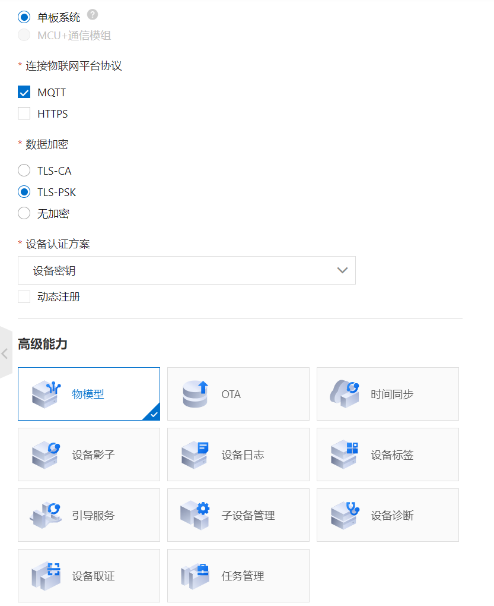
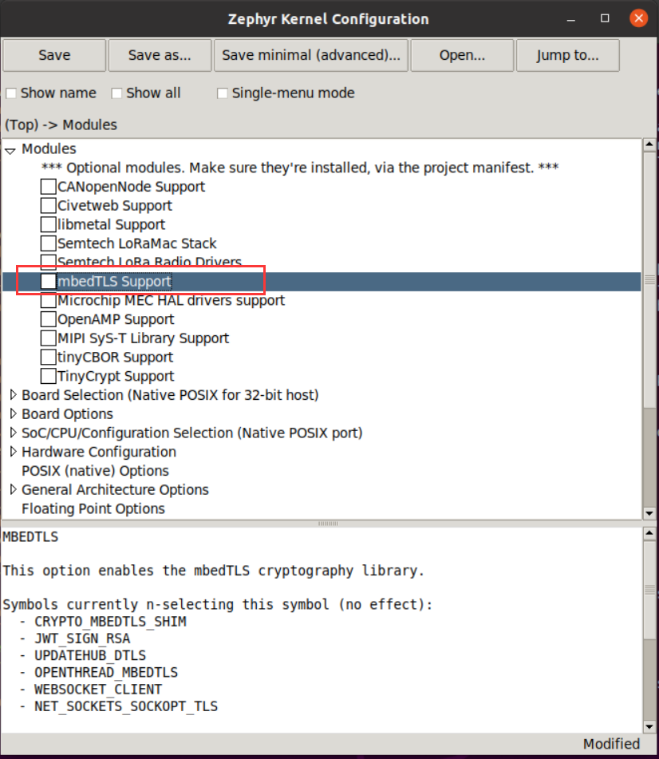
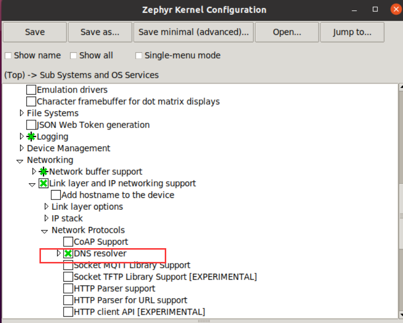
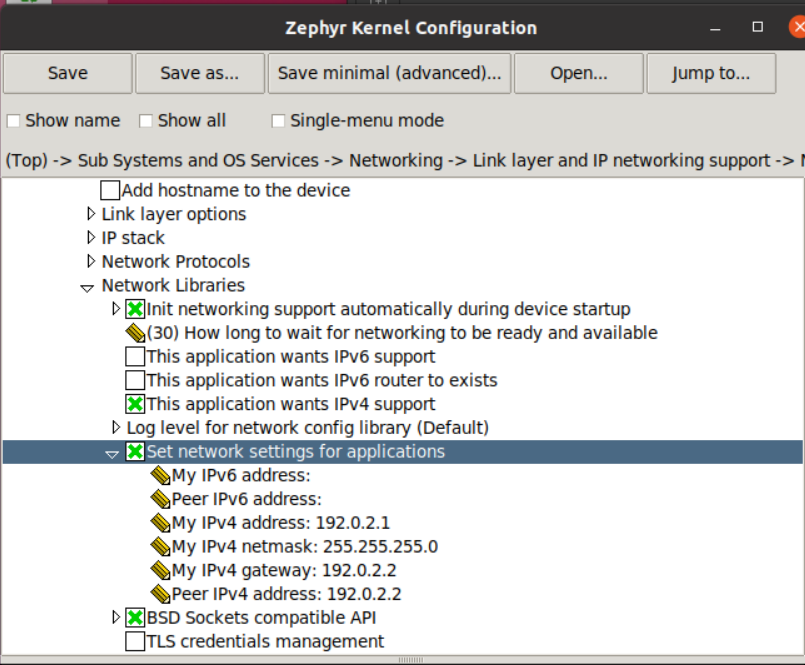

# Zephyr native_posix 环境移植阿里云 LinkSDK 4.x 

本文章主要介绍了如何将 LinkSDK 4.x 移植到 Zephyr 的 native_posix 环境上。

由于 LinkSDK 4.x 可以运行在 POSIX 兼容层，而且云平台也提供了相应的移植代码，还提供了 mbedtls。因此移植的主要工作是配置 Zephyr 的 POSIX 兼容层，关闭自带的 mbedtls，而且需要配置 IPv4 网络，为 LinkSDK 4.x 添加构建代码进行编译链接。

## 下载 LinkSDL 4.x

进入阿里云平台按照要求[获取 SDK 4.x](https://help.aliyun.com/document_detail/163755.html?spm=a2c4g.11186623.2.5.38527748Tvcdfg)。

下载 SDK 时需要注意，选择不同的**高级功能**时，需要在后续修改构建文件才能参与构建。这里我只选择了**物模型**。



## 配置工程目录

如何进行应用程序开发，可以参考[官方手册](https://docs.zephyrproject.org/latest/application/index.html)，这里我列出自己的移植。

首先进入一个准备开发应用程序的目录，我这里是

```
jackis@jackis-zephyr:~$ cd zephyrproject/gateway/
jackis@jackis-zephyr:~/zephyrproject/gateway$
```

然后创建文件和目录如下：

```
jackis@jackis-zephyr:~/zephyrproject/gateway$ tree -L 1
.
├── CMakeLists.txt
├── prj.conf
└── src

1 directory, 2 files
```

其中 CMakeLists.txt 是编译文件，prj.conf 是内核配置文件，src 目录是我们存放源代码的位置。

将前面下载的 LinkSDK 解压缩后放置到 src 目录下，并将里面的 demo 文件 `mqtt_basic_demo.c` 也复制一份到 src 目录下，结果如下

```
jackis@jackis-zephyr:~/zephyrproject/gateway$ tree -L 2
.
├── CMakeLists.txt
├── prj.conf
└── src
    ├── LinkSDK
    └── mqtt_basic_demo.c

2 directories, 3 files
```

## 配置 Zephyr 内核

由于我们的运行环境是 native_posix，相应的 POSIX 兼容层环境会自动添加，不需要我们配置。

网络环境的配置参考：[Zephyr - natite_posix 运行 socket 例程](./Zephyr - natite_posix 运行 socket 例程)。

在当前的目录下输入

```
jackis@jackis-zephyr:~/zephyrproject/gateway$ west build -b native_posix -t guiconfig
```

进入内核配置 GUI 界面，在里面找到 `mbedTLS Support`，取消勾选。



在 Sub Systems and OS Services - Networking - Network Protocols 里勾选 DNS resolver 开启 DNS 服务。



然后在 Sub Systems and OS Services - Networking - Network Libraries - Set network settings for applications 里添加 IPv4 地址，网关地址。



如果嫌这样配置麻烦，可以在 prj.conf 文件里添加下述内容即可，它会自动地将当前工程所用的内核配置成上述模式。

```
# General config
CONFIG_NEWLIB_LIBC=y

# Networking config
CONFIG_NETWORKING=y
CONFIG_NET_IPV4=y
# CONFIG_NET_IPV6=y
CONFIG_NET_TCP=y
CONFIG_NET_SOCKETS=y
CONFIG_NET_SOCKETS_POSIX_NAMES=y

CONFIG_DNS_RESOLVER=y
CONFIG_DNS_SERVER_IP_ADDRESSES=y
CONFIG_DNS_SERVER1="8.8.8.8"

# Network driver config
CONFIG_TEST_RANDOM_GENERATOR=y

# Network address config
CONFIG_NET_CONFIG_SETTINGS=y
CONFIG_NET_CONFIG_NEED_IPV4=y
CONFIG_NET_CONFIG_MY_IPV4_ADDR="192.0.2.1"
CONFIG_NET_CONFIG_PEER_IPV4_ADDR="192.0.2.2"
CONFIG_NET_CONFIG_MY_IPV4_GW="192.0.2.2"

# Network debug config
CONFIG_NET_LOG=y

# POSIX API
CONFIG_POSIX_API=y
CONFIG_PTHREAD_IPC=y
CONFIG_MAX_PTHREAD_COUNT=20
CONFIG_SEM_VALUE_MAX=32767
CONFIG_POSIX_CLOCK=y
CONFIG_MAX_TIMER_COUNT=10
CONFIG_POSIX_MQUEUE=y
CONFIG_EVENTFD=y
CONFIG_EVENTFD_MAX=5

# Enable Mbed TLS configuration
CONFIG_MBEDTLS=n
```

## 编写构建文件

这里我们添加 CMakeLists.txt 里的内容，使用 CMake 构建语法，主要是将 LinkSDK 加入 Zephyr 的构建，参考官方手册以及其他例程的构建文件，我写的如下：

```
# Find Zephyr. This also loads Zephyr's build system.
cmake_minimum_required(VERSION 3.13.1)
find_package(Zephyr REQUIRED HINTS $ENV{ZEPHYR_BASE})
project(gateway)

# Add your source file to the "app" target. This must come after
# find_package(Zephyr) which defines the target.

FILE(GLOB app_sources   src/*.c 
                        src/LinkSDK/components/data-model/*.c
                        src/LinkSDK/core/*.c
                        src/LinkSDK/core/sysdep/*.c
                        src/LinkSDK/core/utils/*.c
                        src/LinkSDK/external/*.c
                        src/LinkSDK/external/mbedtls/library/*.c
                        src/LinkSDK/portfiles/aiot_port/*.c)

include_directories(./ 
                    src/LinkSDK/components/data-model 
                    src/LinkSDK/core 
                    src/LinkSDK/core/sysdep
                    src/LinkSDK/external/mbedtls/include
                    src/LinkSDK/core/utils)

target_sources(app PRIVATE ${app_sources})
```

## 测试

打开一个终端，进入 `net-tools` 目录，输入 `./net-setup.sh` 创建一个以太网接口，这个在 [Zephyr - natite_posix 运行 socket 例程](./Zephyr - natite_posix 运行 socket 例程) 里有介绍。

然后再打开一个终端，进入应用工程目录，输入下述命令构建工程，

```
jackis@jackis-zephyr:~/zephyrproject/gateway$ west build -b native_posix
```

构建完成后再输入命令运行程序

```
jackis@jackis-zephyr:~/zephyrproject/gateway$ west build -t run
```

可以看到下述现象

```
jackis@jackis-zephyr:~/zephyrproject/gateway$ west build -t run
-- west build: running target run
[0/1] cd /home/jackis/zephyrproject/gateway/build && /home/jackis/zephyrproject/gateway/build/zephyr/zephyr.exe
WARNING: Using a test - not safe - entropy source
*** Booting Zephyr OS build zephyr-v2.4.0-8-g9c30e7946974  ***
[00:00:00.000,000] <inf> net_config: Initializing network
[00:00:00.000,000] <inf> net_config: IPv4 address: 192.0.2.1
[1611925016.544][LK-0313] MQTT user calls aiot_mqtt_connect api, connect
[1611925016.544][LK-0317] mqtt_basic_demo&a13FN5TplKq
[1611925016.544][LK-0318] 4780A5F17990D8DC4CCAD392683ED80160C4C2A1FFA649425CD0E2666A8593EB
establish mbedtls connection with server(host='a13FN5TplKq.iot-as-mqtt.cn-shanghai.aliyuncs.com', port=[443])
success to establish tcp, fd=4
success to establish mbedtls connection, fd = 4(cost 43270 bytes in total, max used 45882 bytes)
[1611925016.888][LK-0313] MQTT connect success in 332 ms
AIOT_MQTTEVT_CONNECT
heartbeat response
```

成功连接阿里云的 MQTT Broker 。