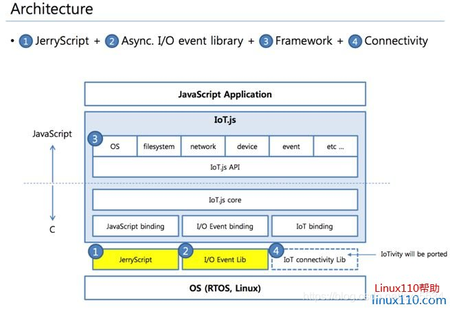
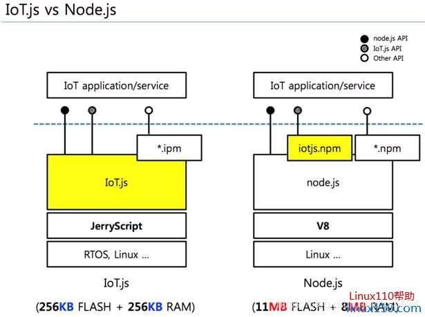
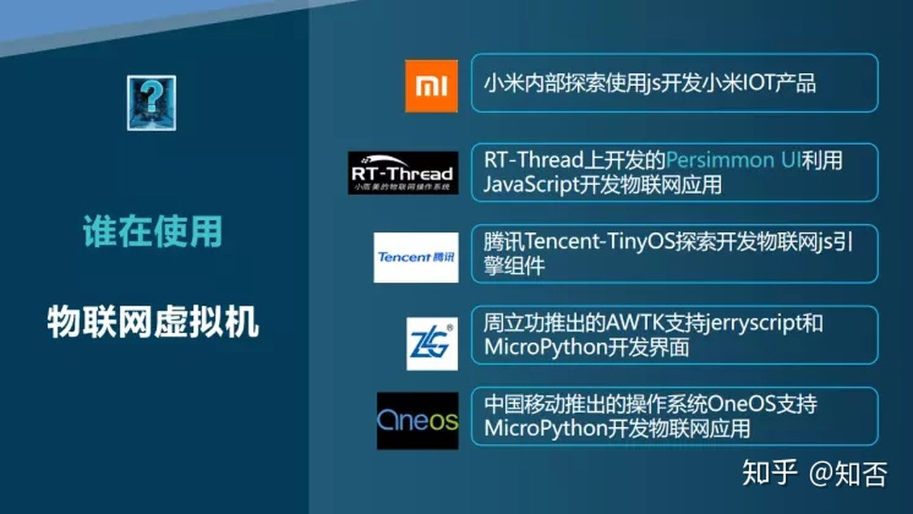

# Jerryscript 简介

## 概述

[Jerryscript](https://github.com/jerryscript-project/jerryscript) 是由三星开发的一款JavaScript引擎，是为了让JavaScript开发者能够构建物联网应用。物联网设备在CPU性能和内存空间上都有着严重的制约。

因此，三星设计了JerryScript引擎，JerryScript 是一个轻量级的 JavaScript 引擎，它可以运行在受限制的设备上，例如微控制器：

- 只有几 KB RAM 能运行引擎的设备（<64 KB RAM）。
- 只能为代码引擎提供有限 ROM 空间的设备（<200 KB ROM）。

该引擎支持设备上编译，提供从 JavaScript 到外设的访问。

JerryScript的主要特征：

1. 完全符合ECMAScript 5.1标准。
2. 为ARM Thumb-2编译时，二进制大小为160K。
3. 大量优化以降低内存消耗。
4. 使用C99编写，以实现最大的可移植性。
5. 快照支持将JavaScript源代码预编译为字节码。
6. 成熟的C API，易于嵌入到应用程序中。

[IoT.js](https://github.com/jerryscript-project/iotjs) 旨在为物联网提供一个基于 Web 技术的可相互操作的服务平台。IoT.js 的目标是要在资源受限的设备上良好运行，例如只有几 KB 的 RAM。

## demo 使用介绍

JS 里 `print` 函数利用 jerrycript 实现的 [demo](https://github.com/jerryscript-project/jerryscript/blob/master/docs/03.API-EXAMPLE.md#example-5-passing-and-processing-arguments-for-native-c-code) 。

利用 IoT.js 来学习 jerryscript 如何使用，[IoT.js](https://github.com/jerryscript-project/iotjs/wiki/Developer-Tutorial) 提供了一套 JS 运行时库。

RT-Thread 里的 [jerryscript](https://github.com/RT-Thread-packages/jerryscript) 。