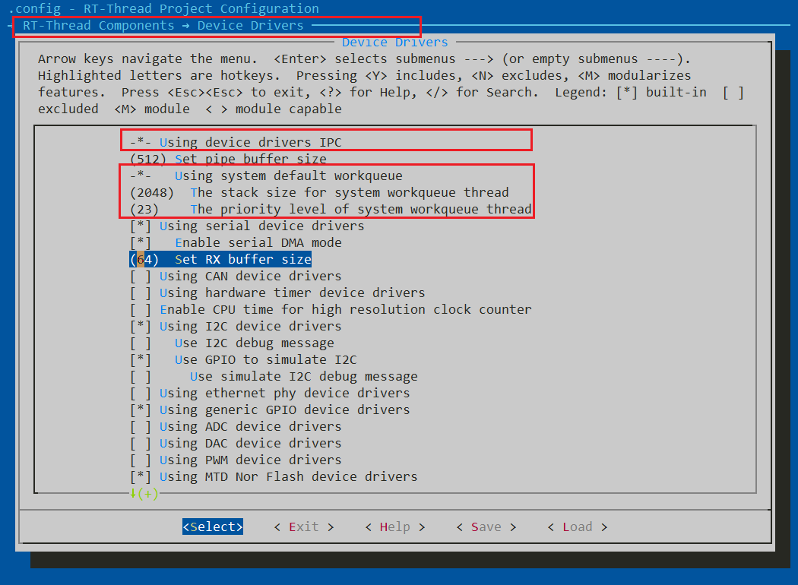
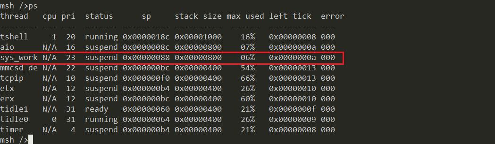
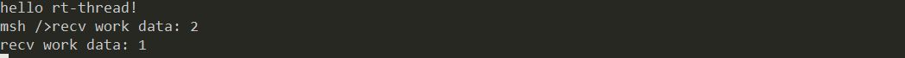
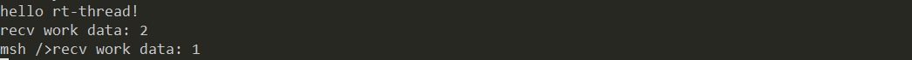
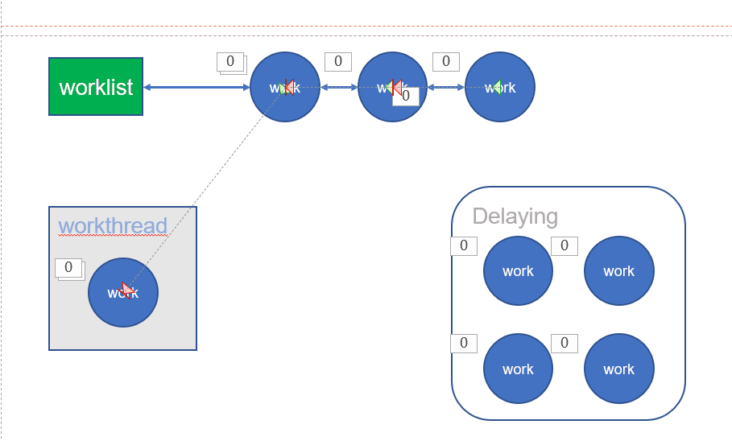
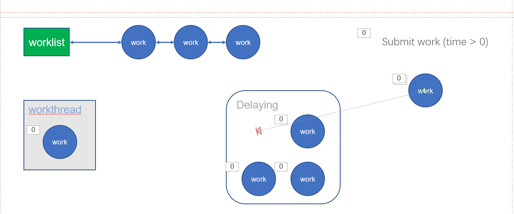
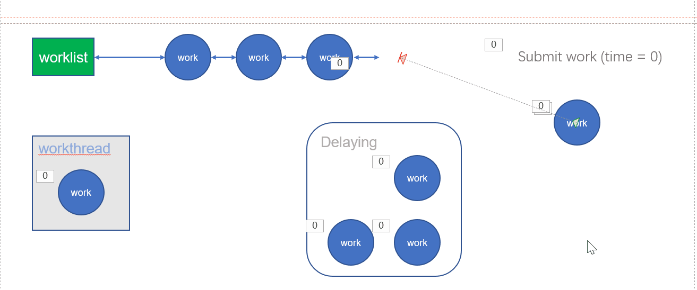
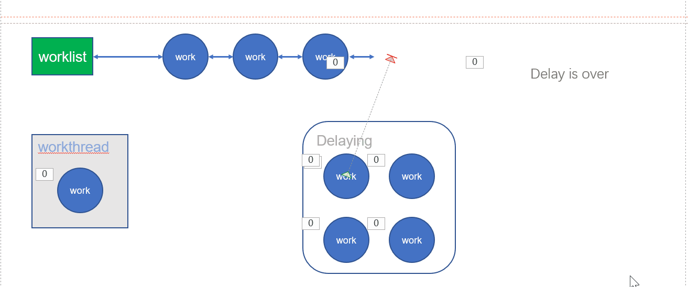

# RT-Thread workqueue 详解

在学习之前可以先去了解一下工作队列的使用场景：[工作队列 ( workqueue )](https://blog.csdn.net/ScilogyHunter/article/details/109765492)。

简而言之，工作队列就是将一些工作任务的执行延迟，交由内核线程异步执行。

## 如何使用

最简单的使用方式就是开启 RT-Thread 的系统工作线程（System workqueue），而我们往系统工作线程里提交工作项（work item）即可。

RT-Thread 其实给我们提供了一个系统工作线程了，但很少有人知道。配置选项路径如下图所示：



```
RT-Thread Components
	->	Device Drivers
		->	Using device drivers IPC
			-> Using system default workqueue
```

依次选中上述这些选项，就能够开启系统工作队列了。而且还可以看到工作队列线程的栈大小默认为 2048，优先级为 23 。

这样系统在初始化的时候就创建了系统工作队列了，名字叫作 `sys_work`，在终端输入 `ps` 能够看到该线程。



**如何向系统工作线程里添加工作项呢？**

```C
/**
 * @brief Submit a work to system workqueue.
 * @param work A work item.
 * @param time Action delay time.
 * @return RT_EOK on success, Ohters on fail.
*/
rt_err_t rt_work_submit(struct rt_work *work, rt_tick_t time);
/**
 * @brief Cancel a work in system workqueue.
 * @param work A work item.
 * @return RT_EOK on success, Others on fail.
*/
rt_err_t rt_work_cancel(struct rt_work *work);
```

`rt_work_submit()` 用于向系统工作队列添加工作项，`rt_work_cancel()` 用于从系统工作队列中取消某一个工作项。

当然，在提交工作项时，需要初始化该工作项，绑定相应的回调函数和用户指针，接口如下：

```C
/**
 * @brief Init a work item.
 * @param work_func A callback function.
 * @param work_data User data pass to `work_func`.
 * @return None.
*/
rt_inline void rt_work_init(struct rt_work *work, void (*work_func)(struct rt_work *work, void *work_data), void *work_data)
```

这样，我们就可以随时随地地提交工作任务执行了，极大地方便了程序的组织。

**用一个小例程测试一下：**

在 qemu 项目里的 main.c 里输入：

```C
#include <stdio.h>
#include <dlfcn.h>
#include <rtthread.h>
#include <ipc/workqueue.h>


struct rt_work work1;
int work1_data = 1;

struct rt_work work2;
int work2_data = 2;

void work_func(struct rt_work *work, void *work_data)
{
    int data = *(int *)work_data;
    rt_kprintf("recv work data: %d\n", data);
}

int main(void)
{
    printf("hello rt-thread!\n");

    rt_work_init(&work1, work_func, &work1_data);
    rt_work_init(&work2, work_func, &work2_data);

    rt_work_submit(&work1, 2);
    rt_work_submit(&work2, 0);

    return 0;
}
```

然后执行就能看到下述效果，与工作项绑定的任务被异步执行了，而且工作项 1 延迟了 2 个 tick 才执行。



## rt_workqueue

rt_workqueue 的接口有很多，我们只需要关注常用的即可。

```C
/**
 * @brief Create a workqueue.
 * @param name Workqueue thread name.
 * @param stack_size Workqueue thread stack size.
 * @param priority Workqueu thread priority.
 * @return Workqueue handle.
*/
struct rt_workqueue *rt_workqueue_create(const char *name, rt_uint16_t stack_size, rt_uint8_t priority);
/**
 * @brief Destory a workqueue.
 * @param queue Workqueue handle.
 * @return RT_EOK on success, Others on fail.
*/
rt_err_t rt_workqueue_destroy(struct rt_workqueue *queue);
/**
 * @brief Submit a work item to workqueue.
 * @param queue Workqueue handle.
 * @param work Work item.
 * @param time Action delay time.
 * @return RT_EOK on success, Others on fail.
 * 
*/
rt_err_t rt_workqueue_submit_work(struct rt_workqueue *queue, struct rt_work *work, rt_tick_t time);
/**
 * @brief Cancel a work item in workqueue.
 * @param queue Workqueue handle.
 * @param work Work item.
 * @return RT_EOK on success, Others on fail.
 * 
*/
rt_err_t rt_workqueue_cancel_work(struct rt_workqueue *queue, struct rt_work *work);
```

首先使用 `rt_workqueue_create()` 创建一个工作队列，然后使用  `rt_workqueue_submit_work()` 提交工作项，使用 `rt_workqueue_cancel_work()` 取消工作项，当然还可以使用 `rt_workqueue_destroy()` 销毁一个工作队列。其他的接口有兴趣的可以了解，但常用的就是上面这四种。

这里提交任务与上述使用系统工作队列的唯一不同之处就是我们需要手动指定工作队列，其他的都是一模一样的。

**用一个小例程测试一下：**

在 qemu 项目里的 main.c 里输入：

```C
#include <stdio.h>
#include <dlfcn.h>
#include <rtthread.h>
#include <ipc/workqueue.h>


struct rt_work work1;
int work1_data = 1;

struct rt_work work2;
int work2_data = 2;

void work_func(struct rt_work *work, void *work_data)
{
    int data = *(int *)work_data;
    rt_kprintf("recv work data: %d\n", data);
}

int main(void)
{
    printf("hello rt-thread!\n");

    struct rt_workqueue *wq = rt_workqueue_create("my_wq", 2048, 20);
    RT_ASSERT(wq);

    rt_work_init(&work1, work_func, &work1_data);
    rt_work_init(&work2, work_func, &work2_data);

    rt_workqueue_submit_work(wq, &work1, 2);
    rt_workqueue_submit_work(wq, &work2, 0);

    return 0;
}
```

然后执行就能看到下述效果，与工作项绑定的任务被异步执行了，而且工作项 1 延迟了 2 个 tick 才执行。



## 实现

关于实现部分我这里不介绍具体细节，做了一些动画给大家展示一下内部过程

工作队列里面有一个线程(workthread)，这个线程的任务就是不断地从挂载链表(worklist)里提取工作项执行，若没有则休眠。



然后提交工作项时，若延迟时间 time 大于 0，则启动该工作项的定时器，定时结束后再加入挂载链表(worklist)。



若提交工作项时延迟实际等于 0，则直接将该工作项挂加入到挂载链表(worklist)。



当然，工作项的定时器超时后，会自动将该工作项加入到挂载链表(worklist)。

