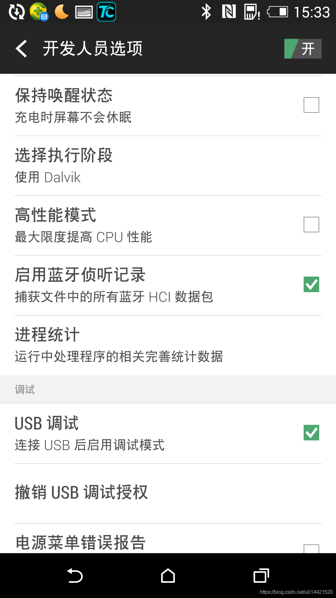
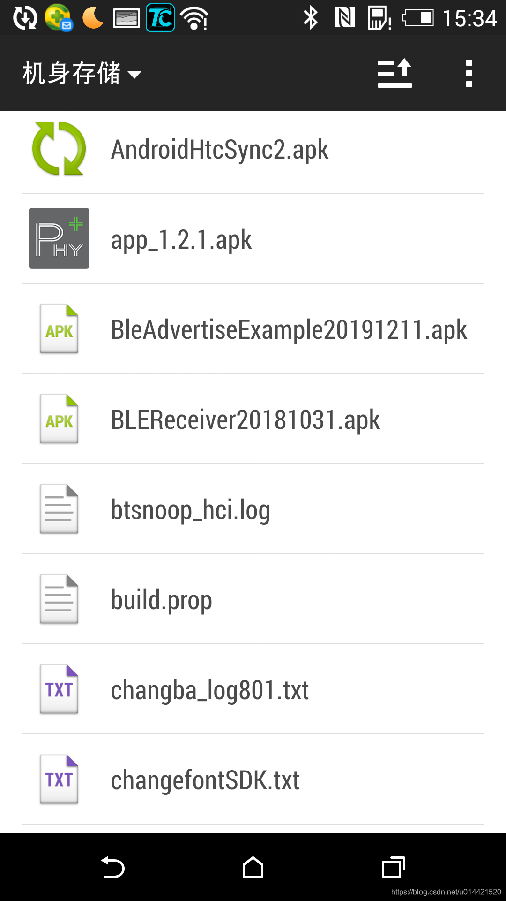
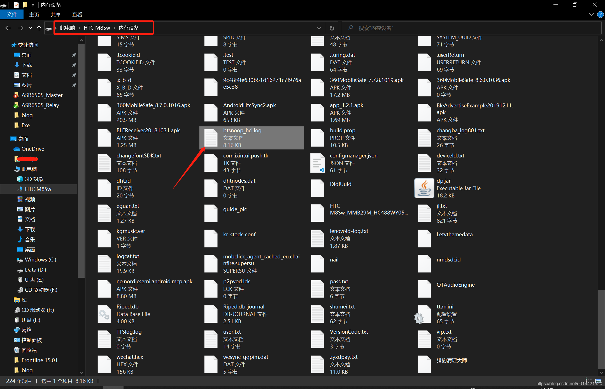
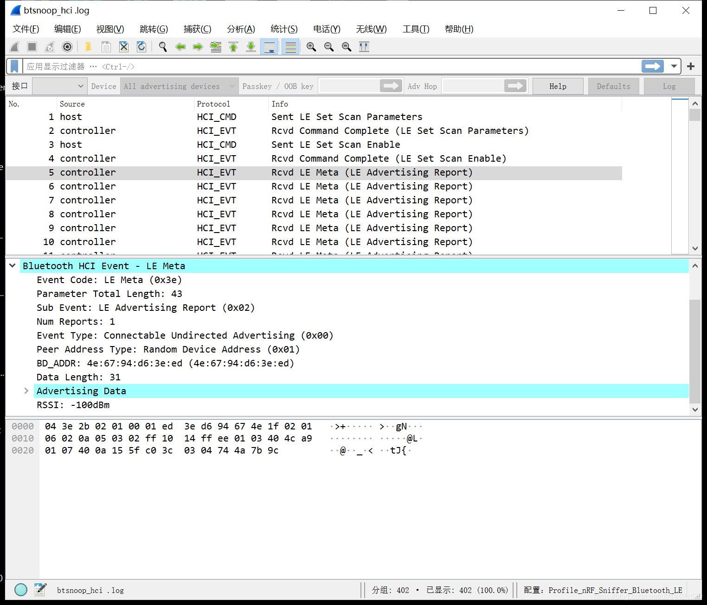
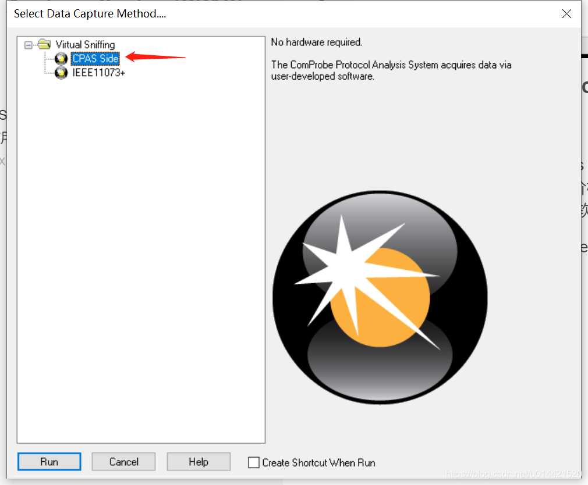
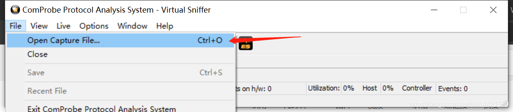
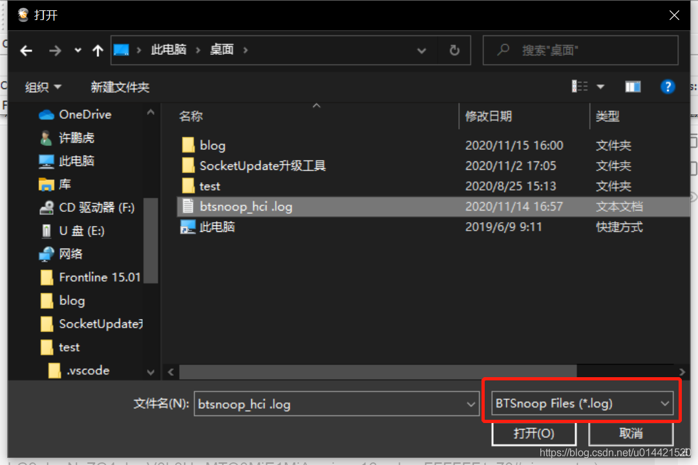
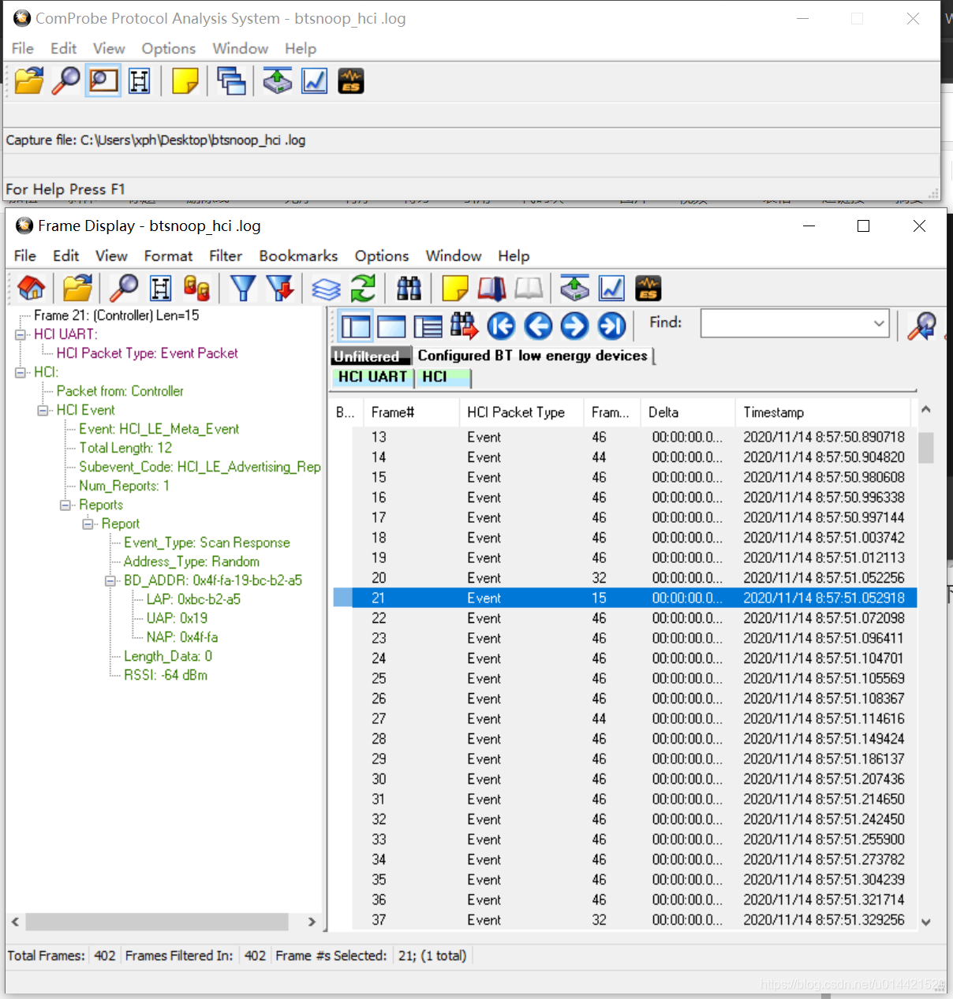

# 使用Android手机抓取蓝牙HCI包

##  准备工作

- 一台安卓手机（应该不需要root权限）
- wireshark
- Frontline ComProbe Protocol Analysis System(CPAS)

## log文件获取

### 打开HCI侦听选项

- 在Android手机 设置->开发人员选项中开启USB调试并打开HCI侦听选项，如下图所示：

### 使用手机蓝牙和设备通讯
- 使用手机和蓝牙设备正常调试，这个时候的数据包会被记录到btsnoop_hci.log日志文件中，一般情况下在手机存储的根目录下

- 将该文件拷贝到PC上就可以使用专用软件分析了

## log文件分析

这里介绍两个HCI log分析软件

### wireshark
### 安装
wireshark是一款免费的功能强大的协议分析软件，安装没有特别需要注意的事项，一路next即可安装成功。大家可以直接去[官网](https://www.wireshark.org/download.html)下载该软件。
### 使用
使用wireshark直接打开我们拷贝到PC上面的log文件，如下图所示，就可以直接分析了。

### Frontline ComProbe Protocol Analysis System(CPAS)

### 安装
Frontline ComProbe Protocol Analysis System(CPAS)是一款专用蓝牙协议分析软件，有其专门的硬件抓包工具，但是价格不菲，不过我们可以使用其软件来分析手机抓到的HCI log，可以去其[官网](https://www.fte.com/products/default.aspx)下载该软件。

安装没有特别需要注意的事项，一路next下去即可。

### 使用
- 打开软件，选择CPAS Side

- file -> open capture file

- 选择对应的log文件打开

- 接下来就可以分析了

还有一种方式将`*.log`文件改为`*.cfa`文件，然后双击打开，效果是一样的。

## FAQ

### 红米K30 pro抓包注意事项

- 打开通话界面，输入`*#*#5656#*#*`  这个可以打开btsnoopy选项配置
- 进入开发者者权限
- “打开蓝牙数据包日志” 选择启用
- 在目录/storage/emulatd/0/MIUI/debug_log/common/com.android.bluetooth/目录下面可以找到该文件

