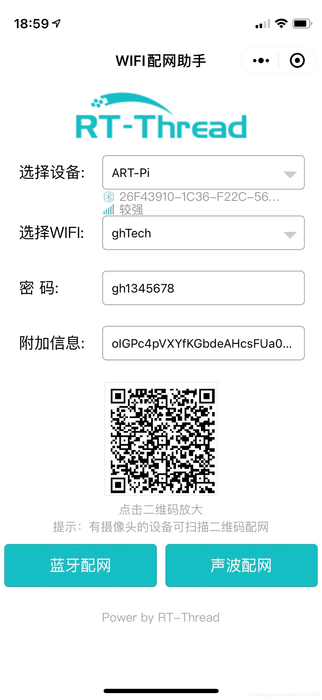
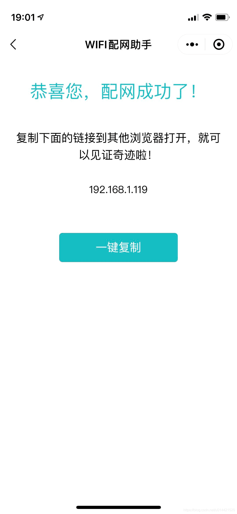
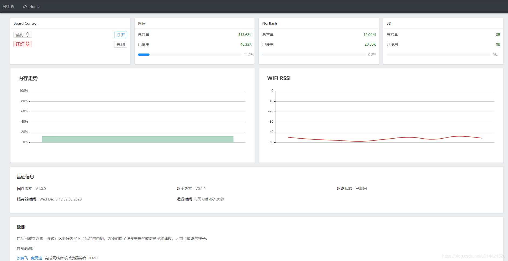
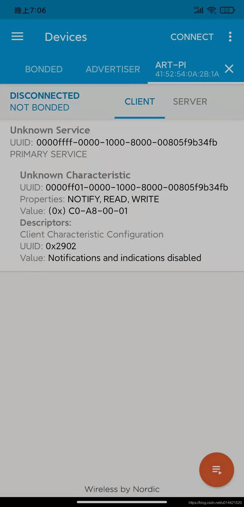
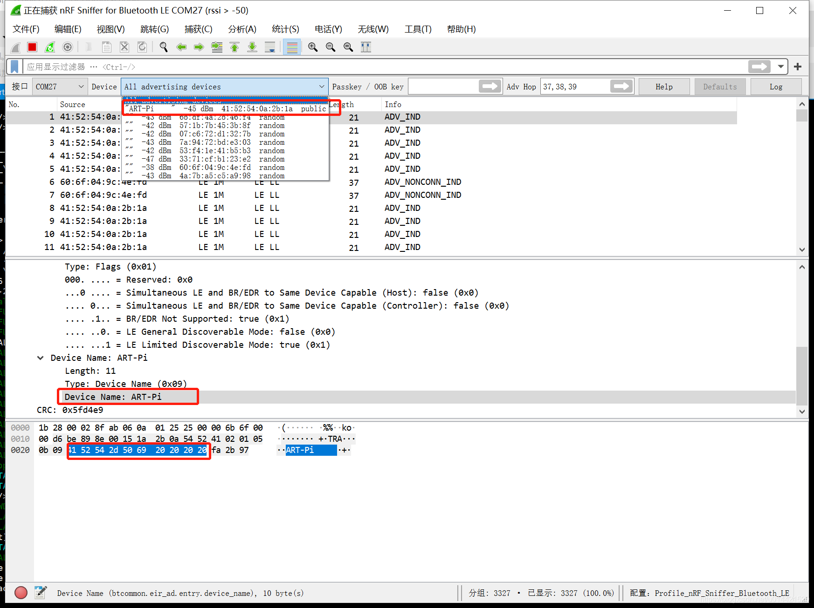
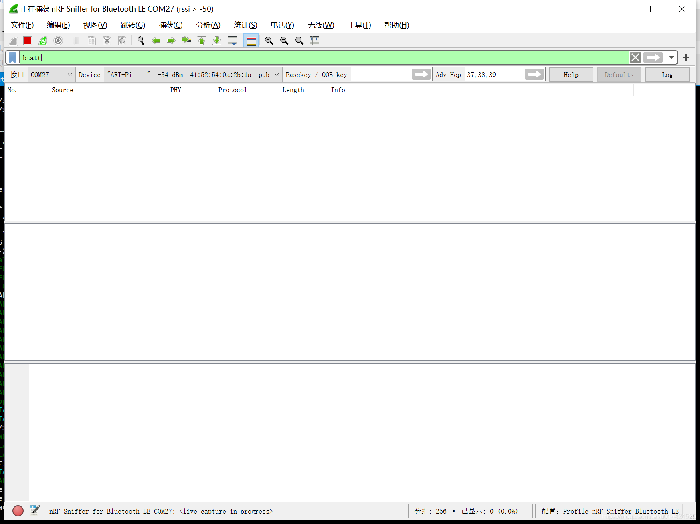
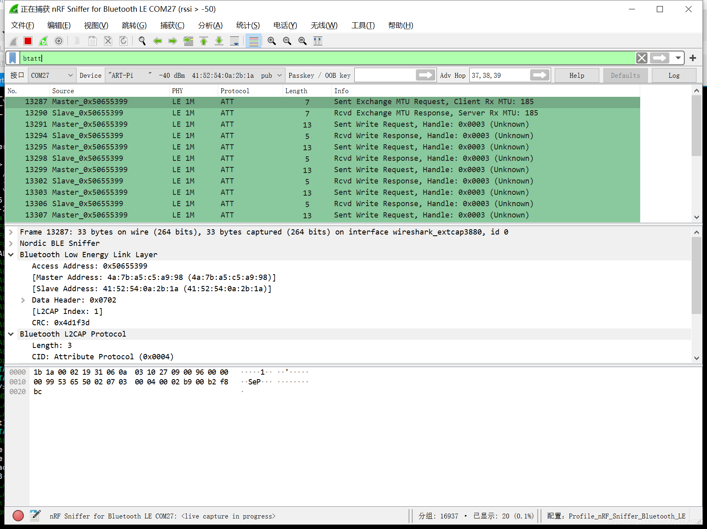
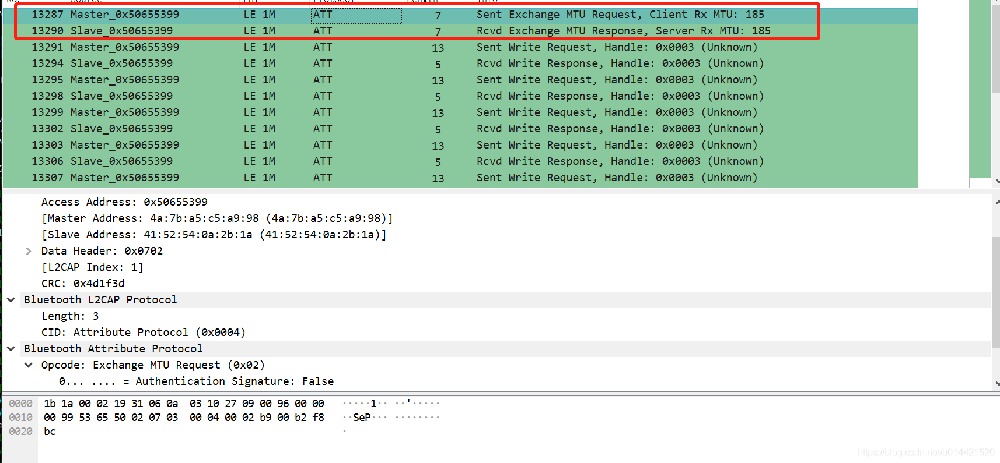
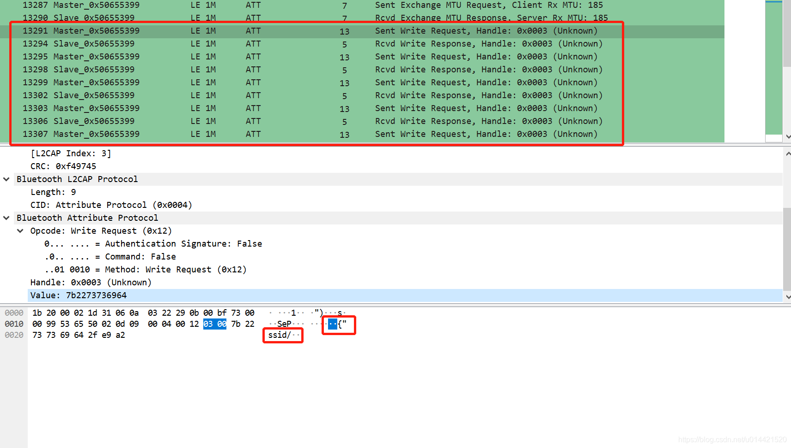
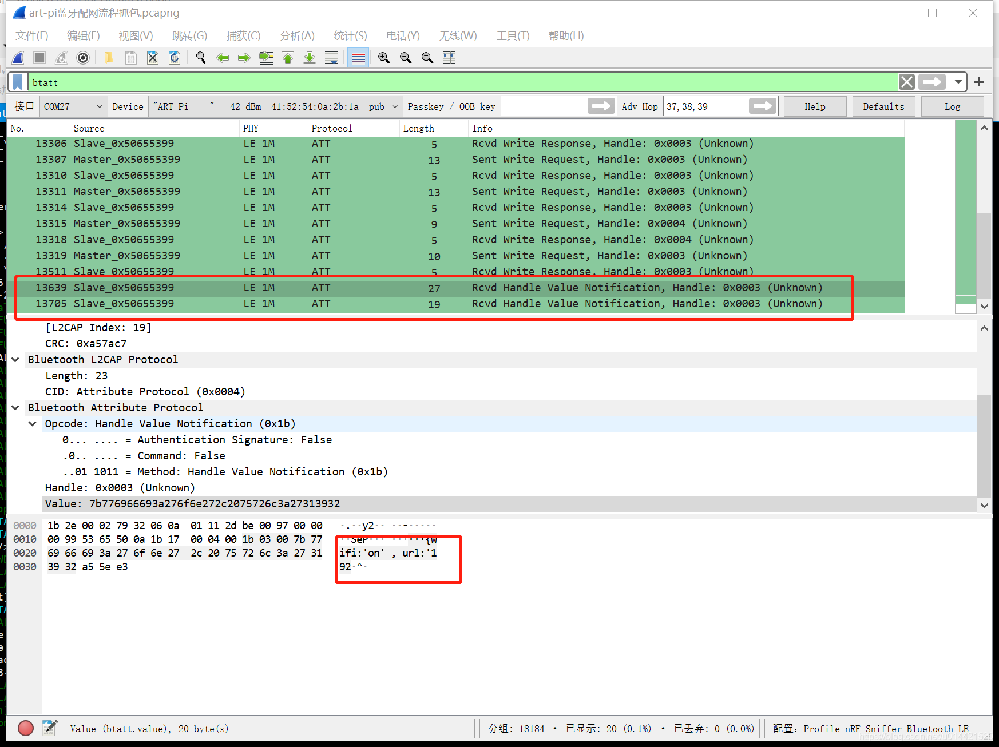

# ART-PI开发板蓝牙配网流程分析

## 准备工作
- art-pi开发板一块
- Android/iOS手机一部
- nrf sniffer抓包工具一个

## 完整配对流程体验

 1. 开发板默认烧录的出厂固件自带蓝牙配网功能，如果烧录了其他工程，则需要在**rt-thread studio** 上重新烧录**art-pi_factory**工程。上电后开发板蓝牙模组会自动广播，设备名称是`ART-PI`。
 2. 手机(手机需要开启蓝牙，注：部分华为/荣耀手机需要开启定位功能)打开微信`搜索WiFi配网助手`，选择设备为`ART-PI`，如下图所示：则表示手机成功搜索到了开发板的广播包。
 

 1. 然后点击蓝牙配网，稍等片刻即可完成配置。
 
 1. 浏览器输入上图的IP地址即可看到art-pi的一些信息。
 
1. 至此完成了蓝牙配网的体验。

## 蓝牙配网背后流程解析

### 使用nrf connect 来查看artpi的service
我们使用nrf connect来连接设备名称为art-pi的蓝牙设备，看看该设备都提供了那些服务。如下图所示：

如上图所示，提供了一个读写和通知的service，大胆猜测微信小程序配网应该是蓝牙连接成功后，通过该service来交换WiFi ssid和password信息。

### 使用nrf sniffer来抓取数据配网数据包
nrf sniffer的安装和基本使用技巧见我之前的文章，这里不再赘述。

直接打开wireshark，找到art-pi并选中。注意：wireshark默认抓取的是LE LL的广播包，并不是我们需要分析的ATT包。

然后在过滤器选项里过滤条件设置为***btatt***，即：只抓取ATT包。

最后点击开始抓包，虽然这里提示没有抓取到任何数据，但是不用担心，重复上面的蓝牙配网流程。就可以抓到配网的数据包了。

### 配网流程分析
1. 微信小程序扫描周围的蓝牙设备并放到**选择蓝牙设备**的下拉列表中等待用户点击。
2. 用户输入了WiFi的ssid和password后，选择点击蓝牙配网，此时微信小程序调用蓝牙api完成和第一步选的蓝牙设备的蓝牙连接。
3. 接着微信小程序向artpi开发板写入WiFi的ssid和password信息，并等待开发板的反馈。
4. 开发板配网成功并反馈自己的IP地址，微信小程序收到IP地址后判断配网成功并显示成功界面和开发板IP。

### 蓝牙ATT包分析
1. 蓝牙连接建立后，微信小程序向开发板询问了MTU，并得到其回复。

1. 接着微信小程序向开发板发送WiFi信息，由于微信小程序的限制，小程序的MTU为20字节，所以这里小程序进行了分片发送，看着应该是一个json字符串。这里就是一个write request/response的循环，直到所有的信息发送完毕。

1. 发送完成后，开发板开始尝试联网，连接完成后，通知微信小程序配网情况。应该也是一个json字符串，包括了配网状态和IP地址。

## 补充
wireshark 默认抓取的是LE LL广播包，并不是我们想要的其他数据包，这里就需要先选择device，然后过滤器里过滤出和device相关的数据包。部分过滤器的参考选项如下：

- btle : 显示所有的ble数据包
- !(btle.length == 0) : 过滤长度为0的包，即过滤掉空包
- btatt : 只显示ATT数据包
- btsmp : 只显示SMP配对过程数据包
- btl2cap : 只显示L2CAP层数据包,包括ATT SMP L2CAP层其他的数据包
- ( (frame.len == 12) || ( frame.len == 34)) : 显示数据帧长度为12或者34字节长度 的数据包

