# STM32WB55 蓝牙协议栈运行流程解析
## 简介

STM32WB55是ST公司近期推出的一颗双核(M0+M4)无线MCU，主要应用在BLE领域，同时也可以运行thread和zigbee等无线协议栈。

协议支持及两颗MCU的关系如下图所示：

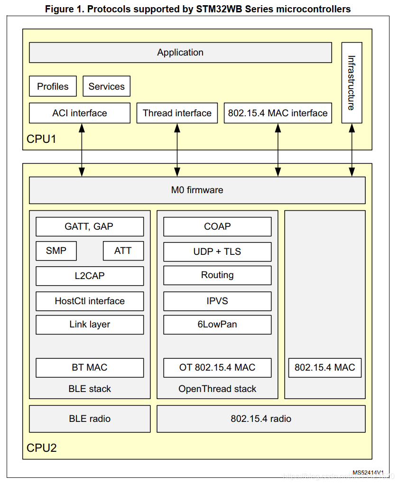
CPU2负责无线协议栈的处理，CPU1负责用户程序的实现和其他常规片内外设的操作。本文主要分析BLE协议栈的实现过程。BLE固件的实现有两种方式，一种是全部协议栈都由CPU2来跑，对应固件是：`stm32wb5x_BLE_Stack_fw.bin`；CPU1只负责profile和用户app，另一种实现方式是CPU2只实现到HCI层，具体的蓝牙协议栈由CPU1来实现，对应的固件是：`stm32wb5x_BLE_HCILayer_fw.bin`；用户可以移植开源的蓝牙协议栈到CPU1。如下图所示，红框部分的实现可以由CPU1来完成，也可以由CPU2来完成。

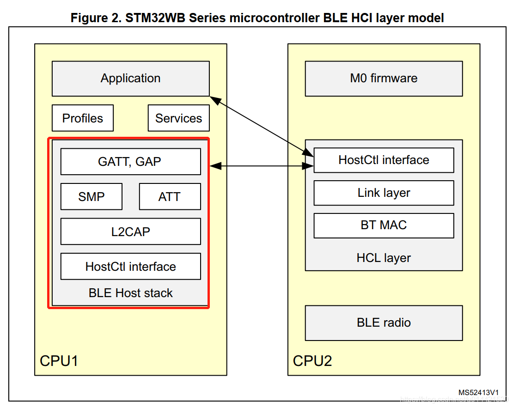

## 以ibeacon为例分析ST官方sample的运行流程
### main初始化流程
程序从main入口到蓝牙协议栈的初始化流程如下图所示：

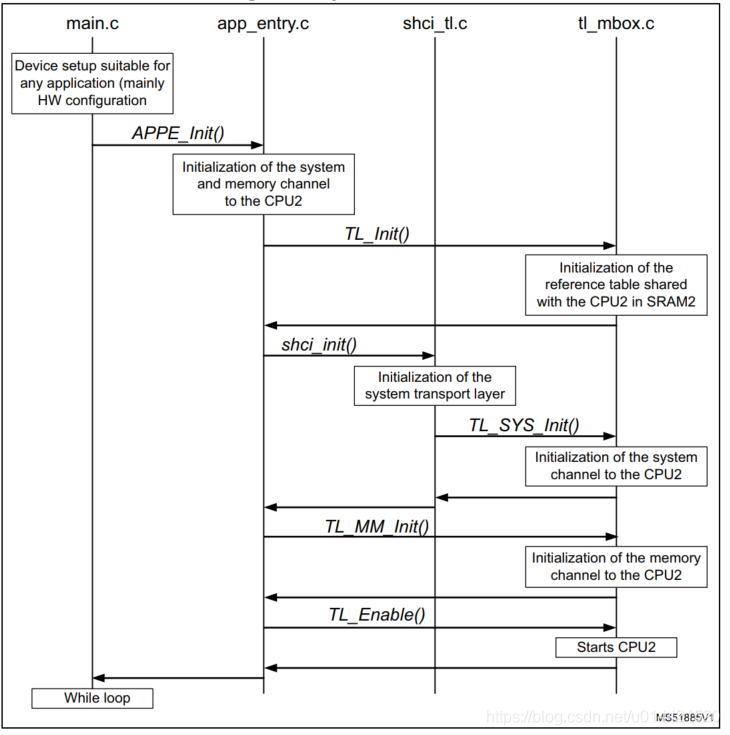
上电后，CPU1会首先运行起来。然后会初始化邮箱（system channel）、共享内存以及启动CPU2.当CPU2启动后，会通过之前初始化的邮箱回调函数来使能CPU2，并且初始化协议栈的APP层。具体流程如下图所示：
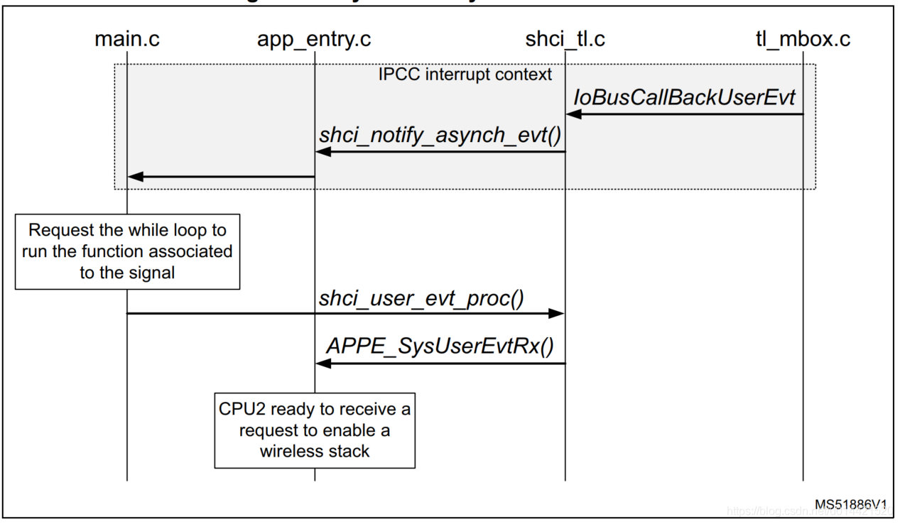

### BLE初始化

BLE初始化的流程如下图所示，BLE中会初始化BLE channel。
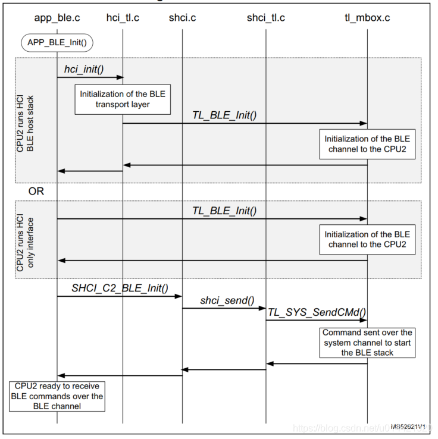

### 系统通道CPU1和CPU2交互

#### 初始化

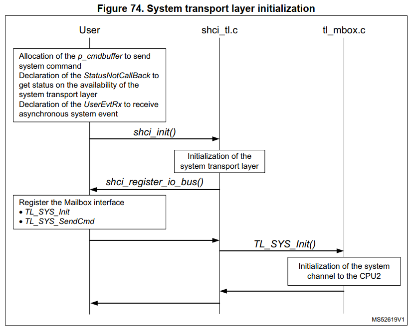

#### 发送流程

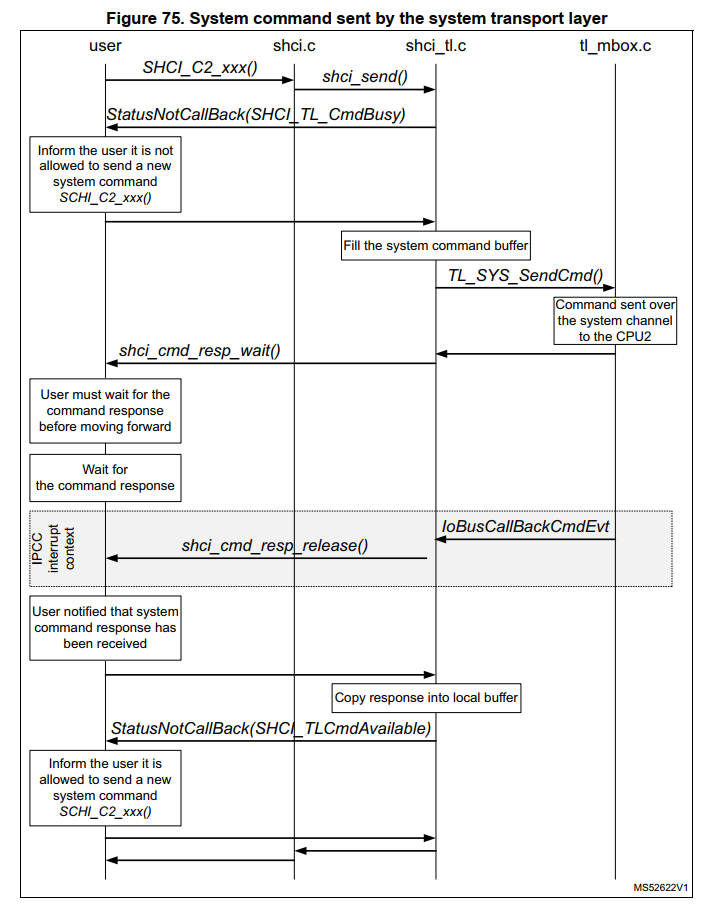

#### 接收流程

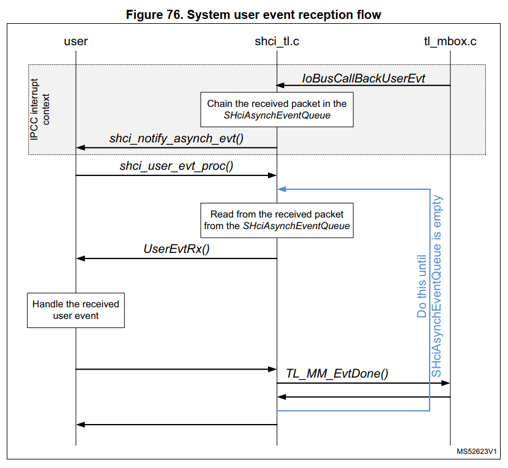

### BLE通道CPU1和CPU2交互

#### 初始化

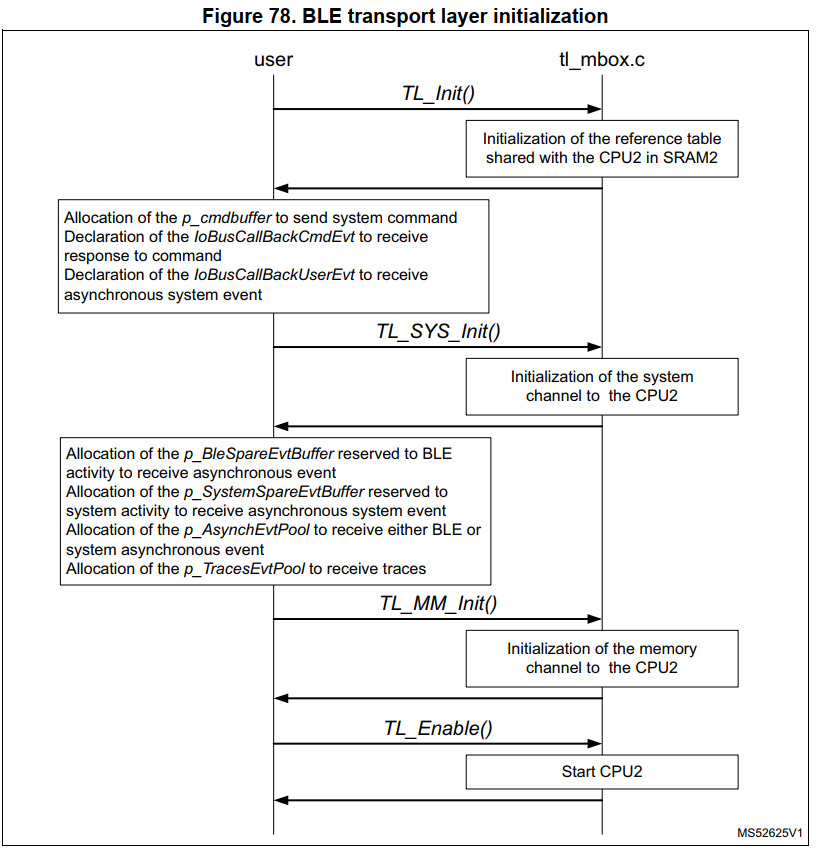

#### 发送流程

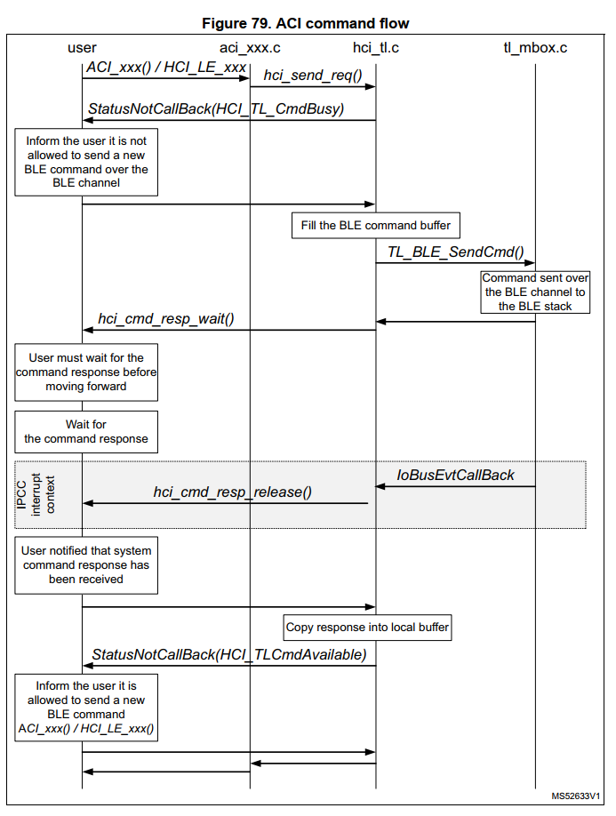

#### 接收流程

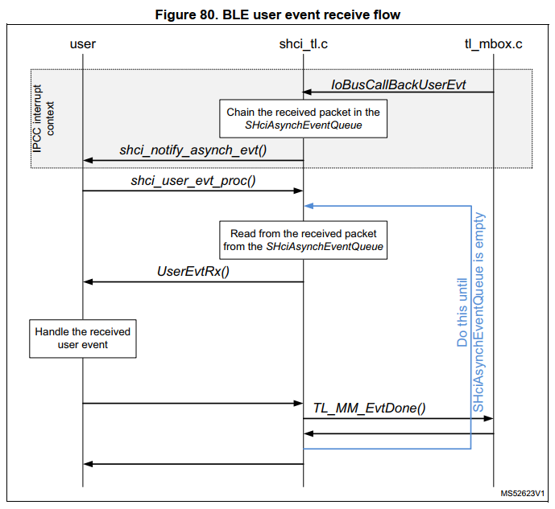