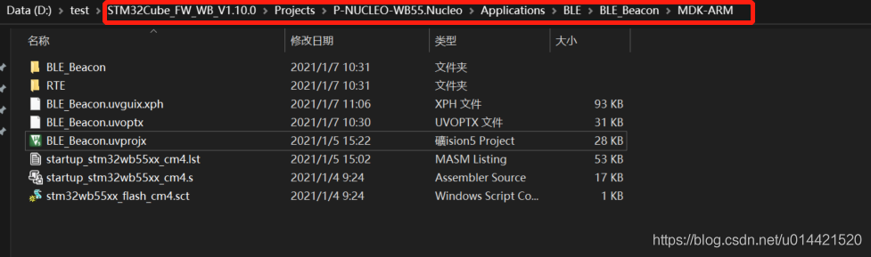
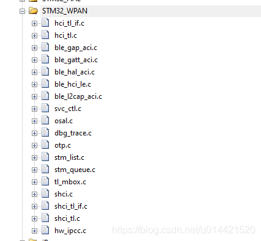
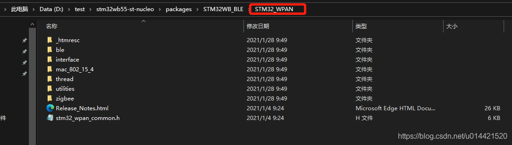
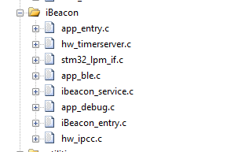

# stm32wb55 基于rtt的ble sample制作过程

## 准备活动
### 硬件
- stm32wb55 nucleo开发板
- stm32wb55 dangle

### 软件
- rtthread [stm32wb55 bsp](https://gitee.com/rtthread/rt-thread/tree/gitee_master/bsp/stm32/stm32wb55-st-nucleo)
- st官方 [stm32wb固件包](https://github.com/STMicroelectronics/STM32CubeWB)

### 开发环境
- keil MDK
- vscode
- rtthread env

## 概述
本文的目的是将ST官方的STM32WB55 固件包里的BLE sample移植到RT-Thread，最终变为rtt生态的一个软件包，让更多开发者都可以直接做基于rtt开箱即用。

## 移植前准备
#### 生成基于rtt的stm32wb55的最小工程
首先需要clone rtthread的stm32wb55的bsp，然后创建基本的工程，这一步很简单，从官方github仓库clone最新的代码，然后定位到stm32wb55的bsp，使用env `scons --dist`生成wb55最小工程。如下所示：

```c
                                                                    
xph@XPHPC D:/GitHub/rt-thread/bsp/stm32/stm32wb55-st-nucleo         
> scons --dist                                                      
scons: Reading SConscript files ...                                 
make distribution....                                               
=> stm32wb55-st-nucleo                                              
=> start dist handle                                                
=> copy stm32 bsp library                                           
=> copy bsp drivers                                                 
=> components                                                       
=> include                                                          
=> libcpu                                                           
=> src                                                              
=> tools                                                            
update mdk5 project                                                 
update iar project                                                  
done!                                                               
```

然后用keil打开，编译烧录到nucleo开发板中验证。当开发板LED1蓝灯开始闪烁，同时串口有打印信息输出，则表示基于rtthread的最小工程生成成功。

```c
 / | /
- RT -     Thread Operating System
 / | /     4.0.3 build Jan  7 2021
 2006 - 2020 Copyright by rt-thread team
msh >

```

### st官方固件包删除不相关代码
我们从最基础的beacon工程开始移植，删除其他不必要的工程文件和文件夹，方便代码分析工具分析和定位。如果工程文件夹太多，诸如vscode source insight这类代码工具就很难做到精确跳转。
如下图所示，我只保留基于keil mdk的beacon工程，其他的不相干的工程全部删除。

检查的方法也很简单，在固件包中搜索一下main.c函数，看一下有没有多余的就行了。
然后打开这个beacon工程，编译一下，没有错误，没有警告，那么准备工作就做好了。

### 移植
我的移植思路是，将ST官方的sample当作rtt中的一个线程，这样子即不影响其他线程的使用移植起来也比较方便。

#### 工程创建

1. 创建ibeacon线程

```c
static int ibeacon_thread_init(void)
{
  rt_thread_t ibeacon_thread;
  ibeacon_thread = rt_thread_create("ibeacon",
                                    ibeacon_thread_entry,
                                    RT_NULL,
                                    1024,
                                    2,
                                    10);
  if (ibeacon_thread != RT_NULL)
  {
    rt_thread_startup(ibeacon_thread);
  }
  return RT_EOK;
}

INIT_APP_EXPORT(ibeacon_thread_init);
```

2. 将st官方sample中的main函数移植过来，放在ibeacon线程的入口函数中

```c
static void ibeacon_thread_entry(void *parameter)
{
  LOG_D("ibeacon thread entry...");
  /**
   * The OPTVERR flag is wrongly set at power on
   * It shall be cleared before using any HAL_FLASH_xxx() api
   */
  __HAL_FLASH_CLEAR_FLAG(FLASH_FLAG_OPTVERR);
  HAL_Init();
  Reset_Device();
  Init_Exti();
  MX_GPIO_Init();
  MX_RTC_Init();
  /* Init code for STM32_WPAN */
  APPE_Init();
  while (1)
  {
    UTIL_SEQ_Run(UTIL_SEQ_DEFAULT);
    rt_thread_mdelay(10);
  }
}
```

3. 将STM32_WPAN中间件整体复制过来，然后根据st的sample工程将BLE相关文件都加进去


4. 编译，根据编译错误将缺失的文件加入到工程中去，直到编译完成

#### 关于文件的分组
1. STM32_WPAN这个文件夹里面存放的是ST关于无线协议的中间件，包括BLE、thread、zigbee等等，所以移植的时候直接整体搬过去就好了，至于里面的东西可以暂不做考虑。

2. STM32WB特有的低功耗管理组件和列表单独做通用分组


3. 其他需要用到的文件统一放到ibeacon分组中



#### 移植注意事项
 以上工作全部完成后，编译运行后程序运行正常，但是通过nrf connect是无法扫描到beacon的，对比分析后发现两部分地方需要修改。

##### 中断处理函数需要移植

之前的固有印象是STM32的HAL库中断处理函数全都是虚函数方式然后通过注册回调函数来最终执行用户自己的中断服务函数。这也是忽略该步骤的重要原因之一，因为之前的STD或者寄存器版本没有写中断服务函数是会编译报错的。

将以下三个中断服务函数放在ibeacon线程`.c`文件中。

```c
/**
 * ! RTC timeserver处理中断服务函数
*/
void RTC_WKUP_IRQHandler(void)
{
  HW_TS_RTC_Wakeup_Handler();
}

/**
 * ! IPCC 通讯收发中断处理函数
*/
void IPCC_C1_TX_IRQHandler(void)
{
  HW_IPCC_Tx_Handler();

  return;
}

void IPCC_C1_RX_IRQHandler(void)
{
  HW_IPCC_Rx_Handler();
  return;
}
```

这三个中断服务函数主要是用来处理CPU1和CPU2之间的通讯的，这部分内容后面再介绍。

##### link文件需要更改

STM32WB是一颗双核MCU，他们共享了部分flash和RAM，所以不能像传统的单核M4内核那样定义link文件，需要将部分flash和RAM资源留出来给协处理器使用。具体的更改直接参考ST的sample工程中的link文件。


经过以上两步的修改，编译烧录后就可以正常使用了。

## 备注
### 名词解释
- ACI: Application command interface 应用层命令接口

- CLI:  Command line interface 命令行接口

- CPU1: STM32WB55开放给用户的CPU，M4内核

- CPU2:STM32WB55跑协议栈的CPU，用户无权访问，可以通过信号量和共享内存访问

  