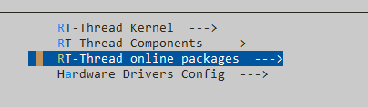
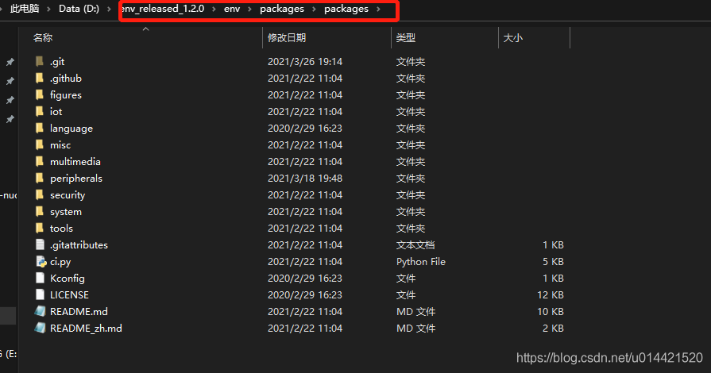
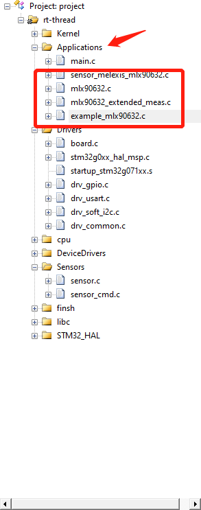
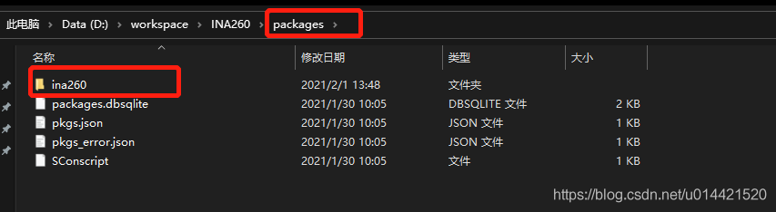
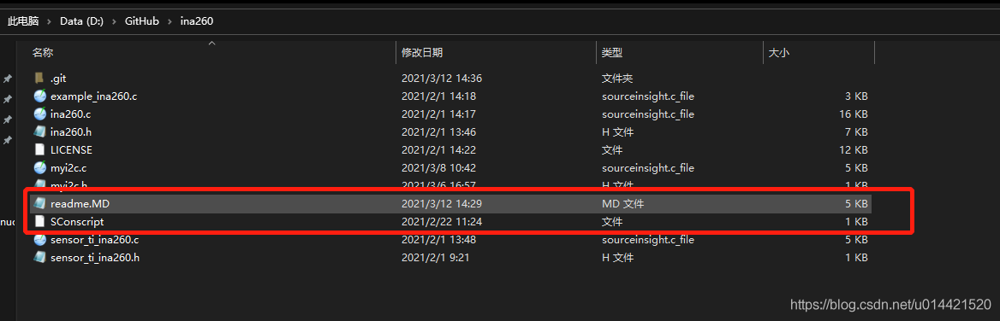
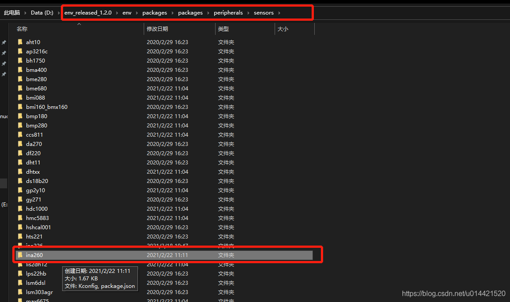
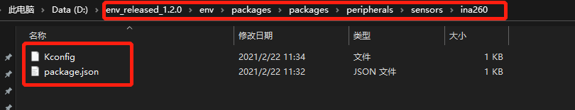
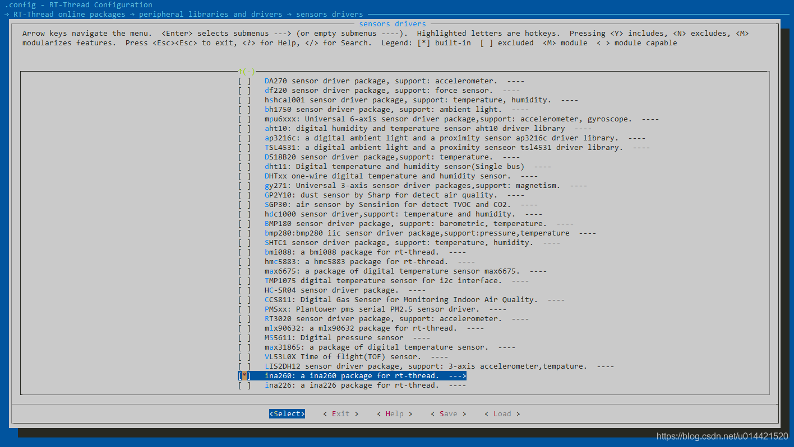
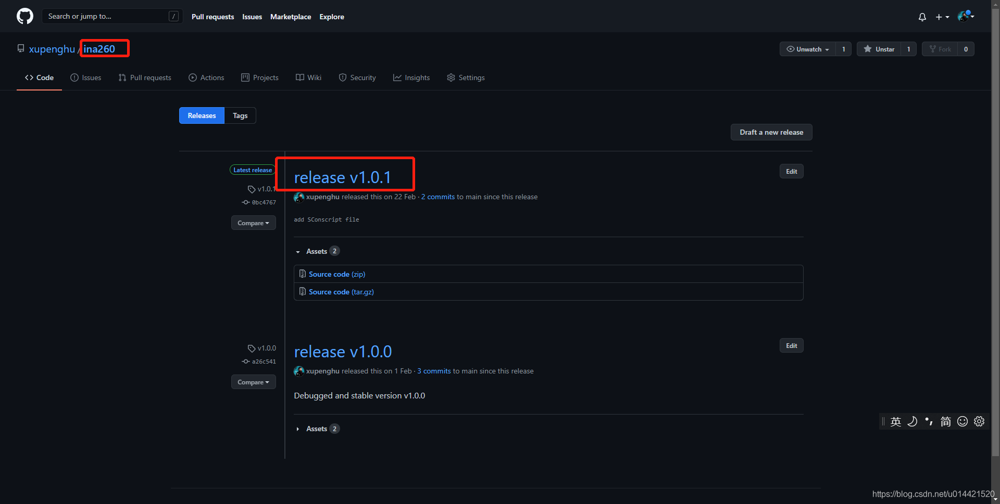


 # RT-Thread 软件包制作及发布流程
 
 ## 前言
RT-Thread是一个嵌入式实时多线程操作系统，系统完全开源，它不仅仅是一个实时内核，还具备丰富的中间层组件，包括如文件系统、图形库等较为完整的中间件组件，具备低功耗、安全、通信协议支持和云端连接能力的软件平台。

我们可以结合rtthread提供的组件和服务，制作软件包，丰富rt-thread的软件生态。让更多的开发者做到开箱即用，不用重复造轮子。

### 必备知识
- 熟悉[rt-thread](https://github.com/RT-Thread/rt-thread)
- 了解[Kconfig](https://docs.rt-thread.org/#/development-tools/kconfig/kconfig)
- 了解[Env](https://docs.rt-thread.org/#/development-tools/env/env)开发工具
- 了解[Scons](https://docs.rt-thread.org/#/development-tools/scons/scons)构建工具

## 制作流程
### 为什么你做好的软件包能被其他开发者使用
首先需要明确的是，rt-thread的软件包分为两个部分
- 软件包
- 包信息

其中，软件包里存放的是具体的代码源文件，包信息里面存放的是这个软件包的基本信息，不包括源代码文件。

通过Env的menuconfig在某个BSP或者工程下面配置工程的时候，我们选择online package的时候，就会列举出当前已经基于rt-thread实现的软件包。如下图所示：



那么，这些软件包，在本地是存储在那里的呢？

打开Env的安装目录，然后定位到 packages->packages 文件夹下



这是一个git仓库，这里面就存放了所有rt-thread已经做好的软件包的*包信息*，我们通过menuconfig选择的软件包其实最终都链接到了这里，所以你在env里面使用

```c
pkgs --upgrade
```
env就会从GitHub的仓库更新当前最新的软件包*包信息*到本地。所以当开发者制作好了一个软件包后提交到GitHub对应的软件包仓库，然后你在本地再upgrade一下就同步了。**这样子只要有开发者提交软件包，你的menuconfig里能看到软件包就会越来越多。**

所以，软件包的制作者在制作完成一个软件包后，必须要像rt-thread管理的[软件包包信息仓库](https://github.com/RT-Thread/packages)提交自己做好的软件包包信息，这一点非常重要。

### 如何制作一个软件包并提交

首先需要明确的是，你做好的软件包是可以放到自己的GitHub仓库的，同样也可以托管到rt-thread的[GitHub软件包仓库](https://github.com/rt-thread-packages)。如果觉得每次向rt-thread软件包仓库提交代码需要审核比较麻烦的话，建议将软件包仓库放到自己GitHub。但是软件包代码更新了以后记得要在包信息仓库更新包信息，以便于开发者使用最新的软件包。

我们以一个简单的传感器软件包为例，来说一下制作一个软件包的具体流程。

#### 软件包仓库的制作
前面讲过，一个软件分为包信息和软件包两个部分。首先我们讲一下软件包的制作。

1. 确保这个传感器的驱动已经接入rt-thread的sensor框架，并且代码能够在rt-thread上正常运行。

比如一开始调试这个传感器的时候，我为了调试方便，就将传感器的所有源代码文件都放在了app文件夹内。这一步要做到传感器正常工作且接入了sensor框架。

2. 将这个传感器的源代码文件都放入一个文件夹

3. 增加一个SConscript文件和一个readme文件。SConscript文件内容请查看rt-thread的官方文档。readme就是一个说明文档，告诉其他人你这个软件的信息以及别人如何上手，写的越详细越好，降低使用门槛。


#### 包信息的制作
1. 在我们之前提到的env安装目录的package文件夹内的对应位置新建一个传感器包信息的文件夹。我们之前说过，menuconfig里面的软包信息就是这里的内容的呈现，我们需要在本地调试ok以后才能将软件包推送到GitHub仓库供其他人使用。

2. 在文件夹里面新建两个文件，一个Kconfig文件，一个package.json文件，这两个文件的内容和作用，请查看[rt-thread的官方文档](https://docs.rt-thread.org/#/rt-thread-version/rt-thread-standard/development-guide/package/package?id=%E8%BD%AF%E4%BB%B6%E5%8C%85%E5%BC%80%E5%8F%91%E6%8C%87%E5%8D%97)，我们这里默认你已经知道这两个文件的作用了。

3. sensor目录下的Kconfig文件内增加一条记录，用来索引刚添加的软件包。

```c
source "$PKGS_DIR/packages/peripherals/sensors/ina260/Kconfig"
```

#### 调试
经过以上两个步骤，你就可以在本地调试你的软件包了，如果调试没有问题，那就可以发布到GitHub了。

1. 我们随便找一个支持rt-thread的开发板，创建一个基本的rt-thread工程。然后将上一步做好的软件包仓库放到该工程的package文件夹。
注：如果你的工程目录里面没有packages文件夹，那你可以在manuconfig里面随便选一个软件包，然后再去掉，再使用`scons --target==mdk5`重新生成工程，这样子工程目录里面就有packages文件夹了，注意：**packages文件夹里的这些文件不要删除，这个是组织工程的必要文件。**
2. env命令工具行定位到该工程，然后menuconfig进入软件包选择，因为上一步我们已经加入了包信息，所以就可以索引到我们刚添加的软件包了，然后选中它，保存退出。

3. 使用`scons --target==mdk5` 更新工程，然后用keil打开工程，编译下载，如果没有问题则调试🆗，有问题则需要修改我们添加的Sconscript文件里面的内容了，修改方法见[官方文档](https://docs.rt-thread.org/#/development-tools/scons/scons?id=%E4%BD%BF%E7%94%A8-scons-%E7%AE%A1%E7%90%86%E5%B7%A5%E7%A8%8B)。

#### 发布
至此，本地调试OK，我们需要发布软件包以便于让所有的开发者都使用。同样的，我们需要发布包信息和软件包。

##### 发布软件包
GitHub上新开一个repo，将我们在packages文件夹里的软件包pull到这个新的repo中。

然后发布一个release版本，因为包信息里面需要填写。

#### 发布包信息
还记得我们之前在包信息里面创建了一个package.json文件夹吗，在这里面填写刚才发布的软件包信息，然后将这个包信息pr到rt-thread官方维护的包信息仓库。具体贡献流程见[官方文档](https://docs.rt-thread.org/#/rt-thread-version/rt-thread-standard/development-guide/github/github)。

## 总结
- 其实贡献软件包的流程和使用软件包刚好是相反的，贡献的准则是在本地调试OK后再发布到GitHub仓库。
- 调试的时候不能使用 `pkgs --upgrade` 命令，因为这条命令会更新packages仓库，会把我们自己修改的内容给刷掉。
- 调试的时候也不能使用`pkgs --update`命令，这条命令的含义是下载网络软件包到本地，应为我们现在就是在本地调试阶段，网络上根本就没有这个软件包。
- 使用`scons --target==mdk5/iar` 命令只是构建了这个工程，并没有编译该工程，建议多看看scons 。这个对构建工程很有帮助，尤其是工程比较复杂的时候，用scons构建会方便快捷很多，而且也便于管理。


## FAQ

### 如何在menuconfig隐藏一些config

Kconfig中有个特殊的用法，在制作大型软件包的时候会遇到，就是有一些宏定义是不愿意让客户在menuconfig中进行修改的，但是又是相关开源软件包中必须要包含的，而且数目也比较众多的，对Kconfig一些选项有一些依赖的，也就是不希望该配置选项出现在menuconfig中。

下面以Kconfig举例说明：

```c
config BSP_USING_GPIO
    bool "Enable GPIO"
    default y
```

将上述语句中的`bool`后面的注释去掉。

```c
config BSP_USING_GPIO
    bool 
    default y
```

这个时候在menuconfig中就不会出现该宏定义，但是宏定义还是会有

### depends on 和select语句的区别

例如，如下配置

```c
config BSP_USING_UART3
    bool "UART3 config"
    default y
    depends on BSP_USING_UART
    select RT_USING_SERIAL
```

这个其中的含义是：BSP_USING_UART3是否需要呈现给客户配置和选中，依赖于BSP_USING_UART这个配置是否打开。 一旦BSP_USING_UART3选中了，RT_USING_SERIAL这个也必须要选中。

depends和select都需要注意的是：depends和select后面的宏定义必须要在其他地方有对应的config或者选项声明，否则不会生效。

可以这样理解他们之间的区别：

- select 相当于这个配置需要的一些组件配置选项
- depends on 相当于这个配置需要哪些配置打开才会显示，这个通常和if/endif 形式类似。

