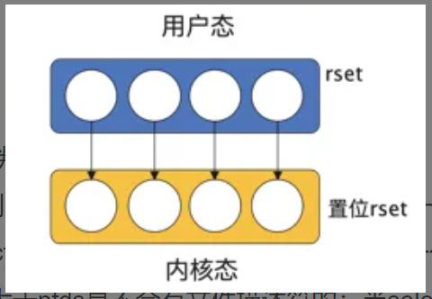
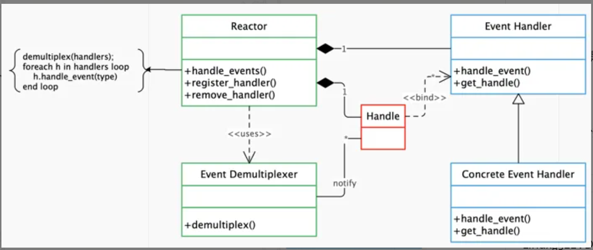
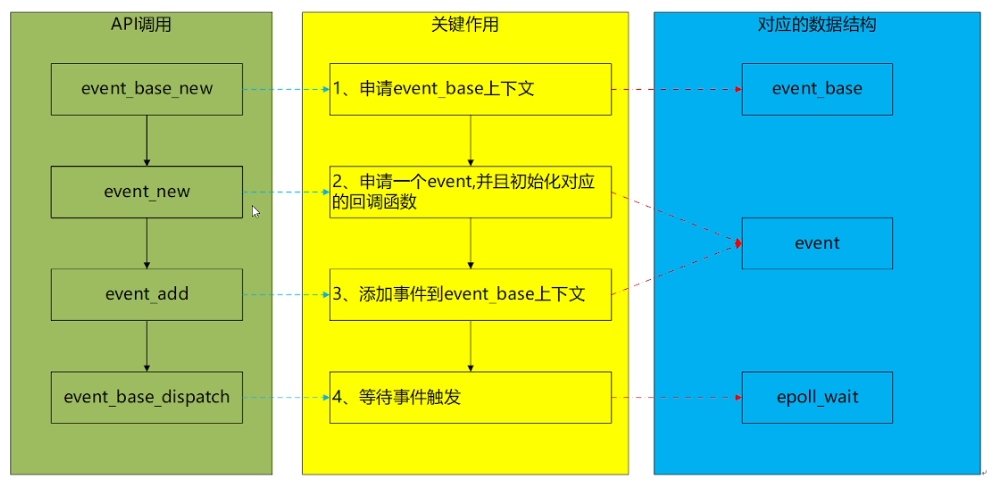
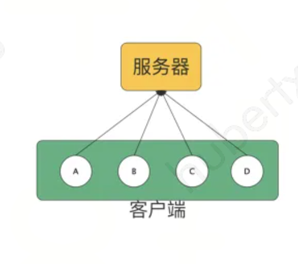

## libevent入门

### 概述

libevent 是一个用纯 C 语言编写的轻量级、跨平台、高性能网络编程库。它基于事件驱动的 Reactor 模式，支持多种 I/O 复用技术，具有以下显著优点：

1. **事件驱动，高性能**：通过事件驱动机制，libevent 能够高效处理大量并发连接。
2. **轻量级，专注于网络编程**：libevent 设计简洁，专注于网络编程，减少了不必要的复杂性。
3. **源码精简，可读性强**：代码结构清晰，易于阅读和维护。
4. **跨平台支持**：libevent 可以移植到 Windows、Linux、Mac、RTOS 等多种操作系统。
5. **多种 I/O 复用技术**：支持 select、poll、epoll 等多种 I/O 多路复用技术，适应不同平台和需求。
6. **多种事件支持**：不仅支持 I/O 事件，还支持定时器和信号等事件。
7. **事件优先级**：支持事件优先级设置，便于管理不同重要性的事件。

libevent 目前已经被广泛应用于多个项目，作为底层网络库，它被 `memcached`、`Vomit`、`Nylon`、`Netchat` 等项目采用。当前 libevent 的最新稳定版本是 2.1.12（2020年发布）。点击[这里](https://github.com/libevent/libevent/releases/tag/release-2.1.12-stable)获取下载链接。

### 前置知识

#### I/O多路复用

I/O 多路复用（I/O Multiplexing）是一种在单个线程或进程中同时监视多个 I/O 事件的技术。它允许一个程序在不需要创建多个线程或进程的情况下，处理多个 I/O 操作，从而提高了系统的效率和性能。多路指的是多个文件描述符，复用指的是一个线程。

#### I/O多路复用技术之select

select作为最早的多路复用技术，几乎在所有的操作系统上都得到了支持（LwIP中也完整的支持了select，所以在rtos中也被广泛使用）。接下来简单介绍下select的实现：

1.  `select` 函数原型

```c
#include <sys/select.h>

int select(int nfds, // 监视的文件描述符数量，通常是所有文件描述符中最大值加一
           fd_set *readfds,  // 指向一个 `fd_set` 结构，用于监视可读事件的文件描述符集合
           fd_set *writefds, // 指向一个 `fd_set` 结构，用于监视可写事件的文件描述符集合
           fd_set *exceptfds, // 指向一个 `fd_set` 结构，用于监视异常事件的文件描述符集合
           struct timeval *timeout // 指向一个 `timeval` 结构，用于指定超时时间。如果为 `NULL`，则 `select` 会一直阻塞直到有事件发生
          );
```

`fd_set` 相关宏

- `FD_ZERO(fd_set *set)`：清空文件描述符集合。
- `FD_SET(int fd, fd_set *set)`：将文件描述符 `fd` 添加到集合中。
- `FD_CLR(int fd, fd_set *set)`：从集合中移除文件描述符 `fd`。
- `FD_ISSET(int fd, fd_set *set)`：检查文件描述符 `fd` 是否在集合中。

2. 代码分析（以read为例）

```c
  sockfd = socket(AF_INET, SOCK_STREAM, 0);
  memset(&addr, 0, sizeof (addr));
  addr.sin_family = AF_INET;
  addr.sin_port = htons(2000);
  addr.sin_addr.s_addr = INADDR_ANY;
  bind(sockfd,(struct sockaddr*)&addr ,sizeof(addr));
  listen (sockfd, 5); 
  for (i=0;i<5;i++) 
  {
    memset(&client, 0, sizeof (client));
    addrlen = sizeof(client);
    // 使用 accept 接受 5 个客户端连接，并将每个连接的文件描述符存储在 fds 数组中，同时更新 max 为文件描述符的最大值
    fds[i] = accept(sockfd,(struct sockaddr*)&client, &addrlen);
    if(fds[i] > max)
    	max = fds[i];
  }
  // ####################################################################
  while(1){
	FD_ZERO(&readfds);     // 1. 清空可读事件文件描述符
  	for (i = 0; i< 5; i++ ) {
  		FD_SET(fds[i],&readfds); // 2. 为rset赋值
  	}
 
	select(max+1, &readfds, NULL, NULL, NULL); // 3. select阻塞
 	// 遍历 fds 数组，使用 FD_ISSET 检查哪些文件描述符在 rset 中被标记为可读。如果某个文件描述符可读，读取数据并打印
	for(i=0;i<5;i++) {
		if (FD_ISSET(fds[i], &readfds)){
			memset(buffer,0,MAXBUF);
			read(fds[i], buffer, MAXBUF);
			puts(buffer);
		}
	}	
  }
  return 0;
```

用"#"符号分隔成了上下两部分，上半部分主要进行初始化工作，准备文件描述符集合，文件描述符是一个非负数，假设此时fds=[1,3,4,5,8]，从这里也可以看到文件描述符并不连续，此时文件描述符的最大值max=8；下面部分是select的重点，readfds是一个长度为1024的bit数组，它表示哪一个文件描述符被占用，被占用的部分置为1，fds和readfds的取值情况如下图


随后就是调用select函数，因为网络I/O中主要是读事件，这里只关注readfds，在select函数的内部处理如下：



内核会将传入的readfds由用户态拷贝到内核态，然后在内核中判断每一个置位的readfds是否有数据到达（将readfds拷贝到内核态是因为在内核中判断是否有数据到达比在用户态判断效率高很多），如果有，则标记这一位，如果没有，继续往后判断，除非到达select的超时时间，所以select是一个阻塞的函数。select函数中第一个参数nfds有什么用呢？select在对readfds遍历时，会截取0~nfds，因为大于nfds是不会有文件描述符的；当select函数返回时，循环遍历这5个文件描述符，然后检测每一个文件描述符是否被标记，如果标记了，说明有read事件发生，则读取缓存中的数据。这里需要注意某一个文件描述符是否有数据是随机的，可能有多个文件描述符同时有数据到达，因此需要执行for遍历每一个文件描述符。

- select存在的问题

  从select的实现代码及逻辑中可以发现select也存在许多问题，主要有以下几点：

  1. len(readfds)=1024,所以最多只能监听1024个文件描述符。这个是操作系统进行的限制，虽然可以更改，但是有上限；
  2. readfds不可重用。从代码中可以看到，每次循环时，都需要调用`FD_ZERO(&readfds)`，重置readfds，这是因为内核检测是否有数据时会更改readfds，如果不重置，上一次select返回的结果会对下一次内核判断某一个文件描述符是否有数据产生影响；
  3. 解除select阻塞后需遍历每一个fd。这是因为内核判断是否有数据后会直接返回，但是并没有返回究竟是哪一个文件描述符有数据。

#### Reactor模式

Reactor模式是libevent设计思想的核心，和传统的顺序调用函数、顺序执行的模式不同。reactor模式是一种基于事件驱动的异步回调模式。应用程序提供相应的接口并注册到reactor上，当有相应的事件被检测到时，reactor会主动调用被注册的接口（也就是我们所说的回调函数）。reactor模式的框架如下图所示：



结合图示，reactor模式主要有如下部分

1. 事件源（图中的Handle）

   > 在linux系统中是文件描述符，在window上是socket或Handle，下文统称为"句柄"

2. 事件多路分发机制（图中的Event Demultiplexer）

   > 由操作系统提供的I/O多路分发机制，比如上文所述的select

3. 反应器（图中的Reactor）

   > Reactor模式中的事件管理接口，提供注册、注销事件和事件循环

4. 事件处理程序（图中的Event_Handler和Concrete_Event_Handler）

   > 包括抽象处理程序和具体处理程序，主要是考虑扩展性


### libevent详解

前面讲了这么多，终于开始介绍我们的主角libevent。由于libevent的设计主要依赖前面所讲的知识，所以有必要着重介绍。接下来我们通过几个简单的示例，来熟悉libevent的使用。libevent主要能处理一下三种事件：

1. 定时器事件
2. I/O事件
3. 信号事件

我们依次来通过这三个事件的简单例子来介绍libevent的基本使用。

#### 定时器事件

以下是用libevent来实现的一个简单定时器事件

```c
#include <event2/event.h>
#include <stdio.h>
#include <stdlib.h>
#include <unistd.h>

// 定时器回调函数
static void timeout_cb(evutil_socket_t fd, short event, void *arg)
{
    static int count = 0;
    Log_d("Timeout occurred %d\n", ++count);
    // 退出事件循环
    if(count >= 5){
        struct event_base *base = (struct event_base *)arg;
        event_base_loopbreak(base);
    }

}

void basic_libevent_test_entry(void *arg)
{
    struct event_base *base;
    struct event *timeout_event;
    struct timeval tv;
    base = (struct event_base *)arg;
    // 打印当前使用的事件后端
    Log_d("Using event method: %s\n", event_base_get_method(base));

    // 设置定时器的超时时间为2秒
    tv.tv_sec  = 2;
    tv.tv_usec = 0;

    // 创建一个新的定时器事件
    timeout_event = event_new(base, -1, EV_PERSIST, timeout_cb, base);
    if (!timeout_event) {
        Log_e("event_new fail.\n");
        event_base_free(base);
        return ;
    }

    // 添加定时器事件到事件循环中
    event_add(timeout_event, &tv);

    // 运行事件循环
    Log_d("Starting event loop\n");
    event_base_dispatch(base);
    Log_d("Event loop exited\n");

    // 清理
    event_free(timeout_event);
    event_base_free(base);

    return ;
}
```

程序运行流程分析：



1. **创建event base**：`event_base_new()` 创建一个新的event base，用于管理所有事件。相当于前面讲的reactor。
2. **设置定时器时间间隔**：`struct timeval tv` 设置定时器的时间间隔，这里设置为 2 秒。
3. **创建定时器事件**：`event_new(base, -1, EV_PERSIST, timer_cb, NULL)` 创建一个新的定时器事件。`EV_PERSIST` 标志表示定时器是持久的，即每次触发后不会自动删除。
4. **添加定时器事件**：`event_add(timer_event, &tv)` 将定时器事件添加到event base中。
5. **进入事件循环**：`event_base_dispatch(base)` 进入事件循环，等待事件的发生并调用相应的回调函数。
6. **释放资源**


主要关注以下几个函数的实现：

### 1. `event_base_new`

#### 原型

```c
struct event_base *event_base_new(void);
```

#### 功能

创建并初始化一个新的event base，用于管理所有事件。

#### 返回值

返回一个指向 `struct event_base` 结构体的指针，如果创建失败则返回 `NULL`。struct event_base

### 2. `event_new`

#### 原型

```c
struct event *event_new(struct event_base *base, // 上一步创建的event_base
                        evutil_socket_t fd, // 文件描述符 -1 表示不关联文件描述符，可以是定时事件
                        short events,  // 关注的事件类型 可以是 `EV_READ`、`EV_WRITE`、`EV_TIMEOUT`、`EV_SIGNAL` 或它们的组合
                        event_callback_fn cb, // 事件触发后调用的回调函数
                        void *arg // 回调函数参数
                       );
```

#### 功能

创建一个新的事件，并将其与指定的event_base、文件描述符和事件类型关联。

#### 返回值

返回一个指向 `event` 结构的指针，如果创建失败则返回 `NULL`。

### 3. `event_add`

#### 原型

```c
int event_add(struct event *ev, // 指向要添加的事件指针
              const struct timeval *timeout // 超时时间
             );
```

#### 功能

将事件添加到事件基础设施中，使其开始监视指定的事件类型。

#### 返回值

返回 `0` 表示成功，返回 `-1` 表示失败。

### 4. `event_base_dispatch`

#### 原型

```c
int event_base_dispatch(struct event_base *base); //  线程将会阻塞在这里  直到退出
```

#### 功能

进入事件循环，等待事件的发生并调用相应的回调函数。

#### 返回值

返回 `0` 表示成功，返回 `-1` 表示失败。

#### I/O事件

这里以一个简单的tcp服务器为例，来介绍I/O事件的处理。首先抛出一个问题，如果让你设计一个高性能的服务架构，要求服务端能够处理多个客户端连接并响应客户端的请求，如下图所示，你会如何设计？



一个比较直观的想法是在服务端，每来一个客户端连接，即开启一个线程去处理并响应，这种设计的优点是简单易懂，缺点也很明显，如果客户端连接比较多，需要开启多个线程去处理，而操作系统开启线程是需要一定代价的，服务端在多个线程间切换也是比较消耗资源的；另外，多个线程操作临界资源时会带来锁竞争问题，当连接数比较多时竞争会非常激烈。

那么接下来，我们来看用lievent是如何设计的。

```c
#include <event2/event.h>
#include <event2/bufferevent.h>
#include <event2/listener.h>
#include <string.h>
#include <stdio.h>
#include <stdlib.h>
#include <errno.h>
#include <netinet/in.h>
#include <arpa/inet.h>

// tcp server 服务器端口
#define PORT 9999

// 处理读事件的回调函数
void read_cb(struct bufferevent *bev, void *ctx) 
{
    char buf[512];
    int n;
    // 获取与 bufferevent 关联的文件描述符
    evutil_socket_t   fd = bufferevent_getfd(bev);
    // 从缓冲区读取数据
    while ((n = bufferevent_read(bev, buf, sizeof(buf))) > 0) {
        buf[n] = '\0';  // 确保字符串以null结尾
        Log_d("[->%d]Received message: %s\n",fd, buf);
        if(strstr(buf, "quit")){
            // 退出dispatch
            event_base_loopbreak(bufferevent_get_base(bev));
        }
    }
}

// 处理事件的回调函数
void event_cb(struct bufferevent *bev, short events, void *ctx) {
    if (events & BEV_EVENT_ERROR) {
        perror("Error from bufferevent");
    }
    if (events & (BEV_EVENT_EOF | BEV_EVENT_ERROR)) {
        bufferevent_free(bev);
    }
}

// 处理客户端连接的回调函数
void accept_conn_cb(struct evconnlistener *listener, evutil_socket_t fd, struct sockaddr *address, int socklen, void *ctx) 
{
    struct event_base *base = evconnlistener_get_base(listener);
    // 创建一个用于管理socket的缓冲事件
    struct bufferevent *bev = bufferevent_socket_new(base, fd, BEV_OPT_CLOSE_ON_FREE);
    Log_d("%d connected\n",fd);
    // 设置读写回调函数
    bufferevent_setcb(bev, read_cb, NULL, event_cb, NULL);
    bufferevent_enable(bev, EV_READ | EV_WRITE);
}

int tcp_server_test(void) 
{
    struct event_base *base;
    struct evconnlistener *listener;
    struct sockaddr_in sin;

    init_libevent_global(1);
    // 设置IP地址
    evutil_set_ifaddr((char *)get_netif_ip());
	// 创建event base
    base = event_base_new();
    if (!base) {
        fprintf(stderr, "Could not initialize libevent!\n");
        return 1;
    }

    // 设置监听地址和端口
    memset(&sin, 0, sizeof(sin));
    sin.sin_family = AF_INET;
    sin.sin_addr.s_addr = htonl(INADDR_ANY);
    sin.sin_port = htons(PORT);

    // 创建监听器
    listener = evconnlistener_new_bind(base, // event_base结构体指针
                                       accept_conn_cb, // 有新的连接到来时，会被调用
                                       NULL, // 回调函数参数
                                       LEV_OPT_REUSEABLE | LEV_OPT_CLOSE_ON_FREE, // 控制监听器的行为  
                                       // LEV_OPT_REUSEABLE: 允许重用地址和端口 
                                       // LEV_OPT_CLOSE_ON_FREE: 当监听器被释放时，自动关闭底层的文件描述符。
                                       -1, // 监听队列的最大长度， -1表示使用系统默认值
                                       (struct sockaddr*)&sin, sizeof(sin) // 要绑定的地址和端口
                                      );
    if (!listener) {
        perror("Could not create a listener!");
        event_base_free(base);
        return -1;
    }

    // 进入事件循环
    Log_d("dispatch...\n");
    event_base_dispatch(base);
    Log_d("dispatch exit...\n");

    // 释放资源
    evconnlistener_free(listener);
    event_base_free(base);

    return 0;
}
```

#### 信号事件

我们以捕获Ctrl+C 事件为例来介绍信号事件的处理流程

```c
// 信号处理回调函数
void signal_cb(evutil_socket_t sig, short events, void *user_data) 
{
    struct event_base *base = (struct event_base *)user_data;
    struct timeval delay = {2, 0}; // 2秒延迟

    Log_i("Caught an interrupt signal; exiting cleanly in two seconds.\n");

    event_base_loopexit(base, &delay);
}

int signal_test(void) 
{
    struct event_base *base;
    struct event *signal_event;

    init_libevent_global(1);
    evutil_set_ifaddr((char *)get_netif_ip());

    // 创建event base
    base = event_base_new();
    if (!base) {
        fprintf(stderr, "Could not initialize libevent!\n");
        return 1;
    }

    // 创建信号事件 evsignal_new-->event_new
    signal_event = evsignal_new(base, SIGINT, signal_cb, (void *)base);
    if (!signal_event || event_add(signal_event, NULL) < 0) {
        fprintf(stderr, "Could not create/add a signal event!\n");
        return 1;
    }

    // 进入事件循环
    Log_d("dispatch...\n");
    event_base_dispatch(base);
    Log_d("dispatch exit...\n");

    // 释放资源
    event_free(signal_event);
    event_base_free(base);

    Log_i("Clean exit.\n");
    return 0;
}
```

libevent对信号事件的处理，有如下几个优势：

1. 优雅地终止程序
信号（如 SIGINT、SIGTERM）通常用于请求程序终止。通过处理这些信号，程序可以执行清理操作（如关闭文件、释放资源、保存状态等），然后优雅地退出，而不是突然终止。
2. 异步信号处理
在传统的信号处理机制中，信号处理函数（signal handler）会在信号到达时立即执行，这可能会打断程序的正常执行流程，导致一些难以调试的问题。libevent 通过将信号事件集成到事件循环中，使得信号处理变得异步和非阻塞，从而避免了这些问题。
3. 统一的事件处理模型
libevent 提供了一个统一的事件处理模型，能够处理多种类型的事件（如 I/O 事件、定时器事件、信号事件等）。通过将信号事件集成到这个模型中，程序可以使用相同的机制来处理不同类型的事件，简化了编程和维护。
4. 跨平台支持
不同操作系统对信号的处理方式可能有所不同。libevent 通过封装底层的信号处理机制，提供了一个跨平台的接口，使得程序可以在不同平台上以一致的方式处理信号事件。
5. 提高程序的健壮性
通过处理信号事件，程序可以更好地应对各种异常情况（如用户中断、系统关机等），从而提高程序的健壮性和可靠性。

### libevent移植

在Linux和windows或者Mac OS中libevent都有很好的支持，基本做到了开箱即用。本文主要阐述libevent在RTOS平台的移植注意事项：

#### 1. OS相关

libevent适配主要用到了锁、条件变量、获取当前线程ID这几个依赖平台OS相关。在适配到心平台时，需要实现如下函数：

```c
// 在开始使用libevent前需要调用该函数来注册libevent使用的平台OS相关函数
int evthread_use_hal(void)
{
    // 锁相关函数实现
	struct evthread_lock_callbacks cbs = {EVTHREAD_LOCK_API_VERSION,
		EVTHREAD_LOCKTYPE_RECURSIVE, evthread_hal_lock_alloc,
		evthread_hal_lock_free, evthread_hal_lock, evthread_hal_unlock};
    // 条件变量相关函数实现
	struct evthread_condition_callbacks cond_cbs = {
		EVTHREAD_CONDITION_API_VERSION, evthread_hal_cond_alloc,
		evthread_hal_cond_free, evthread_hal_cond_signal,
		evthread_hal_cond_wait};

	evthread_set_lock_callbacks(&cbs);
	evthread_set_condition_callbacks(&cond_cbs);
    // 获取线程ID实现
	evthread_set_id_callback(evthread_hal_get_id);

	return 0;
}
```

#### 2. 网络相关

libevent底层会通过struct eventop结构体来统一掉跨平台使用带来的兼容性问题。所以在移植的时候，需要向这个结构体注册一套IO多路复用技术，可以是select、poll、epoll等等。一般情况下RTOS都使用lwip作为tcp/ip协议栈，而LwIP目前只支持select，所以需要实现select接口即可。

```c
/* Array of backends in order of preference. */
// 后端调用接口数组 通过宏来选择支持多套或者一套
static const struct eventop *eventops[] = {
#ifdef EVENT__HAVE_EVENT_PORTS
	&evportops,
#endif
#ifdef EVENT__HAVE_WORKING_KQUEUE
	&kqops,
#endif
#ifdef EVENT__HAVE_EPOLL
	&epollops,
#endif
#ifdef EVENT__HAVE_DEVPOLL
	&devpollops,
#endif
#ifdef EVENT__HAVE_POLL
	&pollops,
#endif
#ifdef EVENT__HAVE_SELECT
	&selectops,
#endif
#ifdef _WIN32
	&win32ops,
#endif
	NULL
};
// 在初始化event_base的时候会选择用其中的一套
for (i = 0; eventops[i] && !base->evbase; i++) {
    if (cfg != NULL) {
        /* determine if this backend should be avoided */
        if (event_config_is_avoided_method(cfg,
                                           eventops[i]->name)){
            continue;
        }

        if ((eventops[i]->features & cfg->require_features)
            != cfg->require_features){
            continue;
        }
    }
	// 选取到合适的多路复用技术
    base->evsel = eventops[i];
    // 调用其初始化
    base->evbase = base->evsel->init(base);
}
```

其他的如一些sockets接口也会用到。

#### 3. 时间相关

会用到一些获取当前时间的接口如gettimeofday等，主要在`evutil_time.c`

还会用到获取随机数接口，主要在`evutil_rand.c arch4random.c`中。这部分内容根据特定的平台来配置相关的宏（`event2/event-config.h`）进行裁剪即可。


