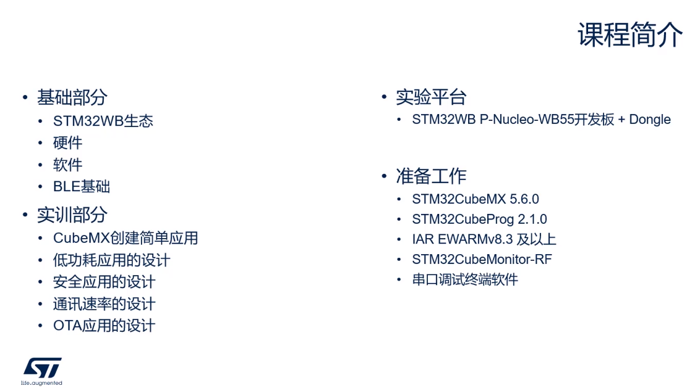
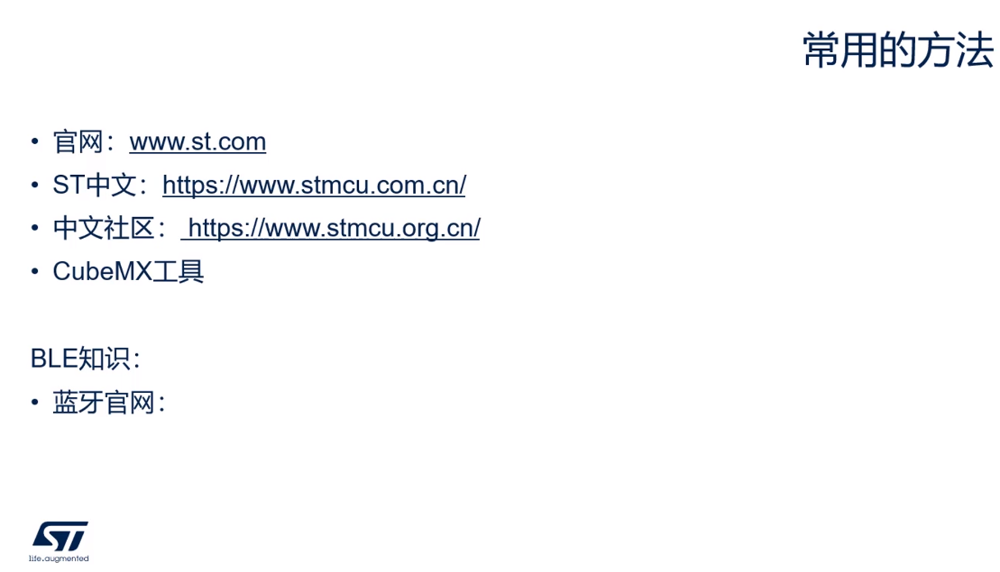

# 导读

## 课程面向对象和结构

### 课堂介绍

ST相关软件在[STM中文官网](https://www.st.com/content/st_com/zh.html)下载

串口调试软件推荐使用[Xshell](https://www.xshellcn.com/xshell.html)、[MobaXterm](https://mobaxterm.mobatek.net/)

## 如何查找STM32WB相关资料

### 常用方法

[STM官网](https://www.stmcu.com.cn/)

[STM中文官网](https://www.st.com/content/st_com/zh.html)

[STM中文社区](https://www.stmcu.org.cn/)

[蓝牙官网](https://www.bluetooth.com/)

