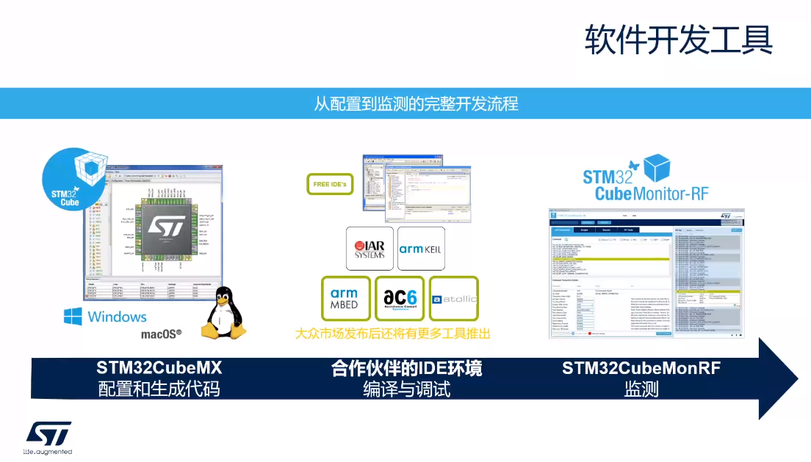
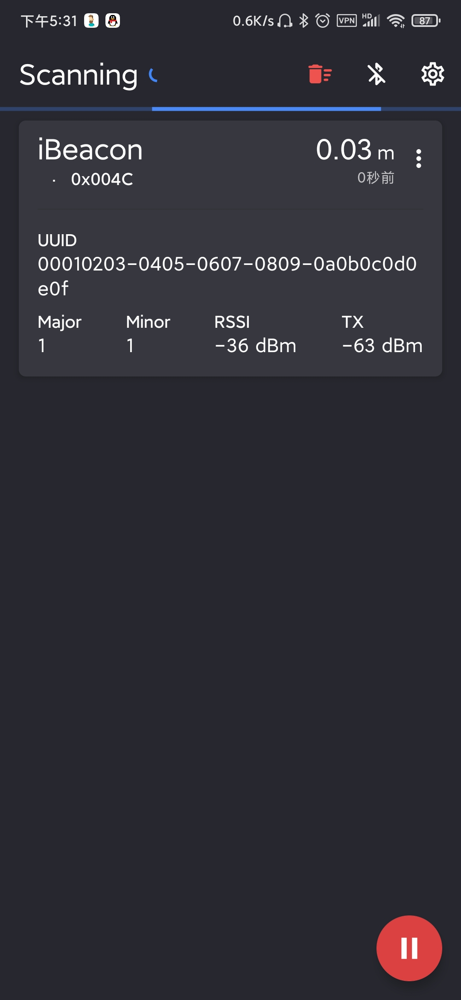

# STM32WB环境搭建

## 软件安装

推荐使用ST官方开发软件，所有ST软件都可在[STM中文官网](https://www.st.com/content/st_com/zh.html)下载

STM32Cube初始化代码生成器[STM32CubeMX](https://www.st.com/zh/development-tools/stm32cubemx.html)

STM32的集成开发环境[STM32CubeIDE](https://www.st.com/zh/development-tools/stm32cubeide.html)

用于STM32产品编程的[STM32CubeProgrammer](https://www.st.com/content/st_com/zh/products/development-tools/software-development-tools/stm32-software-development-tools/stm32-programmers/stm32cubeprog.html)软件

软件工具，用于测试基于STM32的硬件设备的射频性能[STM32CubeMonRF](https://www.st.com/zh/development-tools/stm32cubemonrf.html)

用于STM32 USB-C和Power Delivery 3.0应用的监控和配置软件工具[STM32CubeMonUCPD](https://www.st.com/zh/development-tools/stm32cubemonucpd.html)

在PC上显示用电数据的图形工具[STM32CubeMonPwr](https://www.st.com/zh/development-tools/stm32cubemonpwr.html)

本篇主要讲解使用[STM32CubeProgrammer](https://www.st.com/content/st_com/zh/products/development-tools/software-development-tools/stm32-software-development-tools/stm32-programmers/stm32cubeprog.html)软件下载STM32WB固件升级二进制文件与无线协处理器二进制，使用[STM32CubeProgrammer](https://www.st.com/content/st_com/zh/products/development-tools/software-development-tools/stm32-software-development-tools/stm32-programmers/stm32cubeprog.html)软件的GUI图形化进行查看与更新固件更利于操作。

## 二进制文件下载

### P-NUCLEO-WB55.Nucleo

对于P-NUCLEO-WB55.Nucleo推荐使用ST-LINK（STM32CubeProgrammer GUI）通过SWD / JTAG刷新无线协处理器二进制文件：

1，通过ST-LINK链接开发板，跳线JP1通过（USB_STL）链接电源

2，打开STM32CubeProgrammer GUI（使用2.4.0版或更高版本）并选择“ ST-LINK”，在ST-LINK配置中：（端口：SWD），然后选择“连接”

3，在固件升级服务中：选择“Delete Firmware”（删除固件）

4，读取并升级FUS版本

5，下载FUS（逐级下载，不可跨版本下载，亦不可降级）

File path中选择升级的bin文件，Start address中选择对应版本的安装地址（见bin文件同目录下Release_Notes.html中的地址表）点击“Firmware Upgrade”（固件升级）

6，下载新的无线协议栈（同下载FUS方法）

7，恢复设备为正常模式使用

### P-NUCLEO-WB55.USBDongle

对于P-NUCLEO-WB55.USBDongle推荐使用STM32CubeProgrammer GUI通过USB刷新无线协处理器二进制文件：

1，将开关SW2移至Boot0，通过USB链接开发板

2，打开STM32CubeProgrammer GUI（使用2.4.0版或更高版本）选择Bootloader USB接口，在USB配置中：（端口：USB1），然后选择“Connect”（连接）

3，在固件升级服务中：选择“Delete Firmware”（删除固件）

4，读取并升级FUS版本

5，下载FUS（逐级下载，不可跨版本下载，亦不可降级）

File path中选择升级的bin文件，Start address中选择对应版本的安装地址（见bin文件同目录下Release_Notes.html中的地址表）点击“Firmware Upgrade”（固件升级）

6，下载新的无线协议栈（同下载FUS方法）

7，恢复设备为正常模式使用

## 固件验证

按照上述下载方法将stm32wb5x_FUS_fw.bin固件与stm32wb5x_BLE_Stack_full_fw.bin协议栈下载至开发板，打开STM32Cube_FW_WB_V1.9.0\Projects\P-NUCLEO-WB55.Nucleo\Applications\BLE\BLE_Beacon工程下载到开发板后重启开发板

在Google App Store下载Beacon Scanner

并打开

会看到蓝牙位置扫描信息，至此验证结束