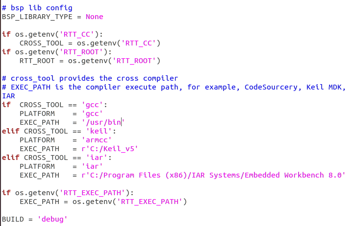
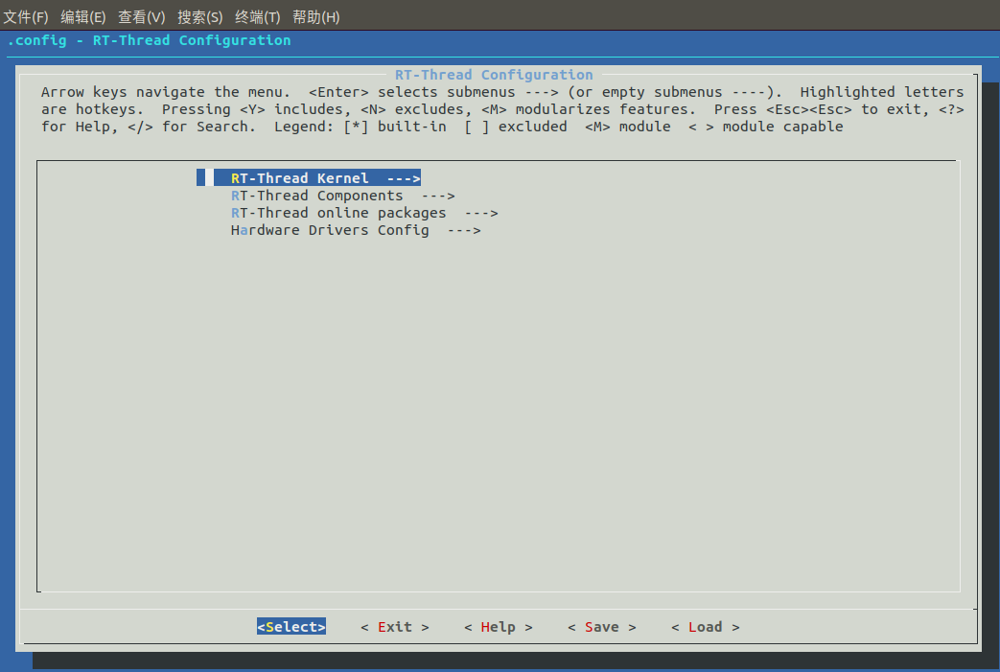
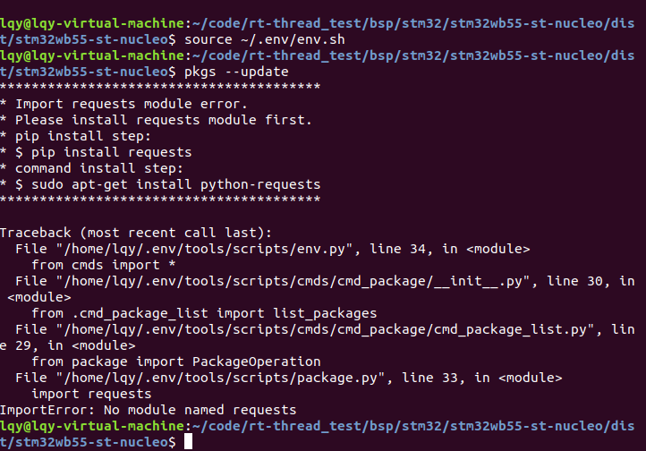
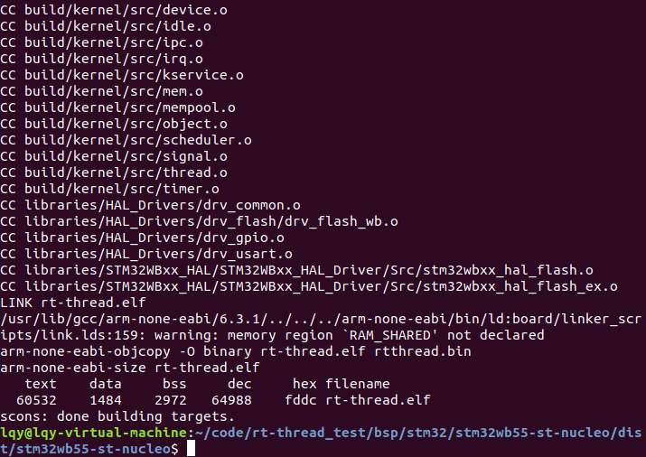

# Linux下搭建 RT-Thread 开发环境

## 前言

相信许多人做单片机开发选择windows是因为方便，易操作，使用keil等IDE，但是做Linux的嵌入式开发，如果用Windows安装交叉编译器编译太耗时，所以许多人同时选择使用Linux下开发，那Linux下如何开发RT-Thread呢？下面我将大致说一下环境的基础搭建。

## 开发前环境准备

### 相关安装

大家都知道Windows下安装软件下载.exe执行安装，Linux下有rpm包安装方式，deb包安装方式，tar.gz源代码包安装方式，tar.bz2源代码包安装方式，apt方式安装方式（安装deb包），此处我们使用apt方式简单快捷。

**注意：**

**apt-get是debian，ubuntu发行版的包管理工具，与红帽中的yum工具非常类似。**

**apt-get命令一般需要[root权限](http://baike.baidu.com/view/3967294.htm)执行，所以一般跟着sudo命令例sudo apt-get xxxx**

安装git

```shell
sudo apt install git 
```

安装编译器

```shell
sudo apt install gcc-arm-none-eabi 

sudo apt install binutils-arm-none-eabi
```

安装 scons

```shell
sudo apt install scons
```

安装 ncurses 库

```shell
sudo apt install libncurses5-dev
```

克隆 RT-Thread 源码

```shell
git clone https://github.com/RT-Thread/rt-thread.git
```

### 配置使用编译器

下载源码后进入你开发版目录修改rtconfig.py 文件中的 `EXEC_PATH`来配置编译器


修改为



至此准备工作结束。

## 工程配置

接下来在使用开发版的根目录下启动终端，输入如下命令来启动配置界面。

```shell
scons --menuconfig
```



是不是熟悉的画面回来了？

**注意：**

**Linux下的配置工具和uboot等配置工具操作一样，返回需按两下ESC**

如果第一次使用该命令将会安装及初始化env工具，在home目录下面生成“.env”文件夹，此文件夹为隐藏文件夹，

env.sh 文件是用于配置环境变量的脚本，执行如下命令使环境变量生效。

```shell
source ~/.env/env.sh
```

如果您已经选择了在线软件包，就可以使用如下命令将软件包下载到 BSP 目录下的 packages 目录。

```shell
pkgs --update
```

如果是第一次安装会失败，如下



这是因为我们没有安装Python-第三方库requests

```shell
sudo apt-get install python-requests
```

之后再运行

```shell
pkgs --update
```

## 编译工程

执行

```shell
scons
```



## 编译成功

**Linux下强烈推荐使用 Vscode 作为代码编辑器（Windows下也推荐，Mac下也推荐，宇宙第一编辑器，哈哈哈）**