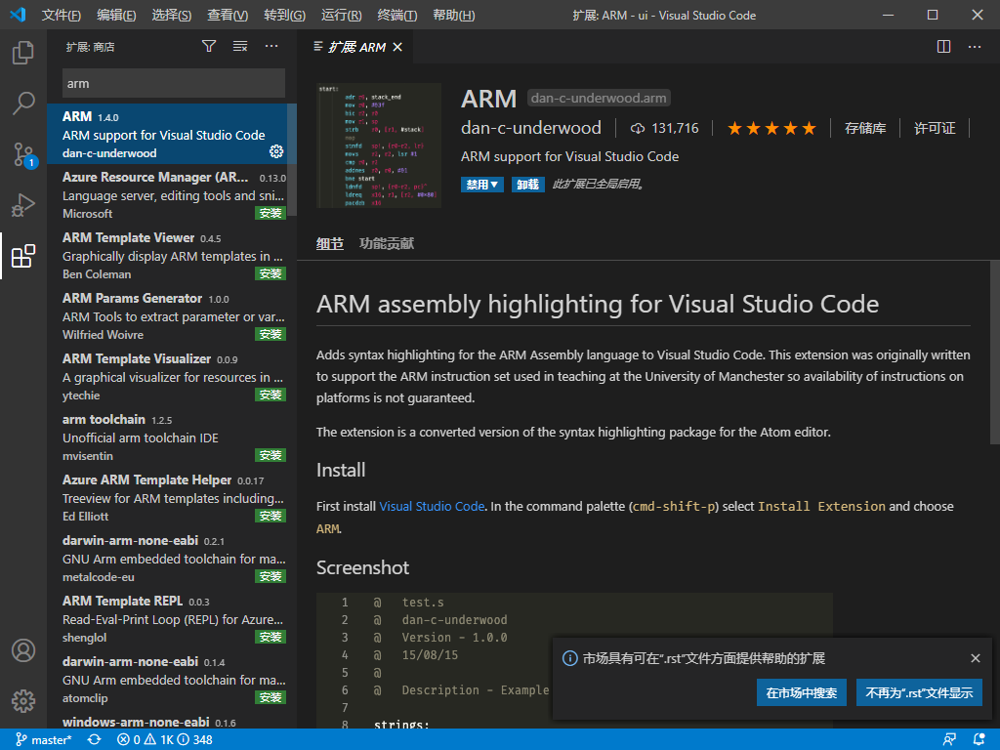
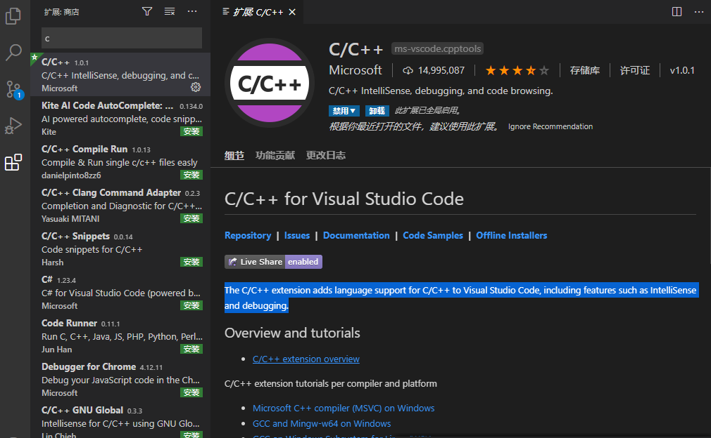
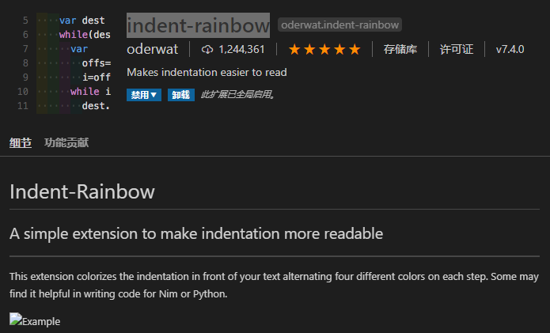
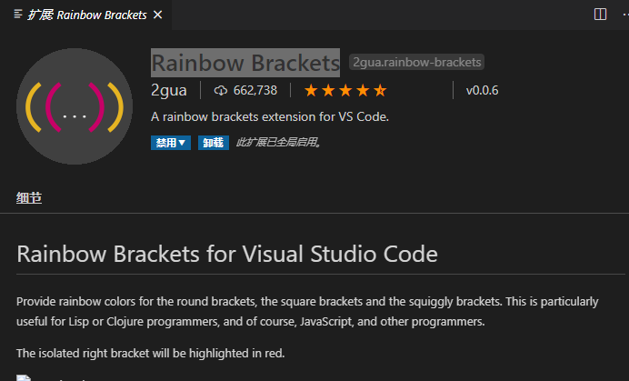
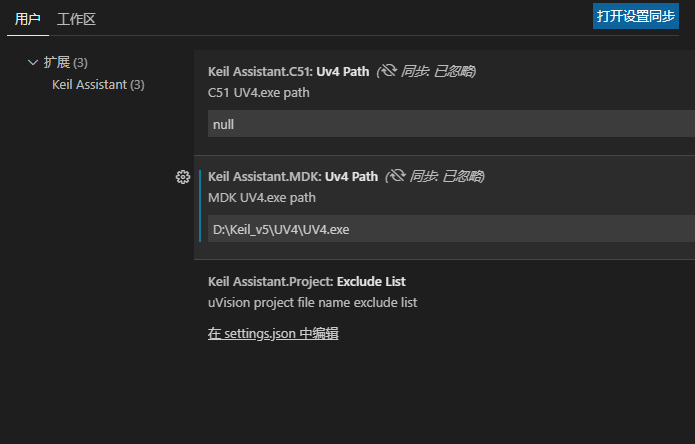
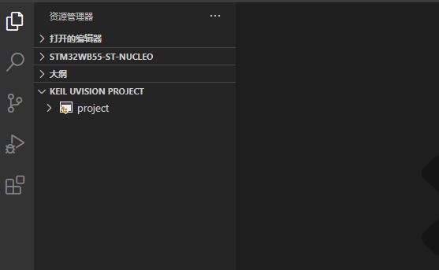
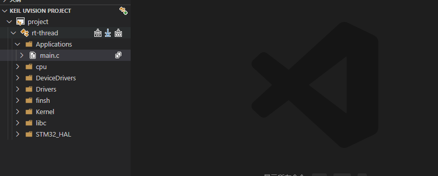

# vscode配合keil开发

## 前言

相信许多人做单片机开发选择keil是因为方便，易上手，但是keil界面丑陋，编辑代码卡顿等诟病让人很不舒服，而vscode作为宇宙第一编辑器深受大家喜爱，如果将vscode配合keil进行开发岂不是美滋滋？

## 准备工作

### 相关安装

我们要使用vscode配合keil进行开发当然要安装vscode和keil这两款软件

[vscode下载地址](https://code.visualstudio.com/)

[keil下载地址](https://www.keil.com/download/)

安装方式都是一直下一步，在此不做赘述

### vscode插件安装

打开vscode后左侧工具栏最下方的方块就是插件扩展

搜索arm进行安装

此插件将ARM汇编语言的语法高亮显示添加到Visual Studio Code。

搜索c/c++进行安装

C / C ++扩展在Visual Studio Code中增加了对C / C ++的语言支持，包括诸如IntelliSense和调试的功能。

搜索Chinese进行安装

这个就不做描述了。。。

搜索indent-rainbow进行安装

此扩展使文本前面的缩进着色，每步交替四种不同的颜色。

搜索Rainbow Brackets进行安装

此扩展为圆括号，方括号和弯曲的括号提供彩虹色。

搜索Keil Assistant进行安装

这是我们的重头戏，使用前需要配置keil目录,进入扩展设置，设置好keil路径

**vscode还有许多方便的插件，小伙伴们可以自行探索安装，这是vscode的特色，无限的可能，在此不进行赘述**

### Keil Assistant的使用

Keil Assistant的使用也很简单，在项目.uvprojx所在目录右键通过vscode打开会发现下方有一个KEIL UVISION PROJECT自动识别你的工程

打开会发现就是自己的项目工程，编译，下载都在，配合rt thread的env工具十分方便

